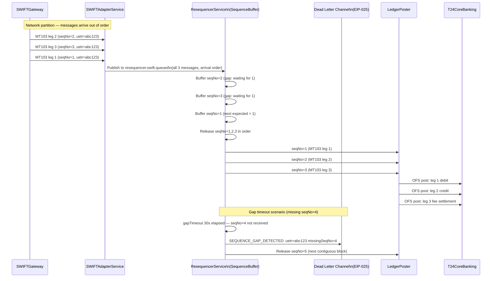

# Resequencer

Status: Draft | Last Reviewed: 2026-05-09 | Owner: @tech-lead-backend
Catalog ID: EIP-013 | Radii
Tier Applicability: T0, T1

## Problem Statement

- SWIFT MT103 messages representing legs of the same payment chain (e.g., a correspondent-banking relay through two intermediary banks) arrive at Techcombank's `SWIFTGateway` out of sequence when network partitions or SWIFT GPI routing changes cause message legs to take different paths. A ledger-posting service that consumes these messages in arrival order will compute incorrect intermediate balances and may trigger false fraud flags or incorrect nostro reconciliation.
- During disaster-recovery failover events, Techcombank's event-sourcing ledger replays stored SWIFT transaction events to reconstruct the account balance. If the replay source has messages stored in arrival-order (not sequence-order), the reconstructed balance will diverge from the authoritative T24 Core Banking balance — a BCBS 239 §6 data-accuracy defect.
- Multi-leg ISO 20022 `camt.060` account report messages are published in sequence-numbered batches. When the SWIFT adapter restarts mid-batch, unacknowledged messages may be re-published out of sequence relative to messages that were published before the restart. The `LedgerPoster` must not post entries from a later sequence number before all prior sequence numbers for the same account have been posted.
- The SWIFT GPI Tracker assigns a per-payment `sequenceNumber` that increases monotonically per UETR (Unique End-to-end Transaction Reference). Downstream analytics must consume events in `sequenceNumber` order to produce accurate time-series balance data for regulatory reporting (SBV Circular 35/2015/TT-NHNN large-value transaction audit trail).
- At Techcombank's SWIFT throughput peak (end-of-business, 16:00–17:00 VNT), up to 3,000 SWIFT messages per minute arrive. A naively synchronous resequencer that blocks until all gaps are filled would become a bottleneck. The resequencer must buffer and release messages as soon as contiguous sequences are available, without waiting for the full window to close.
- The resequencer must handle permanent gaps: if a SWIFT message with sequence N is lost (no SWIFT delivery guarantee at the transport level in a disaster scenario), the resequencer must not block indefinitely. A configurable `gapTimeout` triggers release of the next contiguous block starting from N+1 after a threshold — with an alert and a DLT entry for the missing sequence — so downstream processing is not permanently stalled.

## Solution

A Resequencer buffers incoming out-of-order SWIFT messages in a `SequenceBuffer` keyed by `(uetr, sequenceNumber)`. When contiguous sequences from the next expected sequence number onward are present in the buffer, the Resequencer releases them in order to the downstream `LedgerPoster`. A configurable `gapTimeout` (default 30 seconds) triggers release of the next contiguous block even if a gap exists, emitting a `SEQUENCE_GAP_DETECTED` event to the Dead Letter Channel for the missing sequence.



## Implementation Guidelines

1. **Implement the `SequenceBuffer` as a Redis sorted set keyed by `(uetr, sequenceNumber)`.** Redis sorted sets provide O(log N) insert and O(K) range scan — ideal for maintaining a per-UETR sequence buffer across multiple resequencer pods. Each element is the serialised `SWIFTMessage`; the score is the `sequenceNumber`.

   ```java
   @Component
   @RequiredArgsConstructor
   @Slf4j
   public class SequenceBuffer {

       private final RedisTemplate<String, SWIFTMessage> redisTemplate;
       private static final Duration BUFFER_TTL = Duration.ofMinutes(10);

       /** Add a message to the sorted-set buffer for its UETR. */
       public void buffer(SWIFTMessage message) {
           String key = bufferKey(message.getUetr());
           redisTemplate.opsForZSet()
               .add(key, message, message.getSequenceNumber());
           redisTemplate.expire(key, BUFFER_TTL);
       }

       /** Return all messages with sequenceNumber in [from, to] in ascending order. */
       public List<SWIFTMessage> drainContiguous(String uetr, long from, long to) {
           String key = bufferKey(uetr);
           Set<SWIFTMessage> range = redisTemplate.opsForZSet()
               .rangeByScore(key, from, to);
           if (range != null && !range.isEmpty()) {
               redisTemplate.opsForZSet().removeRangeByScore(key, from, to);
               return new ArrayList<>(range);
           }
           return Collections.emptyList();
       }

       /** Return the minimum (lowest) sequence number currently buffered for a UETR. */
       public OptionalLong lowestBufferedSeqNo(String uetr) {
           Set<SWIFTMessage> lowest = redisTemplate.opsForZSet()
               .rangeByScore(bufferKey(uetr), Double.NEGATIVE_INFINITY,
                   Double.POSITIVE_INFINITY, 0, 1);
           if (lowest == null || lowest.isEmpty()) return OptionalLong.empty();
           return OptionalLong.of((long) lowest.iterator().next().getSequenceNumber());
       }

       private String bufferKey(String uetr) {
           return "rsq:seq:" + uetr;
       }
   }
   ```

2. **Implement the `ResequencerService` as a `@KafkaListener` that buffers incoming messages and attempts to drain contiguous sequences on each arrival.** The service maintains a `nextExpected` cursor per UETR in Redis, advancing it as sequences are drained and released.

   ```java
   @Component
   @RequiredArgsConstructor
   @Slf4j
   public class ResequencerService {

       private final SequenceBuffer buffer;
       private final NextExpectedCursorStore cursorStore;
       private final KafkaTemplate<String, SWIFTMessage> kafkaTemplate;
       private final MeterRegistry metrics;

       @KafkaListener(
           topics = "com.techcombank.swift.resequencer.queued",
           groupId = "swift-resequencer",
           concurrency = "1"  // single-threaded per partition — ordering requirement
       )
       public void receive(
               @Payload SWIFTMessage message,
               @Header("X-Correlation-Id") String correlationId,
               Acknowledgment ack) {

           MDC.put("correlationId", correlationId);
           MDC.put("uetr", message.getUetr());

           buffer.buffer(message);

           log.info("RSQ buffered: uetr={} seqNo={} correlationId={}",
               message.getUetr(), message.getSequenceNumber(), correlationId);

           metrics.counter("rsq.buffered",
               "uetr_prefix", message.getUetr().substring(0, 8)).increment();

           drainContiguousBlock(message.getUetr(), correlationId);
           ack.acknowledge();
       }

       private void drainContiguousBlock(String uetr, String correlationId) {
           long nextExpected = cursorStore.getNextExpected(uetr);

           OptionalLong lowest = buffer.lowestBufferedSeqNo(uetr);
           if (lowest.isEmpty() || lowest.getAsLong() > nextExpected) {
               // Gap: nothing to release yet
               log.debug("RSQ gap: uetr={} nextExpected={} lowestBuffered={}",
                   uetr, nextExpected,
                   lowest.isPresent() ? lowest.getAsLong() : "none");
               return;
           }

           // Find the upper end of the contiguous block
           long upper = nextExpected;
           while (buffer.lowestBufferedSeqNo(uetr).isPresent()
               && buffer.lowestBufferedSeqNo(uetr).getAsLong() == upper + 1) {
               upper++;
           }

           List<SWIFTMessage> toRelease =
               buffer.drainContiguous(uetr, nextExpected, upper);

           toRelease.forEach(msg -> {
               kafkaTemplate.send(
                   "com.techcombank.swift.ledger.queued",
                   msg.getUetr(),
                   msg);
               log.info("RSQ released: uetr={} seqNo={} correlationId={}",
                   msg.getUetr(), msg.getSequenceNumber(), correlationId);
               metrics.counter("rsq.released").increment();
           });

           cursorStore.setNextExpected(uetr, upper + 1);
       }
   }
   ```

3. **Implement the gap-timeout mechanism as a scheduled task** that scans all active UETRs with buffered messages and triggers gap-timeout releases when the gap has persisted beyond the configured threshold.

   ```java
   @Component
   @RequiredArgsConstructor
   @Slf4j
   public class GapTimeoutScheduler {

       private final NextExpectedCursorStore cursorStore;
       private final SequenceBuffer buffer;
       private final KafkaTemplate<String, SWIFTMessage> kafkaTemplate;
       private final KafkaTemplate<String, GapDetectedEvent> dltTemplate;
       private final MeterRegistry metrics;

       @Value("${techcombank.swift.resequencer.gap-timeout-ms:30000}")
       private long gapTimeoutMs;

       @Scheduled(fixedDelayString =
           "${techcombank.swift.resequencer.gap-scan-interval-ms:5000}")
       public void scanForGaps() {
           Set<String> activeUetrs = cursorStore.getActiveUetrs();

           for (String uetr : activeUetrs) {
               long nextExpected = cursorStore.getNextExpected(uetr);
               long gapSince = cursorStore.getGapSince(uetr, nextExpected);
               long gapAge = System.currentTimeMillis() - gapSince;

               if (gapAge >= gapTimeoutMs) {
                   log.warn("RSQ gap timeout: uetr={} missingSeqNo={} gapAgeMs={}",
                       uetr, nextExpected, gapAge);

                   metrics.counter("rsq.gap.timeout",
                       "uetr_prefix", uetr.substring(0, 8)).increment();

                   // Emit gap event to DLT
                   dltTemplate.send("com.techcombank.swift.resequencer.gap-dlt",
                       uetr, new GapDetectedEvent(uetr, nextExpected, gapAge));

                   // Advance cursor past the gap and release next contiguous block
                   OptionalLong nextAvailable = buffer.lowestBufferedSeqNo(uetr);
                   if (nextAvailable.isPresent()) {
                       cursorStore.setNextExpected(uetr, nextAvailable.getAsLong());
                       log.info("RSQ gap skip: uetr={} skipping seqNo={} next={}",
                           uetr, nextExpected, nextAvailable.getAsLong());
                   }
               }
           }
       }
   }
   ```

4. **Externalise resequencer configuration to Spring Cloud Config.** The gap timeout, buffer TTL, and scan interval must be tunable without redeployment. Different message types (MT103 vs camt.060) may require different gap thresholds.

   ```yaml
   techcombank:
     swift:
       resequencer:
         gap-timeout-ms: 30000           # wait 30s for a gap to fill before skipping
         gap-scan-interval-ms: 5000      # scan for stale gaps every 5s
         buffer-ttl-minutes: 10          # Redis buffer TTL per UETR
         max-buffer-size-per-uetr: 500   # reject buffering if a UETR has > 500 queued messages
         release-batch-size: 100         # release up to 100 messages per drain cycle
   ```

5. **Maintain the `nextExpected` cursor in Redis with optimistic locking** to prevent race conditions when multiple resequencer instances process messages for the same UETR simultaneously. Use a Lua script for atomic compare-and-set of the cursor.

   ```java
   @Component
   @RequiredArgsConstructor
   public class NextExpectedCursorStore {

       private final RedisTemplate<String, Long> redisTemplate;
       private static final Duration CURSOR_TTL = Duration.ofMinutes(30);

       private static final String CAS_SCRIPT =
           "local current = redis.call('GET', KEYS[1]) " +
           "if current == false or tonumber(current) == tonumber(ARGV[1]) then " +
           "  redis.call('SET', KEYS[1], ARGV[2], 'EX', ARGV[3]) " +
           "  return 1 " +
           "else return 0 end";

       public long getNextExpected(String uetr) {
           Long val = redisTemplate.opsForValue().get(cursorKey(uetr));
           return val != null ? val : 1L; // sequence numbers start at 1
       }

       public boolean setNextExpected(String uetr, long expected) {
           Long current = redisTemplate.opsForValue().get(cursorKey(uetr));
           Long result = redisTemplate.execute(
               RedisScript.of(CAS_SCRIPT, Long.class),
               List.of(cursorKey(uetr)),
               String.valueOf(current != null ? current : 0),
               String.valueOf(expected),
               String.valueOf(CURSOR_TTL.getSeconds()));
           return Long.valueOf(1L).equals(result);
       }

       public Set<String> getActiveUetrs() {
           Set<String> keys = redisTemplate.keys("rsq:cursor:*");
           if (keys == null) return Set.of();
           return keys.stream()
               .map(k -> k.replace("rsq:cursor:", ""))
               .collect(Collectors.toSet());
       }

       private String cursorKey(String uetr) {
           return "rsq:cursor:" + uetr;
       }
   }
   ```

6. **Emit structured log entries at each lifecycle event.** Every buffer, release, gap detection, and gap timeout must produce a log entry containing `uetr`, `sequenceNumber`, `nextExpected`, and `correlationId`. These logs form the audit trail for sequence integrity under BCBS 239 §6 and must be forwarded to the SIEM via the ELK pipeline.

## When to Use / When NOT to Use

**Use when:**
- Messages carry monotonic sequence numbers that represent a meaningful processing order (ledger entries, transaction legs, event sourcing streams).
- The downstream consumer is order-sensitive and incorrect ordering produces incorrect results (balance computation, audit trail reconstruction).
- Out-of-order delivery is an expected operational reality (network partitions, adapter restarts, multi-path routing).
- The expected out-of-order window is bounded (i.e., gaps are seconds to minutes, not hours to days).

**Do NOT use when:**
- Message ordering is not semantically meaningful for the downstream consumer — the overhead of buffering and ordering is waste.
- The sequence number space is sparse or non-monotonic — the resequencer cannot determine when a gap is permanent vs. delayed.
- Messages are large and buffering many out-of-order messages would exhaust Redis memory — use a streaming reorder algorithm instead.
- Gap frequency is high and gaps are often permanent — the resequencer becomes a perpetual gap-timeout machine; investigate the upstream reliability issue instead.

## Variants & Trade-offs

| Variant | When | Trade-off |
|---|---|---|
| Per-UETR buffer (this doc) | Each UETR is an independent sequence space | Most correct; Redis key space grows linearly with active UETRs; TTL prevents unbounded growth |
| Global sequence buffer | All messages share one sequence space | Simpler; one global cursor; unsuitable when different message streams have independent sequence spaces |
| Windowed resequencer | Release when all messages in a fixed-size window are present | Bounds memory; may discard messages arriving outside the window; suitable for high-volume streams with predictable out-of-order distance |
| In-memory buffer (single pod) | Low throughput, single-instance deployment | Zero Redis dependency; not suitable for T0/T1 (no HA); buffer lost on pod restart |
| Kafka Streams resequencer | Event-sourcing platform already on Kafka Streams | Native KTable state store; built-in changelog topic for HA; higher operational complexity if Kafka Streams is not already in use |

## NFR Acceptance Criteria

```yaml
nfr:
  catalog_id: EIP-013
  service_name: swift-resequencer
  tier: T0

  availability:
    target: 99.99%
    failure_mode: "resequencer crash → messages remain on resequencer.swift.queued (Kafka retention 72h); Redis buffer survives pod restart"
    recovery: "pod restart < 30s; Redis cursor and buffer state intact; processing resumes with no message loss"

  performance:
    buffering_latency_p95_ms: 5       # time from receive to buffer write
    drain_latency_p95_ms: 10          # time from gap fill to release publish
    gap_timeout_ms: 30000
    gap_scan_interval_ms: 5000
    throughput_messages_per_minute: 3000
    max_buffer_per_uetr: 500

  correctness:
    sequence_integrity: "LedgerPoster receives messages for each UETR in strict ascending sequence number order"
    gap_detection: "all sequence gaps detected and emitted to DLT within gap-scan-interval-ms of the timeout expiry"
    no_message_loss: "every buffered message is either released in order or recorded in DLT with SEQUENCE_GAP_DETECTED reason"
    no_duplicate_release: "each sequenceNumber for a given UETR released exactly once to LedgerPoster"

  observability:
    required_metrics:
      - rsq_buffered_total (by uetr_prefix)
      - rsq_released_total
      - rsq_gap_timeout_total (by uetr_prefix)
      - rsq_buffer_size_per_uetr (gauge, by uetr)
      - rsq_gap_age_ms (histogram)
    log_fields: [uetr, sequenceNumber, nextExpected, action, gapAgeMs, correlationId]
    alerts:
      - name: RQ_GapTimeout_Rate_High
        condition: "rate(rsq_gap_timeout_total[5m]) > 1"
        severity: High
      - name: RQ_BufferSize_Critical
        condition: "max(rsq_buffer_size_per_uetr) > 400"
        severity: High
      - name: RQ_ConsumerLag_Growing
        condition: "kafka_consumergroup_lag{topic='com.techcombank.swift.resequencer.queued'} > 1000"
        severity: Critical
```

## Compliance Mapping

| Layer | Reference | Section/Control | How this pattern satisfies |
|---|---|---|---|
| Ring 0 (global) | Enterprise Integration Patterns (Hohpe/Woolf) | Chapter 7 — Resequencer | Canonical pattern; this doc applies it to SWIFT MT103 multi-leg sequence ordering and event-sourcing ledger replay at Techcombank |
| Ring 0 | NIST SP 800-53 | SI-10 Information Input Validation / AU-10 Non-Repudiation | Sequence number validation prevents out-of-order ledger entries; every gap detection event is logged and forwarded to SIEM for non-repudiation |
| Ring 0 | Event Sourcing pattern (CQRS/ES) | Event ordering guarantee | The resequencer is the ordering layer that enables accurate event replay; without it, event-sourced balance reconstruction is non-deterministic |
| Ring 1 (international banking) | BCBS 239 §6 | Accuracy — sequence integrity is a data accuracy control | Correct sequence ordering ensures ledger entries are posted in the authoritative T24 transaction order; gap detection ensures no event is silently skipped |
| Ring 1 | SWIFT gpi (Global Payments Innovation) Tracker | UETR-level tracking and sequencing requirements | The resequencer uses the UETR as the correlation key, maintaining per-UETR sequence order as required by SWIFT gpi tracking obligations |
| Ring 1 | SWIFT Customer Security Programme (CSP) | Mandatory Security Control 2.1 — Traceability | All SWIFT message sequence events are logged with UETR, sequenceNumber, and correlationId; gap events are forwarded to SIEM |
| Ring 2 (Vietnam) | SBV Circular 35/2015/TT-NHNN §IV ⚠️ (working summary — pending Legal review) | Large-value transaction audit trail — chronological ordering | CITAD/SWIFT large-value transactions must be reconstructible in authoritative order; the resequencer guarantees this for the ledger replay path |
| Ring 2 | SBV Circular 09/2020 §IV.2 ⚠️ (working summary — pending Legal review) | Operational continuity — payment processing integrity | Redis-backed buffer survives pod failures; Kafka retention ensures no message is lost during resequencer downtime within the 72-hour retention window |

## Cost / FinOps Notes

- **Redis memory** — Each buffered SWIFT message is approximately 2KB. At 3,000 messages/minute peak and a maximum 30-second gap window: 3,000/60 × 30 × 2KB = 3MB peak working set per active UETR sequence. With 100 concurrent active UETRs: 300MB Redis footprint during peak. Standard Redis instance (8GB, shared): accommodates the resequencer workload with significant headroom.
- **Redis cursor store** — One cursor key per active UETR (TTL 30 minutes). At 10,000 unique UETRs/day: 10,000 × 20 bytes = 200KB — negligible.
- **Kafka topics** — 1 inbound resequencer topic + 1 ordered ledger topic + 1 gap DLT topic. T0 configuration (RF=3, 72-hour retention for SWIFT messages). Estimated storage: USD 60/month for resequencer-specific topics.
- **Gap-timeout scanning cost** — The `GapTimeoutScheduler` scans all active UETR cursors every 5 seconds. Redis `KEYS rsq:cursor:*` is an O(N) operation — use `SCAN` in production with a cursor to avoid blocking the Redis event loop. At 10,000 active UETRs: SCAN completes in < 50ms per scan cycle.
- **Resequencer compute** — 3 pods × 2 vCPU / 2GB each. Single-threaded per Kafka partition (ordering constraint). Estimated compute: USD 45/month.
- **Cost of incorrect ordering** — A ledger entry posted in wrong sequence causes an incorrect intermediate balance, potentially triggering false fraud alerts (false positive investigation cost) or incorrect overdraft charges (regulatory and reputational risk). The resequencer's cost is justified by the cost of sequence-related errors it prevents.

## Threat Model Summary

- **Sequence number spoofing** — An attacker injects a SWIFT message with a low sequence number (e.g., seqNo=1 for a UETR that has already advanced to seqNo=50), causing the resequencer to buffer a fraudulent message that will be released as the first in sequence. Mitigation: each SWIFT message must be authenticated by the SWIFT gateway adapter via SWIFT's MX-signing (SWIFTNet PKI signature); the resequencer verifies the signature before buffering; unauthenticated messages are rejected to the DLT.
- **Redis buffer overflow** — An attacker floods the resequencer with SWIFT messages for a single UETR, exhausting the buffer limit and causing real messages to be dropped. Mitigation: `maxBufferSizePerUetr` (default 500) enforced in `SequenceBuffer.buffer`; messages exceeding the limit are routed to DLT with `BUFFER_OVERFLOW`; per-UETR rate limiting in the SWIFT adapter (max 100 messages/minute per UETR).
- **Cursor rollback** — An attacker manipulates the Redis cursor to roll back `nextExpected` to 1, causing all previously processed messages to be re-released in order — potentially re-posting all ledger entries and creating duplicate credits. Mitigation: cursor updates use optimistic locking (Lua CAS script); the cursor is monotonically increasing — the CAS script rejects any update that sets a lower value than the current cursor; Redis ACLs restrict cursor write access to the resequencer service account only.
- **Gap timeout manipulation** — A misconfigured `gapTimeoutMs = 100` causes the resequencer to skip gaps almost immediately, releasing out-of-order messages as if in-order. Mitigation: `@Validated` constraint enforces `gapTimeoutMs >= 5000` at Spring context startup; configuration changes require architecture review and are version-controlled in Git.
- **UETR collision** — Two different payments happen to generate the same UETR (probabilistically near-impossible for SWIFT-generated UETRs but possible in test/non-SWIFT scenarios). Mitigation: the SWIFT gateway validates UETR uniqueness against a 24-hour deduplication store (Redis set) before publishing to the resequencer topic; duplicate UETR generates an alert and DLT entry.

## Operational Runbook (stub)

1. **Alert: RQ_GapTimeout_Rate_High** — More than 1 gap timeout per 5 minutes. Inspect the gap DLT topic `com.techcombank.swift.resequencer.gap-dlt` for the affected UETRs and missing sequence numbers. Determine whether the SWIFT adapter for those UETRs is experiencing message loss (check SWIFT gateway adapter logs and SWIFT Alliance Access error console). If the missing messages are genuinely lost, escalate to the SWIFT Operations team for message recovery. The resequencer will have already advanced past the gap; recovered messages arriving late will be released in the next available contiguous block.
2. **Alert: RQ_BufferSize_Critical** — A UETR buffer has grown beyond 400 messages. Check whether a gap at a very low sequence number is causing a long tail of later messages to be buffered indefinitely. Inspect the UETR in question via Kibana (`rsq.uetr = <uetr>`). If the gap is permanent, manually trigger gap advance: publish a `GapAdvanceCommand` to the admin topic `com.techcombank.swift.resequencer.admin` with the UETR and the next expected sequence number.
3. **Alert: RQ_ConsumerLag_Growing** — The resequencer Kafka consumer group is falling behind. Check resequencer pod health (`kubectl get pods -n swift-processing`). The single-threaded constraint (ordering requirement) limits throughput to the speed of one consumer per partition. If peak SWIFT volume exceeds single-consumer capacity, increase the number of Kafka partitions for the resequencer topic (and add corresponding pods) — note that partitioning by UETR is required to maintain per-UETR ordering.
4. **Event-sourcing ledger replay** — When replaying the ledger to reconstruct balances, consume messages from `com.techcombank.swift.ledger.queued` (the resequencer's output topic), not from `com.techcombank.swift.resequencer.queued` (the input topic). The output topic is the authoritative ordered stream. If the output topic retention has expired, re-run the resequencer over the input topic (if within retention) to regenerate the ordered output.
5. **Resequencer restart during active gap** — If the resequencer restarts while a gap is being timed out, the Redis gap-since timestamp is preserved. The `GapTimeoutScheduler` will continue the gap-age calculation correctly on the restarted pod. No manual intervention required unless the restart happens after the gap-timeout fires and the DLT event needs re-processing.

## Test Strategy (stub)

- **Unit tests** — Test `SequenceBuffer.buffer` and `drainContiguous`: buffer messages with seqNos [1, 3, 2], drain from 1, assert messages returned in order [1, 2, 3]. Test `ResequencerService.receive` with an in-order stream, an out-of-order stream, and a stream with a permanent gap. Test `GapTimeoutScheduler.scanForGaps`: mock Redis cursor with a stale gap, assert DLT event is emitted and cursor advances.
- **Integration tests** — Embedded Kafka + embedded Redis. Publish 10 SWIFT messages in shuffled order to the resequencer input topic. Assert the output ledger topic receives messages in strict ascending sequence number order. Assert the cursor advances correctly.
- **Gap-timeout integration tests** — Publish messages for seqNos [1, 2, 4, 5] (gap at seqNo=3). Assert seqNos [1, 2] are released immediately. Wait for gap timeout (reduce to 500ms in tests). Assert DLT receives a `GapDetectedEvent` for seqNo=3. Assert seqNos [4, 5] are released after gap advance.
- **Redis failure tests** — Simulate Redis unavailability during buffering. Assert that the resequencer emits an error metric and continues consuming from Kafka (messages remain on input topic); no message is silently discarded. Restore Redis; assert buffering resumes.
- **Ordering property tests** — Use jqwik to generate random permutations of N messages (N in [2, 100]) for a single UETR. Assert the resequencer always releases them in ascending sequence order, regardless of arrival permutation.
- **Load tests** — Publish 3,000 messages/minute in random order for 50 concurrent UETRs. Assert P95 drain latency < 10ms, Redis memory stays within bounds, and the ordered output topic receives all messages in sequence.

## Related Patterns

- [EIP-004 Message Router](message-router.md) — Routes messages to the correct handler; the Resequencer orders them before they reach the handler
- [EIP-014 Composed Message Processor](composed-message-processor.md) — The Resequencer may be needed to restore order after a CMP splits and reassembles messages through parallel processors
- [EIP-024 Idempotent Receiver](idempotent-receiver.md) — The LedgerPoster must be idempotent; a gap-timeout release followed by late arrival of the missing message could cause a duplicate release
- [EIP-025 Dead Letter Channel](dead-letter-channel.md) — Receives `SEQUENCE_GAP_DETECTED` and `BUFFER_OVERFLOW` events from the Resequencer
- [EIP-009 Message Store](message-store.md) — The Redis sorted-set buffer is a specialised Message Store; EIP-009 covers the general pattern
- [INT-001 Saga Orchestration](../integration/saga-orchestration.md) — Multi-leg SWIFT payments that require compensating transactions on out-of-sequence failures may combine Resequencer with Saga Orchestration

## References

- Hohpe, G. & Woolf, B. — Enterprise Integration Patterns (Addison-Wesley), Chapter 7: Resequencer
- SWIFT MT103 — Single Customer Credit Transfer Message Standard
- SWIFT gpi (Global Payments Innovation) — UETR specification and tracking requirements
- SWIFT Customer Security Programme (CSP) — Mandatory security controls for SWIFT users
- SBV Circular 35/2015/TT-NHNN — Large-value payment regulations (CITAD/SWIFT)
- Spring Integration Reference — Resequencer, MessageGroupStore, RedisMessageGroupStore
- Redis Documentation — Sorted Sets, Lua scripting, SCAN command
- Resilience4j — Rate Limiter (for per-UETR rate limiting in the SWIFT adapter)

---
**Key Takeaway**: The Resequencer guarantees that Techcombank's LedgerPoster and event-sourcing replay always receive SWIFT MT103 messages in authoritative sequence-number order — regardless of network-induced arrival disorder — with a configurable gap-timeout that prevents permanent stalls while emitting auditable DLT events for every skipped sequence under BCBS 239.
