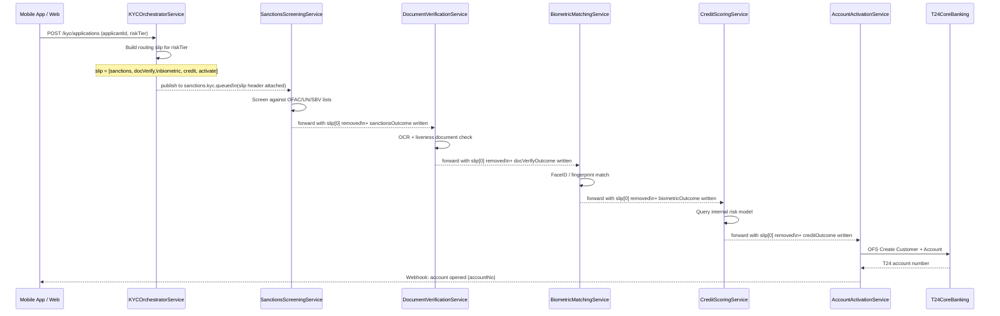

# Routing Slip

Status: Draft | Last Reviewed: 2026-05-09 | Owner: @tech-lead-backend
Catalog ID: EIP-016 | Radii
Tier Applicability: T0, T1

## Problem Statement

- Techcombank's KYC onboarding pipeline must execute five distinct compliance checks — sanctions screening, document verification, biometric matching, credit scoring, and final account activation — in a mandatory sequence before an applicant can open an account. Hard-coding this sequence into a single orchestration service creates a monolithic dependency chain where a change to any one step (e.g., upgrading the biometric matching vendor) requires redeployment of the entire orchestrator.
- Regulatory requirements evolve: SBV Circular 16/2020 mandates that document verification must precede biometric matching, and FATF guidance may require additional PEP (Politically Exposed Person) screening for high-risk applicants. The pipeline must support different processing sequences for different applicant risk tiers without duplicating pipeline code.
- Each KYC step is owned by a different domain team (Compliance, Identity, Risk). A centralised orchestrator that calls all five steps becomes a shared-ownership service with high coordination overhead. Each team should be able to deploy its service independently and be invoked only when the routing slip designates it as the next step.
- Partial failures mid-pipeline are common: biometric matching may time out while sanctions screening succeeds. The pipeline must be resumable from the last completed step — not restarted from scratch — to avoid re-querying sanctions databases and incurring duplicate screening fees.
- Audit requirements demand a full per-applicant trail showing which services processed the application, in what order, with timestamps and outcomes. This trail must be derivable from the message's routing slip header — not reconstructed from distributed logs across five services.
- At peak digital onboarding periods (campaigns, Tết season), Techcombank sees 2,000 concurrent KYC applications. Each step has different SLA times (sanctions: < 5s, biometric: < 8s). The pipeline must be asynchronous to avoid thread exhaustion; each step executes independently when its turn arrives.

## Solution

A Routing Slip is a list of processor addresses attached to the message as a header. When a KYC application arrives, the `KYCOrchestratorService` stamps a routing slip — an ordered list of processing step queue addresses — derived from the applicant's risk tier. Each step's handler reads the slip header, executes its logic, writes its outcome back into the message, removes itself from the front of the slip, and forwards the message to the next address in the slip. When the slip is empty, the final step (account activation) posts the completed application to T24 Core Banking.



## Implementation Guidelines

1. **Encode the routing slip as a JSON array in a Kafka message header.** Each element is the Kafka topic name for the next processor. The `KYCOrchestratorService` builds the slip from a `RoutingSlipPolicy` bean that maps `RiskTier` to an ordered list of step topics.

   ```java
   @Component
   @RequiredArgsConstructor
   @Slf4j
   public class KYCOrchestratorService {

       private final RoutingSlipPolicy slipPolicy;
       private final KafkaTemplate<String, KYCApplication> kafkaTemplate;

       public void initiateKyc(KYCApplication application) {
           List<String> slip = slipPolicy.buildSlip(application.getRiskTier());
           String correlationId = UUID.randomUUID().toString();

           log.info("KYC routing slip created: applicantId={} riskTier={} "
               + "steps={} correlationId={}",
               application.getApplicantId(),
               application.getRiskTier(),
               slip, correlationId);

           publishToNextStep(application, slip, correlationId);
       }

       private void publishToNextStep(
               KYCApplication application,
               List<String> remainingSlip,
               String correlationId) {

           if (remainingSlip.isEmpty()) {
               log.warn("KYC slip exhausted without activation: applicantId={}",
                   application.getApplicantId());
               return;
           }

           String nextTopic = remainingSlip.get(0);
           List<String> nextSlip = remainingSlip.subList(1, remainingSlip.size());

           ProducerRecord<String, KYCApplication> record =
               new ProducerRecord<>(nextTopic, application.getApplicantId(), application);
           record.headers()
               .add("X-Routing-Slip", toJson(nextSlip).getBytes(StandardCharsets.UTF_8))
               .add("X-Correlation-Id", correlationId.getBytes(StandardCharsets.UTF_8))
               .add("X-Slip-Step", nextTopic.getBytes(StandardCharsets.UTF_8));

           kafkaTemplate.send(record);
       }

       private String toJson(List<String> slip) {
           // ObjectMapper injection omitted for brevity
           return slip.stream()
               .map(s -> "\"" + s + "\"")
               .collect(Collectors.joining(",", "[", "]"));
       }
   }
   ```

2. **Define the `RoutingSlipPolicy` as an externalisable configuration bean** so that different risk tiers and product types can have different step sequences without code changes.

   ```java
   @Component
   @ConfigurationProperties(prefix = "techcombank.kyc.routing-slip")
   @Getter @Setter
   public class RoutingSlipPolicy {

       // Injected from application.yml — e.g.:
       // standard: [sanctions, doc-verify, biometric, credit, activate]
       // high-risk: [sanctions, pep-screening, doc-verify, biometric, credit, activate]
       private Map<String, List<String>> tierSlips;

       public List<String> buildSlip(RiskTier tier) {
           List<String> slip = tierSlips.get(tier.name().toLowerCase());
           if (slip == null || slip.isEmpty()) {
               throw new IllegalArgumentException(
                   "No routing slip defined for tier: " + tier);
           }
           return Collections.unmodifiableList(slip);
       }
   }
   ```

   ```yaml
   techcombank:
     kyc:
       routing-slip:
         tier-slips:
           standard:
             - com.techcombank.kyc.sanctions.queued
             - com.techcombank.kyc.doc-verify.queued
             - com.techcombank.kyc.biometric.queued
             - com.techcombank.kyc.credit.queued
             - com.techcombank.kyc.activate.queued
           high-risk:
             - com.techcombank.kyc.sanctions.queued
             - com.techcombank.kyc.pep-screening.queued
             - com.techcombank.kyc.doc-verify.queued
             - com.techcombank.kyc.biometric.queued
             - com.techcombank.kyc.credit.queued
             - com.techcombank.kyc.activate.queued
   ```

3. **Each step service reads the slip header, executes its logic, then forwards to the next step.** The step services are unaware of the full pipeline — they only know their own processing logic and the slip-forwarding protocol. This is the core decoupling guarantee of the Routing Slip pattern.

   ```java
   @Component
   @RequiredArgsConstructor
   @Slf4j
   public class SanctionsScreeningService {

       private final SanctionsListClient sanctionsClient;
       private final KafkaTemplate<String, KYCApplication> kafkaTemplate;
       private final MeterRegistry metrics;

       @KafkaListener(
           topics = "com.techcombank.kyc.sanctions.queued",
           groupId = "kyc-sanctions-screening"
       )
       public void screen(
               @Payload KYCApplication application,
               @Header("X-Routing-Slip") byte[] slipBytes,
               @Header("X-Correlation-Id") String correlationId,
               Acknowledgment ack) {

           MDC.put("correlationId", correlationId);
           MDC.put("applicantId", application.getApplicantId());

           SanctionsResult result = sanctionsClient.check(
               application.getFullName(),
               application.getDateOfBirth(),
               application.getNationality());

           application.addStepResult("sanctions", result);

           log.info("Sanctions screening complete: applicantId={} result={} "
               + "correlationId={}",
               application.getApplicantId(), result.getStatus(), correlationId);

           metrics.counter("kyc.step.completed",
               "step", "sanctions",
               "result", result.getStatus().name()).increment();

           List<String> remainingSlip = parseSlip(slipBytes);
           if (!remainingSlip.isEmpty()) {
               String nextTopic = remainingSlip.get(0);
               List<String> nextSlip = remainingSlip.subList(1, remainingSlip.size());
               ProducerRecord<String, KYCApplication> record =
                   new ProducerRecord<>(nextTopic, application.getApplicantId(), application);
               record.headers()
                   .add("X-Routing-Slip", toJson(nextSlip).getBytes(StandardCharsets.UTF_8))
                   .add("X-Correlation-Id", correlationId.getBytes(StandardCharsets.UTF_8));
               kafkaTemplate.send(record);
           }
           ack.acknowledge();
       }
   }
   ```

4. **Store each step's outcome in the `KYCApplication` payload, not in a shared database.** The application object is the single source of truth for the pipeline state. Every step reads previous outcomes from the payload and appends its own. This makes the pipeline resumable: if the message is replayed from the biometric step topic, the sanctions and doc-verify outcomes are already in the payload.

   ```java
   public class KYCApplication {
       private String applicantId;
       private RiskTier riskTier;
       private PersonalDetails personalDetails;
       private Map<String, StepResult> stepResults = new LinkedHashMap<>();
       // ... other fields

       public void addStepResult(String stepName, StepResult result) {
           this.stepResults.put(stepName, result);
       }

       public Optional<StepResult> getStepResult(String stepName) {
           return Optional.ofNullable(stepResults.get(stepName));
       }

       public boolean isStepCompleted(String stepName) {
           return stepResults.containsKey(stepName)
               && stepResults.get(stepName).getStatus() == StepStatus.PASS;
       }
   }
   ```

5. **Gate each step on required preconditions.** The biometric step must not proceed if the document verification step failed. Each step verifies that its required predecessor outcomes are present and in a `PASS` state before executing — otherwise, it routes to the KYC rejection channel with a `PREREQUISITE_FAILED` reason.

   ```java
   // In BiometricMatchingService
   private void validatePreconditions(KYCApplication application) {
       if (!application.isStepCompleted("doc-verify")) {
           throw new RoutingSlipPreconditionException(
               "doc-verify must PASS before biometric step",
               "PREREQUISITE_FAILED");
       }
   }
   ```

6. **Handle step failures by routing to a compensation channel with the current slip state preserved.** If the sanctions service times out, the message is published to `com.techcombank.kyc.sanctions.failed` with the original routing slip intact. A retry/compensation service can replay the message back to the sanctions queue without losing the rest of the slip.

## When to Use / When NOT to Use

**Use when:**

- A message must visit multiple processors in a defined sequence and the sequence may vary by message type or business rule.
- Each step is owned by a different team or deployed independently, and you want to avoid a centralised orchestrator that all teams must coordinate on.
- The pipeline must be resumable from the last completed step without re-running earlier steps.
- You want per-message audit of the processing sequence embedded in the message itself.

**Do NOT use when:**

- The processing sequence is identical for all messages and never varies — a simple chain of services with hard-coded topic forwarding is simpler and equally correct.
- Processing steps must execute in parallel — use Scatter-Gather (EIP-015) instead; Routing Slip is inherently sequential.
- The number of steps is very large (> ~10) or deeply conditional — a Process Manager (EIP-019) with explicit saga state is easier to reason about and debug.
- Step results must be evaluated before deciding the next step — use a Process Manager (EIP-019) where the orchestrator makes a dynamic next-step decision based on step outcomes.

## Variants & Trade-offs

| Variant                                | When                                                                            | Trade-off                                                                                                                        |
| -------------------------------------- | ------------------------------------------------------------------------------- | -------------------------------------------------------------------------------------------------------------------------------- |
| Static slip (this doc)                 | Pipeline sequence is determined at entry and does not change mid-flight         | Simple to reason about; the orchestrator builds the full slip at start; cannot react to step outcomes to skip/add steps          |
| Dynamic slip                           | A slip-management service can add or remove steps based on intermediate results | More flexible (e.g., skip credit scoring if sanctions fail); slip modification requires a management service — more moving parts |
| Slip stored in Kafka header            | Slip is small (< ~500 bytes) and changes per message                            | Zero additional storage; header size limit is a constraint                                                                       |
| Slip stored in message store (EIP-009) | Slip is large or complex; many steps                                            | Payload not polluted with slip data; requires a distributed state store and lookup on every step                                 |
| Priority routing slip                  | Different SLA tiers get different slip orderings                                | Useful for VIP KYC vs standard KYC; requires the policy bean to understand SLA classification                                    |

## NFR Acceptance Criteria

```yaml
nfr:
  catalog_id: EIP-016
  service_name: kyc-routing-slip-pipeline
  tier: T0

  availability:
    target: 99.95%
    failure_mode: "step service crash → message stays on step Kafka topic; slip state is preserved in the message header"
    recovery: "pod restart < 60s; Kafka consumer group rebalance < 15s; pipeline resumes without data loss"

  performance:
    end_to_end_kyc_p95_seconds: 25 # sum of all step SLAs + Kafka overhead
    per_step_latency_p95_ms:
      sanctions: 5000
      doc_verify: 8000
      biometric: 8000
      credit: 3000
      activate: 2000
    concurrent_applications: 2000

  correctness:
    step_sequence_integrity: "steps must execute in slip-defined order; no step may execute before its prerequisite"
    slip_exhaustion_detection: "an empty slip at a non-terminal step triggers an alert and DLT entry"
    step_result_persistence: "all step outcomes written to payload; no step result may be lost on retry"

  observability:
    required_metrics:
      - kyc_step_completed_total (by step, result)
      - kyc_pipeline_duration_seconds (histogram, by riskTier)
      - kyc_slip_exhausted_unexpectedly_total
      - kyc_step_prerequisite_failed_total (by step)
    log_fields:
      [applicantId, correlationId, currentStep, remainingSlipLength, stepResult]
    alerts:
      - name: RS_SlipExhaustedPrematurely
        condition: "rate(kyc_slip_exhausted_unexpectedly_total[5m]) > 0"
        severity: High
      - name: RS_KycPipelineP95_Breach
        condition: "histogram_quantile(0.95, kyc_pipeline_duration_seconds) > 25"
        severity: Medium
```

## Compliance Mapping

| Layer                          | Reference                                                                        | Section/Control                                                               | How this pattern satisfies                                                                                                                               |
| ------------------------------ | -------------------------------------------------------------------------------- | ----------------------------------------------------------------------------- | -------------------------------------------------------------------------------------------------------------------------------------------------------- |
| Ring 0 (global)                | Enterprise Integration Patterns (Hohpe/Woolf)                                    | Chapter 7 — Routing Slip                                                      | Canonical pattern; this doc applies it to Techcombank's multi-step KYC onboarding pipeline                                                               |
| Ring 0                         | NIST SP 800-53                                                                   | IA-3 Device Identification and Authentication / IA-5 Authenticator Management | Biometric and document verification steps enforce identity assurance; the routing slip guarantees these steps cannot be bypassed                         |
| Ring 0                         | OWASP ASVS V5                                                                    | V9.1 Communications Security                                                  | Each step service communicates via authenticated Kafka topics (mTLS + ACLs); the routing slip cannot be forged without producer credentials              |
| Ring 1 (international banking) | FATF Recommendations 10 & 12                                                     | Customer Due Diligence (CDD) and PEP Screening                                | High-risk-tier routing slip includes PEP screening step; FATF-required checks are structurally enforced by the slip policy, not optional                 |
| Ring 1                         | BCBS 239 §6                                                                      | Accuracy & Completeness                                                       | Step outcomes accumulated in the application payload provide a complete, accurate processing trail per application; no step result is lost               |
| Ring 1                         | Basel III / BCBS Operational Risk                                                | Op-risk control — processing integrity                                        | Sequential step gating (prerequisite checks) prevents out-of-order processing that could produce legally invalid account openings                        |
| Ring 2 (Vietnam)               | SBV Circular 16/2020/TT-NHNN §III ⚠️ (working summary — pending Legal review)    | eKYC requirements — biometric identity verification                           | Biometric matching step is structurally required in the standard and high-risk slips; slip policy configuration is version-controlled and change-managed |
| Ring 2                         | NAPAS eKYC Integration Standard v2.1 ⚠️ (working summary — pending Legal review) | Document verification sequencing                                              | doc-verify precedes biometric in all slip configurations, satisfying NAPAS integration standard sequencing requirements                                  |

## Cost / FinOps Notes

- **Per-step Kafka topics** — 6 step topics (standard tier) + 7 (high-risk tier, adds PEP screening) × T1 configuration (RF=3, 24-hour retention — KYC applications complete within hours). Estimated USD 60/month storage.
- **Sanctions and biometric API costs** — Third-party sanctions APIs charge per query; biometric matching (FaceID vendor) charges per match. The routing slip does not add calls — it sequences existing calls. Cost per KYC application: approximately USD 0.08 (sanctions) + USD 0.12 (biometric) = USD 0.20/application. At 10,000 applications/day: USD 2,000/day. Partial-failure retries re-run only the failed step, not the full pipeline — saving repeat API costs.
- **Message size overhead** — The routing slip header is a JSON array of topic names. For 6 steps, this is approximately 400 bytes. At 10,000 applications/day, the slip header overhead is 4MB/day — negligible compared to the KYC application payload (photos, documents: ~2MB/application).
- **Step service compute** — Each step is an independently scaled Spring Boot service. Biometric matching (highest CPU) runs 4 pods at 4 vCPU each; other steps run 2 pods at 2 vCPU. Total estimated compute: USD 320/month.

## Threat Model Summary

- **Slip manipulation** — An attacker modifies the Kafka message header to remove the sanctions step from the routing slip, causing a high-risk applicant to skip AML screening. Mitigation: the `KYCOrchestratorService` signs the original slip with an HMAC using a secrets-manager-held key; each step verifies the HMAC against the full original slip before processing. Header modification invalidates the HMAC and routes to the DLT with `SLIP_TAMPERED`.
- **Step bypass via direct topic publish** — An attacker with Kafka producer credentials publishes directly to `com.techcombank.kyc.activate.queued`, bypassing all prior steps. Mitigation: the activation step verifies that all prerequisite step results are present in the payload and HMAC-signed by their respective services; any missing or unsigned outcome causes rejection. Kafka ACLs restrict who can publish to each step topic (only the immediately prior step's service account).
- **PII in routing slip headers** — The slip header contains topic names, not applicant PII. Applicant data is in the payload, which is encrypted at rest by the Kafka broker (AES-256). Log entries must not include payload content — only `applicantId` (internal UUID, not CCCD number) and step metadata.
- **Infinite pipeline loop** — A misconfigured slip could include a topic that routes back to an earlier step, creating an infinite loop. Mitigation: the `RoutingSlipPolicy` validator checks for duplicate entries at startup and refuses to start if a slip contains cycles.

## Operational Runbook (stub)

1. **Alert: RS_SlipExhaustedPrematurely** — A message exhausted its routing slip without reaching the activation step. Inspect the DLT for the `applicantId`. Check if a step service failed silently and forwarded to the next step without writing its outcome. Examine step logs for `PREREQUISITE_FAILED` errors.
2. **Adding a new KYC step** — Create a new Spring Boot service consuming a new Kafka topic. Add the topic to the appropriate tier slip in `application.yml`. Add the topic to Kafka ACL configuration so only the prior step's service account can publish to it. Deploy the new service before deploying the updated slip policy to avoid messages arriving at a non-existent consumer.
3. **Slip HMAC key rotation** — Rotate the HMAC signing key in Secrets Manager. Deploy the new key to all step services simultaneously (blue/green). Any in-flight messages signed with the old key will fail HMAC validation; they will be routed to the DLT and must be manually replayed after the rotation is complete. Schedule key rotation during low-volume windows.
4. **Resuming a stalled pipeline** — If a step service is down and messages are accumulating on its input topic, the messages are safe in Kafka (24-hour retention). Restore the step service, verify its consumer group catches up, and confirm applications resume processing. No manual intervention needed if the service recovers within retention window.

## Test Strategy (stub)

- **Unit tests** — Test `RoutingSlipPolicy.buildSlip` for all defined risk tiers. Test each step service's handler in isolation: mock the upstream payload, provide a routing slip header, assert the correct next topic receives the message with the slip header decremented.
- **Integration tests** — Embedded Kafka with all step topics. Send a KYCApplication to the first step topic. Assert that the application flows through all steps in order and arrives at the activation topic with all step outcomes populated.
- **Slip integrity tests** — Attempt to deliver a message with a tampered slip (HMAC mismatch) to each step service; assert rejection and DLT routing.
- **Chaos tests** — Kill the biometric step service mid-pipeline. Verify messages queue on the biometric topic. Restore the service. Verify applications complete with no data loss. Assert that the sanctions and doc-verify outcomes are still in the payload after recovery.
- **Property-based tests** — Generate random valid `RiskTier` values and verify that `buildSlip` always returns a non-empty list that contains required steps (sanctions must always be first; activate must always be last) using jqwik.

## Related Patterns

- [EIP-004 Message Router](message-router.md) — Routes to one of many channels; the Routing Slip routes through many channels sequentially
- [EIP-014 Composed Message Processor](composed-message-processor.md) — Splits, processes, and reassembles; complementary when each KYC sub-document must be verified independently
- [EIP-015 Scatter-Gather](scatter-gather.md) — Use when parallel processing is preferred over sequential; KYC sequencing is mandated so Scatter-Gather is not applicable here
- [EIP-019 Process Manager](process-manager.md) — Use when step routing logic depends on intermediate outcomes; the Process Manager holds explicit saga state
- [EIP-024 Idempotent Receiver](idempotent-receiver.md) — Each step must be idempotent to handle Kafka replay without re-executing sanctions/biometric API calls
- [EIP-025 Dead Letter Channel](dead-letter-channel.md) — Receives messages with HMAC failures, prerequisite failures, or exhausted slips

## References

- Hohpe, G. & Woolf, B. — Enterprise Integration Patterns (Addison-Wesley), Chapter 7: Routing Slip
- FATF Recommendations 10, 12 — Customer Due Diligence and Politically Exposed Persons
- SBV Circular 16/2020/TT-NHNN — Electronic Know Your Customer regulations (Vietnam)
- Spring Kafka Reference — `@KafkaListener`, `ProducerRecord` headers, transactional producers
- Spring Cloud Config Reference — `@ConfigurationProperties` with `Map<String, List<String>>`

---

**Key Takeaway**: The Routing Slip pattern structures Techcombank's KYC onboarding as an ordered, auditable sequence of independently deployed services — sanctions, document verification, biometric matching, credit scoring, and account activation — where the slip header both drives the pipeline and serves as the per-applicant compliance audit trail, with HMAC signing ensuring no step can be skipped.
