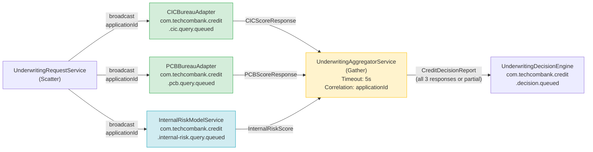

# Scatter-Gather

Status: Draft | Last Reviewed: 2026-05-09 | Owner: @tech-lead-backend
Catalog ID: EIP-015 | Radii
Tier Applicability: T0, T1

## Problem Statement

- Techcombank's loan underwriting platform must query multiple credit bureaus — the Vietnam Credit Information Centre (CIC), the Private Credit Bureau (PCB), and Techcombank's internal risk model — before making a credit decision. These three sources provide partially overlapping but non-redundant data; a reliable underwriting decision requires all three scores. Calling them sequentially adds their individual latencies in series: CIC (≤ 3s) + PCB (≤ 4s) + Internal model (≤ 1s) = up to 8s. Sequential calls are unacceptable for a retail loan-approval flow where the customer is waiting in the app.
- Credit bureau APIs have independent availability characteristics. CIC may be slow due to SBV maintenance windows; PCB may be temporarily unreachable. The underwriting system must be able to make a decision with partial bureau data (applying conservative fallback scoring) rather than failing the entire application when one bureau is unavailable.
- The response schemas from CIC, PCB, and the internal model are heterogeneous — each returns scores in different formats, with different field names and rating scales. Without a dedicated aggregator, the underwriting service must contain adapter logic for all three schemas, coupling it tightly to each bureau's API contract.
- For risk management, the underwriting rule set requires that the aggregated credit decision record all three bureau responses — including partial or timeout responses — in the application record. Logging individual responses in separate service logs does not satisfy this requirement; the aggregated response must be a single auditable record attached to the loan application.
- During product-launch campaigns, the underwriting platform receives bursts of 1,500 concurrent loan applications. Each application requires three parallel bureau calls. Sequential calling would require 1,500 × 8s = 12,000 CPU-seconds of blocking wait; parallel calling reduces this to 1,500 × 4s = 6,000 CPU-seconds — halving thread exhaustion risk.
- Adding a fourth credit data source (e.g., NAPAS payment-behaviour scoring) must not require changes to the underwriting decision engine — only the scatter logic and aggregator should need updating.

## Solution

A Scatter-Gather broadcasts the credit-check request simultaneously to CIC, PCB, and the internal risk model (Scatter). An `UnderwritingAggregatorService` collects all three responses within a configurable timeout window and produces a single consolidated `CreditDecisionReport` for the underwriting engine (Gather). Partial responses are included in the report with a `TIMEOUT` or `UNAVAILABLE` status; the underwriting engine applies conservative scoring rules when a bureau response is absent.



## Implementation Guidelines

1. **Implement the Scatter step as a Spring service that publishes to all bureau topics in parallel.** Use `KafkaTemplate.send()` for each bureau — non-blocking publishes. Stamp each message with the `applicationId` as the correlation key so the aggregator can match responses.

   ```java
   @Service
   @RequiredArgsConstructor
   @Slf4j
   public class UnderwritingRequestService {

       private final KafkaTemplate<String, CreditQueryRequest> kafkaTemplate;
       private final MeterRegistry metrics;

       private static final List<String> BUREAU_TOPICS = List.of(
           "com.techcombank.credit.cic.query.queued",
           "com.techcombank.credit.pcb.query.queued",
           "com.techcombank.credit.internal-risk.query.queued"
       );

       public void scatter(LoanApplication application) {
           String correlationId = application.getApplicationId();
           CreditQueryRequest request = CreditQueryRequest.from(application);

           log.info("ScatterGather scatter: applicationId={} bureauCount={} "
               + "correlationId={}",
               correlationId, BUREAU_TOPICS.size(), correlationId);

           BUREAU_TOPICS.forEach(topic -> {
               ProducerRecord<String, CreditQueryRequest> record =
                   new ProducerRecord<>(topic, correlationId, request);
               record.headers().add(
                   "X-Correlation-Id",
                   correlationId.getBytes(StandardCharsets.UTF_8));
               record.headers().add(
                   "X-Expected-Responses",
                   String.valueOf(BUREAU_TOPICS.size())
                       .getBytes(StandardCharsets.UTF_8));
               kafkaTemplate.send(record);
               metrics.counter("sg.scatter.sent", "bureau", extractBureau(topic))
                   .increment();
           });
       }
   }
   ```

2. **Implement the Gather step as a Spring Integration aggregator with a correlation strategy and completion condition.** The aggregator holds partial responses in a `MessageGroupStore` (Redis-backed for multi-pod HA) and releases the group when either all expected responses have arrived or the timeout has elapsed.

   ```java
   @Configuration
   @RequiredArgsConstructor
   public class UnderwritingAggregatorConfig {

       private final RedisMessageGroupStore messageGroupStore;

       @Bean
       public IntegrationFlow creditScoreAggregatorFlow(
               MessageChannel cicResponseChannel,
               MessageChannel pcbResponseChannel,
               MessageChannel internalRiskChannel) {
           return IntegrationFlow
               .from(MergedChannels.merge(
                   cicResponseChannel, pcbResponseChannel, internalRiskChannel))
               .aggregate(aggregatorSpec -> aggregatorSpec
                   .messageStore(messageGroupStore)
                   .correlationStrategy(
                       message -> message.getHeaders()
                           .get("X-Correlation-Id", String.class))
                   .releaseStrategy(group -> {
                       int expected = extractExpected(group.getMessages().iterator().next());
                       return group.size() >= expected;
                   })
                   .groupTimeout(5000L)           // 5-second timeout
                   .sendPartialResultOnExpiry(true)
                   .outputProcessor(group ->
                       buildCreditDecisionReport(group.getMessages())))
               .channel("creditDecisionReportChannel")
               .get();
       }

       private CreditDecisionReport buildCreditDecisionReport(
               Collection<Message<?>> responses) {
           Map<String, BureauScore> scores = new HashMap<>();
           for (Message<?> msg : responses) {
               BureauScoreResponse resp = (BureauScoreResponse) msg.getPayload();
               scores.put(resp.getBureau(), resp.toScore());
           }
           // Fill missing bureaus as TIMEOUT
           for (String bureau : List.of("CIC", "PCB", "INTERNAL")) {
               scores.putIfAbsent(bureau, BureauScore.timeout(bureau));
           }
           return new CreditDecisionReport(scores);
       }
   }
   ```

3. **Use a Redis-backed `MessageGroupStore` for aggregation state so that aggregator pods can be scaled horizontally.** A single in-memory aggregator is a scaling bottleneck and a single point of failure. With Redis, any aggregator pod can receive any bureau response for any in-flight application and update the shared group state.

   ```java
   @Bean
   public RedisMessageGroupStore redisMessageGroupStore(
           RedisConnectionFactory connectionFactory) {
       RedisMessageGroupStore store = new RedisMessageGroupStore(connectionFactory);
       store.setTimeoutOnIdle(Duration.ofSeconds(30));
       return store;
   }
   ```

   ```yaml
   spring:
     data:
       redis:
         host: ${REDIS_HOST}
         port: 6379
         ssl:
           enabled: true
   techcombank:
     credit:
       scatter-gather:
         aggregation-timeout-ms: 5000
         expected-bureau-count: 3
         partial-result-on-expiry: true
   ```

4. **Apply conservative scoring when bureau responses are partial.** The `UnderwritingDecisionEngine` receives the `CreditDecisionReport` and checks each bureau's `status` field. A `TIMEOUT` or `UNAVAILABLE` bureau status triggers conservative fallback scoring: the underwriting engine uses the worst-case score from the available bureaus and applies an additional risk premium. This must be documented in the loan underwriting policy and logged with the decision rationale.

   ```java
   @Service
   @RequiredArgsConstructor
   @Slf4j
   public class UnderwritingDecisionEngine {

       @KafkaListener(
           topics = "com.techcombank.credit.decision.queued",
           groupId = "underwriting-decision-engine"
       )
       public void decide(CreditDecisionReport report, Acknowledgment ack) {
           boolean allBureausResponded = report.getScores().values().stream()
               .allMatch(s -> s.getStatus() == BureauStatus.AVAILABLE);

           if (!allBureausResponded) {
               log.warn("Partial bureau response: applicationId={} missingBureaus={}",
                   report.getApplicationId(),
                   report.getMissingBureaus());
               metrics.counter("sg.partial.gather",
                   "missing", String.join(",", report.getMissingBureaus()))
                   .increment();
           }

           CreditDecision decision = allBureausResponded
               ? computeFullDecision(report)
               : computeConservativeDecision(report);

           log.info("Underwriting decision: applicationId={} decision={} "
               + "allBureaus={} correlationId={}",
               report.getApplicationId(), decision.getOutcome(),
               allBureausResponded, report.getCorrelationId());

           ack.acknowledge();
       }
   }
   ```

5. **Emit observability metrics at both scatter and gather points.** Track per-bureau response latency (`sg.bureau.response.latency.ms`) and partial-gather rate (`sg.partial.gather.total`). Set alerts on bureau-specific timeout rates so infrastructure issues with CIC or PCB are detected before they affect underwriting SLAs.

6. **Implement idempotent bureau adapters** so that Kafka retries do not produce duplicate bureau queries. Each adapter stamps the `applicationId` + `bureauQueryId` as an idempotency key in a Redis set (TTL 10 minutes). A duplicate query within the TTL window returns the cached bureau response without re-calling the bureau API — protecting against both double-charging and bureau rate-limit violations.

## When to Use / When NOT to Use

**Use when:**
- A decision requires inputs from multiple independent services and all inputs should be fetched in parallel to minimise latency.
- Individual data sources have independent availability; partial results must be handled gracefully rather than treated as a total failure.
- The set of data sources may grow over time and adding a new source should not require changes to the downstream decision engine.
- The combined response must be a single aggregated artifact for audit purposes.

**Do NOT use when:**
- The query to each recipient depends on the response from a previous recipient — use a Routing Slip (EIP-016) or Process Manager (EIP-019) for sequential, dependency-linked steps.
- Only one response is needed (first-to-respond wins) and others can be discarded — use a competing-consumers pattern instead.
- All recipients must succeed for the response to be valid and partial results cannot be used — a simpler synchronous fan-out with a circuit breaker may be more appropriate.
- The number of recipients is dynamic and unbounded — the aggregator's completion condition becomes hard to define; consider a different architecture.

## Variants & Trade-offs

| Variant | When | Trade-off |
|---|---|---|
| Best-of-N (this doc) | Aggregate all responses; use partial results on timeout | Maximises data completeness; aggregation window adds latency |
| First-response wins | Fastest bureau response is authoritative | Minimal latency; loses data richness from slower bureaus |
| Weighted aggregation | Different bureaus have different reliability/authority weights | More accurate decision; weighting model must be maintained and validated |
| Push-based scatter (Kafka, this doc) | Bureaus consume from Kafka topics | Decoupled; bureau adapters are independently deployable; slightly higher latency than HTTP |
| Pull-based scatter (parallel HTTP/WebClient) | Bureaus expose synchronous REST APIs | Lower latency; tighter coupling; bureau adapter failures affect the scatter caller directly |
| Reactive scatter (Project Reactor Flux.merge) | All bureaus have synchronous APIs and latency is critical | Minimal overhead; all calls in one reactive chain; error handling is more complex |

## NFR Acceptance Criteria

```yaml
nfr:
  catalog_id: EIP-015
  service_name: credit-scoring-scatter-gather
  tier: T1

  availability:
    target: 99.95%
    failure_mode: "aggregator crash → Redis group store retains partial responses; recovered aggregator completes the group"
    recovery: "aggregator pod restart < 30s; Redis-backed group state survives pod restart"

  performance:
    scatter_to_decision_p95_seconds: 5.5  # 5s aggregation timeout + 0.5s decision
    scatter_publish_latency_p95_ms: 10    # Kafka publish to all 3 bureaus
    aggregation_timeout_ms: 5000
    concurrent_applications: 1500

  correctness:
    partial_result_handling: "all TIMEOUT/UNAVAILABLE bureaus recorded in CreditDecisionReport with status field"
    duplicate_bureau_query_prevention: "idempotency key enforced in each bureau adapter; no duplicate API calls within 10-minute window"
    group_store_ttl_seconds: 30          # Redis group expires 30s after idle

  observability:
    required_metrics:
      - sg_scatter_sent_total (by bureau)
      - sg_bureau_response_latency_ms (histogram, by bureau)
      - sg_gather_completed_total (by completeness: full/partial)
      - sg_partial_gather_total (by missing_bureau)
      - sg_aggregation_timeout_total
    log_fields: [applicationId, correlationId, bureausReceived, missingBureaus, decisionOutcome]
    alerts:
      - name: SG_CIC_TimeoutRate_High
        condition: "rate(sg_aggregation_timeout_total{bureau='CIC'}[5m]) > 0.05"
        severity: High
      - name: SG_PartialGather_Rate_High
        condition: "rate(sg_partial_gather_total[5m]) / rate(sg_gather_completed_total[5m]) > 0.1"
        severity: Medium
```

## Compliance Mapping

| Layer | Reference | Section/Control | How this pattern satisfies |
|---|---|---|---|
| Ring 0 (global) | Enterprise Integration Patterns (Hohpe/Woolf) | Chapter 7 — Scatter-Gather | Canonical pattern; this doc applies it to Techcombank's multi-bureau credit underwriting |
| Ring 0 | NIST SP 800-53 | SI-10 Information Input Validation | All bureau responses are schema-validated before aggregation; invalid or unexpected response shapes are logged and treated as UNAVAILABLE |
| Ring 0 | Basel III / BCBS Operational Risk Framework | Principle 7 — Risk assessment for new products | The aggregated `CreditDecisionReport` (including partial statuses) is the underwriting record attached to each loan application, satisfying credit risk documentation requirements |
| Ring 1 (international banking) | BCBS 239 §6 | Accuracy & Completeness | All bureau responses — including TIMEOUT status — are recorded in the aggregated report; no bureau query result is silently discarded |
| Ring 1 | Basel II/III Credit Risk — IRB approach | Internal ratings-based model must use all available credit data | The Scatter-Gather ensures all three credit data sources are queried in parallel; the conservative fallback documents when a source was unavailable |
| Ring 2 (Vietnam) | SBV Circular 39/2016/TT-NHNN on Credit Granting ⚠️ (working summary — pending Legal review) | Article 11 — Credit appraisal requirements | Multi-bureau query supports SBV credit appraisal requirements; the CreditDecisionReport constitutes the documented credit assessment record |
| Ring 2 | CIC Vietnam Integration Standard ⚠️ (working summary — pending Legal review) | API rate limits and idempotency requirements | Bureau adapter idempotency (Redis-keyed, 10-minute TTL) prevents duplicate CIC queries that would violate CIC rate-limit terms |

## Cost / FinOps Notes

- **Bureau API costs** — CIC and PCB charge per query. With the idempotency layer, Kafka retries do not generate duplicate charges. At 10,000 loan applications/day × USD 0.08/CIC query = USD 800/day CIC cost; PCB similar. Partial-gather saves no API cost (all bureaus are queried at scatter time) but ensures data completeness.
- **Redis aggregation store** — Redis is a shared service. Aggregation group state per application: approximately 3 × 2KB bureau responses = 6KB, plus metadata. TTL 30 seconds. At 1,500 concurrent applications: 9MB working set — well within a standard Redis instance (8GB). Estimated Redis cost increment: USD 20/month.
- **Kafka topics** — 3 bureau query topics + 1 decision topic. T1 configuration (RF=3, 4-hour retention — aggregation completes within minutes). Estimated storage cost: USD 40/month.
- **Aggregator compute** — 3 aggregator pods at 2 vCPU/2GB each. Aggregation is I/O-bound (Redis reads/writes). Estimated compute: USD 45/month.
- **Timeout cost** — Aggregation timeout at 5 seconds means the underwriting decision is delayed by the slowest bureau. Reducing the timeout to 3 seconds saves 2 seconds of latency but increases partial-gather rate (PCB SLA is 4s). Tune timeout based on actual bureau latency percentile monitoring.

## Threat Model Summary

- **Bureau response spoofing** — An attacker sends a forged high-credit-score response on the aggregation response topic, causing the underwriting engine to approve a fraudulent loan. Mitigation: bureau adapter topics have strict Kafka ACLs (only the bureau adapter service accounts can produce to response topics); bureau responses are HMAC-signed by the adapter using a Secrets-Manager-held key; the aggregator validates the HMAC before including the response in the group.
- **Correlation ID collision** — Two concurrent applications happen to generate the same `applicationId` as the correlation key, causing their bureau responses to be aggregated together into an incorrect decision. Mitigation: `applicationId` is a UUID v4 generated at loan application creation — collision probability is negligible. Nonetheless, the aggregator logs a warning if a group receives more responses than expected (> 3).
- **Redis group store data leakage** — Bureau responses (containing applicant income, credit history) are stored temporarily in Redis. Mitigation: Redis is deployed with TLS in-transit and AES-256 encryption-at-rest (AWS ElastiCache with encryption enabled); bureau response data is stored for at most 30 seconds; the Redis instance is in a dedicated VPC subnet with no public access.
- **Bureau denial-of-service** — Attacker triggers 10,000 loan applications simultaneously, exhausting CIC API quota. Mitigation: rate-limiting at the loan application intake layer (token bucket, max 200 applications/minute); bureau adapter circuit breakers (Resilience4j) trip if CIC error rate exceeds 20%; circuit-open causes the CIC bureau to be marked UNAVAILABLE immediately, avoiding further quota consumption.
- **Aggregation timeout manipulation** — A misconfigured timeout (e.g., 100ms) causes almost all gather operations to be partial, causing the conservative fallback to systematically deny loans. Mitigation: timeout is configurable via Spring Cloud Config with a mandatory minimum of 2,000ms enforced by a `@Validated` constraint; changes require architecture review.

## Operational Runbook (stub)

1. **Alert: SG_CIC_TimeoutRate_High** — CIC bureau response timeout rate exceeds 5%. Check CIC API health dashboard (external). If CIC is in a maintenance window, the conservative fallback scoring will apply for all applications until CIC recovers. Notify the Underwriting team that decisions are running on partial data. Log a P2 incident.
2. **Alert: SG_PartialGather_Rate_High** — More than 10% of gather operations are completing with partial bureau data. Identify which bureau is most frequently missing (`sg_partial_gather_total` labelled by `missing_bureau`). Investigate that bureau adapter's consumer lag and error rate.
3. **Adding a new bureau** — Add a new bureau adapter service consuming a new query topic. Update `BUREAU_TOPICS` list in `UnderwritingRequestService`. Update the aggregator's expected-response-count configuration. Update the `CreditDecisionReport` schema to include the new bureau's response field. Deploy the new adapter before updating the scatter service to avoid messages arriving at an empty consumer group.
4. **Debugging a stuck aggregation group** — Query Redis for the group key (`applicationId`). Inspect which bureau responses are present. Identify the missing bureau. Check that bureau adapter's `@KafkaListener` consumer lag. If the bureau responded but the adapter failed to publish to the aggregation topic, replay from the bureau query topic.

## Test Strategy (stub)

- **Unit tests** — Test `UnderwritingRequestService.scatter`: assert 3 Kafka publish calls with correct topics and correlation headers. Test `buildCreditDecisionReport`: provide 2 of 3 responses, assert third is `TIMEOUT`. Test `UnderwritingDecisionEngine.decide` with full and partial reports.
- **Integration tests** — Embedded Kafka + embedded Redis. Scatter one application, assert all three bureau query topics receive the message. Simulate bureau adapters responding. Assert the decision topic receives a complete `CreditDecisionReport`.
- **Partial-result tests** — Suppress one bureau adapter from responding. Assert that after the 5-second aggregation timeout, a partial report is released to the decision topic with the missing bureau marked `TIMEOUT`. Assert that the decision engine applies conservative scoring.
- **Idempotency tests** — Send the same bureau query twice to the CIC adapter. Assert the CIC API is called only once; the second call returns the cached response.
- **Load tests** — Simulate 1,500 concurrent scatter-gather cycles using Gatling. Assert P95 scatter-to-decision latency < 5.5 seconds and Redis memory stays within bounds.

## Related Patterns

- [EIP-004 Message Router](message-router.md) — Routes to exactly one recipient; Scatter-Gather broadcasts to all and aggregates
- [EIP-005 Content-Based Router](content-based-router.md) — Routes based on content; combine with Scatter-Gather for selective broadcasting
- [EIP-014 Composed Message Processor](composed-message-processor.md) — Splits a composite message and reassembles; Scatter-Gather aggregates independent responses rather than split parts of one message
- [EIP-016 Routing Slip](routing-slip.md) — Sequential processing; Scatter-Gather is the parallel counterpart
- [EIP-024 Idempotent Receiver](idempotent-receiver.md) — Bureau adapters must be idempotent to handle Kafka retries without duplicate API calls
- [EIP-007 Aggregator](aggregator.md) — The Gather half of Scatter-Gather; the standalone Aggregator pattern applies when messages are not scattered by a single Scatter step

## References

- Hohpe, G. & Woolf, B. — Enterprise Integration Patterns (Addison-Wesley), Chapter 7: Scatter-Gather
- Spring Integration Reference — Aggregator, MessageGroupStore, RedisMessageGroupStore
- Resilience4j Reference — Circuit Breaker, Rate Limiter
- CIC Vietnam (Credit Information Centre) — API Integration Guide (internal, restricted)
- PCB Vietnam (Private Credit Bureau) — Technical Integration Specification (internal, restricted)
- SBV Circular 39/2016/TT-NHNN — Credit Granting Regulations

---
**Key Takeaway**: The Scatter-Gather pattern enables Techcombank's underwriting platform to query CIC, PCB, and the internal risk model in parallel — reducing credit-check latency from 8 seconds sequential to a 5-second parallel window — while guaranteeing that partial bureau failures produce a conservative, auditable decision rather than an application error.
