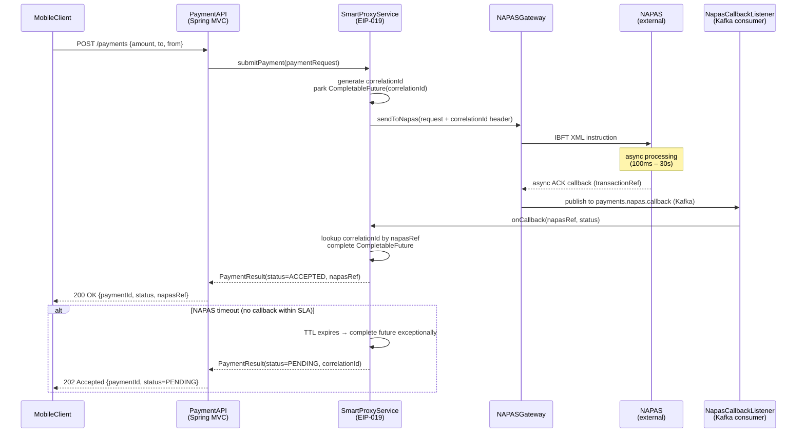

# Smart Proxy

Status: Draft | Last Reviewed: 2026-05-09 | Owner: @tech-lead-backend
Catalog ID: EIP-019 | Radii
Tier Applicability: T0, T1

## Problem Statement

- NAPAS real-time payment processing is inherently asynchronous: Techcombank's payment service submits a payment instruction to NAPAS and receives a callback acknowledgement on a separate channel, potentially seconds or minutes later, with no guaranteed ordering relative to other in-flight payments. The originating mobile client, however, expects a near-synchronous response within its HTTP timeout window (typically 30 seconds).
- The callback from NAPAS carries a NAPAS-assigned `transactionRef` that does not match the internal `correlationId` used by the payment service to track the originating request. Without a correlation layer, the service receiving the callback cannot determine which waiting HTTP request should be unblocked.
- Multiple payments may be in-flight simultaneously for the same customer or merchant. Out-of-order NAPAS callbacks — where the confirmation for payment B arrives before the confirmation for payment A — must not be routed to the wrong waiting client. Without sequence-independent correlation, a naive response matching strategy produces incorrect results for concurrent payers.
- The mobile client must not be exposed to the asynchronous nature of the NAPAS integration. Leaking internal retry state, correlation identifiers, or intermediate NAPAS statuses to the mobile API creates an inconsistent contract that changes as the backend integration evolves. The abstraction boundary must be at the payment service level.
- In the event of a NAPAS timeout (no callback within the SLA window), the payment service must return a deterministic response to the mobile client — either a timeout error or a pending status — without leaving orphaned correlation entries that consume memory indefinitely. Correlation entries must have a TTL.

## Solution

A Smart Proxy sits between the mobile API layer and the asynchronous NAPAS integration channel. When the payment service sends a request to NAPAS, the Smart Proxy intercepts it, stores the original `correlationId` mapped to the NAPAS `transactionRef`, and parks the waiting HTTP response in a `CompletableFuture`. When the NAPAS callback arrives — on the async reply channel — the proxy looks up the parked future by `correlationId`, completes it with the callback result, and the HTTP response is returned to the mobile client. The mobile client sees a single synchronous request/response; the asynchronous NAPAS interaction is fully hidden.



## Implementation Guidelines

1. **Implement the correlation store as a `ConcurrentHashMap<String, PendingPayment>` with a scheduled TTL eviction.** For a payment service running in a single JVM (or behind a sticky-session load balancer), an in-process map is sufficient and eliminates the latency of an external store. For multi-pod deployments, replace with a Redis `SETEX` entry per correlation key. Choose based on the deployment topology; do not over-engineer for Redis if a single-pod design meets the availability target.

   ```java
   @Component
   @RequiredArgsConstructor
   @Slf4j
   public class NapasSmartProxy {

       private static final Duration CORRELATION_TTL = Duration.ofSeconds(30);
       private static final Duration POLL_INTERVAL   = Duration.ofMillis(100);

       private final ConcurrentHashMap<String, PendingPayment> pendingMap =
           new ConcurrentHashMap<>();
       private final NapasGatewayClient napasClient;
       private final MeterRegistry metrics;

       /**
        * Submit a payment to NAPAS and block (up to TTL) for the async callback.
        * Returns a PaymentResult — callers see a synchronous API.
        */
       public PaymentResult submitAndAwait(PaymentRequest request) {
           String correlationId = request.correlationId();
           CompletableFuture<NapasCallbackEvent> future = new CompletableFuture<>();

           pendingMap.put(correlationId, new PendingPayment(
               correlationId, future, Instant.now().plus(CORRELATION_TTL)));

           metrics.gauge("smart_proxy.pending_count", pendingMap, Map::size);

           try {
               napasClient.send(request); // async — returns immediately
               log.info("SmartProxy submitted: correlationId={} amount={} currency={}",
                   correlationId, request.amount(), request.currency());

               NapasCallbackEvent callback = future.get(
                   CORRELATION_TTL.toMillis(), TimeUnit.MILLISECONDS);

               log.info("SmartProxy resolved: correlationId={} napasRef={} status={}",
                   correlationId, callback.napasRef(), callback.status());

               metrics.counter("smart_proxy.callback.resolved",
                   "status", callback.status().name()).increment();

               return PaymentResult.fromCallback(correlationId, callback);

           } catch (TimeoutException ex) {
               log.warn("SmartProxy timeout: correlationId={} ttl={}s",
                   correlationId, CORRELATION_TTL.toSeconds());
               metrics.counter("smart_proxy.callback.timeout").increment();
               return PaymentResult.pending(correlationId);

           } catch (InterruptedException | ExecutionException ex) {
               log.error("SmartProxy error: correlationId={}", correlationId, ex);
               metrics.counter("smart_proxy.callback.error").increment();
               return PaymentResult.failed(correlationId, ex.getMessage());

           } finally {
               pendingMap.remove(correlationId);
           }
       }

       /**
        * Called by NapasCallbackListener when NAPAS delivers an async ACK.
        * Looks up the pending future by correlationId and completes it.
        */
       public void onCallback(NapasCallbackEvent callback) {
           String correlationId = callback.correlationId();
           PendingPayment pending = pendingMap.get(correlationId);

           if (pending == null) {
               log.warn("SmartProxy orphan callback: correlationId={} napasRef={} "
                   + "— TTL may have expired or duplicate callback",
                   correlationId, callback.napasRef());
               metrics.counter("smart_proxy.callback.orphan").increment();
               return;
           }
           pending.future().complete(callback);
       }
   }
   ```

2. **The NAPAS callback must carry the original `correlationId` to enable lookup — ensure the gateway stamps it on the outbound request.** NAPAS's IBFT protocol supports a free-text `ReferenceId` field (max 35 chars). The gateway adapter places the `correlationId` there. NAPAS echoes this field back in the callback. The `NapasCallbackListener` extracts it and passes it to `SmartProxy.onCallback()`.

   ```java
   @Component
   @RequiredArgsConstructor
   @Slf4j
   public class NapasCallbackListener {

       private final NapasSmartProxy smartProxy;
       private final MeterRegistry metrics;

       @KafkaListener(
           topics = "payments.napas.callback",
           groupId = "napas-callback-listener",
           containerFactory = "napasCallbackContainerFactory")
       public void onMessage(ConsumerRecord<String, NapasCallbackEvent> record) {
           NapasCallbackEvent callback = record.value();
           String correlationId = callback.correlationId();

           MDC.put("correlationId", correlationId);
           MDC.put("napasRef", callback.napasRef());

           log.info("NapasCallback received: correlationId={} napasRef={} status={}",
               correlationId, callback.napasRef(), callback.status());

           metrics.counter("napas.callback.received",
               "status", callback.status().name()).increment();

           smartProxy.onCallback(callback);
           MDC.clear();
       }
   }
   ```

3. **Add a TTL eviction scheduler to clean up entries that never received a callback.** This handles cases where NAPAS never delivers an ACK (e.g., network partition). The `CompletableFuture.get(timeout)` in `submitAndAwait` will have already timed out and returned `PENDING` to the caller; the map entry must still be removed to prevent a memory leak.

   ```java
   @Scheduled(fixedDelay = 5000) // run every 5 seconds
   void evictExpiredPending() {
       Instant now = Instant.now();
       int evicted = 0;
       for (Iterator<Map.Entry<String, PendingPayment>> it =
               pendingMap.entrySet().iterator(); it.hasNext(); ) {
           Map.Entry<String, PendingPayment> entry = it.next();
           if (entry.getValue().expiresAt().isBefore(now)) {
               entry.getValue().future()
                   .completeExceptionally(new PaymentCorrelationExpiredException(
                       "Correlation TTL expired: " + entry.getKey()));
               it.remove();
               evicted++;
               log.debug("SmartProxy evicted expired entry: correlationId={}",
                   entry.getKey());
           }
       }
       if (evicted > 0) {
           log.info("SmartProxy TTL eviction: evicted={}", evicted);
           metrics.counter("smart_proxy.eviction.total",
               Tags.empty()).increment(evicted);
       }
   }
   ```

4. **For multi-pod deployments, externalise the correlation store to Redis with `SETEX` to preserve TTL semantics across restarts.** If the `PaymentAPI` pod processing the original HTTP request fails after submitting to NAPAS but before receiving the callback, the correlation entry is lost. Redis persistence ensures another pod can serve the callback.

   ```java
   @Component
   @ConditionalOnProperty("app.smart-proxy.store", havingValue = "redis")
   @RequiredArgsConstructor
   public class RedisCorrelationStore implements CorrelationStore {

       private final StringRedisTemplate redis;
       private static final String KEY_PREFIX = "napas:correlation:";
       private static final Duration TTL = Duration.ofSeconds(60);

       @Override
       public void put(String correlationId, String metadata) {
           redis.opsForValue().set(KEY_PREFIX + correlationId, metadata, TTL);
       }

       @Override
       public Optional<String> get(String correlationId) {
           return Optional.ofNullable(
               redis.opsForValue().get(KEY_PREFIX + correlationId));
       }

       @Override
       public void remove(String correlationId) {
           redis.delete(KEY_PREFIX + correlationId);
       }
   }
   ```

5. **Expose correlation store depth as a real-time metric and alert on sustained high depth.** Under normal operation, correlation entries are resolved within 1–3 seconds. A depth above 200 entries sustained for more than 30 seconds indicates NAPAS callback delivery is failing — the circuit breaker should trip and payments should be put in `PENDING` mode immediately.

   ```yaml
   # Prometheus alert rule
   - alert: SmartProxyCorrelationDepthHigh
     expr: smart_proxy_pending_count > 200
     for: 30s
     labels:
       severity: critical
       team: payments
     annotations:
       summary: "NAPAS callback delivery may be failing"
       description: >
         SmartProxy has {{ $value }} unresolved correlations for > 30s.
         Investigate NAPAS gateway and callback Kafka topic lag.
         Consider activating PENDING-mode circuit breaker.
   ```

6. **Implement a circuit breaker that switches the Smart Proxy to immediate-PENDING mode when NAPAS callback latency exceeds the SLA.** Rather than making mobile clients wait the full 30-second TTL during a NAPAS degradation, a Resilience4j `CircuitBreaker` on the `submitAndAwait` path opens after 5 consecutive timeouts and returns `PENDING` immediately. A background reconciliation job polls NAPAS status every 30 seconds and resolves pending payments asynchronously.

   ```java
   @CircuitBreaker(name = "napas-smart-proxy",
                   fallbackMethod = "submitPending")
   public PaymentResult submitAndAwait(PaymentRequest request) {
       // ... normal implementation above
   }

   public PaymentResult submitPending(PaymentRequest request, CallNotPermittedException ex) {
       log.warn("SmartProxy circuit open: returning PENDING immediately correlationId={}",
           request.correlationId());
       metrics.counter("smart_proxy.circuit_breaker.open").increment();
       return PaymentResult.pending(request.correlationId());
   }
   ```

## When to Use / When NOT to Use

**Use when:**
- A client requires a synchronous-seeming response but the backend integration is inherently asynchronous.
- Multiple in-flight requests may receive out-of-order replies that must be correlated to the correct originating request.
- The async backend uses a different identifier scheme than the calling client (e.g., NAPAS `transactionRef` vs. internal `correlationId`).
- You need a transparent abstraction so the client is unaware of the async/sync boundary.

**Do NOT use when:**
- The backend is fast enough to be synchronous — unnecessary complexity.
- The client can handle asynchronous patterns natively (e.g., a background job that polls a status endpoint) — prefer the Polling Consumer or Event-Driven model.
- The correlation store represents a single point of failure in a multi-pod deployment and Redis is not available — redesign for a fully async client contract instead.
- Callback latency is unbounded (hours/days) — the Smart Proxy's TTL model is designed for seconds-to-minutes latency; for longer windows, use a persistent Saga with a status polling API.

## Variants & Trade-offs

| Variant | When | Trade-off |
|---|---|---|
| **In-process `CompletableFuture` map (this doc)** | Single-pod or sticky-session deployment | Lowest latency; lost on pod restart; not suitable for horizontal scale |
| **Redis correlation store** | Multi-pod, stateless deployments | Resilient to pod failure; adds ~2ms Redis round-trip per correlation |
| **Database correlation store** | Audit requires durable correlation records | Full auditability and replay; higher latency; heavyweight for short-lived correlations |
| **Reactive (WebFlux + `Sinks.One`)** | High concurrency (>1000 concurrent payments) | Non-blocking; eliminates thread-per-request overhead; more complex error handling |
| **Correlation via response queue (per-request reply-to)** | JMS/AMQP systems with native request-reply support | Native protocol support; heavier infrastructure; not idiomatic for Kafka |

## NFR Acceptance Criteria

```yaml
nfr:
  catalog_id: EIP-019
  pattern: Smart Proxy

  availability:
    target: 99.99%   # T0 — on the real-time payment critical path
    failure_mode: "proxy pod failure → in-flight correlations lost; NAPAS callback delivers orphan"
    recovery: "Redis-backed store survives pod restart; orphan callbacks logged; background reconciliation resolves pending"

  performance:
    end_to_end_latency_p50_ms: 800      # NAPAS processing median
    end_to_end_latency_p95_ms: 3000     # NAPAS processing 95th percentile
    end_to_end_latency_p99_ms: 10000    # approaching timeout SLA
    correlation_lookup_latency_p95_us: 500  # in-process map lookup
    correlation_ttl_seconds: 30         # must match mobile client HTTP timeout
    max_concurrent_pending: 1000        # peak concurrent in-flight payments

  correctness:
    callback_correlation_accuracy: 100%   # no callback delivered to wrong originator
    orphan_callback_handling: logged_and_metered   # no silent drops
    ttl_eviction: mandatory              # no memory leak on missed callbacks
    idempotent_callback: true            # duplicate NAPAS callbacks are ignored

  observability:
    required_metrics:
      - smart_proxy_pending_count (real-time gauge)
      - smart_proxy_callback_resolved_total (by status)
      - smart_proxy_callback_timeout_total
      - smart_proxy_callback_orphan_total
      - smart_proxy_eviction_total
    log_level: INFO
    structured_fields: [correlationId, napasRef, status, latencyMs]
    alert:
      - name: SmartProxyCorrelationDepthHigh
        condition: "pending_count > 200 for > 30s"
        severity: Critical
      - name: SmartProxyTimeoutRateHigh
        condition: "timeout_total rate > 5/min over 5min"
        severity: High
      - name: SmartProxyOrphanRateHigh
        condition: "orphan_total rate > 1/min over 5min"
        severity: High

  scalability:
    horizontal_scaling: true (with Redis store)
    horizontal_scaling_constraint: "sticky session required for in-process map variant"
    max_pending_per_pod: 1000
```

## Compliance Mapping

| Layer | Reference | Section/Control | How |
|---|---|---|---|
| Ring 0 (global) | Enterprise Integration Patterns (Hohpe/Woolf) | Chapter 11 — Smart Proxy | Canonical pattern; this document applies it to Techcombank's NAPAS async payment confirmation flow |
| Ring 0 (global) | OWASP ASVS V11.1 | Business Logic — Integrity of business logic flows | Correlation accuracy is a business logic integrity control; the Smart Proxy guarantees that each mobile client receives only the result of its own payment request |
| Ring 1 (international) | BCBS 239 Principle 2 (Data Architecture and IT Infrastructure) | Accurate data aggregation infrastructure | The proxy's correlation store is the authoritative mapping between internal `correlationId` and NAPAS `transactionRef`; this mapping is required for reconciliation and audit |
| Ring 2 (Vietnam) | SBV Circular 09/2020 §IV.2 ⚠️ (working summary — pending Legal review) | Operational continuity | Redis-backed correlation store survives pod failure; background reconciliation resolves payments whose correlation was lost during an outage |

## Cost / FinOps Notes

- **In-process correlation store**: Zero infrastructure cost. Memory footprint: 1,000 concurrent pending payments × ~500 bytes per `PendingPayment` entry = 500 KB. Negligible.
- **Redis correlation store**: A single Redis node (2 vCPU, 1 GB RAM) supports tens of thousands of concurrent SETEX entries. At USD 50/month for a managed Redis instance, this is the dominant cost of the Redis variant.
- **Thread blocking cost**: `CompletableFuture.get(30s, MILLISECONDS)` blocks a thread per in-flight payment. At 1,000 concurrent payments, this requires a thread pool sized to at least 1,000. With Java 21 virtual threads (`Thread.ofVirtual()`), the blocking cost is negligible — use virtual threads for the `submitAndAwait` path.
- **Kafka callback topic**: `payments.napas.callback` is a low-volume topic (one message per completed payment). At 100 TPS peak and 1 KB per callback event, monthly storage is approximately 260 MB. Negligible.
- **Cost of no Smart Proxy**: Without correlation, each mobile client would need to poll a payment-status endpoint. At 1,000 concurrent payments polling every 2 seconds, polling traffic would generate 500 TPS of status-check load on T24/NAPAS — a significant reduction in system capacity. The Smart Proxy eliminates this polling entirely.

## Threat Model Summary

- **Correlation store poisoning**: An attacker crafts a NAPAS callback with a forged `correlationId` mapping to a different customer's pending payment, causing the wrong customer's HTTP response to contain the attacker's payment result. Mitigation: the `correlationId` is a UUIDv4 generated server-side and is not present in any client-visible response until after resolution; it is transmitted to NAPAS over a mutually-authenticated (mTLS) channel; incoming callbacks are validated against the registered Schema Registry schema before the `onCallback` dispatch.
- **Memory exhaustion via correlation flooding**: An attacker submits thousands of payments, parking thousands of `CompletableFuture` entries in the map, exhausting heap. Mitigation: rate limiting at the PaymentAPI layer (e.g., Resilience4j `RateLimiter`, 100 TPS per customer); `max_pending_per_pod` circuit breaker; TTL eviction ensures entries cannot accumulate beyond 30 seconds.
- **Replay of expired callback**: A delayed NAPAS callback (arriving after TTL) is delivered to the proxy. The originating HTTP request has already timed out and returned `PENDING` to the mobile client. The orphan callback is logged with `smart_proxy.callback.orphan` counter. The background reconciliation job picks up the PENDING payment and resolves it using the NAPAS status query API.
- **Pod restart during in-flight payment (in-process store)**: All pending correlations are lost on pod restart. Mitigation: for T0 workloads, use the Redis store variant. For the in-process variant, the mobile client receives a `PENDING` response on its next poll; the background reconciliation resolves the status.

## Operational Runbook (stub)

- **Alert: SmartProxyCorrelationDepthHigh** — Check `smart_proxy_pending_count` in Grafana `payment-gateway-overview`. Check NAPAS callback topic lag (`payments.napas.callback` consumer group `napas-callback-listener`). If lag is growing, NAPAS may not be delivering callbacks — contact NAPAS Operations. Activate the PENDING-mode circuit breaker via feature flag `napas.smart-proxy.circuit-breaker.force-open=true` in Spring Cloud Config to immediately return `PENDING` for all new submissions and stop accumulating blocked threads.
- **Alert: SmartProxyTimeoutRateHigh** — Indicates NAPAS processing is slower than the 30-second SLA. Check NAPAS status page (internal). Extend the TTL temporarily via `napas.smart-proxy.correlation-ttl-seconds=60` in Spring Cloud Config. Notify the mobile team that payment confirmation latency is elevated.
- **Resolving PENDING payments after NAPAS recovery** — After NAPAS recovers and callbacks resume, the background reconciliation job (`NapasPendingReconciliationJob`) polls the NAPAS status query API for all `PENDING` payments and resolves them. Run it manually if needed: POST `/actuator/napas/reconcile-pending`.
- **Debugging a lost callback** — Search Kibana for `correlationId=<id>` in `smart-proxy-*` index. If `SmartProxy submitted` log appears but no `NapasCallback received` log, the callback was never delivered. Check NAPAS gateway logs for the `ReferenceId` matching the `correlationId`.

## Test Strategy (stub)

- **Unit tests**: Test `NapasSmartProxy` with a mocked `NapasGatewayClient`. Verify: (a) callback arriving before TTL resolves the future correctly; (b) no callback → `TimeoutException` → `PENDING` result; (c) TTL eviction removes the map entry; (d) orphan callback (no pending entry) logs and meters without throwing.
- **Integration tests**: Embedded Kafka (Testcontainers) + Spring context. Submit a `PaymentRequest`; publish a synthetic `NapasCallbackEvent` to `payments.napas.callback` after 200ms; assert `submitAndAwait` returns `ACCEPTED` within 1 second.
- **Concurrency tests**: Submit 500 concurrent payments simultaneously using `ExecutorService`; deliver callbacks out of order (random delay 0–2s); assert each payment resolves to its own callback result (no cross-correlation). Use `CompletableFuture.allOf` to await all 500.
- **Timeout test**: Submit a payment with no callback; assert `submitAndAwait` returns `PENDING` after the TTL; assert the correlation map entry is evicted.
- **Circuit breaker test**: Trigger 5 consecutive timeouts; assert subsequent submissions return `PENDING` immediately without waiting for TTL; assert `smart_proxy.circuit_breaker.open` counter increments.

## Related Patterns

- [EIP-005 Content-Based Router](content-based-router.md) — routes NAPAS callbacks to the correct listener channel
- [EIP-010 Normalizer](normalizer.md) — NAPAS callback events pass through the Normalizer before resolution if they carry format-specific fields
- [EIP-020 Test Message](test-message.md) — synthetic heartbeat payments exercise the Smart Proxy end-to-end as part of the NAPAS channel health check
- [EIP-024 Idempotent Receiver](idempotent-receiver.md) — duplicate NAPAS callbacks are de-duplicated by `correlationId` before `onCallback` dispatch
- [INT-001 Saga Orchestration](../integration/saga-orchestration.md) — for payments requiring multi-step confirmation beyond the Smart Proxy TTL window

## References

- Hohpe, G. & Woolf, B. — Enterprise Integration Patterns (Addison-Wesley), Chapter 11: Smart Proxy
- NAPAS IBFT Technical Specification — ReferenceId field usage (internal — contact NAPAS Integration Team)
- Spring Kafka Reference — `@KafkaListener`, consumer group configuration
- Resilience4j Reference — CircuitBreaker, RateLimiter
- Java 21 — Virtual Threads (`Thread.ofVirtual()`) for blocking I/O
- Spring Data Redis — `StringRedisTemplate`, `SETEX` command

---
**Key Takeaway**: The Smart Proxy hides NAPAS's asynchronous callback model behind a synchronous-seeming API for mobile clients — correlating out-of-order NAPAS ACKs back to the correct waiting HTTP request by `correlationId`, with TTL eviction, orphan handling, and a circuit breaker that degrades gracefully to PENDING mode when NAPAS is slow.
