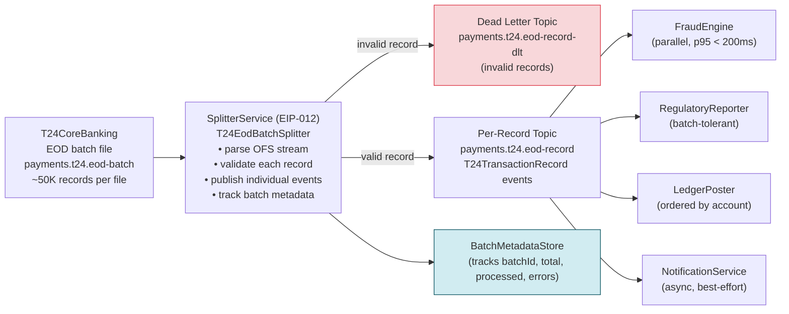

# Splitter

Status: Draft | Last Reviewed: 2026-05-09 | Owner: @tech-lead-backend
Catalog ID: EIP-012 | Radii
Tier Applicability: T0, T1

## Problem Statement

- T24 Temenos produces a single end-of-day (EOD) settlement batch file containing thousands of transaction records serialised as a sequential OFS string stream. Downstream services — fraud scoring, regulatory reporting, ledger reconciliation, and customer notification — need to react to individual transactions, not the batch as a whole. Delivering the entire file as one message forces each consumer to implement its own iteration logic and prevents parallelism.
- Processing the batch as an atomic unit means a single invalid record can block the entire file: the consumer either processes all records or none. In a file containing 50,000 transactions, one malformed OFS record should not prevent the other 49,999 from reaching fraud scoring and regulatory reporting.
- Downstream services have fundamentally different throughput profiles: fraud scoring must process each transaction within 200ms; regulatory reporting can tolerate minutes of latency; notification can be delivered within seconds. A monolithic batch delivery cannot honour per-consumer SLAs — each consumer must be able to consume and scale independently.
- Kafka's offset model provides message-level commit tracking. Committing a batch file as a single Kafka message forfeits this: if the consumer crashes mid-batch, the entire file must be re-processed. Splitting to individual events enables fine-grained at-least-once delivery with deduplication via the Idempotent Receiver (EIP-024).
- Regulatory reporting under BCBS 239 Principle 6 requires that each individual transaction be traceable as a discrete data point with its own provenance, timestamp, and identifier. A batch-level record does not satisfy this traceability requirement at the transaction level.

## Solution

A Splitter receives the composite T24 EOD batch message, iterates over its records, and publishes each record as an independent Kafka event on a downstream topic. Downstream consumers subscribe to the per-record topic and process each event individually, at their own pace and with independent scaling.



## Implementation Guidelines

1. **Implement the Splitter as a Kafka consumer that streams the OFS batch record-by-record rather than loading the entire file into memory.** T24 EOD files can exceed 100 MB. Parse the OFS stream lazily, producing one `T24TransactionRecord` Kafka event per OFS record. Never deserialise the entire batch into a List before publishing.

   ```java
   @Component
   @RequiredArgsConstructor
   @Slf4j
   public class T24EodBatchSplitter {

       private static final String RECORD_TOPIC = "payments.t24.eod-record";
       private static final String DLT_TOPIC    = "payments.t24.eod-record-dlt";

       private final OfsStreamParser ofsParser;
       private final KafkaTemplate<String, T24TransactionRecord> recordTemplate;
       private final KafkaTemplate<String, FailedOfsRecord> dltTemplate;
       private final BatchMetadataStore metadataStore;
       private final MeterRegistry metrics;

       @KafkaListener(
           topics = "payments.t24.eod-batch",
           groupId = "t24-eod-splitter",
           containerFactory = "batchContainerFactory")
       public void split(ConsumerRecord<String, byte[]> batchRecord) {
           String batchId    = extractBatchId(batchRecord);
           String correlationId = UUID.randomUUID().toString();
           MDC.put("correlationId", correlationId);
           MDC.put("batchId", batchId);

           log.info("Splitter starting: batchId={} offset={} partition={}",
               batchId, batchRecord.offset(), batchRecord.partition());

           AtomicLong totalCount   = new AtomicLong(0);
           AtomicLong successCount = new AtomicLong(0);
           AtomicLong errorCount   = new AtomicLong(0);

           metadataStore.initBatch(batchId, correlationId);

           try (InputStream ofsStream = new ByteArrayInputStream(batchRecord.value())) {
               ofsParser.stream(ofsStream).forEach(ofsRecord -> {
                   totalCount.incrementAndGet();
                   try {
                       T24TransactionRecord record = parseOfsRecord(ofsRecord, batchId, correlationId);
                       publishRecord(record);
                       successCount.incrementAndGet();
                   } catch (OfsParseException ex) {
                       log.warn("Splitter record parse error: batchId={} seqNo={} error={}",
                           batchId, ofsRecord.sequenceNumber(), ex.getMessage());
                       publishToDlt(ofsRecord, batchId, correlationId, ex);
                       errorCount.incrementAndGet();
                   }
               });
           } catch (IOException ex) {
               log.error("Splitter batch stream failed: batchId={}", batchId, ex);
               throw new BatchSplitException("Failed to process EOD batch: " + batchId, ex);
           }

           metadataStore.completeBatch(batchId, totalCount.get(),
               successCount.get(), errorCount.get());

           metrics.counter("splitter.batch.completed",
               "batchId", batchId).increment();
           metrics.gauge("splitter.batch.error_count",
               Tags.of("batchId", batchId), errorCount.get());

           log.info("Splitter complete: batchId={} total={} success={} errors={} correlationId={}",
               batchId, totalCount, successCount, errorCount, correlationId);

           MDC.clear();
       }

       private void publishRecord(T24TransactionRecord record) {
           var kafkaRecord = new ProducerRecord<>(
               RECORD_TOPIC,
               record.accountNumber(),   // partition by account for ordering
               record);
           kafkaRecord.headers()
               .add("batchId",       record.batchId().getBytes(StandardCharsets.UTF_8))
               .add("correlationId", record.correlationId().getBytes(StandardCharsets.UTF_8))
               .add("sourceFormat",  "T24_OFS".getBytes(StandardCharsets.UTF_8));
           recordTemplate.send(kafkaRecord);
       }
   }
   ```

2. **Represent each split record as a typed `T24TransactionRecord` with mandatory batch lineage fields.** Every individual event must carry its `batchId`, `batchSequenceNumber`, and `batchTotalCount` so downstream consumers can detect missing records and so the audit trail connects each event back to its source batch file.

   ```java
   public record T24TransactionRecord(
       String transactionId,       // T24's TRANS.ID
       String batchId,             // EOD file identifier (date + sequence)
       int    batchSequenceNumber, // position in source file (1-based)
       int    batchTotalCount,     // total records in batch (from batch header record)
       String correlationId,
       String accountNumber,
       String transactionType,     // DEBIT | CREDIT
       BigDecimal amount,
       String currency,
       LocalDate valueDate,
       String narration,
       Instant splittedAt
   ) {}
   ```

3. **Implement `BatchMetadataStore` to track split progress and enable reconciliation.** After EOD processing, the regulatory reporting service must confirm it received all N records from batch B. The metadata store persists this per-batch summary in a PostgreSQL table, queryable by Operations for reconciliation. Use a parameterised `NamedParameterJdbcTemplate` — never string-concatenated SQL.

   ```java
   @Repository
   @RequiredArgsConstructor
   public class BatchMetadataStore {

       private final NamedParameterJdbcTemplate jdbc;

       public void initBatch(String batchId, String correlationId) {
           jdbc.update("""
               INSERT INTO eod_batch_split_log
                 (batch_id, correlation_id, status, started_at)
               VALUES
                 (:batchId, :correlationId, 'IN_PROGRESS', NOW())
               ON CONFLICT (batch_id) DO NOTHING
               """,
               Map.of("batchId", batchId, "correlationId", correlationId));
       }

       public void completeBatch(String batchId, long total, long success, long errors) {
           jdbc.update("""
               UPDATE eod_batch_split_log
               SET status       = :status,
                   total_count  = :total,
                   success_count = :success,
                   error_count  = :errors,
                   completed_at = NOW()
               WHERE batch_id = :batchId
               """,
               Map.of(
                   "status",  errors == 0 ? "COMPLETED" : "COMPLETED_WITH_ERRORS",
                   "total",   total,
                   "success", success,
                   "errors",  errors,
                   "batchId", batchId));
       }
   }
   ```

4. **Configure the Kafka consumer for the batch topic with `max.poll.records=1` and a generous `max.poll.interval.ms` to prevent consumer group rebalance during long-running splits.** A 50,000-record batch may take 30–60 seconds to split and publish. The default `max.poll.interval.ms` of 5 minutes is usually sufficient, but set it explicitly and monitor consumer lag on the batch topic.

   ```yaml
   spring:
     kafka:
       consumer:
         group-id: t24-eod-splitter
         max-poll-records: 1        # process one batch file at a time
         properties:
           max.poll.interval.ms: 600000   # 10 min — accommodate large batch files
           fetch.max.bytes: 157286400     # 150 MB — match max batch file size
   ```

5. **Invalid individual records route to the DLT with the raw OFS string preserved in a header.** The batch Splitter must not fail the entire batch because one OFS record is malformed. Catch `OfsParseException` per record, publish to DLT, increment error counter, and continue. The `BatchMetadataStore` records the error count so Operations can review and decide whether to manually re-inject the failed records.

   ```java
   private void publishToDlt(OfsRecord raw, String batchId,
                              String correlationId, Exception cause) {
       var dltRecord = new FailedOfsRecord(
           batchId,
           raw.sequenceNumber(),
           raw.rawString(),
           cause.getClass().getSimpleName(),
           cause.getMessage(),
           correlationId,
           Instant.now());
       var kafkaRecord = new ProducerRecord<>(DLT_TOPIC,
           batchId, dltRecord);
       kafkaRecord.headers()
           .add("kafka_dlt-exception-class",
               cause.getClass().getName().getBytes(StandardCharsets.UTF_8));
       dltTemplate.send(kafkaRecord);
   }
   ```

6. **Produce split records in transactional mode to guarantee exactly-once semantics for the split-to-publish step.** Wrap the per-record publish in a Kafka transaction scoped to the batch consumer loop. If the producer fails mid-batch, uncommitted records are not visible to consumers; the consumer group offset is not committed, so the batch can be re-processed from the start (the Idempotent Receiver on the consumer side deduplicates re-delivered records by `transactionId`).

   ```java
   // application.yml
   spring:
     kafka:
       producer:
         transaction-id-prefix: "t24-eod-splitter-"
         acks: all
         enable-idempotence: true
   ```

## When to Use / When NOT to Use

**Use when:**
- A composite message (batch file, bulk payload, aggregate envelope) contains multiple logically independent records that must be processed separately.
- Downstream consumers need to scale independently and cannot process aggregate messages.
- Partial failure tolerance is required — one bad record must not block all others.
- Kafka offset commits should be at the individual record level, not at the batch level.

**Do NOT use when:**
- The composite message is inherently atomic — e.g., a multi-leg financial transaction where all legs must succeed or fail together. Use the Saga pattern (INT-001) instead.
- The total number of records per composite is very small (e.g., ≤ 5) and downstream consumers can trivially iterate themselves — the Splitter overhead is not justified.
- Record ordering within the batch must be preserved globally across all consumers — Kafka's partition-level ordering guarantees are sufficient only within a partition. Partition by a stable key (account number) to preserve per-account ordering.

## Variants & Trade-offs

| Variant | When | Trade-off |
|---|---|---|
| **Streaming split (this doc)** | Large files (> 1 MB); memory-constrained pods | Lowest memory footprint; requires streaming-capable OFS parser |
| **Batch-load-then-split** | Small composites (< 1 MB); simpler code | Simple; risks OOM on unexpectedly large batches |
| **Parallel split with virtual threads (Java 21)** | Very high record counts; parsing is CPU-bound | Higher throughput; requires thread-safe metric accumulators |
| **Splitter as Kafka Streams FlatMap** | Already using Kafka Streams topology | Elegant; FlatMap is the native Streams equivalent of the Splitter pattern |
| **Database staging before split** | Audit requires the raw batch to be persisted before any downstream processing | Full auditability; higher latency and storage cost |

## NFR Acceptance Criteria

```yaml
nfr:
  catalog_id: EIP-012
  pattern: Splitter

  availability:
    target: 99.95%    # T1 — EOD batch; not on real-time payment path
    failure_mode: "splitter down → batch topic lag grows; no data loss (Kafka retention ≥ 7 days)"
    recovery: "pod restart < 30s; batch re-processed from committed Kafka offset"

  performance:
    split_throughput_records_per_second: 2000
    max_batch_processing_time_minutes: 10       # SLA for 50K-record file
    per_record_publish_latency_p95_ms: 5
    batch_topic_consumer_lag_alert_threshold: 2 # more than 2 unprocessed batch files

  correctness:
    no_silent_record_loss: true                 # every record either published or DLT'd
    batch_metadata_reconciliation: true         # total = success + errors for every batch
    idempotent_split: true                      # replay-safe; downstream uses EIP-024
    dlt_preservation: true                      # raw OFS string preserved in DLT entry

  observability:
    required_metrics:
      - splitter_batch_completed_total
      - splitter_record_published_total (by result=success|error)
      - splitter_batch_processing_duration_seconds (p50/p95/p99)
      - splitter_batch_error_count (by batchId)
    log_level: INFO
    structured_fields: [batchId, correlationId, totalCount, successCount, errorCount]
    alert:
      - name: SplitterBatchLagHigh
        condition: "batch topic consumer lag > 2 batches for > 15min"
        severity: High
      - name: SplitterErrorRateHigh
        condition: "error_count / total_count > 1% for any batch"
        severity: High
      - name: SplitterBatchTimeout
        condition: "batch processing time > 10 min"
        severity: Critical

  scalability:
    horizontal_scaling: false  # single consumer per batch partition (ordering guarantee)
    vertical_scaling: true     # scale up pod memory/CPU for larger batch files
    max_batch_file_size_mb: 150
```

## Compliance Mapping

| Layer | Reference | Section/Control | How |
|---|---|---|---|
| Ring 0 (global) | Enterprise Integration Patterns (Hohpe/Woolf) | Chapter 7 — Splitter | Canonical pattern; this document applies it to Techcombank's T24 EOD settlement batch |
| Ring 0 (global) | NIST SP 800-53 AU-12 (Audit Record Generation) | Each individual event must be auditable | Every split record carries `batchId`, `batchSequenceNumber`, and `correlationId`, enabling audit reconstruction from event to batch file |
| Ring 1 (international) | BCBS 239 Principle 6 (Accuracy and Completeness) | All material risk exposures must be captured at the transaction level | The Splitter produces one event per T24 transaction; downstream risk systems subscribe to individual events; `BatchMetadataStore` reconciles total vs. delivered counts |
| Ring 2 (Vietnam) | SBV Circular 09/2020 §IV.2 ⚠️ (working summary — pending Legal review) | Operational continuity | Kafka retention on the batch topic ensures batches survive a Splitter outage; the `BatchMetadataStore` allows Operations to verify completeness after recovery |

## Cost / FinOps Notes

- **Compute**: Splitting a 50,000-record batch at 2,000 records/second takes 25 seconds. A single 1-vCPU, 512 MB pod handles this; EOD runs outside peak business hours. Estimated compute cost: USD 5/month.
- **Kafka throughput**: At 50,000 records per EOD batch × 500 bytes per `T24TransactionRecord` = 25 MB per batch. With a daily EOD cycle, the per-record topic generates approximately 750 MB/month — negligible at T1 tier.
- **Database (BatchMetadataStore)**: One row per batch in a PostgreSQL table. At one batch per day, annual storage is 365 rows — effectively free. Operational query cost is negligible.
- **DLT storage**: At 1% error rate, 500 DLT entries per batch × 30-day retention × 1 KB per entry = approximately 15 MB. Negligible.
- **Fan-out amplification**: Four downstream consumers all read from the same per-record topic. Kafka's consumer group model means the batch is not duplicated; each consumer reads independently from the topic. Kafka storage is shared; only egress bandwidth scales with consumer count.

## Threat Model Summary

- **Batch file tampering (HIGH risk)**: A malicious actor injects extra OFS records into the T24 EOD file, causing fraudulent transaction records to be split and posted to the ledger. Mitigation: the EOD batch file is transferred via an authenticated, encrypted SFTP channel with a file-level HMAC; the Splitter verifies the HMAC before processing; file integrity failure routes the entire batch to the DLT with a `BATCH_INTEGRITY_FAILURE` exception.
- **Partial batch replay after failure**: The Splitter crashes at record 25,000 of 50,000. On restart, the Kafka consumer re-processes the entire batch from offset 0, producing duplicate events for the first 25,000 records. Mitigation: downstream consumers implement the Idempotent Receiver (EIP-024), deduplicating by `transactionId`; the `BatchMetadataStore` records which records were already published, enabling a selective-replay mode.
- **Oversized batch causing OOM**: T24 generates an unexpectedly large batch (e.g., month-end includes backdated corrections), exceeding pod memory. Mitigation: the streaming OFS parser never materialises the full file in memory; pod memory limit is set to 150% of the maximum expected file size; a `FetchMaxBytes` Kafka consumer config caps the fetch at 150 MB.
- **PII in DLT entries**: Failed OFS records in the DLT contain raw OFS strings with account numbers and customer references. Mitigation: the DLT topic is classified as Confidential; Kafka ACLs restrict access to the Ops triage team; DLT entries are deleted after the triage SLA window under data minimisation controls.

## Operational Runbook (stub)

- **Alert: SplitterBatchLagHigh** — Check `payments.t24.eod-batch` consumer lag in Grafana `kafka-lag-overview`. Verify the Splitter pod is running (`kubectl get pods -n payment-splitter`). If the pod is up but lag is growing, check `splitter.batch.processing_duration_seconds` — a single very large batch may be in progress. If the pod is down, restart: `kubectl rollout restart deployment/t24-eod-splitter`.
- **Alert: SplitterErrorRateHigh** — Inspect the DLT topic `payments.t24.eod-record-dlt` for the batch in question. Retrieve the raw OFS string from the `raw_ofs_string` field. Verify whether the error is schema-related (new T24 OFS field) or data-quality-related (empty mandatory field). If schema-related, engage the Core Banking team for the OFS spec update and patch the parser. If data-quality, engage T24 Operations to correct the source records and re-run the batch.
- **Manual batch re-run**: Reset the `payments.t24.eod-batch` consumer group offset to the target batch's offset: `kafka-consumer-groups.sh --reset-offsets --to-offset <N> --topic payments.t24.eod-batch --group t24-eod-splitter --execute`. Downstream consumers deduplicate via EIP-024.
- **Reconciliation check**: Query `eod_batch_split_log` table: `SELECT * FROM eod_batch_split_log WHERE batch_id = '<date>' AND status != 'COMPLETED';` — any `COMPLETED_WITH_ERRORS` row requires triage.

## Test Strategy (stub)

- **Unit tests**: Test `T24EodBatchSplitter` with mocked `OfsStreamParser` and `KafkaTemplate`. Provide synthetic OFS streams containing 0, 1, 100, and 50,000 records; one record with a parse error. Verify: correct record count published, DLT entry for the bad record, `BatchMetadataStore` updated correctly.
- **Integration tests**: Testcontainers Kafka + PostgreSQL. Publish a synthetic EOD batch to `payments.t24.eod-batch`. Assert per-record events arrive on `payments.t24.eod-record` with correct `batchId`, `batchSequenceNumber`, and `batchTotalCount`. Assert `BatchMetadataStore` row shows `COMPLETED` with correct counts.
- **Performance test**: Publish a 50,000-record synthetic batch. Assert processing completes within 10 minutes. Measure peak memory consumption — must stay under the pod memory limit.
- **Chaos test**: Kill the Splitter pod at record 25,000. Restart. Verify idempotent downstream consumers de-duplicate the replayed records. Verify `BatchMetadataStore` reconciliation count is correct after restart.
- **Idempotency test**: Run the same batch twice. Verify downstream ledger poster receives each `transactionId` exactly once (EIP-024 deduplication).

## Related Patterns

- [EIP-005 Content-Based Router](content-based-router.md) — route individual split events to specialist consumers by transaction type
- [EIP-010 Normalizer](normalizer.md) — each split T24 record may pass through the Normalizer to produce a canonical `PaymentInstruction`
- [EIP-024 Idempotent Receiver](idempotent-receiver.md) — mandatory partner pattern; downstream consumers must deduplicate replayed split events
- [EIP-025 Dead Letter Channel](dead-letter-channel.md) — individual record failures route here; batch-level failures route to a batch DLT
- [INT-001 Saga Orchestration](../integration/saga-orchestration.md) — when split records trigger multi-step sagas (e.g., post + notify + report)

## References

- Hohpe, G. & Woolf, B. — Enterprise Integration Patterns (Addison-Wesley), Chapter 7: Splitter
- T24 Temenos OFS Programmer Guide (internal — contact Core Banking Team)
- Spring Kafka Reference — `@KafkaListener`, `KafkaTemplate`, Transactions
- Kafka Producer Configuration — `enable.idempotence`, `transaction.id.prefix`
- Testcontainers Kafka — Integration Testing Guide

---
**Key Takeaway**: The Splitter decomposes T24's monolithic EOD batch into individual per-transaction Kafka events, enabling parallel processing by fraud scoring, regulatory reporting, and ledger services — with per-record error isolation, batch-level reconciliation, and replay safety via idempotent receivers.
