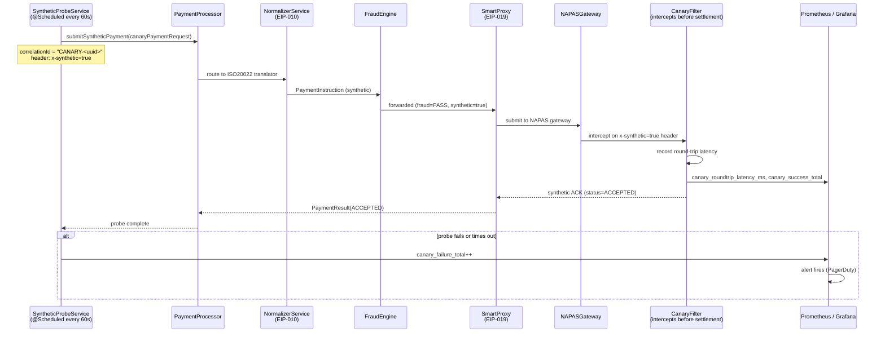

# Test Message

Status: Draft | Last Reviewed: 2026-05-09 | Owner: @tech-lead-backend
Catalog ID: EIP-020 | Radii
Tier Applicability: T0, T1

## Problem Statement

- The NAPAS real-time payment pipeline is a T0 system with a 99.99% availability target. Silent channel degradation — where the pipeline appears healthy (pods running, Kafka lag zero) but payment processing has stalled internally — cannot be detected by infrastructure health checks alone. Customers discover the failure before Operations does.
- Standard liveness and readiness probes (`/actuator/health`) verify that the application process is running and can reach its dependencies, but they do not verify that end-to-end payment processing logic executes correctly. A stuck Kafka consumer, a mis-configured serialiser, or a locked database row can pass all infrastructure probes while silently failing all customer payments.
- NAPAS imposes a per-transaction settlement charge. Using real customer transactions as health-check probes is cost-prohibitive and legally problematic: a synthetic VND 1 payment to a real account triggers real settlement, produces a real ledger entry, and requires customer notification. End-to-end testing requires a probe that is processed by the full pipeline but is identifiable and reversible as synthetic.
- Regulatory reporting under BCBS 230 Principle 3 (Business Continuity Planning) requires periodic testing of critical payment channels. Manual testing is infrequent, labour-intensive, and does not provide continuous evidence of channel health. An automated, recurring synthetic probe satisfies the continuous-testing requirement and produces a machine-readable compliance record.
- P95 latency degradation — where the pipeline is processing payments but taking 10× longer than normal — is an early warning signal for capacity exhaustion, NAPAS throttling, or database contention. This degradation is not visible to binary up/down health checks; only a probe that measures end-to-end round-trip time can surface it before customer SLAs are breached.

## Context

Standard Kubernetes liveness/readiness probes verify process health and dependency reachability but cannot detect silent processing failures — a stuck Kafka consumer, a mis-configured serialiser, or a locked database row can pass all infrastructure checks while silently failing every customer payment. The Test Message pattern addresses this gap by injecting a labelled synthetic payment into the live NAPAS pipeline every 60 seconds. The synthetic payment is intercepted by a `CanaryFilter` at the NAPAS gateway boundary before reaching NAPAS, measuring end-to-end round-trip latency across every internal processing stage without incurring settlement fees or creating real ledger entries.

## Solution

The Test Message pattern injects a synthetic, clearly-labelled payment instruction into the live NAPAS pipeline every 60 seconds. The synthetic message travels through every processing stage (normalisation, fraud scoring, ledger posting, NAPAS submission) identically to a real payment, but is intercepted before final settlement by a canary-aware filter. Latency from injection to interception is measured and alerted on; failures to complete within the SLA trigger a PagerDuty alert.



## Implementation Guidelines

1. **Implement `SyntheticProbeService` as a Spring `@Scheduled` bean with a fixed delay.** Use `@Scheduled(fixedDelay = 60_000)` rather than `fixedRate` to prevent probe bursts if the pipeline is slow — the next probe starts 60 seconds after the previous one completes, not from a fixed wall-clock tick. Mark every synthetic payment with a reserved `correlationId` prefix (`CANARY-`) and an HTTP/Kafka header `x-synthetic: true`.

   ```java
   @Component
   @RequiredArgsConstructor
   @Slf4j
   public class SyntheticProbeService {

       private static final String CANARY_PREFIX         = "CANARY-";
       private static final String SYNTHETIC_HEADER      = "x-synthetic";
       private static final BigDecimal CANARY_AMOUNT_VND = BigDecimal.ONE; // VND 1
       // Synthetic debtor/creditor accounts are reserved, non-existent account numbers
       private static final String CANARY_DEBTOR_ACCT    = "9999-SYNTHETIC-DEBIT";
       private static final String CANARY_CREDITOR_ACCT  = "9999-SYNTHETIC-CREDIT";

       private final PaymentProcessor paymentProcessor;
       private final MeterRegistry metrics;

       @Scheduled(fixedDelay = 60_000, initialDelay = 10_000)
       public void sendCanaryPayment() {
           String correlationId = CANARY_PREFIX + UUID.randomUUID();
           MDC.put("correlationId", correlationId);
           long startNs = System.nanoTime();

           log.info("SyntheticProbe start: correlationId={}", correlationId);
           metrics.counter("canary.probe.sent").increment();

           try {
               PaymentRequest request = PaymentRequest.builder()
                   .correlationId(correlationId)
                   .debtorAccountNumber(CANARY_DEBTOR_ACCT)
                   .creditorAccountNumber(CANARY_CREDITOR_ACCT)
                   .amount(CANARY_AMOUNT_VND)
                   .currency("VND")
                   .remittanceInfo("SYNTHETIC CANARY PAYMENT — DO NOT SETTLE")
                   .header(SYNTHETIC_HEADER, "true")
                   .build();

               PaymentResult result = paymentProcessor.submitAndAwait(request);
               long latencyMs = TimeUnit.NANOSECONDS.toMillis(System.nanoTime() - startNs);

               metrics.timer("canary.roundtrip.latency")
                   .record(latencyMs, TimeUnit.MILLISECONDS);
               metrics.counter("canary.probe.success",
                   "status", result.status().name()).increment();

               log.info("SyntheticProbe success: correlationId={} latencyMs={} status={}",
                   correlationId, latencyMs, result.status());

           } catch (Exception ex) {
               long latencyMs = TimeUnit.NANOSECONDS.toMillis(System.nanoTime() - startNs);
               metrics.counter("canary.probe.failure",
                   "error", ex.getClass().getSimpleName()).increment();
               log.error("SyntheticProbe failed: correlationId={} latencyMs={} error={}",
                   correlationId, latencyMs, ex.getMessage(), ex);
           } finally {
               MDC.clear();
           }
       }
   }
   ```

2. **Implement `CanaryFilter` at the NAPAS gateway boundary to intercept synthetic messages before they reach NAPAS.** The filter checks the `x-synthetic: true` header and short-circuits: it records the latency, emits a synthetic ACK back to the Smart Proxy, and does NOT forward to NAPAS. This ensures the canary exercises the full internal pipeline without incurring NAPAS settlement charges or creating real ledger entries.

   ```java
   @Component
   @RequiredArgsConstructor
   @Slf4j
   public class CanaryFilter {

       private static final String SYNTHETIC_HEADER = "x-synthetic";

       private final MeterRegistry metrics;

       /**
        * Intercepts payment requests at the NAPAS gateway boundary.
        * Returns a synthetic ACK for canary payments; passes through real payments.
        */
       public Optional<PaymentResult> intercept(PaymentRequest request,
                                                 long startNs) {
           String synthetic = request.header(SYNTHETIC_HEADER);
           if (!"true".equals(synthetic)) {
               return Optional.empty(); // real payment — let it pass through
           }

           long latencyMs = TimeUnit.NANOSECONDS.toMillis(System.nanoTime() - startNs);

           log.info("CanaryFilter intercepted: correlationId={} latencyMs={}",
               request.correlationId(), latencyMs);

           metrics.timer("canary.filter.intercept.latency")
               .record(latencyMs, TimeUnit.MILLISECONDS);
           metrics.counter("canary.filter.intercepted").increment();

           // Return a synthetic ACK — does NOT reach NAPAS
           return Optional.of(PaymentResult.builder()
               .correlationId(request.correlationId())
               .status(PaymentStatus.ACCEPTED)
               .synthetic(true)
               .build());
       }
   }
   ```

3. **Propagate the `x-synthetic: true` header through all intermediate Kafka topics and service boundaries.** Each service in the pipeline (Normalizer, FraudEngine, LedgerPoster) must pass through headers it does not consume. Use a Spring Kafka `RecordInterceptor` or a Spring Integration header-enricher to ensure `x-synthetic` is never stripped. If the LedgerPoster receives a synthetic payment without the header, it will post a real ledger entry — a serious defect.

   ```java
   @Configuration
   public class KafkaHeaderPropagationConfig {

       /**
        * Ensure x-synthetic and correlationId headers survive round-trips through
        * the Kafka consumer → producer boundary in every service.
        */
       @Bean
       public RecordInterceptor<String, Object> syntheticHeaderInterceptor() {
           return new RecordInterceptor<>() {
               @Override
               public ConsumerRecord<String, Object> intercept(
                       ConsumerRecord<String, Object> record,
                       Consumer<String, Object> consumer) {
                   Header syntheticHeader = record.headers().lastHeader("x-synthetic");
                   if (syntheticHeader != null) {
                       MDC.put("synthetic", "true");
                   }
                   return record;
               }
           };
       }
   }
   ```

4. **Configure Prometheus alerting rules for canary failure and P95 latency breach.** A single missed canary is not an alert; two consecutive failures are a warning; three consecutive failures are a critical alert. P95 latency exceeding 5 seconds (when the normal P95 is 800ms) triggers a warning alert that fires before customers notice degradation.

   ```yaml
   groups:
     - name: napas-canary
       rules:
         - alert: NapasCanaryFailure
           expr: |
             increase(canary_probe_failure_total[3m]) >= 2
           for: 0m
           labels:
             severity: critical
             team: payments
             tier: T0
           annotations:
             summary: "NAPAS payment pipeline canary failing"
             description: >
               2+ synthetic probes failed in the last 3 minutes.
               Real customer payments may be silently failing.
               Check PaymentProcessor, NAPASGateway, and Kafka lag.

         - alert: NapasCanaryLatencyHigh
           expr: |
             histogram_quantile(0.95,
               rate(canary_roundtrip_latency_bucket[5m])) > 5000
           for: 5m
           labels:
             severity: warning
             team: payments
             tier: T0
           annotations:
             summary: "NAPAS canary P95 latency > 5s"
             description: >
               P95 round-trip latency for synthetic NAPAS payments has exceeded 5s
               (baseline ~800ms). Investigate FraudEngine, LedgerPoster, or
               NAPAS gateway capacity.

         - alert: NapasCanaryMissing
           expr: |
             increase(canary_probe_sent_total[3m]) == 0
           for: 3m
           labels:
             severity: critical
             team: payments
             tier: T0
           annotations:
             summary: "NAPAS canary probe not firing"
             description: >
               No synthetic probes have been sent in 3 minutes.
               SyntheticProbeService scheduler may have crashed or the pod is down.
   ```

5. **Register synthetic canary accounts in the core banking system as reserved, non-settleable accounts.** The account numbers `9999-SYNTHETIC-DEBIT` and `9999-SYNTHETIC-CREDIT` must be registered in T24 with a `BLOCKED` status and a `CANARY` account type that prevents OFS posting. Any payment instruction referencing these accounts that escapes the `CanaryFilter` will fail at the T24 posting layer — this is the safety net. Ensure the LedgerPoster and NotificationService both recognise the `CANARY` account type and skip real processing.

   ```java
   // LedgerPoster safety check — belt-and-suspenders after CanaryFilter
   @Component
   public class LedgerPoster {
       private static final Set<String> SYNTHETIC_ACCOUNT_PREFIXES = Set.of("9999-SYNTHETIC");

       public void post(PaymentInstruction instruction) {
           if (isSyntheticAccount(instruction.debtorAccountNumber()) ||
               isSyntheticAccount(instruction.creditorAccountNumber())) {
               log.warn("LedgerPoster blocked synthetic account posting: correlationId={}",
                   instruction.correlationId());
               metrics.counter("ledger.synthetic.blocked").increment();
               return;
           }
           // real posting logic
       }

       private boolean isSyntheticAccount(String accountNumber) {
           return SYNTHETIC_ACCOUNT_PREFIXES.stream()
               .anyMatch(accountNumber::startsWith);
       }
   }
   ```

6. **Emit canary results to a dedicated Kafka topic (`payments.canary.result`) for long-term latency trending and compliance evidence.** Regulatory audit teams require evidence that BCP testing occurred. A machine-readable stream of canary results — timestamped, with round-trip latency, pass/fail status, and pipeline stage — provides continuous, auditable evidence of channel health testing without manual test execution logs.

   ```java
   public record CanaryResult(
       String correlationId,
       Instant probeSentAt,
       Instant probeCompletedAt,
       long roundTripMs,
       CanaryStatus status,       // SUCCESS | FAILURE | TIMEOUT
       String failureReason,      // null on success
       String pipelineVersion     // service version tag for regression analysis
   ) {}

   // Published by SyntheticProbeService after each probe
   kafkaTemplate.send("payments.canary.result", correlationId, canaryResult);
   ```

## When to Use

- A T0/T1 integration channel must be continuously verified for end-to-end correctness, not just infrastructure liveness.
- Silent failures (the pipeline appears up but is not processing correctly) must be detected before customers report them.
- Regulatory or BCP requirements mandate periodic, auditable testing of payment channels.
- Latency degradation must be surfaced as a leading indicator before SLA breaches.

## When Not to Use

- The channel does not support a reliable mechanism for intercepting and discarding synthetic messages — injecting real-looking test messages into a channel that cannot distinguish them from real messages risks financial harm.
- The system under test has no reserved/blocked account concept — do not synthesise against real account numbers even for small amounts.
- The probe frequency is so high that it meaningfully consumes system capacity — the probe should be < 0.1% of total throughput. At 1 probe/minute and 3,000 real TPS, the canary is 0.0006% of traffic.
- A lower-cost alternative exists — a stage-specific health check API (e.g., `GET /actuator/health/napas`) that the gateway team exposes for integration health without end-to-end pipeline traversal.

## Variants & Trade-offs

| Variant | When | Trade-off |
|---|---|---|
| **Scheduled heartbeat (this doc)** | Continuous channel health; fixed interval | Simple; predictable overhead; does not cover burst behaviour |
| **Canary transaction in production** | Full end-to-end validation including NAPAS settlement | Maximum coverage; incurs NAPAS fees; requires reserved real accounts with zero-settlement configuration |
| **Shadow traffic replay** | Replay production traffic off-peak through a shadow pipeline | Tests with real shapes; complex infrastructure; risk of side effects if not carefully isolated |
| **Chaos probe (random injection)** | Stress and recovery testing | Finds intermittent bugs; dangerous in production without careful blast-radius control |
| **Stage-specific health APIs** | Need to isolate which stage is failing | Faster diagnosis; does not exercise inter-stage message passing |

## NFR Acceptance Criteria

```yaml
nfr:
  catalog_id: EIP-020
  pattern: Test Message

  availability:
    target: 99.99%   # canary must fire reliably to be trusted
    failure_mode: "scheduler pod down → canary stops firing → NapasCanaryMissing alert fires"
    recovery: "pod restart < 30s; scheduler resumes on next fixedDelay tick"

  performance:
    probe_frequency_seconds: 60
    canary_roundtrip_sla_p95_ms: 3000     # alert at 5000ms
    canary_roundtrip_sla_p99_ms: 10000
    canary_overhead_pct_of_throughput: 0.001   # < 0.1% of peak TPS

  correctness:
    synthetic_header_propagation: mandatory    # every stage must pass through x-synthetic
    canary_interception_before_napas: guaranteed  # no synthetic payment reaches NAPAS
    ledger_posting_blocked: mandatory          # LedgerPoster must refuse synthetic accounts
    canary_result_published: true             # every probe result persisted to Kafka topic

  observability:
    required_metrics:
      - canary_probe_sent_total
      - canary_probe_success_total (by status)
      - canary_probe_failure_total (by error)
      - canary_roundtrip_latency (histogram, p50/p95/p99)
      - canary_filter_intercepted_total
      - ledger_synthetic_blocked_total
    log_level: INFO
    structured_fields: [correlationId, latencyMs, status, pipelineVersion]
    alert:
      - name: NapasCanaryFailure
        condition: "2+ failures in 3 minutes"
        severity: Critical
      - name: NapasCanaryLatencyHigh
        condition: "P95 > 5000ms over 5 minutes"
        severity: Warning
      - name: NapasCanaryMissing
        condition: "no probes sent in 3 minutes"
        severity: Critical

  compliance:
    canary_results_retention_days: 90    # evidence for regulatory audit
    canary_results_topic: "payments.canary.result"
    audit_queryable: true                # queryable by Compliance team via BI tooling
```

## Compliance Mapping

| Layer | Reference | Section/Control | How |
|---|---|---|---|
| Ring 0 (global) | Enterprise Integration Patterns (Hohpe/Woolf) | Chapter 11 — Test Message | Canonical pattern; this document applies it to Techcombank's NAPAS real-time payment channel |
| Ring 0 (global) | NIST SP 800-53 CA-8 (Penetration Testing) | System testing controls | Test Message is the operational health-testing equivalent; it provides continuous functional verification of the T0 payment channel |
| Ring 1 (international) | BCBS 230 Principle 3 (BCP and Testing) ⚠️ (working summary — pending PDF fetch) | BCP testing requires synthetic probes to validate recovery of critical systems | Test Message pattern is the implementation mechanism: automated, continuous, auditable synthetic probes provide machine-readable evidence that the NAPAS payment channel is operational |
| Ring 1 (international) | BCBS 239 Principle 7 (Accuracy) | Data accuracy must be verifiable | Canary results published to `payments.canary.result` provide a time-series record of pipeline accuracy that can be queried by risk and compliance teams |
| Ring 2 (Vietnam) | SBV Circular 09/2020 §IV.2 ⚠️ (working summary — pending Legal review) | Operational continuity | Automated canary probes satisfy the requirement for regular channel testing; results are retained for 90 days as operational continuity evidence |

## Cost / FinOps Notes

- **Compute**: `SyntheticProbeService` executes one probe per minute. The probe follows the same path as a real payment. At 3,000 real TPS, one probe per 60 seconds represents 0.0006% overhead — immeasurable in compute cost.
- **Kafka**: The `payments.canary.result` topic generates one 512-byte event per minute = ~22 MB/month. Negligible.
- **NAPAS fees**: Zero — the `CanaryFilter` intercepts every synthetic payment before it reaches NAPAS. Confirm with the NAPAS Integration Team that no probe message escapes interception.
- **Alerting infrastructure**: PagerDuty alert routing for `NapasCanaryFailure` (Critical) triggers an on-call engineer. At approximately 2 canary failures per quarter (planned maintenance), the cost is absorbed by the existing on-call budget.
- **Cost of NOT having a canary**: A 30-minute silent payment pipeline failure affects every customer who attempts a payment during that window. At Techcombank's transaction volume, 30 minutes of failed real-time payments represents significant revenue loss, regulatory exposure (SBV reporting of major outages), and reputational damage. The canary's infrastructure cost is orders of magnitude below this risk.
- **Compliance evidence value**: Automated, timestamped canary results reduce the manual effort required to produce BCP testing evidence for SBV and internal audit from days of test documentation to a simple Kibana or BI query against `payments.canary.result`.

## Threat Model Summary

- **Canary escape to NAPAS — Tampering (CRITICAL risk)**: A `CanaryFilter` bug or misconfiguration (e.g., missing `x-synthetic` header propagation after a service refactor) allows a synthetic payment to reach NAPAS, triggering real settlement and a real VND 1 debit/credit on the reserved accounts. Mitigation: belt-and-suspenders — both `CanaryFilter` (header-based) and `LedgerPoster` (account-number-based) block synthetic processing; reserved synthetic accounts in T24 have `BLOCKED` status preventing OFS posting; automated test verifies interception on every CI run.
- **Canary suppression — Elevation of Privilege (security bypass)**: An insider adds `x-synthetic: true` to a real payment to bypass fraud scoring and ledger posting. Mitigation: `x-synthetic` header is stripped and rejected at the API gateway for any request originating from an external source; only `SyntheticProbeService` (with a dedicated service account) is authorised to set this header, enforced by a signed JWT claim checked in the PaymentProcessor.
- **Alert fatigue from canary noise — Denial of Service**: Transient NAPAS slowdowns (e.g., 2am batch settlement) cause frequent canary latency alerts, desensitising the on-call team. Mitigation: the latency alert has a 5-minute `for` window (not instant); latency thresholds are tuned per time-of-day using Prometheus recording rules; planned NAPAS maintenance windows suppress the canary alert.
- **Canary result data misinterpretation — Spoofing**: An analyst queries `payments.canary.result` and concludes the pipeline is healthy based on canary success, while real customer payments are failing due to a bug that only affects non-synthetic messages (e.g., a null check that the canary's minimal payload never triggers). Mitigation: the canary is necessary but not sufficient — it is paired with real-payment error rate metrics (`payment_processor_error_rate`) on the same Grafana dashboard.

## Operational Runbook (stub)

- **Alert: NapasCanaryFailure (Critical)** — Immediately check `payment_processor_error_rate` in Grafana `payment-gateway-overview` to determine if real customer payments are also failing. If yes: escalate to P1, engage NAPAS Operations, activate the payment incident playbook. If only the canary is failing: check `CanaryFilter` logs for `correlationId=CANARY-*` entries; check NAPAS gateway reachability; verify `x-synthetic` header propagation is intact.
- **Alert: NapasCanaryMissing (Critical)** — The scheduler has stopped. Check pod status: `kubectl get pods -n payment-canary`. If pod is running but scheduler is not firing, check `/actuator/scheduledtasks` endpoint. Restart if needed: `kubectl rollout restart deployment/synthetic-probe-service`.
- **Alert: NapasCanaryLatencyHigh (Warning)** — Identify which pipeline stage is introducing latency. Compare `canary_roundtrip_latency` against stage-specific metrics: FraudEngine response time, LedgerPoster database query time, NAPASGateway submission time. If NAPAS is slow, check the NAPAS status feed (internal). If an internal service is slow, check CPU/memory usage and Kafka consumer lag.
- **Planned maintenance canary suppression** — Before a planned NAPAS maintenance window, silence the canary alerts in PagerDuty or Prometheus Alertmanager for the maintenance duration. Do not disable the canary probe itself — it should resume signalling immediately after maintenance ends, confirming recovery.
- **Reviewing BCP compliance evidence** — Query `payments.canary.result` in the BI tool: `SELECT DATE(probe_sent_at), COUNT(*), AVG(round_trip_ms), SUM(CASE WHEN status='FAILURE' THEN 1 ELSE 0 END) FROM canary_results GROUP BY DATE(probe_sent_at) ORDER BY 1 DESC`. Export for the quarterly SBV operational resilience report.

## Test Strategy (stub)

- **Unit tests**: Test `SyntheticProbeService` with a mocked `PaymentProcessor`. Verify: (a) probe is submitted with `correlationId` prefixed `CANARY-` and `x-synthetic: true` header; (b) success metrics increment on `PaymentResult.ACCEPTED`; (c) failure metrics increment on exception; (d) MDC is cleared after each probe.
- **Unit tests for `CanaryFilter`**: Verify: (a) request with `x-synthetic: true` returns a synthetic ACK and does NOT call the real NAPAS client; (b) request without `x-synthetic` returns `Optional.empty()` (pass-through); (c) intercept latency metric is recorded.
- **Unit tests for `LedgerPoster` safety check**: Verify that a `PaymentInstruction` with debtor account `9999-SYNTHETIC-DEBIT` returns without posting and increments `ledger.synthetic.blocked`.
- **Integration tests**: Embedded Kafka (Testcontainers) + Spring context. Trigger `sendCanaryPayment()` manually. Assert: (a) `CanaryFilter` intercepts the message (no NAPAS gateway call); (b) `payments.canary.result` topic receives a `CanaryResult` event within 2 seconds; (c) `payments.t24.eod-record` topic receives no synthetic event (no ledger post).
- **Header propagation tests**: For each intermediate Kafka consumer in the pipeline (Normalizer, FraudEngine, LedgerPoster), test that a message arriving with `x-synthetic: true` exits the service with the same header intact.
- **Regression test (canary escape prevention)**: After any change to the NAPAS gateway or `CanaryFilter`, run a targeted test that verifies zero real NAPAS submissions for 10 synthetic probes. Assert by checking the NAPAS gateway mock invocation count.

## Related Patterns

- [EIP-019 Smart Proxy](smart-proxy.md) — the canary payment exercises the Smart Proxy's correlation store end-to-end
- [EIP-010 Normalizer](normalizer.md) — the canary payload is normalised through the ISO 20022 translator path
- [EIP-025 Dead Letter Channel](dead-letter-channel.md) — a canary that fails the CanaryFilter check (e.g., missing header) lands in the DLT; this is itself a signal of misconfiguration
- [RES-003 Retry with Backoff](../resilience/retry-with-backoff.md) — the probe scheduler uses fixed-delay (not fixed-rate) to avoid retry storms during NAPAS degradation

## References

- Hohpe, G. & Woolf, B. — Enterprise Integration Patterns (Addison-Wesley), Chapter 11: Test Message
- BCBS 230 — Principles for Sound Management of Operational Risk (Basel Committee, February 2003)
- NAPAS IBFT Technical Specification — reserved account and test transaction guidance (internal — contact NAPAS Integration Team)
- Spring Framework — `@Scheduled`, `ScheduledTaskRegistrar`
- Prometheus Alertmanager — silence and inhibit rules for maintenance windows
- Resilience4j Reference — `@CircuitBreaker` for probe-driven circuit breaking

---
**Key Takeaway**: The Test Message pattern injects a synthetic VND 1 canary payment into the live NAPAS pipeline every 60 seconds — exercising every processing stage, measuring end-to-end round-trip latency, and alerting on failure before a single real customer is affected; canary results provide continuous, machine-readable BCP testing evidence for regulatory compliance.
