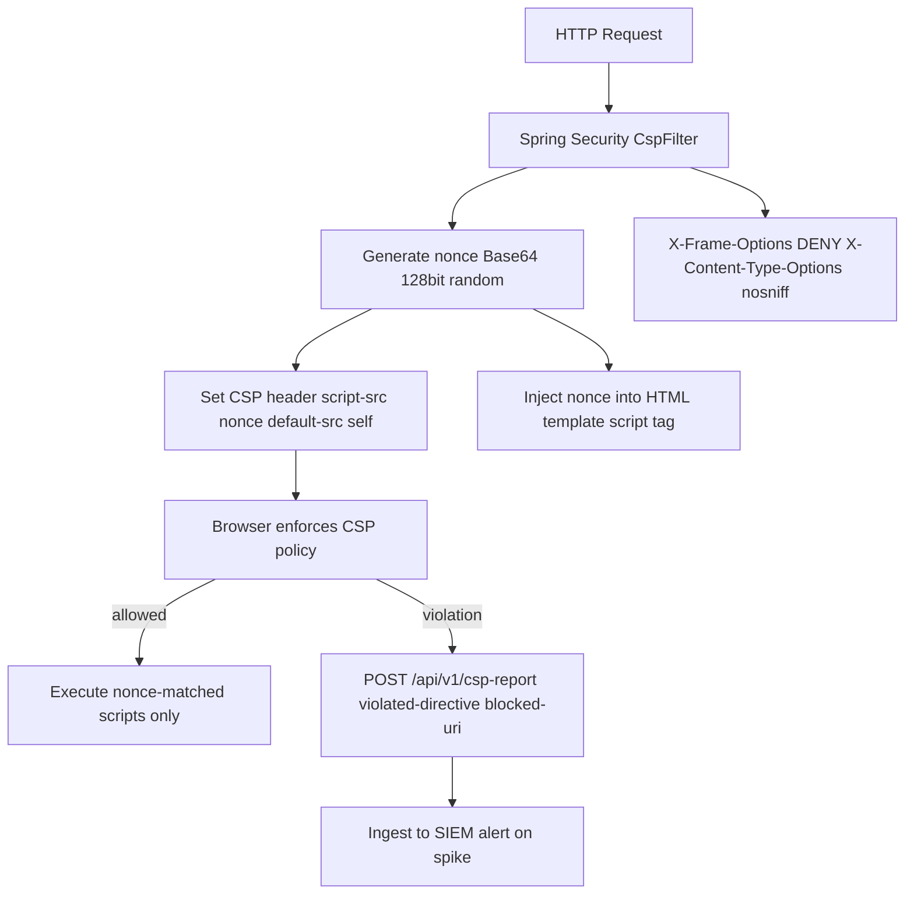

# Web CSP Hardening

Status: Draft | Last Reviewed: 2026-05-16 | Owner: @tech-lead-web
Catalog ID: FE-003 | Radii
Tier Applicability: T0, T1, T2

## Problem Statement

Banking web applications are prime targets for client-side injection attacks that steal credentials and card data:

- Unsanitised account names, beneficiary labels, or transaction remarks rendered as HTML can execute attacker-controlled JavaScript in the victim's banking session, exfiltrating JWT tokens or initiating transfers.
- A compromised analytics SDK or chat widget injected into the banking SPA can silently capture card numbers typed into payment forms — a Category 1 PCI-DSS breach (Magecart / e-skimming).
- The banking application loaded inside an attacker-controlled iframe allows overlay attacks where a transparent button captures authorisation clicks (clickjacking).
- `fetch()` and `XMLHttpRequest` calls to attacker-controlled endpoints can exfiltrate session tokens and transaction data if no `connect-src` directive restricts outbound connections.
- Dynamically evaluated `eval()` or injected `<script>` tags execute in the same origin context as the banking session, bypassing same-origin policy protections.

## Context

Content Security Policy (CSP) is an HTTP response header (`Content-Security-Policy`) that instructs the browser to restrict resource loading to explicitly permitted origins. In a banking SPA context, a strict CSP (`default-src 'none'`) with minimal allow-listed sources and `nonce`-based inline script authorisation provides defence-in-depth against XSS even when input sanitisation fails. The CSP is set by the Spring Boot backend server and validated in CI using automated header checks.

## Solution

Spring Boot sets `Content-Security-Policy` on every response via `SecurityFilterChain`. A per-request nonce (cryptographically random, 128-bit) is generated and injected into both the CSP header (`script-src 'nonce-{value}'`) and the HTML template (`<script nonce="{value}">`). Third-party scripts (analytics, maps) are loaded from specific allow-listed CDN origins. CSP violations are reported to `/api/v1/csp-report` for monitoring. The `X-Frame-Options: DENY` header prevents iframe embedding.



## Implementation Guidelines

### 1. Spring Boot CSP Header Configuration

```java
@Configuration
@RequiredArgsConstructor
public class SecurityConfig {

    @Bean
    public SecurityFilterChain securityFilterChain(HttpSecurity http) throws Exception {
        return http
            .headers(headers -> headers
                .contentSecurityPolicy(csp -> csp
                    .policyDirectives(CspNonceFilter.buildCspPolicy()))
                .frameOptions(frame -> frame.deny())
                .contentTypeOptions(Customizer.withDefaults())
                .httpStrictTransportSecurity(hsts -> hsts
                    .maxAgeInSeconds(31536000)
                    .includeSubDomains(true)
                    .preload(true)))
            .addFilterBefore(new CspNonceFilter(), UsernamePasswordAuthenticationFilter.class)
            .build();
    }
}
```

### 2. Nonce Generation Filter

```java
@Component
public class CspNonceFilter extends OncePerRequestFilter {

    public static final String NONCE_ATTR = "cspNonce";

    @Override
    protected void doFilterInternal(
            HttpServletRequest request,
            HttpServletResponse response,
            FilterChain chain) throws ServletException, IOException {

        String nonce = generateNonce();
        request.setAttribute(NONCE_ATTR, nonce);

        response.setHeader("Content-Security-Policy", buildCspPolicy(nonce));
        response.setHeader("Report-To",
            "{\"group\":\"csp-endpoint\",\"max_age\":10886400,"
            + "\"endpoints\":[{\"url\":\"/api/v1/csp-report\"}]}");
        response.setHeader("Reporting-Endpoints",
            "csp-endpoint=\"/api/v1/csp-report\"");

        chain.doFilter(request, response);
    }

    private static String generateNonce() {
        byte[] bytes = new byte[16];
        new SecureRandom().nextBytes(bytes);
        return Base64.getEncoder().encodeToString(bytes);
    }

    public static String buildCspPolicy() {
        return buildCspPolicy(null);
    }

    public static String buildCspPolicy(String nonce) {
        String scriptSrc = nonce != null
            ? "'nonce-" + nonce + "' 'strict-dynamic'"
            : "'none'";

        return String.join("; ",
            "default-src 'none'",
            "script-src " + scriptSrc,
            "style-src 'self' https://fonts.googleapis.com",
            "font-src 'self' https://fonts.gstatic.com",
            "img-src 'self' data: https://cdn.techcombank.com.vn",
            "connect-src 'self' https://api.techcombank.com.vn wss://ws.techcombank.com.vn",
            "frame-ancestors 'none'",
            "base-uri 'self'",
            "form-action 'self'",
            "report-to csp-endpoint",
            "upgrade-insecure-requests"
        );
    }
}
```

### 3. Thymeleaf / React Template Nonce Injection

```java
// Thymeleaf template (index.html):
// <script th:nonce="${cspNonce}" type="module" src="/assets/main.js"></script>
```

```typescript
// React: retrieve nonce from meta tag injected by server
function getNonce(): string {
  return document.querySelector('meta[name="csp-nonce"]')
    ?.getAttribute('content') ?? '';
}

// Used when dynamically creating script elements (rare):
function loadScript(src: string): void {
  const script = document.createElement('script');
  script.src = src;
  script.nonce = getNonce();
  document.head.appendChild(script);
}
```

### 4. CSP Violation Report Endpoint

```java
@RestController
@RequestMapping("/api/v1/csp-report")
@RequiredArgsConstructor
public class CspReportController {

    private static final Logger log = LoggerFactory.getLogger(CspReportController.class);

    @PostMapping(consumes = "application/csp-report")
    @ResponseStatus(HttpStatus.NO_CONTENT)
    public void receiveCspReport(
            @RequestBody CspReportBody body,
            HttpServletRequest request) {
        log.warn("CSP_VIOLATION violated={} blocked={} ip={}",
            body.cspReport().violatedDirective(),
            body.cspReport().blockedUri(),
            request.getRemoteAddr());
        // Emit to SIEM Kafka topic for spike detection
    }

    public record CspReportBody(@JsonProperty("csp-report") CspReport cspReport) {}
    public record CspReport(
        @JsonProperty("violated-directive") String violatedDirective,
        @JsonProperty("blocked-uri") String blockedUri,
        @JsonProperty("source-file") String sourceFile
    ) {}
}
```

## When to Use

- All T0/T1/T2 internet banking pages that render user-supplied content (account names, beneficiary labels, transaction remarks) — CSP provides defence-in-depth against XSS even when sanitisation fails.
- Pages that load third-party JavaScript (analytics, A/B testing, customer support chat) — `script-src` allow-listing limits the blast radius of a compromised third-party SDK.
- PCI-DSS in-scope pages that accept or display PAN — PCI-DSS §6.4.3 requires explicit management of client-side scripts; CSP with nonce provides the required audit trail.

## When Not to Use

- Internal tools accessible only from the corporate network where external attacker injection is not a realistic threat model — CSP adds nonce management overhead without material risk reduction.
- Legacy applications with heavy `eval()` usage or inline event handlers that cannot be refactored — CSP will break these without a migration effort; plan the refactor before enabling CSP.
- `report-only` mode in production beyond 2 weeks — `Content-Security-Policy-Report-Only` is for testing; leaving it in report-only indefinitely provides no enforcement protection.

## Variants

| Variant | Use when | Trade-off |
|---------|----------|-----------|
| Nonce-based strict CSP (this pattern) | Modern React SPA; no legacy inline scripts; Spring Boot backend | Requires per-request nonce; cannot use static CDN-cached HTML without server-side rendering |
| Hash-based CSP | Static site generator; no server-side rendering; fixed inline scripts | Hashes computed at build time; inline script changes require build and deploy; inflexible |
| CSP Level 1 with allow-list (legacy) | Brownfield apps with unrefactorable inline scripts | Low security value; allow-listed origins can be compromised; not recommended for new banking apps |

## NFR Acceptance Criteria

| Metric | Threshold | Measurement |
|--------|-----------|-------------|
| CSP header presence | 100% of responses | Playwright: GET each page; assert Content-Security-Policy header present |
| Nonce uniqueness | No two requests share the same nonce | Load test: 1000 concurrent requests; extract nonces from CSP headers; assert zero duplicates |
| CSP violation rate (legitimate traffic) | < 0.01% of page loads | Production alert: CSP report volume / total page loads; threshold 0.01% |
| XSS penetration test pass | Zero high/critical XSS findings | Quarterly pen test; OWASP ZAP automated scan in CI |
| X-Frame-Options presence | DENY on all responses | curl -I in CI; assert header present |

## Compliance Mapping

| Ring | Regulation | Provision | How this pattern satisfies |
|------|-----------|-----------|---------------------------|
| Ring 0 | OWASP ASVS V14.4 | V14.4.3 — HTTP security headers prevent browser-based attacks | CSP header with nonce satisfies V14.4.3; X-Frame-Options: DENY satisfies V14.4.2; X-Content-Type-Options: nosniff satisfies V14.4.1; HSTS satisfies V14.4.4. |
| Ring 1 | PCI-DSS v4.0 | §6.4.3 — manage all payment page scripts; authorise and integrity-check client-side scripts | CSP script-src nonce ensures only server-authorised scripts execute; nonce is a per-request cryptographic authorisation; CSP report endpoint logs any unauthorised script injection attempts. |
| Ring 2 | SBV Circular 09/2020 | §III.3 — security requirements for internet banking applications; prevent unauthorised access and data exfiltration ⚠️ (working summary — pending Legal review) | connect-src restricts outbound connections to authorised origins only, preventing credential exfiltration; frame-ancestors none prevents clickjacking on banking authorisation screens; Legal review required to confirm CSP configuration satisfies SBV §III.3 in full. |

## Cost / FinOps

- Nonce generation: one `SecureRandom().nextBytes(16)` per request — negligible CPU (< 0.1 ms) even at 10,000 rps.
- CSP report endpoint: at 0.01% violation rate with 1M daily page loads = 100 violations/day — trivial Kafka throughput.
- No CDN configuration required — CSP is a response header from the origin; the SPA can still be CDN-cached since the nonce is in the HTML `<head>`, not the bundle.
- Cost of not having CSP: a single Magecart injection incident in a banking application typically costs USD 200,000–500,000 in forensics, remediation, regulatory fines, and customer notification under Decree 13/2023.

## Threat Model

- **XSS via stored content (Tampering)**: Attacker stores a malicious `<script>alert(1)</script>` as a beneficiary name. Without CSP, this executes in the victim's session. Mitigation: CSP `script-src 'nonce-{value}'` blocks any inline script without the server-issued nonce; the attacker's injected `<script>` tag lacks the nonce and is blocked.
- **Compromised third-party SDK exfiltrating credentials (Information Disclosure)**: Analytics SDK is supply-chain compromised and sends `document.cookie` and `localStorage` content to attacker's server. Mitigation: `connect-src 'self' https://api.techcombank.com.vn` blocks any `fetch` or `XHR` to external origins not explicitly allow-listed; the compromised SDK cannot exfiltrate to the attacker's C2 server.

## Runbook Stub

**Alert: `csp_violation_spike > 10/min`** (SIEM)
- p50 baseline: 0–2 violations/day | p99 SLO: < 0.01% of page loads
- Remediation: (1) Check `violated-directive` in violation log — `script-src` violations indicate a script injection attempt or a new legitimate script not yet nonce-authorised. (2) If `blocked-uri` is a new CDN URL for a legitimate SDK, add to `script-src` allow-list and deploy. (3) If `blocked-uri` is an unknown domain, escalate to CISO — potential active XSS campaign. (4) Check `source-file` for the originating page.

## Test Strategy Stub

- **Unit**: `CspNonceFilter` — send two requests; assert nonces are different. Assert CSP header contains `nonce-{value}` matching the request attribute.
- **Unit**: `buildCspPolicy` — assert all required directives present (`default-src`, `script-src`, `connect-src`, `frame-ancestors`).
- **Integration**: Spring Boot Test — `GET /login`; assert `Content-Security-Policy` header present; assert `X-Frame-Options: DENY`; assert `nonce-` token in header matches script tag nonce in response body.
- **Integration**: CSP report — `POST /api/v1/csp-report` with mock violation body; assert 204 response; assert violation logged.
- **Security**: OWASP ZAP baseline scan in CI — `zap-baseline.py -t http://localhost:8080`; assert no CSP finding.
- **Security**: Playwright XSS injection — submit `` as beneficiary name; render page; assert `window.__xss` is undefined (CSP blocked inline handler).

## Related Patterns

- [FE-002 Web Resilience / Offline-First](web-resilience-offline-first.md) — service worker registration requires CSP worker-src 'self'
- [FE-005 Web Error Boundary](web-error-boundary.md) — error boundaries must not expose stack traces to XSS payloads

## References

- [MDN Content Security Policy reference](https://developer.mozilla.org/en-US/docs/Web/HTTP/CSP)
- [OWASP CSP Cheat Sheet](https://cheatsheetseries.owasp.org/cheatsheets/Content_Security_Policy_Cheat_Sheet.html)
- [PCI-DSS v4.0 §6.4.3](https://www.pcisecuritystandards.org/document_library/)
- [Google CSP Evaluator](https://csp-evaluator.withgoogle.com/)
- [Spring Security — Content Security Policy](https://docs.spring.io/spring-security/reference/features/exploits/headers.html#headers-csp)
- Catalog reference: `governance/standards/enterprise-architecture-catalog.md`
