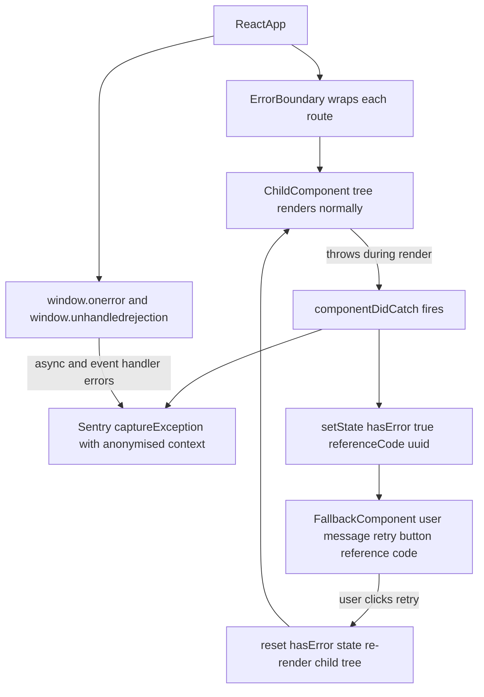

# Web Error Boundary

Status: Draft | Last Reviewed: 2026-05-16 | Owner: @tech-lead-web
Catalog ID: FE-005 | Radii
Tier Applicability: T0, T1, T2

## Problem Statement

Unhandled JavaScript exceptions in banking React applications cause blank screens that trap customers mid-transaction:

- **Blank white screen on runtime error**: an uncaught exception in the account overview component crashes the entire React tree, rendering a blank page — the customer sees nothing and cannot navigate away, leading to session abandonment and support calls.
- **Absence of retry capability**: when a component crashes due to a transient network error or a race condition, the customer has no way to retry without a full page reload, losing any unsaved form state.
- **Error details exposed to users**: stack traces containing internal service names, API endpoints, and variable values are rendered in development mode and accidentally left on in production, giving attackers insight into the application architecture.
- **No error reporting to operations**: uncaught exceptions in the browser are invisible to the SRE team unless explicitly sent to an error tracking service; silent failures accumulate without triggering alerts.
- **Async errors outside React lifecycle not caught**: errors in event handlers, `setTimeout` callbacks, and promise rejections are not caught by React Error Boundaries and require additional global error handlers.

## Context

React Error Boundaries are class components that implement `componentDidCatch` and `getDerivedStateFromError`. They wrap component subtrees and catch any rendering, lifecycle, or constructor error in the subtree. In a banking SPA, each page-level route and each critical widget (balance display, transfer form) should be wrapped in an error boundary with an appropriate fallback UI. Sentry (or equivalent) is integrated to capture the error event with full context.

## Solution

A reusable `ErrorBoundary` class component wraps each top-level route and high-value widget. On error, it renders a `FallbackComponent` that shows a user-friendly message in Vietnamese/English (FE-006), a retry button, and a reference code. Sentry `captureException` sends the error event with user context (anonymised), component stack, and breadcrumbs. A global `window.onerror` and `unhandledrejection` handler catches async errors outside the React tree.



## Implementation Guidelines

### 1. ErrorBoundary Class Component

```typescript
// src/components/ErrorBoundary.tsx
import React, { Component, ErrorInfo, ReactNode } from 'react';
import * as Sentry from '@sentry/react';
import { FallbackComponent } from './FallbackComponent';

interface Props {
  children: ReactNode;
  fallback?: ReactNode;
  onError?: (error: Error, info: ErrorInfo) => void;
  boundaryName?: string;
}

interface State {
  hasError: boolean;
  referenceCode: string;
  error: Error | null;
}

export class ErrorBoundary extends Component<Props, State> {
  constructor(props: Props) {
    super(props);
    this.state = { hasError: false, referenceCode: '', error: null };
  }

  static getDerivedStateFromError(error: Error): Partial<State> {
    return {
      hasError: true,
      error,
      referenceCode: `TCB-${crypto.randomUUID().slice(0, 8).toUpperCase()}`,
    };
  }

  componentDidCatch(error: Error, info: ErrorInfo): void {
    // Sanitise error message — never expose raw stack in production
    const safeMessage = import.meta.env.PROD
      ? 'An unexpected error occurred'
      : error.message;

    Sentry.captureException(error, {
      extra: {
        componentStack: info.componentStack,
        boundaryName: this.props.boundaryName ?? 'unknown',
        referenceCode: this.state.referenceCode,
      },
      // Note: never include PII in Sentry context
    });

    this.props.onError?.(error, info);
  }

  handleRetry = (): void => {
    this.setState({ hasError: false, error: null, referenceCode: '' });
  };

  render(): ReactNode {
    if (this.state.hasError) {
      return this.props.fallback ?? (
        <FallbackComponent
          referenceCode={this.state.referenceCode}
          onRetry={this.handleRetry}
        />
      );
    }
    return this.props.children;
  }
}
```

### 2. FallbackComponent

```typescript
// src/components/FallbackComponent.tsx
import { useTranslation } from 'react-i18next';

interface Props {
  referenceCode: string;
  onRetry?: () => void;
}

export function FallbackComponent({ referenceCode, onRetry }: Props) {
  const { t } = useTranslation('errors');

  return (
    <div role="alert" aria-live="assertive" className="error-fallback">
      <h2>{t('error.title', 'Something went wrong')}</h2>
      <p>{t('error.message', 'We encountered an unexpected error. Please try again.')}</p>
      <p className="reference-code">
        {t('error.reference', 'Reference')}: <code>{referenceCode}</code>
      </p>
      {onRetry && (
        <button
          type="button"
          onClick={onRetry}
          className="btn-retry"
          aria-label={t('error.retry', 'Try again')}
        >
          {t('error.retry', 'Try again')}
        </button>
      )}
      <p className="support-note">
        {t('error.support',
          'If this error persists, please contact support with the reference code above.')}
      </p>
    </div>
  );
}
```

### 3. Global Async Error Handler

```typescript
// src/lib/globalErrorHandlers.ts
import * as Sentry from '@sentry/react';

export function registerGlobalErrorHandlers(): void {
  window.addEventListener('unhandledrejection', (event) => {
    // Prevent default browser error logging (may expose internals)
    event.preventDefault();

    const reason = event.reason instanceof Error
      ? event.reason
      : new Error(String(event.reason));

    Sentry.captureException(reason, {
      extra: { type: 'unhandledrejection' },
    });
  });

  window.onerror = (message, source, line, col, error) => {
    if (error) {
      Sentry.captureException(error, {
        extra: { type: 'window.onerror', source, line, col },
      });
    }
    return true; // Prevent default browser error UI
  };
}
```

### 4. Usage in Routes

```typescript
// src/App.tsx
import { ErrorBoundary } from './components/ErrorBoundary';
import { registerGlobalErrorHandlers } from './lib/globalErrorHandlers';

registerGlobalErrorHandlers();

export function App() {
  return (
    <ErrorBoundary boundaryName="app-root">
      <Router>
        <Route path="/accounts" element={
          <ErrorBoundary boundaryName="accounts-page">
            <AccountsPage />
          </ErrorBoundary>
        } />
        <Route path="/transfer" element={
          <ErrorBoundary boundaryName="transfer-page">
            <TransferPage />
          </ErrorBoundary>
        } />
      </Router>
    </ErrorBoundary>
  );
}
```

### 5. Sentry Initialisation

```typescript
// src/main.tsx
import * as Sentry from '@sentry/react';

Sentry.init({
  dsn: import.meta.env.VITE_SENTRY_DSN,
  environment: import.meta.env.MODE,
  beforeSend(event) {
    // Scrub any accidental PII from error events
    if (event.user) {
      delete event.user.email;
      delete event.user.ip_address;
    }
    return event;
  },
  tracesSampleRate: 0.1,
});
```

## When to Use

- All T0/T1/T2 route-level components in a banking React SPA — every page the customer can navigate to must have an error boundary to prevent full-page crashes.
- High-value widgets that operate independently (balance display, transfer history, notification panel) — wrap each in its own error boundary so one widget crash does not destroy the entire page.
- Any component that fetches data from the backend API — network errors surface as exceptions during render if not handled by React Query's `error` state; error boundaries provide the final catch.

## When Not to Use

- Event handler errors — `onClick`, `onSubmit` — these are not caught by error boundaries; handle them with `try/catch` in the handler or React Query mutation error handling.
- Async errors in `useEffect` — unhandled promise rejections in `useEffect` are not caught by error boundaries; use the `try/catch` pattern inside `useEffect` or the global `unhandledrejection` handler.
- Server-side rendering (Next.js `error.tsx`) — use Next.js's own error component convention instead of React Error Boundaries for SSR error handling.

## Variants

| Variant | Use when | Trade-off |
|---------|----------|-----------|
| Class component ErrorBoundary (this pattern) | Full control over retry logic; custom fallback per boundary; stable API | Requires class component; slightly more boilerplate than hooks |
| `react-error-boundary` library | Prefer hooks API; `useErrorBoundary`; minimal boilerplate | Third-party dependency; slightly less control |
| Sentry `withSentryRouting` + auto error boundaries | Full Sentry integration; performance tracing per route | Vendor dependency; automatic boundaries may catch too broadly |

## NFR Acceptance Criteria

| Metric | Threshold | Measurement |
|--------|-----------|-------------|
| Error boundary coverage | 100% of route-level components | ESLint rule + ArchUnit: assert every `<Route element={...}>` is wrapped in `ErrorBoundary` |
| Uncaught error rate (production) | < 0.01% of sessions | Sentry: `unhandledrejection` events / total sessions < 0.0001 |
| Fallback render time | ≤ 100 ms from exception to fallback visible | React Profiler: time from `getDerivedStateFromError` to fallback DOM paint |
| Retry success rate | ≥ 80% of retries resolve without full reload | Sentry: custom metric `error_boundary.retry_success_rate` |
| PII in error events | 0 occurrences | Sentry `beforeSend` scrubbing; automated scan of Sentry events for NRIC/phone/email patterns |

## Compliance Mapping

| Ring | Regulation | Provision | How this pattern satisfies |
|------|-----------|-----------|---------------------------|
| Ring 0 | OWASP ASVS V7.4 | V7.4.1 — no sensitive information in error messages returned to client | `FallbackComponent` renders only a sanitised message and reference code; raw `error.message` and `componentStack` are sent only to Sentry, not rendered to the user; `import.meta.env.PROD` guard prevents stack trace exposure in production. |
| Ring 1 | — | — | No direct Ring 1 regulatory mapping for frontend error handling. |
| Ring 2 | Decree 13/2023 | §6 — personal data must not be processed beyond the original collection purpose; error logs must not contain personal data ⚠️ (working summary — pending Legal review) | `beforeSend` hook deletes `event.user.email` and `event.user.ip_address` from Sentry events; error logs in Sentry contain only anonymised `userId`; Legal review required to confirm Sentry data processing agreement and data residency satisfy Decree 13/2023 requirements. |

## Cost / FinOps

- Sentry: Developer plan (free) for up to 5 000 errors/month; Team plan ($26/month) for production volumes. At 1M daily active users with 0.01% error rate = 100 errors/day ≈ 3 000/month — Developer plan sufficient.
- `@sentry/react` bundle: ~26 KB gzipped — within the 200 KB FE-001 budget when lazy-loaded after critical path.
- Error boundary overhead: `getDerivedStateFromError` runs only on error — zero performance cost on the happy path.

## Threat Model

- **Stack trace exposure in production (Information Disclosure)**: If the `import.meta.env.PROD` guard is absent or `NODE_ENV` is misconfigured, `error.message` may contain API endpoint paths or internal variable names that aid attackers in reconnaissance. Mitigation: the guard is present in `componentDidCatch`; a CI lint rule checks that `error.message` is not directly rendered in JSX; production builds are validated with `VITE_MODE=production`.
- **Unhandled async rejection leaking PII (Information Disclosure)**: A promise rejection carrying a failed API response body (which may contain account numbers) is caught by `window.unhandledrejection` and sent to Sentry. Mitigation: `beforeSend` strips `user.email` and `user.ip_address`; error event breadcrumbs are sanitised by Sentry's built-in PII scrubber configured with NRIC and account number patterns.

## Runbook Stub

**Alert: `sentry_error_rate_spike > 100 errors/min`**
- p50 baseline: 0–5 errors/min | p99 SLO: < 10 errors/min
- Remediation: (1) Check Sentry for the top error — `boundaryName` in the event extra tells you which component tree is failing. (2) If `accounts-page` boundary is triggering, check the Account API for 5xx responses. (3) If `transfer-page` boundary is triggering, check the Transfer API and recent deployments. (4) If the error is a `ChunkLoadError`, a new deployment may have rotated asset URLs — force a hard reload by incrementing the service worker version.

## Test Strategy Stub

### Unit Tests
- `ErrorBoundary` test: wrap a `ThrowingComponent` that `throw new Error('test')`; assert `FallbackComponent` renders; assert `referenceCode` is a non-empty string. Assert retry: click retry button; assert `ThrowingComponent` is re-rendered (child tree reset).
- `FallbackComponent` test: render with `referenceCode="TCB-ABCD1234"`; assert reference code visible in DOM; assert retry button has correct `aria-label`.

### Integration Tests
- Playwright: navigate to `/accounts`; inject `window.__triggerError = true`; assert fallback message visible; assert no stack trace visible in DOM; click retry; assert accounts page renders normally.
- Sentry mock test: capture Sentry events during a simulated crash; assert `user.email` absent from event; assert `boundaryName` present in `extra`.

### Compliance Tests
- PII scan: inject an error with message containing `0123456789` (fake NRIC); assert Sentry `beforeSend` scrubs it; assert scrubbed event is sent.

## Related Patterns

- [FE-001 Web Performance Budgets](web-performance-budgets.md) — error boundary fallbacks must not cause CLS spikes
- [FE-002 Web Resilience / Offline-First](web-resilience-offline-first.md) — offline errors (network failures during render) should be caught by error boundaries and show offline-specific fallback
- [SEC-012 Tamper-Evident Audit Logging](../../patterns/security/audit-logging-tamper-evident.md) — Sentry error events feed into the centralised audit log for incident investigation

## References

- [React Error Boundaries documentation](https://react.dev/reference/react/Component#catching-rendering-errors-with-an-error-boundary)
- [Sentry React SDK](https://docs.sentry.io/platforms/javascript/guides/react/)
- [OWASP ASVS V7.4 — Error Handling and Logging](https://owasp.org/www-project-application-security-verification-standard/)
- [react-error-boundary library](https://github.com/bvaughn/react-error-boundary)
- Catalog reference: `governance/standards/enterprise-architecture-catalog.md`
- Research notes: `knowledge-base/_research-notes.md`
