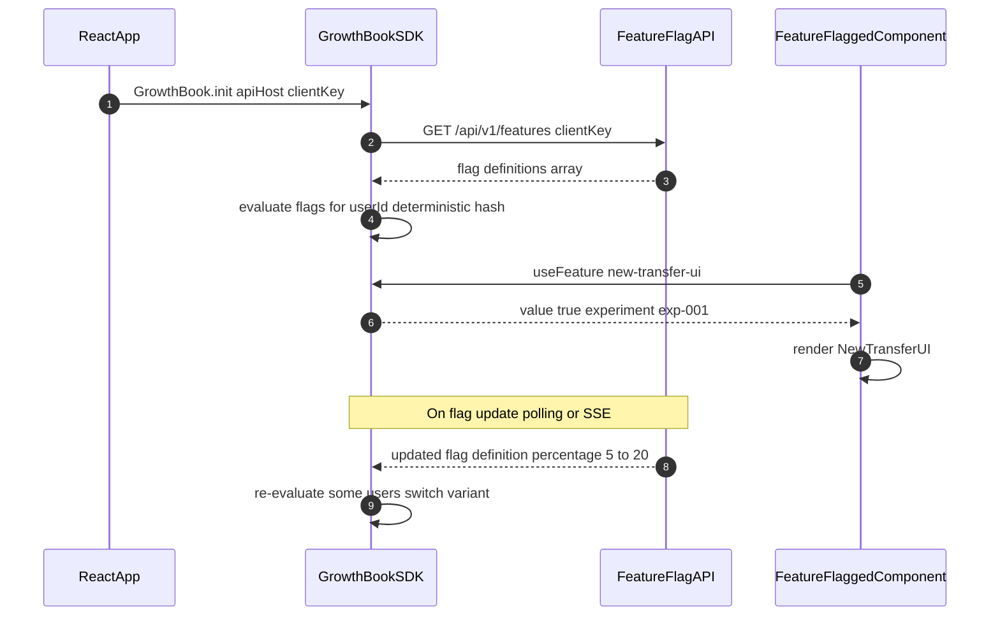

# Web Feature Flags

Status: Draft | Last Reviewed: 2026-05-16 | Owner: @tech-lead-web
Catalog ID: FE-004 | Radii
Tier Applicability: T1, T2, T3

## Problem Statement

Banking product teams cannot safely roll out new features without the ability to control exposure independently of deployments:

- Big-bang releases deploying a new transfer UI to 100% of customers on day one means any defect immediately affects the full user base — rollback requires a new deployment, not a flag toggle.
- Without feature flags, the team cannot roll out a new payment flow to 5% of customers, monitor error rates, then expand — every release is all-or-nothing.
- Comparing two variants of the beneficiary addition flow requires maintaining two code branches or two deployments, rather than a single deployment with a flag controlling which variant is shown.
- A critical bug in a newly launched feature (e.g., incorrect currency conversion display) cannot be disabled without a hotfix deployment, incurring 30–60 minutes of impact while CI/CD runs.
- Releasing new banking features to all customers without a gradual rollout phase conflicts with SBV Circular 09/2020 change management requirements for internet banking system modifications.

## Context

Feature flags are evaluated at runtime by the GrowthBook SDK on the client side, with flag definitions stored in the GrowthBook service (or a lightweight Spring Boot flag API). Flag evaluation is deterministic per user — a customer assigned to the "new-transfer-ui" variant always sees that variant across sessions and devices. Critical features (fund transfers, payment authorisation) are also gated server-side; the client-side flag controls UI only, never security or business logic.

## Solution

The GrowthBook SDK fetches flag definitions from the feature flag API on app startup and evaluates flags client-side using deterministic hashing on `userId`. The `useFeature` React hook provides the flag value to components. A Spring Boot feature flag endpoint serves definitions and is the authoritative source for server-side flag evaluation. Flags are defined in YAML with percentage rollout and segment targeting rules.



## Implementation Guidelines

### 1. GrowthBook SDK Integration

```typescript
// src/lib/featureFlags.ts
import { GrowthBook } from '@growthbook/growthbook-react';
import type { AppFeatures } from './featureTypes';

export const growthbook = new GrowthBook<AppFeatures>({
  apiHost: import.meta.env.VITE_FEATURE_FLAG_API_HOST,
  clientKey: import.meta.env.VITE_FEATURE_FLAG_CLIENT_KEY,
  enableDevMode: import.meta.env.DEV,
  trackingCallback: (experiment, result) => {
    window.analytics?.track('Experiment Viewed', {
      experimentId: experiment.key,
      variationId: result.variationId,
    });
  },
});

export async function initFeatureFlags(userId: string): Promise<void> {
  growthbook.setAttributes({
    id: userId,
    // Never pass PII — use anonymised userId only
  });
  await growthbook.loadFeatures({ autoRefresh: true });
}
```

### 2. useFeature Hook and Feature-Flagged Component

```typescript
// src/hooks/useFeature.ts
import { useFeature as useGrowthbookFeature } from '@growthbook/growthbook-react';
import type { AppFeatures } from '../lib/featureTypes';

export function useFeature<K extends keyof AppFeatures>(
  featureKey: K
): { value: AppFeatures[K]; loading: boolean } {
  const feature = useGrowthbookFeature<AppFeatures[K]>(featureKey);
  return {
    value: feature.value ?? getDefaultValue(featureKey),
    loading: !feature.value && feature.value !== false,
  };
}

function getDefaultValue<K extends keyof AppFeatures>(key: K): AppFeatures[K] {
  const defaults: AppFeatures = {
    'new-transfer-ui': false,
    'instant-beneficiary-add': false,
    'fx-rate-calculator': false,
  };
  return defaults[key];
}
```

```typescript
// src/components/TransferPage.tsx
import { useFeature } from '../hooks/useFeature';
import { NewTransferForm } from './NewTransferForm';
import { LegacyTransferForm } from './LegacyTransferForm';

export function TransferPage() {
  const { value: useNewUI } = useFeature('new-transfer-ui');
  return useNewUI ? <NewTransferForm /> : <LegacyTransferForm />;
}
```

### 3. Feature Flag Type Definitions

```typescript
// src/lib/featureTypes.ts
export interface AppFeatures {
  'new-transfer-ui': boolean;
  'instant-beneficiary-add': boolean;
  'fx-rate-calculator': boolean;
}
```

### 4. Spring Boot Feature Flag API

```java
@RestController
@RequestMapping("/api/v1/features")
@RequiredArgsConstructor
public class FeatureFlagController {

    private final FeatureFlagService flagService;

    @GetMapping
    public ResponseEntity<FeatureFlagResponse> getFlags(
            @RequestHeader("X-Client-Key") String clientKey) {
        if (!flagService.isValidClientKey(clientKey)) {
            return ResponseEntity.status(HttpStatus.UNAUTHORIZED).build();
        }
        return ResponseEntity.ok(flagService.getFlagDefinitions());
    }
}

@Service
@RequiredArgsConstructor
public class FeatureFlagService {

    private final FeatureFlagRepository flagRepository;

    public FeatureFlagResponse getFlagDefinitions() {
        return new FeatureFlagResponse(flagRepository.findAllActive());
    }

    public boolean isValidClientKey(String key) {
        return flagRepository.existsByClientKey(key);
    }
}
```

### 5. Flag Definition YAML (Consul / Spring Config)

```yaml
# application-flags.yml
feature-flags:
  new-transfer-ui:
    enabled: true
    rollout:
      percentage: 20
      hashAttribute: id
    environments:
      production: true
      staging: true
  instant-beneficiary-add:
    enabled: true
    rollout:
      percentage: 5
      hashAttribute: id
    killSwitch: false
  fx-rate-calculator:
    enabled: false
```

## When to Use

- T1/T2 product features (new UI flows, new payment types) being progressively rolled out to reduce blast radius of defects.
- A/B testing new UX patterns (beneficiary selection, transfer confirmation flow) with analytics tracking to compare conversion rates.
- Emergency kill switches for features that may have critical bugs — toggling a flag from 100% to 0% is a sub-second operation requiring no deployment.

## When Not to Use

- Security controls, authentication, or authorisation decisions — feature flags are client-side and can be bypassed; never use a flag as the sole gate for security-sensitive functionality.
- T0 core transaction processing (payment routing, ledger posting) — these must not be conditionally enabled/disabled at runtime without extensive testing in staging; use database configuration instead.
- Features that are genuinely ready for all users — feature flags that are never cleaned up accumulate as technical debt; if there's no plan to remove the flag within 2 sprints, reconsider whether a flag is needed.

## Variants

| Variant | Use when | Trade-off |
|---------|----------|-----------|
| GrowthBook SDK client-side (this pattern) | Product feature rollouts; A/B testing; React SPA; open-source | Flags are visible in browser DevTools; not suitable for security gates |
| Server-side flag evaluation only | Flags control server behaviour; security-sensitive gating; no client exposure | No client-side React integration; requires API call per flag check; higher latency |
| LaunchDarkly / Statsig (commercial) | Enterprise contract; dedicated experimentation platform; complex targeting rules | Cost: USD 1,000–5,000/month; vendor lock-in; GDPR data residency considerations |

## NFR Acceptance Criteria

| Metric | Threshold | Measurement |
|--------|-----------|-------------|
| Flag evaluation latency | ≤ 1 ms (client-side, after initial load) | useFeature call with loaded SDK; assert sync evaluation < 1 ms |
| Flag definition load time | ≤ 500 ms (from app startup to flags available) | Playwright: measure time from app mount to first useFeature return |
| Kill switch effectiveness | ≤ 30 s to reach all active sessions | Update flag to 0%; poll useFeature in 10 active sessions; assert all see updated value within 30 s |
| Flag API availability | 99.9% (flags cached client-side; degraded to defaults on API unavailability) | Kill flag API; assert app continues with default false values |

## Compliance Mapping

| Ring | Regulation | Provision | How this pattern satisfies |
|------|-----------|-----------|---------------------------|
| Ring 0 | OWASP ASVS V14.2 | V14.2.1 — verify that all components are up-to-date and unused components are removed | Feature flags enable unused code paths to be disabled without deployment; stale flags must be removed within 2 sprints per the flag lifecycle policy. |
| Ring 1 | — | — | No direct Ring 1 regulatory mapping for feature flag infrastructure. |
| Ring 2 | SBV Circular 09/2020 | §V.1 — change management for internet banking systems; gradual rollout required for significant changes ⚠️ (working summary — pending Legal review) | Percentage-based rollout (5% to 20% to 100%) satisfies gradual deployment requirements; flag audit log records who changed rollout percentage and when; Legal review required to confirm GrowthBook audit trail satisfies SBV §V.1 change management evidence requirements. |

## Cost / FinOps

- GrowthBook OSS: free; self-hosted on a single `t3.small` (~USD 17/month) with PostgreSQL RDS (`db.t3.micro` ~USD 15/month); total ~USD 32/month.
- Feature Flag API (Spring Boot): shares existing API cluster; no additional infrastructure.
- Client-side SDK bundle: `@growthbook/growthbook-react` is ~12 KB gzipped — acceptable against the 200 KB budget (FE-001).
- Cost of not having feature flags: a single all-hands rollback deployment takes 45–60 minutes of engineer time; at a loaded hourly rate of USD 150, one incident costs USD 112–225.

## Threat Model

- **Flag bypass via client-side manipulation (Elevation of Privilege)**: A developer customer modifies the GrowthBook SDK state in browser DevTools to enable a feature flagged at 5% rollout, accessing an unfinished payment flow with an exploitable bug. Mitigation: critical flows (payment execution, account changes) are also gated server-side — the backend validates the user is in the permitted segment before processing the request; client-side flags control UI only.
- **Flag API unavailability causing all features disabled (Denial of Service)**: If the Flag API is unreachable, the SDK initialises with empty flag definitions, defaulting all flags to `false`, potentially disabling features that were at 100% rollout. Mitigation: `loadFeatures({ timeout: 2000 })` with a local storage fallback of the last-known flag state; features at 100% rollout are moved to default `true` in the `getDefaultValue` function after a grace period.

## Runbook Stub

**Alert: `feature_flag_api_error_rate > 5%`**
- p50 baseline: 0 errors | p99 SLO: < 1% error rate
- Remediation: (1) `kubectl get pods -l app=feature-flag-api` — check pod health. (2) If pod is crashing, check logs for database connectivity. (3) Clients will fall back to cached flags — monitor for stale flag serving beyond 5 minutes. (4) If flag API is completely down, clients degrade to hardcoded defaults — verify critical features default to `false` for unfinished flags and `true` for graduated flags.

## Test Strategy Stub

- **Unit**: `useFeature` hook — mock GrowthBook with `'new-transfer-ui': true`; render `TransferPage`; assert `NewTransferForm` is rendered. Mock `'new-transfer-ui': false`; assert `LegacyTransferForm` rendered.
- **Unit**: `getDefaultValue` — assert all flags default to `false` before SDK loads; assert no feature is accidentally default-enabled.
- **Integration (Playwright)**: Set GrowthBook feature to `true` via test API; navigate to `/transfer`; assert new UI elements are visible. Set to `false`; reload; assert legacy UI.
- **Integration**: Flag API — `GET /api/v1/features` with valid client key; assert 200 with flag definitions. With invalid key; assert 401.
- **Visual Regression**: Screenshot both feature flag variants (old and new transfer UI) in CI; assert no unintended visual changes to the non-flagged variant across deployments.

## Related Patterns

- [FE-001 Web Performance Budgets](web-performance-budgets.md) — flagged feature code paths should be lazy-loaded to avoid bundle size impact on users in the control group
- [PRIN-002 Event-Driven Architecture](../../principles/event-driven-architecture.md) — flag changes can be propagated via Kafka events to server-side consumers for consistent server+client state

## References

- [GrowthBook React SDK documentation](https://docs.growthbook.io/lib/react)
- [GrowthBook OSS — self-hosting guide](https://docs.growthbook.io/self-host)
- [Martin Fowler — Feature Toggles](https://martinfowler.com/articles/feature-toggles.html)
- [LaunchDarkly — Feature Flag Best Practices](https://launchdarkly.com/blog/best-practices-short-lived-feature-flags/)
- Catalog reference: `governance/standards/enterprise-architecture-catalog.md`
