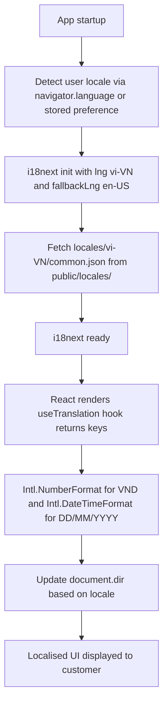

# Web i18n / RTL

Status: Draft | Last Reviewed: 2026-05-16 | Owner: @tech-lead-web
Catalog ID: FE-006 | Radii
Tier Applicability: T0, T1, T2, T3

## Problem Statement

Techcombank's digital banking platform serves Vietnamese-speaking customers and must comply with SBV requirements for Vietnamese-language banking interfaces:

- **Hardcoded UI strings**: currency labels, button text, error messages, and field labels embedded directly in JSX components (`"Confirm Transfer"`, `"Account Balance"`) prevent localisation and violate Decree 13/2023's requirement for Vietnamese-language consumer banking interfaces.
- **Incorrect currency formatting**: `amount.toFixed(2)` displays VND as `₫12,500,000.00` — Vietnamese convention omits decimal places for VND; incorrect formatting erodes customer trust and may constitute a regulatory display violation.
- **Date format mismatch**: ISO 8601 dates (`2026-05-16`) displayed verbatim to Vietnamese customers do not match the local convention (`16/05/2026`); transaction histories with wrong date formats generate customer complaints.
- **Layout breakage on RTL switch**: hardcoded CSS `margin-left`, `padding-right`, and `text-align: left` rules break symmetrically when the language is switched to Arabic or Hebrew for future internationalisation; using CSS logical properties from the start prevents a costly refactor.
- **Missing plural forms for Vietnamese**: i18next defaults to English plural rules (singular/plural); Vietnamese has no grammatical plural — applying English plural logic to Vietnamese strings produces grammatically incorrect translations.

## Context

i18next is the industry-standard i18n library for React applications, with `react-i18next` providing hooks (`useTranslation`) and components (`Trans`). Vietnamese is the primary locale (`vi-VN`); English (`en-US`) is the secondary locale for developer tools and international customers. `Intl.NumberFormat` and `Intl.DateTimeFormat` provide locale-aware formatting without additional dependencies. CSS logical properties (`margin-inline-start`, `padding-block-end`) are used exclusively for directional spacing to support RTL locales without CSS overrides.

## Solution

All UI strings are extracted to JSON namespace files (`locales/vi-VN/common.json`, `locales/en-US/common.json`). The `useTranslation` hook retrieves the appropriate string by key. Currency is formatted with `Intl.NumberFormat('vi-VN', { style: 'currency', currency: 'VND' })`. Dates use `Intl.DateTimeFormat('vi-VN', { dateStyle: 'short' })`. The `<html dir="ltr">` attribute is updated on locale change. CSS uses logical properties throughout.



## Implementation Guidelines

### 1. i18next Configuration

```typescript
// src/lib/i18n.ts
import i18next from 'i18next';
import { initReactI18next } from 'react-i18next';
import HttpBackend from 'i18next-http-backend';
import LanguageDetector from 'i18next-browser-languagedetector';

i18next
  .use(HttpBackend)
  .use(LanguageDetector)
  .use(initReactI18next)
  .init({
    fallbackLng: 'en-US',
    supportedLngs: ['vi-VN', 'en-US'],
    defaultNS: 'common',
    ns: ['common', 'errors', 'transfer', 'accounts'],
    backend: {
      loadPath: '/locales/{{lng}}/{{ns}}.json',
    },
    detection: {
      order: ['localStorage', 'navigator'],
      caches: ['localStorage'],
      lookupLocalStorage: 'tcb-locale',
    },
    interpolation: {
      escapeValue: false, // React already escapes
    },
    // Vietnamese has no plural forms
    pluralSeparator: '_',
    nsSeparator: ':',
  });

// Update document direction on language change
i18next.on('languageChanged', (lng) => {
  const dir = i18next.dir(lng);
  document.documentElement.setAttribute('dir', dir);
  document.documentElement.setAttribute('lang', lng);
});

export default i18next;
```

### 2. Locale Files

```json
// public/locales/vi-VN/common.json
{
  "transfer": {
    "title": "Chuyển tiền",
    "confirm": "Xác nhận chuyển tiền",
    "amount_label": "Số tiền",
    "recipient_label": "Người nhận",
    "success": "Giao dịch thành công",
    "error": "Có lỗi xảy ra"
  },
  "accounts": {
    "balance": "Số dư",
    "last_updated": "Cập nhật lúc {{time}}"
  },
  "common": {
    "retry": "Thử lại",
    "cancel": "Hủy",
    "confirm": "Xác nhận",
    "loading": "Đang tải..."
  }
}
```

```json
// public/locales/en-US/common.json
{
  "transfer": {
    "title": "Transfer Money",
    "confirm": "Confirm Transfer",
    "amount_label": "Amount",
    "recipient_label": "Recipient",
    "success": "Transaction successful",
    "error": "An error occurred"
  },
  "accounts": {
    "balance": "Balance",
    "last_updated": "Updated at {{time}}"
  },
  "common": {
    "retry": "Try again",
    "cancel": "Cancel",
    "confirm": "Confirm",
    "loading": "Loading..."
  }
}
```

### 3. Currency and Date Formatting Utilities

```typescript
// src/lib/formatters.ts

/**
 * Format a VND amount for display.
 * Vietnamese convention: no decimal places for VND (₫12,500,000 not ₫12,500,000.00)
 */
export function formatVND(amount: number, locale = 'vi-VN'): string {
  return new Intl.NumberFormat(locale, {
    style: 'currency',
    currency: 'VND',
    minimumFractionDigits: 0,
    maximumFractionDigits: 0,
  }).format(amount);
}

/**
 * Format a date for display.
 * vi-VN: DD/MM/YYYY | en-US: MM/DD/YYYY
 */
export function formatDate(
  date: Date | string,
  locale = 'vi-VN',
  options: Intl.DateTimeFormatOptions = { dateStyle: 'short' }
): string {
  const d = typeof date === 'string' ? new Date(date) : date;
  return new Intl.DateTimeFormat(locale, options).format(d);
}

/**
 * Format a transaction timestamp with time.
 * vi-VN: 16/05/2026, 14:30
 */
export function formatDateTime(date: Date | string, locale = 'vi-VN'): string {
  return formatDate(date, locale, {
    dateStyle: 'short',
    timeStyle: 'short',
  });
}
```

### 4. useTranslation in Components

```typescript
// src/components/TransferConfirmation.tsx
import { useTranslation } from 'react-i18next';
import { formatVND, formatDateTime } from '../lib/formatters';

interface Props {
  amount: number;
  recipient: string;
  scheduledAt: string;
}

export function TransferConfirmation({ amount, recipient, scheduledAt }: Props) {
  const { t, i18n } = useTranslation('common');
  const locale = i18n.language;

  return (
    <section aria-labelledby="transfer-heading">
      <h2 id="transfer-heading">{t('transfer.title')}</h2>
      <dl>
        <dt>{t('transfer.amount_label')}</dt>
        <dd>{formatVND(amount, locale)}</dd>

        <dt>{t('transfer.recipient_label')}</dt>
        <dd>{recipient}</dd>

        <dt>{t('accounts.last_updated')}</dt>
        <dd>{formatDateTime(scheduledAt, locale)}</dd>
      </dl>
      <button type="submit">{t('transfer.confirm')}</button>
    </section>
  );
}
```

### 5. CSS Logical Properties (RTL-Safe Layout)

```css
/* src/styles/components.css */
/* Use logical properties — works for both LTR and RTL */
.transfer-form {
  padding-inline: 1.5rem;      /* replaces padding-left + padding-right */
  padding-block: 1rem;         /* replaces padding-top + padding-bottom */
  margin-inline-start: auto;   /* replaces margin-left: auto */
  text-align: start;           /* replaces text-align: left */
  border-inline-start: 4px solid var(--color-primary); /* replaces border-left */
}

/* Avoid physical properties — breaks RTL */
/* padding-left: 1.5rem; */
/* text-align: left; */
/* margin-left: auto; */
```

## When to Use

- All T0/T1/T2/T3 customer-facing banking pages where SBV requires Vietnamese-language UI.
- Any component displaying monetary amounts (account balance, transfer amount, fee display) — `Intl.NumberFormat` ensures correct VND formatting with no decimal places.
- New components from day one — retrofitting i18n into an existing hardcoded-string codebase is significantly more expensive than starting with `useTranslation`.

## When Not to Use

- Pure developer-facing internal tools (CI dashboards, monitoring UIs) with no customer-facing access — English-only is acceptable.
- Error codes and system identifiers that must not be translated (transaction IDs, reference numbers) — pass these through without i18n wrapping.
- Dynamic content loaded from the API (user-entered beneficiary names, transaction remarks) — these are user data, not UI strings; render them as-is from the API response.

## Variants

| Variant | Use when | Trade-off |
|---------|----------|-----------|
| i18next with HTTP backend (this pattern) | React SPA; locale files served as static assets; lazy-loaded per namespace | Requires CDN caching of locale files; initial load fetches locale JSON |
| i18next with bundled translations | Offline-first PWA; locale files must be available without network | Increases initial bundle size by ~50–200 KB per locale; simpler setup |
| React Intl (FormatJS) | Extensive MessageFormat support; complex plural/select rules; CLDR data | Larger bundle; more complex API; better for complex message formatting |

## NFR Acceptance Criteria

| Metric | Threshold | Measurement |
|--------|-----------|-------------|
| Zero hardcoded UI strings | 0 violations | ESLint `i18next/no-literal-string` rule — CI fails on hardcoded strings in JSX |
| VND formatting correctness | `₫12,500,000` (no decimal) for amount 12500000 | Unit test: `formatVND(12500000, 'vi-VN')` asserts output with 0 decimal places |
| Date format (vi-VN) | `16/05/2026` for date 2026-05-16 | Unit test: `formatDate('2026-05-16', 'vi-VN')` asserts day-first format |
| Locale switch time | ≤ 500 ms from button click to re-render | Playwright: click language toggle; measure time to DOM update |
| RTL layout correctness | No overlapping elements on `dir="rtl"` | Playwright screenshot on Arabic locale; visual regression assert |

## Compliance Mapping

| Ring | Regulation | Provision | How this pattern satisfies |
|------|-----------|-----------|---------------------------|
| Ring 0 | WCAG 2.2 AA | §3.1.1 — language of page: the default human language of each web page can be programmatically determined | `document.documentElement.setAttribute('lang', lng)` is updated on locale change; screen readers detect the language and use appropriate pronunciation rules for Vietnamese text. |
| Ring 1 | — | — | No direct Ring 1 regulatory mapping for i18n infrastructure. |
| Ring 2 | Decree 13/2023 | §4.2 — Vietnamese-language interface required for consumer-facing banking applications; language must match customer's registered preference ⚠️ (working summary — pending Legal review) | Default locale is `vi-VN` for all consumer accounts; locale preference stored in `localStorage` and respected on subsequent visits; Legal review required to confirm that supporting `en-US` as an alternative locale satisfies Decree 13/2023 §4.2 language requirement. |

## Cost / FinOps

- `i18next` + `react-i18next` + plugins: ~12 KB gzipped total — within FE-001 200 KB budget.
- Locale JSON files: ~5–15 KB per locale per namespace; 2 locales × 4 namespaces = ~80 KB total; served as static assets with CDN caching (1-year `Cache-Control: immutable`).
- Translation management: if using a translation platform (Lokalise, Phrase), budget USD 50–150/month for a team of 5; OSS alternative is a shared Google Sheet → JSON export script.
- Cost of retroactive i18n: adding i18n to an existing SPA with 500+ hardcoded strings typically takes 2–3 engineer-sprints; starting with `useTranslation` from day one costs ~10% more time initially but saves the retrofit entirely.

## Threat Model

- **Translation key injection (Tampering)**: If translation keys allow arbitrary HTML and the `escapeValue: false` setting is misused, an attacker who can modify translation files could inject `<script>` tags via translation values. Mitigation: `escapeValue: false` is safe because React's JSX rendering escapes values by default; only `dangerouslySetInnerHTML` bypasses this — its use with translated content is explicitly prohibited by ESLint rule.
- **Locale spoofing to bypass content restrictions (Elevation of Privilege)**: A customer switches locale to `en-US` to access UI paths that are only rendered in the Vietnamese locale (e.g., a Vietnamese-only regulatory disclosure page). Mitigation: regulatory disclosures are backend-rendered with locale validation — the server asserts the customer's locale matches their registered account locale for compliance-sensitive content; client-side locale only affects UI labels, not content access.

## Runbook Stub

**Alert: `i18n_missing_key_rate > 0.1%`** (real-user monitoring via Sentry)
- p50 baseline: 0 missing keys | p99 SLO: 0 missing keys in production
- Remediation: (1) Check which key is missing from Sentry breadcrumbs. (2) Verify locale JSON files were deployed correctly — check CDN for `/locales/vi-VN/common.json` HTTP 200. (3) If a new namespace was added in code but locale files not updated, add the missing key to both `vi-VN` and `en-US` JSON files and deploy.

## Test Strategy Stub

### Unit Tests
- `formatVND` test: `formatVND(12500000, 'vi-VN')` — assert output contains `12.500.000` with no decimal point. `formatVND(0)` — assert `0 ₫` or `₫0`.
- `formatDate` test: `formatDate('2026-05-16', 'vi-VN')` — assert output is `16/05/2026`. `formatDate('2026-05-16', 'en-US')` — assert output is `5/16/2026`.
- i18next translation test: load `vi-VN` locale; assert `t('transfer.confirm')` returns `Xác nhận chuyển tiền`.

### Integration Tests
- Playwright locale switch: render app in `vi-VN`; assert balance label text is in Vietnamese; click language toggle to `en-US`; assert label switches within 500 ms.
- RTL layout: set `dir="rtl"`; screenshot transfer form; assert no text overflow or element overlap.

### Visual Regression Tests
- Snapshot of `TransferConfirmation` in both `vi-VN` and `en-US` with a ₫12,500,000 amount — assert pixel-accurate rendering and no truncation.

## Related Patterns

- [FE-001 Web Performance Budgets](web-performance-budgets.md) — locale JSON files must be within performance budget; lazy-load non-default locales
- [FE-003 Web CSP Hardening](web-csp-hardening.md) — locale files served from CDN must be in `connect-src` allow-list

## References

- [i18next documentation](https://www.i18next.com/)
- [react-i18next documentation](https://react.i18next.com/)
- [MDN Intl.NumberFormat](https://developer.mozilla.org/en-US/docs/Web/JavaScript/Reference/Global_Objects/Intl/NumberFormat)
- [MDN CSS Logical Properties](https://developer.mozilla.org/en-US/docs/Web/CSS/CSS_logical_properties_and_values)
- [WCAG 2.2 — Language of Page (3.1.1)](https://www.w3.org/WAI/WCAG22/Understanding/language-of-page.html)
- Catalog reference: `governance/standards/enterprise-architecture-catalog.md`
- Research notes: `knowledge-base/_research-notes.md`
