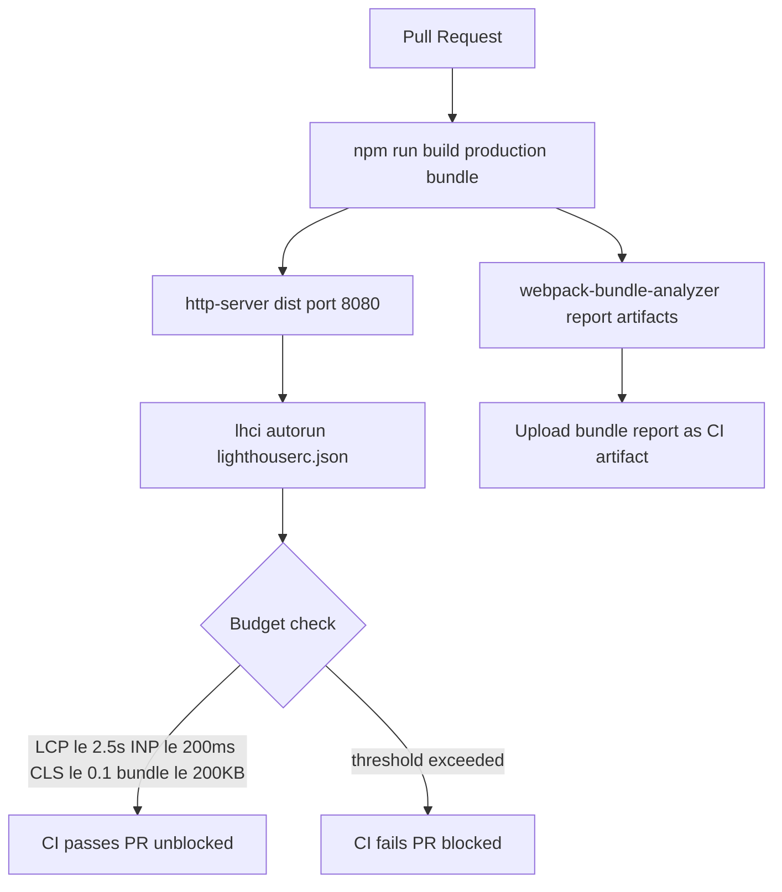

# Web Performance Budgets

Status: Draft | Last Reviewed: 2026-05-16 | Owner: @tech-lead-web
Catalog ID: FE-001 | Radii
Tier Applicability: T0, T1, T2

## Problem Statement

Vietnamese banking users on mid-range Android devices and variable 4G networks experience unacceptably slow page loads that erode trust and increase abandonment:

- LCP (Largest Contentful Paint) exceeding 4 s on the account overview page causes Google to flag the site as "Poor" and damages SEO and user trust for the digital banking channel.
- Each sprint adds 20–50 KB of JavaScript; without a CI-enforced budget, the main bundle reaches 1.5 MB uncompressed within 6 months, adding 3+ seconds of parse time on low-end devices.
- Unstyled flash during JWT validation or a delayed token-refresh spinner causes CLS > 0.25, disorienting users and failing WCAG 2.2 AA visual stability requirements.
- Without an automated Lighthouse CI gate, performance regressions are discovered in production after user complaints, not during code review.
- Analytics, chat widgets, and A/B testing SDKs loaded synchronously block the main thread, inflating INP (Interaction to Next Paint) beyond 500 ms for taps on the transfer button.

## Context

Performance budgets are enforced in CI as a blocking quality gate using Lighthouse CI (`lhci`). Every PR must pass the budget thresholds before merge. Metrics are collected against a representative page set (login, account overview, transfer initiation) using a simulated Moto G4 profile at 4G network speed — matching the Vietnamese median mobile device.

## Solution

Lighthouse CI runs `lhci autorun` in the CI pipeline against a local `http-server` serving the production build. A `lighthouserc.json` budget file defines per-metric thresholds. The `web-vitals` library reports real-user Core Web Vitals to the backend analytics API. Webpack Bundle Analyzer runs as a CI artifact to surface bundle size regressions.



## Implementation Guidelines

### 1. Lighthouse CI Configuration

```yaml
# lighthouserc.json
{
  "ci": {
    "collect": {
      "url": [
        "http://localhost:8080/login",
        "http://localhost:8080/accounts",
        "http://localhost:8080/transfer"
      ],
      "settings": {
        "preset": "desktop",
        "emulatedFormFactor": "mobile",
        "throttlingMethod": "simulate",
        "screenEmulation": {
          "mobile": true,
          "width": 412,
          "height": 823,
          "deviceScaleFactor": 1.75
        },
        "throttling": {
          "rttMs": 40,
          "throughputKbps": 10240,
          "cpuSlowdownMultiplier": 4
        }
      }
    },
    "assert": {
      "budgets": [
        {
          "path": "/*",
          "timings": [
            { "metric": "largest-contentful-paint", "budget": 2500 },
            { "metric": "interactive", "budget": 3000 },
            { "metric": "cumulative-layout-shift", "budget": 0 }
          ],
          "resourceSizes": [
            { "resourceType": "script", "budget": 200 },
            { "resourceType": "total", "budget": 500 }
          ]
        }
      ],
      "assertions": {
        "categories:performance": ["error", { "minScore": 0.8 }],
        "first-contentful-paint": ["error", { "maxNumericValue": 1800 }],
        "experimental-interaction-to-next-paint": ["warn", { "maxNumericValue": 200 }]
      }
    },
    "upload": {
      "target": "temporary-public-storage"
    }
  }
}
```

### 2. web-vitals Integration in React

```typescript
// src/reportWebVitals.ts
import { onCLS, onFID, onLCP, onINP, onTTFB, type Metric } from 'web-vitals';

const analyticsEndpoint = '/api/v1/analytics/vitals';

function sendToAnalytics(metric: Metric): void {
  const body: Record<string, unknown> = {
    name: metric.name,
    value: metric.value,
    delta: metric.delta,
    id: metric.id,
    navigationType: metric.navigationType,
    page: window.location.pathname,
    userAgent: navigator.userAgent.substring(0, 200),
  };

  if (navigator.sendBeacon) {
    navigator.sendBeacon(analyticsEndpoint, JSON.stringify(body));
  } else {
    fetch(analyticsEndpoint, {
      method: 'POST',
      body: JSON.stringify(body),
      keepalive: true,
      headers: { 'Content-Type': 'application/json' },
    }).catch(() => {
      // Analytics must not impact user experience
    });
  }
}

export function reportWebVitals(): void {
  onCLS(sendToAnalytics);
  onFID(sendToAnalytics);
  onLCP(sendToAnalytics);
  onINP(sendToAnalytics);
  onTTFB(sendToAnalytics);
}
```

```typescript
// src/main.tsx
import React from 'react';
import ReactDOM from 'react-dom/client';
import App from './App';
import { reportWebVitals } from './reportWebVitals';

ReactDOM.createRoot(document.getElementById('root')!).render(
  <React.StrictMode>
    <App />
  </React.StrictMode>
);

reportWebVitals();
```

### 3. Webpack Bundle Size Budget

```javascript
// webpack.config.js (production)
const { BundleAnalyzerPlugin } = require('webpack-bundle-analyzer');

module.exports = {
  mode: 'production',
  performance: {
    hints: 'error',
    maxEntrypointSize: 204800, // 200 KB
    maxAssetSize: 204800,
  },
  optimization: {
    splitChunks: {
      chunks: 'all',
      cacheGroups: {
        vendor: {
          test: /[\\/]node_modules[\\/]/,
          name: 'vendors',
          priority: 10,
        },
        react: {
          test: /[\\/]node_modules[\\/](react|react-dom)[\\/]/,
          name: 'react',
          priority: 20,
        },
      },
    },
  },
  plugins: [
    process.env.ANALYZE === 'true' &&
      new BundleAnalyzerPlugin({
        analyzerMode: 'static',
        reportFilename: '../artifacts/bundle.html',
        openAnalyzer: false,
      }),
  ].filter(Boolean),
};
```

### 4. CI Pipeline Step (GitHub Actions)

```yaml
# .github/workflows/ci.yml (performance gate step)
- name: Build production bundle
  run: npm run build

- name: Run performance budget gate
  run: |
    npx http-server dist -p 8080 &
    sleep 3
    npx lhci autorun --config=lighthouserc.json
  env:
    LHCI_GITHUB_APP_TOKEN: ${{ secrets.LHCI_GITHUB_APP_TOKEN }}

- name: Upload bundle analysis
  if: always()
  uses: actions/upload-artifact@v4
  with:
    name: bundle-analysis
    path: artifacts/bundle.html
```

## When to Use

- All T0/T1/T2 web banking pages where Core Web Vitals directly impact user retention and SBV e-banking accessibility requirements.
- CI pipelines for React/TypeScript banking SPAs where bundle growth must be detected before merge, not after deployment.
- Teams adopting progressive performance improvement programs — budgets establish the baseline and prevent regression.

## When Not to Use

- Internal admin tools with authenticated-only access where search engine performance and unauthenticated user experience are irrelevant.
- Pages where LCP is dominated by user-specific encrypted data loaded post-authentication — set budgets on the pre-auth skeleton, not the full page.
- Backend-for-Frontend rendering performance — use server-side APM (Micrometer/Grafana) rather than Lighthouse, which measures browser-side experience.

## Variants

| Variant | Use when | Trade-off |
|---------|----------|-----------|
| Lighthouse CI with hard budgets (this pattern) | CI integration required; regression blocking mandatory; new projects | Requires local HTTP server in CI; adds ~90s per run |
| WebPageTest with visual regression | Deep rendering analysis; video filmstrip comparison; advanced throttling profiles | Requires external WebPageTest instance; higher cost; slower |
| Playwright + Lighthouse integration | E2E tests and perf in one suite; auth-gated page measurement | More complex setup; combines test and perf concerns |

## NFR Acceptance Criteria

| Metric | Threshold | Measurement |
|--------|-----------|-------------|
| LCP (Largest Contentful Paint) | ≤ 2.5 s | Lighthouse CI on Moto G4 profile, 4G throttling |
| INP (Interaction to Next Paint) | ≤ 200 ms | web-vitals library real-user measurement; p75 ≤ 200 ms |
| CLS (Cumulative Layout Shift) | ≤ 0.1 | Lighthouse CI; assert score ≥ 0.9 on CLS category |
| Total JS bundle (initial load) | ≤ 200 KB gzipped | webpack --mode=production output; performance.maxEntrypointSize = 204800 |
| Lighthouse Performance score | ≥ 80 | lhci autorun; assert categories:performance ≥ 0.8 |

## Compliance Mapping

| Ring | Regulation | Provision | How this pattern satisfies |
|------|-----------|-----------|---------------------------|
| Ring 0 | W3C Web Performance Working Group | Core Web Vitals (LCP, INP, CLS) — user-centric page experience metrics | Lighthouse CI enforces LCP ≤ 2.5 s, INP ≤ 200 ms, CLS ≤ 0.1 thresholds matching W3C "Good" band; CI gate prevents regressions before production deployment. |
| Ring 1 | WCAG 2.2 AA | §1.4.12 Text Spacing — no loss of content or functionality; §2.5.8 Target Size | CLS ≤ 0.1 prevents layout instability that causes interactive targets to shift; ensures text and buttons remain accessible during page load. |
| Ring 2 | SBV Circular 09/2020 | §III.2 — internet banking systems must provide reliable, accessible service to all customer tiers ⚠️ (working summary — pending Legal review) | Performance budgets ensure the banking portal is accessible on low-end 4G devices representative of the Vietnamese consumer base; Legal review required to confirm SBV §III.2 interpretation of "reliable service" includes performance thresholds. |

## Cost / FinOps

- Lighthouse CI runs on existing CI infrastructure (GitHub Actions); no additional cost beyond ~90 s per PR run at standard compute rates.
- `http-server` (npm package) serves the build locally in CI; no cloud hosting cost for performance testing.
- `web-vitals` library: 1.6 KB gzipped — negligible bundle impact for the measurement capability it provides.
- Analytics ingestion: ~200 bytes per page load event; at 100,000 daily active users × 5 pages = 100 MB/day. Ingest to existing observability pipeline at marginal cost.
- Cost of NOT having budgets: one undetected performance regression in a release can cost 4–8 engineer-hours to diagnose in production.

## Threat Model

- **Measurement gaming (Tampering)**: A developer modifies `lighthouserc.json` to relax thresholds locally, allowing a slow page to pass CI. Mitigation: `lighthouserc.json` is committed to the repository and protected by branch protection rules; changes require PR review and EA Board approval for threshold relaxation.
- **Analytics data exfiltration (Information Disclosure)**: The `web-vitals` beacon includes `window.location.pathname`, which could expose internal routing patterns or PII in URL parameters. Mitigation: strip query parameters and hash from `pathname` before sending; reject paths matching PII patterns (`/accounts/[0-9]+`) in the analytics API ingestion layer.

## Runbook Stub

**Alert: `lhci_budget_violation`** (CI pipeline)
- p50 baseline: LCP ~1.8 s | p99 SLO: LCP ≤ 2.5 s
- Remediation: (1) Check CI artifact `bundle.html` — identify the largest new chunk. (2) If a new dependency was added, evaluate lazy-loading via `React.lazy()` + `Suspense`. (3) If images are LCP element, convert to WebP with `<picture>` fallback and `loading="lazy"` for below-fold images. (4) If CLS is the violating metric, audit font loading (`font-display: swap`) and skeleton screens during data fetch.

**Alert: `web_vitals_lcp_p75 > 3s`** (production monitoring)
- Remediation: (1) Check Grafana `web-vitals` dashboard for geographic distribution — high LCP in specific region suggests CDN miss. (2) Verify CDN cache headers (`Cache-Control: public, max-age=31536000, immutable` for hashed assets). (3) Check for recently deployed feature causing render-blocking.

## Test Strategy Stub

- **Unit**: `reportWebVitals` test — mock `web-vitals` onLCP; assert `sendBeacon` called with correct JSON body including `name`, `value`, `page`. Assert PII strip: call with pathname `/accounts/12345678`; assert beacon payload contains redacted path.
- **Integration**: Playwright + Lighthouse — launch production build; navigate to `/login`; run Lighthouse audit; assert `lhr.categories.performance.score >= 0.8`.
- **Integration**: Bundle size regression — `npm run build`; read `dist/assets/*.js` with `fs.statSync`; assert sum of gzipped sizes ≤ 204,800 bytes.
- **Visual Regression**: Playwright screenshot of account overview before and after each deployment; assert pixel diff < 0.5% (prevents invisible CLS regressions).

## Related Patterns

- [FE-002 Web Resilience / Offline-First](web-resilience-offline-first.md) — service worker caching strategy impacts LCP for repeat visits
- [FE-005 Web Error Boundary](web-error-boundary.md) — error boundaries must not introduce CLS during fallback render

## References

- [Google Web Vitals — Core Web Vitals documentation](https://web.dev/vitals/)
- [Lighthouse CI GitHub Action](https://github.com/GoogleChrome/lighthouse-ci)
- [web-vitals library (npm)](https://github.com/GoogleChrome/web-vitals)
- [webpack performance hints documentation](https://webpack.js.org/configuration/performance/)
- [W3C Web Performance Working Group](https://www.w3.org/webperf/)
- Catalog reference: `governance/standards/enterprise-architecture-catalog.md`
