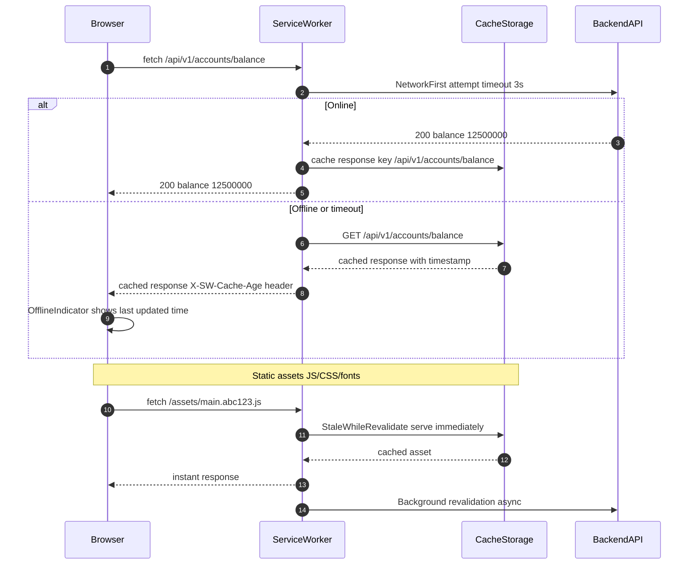

# Web Resilience / Offline-First

Status: Draft | Last Reviewed: 2026-05-16 | Owner: @tech-lead-web
Catalog ID: FE-002 | Radii
Tier Applicability: T1, T2

## Problem Statement

Banking customers in Vietnam experience frequent network interruptions that strand them in the middle of critical flows:

- When a customer's 4G connection drops mid-session, the React SPA renders a blank page or an unhandled network error — providing no guidance and causing session abandonment.
- Static assets (JavaScript bundles, CSS, fonts) are re-downloaded on every visit when no caching strategy is in place, wasting mobile data and slowing repeat load times for frequent users.
- A customer filling a beneficiary transfer form loses all input when the browser reloads after a network timeout, requiring them to re-enter account numbers and amounts.
- A mobile browser backgrounded for 30 minutes shows a cached balance that may be hours old with no visual indication, eroding trust when the balance displayed differs from the ATM receipt.
- The application does not distinguish between "offline" and "API error" states, presenting confusing generic error messages instead of "You are offline — your last known balance was ₫ 12,500,000 as of 10:32 AM."

## Context

Service workers are registered on app startup and intercept all HTTP requests. Workbox (Google) provides the caching strategy primitives. Critical banking API calls (account balance, transaction history) use `NetworkFirst` — serving from network with a 3-second timeout fallback to cache. Static assets use `StaleWhileRevalidate` with a 30-day cache. Offline form submissions are queued in IndexedDB and replayed when the connection is restored.

## Solution

A Workbox-powered service worker intercepts all fetch requests. Static assets (JS, CSS, fonts, images) are cached using `StaleWhileRevalidate` — serving the cached copy instantly while updating in the background. API calls use `NetworkFirst` with a 3-second timeout — attempting the network first, then falling back to the last cached API response with a visual staleness indicator. Form submissions that fail due to network errors are queued in an IndexedDB `outbox` and replayed on reconnect.



## Implementation Guidelines

### 1. Workbox Service Worker

```typescript
// src/sw.ts (registered via vite-plugin-pwa or custom registration)
import { clientsClaim } from 'workbox-core';
import { precacheAndRoute, cleanupOutdatedCaches } from 'workbox-precaching';
import { registerRoute } from 'workbox-routing';
import { StaleWhileRevalidate, NetworkFirst } from 'workbox-strategies';
import { ExpirationPlugin } from 'workbox-expiration';
import { BackgroundSyncPlugin } from 'workbox-background-sync';

declare let self: ServiceWorkerGlobalScope;
clientsClaim();

// Precache all Vite-built assets (injected at build time)
precacheAndRoute(self.__WB_MANIFEST);
cleanupOutdatedCaches();

// Static assets — StaleWhileRevalidate
registerRoute(
  ({ request }) =>
    request.destination === 'script' ||
    request.destination === 'style' ||
    request.destination === 'font',
  new StaleWhileRevalidate({
    cacheName: 'static-assets',
    plugins: [
      new ExpirationPlugin({ maxAgeSeconds: 30 * 24 * 60 * 60 }), // 30 days
    ],
  })
);

// API calls — NetworkFirst with 3s timeout
registerRoute(
  ({ url }) => url.pathname.startsWith('/api/v1/'),
  new NetworkFirst({
    networkTimeoutSeconds: 3,
    cacheName: 'api-responses',
    plugins: [
      new ExpirationPlugin({
        maxEntries: 50,
        maxAgeSeconds: 60 * 60, // 1 hour max staleness
      }),
    ],
  })
);

// Background sync for queued form submissions
const bgSyncPlugin = new BackgroundSyncPlugin('transfer-outbox', {
  maxRetentionTime: 24 * 60, // 24 hours
});

registerRoute(
  ({ url }) => url.pathname === '/api/v1/transfers',
  new NetworkFirst({
    plugins: [bgSyncPlugin],
  }),
  'POST'
);
```

### 2. React Offline Indicator Component

```typescript
// src/components/OfflineIndicator.tsx
import { useState, useEffect } from 'react';

export function OfflineIndicator() {
  const [isOnline, setIsOnline] = useState(navigator.onLine);

  useEffect(() => {
    const handleOnline = () => setIsOnline(true);
    const handleOffline = () => setIsOnline(false);
    window.addEventListener('online', handleOnline);
    window.addEventListener('offline', handleOffline);
    return () => {
      window.removeEventListener('online', handleOnline);
      window.removeEventListener('offline', handleOffline);
    };
  }, []);

  if (isOnline) return null;

  return (
    <div role="alert" aria-live="polite" className="offline-banner">
      Bạn đang offline — dữ liệu hiển thị có thể chưa được cập nhật
    </div>
  );
}
```

### 3. IndexedDB Outbox for Offline Form Submissions

```typescript
// src/lib/offlineQueue.ts
import { openDB, DBSchema } from 'idb';

interface OutboxSchema extends DBSchema {
  transfers: {
    key: string;
    value: {
      id: string;
      payload: Record<string, unknown>;
      enqueuedAt: number;
    };
  };
}

const db = openDB<OutboxSchema>('tcb-offline-outbox', 1, {
  upgrade(database) {
    database.createObjectStore('transfers', { keyPath: 'id' });
  },
});

export async function enqueueTransfer(payload: Record<string, unknown>): Promise<string> {
  const id = crypto.randomUUID();
  const store = await db;
  await store.put('transfers', { id, payload, enqueuedAt: Date.now() });
  return id;
}

export async function flushOutbox(): Promise<void> {
  const store = await db;
  const pending = await store.getAll('transfers');
  for (const item of pending) {
    try {
      await fetch('/api/v1/transfers', {
        method: 'POST',
        headers: { 'Content-Type': 'application/json' },
        body: JSON.stringify(item.payload),
      });
      await store.delete('transfers', item.id);
    } catch {
      break; // stop on first failure; retry on next online event
    }
  }
}

window.addEventListener('online', flushOutbox);
```

## When to Use

- T1/T2 customer-facing banking pages (account overview, transfer history, beneficiary management) where occasional offline access and graceful degradation improve retention.
- Applications where static assets are versioned with content hashes — service worker precaching eliminates re-download on revisit, reducing 4G data costs for Vietnamese users.
- Multi-step forms (beneficiary addition, standing order setup) where losing form state on network interruption is a critical UX failure.

## When Not to Use

- T0 real-time transaction pages (live payment authorisation, OTP confirmation) — do NOT serve stale cached responses for payment-critical flows; show an explicit "connection required" error instead.
- Pages serving personalised content that changes more frequently than the cache TTL — serving stale account balances without a clear staleness indicator misleads customers.
- Environments without HTTPS — service workers are restricted to secure contexts; HTTP-served pages cannot use service workers.

## Variants

| Variant | Use when | Trade-off |
|---------|----------|-----------|
| Workbox precache + NetworkFirst API (this pattern) | Full offline capability; background sync; established banking SPA | Requires service worker build tooling; complexity of cache invalidation |
| Cache-only for static + no API caching | Minimal offline support; only offline shell; API calls always fail offline | Simpler; no stale data risk; poor offline experience |
| React Query staleTime + optimistic UI | Primarily online; tolerate brief disconnects; no service worker | No true offline; loses state on hard refresh; simpler implementation |

## NFR Acceptance Criteria

| Metric | Threshold | Measurement |
|--------|-----------|-------------|
| Repeat visit LCP (cached assets) | ≤ 1.0 s | Lighthouse CI second-run; assert LCP ≤ 1000 ms |
| Offline fallback render time | ≤ 500 ms from network loss detection | Playwright: intercept all requests; assert OfflineIndicator visible within 500 ms |
| Background sync replay on reconnect | ≤ 10 s after online event | Integration test: enqueue transfer; simulate reconnect; assert API called within 10 s |
| Service worker registration | ≤ 2 s after first paint | navigator.serviceWorker.ready promise; assert resolves within 2 s |
| Stale cache max age (API) | 1 hour | ExpirationPlugin config; assert cached entry not served after 60 min |

## Compliance Mapping

| Ring | Regulation | Provision | How this pattern satisfies |
|------|-----------|-----------|---------------------------|
| Ring 0 | OWASP ASVS V9 | V9.2 — validate server communications; ensure cached content integrity | Workbox uses cache-busted asset URLs (content hash in filename); service worker validates response status before caching; stale API responses served with X-SW-Cache-Age header so application can warn users. |
| Ring 1 | PCI-DSS v4.0 | §3.4 — protect stored cardholder data | Cardholder data (PAN, CVV) is never cached by the service worker; NetworkFirst routes for payment APIs are explicitly excluded from the cache expiration plugin; offline queue only stores non-PCI transfer metadata. |
| Ring 2 | Decree 13/2023 | §9 — personal data stored offline must have defined retention and deletion controls ⚠️ (working summary — pending Legal review) | IndexedDB outbox entries are limited to 24-hour retention (BackgroundSyncPlugin maxRetentionTime: 1440); successfully synced entries deleted immediately; cache storage cleared on logout via caches.delete(); Legal review required to confirm offline retention period satisfies Decree 13/2023 proportionality requirements. |

## Cost / FinOps

- `vite-plugin-pwa` or `workbox-webpack-plugin`: build-time only, no runtime cost.
- Service worker background sync: minimal compute — one fetch retry per queued item on reconnect; negligible at banking transaction volumes.
- CDN cache-hit improvement: static assets cached in the service worker reduce CDN origin requests by ~40% for repeat visits; estimated CDN cost reduction of 15–25% for active users.
- IndexedDB storage: each queued transfer entry is ~500 bytes; with a 24-hour queue and low transfer volume, storage impact is negligible.

## Threat Model

- **Stale balance misleading user (Information Disclosure)**: Service worker serves a cached balance that is hours old, leading the customer to initiate a transfer believing they have sufficient funds. Mitigation: if cache age > 15 minutes, the balance component shows a "cached" badge with the last-updated timestamp; transfer form checks live balance before submission.
- **Service worker compromise via XSS (Elevation of Privilege)**: An XSS vulnerability allows an attacker to register a malicious service worker that intercepts all API calls, exfiltrating credentials. Mitigation: CSP `worker-src 'self'` restricts service worker registration to same-origin scripts only; see FE-003 Web CSP Hardening for XSS prevention controls that are a prerequisite for safe service worker deployment.

## Runbook Stub

**Alert: `sw_registration_failure_rate > 1%`** (real-user monitoring)
- p50 baseline: 0 failures/day | p99 SLO: < 0.1% of sessions
- Remediation: (1) Check browser console for `ServiceWorker registration failed` — most common cause is HTTPS not enforced. (2) Verify `Content-Security-Policy` header includes `worker-src 'self'`. (3) Check service worker update loop — if a new deployment has a broken `sw.ts`, old sessions may be stuck; hard reload resolves.

**Alert: `offline_queue_entries > 100`** (application metric)
- Remediation: (1) Check if `online` event listener is firing. (2) If API is returning 5xx during flush, the outbox will retry indefinitely — check backend health. (3) If entries are > 24 hours old, they will be dropped by BackgroundSyncPlugin expiration — notify user.

## Test Strategy Stub

- **Unit**: `enqueueTransfer` — call once; assert IndexedDB `transfers` store has one entry with correct payload and `enqueuedAt` timestamp.
- **Unit**: `flushOutbox` — mock `fetch` returning 200; assert IndexedDB entry deleted after flush. Mock `fetch` returning 503; assert entry retained after flush.
- **Integration (Playwright)**: Navigate to `/accounts`; assert `navigator.serviceWorker.controller` is not null. Open DevTools offline mode; reload; assert account overview renders with offline indicator.
- **Integration**: Background sync — enqueue a transfer while offline; restore network; assert `POST /api/v1/transfers` called within 10 seconds.
- **Visual Regression**: Screenshot of `OfflineIndicator` in both Vietnamese and English locales — assert correct text and styling.

## Related Patterns

- [FE-001 Web Performance Budgets](web-performance-budgets.md) — service worker caching reduces repeat-visit LCP
- [MOB-001 Mobile Offline Queue](../mobile/mobile-offline-queue.md) — native mobile equivalent of this web offline queue pattern

## References

- [Workbox documentation — strategies](https://developer.chrome.com/docs/workbox/modules/workbox-strategies/)
- [Workbox Background Sync](https://developer.chrome.com/docs/workbox/modules/workbox-background-sync/)
- [idb — IndexedDB with async/await](https://github.com/jakearchibald/idb)
- [vite-plugin-pwa](https://vite-pwa-org.netlify.app/)
- [MDN Service Worker API](https://developer.mozilla.org/en-US/docs/Web/API/Service_Worker_API)
- Catalog reference: `governance/standards/enterprise-architecture-catalog.md`
