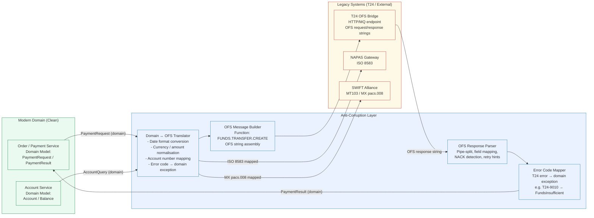

# Anti-Corruption Layer

Status: Draft | Last Reviewed: 2026-05-09 | Owner: @tech-lead-backend
Catalog ID: INT-005 | Radii
Tier Applicability: T0, T1, T2

## Problem Statement

- T24 Temenos core banking exposes OFS (Open Financial Services) messages with a legacy data model: pipe-delimited strings, numeric error codes, and function names like `FUNDS.TRANSFER.CREATE` that carry no semantic meaning to a modern bounded context. Adopting this model inside greenfield services couples their domain model permanently to a system that Techcombank plans to replace.
- Data type mismatches between T24 and modern services are a constant source of production bugs: T24 dates are in `DD MMM YYYY` format (e.g., `09 MAY 2026`), currencies are 3-char ISO codes but amounts lack decimal separators, and account numbers use a proprietary internal format that differs from the IBAN-like format exposed to customers.
- External systems (NAPAS, SWIFT) carry equally foreign models: NAPAS uses ISO 8583 message types; SWIFT uses MT/MX message formats. Without an explicit translation boundary, these formats leak into domain entities and every consumer of those entities must understand the foreign model.
- When T24 is eventually replaced (via Strangler Fig — INT-006), a codebase without an ACL requires touching every service that ever parsed a T24 OFS response. With an ACL, only the ACL changes.

## Solution

Place an explicit Anti-Corruption Layer (ACL) — an `@Service` class owning all translation — between the modern domain services and the T24 OFS bridge. The ACL exposes a clean domain API inward and speaks OFS outward. No caller ever sees an OFS string.



## Implementation Guidelines

### 1. Domain Model — Clean Types (No T24 Leakage)

```java
// Domain model — no T24 concepts, no OFS strings
public record PaymentRequest(
    String          paymentRef,       // UUID — generated by domain, not T24
    String          tenantId,
    BigDecimal      amountVnd,        // typed amount — no string parsing in domain
    String          debitAccountId,   // domain account ID (maps to T24 internally)
    String          creditAccountId,
    String          narrative,
    PaymentChannel  channel,          // NAPAS, SWIFT, INTERNAL
    Instant         requestedAt
) {}

public record PaymentResult(
    String          paymentRef,
    PaymentStatus   status,           // SUCCESS, PENDING, FAILED — no T24 codes
    String          t24TransactionId, // opaque reference — callers must not parse this
    Instant         processedAt,
    String          failureReason     // human-readable — translated from T24 error code
) {}

public enum PaymentStatus { SUCCESS, PENDING, FAILED, NACK_RETRY }
```

### 2. ACL Translator Service

```java
@Service
@Slf4j
public class T24PaymentAcl {

    private final T24OfsClient ofsClient;
    private final T24DateConverter dateConverter;
    private final T24AccountMapper accountMapper;
    private final T24ErrorCodeMapper errorMapper;

    // Public API — domain types in, domain types out. No OFS leaks.
    public PaymentResult initiatePayment(PaymentRequest request) {
        log.info("ACL initiating payment payment_ref={} channel={}",
                 request.paymentRef(), request.channel());

        String ofsMessage = buildOfsMessage(request);
        T24OfsResponse rawResponse = ofsClient.submit(ofsMessage,
            Duration.ofSeconds(5));

        return translateResponse(rawResponse, request.paymentRef());
    }

    public Account getAccount(String domainAccountId) {
        String t24AccountId = accountMapper.toT24AccountId(domainAccountId);
        String ofsEnquiry   = "ACCOUNT.ENQUIRY,," + t24AccountId + "/";
        T24OfsResponse raw  = ofsClient.submit(ofsEnquiry, Duration.ofSeconds(3));
        return parseAccountResponse(raw, domainAccountId);
    }

    // --- Internal: OFS message construction ---

    private String buildOfsMessage(PaymentRequest request) {
        // OFS format: FUNCTION,AUTH-ID,/FIELD1=VALUE1/FIELD2=VALUE2/
        String debitT24  = accountMapper.toT24AccountId(request.debitAccountId());
        String creditT24 = accountMapper.toT24AccountId(request.creditAccountId());
        // T24 amount: no decimal point for VND (zero-decimal currency)
        String t24Amount = request.amountVnd().toBigInteger().toString();
        // T24 date: DD MMM YYYY
        String t24Date   = dateConverter.toT24Date(LocalDate.now(ZoneId.of("Asia/Ho_Chi_Minh")));

        return String.format(
            "FUNDS.TRANSFER.CREATE,TCB.SVC/%s,," +
            "/DEBIT.ACCT.NO=%s/CREDIT.ACCT.NO=%s" +
            "/CURRENCY=VND/AMOUNT=%s" +
            "/VALUE.DATE=%s/NARRATIVE=%s" +
            "/REFERENCE=%s/",
            System.getenv("T24_OFS_AUTH_ID"),
            debitT24, creditT24,
            t24Amount,
            t24Date,
            sanitiseNarrative(request.narrative()),
            request.paymentRef()
        );
    }

    private PaymentResult translateResponse(T24OfsResponse raw, String paymentRef) {
        if (raw.isNack()) {
            // NACK: T24 rejected the OFS message (not a network error)
            String domainReason = errorMapper.toDomainMessage(raw.getErrorCode());
            log.warn("T24 NACK payment_ref={} t24_error={} domain_reason={}",
                     paymentRef, raw.getErrorCode(), domainReason);

            PaymentStatus status = errorMapper.isRetryable(raw.getErrorCode())
                ? PaymentStatus.NACK_RETRY
                : PaymentStatus.FAILED;

            return new PaymentResult(paymentRef, status, null,
                Instant.now(), domainReason);
        }

        // ACK: parse the transaction ID from the OFS response fields
        String t24TxnId = raw.getField("TRANSACTION.ID")
            .orElseThrow(() -> new AclTranslationException(
                "T24 ACK missing TRANSACTION.ID for ref " + paymentRef));

        return new PaymentResult(paymentRef, PaymentStatus.SUCCESS,
            t24TxnId, Instant.now(), null);
    }

    private String sanitiseNarrative(String narrative) {
        // OFS field separator is '/' — must escape in narrative
        return narrative != null
            ? narrative.replaceAll("[/\\\\]", " ").substring(0,
                Math.min(narrative.length(), 35))   // T24 narrative max 35 chars
            : "TCB PAYMENT";
    }
}
```

### 3. OFS Client — Network Layer

```java
@Component
@Slf4j
public class T24OfsClient {

    private final RestClient restClient;
    private final CircuitBreaker circuitBreaker;   // RES-002
    private final MeterRegistry meterRegistry;

    public T24OfsResponse submit(String ofsMessage, Duration timeout) {
        Timer.Sample sample = Timer.start(meterRegistry);
        try {
            String rawResponse = circuitBreaker.executeSupplier(() ->
                restClient.post()
                    .uri("/ofs")
                    .contentType(MediaType.TEXT_PLAIN)
                    .body(ofsMessage)
                    .retrieve()
                    .onStatus(status -> !status.is2xxSuccessful(), (req, res) -> {
                        throw new T24OfsNetworkException(
                            "T24 HTTP error: " + res.getStatusCode());
                    })
                    .body(String.class)
            );

            return T24OfsResponse.parse(rawResponse);
        } finally {
            sample.stop(Timer.builder("tcb.t24.ofs.duration")
                .tag("function", extractFunction(ofsMessage))
                .register(meterRegistry));
        }
    }

    private String extractFunction(String ofsMessage) {
        // First token before comma is the OFS function name
        int comma = ofsMessage.indexOf(',');
        return comma > 0 ? ofsMessage.substring(0, comma) : "UNKNOWN";
    }
}
```

### 4. OFS Response Parser

```java
@Value   // Lombok immutable
public class T24OfsResponse {

    boolean ack;
    String  errorCode;    // populated on NACK
    String  errorText;
    Map<String, String> fields;   // parsed OFS response fields

    public static T24OfsResponse parse(String raw) {
        // OFS response format:
        //   ACK:  "//ID=12345/TRANSACTION.ID=TXN-001/..."
        //   NACK: "//ERROR.CODE=T24-9010/ERROR.TEXT=Insufficient funds/..."
        if (raw == null || raw.isBlank()) {
            throw new AclTranslationException("Empty OFS response from T24");
        }

        Map<String, String> fields = Arrays.stream(raw.split("/"))
            .filter(s -> s.contains("="))
            .map(s -> s.split("=", 2))
            .collect(Collectors.toMap(
                parts -> parts[0].trim(),
                parts -> parts[1].trim(),
                (a, b) -> b   // last value wins on duplicate keys
            ));

        boolean isNack = fields.containsKey("ERROR.CODE");
        return new T24OfsResponse(
            !isNack,
            fields.get("ERROR.CODE"),
            fields.get("ERROR.TEXT"),
            Collections.unmodifiableMap(fields)
        );
    }

    public boolean isNack() { return !ack; }

    public Optional<String> getField(String fieldName) {
        return Optional.ofNullable(fields.get(fieldName));
    }
}
```

### 5. Error Code Mapper

```java
@Component
public class T24ErrorCodeMapper {

    // T24 numeric error codes → domain exception types + messages
    private static final Map<String, ErrorMapping> CODE_MAP = Map.ofEntries(
        Map.entry("T24-9010", new ErrorMapping(FundsInsufficientException.class,
            "Insufficient funds in debit account", false)),
        Map.entry("T24-9020", new ErrorMapping(AccountFrozenException.class,
            "Debit account is frozen or blocked", false)),
        Map.entry("T24-9030", new ErrorMapping(DailyLimitExceededException.class,
            "Daily transaction limit exceeded", false)),
        Map.entry("T24-9050", new ErrorMapping(T24TemporaryException.class,
            "T24 temporary processing error — retry safe", true)),
        Map.entry("T24-9090", new ErrorMapping(T24TemporaryException.class,
            "T24 end-of-day processing — retry after EOD", true))
    );

    public String toDomainMessage(String t24ErrorCode) {
        return Optional.ofNullable(CODE_MAP.get(t24ErrorCode))
            .map(ErrorMapping::message)
            .orElse("Payment processing error (ref: " + t24ErrorCode + ")");
    }

    public boolean isRetryable(String t24ErrorCode) {
        return Optional.ofNullable(CODE_MAP.get(t24ErrorCode))
            .map(ErrorMapping::retryable)
            .orElse(false);
    }

    public record ErrorMapping(
        Class<? extends RuntimeException> exceptionType,
        String message,
        boolean retryable
    ) {}
}
```

### 6. NAPAS ISO 8583 ACL (sketch)

```java
@Service
public class NapasAcl {

    private final NapasIso8583Client napasClient;

    public PaymentResult initiateNapasTransfer(PaymentRequest request) {
        // Translate domain model → ISO 8583 fields
        Iso8583Message msg = Iso8583Message.builder()
            .mti("0200")                                    // Financial transaction request
            .field(2,  maskPan(request.debitAccountId()))   // PAN (masked)
            .field(4,  formatAmount(request.amountVnd()))   // Transaction amount
            .field(11, generateStan())                       // System trace audit number
            .field(37, request.paymentRef().substring(0,12))// Retrieval reference number
            .field(41, "TCB" + System.getenv("TERMINAL_ID"))// Terminal ID
            .field(48, buildVietQrData(request))             // VietQR private data
            .build();

        Iso8583Message response = napasClient.send(msg, Duration.ofSeconds(2));

        // Translate ISO 8583 response code → domain result
        String responseCode = response.getField(39);
        if ("00".equals(responseCode)) {
            return new PaymentResult(request.paymentRef(), PaymentStatus.SUCCESS,
                response.getField(37), Instant.now(), null);
        }
        return new PaymentResult(request.paymentRef(), PaymentStatus.FAILED,
            null, Instant.now(), NapasResponseCodes.toMessage(responseCode));
    }
}
```

## Compliance Mapping

| Ring | Regulation | Provision | How this pattern satisfies |
|------|-----------|-----------|---------------------------|
| Ring 0 | NIST CSF | DE.CM-7 — Monitoring for Unauthorised Activity | ACL is the single ingress/egress point for T24; all OFS calls are logged with domain context, enabling detection of anomalous integration activity |
| Ring 0 | OWASP ASVS | V5 Validation, Sanitisation, Encoding | OFS message builder sanitises all inputs (narrative escaping, field length limits) before sending to T24 |
| Ring 0 | ISO 27001 | A.14.2 Security in Development | ACL pattern enforces separation between legacy and modern system boundaries — a secure development practice for integration |
| Ring 1 | BCBS 239 | Principle 3 — Data Architecture and IT Infrastructure | ACL ensures data accuracy at the system boundary: type-safe domain models prevent format mismatches that corrupt reports |
| Ring 1 | BCBS 239 | Principle 6 — Adaptability | ACL isolates T24 from modern services, making the platform adaptable to T24 replacement without impacting domain services |
| Ring 1 | ISO 20022 | General principles for financial messaging | ACL translates to/from ISO 20022 MX format for SWIFT integration, ensuring standard-compliant message construction |
| Ring 2 | SBV Circular 09/2020 §IV | Data integrity in inter-system transfers | ACL provides a verified translation boundary — OFS parsing errors throw `AclTranslationException` and are never silently swallowed, ensuring data integrity at the T24 boundary ⚠️ (working summary — pending Legal review) |
| Ring 2 | Decree 53/2022 | Data localisation requirements | ACL enforces that T24 integration calls remain within Vietnam datacenter boundaries; no T24 OFS messages are routed to offshore processing ⚠️ (working summary — pending Legal review) |

## NFR Acceptance Criteria

```yaml
service_name: anti-corruption-layer
tier: T0
rto_minutes: 5          # ACL is in the critical payment path
rpo_seconds: 0          # translation is stateless; no state to recover
latency:
  p95_ms: 25            # ACL translation overhead (excluding T24 network time)
  p99_ms: 50
  t24_ofs_network_p95_ms: 300   # T24 OFS round-trip budget (T24 is the bottleneck)
  t24_total_p95_ms: 325         # ACL + T24 combined
failure_modes:
  - mode: T24 returns NACK for retryable error (T24-9050)
    impact: Single payment delayed; caller receives NACK_RETRY status
    mitigation: Caller service uses RES-003 Retry with backoff; NACK_RETRY triggers retry; max 3 attempts before FAILED
  - mode: T24 OFS bridge network timeout
    impact: ACL throws T24OfsNetworkException; payment status unknown
    mitigation: RES-002 Circuit Breaker on OfsClient; idempotency key (PRIN-006) allows safe retry after T24 confirms or denies
  - mode: OFS response parsing fails (unexpected format after T24 upgrade)
    impact: AclTranslationException — payment blocked until ACL is updated
    mitigation: Golden-master regression tests run on every T24 upgrade; ACL version-aware response handling for transition periods
  - mode: Account number mapping table stale
    impact: Wrong T24 account ID used in OFS message — T24 rejects with T24-9040
    mitigation: Account map cached with 5-minute TTL; T24 rejection triggers cache invalidation and re-fetch
blast_radius:
  scope: All payment flows that touch T24 — approximately 70% of T0 transaction volume
  isolation: NAPAS and SWIFT ACL paths are independent; a T24 outage degrades T24-routed payments only
catalog_references:
  - PRIN-006    # Idempotency-by-default (safe retry through ACL)
  - INT-006     # Strangler Fig (ACL enables incremental T24 replacement)
  - INT-002     # Outbox + CDC (ACL publishes domain events post-translation)
  - RES-002     # Circuit Breaker (on T24 OFS client)
  - RES-003     # Retry with Backoff (on retryable NACKs)
  - RES-006     # Timeout Budget (T24 OFS timeout is 5s max)
  - NFR-002     # Latency Budget Model (ACL overhead composited with T24 budget)
```

## Cost/FinOps

- The ACL is a thin `@Service` with no additional infrastructure — it runs inside the existing payment service pod. There is no separate deployment cost; the translation overhead is CPU-only (JSON parsing, string manipulation) at approximately 2–5ms per call.
- Caching T24 account-number lookups (5-minute TTL, Caffeine in-process cache) reduces repetitive T24 enquiry calls. At 500 RPS with 80% cache hit rate, this saves approximately 400 T24 OFS enquiry calls/second, materially reducing T24 load during peak hours and deferring T24 hardware scaling.
- During the Strangler Fig migration (INT-006), the ACL absorbs all route-switching logic. The investment in a clean ACL now avoids an estimated 400–800 person-hours of cross-service refactoring when T24 is replaced, which is the primary long-term cost justification for this pattern.
- Golden-master regression test infrastructure (Testcontainers + recorded T24 responses) requires approximately 2 GB of test fixture storage and runs in 3–5 minutes per CI pipeline — negligible cost relative to the risk of undetected OFS format drift after a T24 upgrade.
- NAPAS ISO 8583 processing carries per-transaction fees from NAPAS; these are pass-through costs not affected by the ACL pattern. The ACL does not add per-transaction overhead beyond the fixed translation compute cost.

## Threat Model

- **Tampering — OFS injection via unsanitised narrative field**: An attacker crafts a payment narrative containing the OFS field separator `/` to inject spurious OFS fields (e.g., `/DEBIT.ACCT.NO=ATTACKER-ACCOUNT/`). Mitigation: the `sanitiseNarrative` method strips `/` and `\` characters and enforces a 35-character maximum; OFS message construction uses string templates with explicit field boundaries, not free-form concatenation.
- **Information Disclosure — T24 error messages expose account internals**: T24 NACK error text may include internal T24 account numbers or system identifiers that should not reach the client. Mitigation: the error code mapper translates T24 error text to domain messages; raw T24 error text is logged at WARN level (internal visibility only) and never returned to the API caller.
- **Repudiation — payment denial despite T24 ACK**: A service claims a payment was never submitted even though T24 processed it. Mitigation: every OFS message includes the domain `paymentRef` UUID in the `REFERENCE` field; T24's transaction record carries this reference; the ACL logs both the outbound OFS message and the inbound response with the same `paymentRef`.
- **Denial of Service — T24 OFS bridge overwhelmed by retry storms**: Retryable NACKs (T24-9050) trigger infinite retries, flooding T24. Mitigation: Resilience4j Retry with exponential backoff (max 3 attempts, max delay 30s); Circuit Breaker on the OFS client opens if error rate exceeds 50%, stopping the retry storm.
- **Elevation of Privilege — ACL bypassed by direct OFS client call**: A developer adds a direct `T24OfsClient` call in a domain service, bypassing translation. Mitigation: `T24OfsClient` is package-private to the ACL module; domain services can only import `T24PaymentAcl` (public interface). Enforced via ArchUnit architecture test.
- **Tampering — account number mapping corruption**: If the T24 account mapping table is corrupted, payments are routed to wrong accounts. Mitigation: account mappings are read-only, loaded from a configuration store with a checksum; any mapping update requires a change record and restarts the cache.

## Operational Runbook

1. **T24 OFS format change after T24 upgrade**: After a T24 system upgrade, run the golden-master test suite (`mvn test -Pintegration -DT24_GOLDEN_MASTER=true`) against the new T24 response fixtures. Any parsing failure in `T24OfsResponse.parse()` indicates a format change. Update the parser and re-run. Deploy the updated ACL before routing production traffic to the upgraded T24.

2. **Investigate payment stuck in PENDING status**: Query the payment record by `paymentRef`. If `t24TransactionId` is null, the payment was NACKed or timed out before a T24 ACK was received. Check the ACL logs for `payment_ref=<ref>` to find the OFS error code. Determine whether T24 actually processed the transaction by querying T24 directly using the `paymentRef` as the OFS `REFERENCE` field value.

3. **ACL circuit breaker OPEN on T24 OFS bridge**: Alert: `t24_ofs_circuit_breaker_state == OPEN`. Check T24 OFS bridge health dashboard. If T24 is degraded, payments are blocked — activate the T24 degraded-mode runbook. If T24 is healthy, check the ACL error logs for parsing exceptions (indicate format drift). Do not manually force-close the circuit breaker.

4. **T24 account mapping miss (T24-9040 NACK)**: Check `tcb.t24.account_mapping.miss_total` metric. A spike indicates the account mapping cache is stale or an account has been restructured in T24. Flush the account mapping cache (`POST /admin/v1/t24/account-mapping/flush`) and retry the failed payment. If the account genuinely no longer exists in T24, escalate to the T24 operations team.

5. **Add a new T24 OFS function to the ACL**: Update `T24PaymentAcl` with a new method. Add the OFS function to the `T24OfsRoleMapper.SCOPE_TO_OFS_FUNCTIONS` map (PRIN-011). Add a golden-master test capturing the expected OFS request format and T24 response format. Submit a change record. Deploy to staging and validate against T24 UAT before production.

6. **NAPAS / SWIFT ACL integration error**: For NAPAS, ISO 8583 response code `96` (System malfunction) is retryable — trigger Resilience4j retry. For SWIFT, an MT 199 rejection must be logged as a failed payment and the `paymentRef` flagged for reconciliation in the EOD batch. Do not auto-retry SWIFT rejections without confirming the SWIFT network status.

7. **Emergency T24 bypass (DR scenario)**: If T24 is completely unavailable during a declared disaster, the payment service can be configured to route payments to the DR T24 instance by updating the `T24_OFS_ENDPOINT` environment variable via the configuration service. The ACL requires no code changes — only the endpoint changes. Coordinate with the T24 operations team before switching.

## Test Strategy

### Unit Tests

Test each ACL method with a table of recorded T24 OFS responses (golden-master fixtures). Verify that every known T24 error code produces the correct `PaymentStatus` and domain error message. Verify that the OFS message builder produces the exact expected string for a given `PaymentRequest`. Use `assertThat(builtMessage).contains("FUNDS.TRANSFER.CREATE")` and field-level assertions.

```java
@ExtendWith(MockitoExtension.class)
class T24PaymentAclTest {

    @Mock T24OfsClient ofsClient;
    T24PaymentAcl acl;

    @BeforeEach
    void setUp() {
        acl = new T24PaymentAcl(ofsClient, new T24DateConverter(),
            new T24AccountMapper(), new T24ErrorCodeMapper());
    }

    @Test
    void insufficientFunds_nack_returnsFailed() {
        when(ofsClient.submit(any(), any())).thenReturn(
            T24OfsResponse.parse("//ERROR.CODE=T24-9010/ERROR.TEXT=Insufficient funds/"));

        PaymentResult result = acl.initiatePayment(validRequest());

        assertThat(result.status()).isEqualTo(PaymentStatus.FAILED);
        assertThat(result.failureReason()).contains("Insufficient funds");
        assertThat(result.t24TransactionId()).isNull();
    }

    @Test
    void successfulAck_returnsT24TransactionId() {
        when(ofsClient.submit(any(), any())).thenReturn(
            T24OfsResponse.parse("//TRANSACTION.ID=TXN-20260509-001/STATUS=COMMITTED/"));

        PaymentResult result = acl.initiatePayment(validRequest());

        assertThat(result.status()).isEqualTo(PaymentStatus.SUCCESS);
        assertThat(result.t24TransactionId()).isEqualTo("TXN-20260509-001");
    }

    @Test
    void narrativeWithSlash_isSanitised() {
        PaymentRequest req = validRequestWithNarrative("Pay/ment for order");
        // Capture the OFS message
        ArgumentCaptor<String> ofsCaptor = ArgumentCaptor.forClass(String.class);
        when(ofsClient.submit(ofsCaptor.capture(), any()))
            .thenReturn(T24OfsResponse.parse("//TRANSACTION.ID=TXN-001/"));

        acl.initiatePayment(req);

        assertThat(ofsCaptor.getValue()).contains("NARRATIVE=Pay ment for order");
        assertThat(ofsCaptor.getValue()).doesNotMatch("NARRATIVE=[^/]*/");
    }
}
```

### Integration Tests

Use Testcontainers with a WireMock container pre-loaded with T24 OFS response fixtures. Verify the full ACL stack (message building → HTTP call → response parsing → domain result) for both ACK and NACK scenarios. Verify circuit breaker behaviour by configuring WireMock to return HTTP 503 and asserting that the circuit breaker opens after the configured failure threshold.

### Compliance Tests

Run ArchUnit tests to assert that no class outside the `acl` package directly imports `T24OfsClient`. This enforces the architectural boundary that is the core purpose of the ACL pattern.

```java
@AnalyzeClasses(packages = "com.techcombank")
class AclArchitectureTest {

    @ArchTest
    static final ArchRule only_acl_uses_ofs_client =
        noClasses()
            .that().resideOutsideOfPackage("..acl..")
            .should().dependOnClassesThat()
            .haveSimpleName("T24OfsClient");
}
```

### Chaos Tests

Inject random OFS field reordering and new unexpected fields into WireMock T24 responses. Verify that `T24OfsResponse.parse()` handles field order changes gracefully (it does — the parser is field-name based, not positional). Inject T24 response with a new unknown error code and verify the ACL returns a `FAILED` status with a generic domain message rather than throwing an uncaught exception.

## References

- [INT-006 Strangler Fig Migration](strangler-fig.md)
- [INT-002 Outbox + CDC](outbox-cdc.md)
- [PRIN-006 Idempotency-by-default](../../principles/idempotency-by-default.md)
- [PRIN-011 Least-Privilege](../../principles/least-privilege.md)
- [RES-002 Circuit Breaker](../resilience/circuit-breaker.md)
- [RES-003 Retry with Backoff](../resilience/retry-with-backoff.md)
- [RES-006 Timeout Budget](../resilience/timeout-budget.md)
- [NFR-002 Latency Budget Model](../../nfr/latency-budget-model.md)
- [Eric Evans — Domain-Driven Design (Anti-Corruption Layer)](https://www.domainlanguage.com/ddd/)
- [Microsoft Cloud Patterns — Anti-Corruption Layer](https://docs.microsoft.com/en-us/azure/architecture/patterns/anti-corruption-layer)
- [T24 OFS Integration Guide (internal)](https://confluence.techcombank.internal/t24/ofs-guide)

---

**Key Takeaway**: The Anti-Corruption Layer is Techcombank's bilingual interpreter between modern domain services and T24 legacy core banking — absorbing all OFS format complexity, error-code translation, and data-type mismatches so that no T24 concept ever contaminates the clean domain model.
