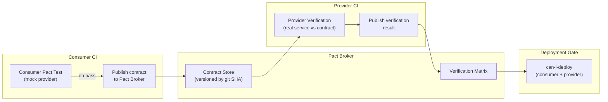

# API Contract Testing

Status: Draft | Last Reviewed: 2026-05-28 | Owner: @tech-lead-backend
Catalog ID: INT-015 | Radii
Tier Applicability: T0, T1

## Problem Statement

The payment gateway team ships a new version of the `/v2/payments` endpoint that renames the `amount` field to `amountVnd` for consistency with the rest of the platform. They update their OpenAPI spec, run their own unit tests, and deploy to UAT. The mobile banking app — written by a different team three months ago — breaks immediately. The mobile team's contract was never formalised: it was an informal agreement based on a Confluence page that nobody updated. The bug is found in UAT, but the fix requires a coordinated deployment across two teams and two release cycles. A breaking change that should have been caught in CI took a sprint to resolve.

API contract testing is the discipline of encoding the expectations that each consumer has of each provider as machine-verifiable tests that run in CI on both sides. When the provider changes the API, the consumer contract tests fail on the provider side — before deployment, not after. When the consumer changes its expectations, the provider contract tests verify the provider still satisfies them. The contract becomes the source of truth that replaces informal coordination, Confluence pages, and "I thought you were still using the old field."

## Context

The platform has dozens of API relationships: the mobile app calls the payment gateway, the payment gateway calls the fraud engine, the limit engine calls the account service, and so on. REST APIs are documented with OpenAPI 3.0 (INT-015 is the contract enforcement mechanism for those specs). Message-bus events have schema registry governance (INT-013). This pattern covers REST/HTTP contract testing using Pact, the de-facto consumer-driven contract testing framework for banking microservices.

Contract testing complements but does not replace integration testing. Integration tests verify that services work together in a running environment; contract tests verify that the interface definition (the contract) is honoured by both parties, independently, without needing a live instance of the other service. They run fast, in isolation, and catch breaking changes at the PR level rather than in a full integration environment.

## Solution

Each consumer service publishes a Pact contract file (JSON) describing the interactions it expects from each provider. The consumer tests run against a mock provider built from the Pact contract. The provider tests verify the real service satisfies all consumer contracts by running consumer-defined interactions against the live provider. Contracts are stored in a Pact Broker (self-hosted). CI enforces a "can I deploy?" gate: neither the consumer nor the provider may be deployed unless all contracts between them are verified.



## Implementation Guidelines

**1. Consumer Pact test (Spring Boot + RestTemplate)**

```java
// src/test/java/com/banking/mobile/PaymentGatewayPactTest.java
@ExtendWith(PactConsumerTestExt.class)
@PactTestFor(providerName = "payment-gateway", port = "8080")
public class PaymentGatewayPactTest {

    @Pact(consumer = "mobile-banking-app")
    public RequestResponsePact createPaymentPact(PactDslWithProvider builder) {
        return builder
            .given("a valid authenticated customer")
            .uponReceiving("a payment initiation request")
                .method("POST")
                .path("/v2/payments")
                .headers(Map.of("Content-Type", "application/json",
                                "Authorization", "Bearer test-token"))
                .body(new PactDslJsonBody()
                    .numberType("amountVnd", 500000L)
                    .stringType("currency", "VND")
                    .stringType("merchantId", "MCH-001")
                    .stringType("idempotencyKey", "test-key-001"))
            .willRespondWith()
                .status(202)
                .headers(Map.of("Content-Type", "application/json"))
                .body(new PactDslJsonBody()
                    .stringType("paymentId")
                    .stringMatcher("status", "PENDING|APPROVED", "PENDING")
                    .numberType("amountVnd", 500000L))
            .toPact();
    }

    @Test
    @PactTestFor(pactMethod = "createPaymentPact")
    void initiatePayment_shouldMatchContract(MockServer mockServer) {
        PaymentGatewayClient client = new PaymentGatewayClient(mockServer.getUrl());
        PaymentResponse response = client.initiatePayment(new PaymentRequest(500000L, "VND", "MCH-001", "test-key-001"));
        assertThat(response.getStatus()).isIn("PENDING", "APPROVED");
        assertThat(response.getAmountVnd()).isEqualTo(500000L);
    }
}
```

**2. Provider verification (payment gateway CI)**

```java
// src/test/java/com/banking/gateway/PactProviderTest.java
@Provider("payment-gateway")
@PactBroker(
    url = "${PACT_BROKER_URL}",
    authentication = @PactBrokerAuth(token = "${PACT_BROKER_TOKEN}")
)
@SpringBootTest(webEnvironment = SpringBootTest.WebEnvironment.RANDOM_PORT)
public class PactProviderTest {

    @LocalServerPort
    private int port;

    @TestTemplate
    @ExtendWith(PactVerificationSpringProvider.class)
    void pactVerificationTest(PactVerificationContext context) {
        context.verifyInteraction();
    }

    @BeforeEach
    void setTarget(PactVerificationContext context) {
        context.setTarget(new HttpTestTarget("localhost", port));
    }

    @State("a valid authenticated customer")
    void validAuthenticatedCustomer() {
        // Seed test data — insert a test customer with known ID
        testDataFactory.createCustomer("test-customer-001", KycStatus.VERIFIED);
    }
}
```

**3. CI pipeline — Pact publication and can-i-deploy gate**

```yaml
# .github/workflows/consumer-pact.yml
name: Consumer Pact
on: [push, pull_request]
jobs:
  pact:
    runs-on: ubuntu-latest
    steps:
      - uses: actions/checkout@v4
      - name: Run consumer Pact tests
        run: ./gradlew test --tests "*PactTest"
        env:
          PACT_BROKER_URL: ${{ secrets.PACT_BROKER_URL }}
          PACT_BROKER_TOKEN: ${{ secrets.PACT_BROKER_TOKEN }}
      - name: Publish Pact contracts
        run: |
          ./gradlew pactPublish \
            -Ppact.broker.url=$PACT_BROKER_URL \
            -Ppact.consumer.version=${{ github.sha }} \
            -Ppact.consumer.tags=${{ github.ref_name }}
      - name: Can I Deploy?
        run: |
          pact-broker can-i-deploy \
            --pacticipant mobile-banking-app \
            --version ${{ github.sha }} \
            --to-environment production \
            --broker-base-url $PACT_BROKER_URL \
            --broker-token $PACT_BROKER_TOKEN
```

**4. Pact Broker Helm values**

```yaml
# platform/pact-broker/helm/values-prod.yaml
pactBroker:
  image:
    repository: pactfoundation/pact-broker
    tag: "2.107.0"
  replicaCount: 2
  config:
    PACT_BROKER_DATABASE_ADAPTER: postgres
    PACT_BROKER_DATABASE_HOST: pact-broker-postgres.platform.svc
    PACT_BROKER_DATABASE_NAME: pact_broker
    PACT_BROKER_ALLOW_PUBLIC_READ: "false"
    PACT_BROKER_ENABLE_PUBLIC_BADGE_UI: "false"
  resources:
    requests:
      cpu: "250m"
      memory: "512Mi"
    limits:
      cpu: "1"
      memory: "1Gi"
```

## When to Use

- Any REST API relationship where producer and consumer are owned by different teams — breaking changes must be caught before deployment
- When a provider has more than one consumer and cannot safely change the API without checking all consumers
- Mobile app → backend API contracts: the mobile release cycle is long; breaking a mobile contract undetected is a P1 incident
- When OpenAPI specs exist (INT-009) and need automated enforcement beyond "the spec is updated"

## When Not to Use

- Internal same-team services deployed as a monorepo — the PR is the contract gate
- UI component interactions — Pact is designed for API contracts, not browser/DOM testing
- Kafka/Avro event contracts — use the Schema Registry (INT-013) instead; Pact supports async but the schema registry is the authoritative enforcement mechanism

## Variants

| Variant | When to prefer | Trade-off |
|---------|----------------|-----------|
| Pact with Pact Broker (this pattern) | Multiple consumers per provider; need a centralised matrix; can-i-deploy gate | Requires self-hosting the Pact Broker; adds CI complexity |
| PactFlow (managed) | Teams want managed Pact Broker with SAML SSO and audit logs | SaaS cost (~USD 200/month per team); data leaves the network |
| Spring Cloud Contract | Teams already using Spring Cloud ecosystem; prefer server-side contract definition | Less ecosystem support; not consumer-driven (provider defines the contract) |
| OpenAPI diff in CI | Simple breaking-change detection without full Pact | Does not verify the provider actually implements the spec; misses state-based behaviour |

## NFR Acceptance Criteria

```yaml
nfr_acceptance_criteria:
  catalog_id: INT-015
  pattern: API Contract Testing
  performance:
    - id: INT-015-HP-01
      description: Consumer Pact test suite must complete within 60 seconds in CI.
      threshold: consumer_pact_suite_duration < 60s
    - id: INT-015-HP-02
      description: Provider verification must complete within 120 seconds per provider in CI.
      threshold: provider_verification_duration < 120s
  reliability:
    - id: INT-015-REL-01
      description: The can-i-deploy gate must block deployment if any consumer contract is unverified for the target environment.
      threshold: 0 deployments with unverified contracts
  coverage:
    - id: INT-015-COV-01
      description: All T0 REST API provider/consumer pairs must have at least one Pact contract registered in the Pact Broker.
      threshold: 0 T0 API relationships without a registered Pact contract
```

## Compliance Mapping

| Ring | Regulation | Provision | How this pattern satisfies |
|------|-----------|-----------|---------------------------|
| Ring 0 | OpenAPI Initiative — API contract-first design principles | API contracts should be machine-verifiable; breaking changes should be prevented by tooling, not convention | Pact contracts are machine-verifiable JSON artefacts; the can-i-deploy gate is an automated enforcement mechanism that operationalises the contract-first principle |
| Ring 1 | PCI DSS v4.0 | Requirement 6.3.2 — all bespoke software components must be assessed for security impacts before deployment | Provider Pact verification ensures that API changes do not break existing consumer integrations before deployment; the verification result is a timestamped artefact in the Pact Broker usable as PCI evidence of pre-deployment change assessment |
| Ring 2 | SBV Circular 09/2020 | §IV.2 — inter-system interfaces at credit institutions must be documented and changes must not degrade service continuity | Pact contracts document the expected behaviour of each inter-system REST interface; the can-i-deploy gate prevents changes that break service continuity from reaching production ⚠️ (working summary — pending Legal review) |

## Cost / FinOps Notes

- Pact Broker: 2 pods at 0.25 CPU / 512 MB each + PostgreSQL (1 CPU / 2 GB) = ~1.5 CPU + 3 GB RAM on shared platform nodes
- PostgreSQL storage: contracts are small JSON (~5 KB each); at 1,000 contracts × 50 versions × 5 KB = 250 MB — negligible
- PactFlow managed: ~USD 200/month per team if teams prefer SaaS; evaluate against self-hosting cost (~USD 50/month on shared infra)
- CI overhead: Pact tests run in existing GitHub Actions minutes; at 60s consumer + 120s provider per PR = ~3 minutes; negligible at any normal PR volume

## Threat Model

**Contract Spoofing — publishing a forged consumer contract that disables security checks (Tampering)**: an attacker who gains write access to the Pact Broker publishes a modified consumer contract that removes the `Authorization` header requirement from the expected interaction. The provider's verification passes (the provider does not check what headers are required, only that it can fulfil the request). The consumer now operates without authentication. Mitigation: the Pact Broker requires an authenticated service account token for publishing contracts; the token is stored in Vault (SEC-007); all contract publications are logged with the publisher's service account identity; contract signing (Pact's `--consumer-cert`) is enabled so the provider can verify the contract was published by a legitimate CI pipeline.

**Stale Verification Matrix — deploying a consumer that relies on an outdated provider verification (Elevation of Privilege)**: the can-i-deploy gate checks the verification matrix at deploy time. If the Pact Broker's matrix is stale (e.g., a prior provider deployment was verified against a different version of the consumer), the gate may incorrectly allow a deploy that breaks the current consumer. Mitigation: the `can-i-deploy` command is run with `--to-environment production` which checks the most recent verification result against the exact consumer and provider versions being deployed; provider verification is triggered on every provider PR merge, not just on tag/release; the Pact Broker's webhook is configured to trigger provider CI on any new consumer contract publication.

## Operational Runbook (stub)

1. Alert: PactBrokerUnavailable — fires when the Pact Broker health endpoint returns non-200 for 3 consecutive minutes. p50 resolution: 5 min; p99: 20 min. Check pod status: `kubectl get pods -n platform -l app=pact-broker`. Common causes: PostgreSQL connection failure (check `PACT_BROKER_DATABASE_HOST` connectivity), OOM kill (increase memory limit from 1Gi to 2Gi). When the Pact Broker is unavailable, CI pipelines that require `can-i-deploy` will fail — configure CI to fail-open (allow deploy) with a Slack alert to the platform team when the broker is unreachable. Resume normal gate enforcement once the broker is restored.

2. Alert: PactCanIDeployBlocked — fires when a `can-i-deploy` check blocks a deployment to production (informational alert for visibility). p50 resolution: 60 min; p99: 4 hours. Inspect the blocked deployment: `pact-broker can-i-deploy --pacticipant <name> --version <sha> --to-environment production --output table`. The table shows which consumer/provider pair failed verification and the date of the last verification. Common causes: provider made a breaking API change not yet detected by consumer contract tests (the contract correctly blocked an unsafe deploy), or the provider verification CI has not run yet for the new provider version (trigger provider verification manually).

## Test Strategy

**Unit**: `PaymentGatewayPactTest` — run consumer Pact tests; assert the generated Pact JSON file contains the correct `amountVnd` field in the request and response bodies; assert the interaction title matches the state `"a valid authenticated customer"`; verify that removing the `Authorization` header from the expected interaction causes the consumer test to fail (negative test for contract completeness).

**Integration**: `PactProviderTest` — start the payment gateway in `RANDOM_PORT` mode against a Testcontainers PostgreSQL; replay the consumer Pact contract from the Pact Broker; assert all interactions pass verification; seed the `validAuthenticatedCustomer` state and assert the `POST /v2/payments` endpoint returns HTTP 202 with the `paymentId` field; intentionally break the provider (rename `amountVnd` to `amount`) and assert the verification fails.

**Pipeline**: `CanIDeployGateTest` — integration test of the full CI pipeline; publish a consumer contract with a known version; run provider verification; assert the Pact Broker matrix records a successful verification; run `can-i-deploy` for that consumer version; assert it returns exit code 0. Publish a second consumer contract with a new interaction the provider does not yet implement; run `can-i-deploy` before provider verification; assert it returns exit code 1 (blocks deploy).

**Compliance**: `PactBrokerAuditTest` — verify the Pact Broker records the publisher identity for every contract publication; assert no contract can be published without a valid service account token; assert that contract publication events are visible in the Pact Broker audit log for PCI evidence.

## Related Patterns

- [INT-009 Content-Based Router](content-based-router.md) — content-based routing uses the same OpenAPI-defined request fields as contract tests; a valid Pact contract implicitly verifies that routing predicates remain stable
- [INT-013 Schema Registry Governance](schema-registry-governance.md) — Kafka/Avro event contracts use the schema registry; REST API contracts use Pact — the two patterns are complementary, not competing
- [INT-014 Webhook Delivery Reliability](webhook-delivery-reliability.md) — webhook payload contracts are also tested with Pact consumer-driven contracts before delivery
- [PLT-003 GitOps Deployment Pipeline](../platform/gitops-deployment-pipeline.md) — the can-i-deploy gate is integrated into the GitOps promotion workflow; no ArgoCD sync proceeds without a passed can-i-deploy check
- [OBS-008 Log Aggregation Pipeline](../observability/log-aggregation-pipeline.md) — Pact Broker audit logs (contract publications, verification results) are shipped to OpenSearch for PCI compliance evidence

## References

- Pact Foundation — consumer-driven contract testing documentation and Pact Broker
- PactFlow documentation — managed Pact Broker with SAML SSO
- Martin Fowler — Contract Test (martinfowler.com/bliki/ContractTest.html)
- PCI DSS v4.0 Requirement 6.3.2 — pre-deployment security assessment of bespoke software
- SBV Circular 09/2020 §IV.2 — inter-system interface integrity requirements

---
**Key Takeaway**: Encode every consumer's REST API expectations as a Pact contract, verify those contracts against the real provider in CI, and enforce a `can-i-deploy` gate that blocks deployment unless all contract pairs are verified — so breaking API changes are caught at the PR level, not in UAT or production.
