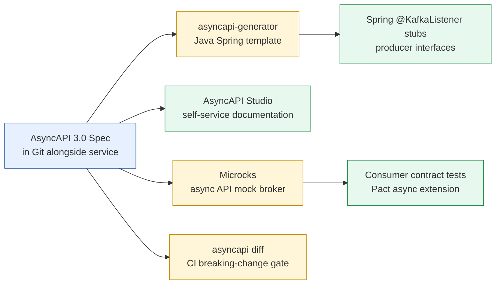

# AsyncAPI Specification

Status: Draft | Last Reviewed: 2026-05-10 | Owner: @tech-lead-backend
Catalog ID: INT-010 | Radii
Tier Applicability: T0, T1, T2

## Problem Statement

Event-driven API contracts are published informally:
- Kafka topic schemas documented in Confluence — no machine-readable spec, no versioning, no validation
- A producer changes the `amount` field from `integer` to `decimal` — three consumers break silently
- Code generation not possible — developers hand-write `@KafkaListener` stubs that drift from actual topic schema
- No contract testing — integration tests pass because mocks match the old schema, not the actual producer
- No governed versioning strategy — breaking changes deployed without a deprecation window

## Solution

Use **AsyncAPI 3.0** as the contract standard for all event-driven channels, parallel to OpenAPI for REST. Machine-readable specs enable code generation, contract testing via Microcks, and automated breaking-change detection in CI.



## Implementation Guidelines

### 1. AsyncAPI 3.0 Document Structure

A full AsyncAPI 3.0 spec for the payment transaction domain:

```yaml
asyncapi: 3.0.0

info:
  title: Payment Transaction Events
  version: 1.2.0
  description: |
    Event contracts for the Payments domain.
    Publisher: payment-gateway (T0)
    Schema registry: https://schema-registry.techcombank.com
    AsyncAPI spec maintained in: payment-gateway/src/main/resources/asyncapi/
  contact:
    name: Payments Domain Team
    email: payments-team@techcombank.com.vn
  license:
    name: Techcombank Internal Use Only

servers:
  production:
    host: kafka.techcombank.internal:9092
    protocol: kafka
    description: Production Kafka cluster (mTLS)
    security:
      - mTLS: []
    bindings:
      kafka:
        schemaRegistryUrl: https://schema-registry.techcombank.com
        schemaRegistryVendor: confluent

  staging:
    host: kafka-staging.techcombank.internal:9092
    protocol: kafka
    description: Staging Kafka cluster

channels:
  paymentTransactionCreated:
    address: techcombank.payments.transaction.created.v1
    description: |
      Published when a payment transaction is successfully recorded.
      Partition key: transactionId (ensures ordered processing per transaction).
    bindings:
      kafka:
        topic: techcombank.payments.transaction.created.v1
        partitions: 12
        replicas: 3
        configs:
          retention.ms: 604800000      # 7 days
          cleanup.policy: delete
          min.insync.replicas: 2
    messages:
      paymentTransactionCreatedMessage:
        $ref: '#/components/messages/PaymentTransactionCreated'

  paymentTransactionFailed:
    address: techcombank.payments.transaction.failed.v1
    description: Published when a payment transaction is rejected or fails
    bindings:
      kafka:
        topic: techcombank.payments.transaction.failed.v1
        partitions: 6
        replicas: 3
        configs:
          retention.ms: 2592000000     # 30 days (longer for audit)
    messages:
      paymentTransactionFailedMessage:
        $ref: '#/components/messages/PaymentTransactionFailed'

operations:
  publishPaymentTransactionCreated:
    action: send
    channel:
      $ref: '#/channels/paymentTransactionCreated'
    summary: payment-gateway publishes when a transaction is recorded
    description: |
      Published after successful T24 OFS FUNDS.TRANSFER call.
      Downstream: inventory-service, notification-service, audit-service.
    bindings:
      kafka:
        clientId:
          type: string
          enum: [payment-gateway]
        groupId:
          type: string
          description: Not applicable for producers

  consumePaymentTransactionCreated:
    action: receive
    channel:
      $ref: '#/channels/paymentTransactionCreated'
    summary: Subscribe to payment transaction created events

components:
  messages:
    PaymentTransactionCreated:
      name: PaymentTransactionCreated
      title: Payment Transaction Created
      summary: A new payment transaction has been recorded
      contentType: application/json
      headers:
        type: object
        properties:
          traceparent:
            type: string
            description: "W3C TraceContext traceparent header (OBS-002)"
            pattern: "^00-[0-9a-f]{32}-[0-9a-f]{16}-[0-9a-f]{2}$"
          content-type:
            type: string
            const: "application/cloudevents+json"
      payload:
        $ref: 'https://schema-registry.techcombank.com/subjects/payment-transaction-created/versions/latest/schema'
      examples:
        - name: IBFT payment example
          summary: Interbank Fund Transfer via NAPAS
          headers:
            traceparent: "00-4bf92f3577b34da6a3ce929d0e0e4736-00f067aa0ba902b7-01"
            content-type: "application/cloudevents+json"
          payload:
            specversion: "1.0"
            id: "550e8400-e29b-41d4-a716-446655440000"
            source: "/techcombank/payments/gateway"
            type: "com.techcombank.payments.transaction.created"
            time: "2026-05-10T10:30:00Z"
            datacontenttype: "application/json"
            techcombank-tier: "T0"
            data:
              transactionId: "TXN-2026-001234"
              amount: 5000000
              currency: "VND"
              channel: "IBFT"
              napasRrn: "260510123456"

    PaymentTransactionFailed:
      name: PaymentTransactionFailed
      title: Payment Transaction Failed
      contentType: application/json
      payload:
        type: object
        required: [transactionId, errorCode, errorMessage, timestamp]
        properties:
          transactionId:
            type: string
          errorCode:
            type: string
            description: "Techcombank error code (INT-012 taxonomy)"
            pattern: "^ERR-(PAY|ACC|KYC|FRD|SYS)-[0-9]{3}$"
          errorMessage:
            type: string
          timestamp:
            type: string
            format: date-time

  securitySchemes:
    mTLS:
      type: X509
      description: Mutual TLS — certificate issued by Techcombank PKI (SEC-001)
```

### 2. Code Generation

Generate Spring Boot consumer stubs and producer interfaces from the AsyncAPI spec:

```bash
# Install CLI
npm install -g @asyncapi/cli

# Generate Java Spring stubs
asyncapi generate fromTemplate \
  src/main/resources/asyncapi/payment-transaction-events.yaml \
  @asyncapi/java-spring-template \
  --output src/generated/asyncapi \
  --param artifactId=payment-consumer \
  --param groupId=com.techcombank.payments \
  --param javaPackage=com.techcombank.payments.generated

# Output: @KafkaListener stubs, producer interfaces, model classes
```

Generated consumer stub (never edit directly — regenerate from spec):

```java
// Generated by asyncapi-generator — DO NOT EDIT
// Source: payment-transaction-events.yaml v1.2.0
@Component
public abstract class PaymentTransactionCreatedConsumer {

  @KafkaListener(
    topics = "${asyncapi.topics.payment-transaction-created:techcombank.payments.transaction.created.v1}",
    groupId = "${spring.kafka.consumer.group-id}"
  )
  public final void onPaymentTransactionCreated(
      @Payload PaymentTransactionCreated payload,
      @Header(name = "traceparent", required = false) String traceparent) {
    handlePaymentTransactionCreated(payload, traceparent);
  }

  protected abstract void handlePaymentTransactionCreated(
      PaymentTransactionCreated payload, String traceparent);
}
```

### 3. Schema Registry Integration

AsyncAPI `payload.$ref` points to the Confluent Schema Registry. Use the `asyncapi-avro` plugin to render Avro schemas:

```yaml
# payload $ref in AsyncAPI spec:
payload:
  $ref: 'https://schema-registry.techcombank.com/subjects/payment-transaction-created/versions/latest/schema'
```

Schema registry ACL — only `payment-gateway` service account can register schemas under `techcombank.payments.*`:

```bash
# Confluent Schema Registry ACL
kafka-acls.sh --bootstrap-server kafka:9092 \
  --add --allow-principal User:payment-gateway \
  --operation WRITE \
  --resource-pattern-type PREFIXED \
  --topic techcombank.payments
```

### 4. Contract Testing with Microcks

```java
@SpringBootTest
@Testcontainers
class PaymentTransactionContractTest {

  @Container
  static MicrocksContainer microcks = new MicrocksContainer(
      DockerImageName.parse("quay.io/microcks/microcks-uber:1.9.0"))
    .withMainArtifact("src/main/resources/asyncapi/payment-transaction-events.yaml");

  @Test
  void paymentTransactionCreated_conformsToAsyncApiSpec() throws Exception {
    TestRequest request = TestRequest.builder()
        .serviceId("Payment Transaction Events:1.2.0")
        .runnerType(TestRunnerType.ASYNC_API_SCHEMA)
        .testEndpoints(List.of(
            "kafka://localhost:9092/techcombank.payments.transaction.created.v1"))
        .timeout(Duration.ofSeconds(15))
        .build();

    TestResult result = microcks.testEndpoint(request);

    assertTrue(result.isSuccess(),
        "AsyncAPI contract test failed: " + result.getTestCaseResults());
  }
}
```

### 5. Breaking-Change Detection in CI

```yaml
# .gitlab-ci.yml
asyncapi-breaking-change:
  stage: validate
  image: asyncapi/cli:latest
  script:
    # Validate spec syntax
    - asyncapi validate src/main/resources/asyncapi/payment-transaction-events.yaml

    # Compare with the version on main — fail on breaking changes
    - git fetch origin main
    - git show origin/main:src/main/resources/asyncapi/payment-transaction-events.yaml > /tmp/main-spec.yaml
    - asyncapi diff /tmp/main-spec.yaml src/main/resources/asyncapi/payment-transaction-events.yaml
      --format json | python3 -c "
import sys, json
diff = json.load(sys.stdin)
breaking = [c for c in diff.get('changes', []) if c.get('type') == 'BREAKING']
if breaking:
    print('BREAKING CHANGES DETECTED:')
    for c in breaking: print(f'  - {c[\"action\"]}: {c[\"path\"]}')
    print('Increment major version in AsyncAPI spec info.version before merging.')
    sys.exit(1)
print('No breaking changes detected.')
"
  rules:
    - changes:
        - "**/*.yaml"
        - "**/*.yml"
```

### 6. Versioning Rules

| Change type | Action |
|---|---|
| Add optional field | Bump `info.version` minor (1.2.0 → 1.3.0); same channel address |
| Rename or remove field | **Breaking** — new channel address (`*.v2`); maintain old channel for 90-day migration window |
| Change field type | **Breaking** — new channel address |
| Add required field | **Breaking** — new channel address |
| Add optional operation | Non-breaking — bump minor version |

**Migration window**: old topic maintained for 90 days. All consumers must migrate before topic retirement.

## Relation to CloudEvents (INT-011)

AsyncAPI and CloudEvents are complementary, not competing:
- **AsyncAPI** defines the *channel contract*: topic address, partitions, bindings, message type.
- **CloudEvents** defines the *message envelope*: `specversion`, `id`, `source`, `type`, mandatory attributes.

The AsyncAPI `payload.$ref` resolves to a CloudEvents-wrapped schema. When using both (recommended for T0/T1 Kafka topics): AsyncAPI describes the channel; the message body contains a CloudEvents envelope; the CloudEvents `data` field contains the domain payload.

## NFR Acceptance Criteria

- **AsyncAPI spec in Git**: every Kafka topic used by a T0/T1 service has an AsyncAPI spec committed alongside the service code. CI fails if a `@KafkaListener` topic is not documented in an AsyncAPI spec.
- **Breaking-change gate**: `asyncapi diff` blocking check runs on every PR that modifies an AsyncAPI spec file.
- **Code generation in CI**: generated stubs rebuilt from spec on every PR; build fails if generated code does not match spec.
- **Contract test in integration suite**: Microcks contract test runs in `integration-test` GitLab stage; fails if message structure deviates from spec.

## Compliance Mapping

| Layer | Reference | Section/Control | How this satisfies |
|---|---|---|---|
| Ring 0 (generic) | AsyncAPI 3.0 Specification (Linux Foundation) | Full spec compliance | Machine-readable event API contracts with versioning and schema registry integration |
| Ring 0 (generic) | OpenAPI Initiative (OAI) | AsyncAPI and OpenAPI as complementary standards | AsyncAPI covers async; OpenAPI covers sync — both required for complete API governance |
| Ring 1 (intl banking) | BCBS 239 §6 Accuracy | Accuracy of data exchanged between systems | Schema-validated Kafka messages prevent silent data corruption between services |
| Ring 1 (intl banking) | SWIFT CSP 2024 §5 ⚠️ (working summary) | Secure management of messaging interfaces | AsyncAPI spec provides authoritative contract for SWIFT-adjacent messaging flows |
| Ring 2 (Vietnam) | SBV Circular 09/2020 §IV.2 ⚠️ (working summary — pending Legal review) | IT system interface management | AsyncAPI specs form the auditable contract record for all async interfaces |

## Cost / FinOps Notes

| Item | Driver | Order of magnitude |
|---|---|---|
| asyncapi-generator | Open-source (Apache 2.0) | $0 |
| AsyncAPI CLI | Open-source | $0 |
| Microcks community edition | Open-source | $0 |
| Confluent Schema Registry | Included in Confluent Platform license | Negotiated |
| CI pipeline time | `asyncapi diff` + `asyncapi validate` < 30s | Negligible |

## Threat Model Summary

STRIDE focus: **Tampering** (schema injection) and **Information Disclosure** (topic enumeration).

- **Top 3 threats addressed**:
  1. *Schema registry poisoning — attacker registers a malicious schema* — Schema registry ACL restricts WRITE to service accounts only; schema changes require code review.
  2. *Consumer breaks on producer schema change* — `asyncapi diff` CI gate blocks breaking changes; 90-day migration window for consumers.
  3. *Undocumented topic used in production* — CI gate fails if `@KafkaListener` topic not in AsyncAPI spec.
- **Top 3 residual threats**:
  1. *Schema registry outage causes consumer startup failure* — mitigation: consumers cache last-known schema locally; schema compatibility set to BACKWARD.
  2. *Generated stubs not regenerated after spec change* — mitigation: generated code committed in Git; CI fails if diff detected.
  3. *AsyncAPI spec version out of sync with actual topic* — mitigation: `asyncapi diff` compares spec to running topic schema via schema registry API in CI.

## Operational Runbook (stub)

**Breaking change deployed accidentally:**
1. Identify topic: `asyncapi diff` output in failed PR should have flagged this.
2. Immediate: deploy previous version of producer to unblock consumers.
3. Create new topic `*.v2`; update producer to publish to v2; add v2 spec to AsyncAPI.
4. Notify all consumer teams; 90-day migration window begins.

**Schema registry unavailable:**
1. Consumers fallback to cached schema (configured via `spring.kafka.consumer.properties.schema.registry.url.failover.enabled=true`).
2. Alert: `schema-registry-down` → P2 PagerDuty.
3. Escalate to platform team; schema registry is T1 infrastructure.

## Test Strategy (stub)

- **Spec lint**: `asyncapi validate` on every AsyncAPI file in CI; fails on syntax error.
- **Breaking-change detection**: `asyncapi diff` against `main` branch spec; fails on breaking change without version bump.
- **Code generation**: `asyncapi generate` run in CI; `git diff --exit-code src/generated/asyncapi/` fails if stubs are stale.
- **Contract test**: Microcks container in integration test stage; publishes example messages; validates schema conformance.

## Related Patterns

- [INT-011 CloudEvents Envelope Standard](cloudevents-envelope.md) — message envelope; composes with AsyncAPI channel contract
- [INT-001 SAGA Orchestration](saga-orchestration.md) — multi-step flows with multiple AsyncAPI channels
- [PRIN-002 Event-Driven Architecture](../../principles/event-driven-architecture.md) — EDA principles AsyncAPI implements
- [OBS-005 Async Middleware Observability](../observability/async-middleware-observability.md) — AsyncAPI topics monitored for lag/DLQ

## References

- [AsyncAPI 3.0 Specification](https://www.asyncapi.com/docs/reference/specification/v3.0.0)
- [asyncapi-generator](https://github.com/asyncapi/generator)
- [Microcks Async API Testing](https://microcks.io/documentation/using/asyncapi/)
- [AsyncAPI Diff](https://github.com/asyncapi/diff)
- [Confluent Schema Registry](https://docs.confluent.io/platform/current/schema-registry/)

---

**Key Takeaway**: Every T0/T1 Kafka topic requires an AsyncAPI 3.0 spec committed alongside the service. Use `asyncapi diff` as a CI breaking-change gate. Generate `@KafkaListener` stubs from the spec via `asyncapi-generator`. Validate message conformance with Microcks in the integration test stage. Maintain old topic for 90 days after breaking changes.
