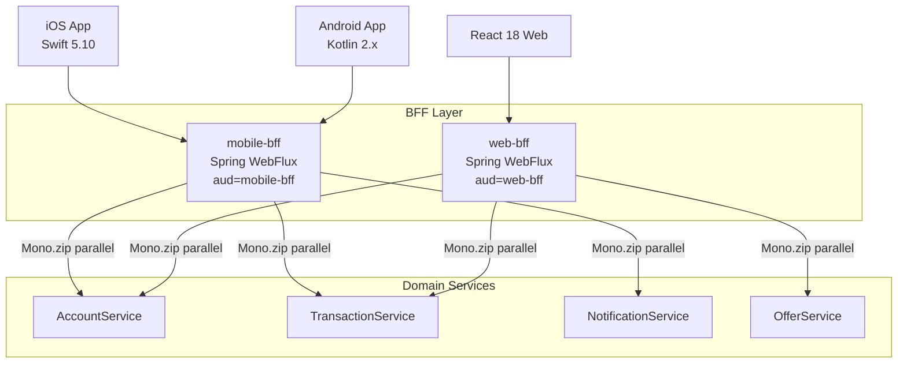

# Backend-for-Frontend Routing

Status: Draft | Last Reviewed: 2026-05-16 | Owner: @tech-lead-backend
Catalog ID: INT-008 | Radii
Tier Applicability: T0, T1

## Problem Statement

- **One-size-fits-all API mismatch**: a generic REST API designed for web desktop clients returns 40+ fields per account response; the mobile app needs only 8 fields but cannot control server-side field selection, wasting mobile data and battery parsing unnecessary JSON.
- **Over-fetching and waterfall latency**: the mobile app performs 4 sequential HTTP calls (account summary, recent transactions, notification count, product offers) to render a single dashboard screen, accumulating 4× network round-trip time on 4G/LTE — breaching the 200 ms P99 response budget.
- **Channel-specific security policy**: the mobile client should validate a narrowly scoped JWT (`aud: mobile-bff`) while the web client validates a broader JWT (`aud: web-bff`); a single API server cannot enforce per-channel `aud` claims without complex conditional logic.
- **Coupling downstream changes to multiple clients**: when the Account Service adds a field, the mobile app, the web app, and the embedded banking partner all receive the change and must independently handle the new field — the BFF isolates each channel from downstream evolution.
- **Mobile network resilience**: mobile BFF must implement aggressive caching, stale-while-revalidate, and retry-with-backoff tuned for high-latency mobile networks; a generic API server cannot apply mobile-specific resilience without polluting the server logic.

## Context

The BFF pattern deploys one dedicated aggregation service per client channel: `mobile-bff` (serving iOS Swift and Android Kotlin clients), `web-bff` (serving the React 18 web application), and `partner-bff` (serving embedded banking B2B API consumers). Each BFF is a thin Spring WebFlux reactive aggregation layer that composes calls to downstream domain services, shapes the response for its specific channel, and enforces channel-specific authentication and rate limits.

## Solution

Each BFF is a Spring WebFlux service that uses `Mono.zip` to call multiple downstream services in parallel, merging the responses into a single channel-optimised payload. The JWT `aud` claim is validated per-channel: mobile BFF accepts only `aud=mobile-bff`, web BFF accepts only `aud=web-bff`. Resilience4j bulkheads per downstream service prevent a slow Account Service from blocking Notification Service calls. The mobile BFF applies an additional ETag-based cache for 30-second stale responses to absorb mobile retry storms.



## Implementation Guidelines

### 1. Mobile BFF — `Mono.zip` parallel aggregation

```java
@RestController
@RequiredArgsConstructor
@RequestMapping("/mobile/v1")
public class MobileDashboardController {

    private final AccountClient accountClient;
    private final TransactionClient transactionClient;
    private final NotificationClient notificationClient;

    @GetMapping("/dashboard")
    public Mono<MobileDashboardResponse> getDashboard(
            @AuthenticationPrincipal Jwt jwt) {
        String accountId = jwt.getClaimAsString("account_id");

        return Mono.zip(
            accountClient.getSummary(accountId),
            transactionClient.getRecent(accountId, 5),
            notificationClient.getUnreadCount(accountId)
        ).map(tuple -> MobileDashboardResponse.builder()
            .accountSummary(tuple.getT1())
            .recentTransactions(tuple.getT2())
            .unreadNotifications(tuple.getT3())
            .build());
    }
}
```

### 2. JWT `aud` claim validation — channel-specific security

```java
@Configuration
public class MobileBffSecurityConfig {

    @Bean
    SecurityFilterChain mobileBffChain(HttpSecurity http) throws Exception {
        return http
            .oauth2ResourceServer(oauth2 -> oauth2
                .jwt(jwt -> jwt
                    .jwtAuthenticationConverter(jwtConverter())
                    .decoder(NimbusJwtDecoder.withJwkSetUri(jwksUri)
                        .jwtProcessorCustomizer(p ->
                            p.setJWTClaimsSetVerifier(new DefaultJWTClaimsVerifier<>(
                                new JWTClaimsSet.Builder().audience("mobile-bff").build(),
                                new HashSet<>(Arrays.asList("sub", "aud", "exp"))))).build())))
            .build();
    }
}
```

### 3. Resilience4j bulkhead — per-downstream isolation

```yaml
# application.yml
resilience4j:
  bulkhead:
    instances:
      account-client:
        maxConcurrentCalls: 50
        maxWaitDuration: 10ms
      transaction-client:
        maxConcurrentCalls: 30
        maxWaitDuration: 10ms
      notification-client:
        maxConcurrentCalls: 20
        maxWaitDuration: 5ms
```

### 4. Mobile ETag cache — stale-while-revalidate for mobile resilience

```java
@Component
public class MobileCacheFilter implements WebFilter {

    private final CacheControl cacheControl =
        CacheControl.maxAge(30, TimeUnit.SECONDS).staleWhileRevalidate(60, TimeUnit.SECONDS);

    @Override
    public Mono<Void> filter(ServerWebExchange exchange, WebFilterChain chain) {
        return chain.filter(exchange)
            .then(Mono.fromRunnable(() ->
                exchange.getResponse().getHeaders()
                    .setCacheControl(cacheControl.getHeaderValue())));
    }
}
```

## When to Use

- Mobile apps (iOS/Android) that need a single-call dashboard endpoint aggregating 3–5 downstream services to avoid sequential waterfall round trips on cellular networks.
- Multi-channel products where different clients (mobile, web, partner API) need meaningfully different response shapes, authentication scopes, or rate limits for the same underlying domain data.
- Any channel where downstream service coupling must be avoided — the BFF absorbs API evolution from domain services before it reaches the client contract.

## When Not to Use

- A single client type with uniform data requirements — if there is only one client and it needs exactly what the domain service returns, the BFF adds a network hop and complexity without benefit; call the domain service directly.
- GraphQL server already in place — GraphQL provides per-client field selection that eliminates the over-fetching problem; a BFF layer is redundant if GraphQL already serves the purpose.
- Event-driven real-time feeds (WebSocket push) — BFF is designed for request-response aggregation; real-time event push should use a dedicated WebSocket service or SSE endpoint.

## Variants

| Variant | When to prefer | Trade-off |
|---------|----------------|-----------|
| Channel-specific BFF (this pattern) | Well-defined client channels (mobile, web, partner); each needs distinct response shapes and auth policies | One BFF per channel to maintain; proliferates if channel count grows beyond 4–5 |
| GraphQL BFF | Flexible field selection needed; web clients with diverse query patterns; schema federation across teams | GraphQL adds schema complexity and N+1 query risk without DataLoader optimization |
| Generic API Gateway with field projection | Simple field trimming; no aggregation needed; small team | No business logic in the BFF; cannot handle complex parallel aggregation; projection rules can grow complex |

## NFR Acceptance Criteria

| Metric | Threshold | Measurement |
|--------|-----------|-------------|
| Mobile dashboard p99 response time | ≤ 200 ms (P99 under 500 rps) | Gatling load test; measure from first request byte to last response byte; assert p99 ≤ 200 ms |
| Parallel aggregation overhead | ≤ 20 ms vs slowest downstream (vs. sequential: sum of all downstreams) | Compare `Mono.zip` parallel vs. sequential calls in benchmark; assert overhead ≤ 20 ms |
| Bulkhead rejection rate | < 0.1% under normal load | Monitor `resilience4j_bulkhead_rejected_calls` metric; alert if > 0.1% |
| JWT audience rejection | 100% of wrong-`aud` tokens rejected | Security test: send `aud=web-bff` token to mobile BFF; assert 401 |
| Availability | 99.99% (T0 — mobile BFF is on the primary customer-facing path) | HPA min 3 pods; health check endpoint; Kubernetes liveness probe |

## Compliance Mapping

| Ring | Regulation | Provision | How this pattern satisfies |
|------|-----------|-----------|---------------------------|
| Ring 0 | OWASP ASVS V4 | §4.3.2 — API tokens must have a limited audience claim (`aud`); tokens for one service must be rejected by another | Mobile BFF validates `aud=mobile-bff`; web BFF validates `aud=web-bff`; a token issued for the mobile channel cannot be used against the web BFF, limiting the blast radius of a stolen token. |
| Ring 1 | PCI-DSS v4.0 | §6.2.4 — Prevent common security vulnerabilities including excessive data exposure | Mobile BFF returns only the 8 fields the mobile app needs, not all 40+ fields from the domain service; preventing exposure of unneeded cardholder data fields to mobile clients reduces CDE surface area. |
| Ring 2 | SBV Circular 09/2020 | §III.3 — Internet banking access control: channel-specific authentication and authorisation ⚠️ (working summary — pending Legal review) | Separate BFF per channel enforces separate JWT audience, separate rate limits, and separate session management per channel type; Legal review required to confirm that per-channel `aud` claim validation satisfies SBV §III.3 channel-specific access control requirements. |

## Cost / FinOps

- One BFF pod per channel: Spring WebFlux is reactive and event-loop-based; 2 pods per channel at 512 MiB each handles 500 rps per channel. For 3 channels (mobile, web, partner): 6 pods = 3 GiB.
- Parallel aggregation reduces client round trips: 4 sequential calls at 50 ms each = 200 ms; `Mono.zip` parallel = ~55 ms (slowest downstream). Reducing round trips reduces mobile data plan usage and improves conversion rates.
- ETag cache: 30 s stale cache for mobile dashboard absorbs 30× repeat requests from retry-happy mobile clients; reduces downstream service load proportionally.
- Cost of not using BFF: over-fetching 40 fields when 8 are needed — 5× unnecessary data transfer per mobile request at scale = measurable CDN and egress cost.

## Threat Model

- **Cross-channel token abuse (Spoofing)**: A token issued for `aud=web-bff` is stolen and replayed against the mobile BFF. The mobile BFF's `aud` claim validator rejects the token with 401 because the audience does not match `mobile-bff`. Mitigation: Spring Security JWT processor verifies audience claim before any route is authorized.
- **BFF as aggregation DDoS amplifier (Denial of Service)**: A client sends 1 request to the mobile BFF; the BFF fans out to 3 downstream services. An attacker can amplify 1 rps into 3 rps of downstream load. Mitigation: rate limiter at the API gateway (100 rps per authenticated client_id) before traffic reaches the BFF; bulkhead per downstream service limits the fan-out queue.

## Runbook Stub

**Alert: `mobile_bff_p99 > 300ms`**
- p50 baseline: 80 ms | p99 SLO: 200 ms
- Remediation: (1) Check which downstream call is slow using distributed traces (Jaeger): `GET /mobile/v1/dashboard` trace → identify slow span. (2) If `account-client` is slow, check AccountService HPA — scale if needed. (3) If the BFF itself is slow, check `mobile_bff` pod CPU/memory. (4) If all downstreams are healthy, check for a GC pause in the BFF pod: `kubectl logs <pod> | grep "GC pause"`.

**Alert: `mobile_bff_bulkhead_rejected > 1%`**
- p50 baseline: 0% | p99 SLO: 0.1%
- Remediation: (1) Identify which bulkhead is saturating: `resilience4j_bulkhead_rejected_calls_total{name=...}` in Grafana. (2) Check the downstream service health. (3) Increase bulkhead `maxConcurrentCalls` temporarily. (4) Investigate if a downstream is degraded and triggering client-side retry storms.

## Test Strategy Stub

### Unit Tests
- `MobileDashboardControllerTest`: mock `accountClient`, `transactionClient`, `notificationClient`; assert `Mono.zip` calls all three; assert response contains fields from all three mocks; assert slow notificationClient (100 ms delay) does not block the `Mono.zip` (zip runs in parallel).
- `MobileBffSecurityConfigTest`: send JWT with `aud=web-bff`; assert 401. Send JWT with `aud=mobile-bff`; assert 200.

### Integration Tests
- Spring Boot Test + WireMock: stub all 3 downstream services at 50 ms response time; measure dashboard endpoint response time; assert < 80 ms (parallel, not 150 ms sequential). Stub `account-client` to time out; assert bulkhead rejects after 10 ms; assert 503 returned to client.

### Chaos Tests
- Kill NotificationService: assert mobile dashboard returns 200 with `unreadNotifications: null` (graceful degradation via `onErrorReturn`); assert AccountService and TransactionService responses are still returned.

## Related Patterns

- [INT-007 Sidecar / Ambassador](sidecar-ambassador.md) — the sidecar handles mTLS for BFF-to-domain-service calls
- [SEC-005 BFF Token Binding](../../patterns/security/bff-token-binding.md) — the token binding that validates per-channel JWT `aud` at the BFF layer
- [SEC-002 OAuth2 Authorization](../../patterns/security/oauth2-authorization.md) — the OAuth2 authorization server that issues per-channel access tokens
- [NFR-002 Latency Budget Model](../../nfr/latency-budget-model.md) — the 200 ms T0 budget that the BFF parallel aggregation must fit within

## References

- Newman, S. (2015) — *Building Microservices*, Chapter 4: Backends for Frontends
- [Microsoft Azure Architecture — Backends for Frontends](https://docs.microsoft.com/en-us/azure/architecture/patterns/backends-for-frontends)
- Project Reactor Reference — [Mono.zip](https://projectreactor.io/docs/core/release/reference/#which.combination)
- [Resilience4j — Bulkhead](https://resilience4j.readme.io/docs/bulkhead)
- Spring Security OAuth2 Resource Server — [docs.spring.io/spring-security](https://docs.spring.io/spring-security/reference/servlet/oauth2/resource-server/jwt.html)
- `knowledge-base/_research-notes.md` — mobile API latency benchmarks

---

**Key Takeaway**: Deploy one BFF per client channel — a Spring WebFlux aggregation layer that fans out to multiple domain services in parallel via `Mono.zip`, enforces channel-specific JWT `aud` validation, and returns a single channel-optimised response within the 200 ms T0 latency budget.
