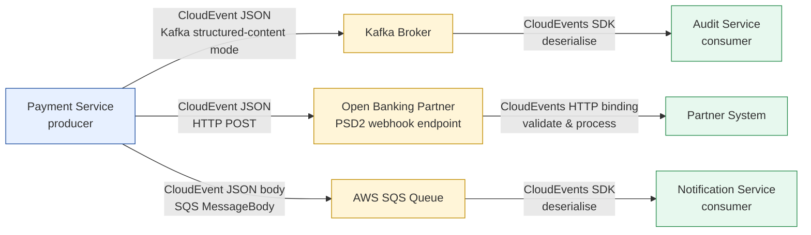

# CloudEvents Envelope Standard

Status: Draft | Last Reviewed: 2026-05-10 | Owner: @tech-lead-backend
Catalog ID: INT-011 | Radii
Tier Applicability: T0, T1, T2

## Problem Statement

Without a standard message envelope:
- Every team invents different fields: `eventType` vs `type` vs `@class` — consumers parse multiple formats
- No canonical `id` field — event deduplication (PRIN-006 idempotency) is impossible without per-team conventions
- No `source` field — compliance audit cannot determine which system produced an event
- Mobile clients receive different event structures from different domains — SDK must handle multiple schemas
- HTTP webhook payloads for open banking (PSD2) partners have no standard format — each partner integration is bespoke
- Event replay (for audit or recovery) is impossible without `time` and `id`

## Solution

Adopt **CloudEvents 1.0** as the standard message envelope for all Techcombank domain events. The CloudEvents spec provides mandatory attributes (`id`, `source`, `type`, `time`, `specversion`) plus Techcombank-specific extension attributes. Bindings cover Kafka (structured-content mode), HTTP (for webhooks), and SQS.



## Implementation Guidelines

### 1. Mandatory CloudEvents Attributes

Every Techcombank domain event MUST include these CloudEvents 1.0 attributes:

```json
{
  "specversion": "1.0",
  "id": "550e8400-e29b-41d4-a716-446655440000",
  "source": "/techcombank/payments/gateway",
  "type": "com.techcombank.payments.transaction.created",
  "time": "2026-05-10T10:30:00Z",
  "datacontenttype": "application/json"
}
```

**Attribute rules:**
- `specversion`: always `"1.0"` (string literal)
- `id`: UUID v4 — unique per event instance; used for deduplication (PRIN-006)
- `source`: URI path identifying the system: `/techcombank/{domain}/{service}`
- `type`: reverse-domain format: `com.techcombank.{domain}.{entity}.{verb}` (past tense — event is a fact)
- `time`: RFC 3339 UTC timestamp of when the event occurred (not when it was published)
- `datacontenttype`: `"application/json"` for all Techcombank events

### 2. Techcombank Extension Attributes

Extension attributes follow the CloudEvents extension naming convention (lowercase, no hyphens in the attribute name, but the header/key uses the extension name directly):

```json
{
  "specversion": "1.0",
  "id": "550e8400-e29b-41d4-a716-446655440000",
  "source": "/techcombank/payments/gateway",
  "type": "com.techcombank.payments.transaction.created",
  "time": "2026-05-10T10:30:00Z",
  "datacontenttype": "application/json",
  "techcombanktier": "T0",
  "techcombanktraceparent": "00-4bf92f3577b34da6a3ce929d0e0e4736-00f067aa0ba902b7-01",
  "techcombankcorrelationid": "TCB-2026-001234",
  "data": {
    "transactionId": "TXN-2026-001234",
    "amount": 5000000,
    "currency": "VND",
    "channel": "IBFT",
    "napasRrn": "260510123456"
  }
}
```

**Extension attribute definitions:**

| Attribute name | Type | Purpose |
|---|---|---|
| `techcombanktier` | String (T0/T1/T2/T3) | Consumer SLA tier; drives alerting priority in OBS-005 |
| `techcombanktraceparent` | String (W3C format) | Links event to distributed trace (OBS-002); separate from Kafka `traceparent` message header to support HTTP binding portability |
| `techcombankcorrelationid` | String | Business-level correlation (payment reference, order ID) |

### 3. Kafka Binding — Structured-Content Mode

The entire CloudEvent is serialised as JSON in the Kafka message value. The Kafka message header `content-type: application/cloudevents+json` signals structured-content mode.

**Producer implementation:**

```java
import io.cloudevents.CloudEvent;
import io.cloudevents.core.builder.CloudEventBuilder;
import io.cloudevents.kafka.CloudEventSerializer;

@Service
public class PaymentEventPublisher {

  private final KafkaTemplate<String, CloudEvent> kafkaTemplate;
  private final ObjectMapper objectMapper;

  public void publishTransactionCreated(Transaction txn) throws JsonProcessingException {
    String traceparent = buildTraceparent();  // from current OTEL span

    CloudEvent event = CloudEventBuilder.v1()
        .withId(UUID.randomUUID().toString())
        .withSource(URI.create("/techcombank/payments/gateway"))
        .withType("com.techcombank.payments.transaction.created")
        .withTime(OffsetDateTime.now(ZoneOffset.UTC))
        .withDataContentType("application/json")
        .withExtension("techcombanktier", "T0")
        .withExtension("techcombanktraceparent", traceparent)
        .withExtension("techcombankcorrelationid", txn.getReference())
        .withData(objectMapper.writeValueAsBytes(txn))
        .build();

    kafkaTemplate.send(
        "techcombank.payments.transaction.created.v1",
        txn.getId(),
        event
    );
  }

  private String buildTraceparent() {
    SpanContext ctx = Span.current().getSpanContext();
    if (!ctx.isValid()) return "";
    return String.format("00-%s-%s-%02x",
        ctx.getTraceId(), ctx.getSpanId(), ctx.getTraceFlags().asByte());
  }
}
```

**Spring Kafka configuration for CloudEvents:**

```yaml
spring:
  kafka:
    producer:
      value-serializer: io.cloudevents.kafka.CloudEventSerializer
      properties:
        cloudevents.serializer.encoding: STRUCTURED
    consumer:
      value-deserializer: io.cloudevents.kafka.CloudEventDeserializer
```

**Consumer implementation:**

```java
@KafkaListener(topics = "techcombank.payments.transaction.created.v1")
public void handleTransactionCreated(CloudEvent event) {
  // Validate event type
  if (!"com.techcombank.payments.transaction.created".equals(event.getType())) {
    log.warn("Unexpected event type: {}", event.getType());
    return;
  }

  // Extract tier for priority processing
  String tier = Objects.toString(event.getExtension("techcombanktier"), "T3");

  // Extract and restore trace context
  String traceparent = Objects.toString(event.getExtension("techcombanktraceparent"), null);
  if (traceparent != null) {
    // Restore OTEL context from CloudEvents extension (FOLLOWS_FROM semantics)
    W3CTraceContextPropagator.getInstance().extract(Context.current(),
        Map.of("traceparent", traceparent),
        MapGetter.INSTANCE);
  }

  // Deserialise domain payload
  Transaction txn = objectMapper.readValue(event.getData().toBytes(), Transaction.class);

  // Process based on tier
  if ("T0".equals(tier)) {
    transactionService.processHighPriority(txn);
  } else {
    transactionService.process(txn);
  }
}
```

### 4. HTTP Binding — PSD2 Webhooks

For open banking partner webhooks, use CloudEvents HTTP structured-content binding:

```http
POST /webhooks/payment-status HTTP/1.1
Host: partner-system.openbanking.example.com
Content-Type: application/cloudevents+json
Ce-Specversion: 1.0

{
  "specversion": "1.0",
  "id": "550e8400-e29b-41d4-a716-446655440001",
  "source": "/techcombank/payments/gateway",
  "type": "com.techcombank.payments.transaction.status.updated",
  "time": "2026-05-10T10:31:00Z",
  "datacontenttype": "application/json",
  "techcombanktier": "T0",
  "techcombankcorrelationid": "TCB-2026-001234",
  "data": {
    "transactionId": "TXN-2026-001234",
    "status": "SETTLED",
    "settledAt": "2026-05-10T10:30:55Z"
  }
}
```

Partner verification — webhook endpoint must validate:
1. `Content-Type: application/cloudevents+json`
2. `source` is a known Techcombank source URI
3. `id` not previously processed (idempotency check)
4. HMAC-SHA256 signature in `Ce-Signature` header (Techcombank extension)

### 5. SQS Binding

CloudEvent JSON serialised as the SQS `MessageBody`. Add `MessageAttribute` for routing:

```java
// SQS producer
SendMessageRequest request = SendMessageRequest.builder()
    .queueUrl(queueUrl)
    .messageBody(objectMapper.writeValueAsString(cloudEvent))
    .messageAttributes(Map.of(
        "content-type", MessageAttributeValue.builder()
            .dataType("String")
            .stringValue("application/cloudevents+json")
            .build(),
        "techcombanktier", MessageAttributeValue.builder()
            .dataType("String")
            .stringValue("T0")
            .build()
    ))
    .build();
sqsClient.sendMessage(request);
```

### 6. Validation at Producer

The CloudEvents Java SDK validates mandatory fields at construction time. Fail-fast:

```java
// This throws CloudEventValidationException if id, source, type, or specversion is missing:
CloudEvent event = CloudEventBuilder.v1()
    .withId(UUID.randomUUID().toString())  // required
    .withSource(URI.create("/techcombank/payments/gateway"))  // required
    .withType("com.techcombank.payments.transaction.created")  // required
    // time is optional per spec but MUST be set per Techcombank standard
    .withTime(OffsetDateTime.now(ZoneOffset.UTC))
    .build();
// SDK validates before returning; no null-check needed at call site
```

Custom Techcombank validator — also enforce extension attributes:

```java
@Component
public class TechcombankCloudEventValidator {

  private static final Pattern TRACEPARENT_PATTERN =
      Pattern.compile("^00-[0-9a-f]{32}-[0-9a-f]{16}-[0-9a-f]{2}$");

  public void validate(CloudEvent event) {
    requireExtension(event, "techcombanktier",
        tier -> Set.of("T0","T1","T2","T3").contains(tier),
        "techcombanktier must be T0, T1, T2, or T3");

    String traceparent = Objects.toString(event.getExtension("techcombanktraceparent"), "");
    if (!traceparent.isEmpty() && !TRACEPARENT_PATTERN.matcher(traceparent).matches()) {
      throw new CloudEventValidationException("Invalid techcombanktraceparent format");
    }
  }

  private void requireExtension(CloudEvent event, String name,
                                  Predicate<String> validator, String msg) {
    String value = Objects.toString(event.getExtension(name), null);
    if (value == null || !validator.test(value)) {
      throw new CloudEventValidationException(msg);
    }
  }
}
```

## NFR Acceptance Criteria

- **Zero malformed events**: CloudEvents SDK validates mandatory fields at producer; zero malformed events in any Kafka topic (enforced by schema registry and consumer validator).
- **`id` uniqueness**: Consumer interceptor checks `id` against Redis deduplication cache (TTL = 7 days, matching Kafka retention); rejects duplicates. Duplicate rate < 0.001% in steady state.
- **`source` validation**: Consumer allowlist — reject events where `source` does not match `^/techcombank/`.
- **Type naming convention**: CI ArchUnit rule asserts all `type` values in CloudEvent builders match `^com\.techcombank\.[a-z]+\.[a-z.]+$`.

## Compliance Mapping

| Layer | Reference | Section/Control | How this satisfies |
|---|---|---|---|
| Ring 0 (generic) | CloudEvents 1.0 Specification (CNCF) | Full spec compliance | Standard event envelope with mandatory `id`, `source`, `type`, `time` attributes |
| Ring 0 (generic) | CNCF Serverless Working Group | Interoperability across event platforms | CloudEvents enables multi-platform event routing (Kafka, SQS, HTTP webhooks) |
| Ring 1 (intl banking) | BCBS 239 §6 Accuracy | Accurate, identifiable event records | `id` (UUID) + `source` + `time` provide auditable event provenance |
| Ring 2 (Vietnam) | SBV Circular 09/2020 §IV.2 ⚠️ (working summary — pending Legal review) | IT system interface standards | CloudEvents provides standardised, auditable event metadata for SBV reporting |

## Cost / FinOps Notes

| Item | Driver | Order of magnitude |
|---|---|---|
| CloudEvents Java SDK | Open-source (Apache 2.0) | $0 |
| CloudEvents envelope overhead | ~300 bytes per event (mandatory attributes) | Negligible vs domain payload |
| Redis deduplication cache | TTL=7d; ~100 bytes per ID | ~100 MB for 1M events/day |

**Cost of NOT standardising**: one broken partner webhook integration (wrong field name) requires 2 weeks of integration debugging + partner SLA penalty. Standard envelope eliminates this class of error.

## Threat Model

**Envelope Spoofing — forged CloudEvents `source` field (Spoofing)**: a rogue service publishes CloudEvents with `source: "//banking.internal/payment-gateway"` (impersonating the payment gateway), causing downstream consumers to process fraudulent events as if they originated from a trusted source. Mitigation: CloudEvents published to Kafka must include an HMAC-SHA256 signature over the `id + source + type + time` fields in the `x-signature` extension attribute; consumers verify the signature against the expected producer service account before processing; unsigned events are forwarded to the dead letter topic; Kafka mTLS (INT-002) ensures only authenticated services can publish to production topics.

**Event Data Injection — malicious payload in `data` field (Tampering)**: an attacker publishes a CloudEvent with a valid envelope but injects a SQL fragment into the `data.accountNumber` field. A consumer that trusts the CloudEvent envelope without validating the payload passes the injected value to a downstream JDBC query. Mitigation: consumers must validate the `data` field against the registered JSON Schema for the event `type`; the schema is fetched from the schema registry using the event `dataschema` URI; any event whose `data` fails schema validation is rejected and sent to the DLQ with a `validation_failure` reason; producer SDKs run `withDataSchema()` validation at build time.

## Operational Runbook (stub)

1. Alert: CloudEventsValidationFailure — fires when the CloudEvents consumer reports more than 5 schema validation failures per minute for any event type. p50 resolution: 20 min; p99: 2 hours. Check the DLQ for rejected events: `kubectl exec -n banking-prod -it kafka-client -- kafka-console-consumer.sh --bootstrap-server kafka:9092 --topic payment-events.dlq --max-messages 5`. The rejected event's `x-rejection-reason` extension attribute contains the validation error. Common cause: producer deployed a schema change without updating the registry; the consumer's `dataschema` URI points to an old schema version.

2. Alert: CloudEventsDuplicateRate — fires when the CloudEvents consumer deduplication cache reports more than 10 duplicate `id` values per minute for the same consumer group. p50 resolution: 10 min; p99: 30 min. Check the producer for retry misconfiguration: `spring.kafka.producer.properties.enable.idempotence` must be `true`. Verify the Redis deduplication cache is healthy: `redis-cli GET cloudevents:id:{eventId}`. If Redis is unavailable, the database-level idempotency guard (PRIN-006) provides fallback protection.

## Test Strategy (stub)

- **Unit**: `TechcombankCloudEventValidator` — assert `techcombanktier=T0` passes; assert `techcombanktier=TX` throws; assert missing `id` fails.
- **Integration**: Consumer receives valid CloudEvent; assert correct domain payload deserialized; assert idempotency — send same `id` twice, assert processed once.
- **HTTP binding**: Spring MockMvc — POST `application/cloudevents+json` to webhook endpoint; assert 200 and correct domain logic triggered.
- **Deduplication**: Send identical event `id` twice to Kafka topic; assert consumer processes once and logs duplicate warning.

## Related Patterns

- [INT-010 AsyncAPI Specification](asyncapi-specification.md) — AsyncAPI defines the channel; CloudEvents defines the message envelope within that channel
- [INT-012 Error Code Mapping](error-code-mapping.md) — failed CloudEvents use `dataerror` extension and error envelope in `data`
- [PRIN-002 Event-Driven Architecture](../../principles/event-driven-architecture.md) — EDA principles implemented with CloudEvents envelopes
- [PRIN-006 Idempotency-by-Default](../../principles/idempotency-by-default.md) — `id` attribute enables idempotent event processing
- [OBS-002 Distributed Trace Propagation](../observability/distributed-trace-propagation.md) — `techcombanktraceparent` extension carries W3C trace context

## References

- [CloudEvents 1.0 Specification](https://cloudevents.io/)
- [CloudEvents Java SDK](https://github.com/cloudevents/sdk-java)
- [CloudEvents Kafka Binding](https://github.com/cloudevents/spec/blob/v1.0.2/cloudevents/bindings/kafka-protocol-binding.md)
- [CloudEvents HTTP Binding](https://github.com/cloudevents/spec/blob/v1.0.2/cloudevents/bindings/http-protocol-binding.md)
- [CNCF Serverless Working Group](https://github.com/cncf/wg-serverless)

---

**Key Takeaway**: Wrap every domain event in a CloudEvents 1.0 envelope with mandatory `id` (UUID v4), `source`, `type` (com.techcombank.*), and `time`. Add `techcombanktier`, `techcombanktraceparent`, and `techcombankcorrelationid` extension attributes. Use Kafka structured-content mode; HTTP binding for PSD2 webhooks. Validate at producer using the CloudEvents SDK — fail-fast prevents malformed events reaching consumers.
