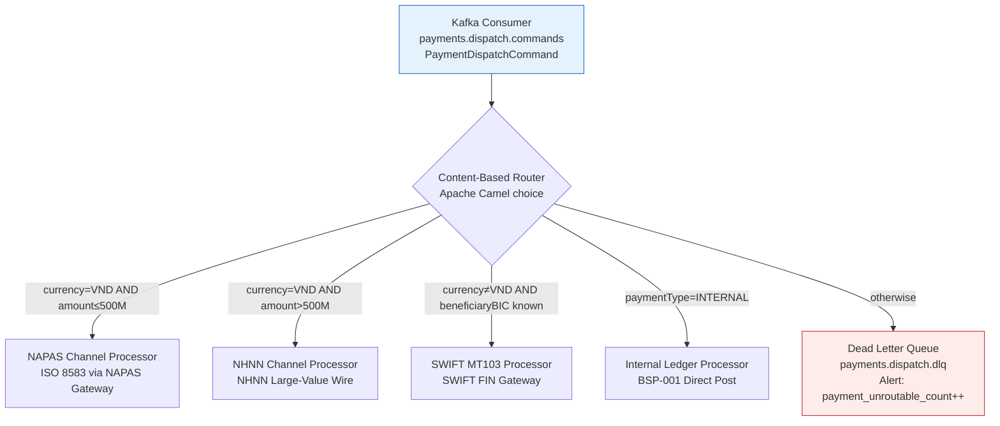

# Content-Based Router

Status: Draft | Last Reviewed: 2026-05-16 | Owner: @tech-lead-backend
Catalog ID: INT-009 | Radii
Tier Applicability: T0, T1

## Problem Statement

- **Payment channel proliferation**: Techcombank routes domestic VND transfers via NAPAS, international wires via SWIFT, interbank transfers via the National Interbank Network (NHNN), and intrabank transfers via the internal ledger — four distinct channels with different protocols, latency profiles, and compliance requirements that cannot be served by a single endpoint.
- **Hardcoded routing logic**: without a dedicated router, payment processing services embed channel selection as `if (currency == "VND" && amount < 500M) route to NAPAS else if ...` conditionals spread across multiple classes, making routing policy changes a full code-deploy.
- **DLQ starvation from unroutable messages**: a payment message with an unrecognised combination of currency, amount, and beneficiary BIC silently falls through all routing conditions and is either dropped or causes a `ClassCastException`, with no alert or DLQ entry.
- **Routing policy auditability**: SBV requires that the routing decision (which channel was used, why) be traceable per transaction; embedded if-else routing leaves no structured routing audit trail.
- **Multi-currency routing complexity**: VND payments below SBV's large-value threshold go to NAPAS; above the threshold they go to NHNN; USD/EUR go to SWIFT; the threshold changes periodically — routing policy must be externalised.

## Context

The Content-Based Router sits on the T0 payment dispatch path, immediately after sanction screening (BSP-003) and ledger posting (BSP-001). It receives a `PaymentDispatchCommand` from Kafka and routes to the appropriate channel processor based on message content: `currency`, `amount`, `beneficiaryBIC`, and `paymentType`. Apache Camel's `choice().when()` DSL provides the routing logic as externalised configuration; routing decisions are written to a structured audit log.

## Solution

An Apache Camel route receives `PaymentDispatchCommand` messages from Kafka topic `payments.dispatch.commands` and routes them to the appropriate channel endpoint using a priority-ordered `choice()` predicate chain. The final `otherwise()` block routes unroutable messages to a DLQ and fires a `payment_unroutable_count` alert. Each routing decision is written to a `routing_audit` PostgreSQL table with the `routing_reason` (which predicate matched) for SBV traceability.



## Implementation Guidelines

### 1. Apache Camel content-based router with allowlist enforcement

```java
@Component
public class PaymentDispatchRoute extends RouteBuilder {

    @Value("${routing.napas.amount-threshold-vnd:500000000}")
    private BigDecimal napasThreshold;

    @Override
    public void configure() {
        errorHandler(deadLetterChannel("kafka:payments.dispatch.dlq")
            .maximumRedeliveries(0)
            .logExhaustedMessageHistory(true));

        from("kafka:payments.dispatch.commands?groupId=payment-router")
            .routeId("content-based-router")
            .unmarshal().json(PaymentDispatchCommand.class)
            .process(this::logRoutingAudit)
            .choice()
                .when(exchange -> isInternal(exchange))
                    .to("direct:internal-ledger")
                .when(exchange -> isNapas(exchange))
                    .to("direct:napas-channel")
                .when(exchange -> isNhnn(exchange))
                    .to("direct:nhnn-channel")
                .when(exchange -> isSwift(exchange))
                    .to("direct:swift-mt103")
                .otherwise()
                    .process(exchange -> {
                        exchange.getMessage().setHeader("failureReason", "NO_ROUTE_MATCH");
                        meterRegistry.counter("payment_unroutable_count").increment();
                    })
                    .to("kafka:payments.dispatch.dlq")
            .end();
    }

    private boolean isInternal(Exchange ex) {
        PaymentDispatchCommand cmd = ex.getMessage().getBody(PaymentDispatchCommand.class);
        return "INTERNAL".equals(cmd.paymentType());
    }

    private boolean isNapas(Exchange ex) {
        PaymentDispatchCommand cmd = ex.getMessage().getBody(PaymentDispatchCommand.class);
        return "VND".equals(cmd.currency()) && cmd.amount().compareTo(napasThreshold) <= 0;
    }

    private boolean isNhnn(Exchange ex) {
        PaymentDispatchCommand cmd = ex.getMessage().getBody(PaymentDispatchCommand.class);
        return "VND".equals(cmd.currency()) && cmd.amount().compareTo(napasThreshold) > 0;
    }

    private boolean isSwift(Exchange ex) {
        PaymentDispatchCommand cmd = ex.getMessage().getBody(PaymentDispatchCommand.class);
        return !"VND".equals(cmd.currency()) && isKnownBic(cmd.beneficiaryBIC());
    }

    private boolean isKnownBic(String bic) {
        return allowlistedBics.contains(bic);
    }

    private void logRoutingAudit(Exchange ex) {
        PaymentDispatchCommand cmd = ex.getMessage().getBody(PaymentDispatchCommand.class);
        routingAuditRepo.save(new RoutingAudit(cmd.transactionId(), cmd.currency(),
            cmd.amount(), cmd.beneficiaryBIC(), Instant.now()));
    }
}
```

### 2. `RoutingAudit` entity and repository

```java
@Entity
@Table(name = "routing_audit")
public record RoutingAudit(
    @Id UUID id,
    String transactionId,
    String currency,
    BigDecimal amount,
    String beneficiaryBIC,
    String routedTo,
    Instant routedAt
) {}
```

### 3. Prometheus alert — DLQ routing spikes

```yaml
groups:
  - name: payment-routing
    rules:
      - alert: PaymentUnroutableSpike
        expr: rate(payment_unroutable_count[5m]) > 0.1
        for: 2m
        labels:
          severity: critical
        annotations:
          summary: "Payment routing failures > 0.1/s for 2 minutes"
          description: "Unroutable payments accumulating in DLQ — check routing rules and beneficiary BIC allowlist"
```

## When to Use

- Payment dispatch where messages must be routed to different channel processors (NAPAS, SWIFT, NHNN, internal ledger) based on message content, with auditable routing decisions per transaction.
- Any integration where routing policy changes (e.g., SBV changes the large-value threshold from VND 500M to VND 200M) must be deployable without a code change — externalise the threshold to a config property.
- Pipelines that must enforce an allowlist on routing targets: the `isKnownBic()` check prevents routing to unlisted external BICs, a control required by SWIFT CSP.

## When Not to Use

- Routing based on message source identity alone (e.g., all messages from Service A go to Topic B) — use Kafka partitioning or topic-per-producer rather than a content-based router; the complexity is unjustified if the routing key is already the partition key.
- A single downstream channel — if all payment types go to the same processor, there is nothing to route; the pattern adds indirection without value.
- Complex event processing that requires stateful aggregation before routing — use Kafka Streams windowing or Flink; the content-based router is stateless per message.

## Variants

| Variant | When to prefer | Trade-off |
|---------|----------------|-----------|
| Apache Camel `choice()` (this pattern) | Content-based routing with audit log; multi-channel banking; rule externalisation via config | Camel DSL learning curve; Camel context adds ~200 MiB to the service memory footprint |
| Kafka Streams topic routing | High-throughput exactly-once routing with Kafka guarantees; routing key is a simple field | Less flexible predicate logic; routing rules are code-compiled into the topology; harder to change at runtime |
| Message filter chain (EIP) | Each downstream subscribes to one topic and filters irrelevant messages itself | High fan-out — all messages go to all subscribers; each subscriber does its own filtering; wastes network bandwidth |

## NFR Acceptance Criteria

| Metric | Threshold | Measurement |
|--------|-----------|-------------|
| Routing decision p99 latency | ≤ 5 ms (Camel predicate chain) | Load test 5 000 messages/s through the router; assert Camel internal p99 ≤ 5 ms |
| DLQ rate | 0 under normal operations (allowlist covers all expected BICs) | Monitor `payment_unroutable_count`; alert if > 0 |
| Routing audit completeness | 100% — every dispatched payment has a `routing_audit` row | Daily reconcile `payments.dispatch.commands` topic messages against `routing_audit` table; assert 0 gaps |
| Threshold config propagation | ≤ 5 min (Spring Cloud Config refresh) | Update `routing.napas.amount-threshold-vnd`; assert new threshold active within 5 min without pod restart |
| Availability | 99.99% (T0 — all payment dispatch is blocked if router is down) | Min 3 pods; HPA; health check endpoint |

## Compliance Mapping

| Ring | Regulation | Provision | How this pattern satisfies |
|------|-----------|-----------|---------------------------|
| Ring 0 | Enterprise Integration Patterns (EIP) | Content-Based Router (EIP §4) — route messages based on content without the sender knowing the routing logic | The router is a standalone Camel route; payment services publish to `payments.dispatch.commands` without knowledge of the channel; routing logic is encapsulated. |
| Ring 1 | SWIFT CSP v2024 | Control 2.7 — Vulnerability scanning and payment routing controls; only authorised BICs may receive payments | `isKnownBic()` checks every beneficiary BIC against the allowlist before routing to SWIFT; unlisted BICs route to DLQ with `UNALLOWED_BIC` reason; audit log provides evidence of control execution. |
| Ring 2 | SBV Circular 09/2020 | §IV.2 — Transaction routing controls; large-value payments (> VND 500M) must use NHNN channel ⚠️ (working summary — pending Legal review) | `isNhnn()` predicate enforces the VND 500M threshold for NHNN routing; threshold is configurable without code change; `routing_audit.routedTo` provides per-transaction evidence; Legal review required to confirm the threshold value and NHNN channel designation satisfy current SBV §IV.2 requirements. |

## Cost / FinOps

- Apache Camel context: ~200 MiB memory overhead in the routing service. Shared with other Camel routes if the service uses Camel elsewhere.
- `routing_audit` table: ~300 bytes per row; at 10M payments/day = 3 GB/year. Date-partition; archive to S3 after 7 years (SBV audit trail requirement).
- Kafka DLQ topic: negligible storage at normal zero-DLQ operating state. Retain for 7 days; alert within 2 minutes of first DLQ entry.
- Cost of misrouted payment: a VND 500M payment routed to NAPAS (which has a per-transaction limit of VND 500M) will be rejected by NAPAS with an error; manual reprocessing required. Correct routing is cheaper.

## Threat Model

- **Routing policy injection (Tampering)**: An attacker with application config access changes `routing.napas.amount-threshold-vnd` to 0, causing all VND payments to route to NHNN (incorrect channel) instead of NAPAS. Mitigation: config changes require a deployment pipeline approval; Spring Cloud Config changes are audited in Git; operational alert fires if the threshold is below a sanity-check minimum (VND 100M).
- **BIC allowlist bypass (Elevation of Privilege)**: Attacker crafts a payment with a BIC that passes `isKnownBic()` but is for a sanctioned entity (covered by BSP-003). Mitigation: sanction screening (BSP-003) runs BEFORE the content-based router in the payment saga; a payment only reaches the router after BSP-003 has issued a `CLEARED` result.

## Runbook Stub

**Alert: `payment_unroutable_count > 0`**
- p50 baseline: 0 | p99 SLO: 0
- Remediation: (1) Check DLQ topic for the failing messages: `kafka-console-consumer --topic payments.dispatch.dlq --from-beginning --max-messages 10`. (2) Inspect the `failureReason` header: `NO_ROUTE_MATCH` means the message combination did not match any predicate. (3) Check if the beneficiary BIC is missing from the allowlist — add it if legitimate. (4) Check if a new currency or payment type has been introduced without updating the routing rules.

**Alert: `camel_route_inflight > 1000`** (routing backlog)
- p50 baseline: < 50 | p99 SLO: < 500
- Remediation: (1) Check downstream channel processors — if NAPAS channel is slow, messages queue up behind the router. (2) Scale the routing service if CPU-bound. (3) Check for a Kafka consumer group lag spike: `kafka-consumer-groups --describe --group payment-router`.

## Test Strategy Stub

### Unit Tests
- `PaymentDispatchRouteTest` (Camel test context): send `{currency: VND, amount: 100M, paymentType: PAYMENT}` → assert routed to `direct:napas-channel`. Send `{currency: VND, amount: 600M}` → assert routed to `direct:nhnn-channel`. Send `{currency: USD, beneficiaryBIC: TEFBVNVX}` → assert routed to `direct:swift-mt103`. Send `{currency: XYZ, beneficiaryBIC: UNKNOWN}` → assert routed to DLQ.
- `IsKnownBicTest`: assert known BIC returns `true`; assert unknown BIC returns `false`; assert null BIC returns `false`.

### Integration Tests
- Spring Boot Test + Testcontainers (Kafka + PostgreSQL + WireMock for channels): publish 4 payment messages covering all 4 routes; consume from each channel topic; assert 1 message per channel; assert 4 rows in `routing_audit` with correct `routedTo` values.
- Threshold config change: update config `napas.amount-threshold-vnd=200000000`; send payment for VND 300M; assert routed to NHNN (previously would have been NAPAS under the old threshold).

### Chaos Tests
- Kill NAPAS channel processor: assert messages queue in Camel route; restore processor; assert messages are delivered without loss (Kafka offset not committed until message delivered to downstream).

## Related Patterns

- [BSP-003 Sanction Screening Pipeline](../banking-solutions/sanction-screening-pipeline.md) — screening runs before routing; only CLEARED payments reach the router
- [BSP-001 Double-Entry Ledger](../banking-solutions/double-entry-ledger.md) — the INTERNAL route posts directly to the ledger
- [INT-001 Saga Orchestration](saga-orchestration.md) — the payment saga orchestrator dispatches the `PaymentDispatchCommand` that the router receives
- [EIP-005 Content-Based Router (EIP catalog)](../../eip/) — the foundational EIP pattern this implementation realizes

## References

- Hohpe, G. & Woolf, B. (2003) — *Enterprise Integration Patterns*, Chapter 7: Message Routing (Content-Based Router)
- [Apache Camel DSL Reference — Choice/When/Otherwise](https://camel.apache.org/components/latest/eips/choice-eip.html)
- SBV Circular 09/2020/TT-NHNN — §IV.2 Transaction routing requirements for electronic payments (unofficial translation)
- SWIFT CSP v2024 — Control 2.7: Vulnerability management and authorised BIC controls
- NAPAS API Technical Specification (internal) — transaction limits and ISO 8583 message format
- `knowledge-base/_research-notes.md` — NAPAS/SWIFT routing latency data

---

**Key Takeaway**: Route payment dispatch commands to the correct channel processor (NAPAS, NHNN, SWIFT, internal ledger) using an externalised Apache Camel `choice()` predicate chain — with an allowlist-checked BIC gate, a DLQ for unroutable messages, and a per-transaction routing audit trail for SBV traceability.
