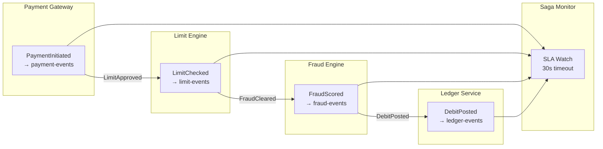

# Distributed Saga Choreography

Status: Draft | Last Reviewed: 2026-05-28 | Owner: @tech-lead-backend
Catalog ID: INT-016 | Radii
Tier Applicability: T0, T1

## Problem Statement

A payment initiation saga must coordinate four services: the payment gateway authorises the transaction, the limit engine checks the daily limit, the fraud screening service scores the transaction, and the ledger service posts the debit. In the orchestration pattern (INT-001), a central coordinator issues commands and handles rollbacks. But as the number of event-driven flows grows, every new saga adds coupling to the coordinator: the coordinator becomes a god object that knows about every business flow, every compensating transaction, every service. Teams cannot deploy their service independently without updating the coordinator. A change to the fraud scoring step requires modifying and redeploying the orchestrator — a shared, high-risk component.

Choreography is the alternative: each service listens for domain events and reacts autonomously, emitting its own events in response. There is no central coordinator. The payment gateway emits `PaymentInitiated`; the limit engine subscribes, checks the limit, and emits either `LimitApproved` or `LimitBreached`; the fraud service subscribes to `LimitApproved`, scores, and emits `FraudCleared` or `FraudBlocked`; the ledger subscribes to `FraudCleared` and posts the debit. The saga emerges from the event chain — but without discipline, it devolves into an untraceable mesh of events with no visibility into what's happening, no owner for compensating transactions, and no way to reconstruct the saga state.

## Context

The platform uses Kafka as the event bus (INT-001). The orchestration pattern (INT-001 Saga Orchestration) is the default for complex sagas with more than four steps or where compensation logic is non-trivial. Choreography is used for simpler, well-scoped flows where the event chain has at most four steps and each step has a clear compensating event. The Schema Registry (INT-013) governs all event payloads; the CloudEvents envelope (INT-011) is used for interoperability.

Choreography and orchestration are not mutually exclusive. A payment initiation flow may use choreography for the "happy path" steps and an orchestrator for the compensation logic. The key constraint that makes choreography viable is a stable, low-cardinality event graph — if the event topology changes every sprint, the implicit coupling of choreography becomes a liability.

## Solution

Each participating service subscribes to a specific domain event topic and produces a response event to a dedicated response topic. A saga correlation ID (the `paymentId`) is embedded in every event as a CloudEvents `correlationid` extension. A lightweight saga-state table (one row per active saga) is maintained in each service to enable idempotent replay and status queries. A monitoring service subscribes to all saga event topics and raises an alert when a saga has been in-flight for longer than its SLA (30 seconds for a payment initiation saga).



## Implementation Guidelines

**1. Event schemas — correlation ID convention (Avro)**

```json
{
  "type": "record",
  "name": "PaymentInitiated",
  "namespace": "com.banking.events.payment.v1",
  "fields": [
    {"name": "paymentId",       "type": "string",  "doc": "UUID v4 — saga correlation ID"},
    {"name": "accountId",       "type": "string"},
    {"name": "amountVnd",       "type": "long"},
    {"name": "currency",        "type": "string",  "default": "VND"},
    {"name": "timestamp",       "type": "long",    "doc": "Unix epoch millis"},
    {"name": "idempotencyKey",  "type": "string"}
  ]
}
```

All events in the saga chain carry `paymentId` as the correlation ID. Every CloudEvents envelope adds `X-Correlation-Id: <paymentId>` as an extension attribute.

**2. Limit engine — consume PaymentInitiated, produce LimitApproved/LimitBreached**

```java
// src/main/java/com/banking/limit/PaymentLimitListener.java
@KafkaListener(topics = "payment-events", groupId = "limit-engine-consumer")
public void onPaymentInitiated(ConsumerRecord<String, PaymentInitiated> record) {
    PaymentInitiated event = record.value();

    // Idempotency guard using saga correlation ID
    if (limitSagaRepo.alreadyProcessed(event.getPaymentId())) {
        log.info("limit.idempotent.skip paymentId={}", event.getPaymentId());
        return;
    }

    LimitCheckResult result = limitService.check(
        event.getAccountId(), event.getAmountVnd(), event.getCurrency());

    if (result.isApproved()) {
        kafkaTemplate.send("limit-events",
            LimitApproved.newBuilder()
                .setPaymentId(event.getPaymentId())
                .setAccountId(event.getAccountId())
                .setAmountVnd(event.getAmountVnd())
                .setApprovedLimitVnd(result.getAvailableLimitVnd())
                .setTimestamp(Instant.now().toEpochMilli())
                .build());
    } else {
        // Compensating event — downstream services ignore the saga after LimitBreached
        kafkaTemplate.send("limit-events",
            LimitBreached.newBuilder()
                .setPaymentId(event.getPaymentId())
                .setBreachType(result.getBreachType().name())
                .setTimestamp(Instant.now().toEpochMilli())
                .build());
    }

    limitSagaRepo.recordProcessed(event.getPaymentId(), result.isApproved() ? "LIMIT_APPROVED" : "LIMIT_BREACHED");
}
```

**3. Fraud engine — consume LimitApproved, produce FraudCleared/FraudBlocked**

```java
// src/main/java/com/banking/fraud/LimitApprovedListener.java
@KafkaListener(topics = "limit-events", groupId = "fraud-engine-consumer",
               containerFactory = "limitApprovedListenerFactory")
public void onLimitApproved(ConsumerRecord<String, LimitApproved> record) {
    LimitApproved event = record.value();

    if (fraudSagaRepo.alreadyProcessed(event.getPaymentId())) {
        return;
    }

    FraudScore score = fraudScoringService.score(event.getPaymentId(), event.getAccountId(), event.getAmountVnd());

    String outputTopic = score.isPassed() ? "fraud-events-cleared" : "fraud-events-blocked";
    kafkaTemplate.send(outputTopic,
        score.isPassed()
            ? FraudCleared.newBuilder().setPaymentId(event.getPaymentId()).setScore(score.getValue()).build()
            : FraudBlocked.newBuilder().setPaymentId(event.getPaymentId()).setScore(score.getValue()).setReason(score.getReason()).build()
    );

    fraudSagaRepo.recordProcessed(event.getPaymentId(), score.isPassed() ? "FRAUD_CLEARED" : "FRAUD_BLOCKED");
}
```

**4. Saga monitor — SLA alerting**

```java
// src/main/java/com/banking/sagamonitor/PaymentSagaMonitor.java
@Scheduled(fixedDelay = 5000)
public void checkSlaBreaches() {
    Instant cutoff = Instant.now().minusSeconds(30);
    List<String> staleSagas = sagaMonitorRepo.findInitiatedBefore(cutoff, "payment-saga");
    for (String paymentId : staleSagas) {
        log.error("saga.sla.breach paymentId={} type=payment-saga threshold=30s", paymentId);
        meterRegistry.counter("saga.sla.breach", "type", "payment-saga").increment();
    }
}
```

```yaml
# prometheus/rules/saga-choreography.yml
groups:
  - name: saga_choreography
    rules:
      - alert: PaymentSagaSLABreach
        expr: increase(saga_sla_breach_total{type="payment-saga"}[5m]) > 0
        for: 1m
        labels:
          severity: critical
        annotations:
          summary: "Payment saga has not completed within 30-second SLA"

      - alert: SagaCompensationTriggered
        expr: increase(saga_compensation_total[5m]) > 0
        for: 1m
        labels:
          severity: warning
        annotations:
          summary: "Saga compensation event emitted — business flow rolled back"
```

## When to Use

- Payment initiation flows with 3–4 services where each service's decision is independent and does not require the coordinator's state
- When services need to be independently deployable without touching a central coordinator
- When the event graph is stable (does not change more than once per quarter) — choreography's implicit coupling is acceptable with a stable topology
- When the compensation logic is simple: each service compensates itself by emitting a reversal event (not a multi-step rollback chain)

## When Not to Use

- Sagas with more than 4 steps — the event graph becomes unmanageable; use INT-001 orchestration
- When compensation logic requires sequential rollback (service A must compensate before service B can compensate) — choreography cannot enforce ordering
- When debugging production incidents requires reconstructing the saga state — without a central state store, diagnosing a stuck saga requires correlating events across multiple Kafka topics and multiple service logs
- New teams unfamiliar with Kafka consumer group semantics — the implicit coupling and lack of a state machine make choreography harder to reason about than orchestration

## Variants

| Variant | When to prefer | Trade-off |
|---------|----------------|-----------|
| Choreography with saga-state table per service (this pattern) | Each service maintains its own local state; resilient to partial failures | Each service needs its own saga-state table and idempotency logic |
| Choreography with central event journal | Central Kafka topic records every saga event; replay is possible | Central topic becomes a bottleneck; single point of failure for saga visibility |
| Hybrid choreography + orchestration | Happy path is choreographed; error/compensation handled by orchestrator | More complex deployment; two patterns to maintain |
| Pure orchestration (INT-001) | Saga has >4 steps or complex compensation | Central coordinator is a scaling bottleneck but simpler to reason about |

## NFR Acceptance Criteria

```yaml
nfr_acceptance_criteria:
  catalog_id: INT-016
  pattern: Distributed Saga Choreography
  performance:
    - id: INT-016-HP-01
      description: End-to-end saga completion (PaymentInitiated → DebitPosted) must complete within 2 seconds at p99 under normal load.
      threshold: saga_e2e_p99 < 2s
    - id: INT-016-HP-02
      description: Each individual saga step (Kafka consumer processing) must complete within 200ms at p99.
      threshold: saga_step_p99 < 200ms
  reliability:
    - id: INT-016-REL-01
      description: Every saga step must be idempotent — replaying a Kafka message must produce the same outcome without duplicate business effects.
      threshold: duplicate_saga_effects = 0
    - id: INT-016-REL-02
      description: Saga SLA breach alert must fire within 60 seconds of a saga exceeding the 30-second SLA.
      threshold: sla_alert_lag < 60s
  compliance:
    - id: INT-016-COMP-01
      description: Every saga step (success and compensation) must be logged with paymentId, step name, outcome, and timestamp for audit evidence.
      threshold: 0 unlogged saga steps
```

## Compliance Mapping

| Ring | Regulation | Provision | How this pattern satisfies |
|------|-----------|-----------|---------------------------|
| Ring 0 | Enterprise Integration Patterns (Hohpe/Woolf) | Choreography pattern: services react to events autonomously with no central controller; correlation ID links events across service boundaries | Correlation ID (`paymentId`) in every event; per-service saga-state table enables idempotent replay; saga monitor provides the visibility that choreography lacks natively |
| Ring 1 | BCBS 239 | Principle 6 — risk data must be traceable end-to-end across aggregation systems | Every saga step is logged with the correlation ID, service name, step outcome, and timestamp; the saga event chain constitutes an immutable audit trail from `PaymentInitiated` to `DebitPosted` across all four services |
| Ring 2 | SBV Circular 09/2020 | §IV.2 — inter-system transaction integrity: each step of a multi-system financial transaction must be auditable and recoverable | Saga-state table per service records processed events; compensation events (LimitBreached, FraudBlocked) propagate rollback intent; the saga monitor detects and alerts on SLA breaches before customers are impacted ⚠️ (working summary — pending Legal review) |

## Cost / FinOps Notes

- No additional infrastructure beyond Kafka and existing service databases — each service adds a `saga_state` table (small: one row per active saga, purge after 24h)
- Saga monitor: 1 pod at 0.1 CPU / 128 MB RAM — negligible
- Additional Kafka topics per saga (limit-events, fraud-events-cleared, fraud-events-blocked): each compacted topic is ~1 GB/day at high volume; standard Kafka storage cost
- No central coordinator to scale or provision — choreography's compute cost is distributed across existing service replicas

## Threat Model

**Event Injection — attacker publishes a forged `LimitApproved` event to bypass limit checking (Tampering)**: an attacker who gains write access to the `limit-events` Kafka topic publishes a `LimitApproved` event for a payment that was never initiated. The fraud engine and ledger service process the fabricated event, posting an unauthorized debit. Mitigation: Kafka topic ACLs (SEC-010) restrict the `limit-events` topic to the limit-engine service account for writes; no other service account has producer access; the ledger service cross-checks the `paymentId` against the `payment_gateway` outbox before posting — if the payment was not initiated by the gateway, the ledger rejects the debit and logs a security alert.

**Saga Replay Attack — replaying a captured `FraudCleared` event to re-authorize a previously blocked payment (Repudiation)**: an attacker captures a legitimate `FraudCleared` event for a completed payment and re-publishes it to the `fraud-events-cleared` topic. Without idempotency, the ledger service would post a second debit against the same payment ID. Mitigation: the `paymentId` idempotency check in each service's saga-state table ensures that a payment ID is processed exactly once; the saga-state table records the terminal state (`DEBIT_POSTED`) and any subsequent event with the same `paymentId` is ignored; idempotency table entries are retained for 48 hours beyond the saga SLA.

## Operational Runbook (stub)

1. Alert: PaymentSagaSLABreach — fires when a payment saga has not reached a terminal state within 30 seconds. p50 resolution: 5 min; p99: 30 min. Identify the stuck saga: `SELECT payment_id, step, status, created_at FROM saga_state WHERE payment_id = '<paymentId>';` across each service database. Common causes: Kafka consumer lag spike (check consumer group lag with `kafka-consumer-groups.sh --describe --group limit-engine-consumer`), a service pod crash-looped mid-processing (check pod events with `kubectl describe pod -n payments -l app=limit-engine`), a deadlock in the saga-state table (check `pg_locks` for the offending transaction). For stuck sagas, determine the last completed step and manually emit the compensating event if the payment must be reversed, or restart the consumer pod if the issue is transient.

2. Alert: SagaCompensationTriggered — fires when a compensation event (LimitBreached or FraudBlocked) is emitted. p50 resolution: 10 min; p99: 2 hours. Compensation is a normal business outcome (limit exceeded, fraud detected), not necessarily an error. Verify the compensation is expected: check the `paymentId` in the risk dashboard. If the compensation rate exceeds the baseline (>5% of initiations in a 5-minute window), escalate to the fraud team — a systematic fraud attack may be triggering fraud blocks at scale.

## Test Strategy

**Unit**: `PaymentLimitListenerTest` — mock the `limitService` and `kafkaTemplate`; send a `PaymentInitiated` event; assert `LimitApproved` is produced to `limit-events`; send the same event again with the same `paymentId`; assert no second Kafka message is produced (idempotency); mock `limitService` to return a breached result; assert `LimitBreached` is produced and no `LimitApproved` is sent.

**Integration**: Use Testcontainers (Kafka + 4 service databases); deploy all four saga services; publish `PaymentInitiated` to `payment-events`; consume `DebitPosted` from `ledger-events`; assert the saga completes end-to-end within 5 seconds with the correct `paymentId`; publish the same `PaymentInitiated` again (duplicate); assert the ledger does NOT post a second debit (idempotency); simulate fraud block by seeding a high-risk account; assert `FraudBlocked` is produced and no `DebitPosted` event follows.

**Contract**: For each event type, write a Pact message contract (INT-015 pattern) that validates the Avro schema matches the consumer's expectation; assert that each consumer's listener can deserialise the event using the schema registry (INT-013).

**Chaos**: Kill the fraud engine pod after `LimitApproved` is published but before `FraudCleared` is produced; assert the payment saga SLA alert fires within 60 seconds; restore the fraud engine pod; assert it replays the uncommitted `LimitApproved` event from Kafka and completes the saga.

## Related Patterns

- [INT-001 Saga Orchestration](saga-orchestration.md) — orchestration is the preferred pattern for sagas with >4 steps or complex compensation; choreography is used for simpler, stable flows
- [INT-011 CloudEvents Envelope](cloudevents-envelope.md) — all choreography events use CloudEvents with the `paymentId` as the `correlationid` extension
- [INT-013 Schema Registry Governance](schema-registry-governance.md) — all choreography event schemas are registered and governed in the Confluent Schema Registry
- [RES-004 Graceful Degradation](../resilience/graceful-degradation.md) — each saga participant implements graceful degradation; if the fraud engine is in MINIMAL mode, the payment gateway falls back to synchronous fraud scoring rather than waiting for the choreography event
- [OBS-008 Log Aggregation Pipeline](../observability/log-aggregation-pipeline.md) — all saga step events are shipped to OpenSearch with the `paymentId` correlation ID to enable end-to-end saga trace reconstruction

## References

- Hohpe & Woolf — Enterprise Integration Patterns: Process Manager and Saga patterns
- Chris Richardson — Microservices Patterns: Chapter 4 (Managing Transactions with Sagas)
- Bernd Rücker — Practical Process Automation (choreography vs orchestration trade-offs)
- BCBS 239 — Principles for Effective Risk Data Aggregation (audit trail requirements)
- SBV Circular 09/2020 §IV.2 — inter-system transaction integrity

---
**Key Takeaway**: Use choreography for payment sagas with 3–4 steps by embedding a correlation ID in every event, maintaining a per-service idempotency table, and running a saga monitor that alerts when any saga exceeds its 30-second SLA — so the emergent saga flow is observable and compensable without a central coordinator.
