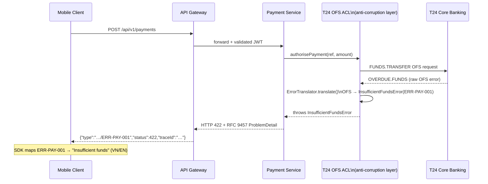

# Error Code Mapping and Propagation

Status: Draft | Last Reviewed: 2026-05-10 | Owner: @tech-lead-backend
Catalog ID: INT-012 | Radii
Tier Applicability: T0, T1, T2

## Problem Statement

Raw upstream error codes surface to clients and create multiple failure classes:
- T24 OFS strings (`OVERDUE.FUNDS`, `INVALID.ACCOUNT`) appear verbatim in mobile error responses — unintelligible to users and exposes internal system details
- HTTP 500 returned for business errors (insufficient funds) — clients cannot distinguish transient from permanent failures
- No consistent HTTP status codes: one service returns 400 for account not found; another returns 404
- gRPC clients receive `Status.UNKNOWN` for every error — no actionable information
- Mobile SDK must handle different error schemas from different services
- Debugging P1 incidents requires translating raw T24 codes without a reference — engineers google OFS error codes under pressure

## Solution

Define a three-tier error translation architecture: raw upstream codes → domain error classes → client-facing RFC 9457 Problem Details. Each anti-corruption layer (ACL) implements a typed `ErrorTranslator` interface. All protocols receive consistent, stable `ERR-{DOMAIN}-{CODE}` codes.



## Implementation Guidelines

### 1. Error Taxonomy — `ERR-{DOMAIN}-{CODE}` Format

| Prefix | Domain | Scope |
|---|---|---|
| `ERR-PAY-*` | Payment processing | T24 FUNDS.TRANSFER, NAPAS IBFT, card payment flows |
| `ERR-ACC-*` | Account management | Account lookup, balance, account status |
| `ERR-KYC-*` | KYC / identity verification | Identity check, document validation, biometric |
| `ERR-FRD-*` | Fraud / risk decisions | Fraud engine decline, velocity limit, AML block |
| `ERR-SYS-*` | Infrastructure / platform | Upstream timeout, circuit breaker open, parse failure |

**Code uniqueness**: codes are assigned sequentially and never reused. A retired code is documented with `[DEPRECATED]` in the catalogue.

### 2. Three-Tier Translation Table

| T24 OFS / NAPAS raw | Domain error class | HTTP status | Error code | gRPC status |
|---|---|---|---|---|
| `OVERDUE.FUNDS` | `InsufficientFundsError` | 422 | ERR-PAY-001 | FAILED_PRECONDITION |
| `INVALID.ACCOUNT` | `AccountNotFoundError` | 404 | ERR-ACC-001 | NOT_FOUND |
| `NO.SUCH.ACCOUNT` | `AccountNotFoundError` | 404 | ERR-ACC-001 | NOT_FOUND |
| `ACCOUNT.FROZEN` | `AccountFrozenError` | 422 | ERR-ACC-002 | FAILED_PRECONDITION |
| `DAILY.LIMIT.EXCEEDED` | `DailyLimitExceededError` | 422 | ERR-ACC-003 | FAILED_PRECONDITION |
| NAPAS timeout | `PaymentGatewayTimeoutError` | 503 | ERR-PAY-002 | UNAVAILABLE |
| NAPAS `TRAN-DECLINED` | `TransactionDeclinedError` | 422 | ERR-FRD-001 | PERMISSION_DENIED |
| NAPAS `DUP-TRAN` | `DuplicateTransactionError` | 409 | ERR-PAY-003 | ALREADY_EXISTS |
| Fraud engine DECLINE | `TransactionDeclinedError` | 422 | ERR-FRD-001 | PERMISSION_DENIED |
| Velocity limit | `VelocityLimitExceededError` | 422 | ERR-FRD-002 | FAILED_PRECONDITION |
| OFS parse failure | `UpstreamProtocolError` | 502 | ERR-SYS-001 | INTERNAL |
| Circuit breaker OPEN | `ServiceUnavailableError` | 503 | ERR-SYS-002 | UNAVAILABLE |

### 3. Domain Error Class Hierarchy

```java
// Base class — all domain errors extend this
public abstract class DomainError extends RuntimeException {

  private final String code;      // ERR-PAY-001, ERR-ACC-001, etc.
  private final String title;     // Human-readable short title (English)
  private final HttpStatus httpStatus;
  private final Status grpcStatus;

  protected DomainError(String code, String title,
                          HttpStatus httpStatus, Status grpcStatus, String detail) {
    super(detail);
    this.code = code;
    this.title = title;
    this.httpStatus = httpStatus;
    this.grpcStatus = grpcStatus;
  }

  // Getters omitted for brevity
}

public class InsufficientFundsError extends DomainError {
  public InsufficientFundsError(String detail) {
    super("ERR-PAY-001", "Insufficient Funds",
        HttpStatus.UNPROCESSABLE_ENTITY, Status.FAILED_PRECONDITION, detail);
  }
}

public class AccountNotFoundError extends DomainError {
  public AccountNotFoundError(String accountRef) {
    super("ERR-ACC-001", "Account Not Found",
        HttpStatus.NOT_FOUND, Status.NOT_FOUND,
        "No account found matching reference: " + accountRef);
  }
}

public class PaymentGatewayTimeoutError extends DomainError {
  public PaymentGatewayTimeoutError(String upstream) {
    super("ERR-PAY-002", "Payment Gateway Timeout",
        HttpStatus.SERVICE_UNAVAILABLE, Status.UNAVAILABLE,
        "Upstream " + upstream + " did not respond within the timeout budget.");
  }
}

public class UpstreamProtocolError extends DomainError {
  public UpstreamProtocolError(String upstream, String rawError) {
    super("ERR-SYS-001", "Upstream Protocol Error",
        HttpStatus.BAD_GATEWAY, Status.INTERNAL,
        "Upstream " + upstream + " returned an unrecognised error.");
    // rawError logged at WARN level internally — never propagated to client
  }
}
```

### 4. ErrorTranslator Interface — ACL Pattern

Each anti-corruption layer implements `ErrorTranslator`. This enforces an explicit, tested translation at every integration boundary.

```java
@FunctionalInterface
public interface ErrorTranslator<R, D extends DomainError> {
  D translate(R rawError);
}

// T24 OFS ACL implementation
@Component
public class T24OfsErrorTranslator implements ErrorTranslator<OfsException, DomainError> {

  private static final Map<String, Function<OfsException, DomainError>> OFS_MAP = Map.of(
      "OVERDUE.FUNDS",       e -> new InsufficientFundsError(e.getMessage()),
      "INVALID.ACCOUNT",     e -> new AccountNotFoundError(e.getAccountRef()),
      "NO.SUCH.ACCOUNT",     e -> new AccountNotFoundError(e.getAccountRef()),
      "ACCOUNT.FROZEN",      e -> new AccountFrozenError(e.getAccountRef()),
      "DAILY.LIMIT.EXCEEDED",e -> new DailyLimitExceededError(e.getMessage())
  );

  @Override
  public DomainError translate(OfsException raw) {
    Function<OfsException, DomainError> mapper = OFS_MAP.get(raw.getOfsErrorCode());
    if (mapper != null) return mapper.apply(raw);

    // Unknown OFS code — log for triage, return generic system error
    log.warn("Unknown T24 OFS error code: {} for function: {}",
        raw.getOfsErrorCode(), raw.getOfsFunction());
    return new UpstreamProtocolError("T24-OFS", raw.getOfsErrorCode());
  }
}

// NAPAS ACL implementation
@Component
public class NapasErrorTranslator implements ErrorTranslator<NapasException, DomainError> {

  @Override
  public DomainError translate(NapasException raw) {
    return switch (raw.getResponseCode()) {
      case "TRAN-DECLINED"  -> new TransactionDeclinedError(raw.getDeclineReason());
      case "DUP-TRAN"       -> new DuplicateTransactionError(raw.getRrn());
      case "TIMEOUT"        -> new PaymentGatewayTimeoutError("NAPAS");
      default               -> new UpstreamProtocolError("NAPAS", raw.getResponseCode());
    };
  }
}
```

### 5. HTTP — RFC 9457 Problem Details

Spring 6 / Spring Boot 3 provides `ProblemDetail` built-in. Configure the global exception handler:

```java
@RestControllerAdvice
public class TechcombankExceptionHandler extends ResponseEntityExceptionHandler {

  @ExceptionHandler(DomainError.class)
  public ResponseEntity<ProblemDetail> handleDomainError(
      DomainError error, HttpServletRequest request) {

    ProblemDetail problem = ProblemDetail.forStatus(error.getHttpStatus());
    problem.setType(URI.create("https://errors.techcombank.com/" + error.getCode()));
    problem.setTitle(error.getTitle());
    problem.setDetail(error.getMessage());
    problem.setInstance(URI.create(request.getRequestURI()));
    problem.setProperty("errorCode", error.getCode());
    problem.setProperty("traceId", MDC.get("traceId"));

    // Client errors (4xx) logged at INFO; server errors (5xx) at ERROR
    if (error.getHttpStatus().is5xxServerError()) {
      log.error("Server error [{}]: {}", error.getCode(), error.getMessage());
    } else {
      log.info("Client error [{}]: {}", error.getCode(), error.getMessage());
    }

    return ResponseEntity.status(error.getHttpStatus()).body(problem);
  }
}
```

**RFC 9457 wire format** — exactly this structure for all HTTP error responses:

```json
{
  "type": "https://errors.techcombank.com/ERR-PAY-001",
  "title": "Insufficient Funds",
  "status": 422,
  "detail": "Account balance is insufficient for this transaction. Available: 50,000 VND.",
  "instance": "/api/v1/payments/TXN-2026-001234",
  "errorCode": "ERR-PAY-001",
  "traceId": "4bf92f3577b34da6a3ce929d0e0e4736"
}
```

**Rules:**
- `type` URI resolves to a human-readable error description page at `errors.techcombank.com`
- `detail` must not include raw OFS/NAPAS codes, stack traces, or internal hostnames
- `traceId` links the error to the distributed trace (OBS-001) for SRE root-cause analysis

### 6. gRPC — Status + ErrorInfo

```java
@GrpcServiceAdvice
public class TechcombankGrpcExceptionHandler {

  @GrpcExceptionHandler(InsufficientFundsError.class)
  public Status handleInsufficientFunds(InsufficientFundsError error) {
    ErrorInfo errorInfo = ErrorInfo.newBuilder()
        .setReason(error.getCode())
        .setDomain("techcombank.com")
        .putMetadata("title", error.getTitle())
        .putMetadata("traceId", MDC.get("traceId"))
        .build();

    return Status.FAILED_PRECONDITION
        .withDescription(error.getCode() + ": " + error.getMessage())
        .withCause(error);
  }

  @GrpcExceptionHandler(AccountNotFoundError.class)
  public Status handleAccountNotFound(AccountNotFoundError error) {
    return Status.NOT_FOUND
        .withDescription(error.getCode() + ": " + error.getMessage());
  }

  @GrpcExceptionHandler(DomainError.class)
  public Status handleGenericDomainError(DomainError error) {
    return error.getGrpcStatus()
        .withDescription(error.getCode() + ": " + error.getMessage());
  }
}
```

### 7. WebSocket / STOMP Error Propagation

```java
// STOMP ERROR frame with error-code header
@MessageExceptionHandler(DomainError.class)
public void handleDomainError(DomainError error, SimpMessageHeaderAccessor accessor) {
  SimpMessagingTemplate template = ...;
  template.convertAndSendToUser(
      accessor.getUser().getName(),
      "/queue/errors",
      ErrorResponse.of(error.getCode(), error.getTitle(), error.getMessage()),
      Map.of(
          "error-code", error.getCode(),
          "content-type", "application/json"
      )
  );
}
```

### 8. Async / CloudEvents Error Envelope

For failed Kafka event processing, route to DLQ with a CloudEvents error envelope:

```java
// Consumer error handler — routes to DLQ with error envelope
@KafkaListener(topics = "techcombank.payments.transaction.created.v1")
public void handleWithDlq(@Payload CloudEvent event, Acknowledgment ack) {
  try {
    processEvent(event);
    ack.acknowledge();
  } catch (DomainError error) {
    CloudEvent errorEvent = CloudEventBuilder.v1()
        .withId(UUID.randomUUID().toString())
        .withSource(URI.create("/techcombank/payments/consumer"))
        .withType("com.techcombank.payments.transaction.processing.failed")
        .withTime(OffsetDateTime.now(ZoneOffset.UTC))
        .withExtension("techcombankcorrelationid",
            Objects.toString(event.getExtension("techcombankcorrelationid"), ""))
        .withExtension("dataerror", error.getCode())
        .withData(objectMapper.writeValueAsBytes(Map.of(
            "originalEventId", event.getId(),
            "errorCode", error.getCode(),
            "errorMessage", error.getMessage()
        )))
        .build();
    dlqTemplate.send("techcombank.payments.transaction.created-dlq", errorEvent);
  }
}
```

### 9. Protocol Coverage Summary

| Protocol | Error representation | Format / Standard |
|---|---|---|
| HTTP / HTTPS | `ProblemDetail` with `type`, `title`, `status`, `detail` | RFC 9457 |
| gRPC | `Status` code + `description` with `ERR-*` prefix | gRPC Status + `google.rpc.ErrorInfo` |
| WebSocket / STOMP | STOMP ERROR frame; `/queue/errors` with JSON body | STOMP 1.2 |
| Kafka / async | CloudEvents with `dataerror` extension; DLQ routing | INT-011 CloudEvents |

### 10. Mobile Client Contract

Error codes are stable across API versions — the error catalogue is versioned independently:
- `errors.techcombank.com/catalogue.json` — machine-readable catalogue in JSON
- Mobile SDKs (iOS Swift, Android Kotlin) map `ERR-*` codes to localised user messages
- New error codes are additive only; no existing code changes meaning
- Deprecated codes retain their meaning for 2 API versions before removal

## NFR Acceptance Criteria

- **Zero raw OFS/NAPAS codes in HTTP responses**: integration test asserts HTTP error bodies never contain `OVERDUE.FUNDS`, `INVALID.ACCOUNT`, `TRAN-DECLINED`, or similar OFS/NAPAS strings.
- **`ERR-*` in 100% of 4xx/5xx responses**: CI integration test asserts `errorCode` field present in every non-2xx HTTP response.
- **No stack traces in error responses**: integration test asserts `detail` field does not contain `java.` or `org.springframework.`.
- **HTTP status code correctness**: ArchUnit test asserts no `DomainError` subclass uses `HttpStatus.INTERNAL_SERVER_ERROR` for business errors.
- **gRPC error codes mapped**: every `DomainError` subclass has a non-null `grpcStatus` — enforced by abstract method.

## Compliance Mapping

| Layer | Reference | Section/Control | How this satisfies |
|---|---|---|---|
| Ring 0 (generic) | RFC 9457 Problem Details for HTTP APIs | Full spec compliance | Standard error response format across all HTTP APIs |
| Ring 0 (generic) | OWASP Error Handling (A05:2021) | Don't expose internal details in error messages | `UpstreamProtocolError` hides raw OFS codes; stack traces never serialised |
| Ring 1 (intl banking) | PCI-DSS v4.0 §6.5 | Secure coding: error handling must not leak system information | `detail` field reviewed in code review; CI test verifies no internal strings |
| Ring 1 (intl banking) | BCBS 239 §6 Accuracy | Accurate error information for operational decisions | `ERR-*` codes enable accurate error classification and SLO measurement |
| Ring 2 (Vietnam) | SBV Circular 09/2020 §IV.3 ⚠️ (working summary — pending Legal review) | IT system security — information disclosure prevention | RFC 9457 `type` URI is publicly documented but reveals no internal architecture |

## Cost / FinOps Notes

| Item | Driver | Order of magnitude |
|---|---|---|
| Spring 6 `ProblemDetail` | Included in Spring Boot 3.x | $0 |
| Error catalogue hosting | `errors.techcombank.com` static site | ~$5/month (S3 + CloudFront) |
| Redis deduplication cache | Reuses OBS-001 / INT-011 cache instance | No additional cost |

## Threat Model Summary

STRIDE focus: **Information Disclosure** (internal details in error responses) and **Tampering** (error code injection).

- **Top 3 threats addressed**:
  1. *Internal OFS codes leaked to mobile clients* — `ErrorTranslator` always maps to domain error; `UpstreamProtocolError` logs raw code internally but never propagates it.
  2. *Stack trace in JSON error response* — global `TechcombankExceptionHandler` catches all `Throwable`; `detail` field built from `DomainError.getMessage()` only (no `getCause()` chain).
  3. *Error code inconsistency across services* — `DomainError` hierarchy shared via common library `techcombank-domain-errors`; all services import same codes.
- **Top 3 residual threats**:
  1. *New OFS error code not in translator map* — returns `ERR-SYS-001` + WARN log with raw code; on-call adds mapping in next sprint. Risk: client sees generic error instead of specific message.
  2. *Error catalogue out of date* — mitigation: `errors.techcombank.com/catalogue.json` generated automatically from `DomainError` class hierarchy in CI; deployed on every common-library release.
  3. *gRPC client receives unhandled `DomainError` subclass* — mitigation: catch-all `@GrpcExceptionHandler(DomainError.class)` in handler ensures every subclass is mapped.

## Operational Runbook (stub)

**New T24 OFS error code encountered (unknown):**
1. Alert: `warn` log `Unknown T24 OFS error code: {code}` — sent to `#sre-ofs-errors` Slack channel via Fluent Bit alert rule.
2. On-call opens Jira ticket: "Add OFS error mapping for {code}".
3. Engineer adds mapping to `T24OfsErrorTranslator` + updates error catalogue.
4. PR merged; `techcombank-domain-errors` library patch release; services update dependency.

**Error catalogue update process:**
1. Add new `DomainError` subclass to common library.
2. CI auto-generates catalogue JSON from class annotations.
3. Deploy to `errors.techcombank.com` via GitLab CD pipeline.
4. Notify mobile SDK teams; they update localisation strings.

## Test Strategy (stub)

- **Unit**: `T24OfsErrorTranslator` — assert each known OFS code maps to correct domain error class with correct HTTP status and `ERR-*` code; assert unknown code returns `UpstreamProtocolError`.
- **Unit**: `TechcombankExceptionHandler` — assert `InsufficientFundsError` produces HTTP 422 with `type=…ERR-PAY-001`; assert `detail` does not contain `OVERDUE.FUNDS`.
- **Integration**: HTTP integration test — trigger OFS `OVERDUE.FUNDS` via mocked T24 ACL; assert response is RFC 9457 JSON with `errorCode=ERR-PAY-001`; assert no OFS string in response body; assert `traceId` present.
- **gRPC integration**: invoke payment gRPC method with insufficient funds condition; assert `Status.FAILED_PRECONDITION` returned with description containing `ERR-PAY-001`.
- **No stack trace**: `grep -r "java\." integration-test-logs/` in CI; fail if found in any HTTP error response body.

## Related Patterns

- [INT-001 SAGA Orchestration](saga-orchestration.md) — compensation steps triggered by domain errors
- [INT-011 CloudEvents Envelope Standard](cloudevents-envelope.md) — `dataerror` extension in failed CloudEvents
- [OBS-002 Distributed Trace Propagation](../observability/distributed-trace-propagation.md) — `traceId` in error body links to trace
- [OBS-003 Structured Logging Standard](../observability/structured-logging-standard.md) — raw OFS codes logged at WARN (internal); `ERR-*` codes in structured log fields
- [RES-002 Circuit Breaker](../resilience/circuit-breaker.md) — CB open → `ERR-SYS-002 ServiceUnavailableError`
- [PRIN-006 Idempotency-by-Default](../../principles/idempotency-by-default.md) — `ERR-PAY-003 DuplicateTransaction` uses idempotency key for detection

## References

- [RFC 9457 Problem Details for HTTP APIs](https://www.rfc-editor.org/rfc/rfc9457)
- [Spring ProblemDetail (Spring 6)](https://docs.spring.io/spring-framework/docs/current/javadoc-api/org/springframework/http/ProblemDetail.html)
- [gRPC Status Codes](https://grpc.github.io/grpc/core/md_doc_statuscodes.html)
- [OWASP Error Handling Cheat Sheet](https://cheatsheetseries.owasp.org/cheatsheets/Error_Handling_Cheat_Sheet.html)

---

**Key Takeaway**: Every integration boundary (T24 OFS ACL, NAPAS ACL) must implement `ErrorTranslator` — raw upstream codes never escape the ACL layer. All HTTP errors use RFC 9457 Problem Details with `ERR-{DOMAIN}-{CODE}` stable codes. gRPC maps to correct `Status` codes. Never include stack traces, raw OFS strings, or internal hostnames in any client-facing error response. Include `traceId` in all error responses for SRE root-cause analysis.
