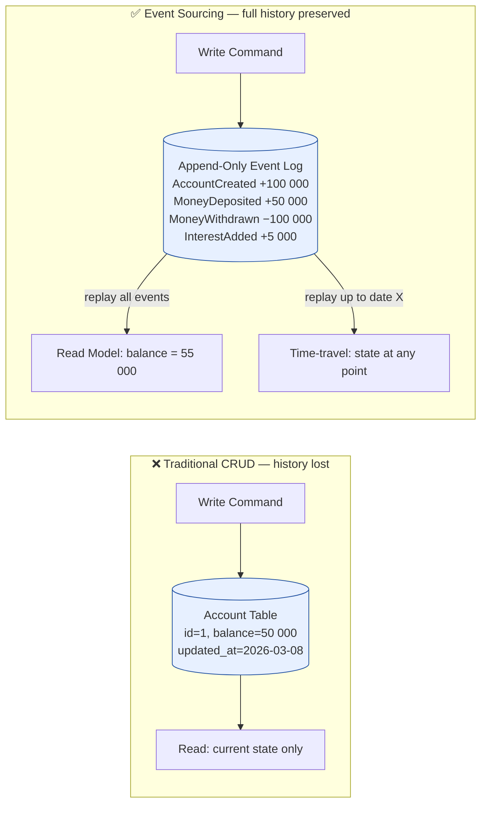

# Event Sourcing Pattern

Status: Approved | Last Reviewed: 2026-02-15 | Owner: @ea-board
Catalog ID: INT-004 | Radii
Tier Applicability: T0, T1

## Problem Statement

Traditional CRUD applications lose historical context:
- Current state is the only source of truth; history is lost
- Cannot audit "why" state changed or "when"
- Difficult to debug issues (no event trail)
- Cannot replay events to reconstruct state at any point in time
- Compliance requires audit trail of all changes
- Adding new features requires reconstructing historical data

## Solution

Store events (immutable log of state changes) as the source of truth. Derive current state by replaying events.



## Implementation Guidelines

1. **Define Events**
   - Immutable: never modify, only append new events
   - Domain-driven: events represent business occurrences
   - Complete: include all relevant data
   - Versioned: for schema evolution
   ```json
   {
     "eventId": "evt_abc123",
     "eventType": "AccountCreated",
     "aggregateId": "acc_xyz",
     "version": 1,
     "timestamp": "2026-03-01T10:00:00Z",
     "data": {
       "customerId": "cust_456",
       "initialBalance": 100000,
       "currency": "VND"
     }
   }
   ```

2. **Event Store (Append-Only Log)**
   ```sql
   CREATE TABLE account_events (
     event_id BIGINT PRIMARY KEY AUTO_INCREMENT,
     aggregate_id VARCHAR(255) NOT NULL,
     aggregate_type VARCHAR(100) NOT NULL,
     event_type VARCHAR(100) NOT NULL,
     event_version INT NOT NULL,
     payload JSON NOT NULL,
     metadata JSON,
     created_at TIMESTAMP DEFAULT CURRENT_TIMESTAMP,
     INDEX idx_aggregate (aggregate_type, aggregate_id),
     INDEX idx_timestamp (created_at)
   );

   CREATE TABLE event_snapshots (
     aggregate_id VARCHAR(255) PRIMARY KEY,
     aggregate_type VARCHAR(100),
     version INT,
     state JSON,
     created_at TIMESTAMP
   );
   ```

3. **Event Handler (Java Example)**
   ```java
   @Service
   public class AccountAggregateRoot {

     private String accountId;
     private BigDecimal balance;
     private List<DomainEvent> changes = new ArrayList<>();
     private int version = 0;

     // Command: Open Account
     public void openAccount(String customerId, BigDecimal initialBalance) {
       AccountOpenedEvent event = new AccountOpenedEvent(
         UUID.randomUUID().toString(),
         customerId,
         initialBalance
       );
       applyEvent(event);
       changes.add(event);
     }

     // Command: Deposit Money
     public void deposit(BigDecimal amount) {
       if (amount.compareTo(BigDecimal.ZERO) <= 0) {
         throw new InvalidAmountException("Amount must be positive");
       }
       MoneyDepositedEvent event = new MoneyDepositedEvent(
         accountId,
         amount,
         balance.add(amount)
       );
       applyEvent(event);
       changes.add(event);
     }

     // Command: Withdraw Money
     public void withdraw(BigDecimal amount) {
       if (amount.compareTo(balance) > 0) {
         throw new InsufficientFundsException("Not enough balance");
       }
       MoneyWithdrawnEvent event = new MoneyWithdrawnEvent(
         accountId,
         amount,
         balance.subtract(amount)
       );
       applyEvent(event);
       changes.add(event);
     }

     // Event Handler: Apply event to state
     private void applyEvent(DomainEvent event) {
       if (event instanceof AccountOpenedEvent) {
         AccountOpenedEvent e = (AccountOpenedEvent) event;
         this.accountId = e.getAccountId();
         this.balance = e.getInitialBalance();
       } else if (event instanceof MoneyDepositedEvent) {
         MoneyDepositedEvent e = (MoneyDepositedEvent) event;
         this.balance = e.getNewBalance();
       } else if (event instanceof MoneyWithdrawnEvent) {
         MoneyWithdrawnEvent e = (MoneyWithdrawnEvent) event;
         this.balance = e.getNewBalance();
       }
       version++;
     }

     // Replay events to reconstruct state
     public void loadFromHistory(List<DomainEvent> events) {
       for (DomainEvent event : events) {
         applyEvent(event);
       }
     }

     public List<DomainEvent> getUncommittedChanges() {
       return new ArrayList<>(changes);
     }

     public void markChangesAsCommitted() {
       changes.clear();
     }
   }
   ```

4. **Event Repository (Persist & Query)**
   ```java
   @Service
   public class EventStore {

     @Autowired
     private EventRepository eventRepository;
     @Autowired
     private SnapshotRepository snapshotRepository;

     public void saveEvents(String aggregateId, List<DomainEvent> events) {
       for (DomainEvent event : events) {
         EventEntity entity = new EventEntity();
         entity.setAggregateId(aggregateId);
         entity.setEventType(event.getClass().getSimpleName());
         entity.setPayload(objectMapper.writeValueAsString(event));
         entity.setCreatedAt(Instant.now());
         eventRepository.save(entity);
       }
     }

     public List<DomainEvent> loadEvents(String aggregateId) {
       // Try snapshot first
       Optional<Snapshot> snapshot = snapshotRepository.findById(aggregateId);
       int fromVersion = 0;
       AccountAggregateRoot account = new AccountAggregateRoot();

       if (snapshot.isPresent()) {
         // Load from snapshot
         account.loadFromSnapshot(snapshot.get());
         fromVersion = snapshot.get().getVersion();
       }

       // Load remaining events after snapshot
       List<EventEntity> events = eventRepository.findByAggregateIdAndVersionGreaterThan(
         aggregateId, fromVersion
       );

       for (EventEntity entity : events) {
         DomainEvent event = objectMapper.readValue(
           entity.getPayload(),
           Class.forName(entity.getEventType())
         );
         account.applyEvent(event);
       }

       return events.stream()
         .map(e -> objectMapper.readValue(e.getPayload(), DomainEvent.class))
         .collect(Collectors.toList());
     }

     public void createSnapshot(String aggregateId, AccountAggregateRoot aggregate) {
       // Create snapshot every 100 events for performance
       List<EventEntity> events = eventRepository.findByAggregateId(aggregateId);
       if (events.size() % 100 == 0) {
         Snapshot snapshot = new Snapshot();
         snapshot.setAggregateId(aggregateId);
         snapshot.setVersion(aggregate.getVersion());
         snapshot.setState(objectMapper.writeValueAsString(aggregate));
         snapshotRepository.save(snapshot);
       }
     }
   }
   ```

5. **Projections (Read Model)**
   ```java
   @Component
   public class AccountProjection {

     @Autowired
     private AccountReadModelRepository readRepository;

     @EventListener
     public void onAccountOpened(AccountOpenedEvent event) {
       AccountReadModel model = new AccountReadModel();
       model.setAccountId(event.getAccountId());
       model.setBalance(event.getInitialBalance());
       model.setCustomerId(event.getCustomerId());
       readRepository.save(model);
     }

     @EventListener
     public void onMoneyDeposited(MoneyDepositedEvent event) {
       AccountReadModel model = readRepository.findById(event.getAccountId())
         .orElseThrow();
       model.setBalance(event.getNewBalance());
       model.setLastUpdated(Instant.now());
       readRepository.save(model);
     }
   }
   ```

6. **Snapshots** (Performance Optimization)
   - Create snapshot every N events (e.g., 100)
   - Load snapshot instead of replaying all events
   - Reduces latency for accounts with thousands of events

## Event Sourcing vs CRUD

| Aspect | CRUD | Event Sourcing |
|--------|------|---|
| **State** | Current only | Full history |
| **Audit** | Manual logging | Built-in |
| **Time travel** | Not possible | Replay to any point |
| **Debugging** | Difficult | Event log shows "why" |
| **Performance** | Fast reads | Replay cost |
| **Scalability** | Read replicas | Event store + projections |
| **Consistency** | Strong | Eventual |

## When to Use

- Audit trail required (financial, compliance)
- Temporal queries ("What was the state at 2026-01-15?")
- Complex domain logic requiring history
- Event publishing (combine with Outbox pattern)
- CQRS systems (separate read/write models)

## When NOT to Use

- Simple CRUD apps without audit needs
- Extreme latency requirements (replaying events adds latency)
- Unstructured data (logs, images)

## Challenges & Solutions

| Challenge | Solution |
|-----------|----------|
| **Event schema evolution** | Versioning, upcasting |
| **Large event logs** | Snapshots every N events |
| **Projection lag** | Accept eventual consistency |
| **Complex queries** | Use projections (materialized views) |

## Tools

| Tool | Use Case |
|------|----------|
| **EventStoreDB** | Dedicated event store |
| **Axon Framework** | DDD + Event Sourcing framework |
| **Temporal** | Workflow engine with event sourcing |

## References

- [Event Sourcing](https://martinfowler.com/eaaDev/EventSourcing.html)
- [CQRS Pattern](https://www.martinfowler.com/bliki/CQRS.html)
- [EventStoreDB](https://www.eventstore.com/)
- [Axon Framework](https://axoniq.io/)

---

**Key Takeaway**: Store immutable events as source of truth. Derive state by replaying. Enables audit, time-travel, and easy integration with event-driven systems.
