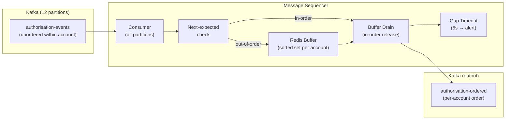

# Message Sequencer

Status: Draft | Last Reviewed: 2026-05-28 | Owner: @tech-lead-backend
Catalog ID: INT-017 | Radii
Tier Applicability: T0, T1

## Problem Statement

A card transaction processor publishes authorisation events to a Kafka topic with 12 partitions. A downstream ledger posting service consumes those events to post debits and credits. Because the topic has multiple partitions and the producer assigns messages round-robin, the events for a single account arrive out of order: `TxnAuthorised(seq=3)` arrives before `TxnAuthorised(seq=1)` for account ACC-001. The ledger applies the transactions out of order, producing an incorrect running balance. The end-of-day reconciliation fails. The account shows a credit before the debit that generated it.

Kafka guarantees ordering within a partition but not across partitions. When producers distribute messages across partitions (for throughput), consumers receive messages in unpredictable order. For financial transactions where order matters — sequential debits, interest accrual, end-of-day netting — out-of-order processing produces incorrect ledger state. The Message Sequencer pattern addresses this by collecting out-of-order messages, holding them in a buffer keyed by a sequence number, and releasing them in strict order only when all gaps are filled.

## Context

The platform uses Kafka for all internal event streaming (INT-001). The card transaction processor publishes authorisation events across 12 partitions for throughput (up to 5,000 TPS during peak). The ledger posting service is a T0 service with a financial correctness requirement: transactions for a given account must be applied in the exact order they were authorised. The sequence number (`seqNum`) is assigned by the card processor at authorisation time and is strictly monotonic per account.

The Resequencer is a classical EIP (Enterprise Integration Pattern); this implementation adapts it for Kafka with a Redis-backed buffer (for cross-replica coordination) and a gap-timeout mechanism to handle permanently lost messages without blocking the sequence indefinitely.

## Solution

A Kafka consumer reads authorisation events from all partitions. For each event, it checks whether the event is the next expected sequence number for that account. If yes, it processes the event and checks whether the buffer holds the subsequent events in order (draining the buffer). If no, it holds the event in a Redis sorted set keyed by `accountId`, scored by `seqNum`. A background thread drains the buffer for each account whenever a new event arrives or when a gap-timeout (5 seconds) expires, emitting a GapDetected alert if a sequence number is missing for longer than the timeout.



## Implementation Guidelines

**1. Redis buffer — sorted set per account**

```java
// src/main/java/com/banking/sequencer/MessageSequencerService.java
@Service
public class MessageSequencerService {

    private static final String NEXT_SEQ_KEY = "seq:next:%s";
    private static final String BUFFER_KEY   = "seq:buffer:%s";
    private static final Duration GAP_TTL    = Duration.ofSeconds(5);

    private final RedisTemplate<String, String> redis;
    private final KafkaTemplate<String, TxnAuthorised> outputKafka;

    public void onMessage(TxnAuthorised event) {
        String accountId  = event.getAccountId();
        long   seqNum     = event.getSeqNum();
        long   nextExpected = getAndInitNextExpected(accountId, seqNum);

        if (seqNum == nextExpected) {
            // Happy path — in-order delivery
            release(event);
            drainBuffer(accountId, nextExpected + 1);
        } else if (seqNum > nextExpected) {
            // Out-of-order — buffer the event
            String serialised = JsonUtils.toJson(event);
            redis.opsForZSet().add(BUFFER_KEY.formatted(accountId), serialised, seqNum);
            // Record arrival time for gap-timeout tracking
            redis.opsForValue().setIfAbsent("seq:gap:%s:%d".formatted(accountId, nextExpected),
                String.valueOf(Instant.now().toEpochMilli()), GAP_TTL);
        } else {
            // seqNum < nextExpected — duplicate/replay; discard
            log.warn("sequencer.duplicate accountId={} seqNum={} nextExpected={}", accountId, seqNum, nextExpected);
        }
    }

    private void drainBuffer(String accountId, long from) {
        String bufferKey = BUFFER_KEY.formatted(accountId);
        long next = from;
        while (true) {
            // Fetch the lowest-scored element in the sorted set
            Set<ZSetOperations.TypedTuple<String>> candidates =
                redis.opsForZSet().rangeWithScores(bufferKey, 0, 0);
            if (candidates == null || candidates.isEmpty()) break;
            ZSetOperations.TypedTuple<String> head = candidates.iterator().next();
            if (head.getScore() == null || head.getScore().longValue() != next) break;
            TxnAuthorised event = JsonUtils.fromJson(head.getValue(), TxnAuthorised.class);
            redis.opsForZSet().remove(bufferKey, head.getValue());
            release(event);
            next++;
        }
        redis.opsForValue().set(NEXT_SEQ_KEY.formatted(accountId), String.valueOf(next));
    }

    private void release(TxnAuthorised event) {
        outputKafka.send("authorisation-ordered", event.getAccountId(), event);
        meterRegistry.counter("sequencer.released", "accountId", event.getAccountId()).increment();
    }

    private long getAndInitNextExpected(String accountId, long firstSeen) {
        String key = NEXT_SEQ_KEY.formatted(accountId);
        String val = (String) redis.opsForValue().get(key);
        if (val == null) {
            redis.opsForValue().set(key, String.valueOf(firstSeen));
            return firstSeen;
        }
        return Long.parseLong(val);
    }
}
```

**2. Gap timeout monitor**

```java
// src/main/java/com/banking/sequencer/GapTimeoutMonitor.java
@Scheduled(fixedDelay = 1000)
public void checkGapTimeouts() {
    Set<String> gapKeys = redisKeys("seq:gap:*");
    for (String gapKey : gapKeys) {
        String arrivedAt = (String) redis.opsForValue().get(gapKey);
        if (arrivedAt == null) continue; // Already expired (TTL passed without resolution)
        long elapsed = Instant.now().toEpochMilli() - Long.parseLong(arrivedAt);
        if (elapsed > 5000) {
            String[] parts = gapKey.split(":");
            String accountId = parts[2];
            long missingSeq = Long.parseLong(parts[3]);
            log.error("sequencer.gap.timeout accountId={} missingSeq={} elapsedMs={}", accountId, missingSeq, elapsed);
            meterRegistry.counter("sequencer.gap.timeout", "accountId", accountId).increment();
            // Advance past the gap — emit a GapDetected sentinel event for the ledger to handle
            kafkaTemplate.send("authorisation-ordered",
                GapDetected.newBuilder()
                    .setAccountId(accountId).setMissingSeqNum(missingSeq)
                    .setTimestamp(Instant.now().toEpochMilli()).build());
            redis.delete(gapKey);
            advanceNextExpected(accountId, missingSeq + 1);
        }
    }
}
```

**3. Prometheus alerts**

```yaml
# prometheus/rules/message-sequencer.yml
groups:
  - name: message_sequencer
    rules:
      - alert: MessageSequencerGapDetected
        expr: increase(sequencer_gap_timeout_total[5m]) > 0
        for: 1m
        labels:
          severity: critical
        annotations:
          summary: "Message sequencer gap timeout — sequence number missing, ledger reconciliation may be affected"

      - alert: MessageSequencerBufferLag
        expr: sequencer_buffer_size_max > 1000
        for: 5m
        labels:
          severity: warning
        annotations:
          summary: "Sequencer buffer exceeds 1000 messages — producer may be sending too far out of order"
```

## When to Use

- Financial event streams where per-account or per-entity ordering is required for correctness (ledger posting, interest accrual, running balance calculation)
- When the Kafka topic has multiple partitions for throughput and the producer cannot guarantee per-key partition assignment (or the producer is outside the team's control, e.g., a card network adapter)
- When the event producer assigns strict monotonic sequence numbers that can be used to detect and fill gaps

## When Not to Use

- When Kafka partition-key routing is sufficient — if the producer always routes by account ID, all messages for an account go to the same partition and arrive in order; no sequencer is needed
- Low-throughput, single-partition topics — ordering is guaranteed natively
- Events where ordering does not affect correctness (e.g., audit log entries, telemetry) — the overhead of Redis buffering is not justified
- When the producer does not assign sequence numbers — the sequencer cannot function without a reliable sequence number field

## Variants

| Variant | When to prefer | Trade-off |
|---------|----------------|-----------|
| Redis sorted set buffer (this pattern) | Distributed consumer group; cross-replica buffer sharing; fast TTL-based gap expiry | Redis adds infrastructure dependency; Redis failure is a sequencer failure |
| In-memory buffer per partition | Single-threaded consumer, single replica | No Redis dependency; not safe for multi-replica deployments |
| Database-backed buffer | Audit trail of buffered events required; Redis not available | Slower than Redis; database becomes a bottleneck under high throughput |
| Kafka partition-key routing (preferred prevention) | Producer is under team control; repartition to per-account | Eliminates the need for a sequencer; requires producer changes |

## NFR Acceptance Criteria

```yaml
nfr_acceptance_criteria:
  catalog_id: INT-017
  pattern: Message Sequencer
  performance:
    - id: INT-017-HP-01
      description: In-order events must be released within 50ms of receipt by the sequencer.
      threshold: in_order_release_latency_p99 < 50ms
    - id: INT-017-HP-02
      description: Redis buffer operations (add + drain) must complete within 10ms at p99.
      threshold: redis_buffer_op_p99 < 10ms
    - id: INT-017-HP-03
      description: Gap timeout must fire within 6 seconds of the gap being detected (5s TTL + 1s scheduler cycle).
      threshold: gap_timeout_lag < 6s
  reliability:
    - id: INT-017-REL-01
      description: No event may be released out of order — an event with seqNum N must not be released before seqNum N-1 for the same accountId.
      threshold: out_of_order_releases = 0
    - id: INT-017-REL-02
      description: Duplicate events (seqNum < nextExpected) must be discarded without producing a duplicate release.
      threshold: duplicate_releases = 0
```

## Compliance Mapping

| Ring | Regulation | Provision | How this pattern satisfies |
|------|-----------|-----------|---------------------------|
| Ring 0 | Enterprise Integration Patterns (Hohpe/Woolf) | Resequencer pattern: collect out-of-order messages and re-emit them in sequence order | This implementation is a direct application of the EIP Resequencer pattern, adapted for Kafka with Redis buffering and a gap-timeout mechanism for permanently lost messages |
| Ring 1 | BCBS 239 | Principle 3 — data aggregation capabilities: risk positions must reflect transactions in the correct temporal order to produce accurate exposures | In-order event processing ensures that running balances, exposure calculations, and risk aggregations reflect the correct transaction sequence; out-of-order posting would produce incorrect intraday risk positions |
| Ring 2 | SBV Circular 09/2020 | §IV.2 — financial transaction data exchanged between systems must preserve the integrity and order of operations | The sequencer guarantees that all card authorisation events are applied to the ledger in the authorisation sequence order; gap detection and alerting ensures that missing events are detected and handled before end-of-day reconciliation ⚠️ (working summary — pending Legal review) |

## Cost / FinOps Notes

- Redis: a shared Redis Cluster already exists for idempotency and rate limiting; sequencer adds ~100 MB of sorted set memory at 50,000 buffered events × 2 KB each
- Additional Kafka topic (`authorisation-ordered`): 1 partition per account shard; at normal throughput 1 GB/day; standard Kafka storage
- Sequencer service: 2 replicas at 0.5 CPU / 512 MB each; scales with consumer group throughput, not with the number of accounts
- Gap timeout alert page cost: at 1 gap event per day (normal) = 1 alert; at >10 gaps/day = investigate producer reliability

## Threat Model

**Sequence Number Manipulation — attacker injects events with forged sequence numbers (Tampering)**: an attacker who gains write access to the `authorisation-events` topic publishes events with artificially low sequence numbers (e.g., seqNum=1 for an account already at seqNum=500). The sequencer's duplicate check discards events with seqNum < nextExpected, but if the attacker publishes a seqNum within the buffered window, it could displace a legitimate event. Mitigation: the `authorisation-events` topic is restricted to the card processor service account (Kafka ACLs, SEC-010); sequence numbers are signed by the card processor using HMAC-SHA256 (the same signing mechanism as INT-014); the sequencer validates the HMAC before buffering.

**Gap Flooding — attacker sends many events with far-future sequence numbers to exhaust Redis buffer memory (Denial of Service)**: an attacker floods the `authorisation-events` topic with events whose sequence numbers are 10,000 ahead of the current position. The sequencer buffers all of them, exhausting Redis memory and causing OOM. Mitigation: the sequencer enforces a maximum buffer size per account (1,000 events); events whose seqNum is more than 1,000 ahead of nextExpected are discarded with a warning log; a `sequencer.buffer.overflow` counter triggers an alert when the buffer ceiling is hit; the Kafka consumer rate-limits per-account by pausing the consumer partition when the account buffer is full.

## Operational Runbook (stub)

1. Alert: MessageSequencerGapDetected — fires when a sequence number gap timeout expires (missing event not received within 5 seconds). p50 resolution: 15 min; p99: 1 hour. Identify the affected account and missing sequence number from the log: `grep "sequencer.gap.timeout" <pod-log>`. Determine whether the event was produced: check the `authorisation-events` topic for the missing seqNum using `kafka-console-consumer.sh --topic authorisation-events --from-beginning | grep <accountId>`. If the event was produced but not consumed, check the consumer group lag: `kafka-consumer-groups.sh --describe --group sequencer-consumer`. If the event was never produced (card processor failure), the GapDetected sentinel event has already advanced the sequence; the ledger must reconcile the gap using the card network's settlement file.

2. Alert: MessageSequencerBufferLag — fires when any account's buffer exceeds 1,000 messages. p50 resolution: 5 min; p99: 30 min. Identify which account has the large buffer: query Redis `ZCARD seq:buffer:<accountId>` for candidate accounts. Common cause: a high-traffic account (e.g., a large merchant) generating authorisations faster than they are sequenced. Scale the sequencer consumer group (add replicas) and verify the buffer drains. If the buffer is consistently large for the same account, investigate whether the producer is assigning sequence numbers correctly.

## Test Strategy

**Unit**: `MessageSequencerServiceTest` — send events `[seq=3, seq=1, seq=2]` for accountId `ACC-001`; assert seq=1 is released immediately, then seq=2, then seq=3 (in order); assert the buffer is empty after all three events; send seq=1 twice for `ACC-002`; assert the second delivery is discarded (duplicate); simulate gap by sending `[seq=1, seq=3]` and waiting 6 seconds; assert a GapDetected sentinel is emitted for seqNum=2 and the buffer advances to seq=3.

**Integration**: Use Testcontainers (Kafka + Redis); publish 1,000 events for `ACC-003` with random sequence order (seqNum 1–1000 shuffled); consume from `authorisation-ordered`; assert all 1,000 events are released in order (seqNum 1, 2, 3...); measure latency from last event published to last event released; assert < 5 seconds for 1,000 events.

**Chaos**: Kill the sequencer pod mid-buffer (after seqNum=50 is buffered but before release); restart the pod; assert the buffer is restored from Redis and draining continues; assert no event is released twice (idempotency after restart); assert no event is skipped (ordering preserved after restart).

**Performance**: Publish 50,000 events across 100 accounts with 20% out-of-order rate; assert throughput ≥ 5,000 events/second released in-order; assert Redis buffer memory does not exceed 200 MB; assert no gap timeouts fire (all events delivered within 5s window).

## Related Patterns

- [INT-001 Saga Orchestration](saga-orchestration.md) — saga events processed by the ledger posting step are sequenced before posting using this pattern to preserve transaction order
- [INT-013 Schema Registry Governance](schema-registry-governance.md) — `TxnAuthorised` and `GapDetected` event schemas are registered in the Confluent Schema Registry
- [INT-016 Distributed Saga Choreography](distributed-saga-choreography.md) — choreography events for the same account also benefit from sequencing when the saga emits multiple events per account within a short window
- [RES-001 Kafka Consumer Group Patterns](../resilience/kafka-consumer-group-patterns.md) — the sequencer consumer group follows standard consumer group resilience patterns for partition rebalance handling
- [OBS-008 Log Aggregation Pipeline](../observability/log-aggregation-pipeline.md) — gap timeout events and buffer overflow events are shipped to OpenSearch as structured alerts for reconciliation evidence

## References

- Hohpe & Woolf — Enterprise Integration Patterns: Resequencer pattern (Chapter 7)
- Apache Kafka documentation — partition assignment and consumer group semantics
- Redis Sorted Sets documentation — ZADD/ZRANGEBYSCORE for ordered buffering
- BCBS 239 Principle 3 — data aggregation and temporal ordering for risk reporting
- SBV Circular 09/2020 §IV.2 — inter-system financial transaction integrity

---
**Key Takeaway**: Buffer out-of-order Kafka events in a Redis sorted set keyed by sequence number, drain in strict order when gaps fill, and emit a GapDetected sentinel after 5 seconds of a missing sequence number — so ledger posting, balance calculations, and risk aggregations always see financial events in authorisation order regardless of Kafka partition count.
