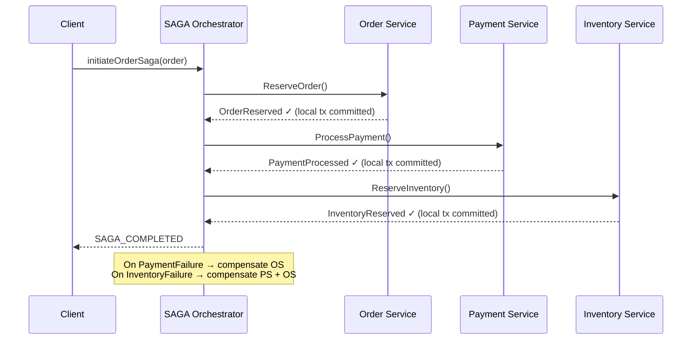
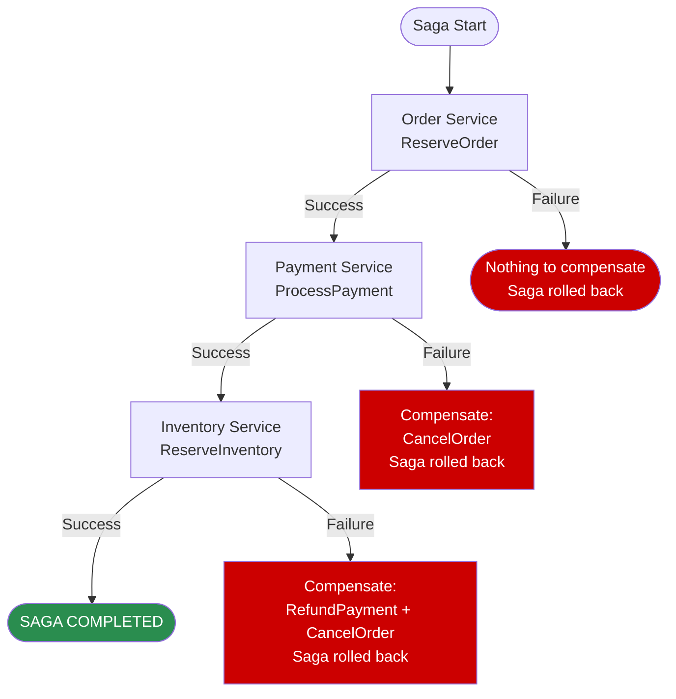

# SAGA Orchestration Pattern

Status: Approved | Last Reviewed: 2026-05-09 | Owner: @tech-lead-backend
Catalog ID: INT-001 | Radii (upgraded to ops-runbook depth in Wave 3b)
Tier Applicability: T0, T1

## Problem Statement

Microservices struggle with distributed transactions across multiple databases:
- Cannot use traditional 2-phase commit (blocking, unreliable in distributed systems)
- ACID transactions span multiple services and databases
- Long-running business transactions involve approval workflows, payment processing, inventory reservation
- Failure recovery is complex: which service failed? How to compensate?

## Solution

Use a central orchestrator to coordinate a sequence of local transactions. Each step executes a compensating transaction on failure.



## Implementation Guidelines

1. **Define SAGA Steps**
   - Each step is a local transaction in a service
   - Each step has a success path and compensation (undo)
   - Order SAGA:
     - Step 1 (Order Service): Create order, emit `OrderCreated`
     - Step 2 (Payment Service): Process payment, emit `PaymentProcessed`
     - Step 3 (Inventory Service): Reserve items, emit `InventoryReserved`
     - Step 4 (Notification Service): Send confirmation

2. **Orchestrator Implementation**
   - Centralized SAGA orchestrator tracks state
   - Options: Apache Temporal, Camunda, custom Spring service
   - Maintains SAGA instance state: running, completed, failed
   - Triggers next step based on previous success/failure

3. **Compensation Logic**
   ```java
   @Service
   @Transactional
   public class OrderSagaOrchestrator {

     private static final Logger log = LoggerFactory.getLogger(OrderSagaOrchestrator.class);

     @Autowired
     private OrderService orderService;
     @Autowired
     private PaymentService paymentService;
     @Autowired
     private InventoryService inventoryService;

     public void executeOrderSaga(Order order) {
       String sagaId = UUID.randomUUID().toString();
       SagaInstance saga = new SagaInstance(sagaId, "ORDER_SAGA", order.getId());

       try {
         // Step 1: Create Order
         saga.step(1, "CREATE_ORDER");
         Order createdOrder = orderService.createOrder(order);
         saga.markStepSuccess(1);

         // Step 2: Process Payment
         saga.step(2, "PROCESS_PAYMENT");
         PaymentResult payment = paymentService.processPayment(
           createdOrder.getCustomerId(),
           createdOrder.getAmount()
         );
         saga.markStepSuccess(2);

         // Step 3: Reserve Inventory
         saga.step(3, "RESERVE_INVENTORY");
         inventoryService.reserveItems(createdOrder.getItems());
         saga.markStepSuccess(3);

         // All steps succeeded
         saga.markCompleted();
         log.info("Order SAGA completed: orderId={}", createdOrder.getId());

       } catch (PaymentFailedException e) {
         log.error("Payment failed, rolling back order: {}", sagaId);
         // Compensation: reverse steps
         compensateOrderCreation(order);
         saga.markFailed(2, e.getMessage());
         throw new OrderSagaFailedException(sagaId, 2);

       } catch (InventoryUnavailableException e) {
         log.error("Inventory unavailable, reversing payment and order: {}", sagaId);
         // Compensation: reverse steps 2 and 1
         compensatePayment(order);
         compensateOrderCreation(order);
         saga.markFailed(3, e.getMessage());
         throw new OrderSagaFailedException(sagaId, 3);
       }
     }

     private void compensateOrderCreation(Order order) {
       orderService.cancelOrder(order.getId());
     }

     private void compensatePayment(Order order) {
       paymentService.refund(order.getId());
     }
   }
   ```

4. **Temporal Implementation** (Recommended)
   ```java
   public interface OrderSaga {
     @WorkflowMethod
     void executeOrderSaga(Order order);
   }

   public class OrderSagaImpl implements OrderSaga {
     private final OrderService orderService = Workflow.newActivityStub(
       OrderService.class,
       new ActivityOptions.Builder()
         .setStartToCloseTimeout(Duration.ofMinutes(5))
         .setRetryOptions(new RetryOptions.Builder()
           .setInitialInterval(Duration.ofSeconds(1))
           .setMaximumInterval(Duration.ofSeconds(60))
           .setBackoffCoefficient(2)
           .setMaximumAttempts(3)
           .build())
         .build()
     );

     @Override
     public void executeOrderSaga(Order order) {
       try {
         // Step 1: Create order
         Order createdOrder = orderService.createOrder(order);

         // Step 2: Process payment (with retry)
         PaymentResult payment = orderService.processPayment(
           createdOrder.getCustomerId(),
           createdOrder.getAmount()
         );

         // Step 3: Reserve inventory
         orderService.reserveInventory(createdOrder.getItems());

         // Success
       } catch (ActivityFailureException e) {
         // Temporal automatically handles compensation
         if (createdOrder != null) {
           orderService.compensateOrder(createdOrder.getId());
         }
         throw e;
       }
     }
   }
   ```

5. **Failure Handling**
   - Idempotency: Ensure compensation is idempotent (can run multiple times safely)
   - Retry: Transient failures (timeout, network) → automatic retry
   - Circuit breaker: Persistent failures (service down) → fail fast
   - Dead-letter queue: Unrecoverable failures → manual intervention

6. **Monitoring SAGA Execution**
   - Log each step: start, success, failure, compensation
   - Metrics: saga duration, success rate, compensation frequency
   - Alerts: if SAGA fails repeatedly, notify ops team

## Happy Path vs Compensation



## When to Use

- Multi-step business processes
- Approval workflows (order → manager approval → fulfillment)
- Long-running transactions (minutes to hours)
- Cross-service coordination
- Financial transactions requiring rollback capability

## When NOT to Use

- Simple service calls (use direct API calls)
- Real-time constraints (SAGA may take seconds)
- Compensation is impossible (e.g., physical goods already shipped)

## Tools

| Tool | Use Case |
|------|----------|
| **Apache Temporal** | Complex workflows, strong semantics, recommended |
| **Camunda** | BPMN workflows, human approvals |
| **Axon Framework** | Event sourcing with SAGA support |
| **Custom Spring Service** | Simple SAGAs, full control |

## NFR Acceptance Criteria

- **HA**: orchestrator state persisted in HA store (Temporal cluster, or Aurora-backed Spring State Machine). Cross-region replication per [REF-001](../../reference-architectures/multi-region-active-active.md) for T0 sagas.
- **HP**: per-step latency ≈ network RTT + downstream service time; total saga latency = sum of step latencies. T0 payment sagas typically complete in 1–3 s end-to-end. Customer flow uses async-ack with [RES-011 Queue-Based Load Levelling](../resilience/queue-based-load-levelling.md) so the customer doesn't wait synchronously.
- **HR**: every step is idempotent ([PRIN-006](../../principles/idempotency-by-default.md), [EIP-024](../eip/idempotent-receiver.md)); every step has a documented compensation; state durability survives orchestrator crash; orchestrator replay-safe.

## Compliance Mapping

| Layer | Reference | Section/Control | How this satisfies |
|---|---|---|---|
| Ring 0 | Microservices.io — Saga | Canonical pattern definition | Implementation reference |
| Ring 0 | Microsoft Cloud Patterns — Saga | "Manage data consistency across microservices" | Same pattern; same intent |
| Ring 1 | Basel BCBS 239 §6 (Accuracy) | "Aggregation must avoid double-counting" | Saga + idempotent steps + compensations preserve accounting accuracy across distributed transactions |
| Ring 1 | ISO 20022 multi-leg payment flows | Multi-step settlement (e.g., pacs.008 → pacs.002 → pacs.004 reversal) | Saga is the canonical orchestration for ISO 20022 multi-leg flows |
| Ring 2 | SBV Circular 09/2020 §IV.2 ⚠️ (working summary — pending Legal review) | Operational continuity | Compensations preserve consistency under partial failure during EOD windows |

## Cost / FinOps Notes

| Item | Cost driver | Order of magnitude |
|---|---|---|
| Temporal cluster (recommended) | Worker count × visibility-DB size | $500–2000/month for typical T0 throughput |
| Aurora-backed state (Spring State Machine alt) | DB storage + replicas | $200–500/month |
| Per-saga overhead | Step persistence + transition writes | ~$0.0001 per saga at high volume |
| Failed/long-running sagas | Manual triage labour | Bounded by good design |

**Cost of NOT using Saga**: 2PC across services is unreliable in cloud-native deployments; ad-hoc multi-step coordination produces inconsistency bugs that compound and become reconciliation tickets — far higher cost than the orchestrator infra.

## Threat Model Summary

STRIDE: addresses **Tampering** (consistency) and **Repudiation** (every step audited).

- **Top 3 threats addressed**:
  1. *Partial-success inconsistency* — payment debited but inventory not reserved. Compensation reverses the debit.
  2. *Replay corruption* — idempotent steps make replay safe.
  3. *Crash in the middle* — durable state lets the orchestrator resume.
- **Top 3 residual threats**:
  1. *Buggy compensation* — compensation that doesn't fully reverse leaves residual state. Mitigation: pair every step with a tested compensation in the same PR; chaos drills exercise compensations.
  2. *Compensation that itself fails* — recursive compensation problem. Mitigation: at-least-N-attempts then DLT escalation to human triage.
  3. *Orchestrator-as-bottleneck* — single Temporal cluster failure halts all sagas. Mitigation: REF-001 multi-region; cell-aware Temporal namespaces.

## Operational Runbook (stub)

- **Alerts**:
  - `Saga_StuckCount`: number of sagas in non-terminal state for > tier-budget. Severity: tier-dependent.
  - `Saga_CompensationFailureRate`: % of compensations that themselves fail. Severity: High (suggests buggy compensation logic).
  - `Saga_DLT_Depth`: sagas escalated to manual triage. Severity: warning, escalating.
- **Dashboards**: Grafana — `saga-overview` (start rate, completion rate, compensation rate, P95 duration, stuck count).
- **Stuck-saga procedure**:
  1. Identify saga ID and current step.
  2. Check the step's downstream health.
  3. If downstream recoverable: let saga retry per its policy.
  4. If downstream permanently failed: trigger compensation manually via runbook.
  5. Document in postmortem if pattern repeats.

## Test Strategy (stub)

- **Unit**: each step's forward and compensation actions independently.
- **Integration**: full saga happy path; partial-failure path triggering compensation; idempotent re-execution.
- **Chaos**: kill orchestrator mid-saga; verify resumption. Inject compensation failures; verify escalation.
- **Property-based**: random step-failure permutations should always converge to a consistent end state (success or fully compensated).

## Related Patterns

- [PRIN-006 Idempotency-by-default](../../principles/idempotency-by-default.md) — every saga step must be idempotent
- [EIP-024 Idempotent Receiver](../eip/idempotent-receiver.md) — message-driven saga steps
- [EIP-017 Process Manager](../eip/process-manager.md) — Saga is a banking-specific specialisation of Process Manager
- [INT-002 Transactional Outbox + CDC](cdc-outbox-pattern.md) — saga step events are published via outbox
- [INT-004 Event Sourcing](event-sourcing.md) — saga state can itself be event-sourced
- [REF-001 Multi-Region Active-Active](../../reference-architectures/multi-region-active-active.md) — T0 sagas inherit the topology
- [REF-002 Real-Time Payments NAPAS](../../reference-architectures/real-time-payments-napas.md) — primary saga consumer

## References

- [Apache Temporal](https://temporal.io/)
- [Camunda](https://camunda.com/)
- [SAGA Pattern](https://microservices.io/patterns/data/saga.html)
- [Axon Framework](https://axoniq.io/)

---

**Key Takeaway**: Saga = sequence of local transactions, each compensable, durably orchestrated. Pair every step with idempotency (PRIN-006 + EIP-024) and a tested compensation. Use Temporal for production T0 systems.
