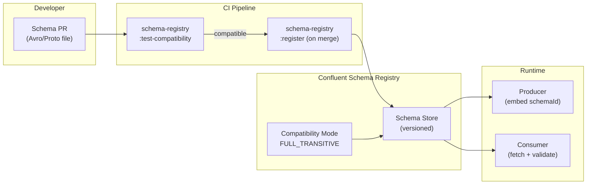

# Schema Registry Governance

Status: Draft | Last Reviewed: 2026-05-27 | Owner: @tech-lead-backend
Catalog ID: INT-013 | Radii
Tier Applicability: T0, T1, T2

## Problem Statement

Event-driven banking systems break silently when a producer changes the shape of a message without coordinating with consumers. A payment gateway that renames the `amount` field to `amountVnd` deploys successfully; the downstream ledger posting service fails to deserialise the event and silently drops postings for 4 hours before the monitoring team notices the consumer lag spike. There is no gate between the producer deployment and the consumer failure. The schema changed; nothing enforced that the change was backward-compatible.

The problem compounds with scale: 50 Kafka topics, 20 producer services, 35 consumer services — the schema compatibility matrix has 1,750 potential breakpoints. Without a centralised schema registry, each team manages its own schema files independently, and breaking changes are discovered in UAT at best and production at worst. A BCBS 239 examination asks "how do you ensure data quality across the event streaming infrastructure?" — the honest answer without a schema registry is "we hope the teams coordinate."

## Context

The Confluent Schema Registry is the authoritative store for Avro and Protobuf schemas used across all Kafka topics. Every Kafka message published by a banking service must embed the schema ID in the message header; consumers fetch the schema from the registry at startup and validate incoming messages. The registry enforces compatibility rules that prevent producers from registering schemas that would break existing consumers. The registry integrates with the CI pipeline (via Maven and Gradle plugins) to validate schemas before deployment, and with the GitOps pipeline (PLT-003) to ensure schema changes follow the same approval workflow as application code.

Schema governance covers the full lifecycle: schema authoring, registration, versioning, evolution, and eventual deprecation. The AsyncAPI specification standard (INT-010) documents the event contract at a higher level; the schema registry enforces that contract at the byte level for every message in flight.

## Solution

Confluent Schema Registry deployed in-cluster (Kubernetes StatefulSet with persistent storage), configured with `FULL_TRANSITIVE` compatibility mode for all T0/T1 topics. Every Kafka topic has a registered schema. Schema changes require a PR to the schema repository (separate from the service repository), validated by a CI job that runs `schema-registry:test-compatibility`. Schema registration uses a service account with write access; consumer service accounts have read-only access. A nightly drift job asserts that the schemas registered in the registry match the `asyncapi.yaml` documents in git.



## Implementation Guidelines

**1. Schema Registry Kubernetes deployment**

```yaml
# platform/schema-registry/helm/values-prod.yaml
schemaRegistry:
  image:
    repository: confluentinc/cp-schema-registry
    tag: "7.6.0"
  replicaCount: 2

  config:
    SCHEMA_REGISTRY_KAFKASTORE_BOOTSTRAP_SERVERS: kafka-prod:9092
    SCHEMA_REGISTRY_HOST_NAME: schema-registry.platform.svc
    SCHEMA_REGISTRY_LISTENERS: http://0.0.0.0:8081
    SCHEMA_REGISTRY_KAFKASTORE_SECURITY_PROTOCOL: SSL
    SCHEMA_REGISTRY_KAFKASTORE_SSL_KEYSTORE_LOCATION: /vault/secrets/kafka-keystore.jks
    SCHEMA_REGISTRY_SCHEMA_COMPATIBILITY_LEVEL: FULL_TRANSITIVE

  resources:
    requests:
      cpu: "500m"
      memory: "1Gi"
    limits:
      cpu: "2"
      memory: "2Gi"
```

**2. Gradle schema registration + compatibility check**

```groovy
// build.gradle (producer service)
plugins {
    id 'com.github.imflog.kafka-schema-registry-gradle-plugin' version '2.0.0'
}

schemaRegistry {
    url = System.getenv("SCHEMA_REGISTRY_URL") ?: "http://schema-registry.platform.svc:8081"
    credentials {
        username = System.getenv("SCHEMA_REGISTRY_USER") ?: ""
        password = System.getenv("SCHEMA_REGISTRY_PASSWORD") ?: ""
    }

    // Run in CI to assert compatibility before merge
    testCompatibility {
        subject("payment-events-value", "src/main/avro/payment-events.avsc", "AVRO")
        subject("payment-events-key", "src/main/avro/payment-events-key.avsc", "AVRO")
    }

    // Run on merge to main to register new schema version
    register {
        subject("payment-events-value", "src/main/avro/payment-events.avsc", "AVRO")
        subject("payment-events-key", "src/main/avro/payment-events-key.avsc", "AVRO")
    }
}
```

**3. Avro schema with evolution rules (payment-events.avsc)**

```json
{
  "type": "record",
  "name": "PaymentEvent",
  "namespace": "com.banking.events.payment.v2",
  "doc": "Payment initiated event. v2 adds optional merchantCategory field.",
  "fields": [
    {"name": "paymentId",      "type": "string",           "doc": "UUID v4 — idempotency key"},
    {"name": "accountId",      "type": "string"},
    {"name": "amountVnd",      "type": "long",             "doc": "Amount in VND (integer, no decimals)"},
    {"name": "currency",       "type": "string",           "default": "VND"},
    {"name": "timestamp",      "type": "long",             "doc": "Unix epoch millis"},
    {"name": "merchantCategory", "type": ["null", "string"], "default": null,
     "doc": "Optional — added in v2. Null for non-merchant transactions."}
  ]
}
```

Evolution rules enforced by `FULL_TRANSITIVE` compatibility:
- **Adding a field**: must have a default value (nullable or explicit default)
- **Removing a field**: never allowed in `FULL_TRANSITIVE`; deprecate with `"doc": "DEPRECATED — use replacementField"` and keep for 2 major versions
- **Changing a field type**: never allowed; add a new field with the new type and deprecate the old field
- **Renaming a field**: use Avro aliases — `"aliases": ["oldName"]`

**4. Consumer schema validation (Spring Kafka)**

```java
// src/main/java/com/banking/ledger/config/KafkaConsumerConfig.java
@Bean
public ConsumerFactory<String, PaymentEvent> consumerFactory() {
    Map<String, Object> props = new HashMap<>();
    props.put(ConsumerConfig.BOOTSTRAP_SERVERS_CONFIG, kafkaProperties.getBootstrapServers());
    props.put(ConsumerConfig.GROUP_ID_CONFIG, "ledger-posting-consumer");
    props.put(ConsumerConfig.KEY_DESERIALIZER_CLASS_CONFIG, StringDeserializer.class);
    props.put(ConsumerConfig.VALUE_DESERIALIZER_CLASS_CONFIG, KafkaAvroDeserializer.class);
    // Schema Registry integration
    props.put(AbstractKafkaSchemaSerDeConfig.SCHEMA_REGISTRY_URL_CONFIG,
              schemaRegistryUrl);
    props.put(KafkaAvroDeserializerConfig.SPECIFIC_AVRO_READER_CONFIG, true);
    // Use reader schema (consumer version) to project writer schema (producer version)
    props.put(KafkaAvroDeserializerConfig.SCHEMA_REFLECTION_CONFIG, false);
    return new DefaultKafkaConsumerFactory<>(props);
}
```

## When to Use

- Any Kafka topic where producer and consumer are owned by different teams — schema drift is inevitable without a registry
- When a schema breaking change has already caused a production incident
- When BCBS 239 data quality evidence must include proof that event schemas are validated before deployment
- When onboarding a new event type: define the schema in the registry first, then build the producer and consumer

## When Not to Use

- Single-team event streaming where producer and consumer are deployed together in a monorepo — the PR itself is the schema compatibility gate
- REST APIs — use OpenAPI (and INT-015 contract testing) instead; the schema registry pattern is specific to Kafka/message-bus binary serialisation
- Low-volume, non-critical events (T2, internal telemetry) where schema-less JSON with lenient consumer parsing is acceptable overhead-to-benefit tradeoff

## Variants

| Variant | When to prefer | Trade-off |
|---------|----------------|-----------|
| Confluent Schema Registry (this pattern) | Teams already using Confluent Kafka; best ecosystem support | Confluent licensing (Community version available; Enterprise for RBAC and audit logs) |
| AWS Glue Schema Registry | Teams on AWS MSK who prefer AWS-native tooling | Tightly coupled to AWS; less ecosystem tooling than Confluent |
| Apicurio Registry | Teams preferring a fully open-source CNCF-aligned registry | Less mature than Confluent; fewer client library integrations |
| Protobuf + Git (no registry) | Very small teams with 1-2 topics and tight monorepo discipline | Does not scale; no runtime schema validation; breaks silently |

## NFR Acceptance Criteria

```yaml
nfr_acceptance_criteria:
  catalog_id: INT-013
  pattern: Schema Registry Governance
  performance:
    - id: INT-013-HP-01
      description: Schema registration API response must complete within 500ms at p99 under normal load.
      threshold: schema_registration_p99 < 500ms
    - id: INT-013-HP-02
      description: Compatibility check in CI must complete within 200ms for a single schema subject.
      threshold: compatibility_check_duration < 200ms
    - id: INT-013-HP-03
      description: Consumer schema fetch at startup must complete within 2 seconds for up to 20 subjects.
      threshold: consumer_schema_fetch < 2s at 20 subjects
  compliance:
    - id: INT-013-COMP-01
      description: 100% of T0/T1 Kafka topics must have a registered schema in the Schema Registry — validated by the nightly drift job.
      threshold: 0 T0/T1 topics without registered schema
    - id: INT-013-COMP-02
      description: No schema breaking change (remove/rename/type-change) may be registered to a T0 topic — enforced by FULL_TRANSITIVE compatibility mode.
      threshold: 0 breaking schema changes on T0 topics
```

## Compliance Mapping

| Ring | Regulation | Provision | How this pattern satisfies |
|------|-----------|-----------|---------------------------|
| Ring 0 | Confluent Schema Registry Best Practices | FULL_TRANSITIVE compatibility prevents breaking changes; schema-per-topic enforces contract discipline | Schema Registry with FULL_TRANSITIVE compatibility implements the recommended best practice; CI gate and nightly drift job provide additional enforcement |
| Ring 1 | BCBS 239 | Principle 6 — data quality: risk data must be accurate, complete, and timely across aggregation systems | Schema validation at both producer registration time (CI gate) and consumer deserialization time ensures data format accuracy; the registry constitutes an audit trail of schema evolution for BCBS 239 evidence |
| Ring 2 | SBV Circular 09/2020 | §IV.2 — data integrity for inter-system message exchange in credit institutions | Schema registry ensures all messages exchanged between banking systems conform to a versioned, validated contract; breaking changes are prevented at the infrastructure level rather than relying on team coordination ⚠️ (working summary — pending Legal review) |

## Cost / FinOps Notes

- Confluent Schema Registry Community: free and open source; runs as 2 pods (0.5 CPU / 1 GB RAM each) on shared platform nodes = ~1 CPU + 2 GB RAM
- Storage: schemas are stored in a Kafka compacted topic (`_schemas`); at 500 schemas × 10 KB average = 5 MB — negligible
- Confluent Enterprise (for RBAC and audit logging): ~USD 2,000/month for the registry only — evaluate if SOC 2 Type II audit logs for schema changes are required
- CI schema compatibility check: ~5 seconds per PR — negligible at any pipeline volume

## Threat Model

**Schema Rollback Attack — registering an older compatible schema to hide a breaking change (Tampering)**: an attacker who has compromised the schema registration service account registers an older schema version as a "new" version, bypassing the compatibility check because older→newer is compatible but the consumers have already migrated to the newer schema. Consumers fail to deserialise messages produced against the old schema. Mitigation: schema registration events are shipped to the SIEM via OBS-008; the nightly drift job alerts if the schema version numbers for any subject are out of sequence with the git history; all registration requests require a PR-approved commit SHA in the HTTP header (enforced by the schema-registry-proxy admission layer).

**Registry Admin Token Theft — unauthorized schema deletion (Elevation of Privilege)**: an attacker steals the Schema Registry admin service account token and deletes the schema for the `payment-events` topic. Producers continue publishing (they cached the schema ID locally), but new consumer instances fail to fetch the schema and cannot start. Mitigation: the admin service account token is stored in Vault (SEC-007) with a 1-hour TTL and is never stored in environment variables or CI secrets; schema deletion is disabled for all subjects in production (registry configuration `DELETE_SUBJECT_ENABLED: false`); only soft deletes are permitted (schemas remain but are flagged as deleted); a Kubernetes NetworkPolicy prevents the Schema Registry from receiving requests from any pod outside the `platform` namespace.

## Operational Runbook (stub)

1. Alert: SchemaRegistryUnavailable — fires when the Schema Registry health endpoint (`/subjects`) returns non-200 for 3 consecutive minutes. p50 resolution: 5 min; p99: 20 min. Check pod status: `kubectl get pods -n platform -l app=schema-registry`. Common causes: Kafka broker connectivity loss (check `_schemas` topic availability), OOM kill (check pod events), pod eviction due to node pressure. Consumers that have already fetched schemas will continue to operate from the local schema cache; new consumer instances will fail to start. Priority: restore registry before scaling any consumer deployments.

2. Alert: SchemaCompatibilityCheckFailed — fires when the CI schema compatibility job fails on a PR merge to the schema repository. p50 resolution: 30 min; p99: 2 hours. The CI job output identifies the incompatible field and the affected subjects. Common cause: producer added a new required field without a default value; removed an existing field. Fix: add a default value to the new field (for nullable fields: `{"type": ["null", "string"], "default": null}`) or revert the removal and instead deprecate the field with a `doc` annotation for 2 major versions.

## Test Strategy

**Unit**: `SchemaCompatibilityTest` — use the Confluent `SchemaRegistryClient` test mock; register `PaymentEvent` v1; attempt to register v2 with a removed required field; assert the registration fails with `IncompatibleSchemaException`; register v2 with a new optional field (default null); assert registration succeeds; verify the consumer can deserialise a v1 message using the v2 reader schema (projection).

**Integration**: Deploy Schema Registry in a `kind` cluster with a single Kafka broker; register the `payment-events-value` schema; publish 100 messages with the registered schema ID; start a consumer with the same schema; assert 100 messages are consumed without deserialization errors; register a compatible v2 schema; publish 50 more messages with v2 schema ID; assert the consumer (still on v1 reader schema) deserialises all 50 messages using Avro schema projection.

**Compliance**: `SchemaDriftTest` — run the nightly drift job against the test cluster; assert that every topic in the `banking-prod` namespace has a registered schema; assert no schema version in the registry is absent from the `asyncapi.yaml` documents in git (bidirectional check); assert the registry's `FULL_TRANSITIVE` compatibility mode is configured for all T0/T1 subjects.

**Chaos**: Kill the Schema Registry pod mid-consumer-group-rebalance; assert existing consumer instances continue processing (from local schema cache); assert new consumer instances fail to start and log a clear error message; restore the pod; assert new consumer instances successfully start within 30 seconds.

## Related Patterns

- [INT-010 AsyncAPI Specification Standard](asyncapi-specification.md) — AsyncAPI documents the event contract at the human-readable level; the schema registry enforces it at the binary level for every message
- [INT-001 Saga Orchestration](saga-orchestration.md) — saga event payloads (e.g., `PaymentAuthorised`, `FraudCleared`) must have registered schemas to ensure cross-service saga step compatibility
- [INT-016 Distributed Saga Choreography](distributed-saga-choreography.md) — choreography event payloads require schema registry governance to prevent cascade failures from schema drift
- [OBS-008 Log Aggregation Pipeline](../observability/log-aggregation-pipeline.md) — schema registration events are shipped to OpenSearch as structured logs for BCBS 239 audit evidence
- [PLT-003 GitOps Deployment Pipeline](../platform/gitops-deployment-pipeline.md) — schema changes follow the same GitOps PR-approval workflow as application code

## References

- Confluent Schema Registry documentation — compatibility modes and subject naming
- AsyncAPI 3.0 specification — event documentation standard
- BCBS 239 Principles for Effective Risk Data Aggregation and Risk Reporting
- SBV Circular 09/2020 — Information System Security for Credit Institutions §IV.2
- Martin Fowler — Schema Migration in Event-Driven Systems

---
**Key Takeaway**: Register every Kafka topic schema in the Confluent Schema Registry with `FULL_TRANSITIVE` compatibility, gate schema changes through a CI compatibility check, and validate schema-ID on every consumer read — so breaking changes are caught before deployment rather than discovered in production as silent data loss.
