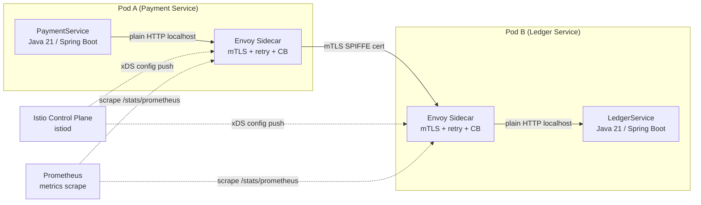

# Sidecar / Ambassador

Status: Draft | Last Reviewed: 2026-05-16 | Owner: @sre-lead
Catalog ID: INT-007 | Radii
Tier Applicability: T0, T1

## Problem Statement

- **Cross-cutting concern duplication**: every microservice independently implements mTLS client certificates, retry-with-backoff, circuit breaking, and metrics scraping — 30+ services each carry the same boilerplate, creating inconsistent configurations and update overhead when the retry policy changes.
- **Language-heterogeneous fleet**: Java services use Resilience4j; Python ML services and Node.js BFF services have no equivalent library. Enforcing a consistent retry and circuit-break policy across a polyglot fleet is impossible without a language-agnostic layer.
- **mTLS certificate rotation**: when Vault-issued mTLS certificates expire, every service must rotate simultaneously. A sidecar-managed certificate lifecycle centralises rotation without service restarts.
- **Observability gaps**: services that handle their own HTTP client telemetry emit inconsistent metric names and miss L4 network-level metrics (TCP errors, connection reuse rates) that are only observable at the proxy level.
- **Security policy enforcement lag**: a new mTLS policy or cipher suite requirement must be deployed across 30+ service teams simultaneously if each team owns its own TLS configuration.

## Context

The Sidecar/Ambassador pattern deploys an Envoy proxy as a co-located container within the same Kubernetes pod as the main application container. The sidecar intercepts all inbound and outbound traffic, enforcing mTLS, retry-with-backoff, circuit breaking, and L7 metrics without modifying the application code. Istio's control plane manages the sidecar configuration centrally via `DestinationRule` and `PeerAuthentication` CRDs. This pattern is the foundation of the Techcombank service mesh and is mandatory for all T0/T1 pods.

## Solution

Istio injects an Envoy sidecar into every pod annotated with `sidecar.istio.io/inject: "true"`. Envoy intercepts all outbound calls and enforces: (1) mTLS (ISTIO_MUTUAL mode) using Vault-issued SPIFFE certificates; (2) retry policy (3 retries, 25 ms base delay, 1 s max); (3) circuit breaker (5 consecutive 5xx trips, 30 s ejection). Envoy intercepts all inbound calls and terminates TLS, forwarding plain HTTP to the application container on the localhost interface. Prometheus scrapes `/stats/prometheus` from each Envoy sidecar, providing consistent L7 metrics across all services.



## Implementation Guidelines

### 1. Istio `PeerAuthentication` — enforce STRICT mTLS for the namespace

```yaml
apiVersion: security.istio.io/v1beta1
kind: PeerAuthentication
metadata:
  name: default
  namespace: payments
spec:
  mtls:
    mode: STRICT
```

### 2. Istio `DestinationRule` — retry, circuit breaker, and connection pool

```yaml
apiVersion: networking.istio.io/v1alpha3
kind: DestinationRule
metadata:
  name: ledger-service
  namespace: payments
spec:
  host: ledger-service.payments.svc.cluster.local
  trafficPolicy:
    connectionPool:
      http:
        http1MaxPendingRequests: 100
        http2MaxRequests: 1000
    outlierDetection:
      consecutive5xxErrors: 5
      interval: 30s
      baseEjectionTime: 30s
      maxEjectionPercent: 50
    retryPolicy:
      attempts: 3
      perTryTimeout: 5s
      retryOn: gateway-error,connect-failure,retriable-4xx
```

### 3. Pod annotation — opt-in sidecar injection

```yaml
apiVersion: apps/v1
kind: Deployment
metadata:
  name: payment-service
spec:
  template:
    metadata:
      annotations:
        sidecar.istio.io/inject: "true"
        sidecar.istio.io/proxyCPU: "100m"
        sidecar.istio.io/proxyMemory: "128Mi"
    spec:
      containers:
        - name: payment-service
          image: techcombank/payment-service:latest
          ports:
            - containerPort: 8080
```

### 4. Vault SPIFFE certificate — sidecar certificate lifecycle

```hcl
# Vault PKI role for service mesh certificates
path "pki_int/issue/service-mesh" {
  capabilities = ["create", "update"]
  allowed_parameters = {
    "common_name" = ["*.payments.svc.cluster.local"]
    "ttl" = ["24h"]
  }
}
```

## When to Use

- All T0/T1 pods that make outbound service-to-service calls within the Techcombank Kubernetes cluster — the sidecar is mandatory for mTLS compliance and consistent observability.
- Polyglot services (Python ML models, Node.js BFF) that cannot use Resilience4j — the Envoy sidecar provides retry, circuit break, and mTLS without any code change.
- Services requiring granular traffic management (weighted routing, canary, fault injection for chaos testing) — these are sidecar-native features not available in application-level libraries.

## When Not to Use

- Batch jobs that make no outbound service calls and run to completion — the sidecar adds 64 MiB memory overhead per pod; single-use batch pods that terminate quickly do not benefit.
- External-facing edge services that terminate TLS from the internet — use a dedicated API gateway or load balancer for north-south traffic; the Envoy sidecar is for east-west (service-to-service) traffic.
- Local development: the Istio sidecar is not injected in local `docker-compose` environments; use `PERMISSIVE` mTLS mode for local dev and `STRICT` for staging/production.

## Variants

| Variant | When to prefer | Trade-off |
|---------|----------------|-----------|
| Istio Envoy sidecar (this pattern) | Kubernetes-native; full traffic management; L7 metrics | Istio control plane is an operational dependency; istiod must be HA |
| Linkerd micro-proxy | Lower memory overhead (~10 MiB vs 64 MiB); simpler operational model | Less feature-rich (no fault injection, simpler traffic management); not the Techcombank standard |
| Application-level Resilience4j only | Simple Spring Boot to Spring Boot calls; mTLS not required | No cross-language consistency; metrics require custom instrumentation; not mesh-native |

## NFR Acceptance Criteria

| Metric | Threshold | Measurement |
|--------|-----------|-------------|
| Sidecar overhead — latency | ≤ 1 ms p99 added per hop | Benchmark with and without sidecar injection on same route; assert overhead ≤ 1 ms |
| mTLS handshake | 100% of east-west traffic encrypted (STRICT mode) | `istioctl x describe pod <pod>` confirms STRICT; network scan from outside mesh confirms port 8080 is closed to non-mesh clients |
| Circuit breaker ejection | ≤ 30 s ejection on 5 consecutive 5xx | Chaos test: inject 5 consecutive 500 errors; assert Envoy ejects the pod for ≥ 30 s; assert traffic routes to healthy replicas |
| Sidecar memory | ≤ 128 MiB per pod | Monitor `container_memory_working_set_bytes{container="istio-proxy"}` |
| Certificate rotation | ≤ 5 min (Vault-issued cert TTL: 24h; rotation at 75% TTL) | Monitor `pilot_proxy_convergence_time` in Grafana; assert < 5 min for cert rotation propagation |

## Compliance Mapping

| Ring | Regulation | Provision | How this pattern satisfies |
|------|-----------|-----------|---------------------------|
| Ring 0 | NIST SP 800-204A | §3.3 — Service-to-service authentication via mutual TLS in microservices | Istio `PeerAuthentication STRICT` enforces mTLS for all east-west traffic; SPIFFE X.509 SVIDs issued by Vault PKI provide workload identity; no service can receive unencrypted traffic from outside the mesh. |
| Ring 1 | PCI-DSS v4.0 | §4.2.1 — Strong cryptography for all non-console administrative access and transmission of cardholder data | STRICT mTLS with TLS 1.3 (Envoy default) satisfies PCI-DSS §4.2.1 for all CDE-adjacent service communication; cipher suites restricted to AESGCM via `DestinationRule` TLS settings. |
| Ring 2 | SBV Circular 09/2020 | §III.4 — Encryption requirements for inter-system communication within the data centre ⚠️ (working summary — pending Legal review) | All intra-cluster east-west traffic is mTLS encrypted; Envoy enforces TLS 1.3 minimum; Legal review required to confirm TLS 1.3 + SPIFFE identity satisfies SBV §III.4 inter-system encryption requirements. |

## Cost / FinOps

- Envoy sidecar per pod: 64 MiB memory, 0.1 vCPU at idle. For 100 pods, this is 6.4 GiB additional memory and 10 vCPU — significant but justified by eliminating 30+ per-service TLS and retry implementations.
- Istio control plane: 3 istiod pods at 512 MiB each = 1.5 GiB. Shared across all namespaces.
- Reduced engineering cost: centralised retry, circuit break, and mTLS configuration saves ~2 engineer-weeks per year in boilerplate maintenance across a 30-service fleet.
- mTLS offload: application containers handle plain HTTP; TLS is done by Envoy using hardware-accelerated AES on modern Intel/ARM CPUs — no measurable application CPU overhead.

## Threat Model

- **Sidecar MITM (Spoofing)**: A pod without sidecar injection attempts to communicate with a sidecar-protected service by presenting a forged mTLS certificate. Mitigation: STRICT PeerAuthentication mode rejects any certificate not issued by the Istio CA (backed by Vault PKI); spoofed certificates fail SPIFFE SVID validation.
- **Sidecar OOM eviction (Denial of Service)**: A traffic spike causes Envoy to consume memory beyond the 128 MiB limit, triggering an OOM eviction that takes down the sidecar and the application container. Mitigation: Envoy memory limit set to 128 MiB with a `requests: 64Mi` floor; HPA on the application deployment scales pods before Envoy is saturated; `outlierDetection` ejects consistently slow pods.

## Runbook Stub

**Alert: `istio_proxy_oom_evictions > 0`**
- p50 baseline: 0 | p99 SLO: 0
- Remediation: (1) `kubectl describe pod <pod>` — confirm OOMKilled on `istio-proxy` container. (2) Increase Envoy memory limit in the pod annotation: `sidecar.istio.io/proxyMemory: "256Mi"`. (3) Check if the traffic spike is expected; if not, investigate upstream for a DDoS or retry storm.

**Alert: `mtls_plaintext_request_rate > 0`**
- p50 baseline: 0 | p99 SLO: 0
- Remediation: CRITICAL — plaintext traffic in a STRICT mTLS namespace means a pod lacks sidecar injection. (1) `istioctl x describe pod <pod>` — identify the pod. (2) Ensure the pod's namespace has `istio-injection: enabled` label. (3) Restart the pod to trigger sidecar injection.

## Test Strategy Stub

### Unit Tests
- No application-level unit tests needed for the sidecar — it is infrastructure, not application code. Test Rego/OPA policies separately.

### Integration Tests
- `IstioMtlsTest` (KinD or local Istio): deploy two test pods with STRICT PeerAuthentication; assert pod A can reach pod B via mTLS; deploy pod C without sidecar; assert pod C's plain HTTP request to pod B is rejected with 403.
- Circuit breaker test: inject 5 consecutive 503 responses from a mock service; assert Envoy ejects the mock for ≥ 30 s; restore the mock; assert traffic resumes after ejection period.

### Chaos Tests
- Kill istiod: assert existing sidecars continue serving traffic with cached xDS config (Envoy is not dependent on istiod for in-flight requests); assert new pods without xDS config cannot start (fail-secure).
- Certificate expiry: let Vault-issued cert expire; assert Envoy renews automatically before expiry (at 75% TTL); assert no traffic interruption during rotation.

## Related Patterns

- [INT-005 Anti-Corruption Layer](anti-corruption-layer.md) — the ACL wraps T24 calls; the sidecar enforces mTLS on those calls
- [RES-002 Circuit Breaker](../resilience/circuit-breaker.md) — the Envoy circuit breaker (outlierDetection) is the service-mesh complement to Resilience4j in-process circuit breaking
- [SEC-001 mTLS Service Mesh](../../patterns/security/mtls-service-mesh.md) — the security pattern that this sidecar deployment satisfies
- [NFR-002 Latency Budget Model](../../nfr/latency-budget-model.md) — the ≤1 ms sidecar overhead must be budgeted in the overall T0 latency allocation

## References

- Istio Documentation — [istio.io/docs](https://istio.io/latest/docs/)
- Envoy Proxy — Circuit Breaker (OutlierDetection) [envoyproxy.io/docs](https://www.envoyproxy.io/docs/envoy/latest/intro/arch_overview/upstream/circuit_breaking)
- NIST SP 800-204A — Strategy for the Integration of Security Services in Microservices-based Systems
- [SPIFFE / SPIRE](https://spiffe.io/) — workload identity standard used by Istio
- HashiCorp Vault PKI Secrets Engine — [developer.hashicorp.com/vault/docs/secrets/pki](https://developer.hashicorp.com/vault/docs/secrets/pki)
- `knowledge-base/_research-notes.md` — service mesh deployment notes

---

**Key Takeaway**: Inject an Envoy sidecar into every pod to get mTLS, retry-with-backoff, and circuit breaking for free — no application code changes, consistent policy across Java, Python, and Node services, and full L7 observability from a single control plane.
