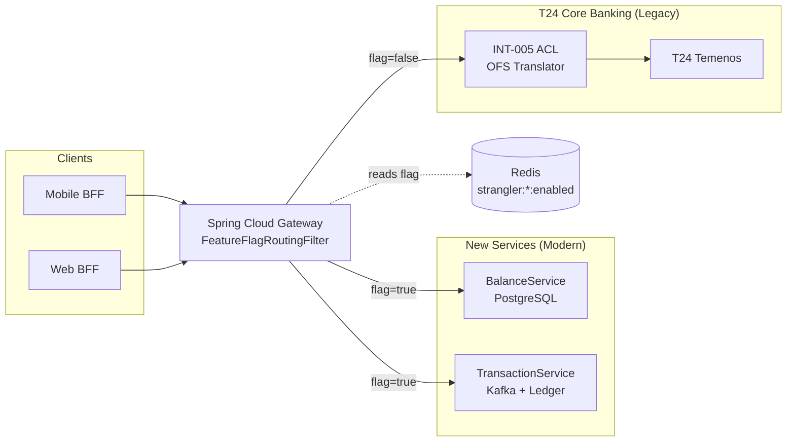

# Strangler Fig

Status: Draft | Last Reviewed: 2026-05-16 | Owner: @tech-lead-backend
Catalog ID: INT-006 | Radii
Tier Applicability: T1, T2

## Problem Statement

- **Big-bang migration risk**: replacing T24 core banking in a single cutover requires all microservices to be complete and tested simultaneously — an impossible coordination task for a bank operating with T0 availability requirements and hundreds of thousands of daily transactions.
- **Feature regression during migration**: migrating a capability (e.g., balance enquiry) to a new service while keeping others in T24 creates a split-brain state; without explicit traffic routing, some requests reach the new service and some reach T24, producing inconsistent responses.
- **Rollback complexity**: if the new service has a defect post-cutover in a big-bang migration, rolling back requires reverting the entire system simultaneously — often impractical within a T0 incident window.
- **Dual-write consistency**: during migration, both the old and new systems may be in use simultaneously; without a reconciliation mechanism, their state diverges silently.
- **Team coordination overhead**: a big-bang migration requires every team to coordinate their completion before the cutover date, creating an artificial hard dependency that stalls independent teams.

## Context

The Strangler Fig is Techcombank's approved pattern for incrementally replacing T24 functionality with modern microservices, one capability at a time. Spring Cloud Gateway acts as the facade that intercepts all requests and routes them to either the new microservice or the T24 ACL (INT-005) based on a feature flag managed in Redis. The pattern is named for the strangler fig tree, which grows around a host tree until the host is completely replaced. At Techcombank, the "host tree" is T24; the "strangler fig" is the growing fleet of modern microservices.

## Solution

Spring Cloud Gateway applies a `FeatureFlagRoutingFilter` for each migrating capability. The filter reads a Redis feature flag (`strangler:balance-enquiry:enabled`) and routes to the new `BalanceService` if the flag is `true`, or to the T24 ACL (INT-005) if `false`. An hourly reconciliation job compares response counts and amounts between the new service and T24 to detect divergence before the flag is fully promoted. The Strangler Fig controller allows per-tenant rollout (e.g., 10% of accounts on the new service) for canary validation.



## Implementation Guidelines

### 1. Spring Cloud Gateway — `FeatureFlagRoutingFilter`

```java
@Component
@RequiredArgsConstructor
public class FeatureFlagRoutingFilter implements GatewayFilter, Ordered {

    private final StringRedisTemplate redis;

    @Override
    public Mono<Void> filter(ServerWebExchange exchange, GatewayFilterChain chain) {
        String capability = exchange.getAttribute("capability");
        String flagKey = "strangler:" + capability + ":enabled";
        String flagValue = redis.opsForValue().get(flagKey);

        if ("true".equals(flagValue)) {
            URI newUri = UriComponentsBuilder.fromUri(exchange.getRequest().getURI())
                .host("new-" + capability + "-svc")
                .build().toUri();
            exchange = exchange.mutate()
                .request(exchange.getRequest().mutate().uri(newUri).build()).build();
        }
        return chain.filter(exchange);
    }

    @Override
    public int getOrder() { return -1; }
}
```

### 2. Gateway route configuration

```yaml
spring:
  cloud:
    gateway:
      routes:
        - id: balance-enquiry
          uri: http://t24-acl-svc:8080
          predicates:
            - Path=/api/accounts/*/balance
          filters:
            - name: FeatureFlagRoutingFilter
              args:
                capability: balance-enquiry
        - id: transaction-history
          uri: http://t24-acl-svc:8080
          predicates:
            - Path=/api/accounts/*/transactions
          filters:
            - name: FeatureFlagRoutingFilter
              args:
                capability: transaction-history
```

### 3. Hourly reconciliation job — detect divergence between new service and T24

```java
@Scheduled(fixedDelay = 3_600_000)
public void reconcile() {
    LocalDate today = LocalDate.now();
    long newServiceCount = balanceRepo.countByDate(today);
    long t24Count = t24AclClient.countJournalsByDate(today);

    if (Math.abs(newServiceCount - t24Count) > DIVERGENCE_THRESHOLD) {
        alertService.fire("strangler_reconciliation_divergence",
            "New service: " + newServiceCount + ", T24: " + t24Count);
    }
    log.info("event=strangler_reconcile date={} new={} t24={}", today, newServiceCount, t24Count);
}
```

### 4. Feature flag promotion script

```bash
#!/bin/bash
# Promote strangler flag: 0% -> 10% -> 50% -> 100%
CAPABILITY=$1
PERCENTAGE=$2
redis-cli SET "strangler:${CAPABILITY}:enabled" "true"
redis-cli SET "strangler:${CAPABILITY}:rollout_pct" "${PERCENTAGE}"
echo "Strangler flag '${CAPABILITY}' promoted to ${PERCENTAGE}%"
```

## When to Use

- Incremental replacement of T24 core banking functionality, one capability at a time, with the ability to roll back to T24 for any capability within a single Redis flag change.
- Reducing T24 operational coupling in stages — migrate read-heavy capabilities first (balance enquiry, account statement), then write capabilities (payment posting), to reduce T24 load progressively.
- Canary releases of new microservices that serve a subset of traffic (e.g., 5% of accounts) before full promotion, allowing production validation with limited blast radius.

## When Not to Use

- Capabilities with no T24 equivalent — if the new service is net-new functionality with no legacy counterpart, there is nothing to strangle; deploy directly with a standard feature flag.
- Cross-capability transactions that span both strangled and non-strangled services simultaneously — the dual-write consistency problem becomes intractable; ensure the ACL (INT-005) handles the coordination until the full capability bundle is migrated atomically.
- Permanent parallel operation — the Strangler Fig is a migration tool, not an architectural steady state; each capability must be fully migrated (flag permanently true) within 12 months, or the dual-maintenance cost negates the migration benefit.

## Variants

| Variant | When to prefer | Trade-off |
|---------|----------------|-----------|
| Gateway-level routing (this pattern) | HTTP request routing; per-capability flags; stateless routing logic | Requires Spring Cloud Gateway; all traffic passes through the gateway — single point of failure |
| ACL-level branching (INT-005) | Translation-level branching; the ACL calls new service OR T24 based on flag | Tighter coupling between ACL and feature flag; ACL becomes more complex |
| Shadow mode (dual-read, discard new) | Validation before switching; new service runs in parallel but results are discarded; T24 is authoritative | No production risk; no production benefit until fully promoted; only useful for validation |

## NFR Acceptance Criteria

| Metric | Threshold | Measurement |
|--------|-----------|-------------|
| Flag propagation latency | ≤ 1 s (Redis read in gateway filter) | Measure time from `redis-cli SET` to first request routed to new service |
| Reconciliation divergence threshold | ≤ 0.01% count difference between new service and T24 | Hourly reconciliation job; assert divergence < 0.01% per capability |
| Rollback time | ≤ 30 s (Redis flag flip to full T24 routing) | Chaos test: set flag to false; measure time to zero requests reaching new service |
| Gateway routing overhead | ≤ 2 ms p99 (Redis flag read + URI rewrite) | Load test at 500 rps; assert gateway filter adds ≤ 2 ms p99 vs. no-filter baseline |
| Availability | 99.99% (T0/T1 — all payment traffic passes through gateway) | Gateway HA with ≥ 3 pods; HPA; Redis Cluster for flag store |

## Compliance Mapping

| Ring | Regulation | Provision | How this pattern satisfies |
|------|-----------|-----------|---------------------------|
| Ring 0 | ISO 22301 | Business continuity — maintain service during system replacement | Redis flag enables instant rollback to T24 within 30 s; no migration step is irreversible before full promotion. |
| Ring 1 | BCBS 230 | Principle 4 — Substitutability: critical systems must have fallback capability | T24 remains fully operational as the fallback; the Strangler Fig flag controls which path is active; T24 is never decommissioned until the new service has proven 100% traffic for ≥ 30 days. |
| Ring 2 | SBV Circular 09/2020 | §IV.6 — System change management: major system changes require documented rollback procedures ⚠️ (working summary — pending Legal review) | Feature flag provides a single-command rollback; hourly reconciliation detects divergence before it becomes a compliance issue; Legal review required to confirm that the Strangler Fig migration cadence satisfies SBV §IV.6 change-management documentation requirements. |

## Cost / FinOps

- Spring Cloud Gateway: additional filter per route adds ~1 ms overhead and one Redis round-trip per request. At 500 rps, this is 500 Redis reads/second — well within Redis Cluster capacity.
- Reconciliation job: runs hourly; queries two data sources (new service DB + T24 via ACL). Compute cost negligible.
- Dual-maintenance period: maintaining both new service code and T24 ACL adds engineering overhead. Define a maximum migration window (12 months per capability) to prevent indefinite dual maintenance.
- Cost of big-bang migration (alternative): a failed big-bang migration requires an emergency rollback of the entire system with T0 downtime; estimated cost 10–50× the incremental Strangler Fig migration.

## Threat Model

- **Split-brain reads (Information Disclosure)**: A user reads their balance from the new service (flag=true) and then from T24 directly via another channel (flag=false) — they see different values during the transition. Mitigation: reconciliation job detects divergence and alerts; per-tenant flag rollout limits the population seeing new-service reads.
- **Flag store unavailability (Denial of Service)**: Redis is unavailable; the gateway cannot read the feature flag. Without a defined fallback, all traffic fails. Mitigation: if Redis is unreachable, the filter defaults to T24 (legacy path) — fail-safe toward the known-good system.

## Runbook Stub

**Alert: `strangler_reconciliation_divergence > 0.01%`**
- p50 baseline: 0% | p99 SLO: 0.01%
- Remediation: (1) Identify the capability and the diverging accounts. (2) Set flag back to T24 immediately: `redis-cli SET strangler:<capability>:enabled false`. (3) Investigate the new service's write path for the diverging transactions. (4) Do not re-promote the flag until root cause is identified and fixed.

**Alert: `gateway_filter_latency_p99 > 5ms`**
- p50 baseline: 0.5 ms | p99 SLO: 2 ms
- Remediation: (1) Check Redis cluster latency: `redis-cli --latency-history`. (2) If Redis is slow, the gateway is blocking on the flag read — investigate Redis cluster health. (3) Consider pre-warming the flag in gateway local cache with a 1-second TTL.

## Test Strategy Stub

### Unit Tests
- `FeatureFlagRoutingFilterTest`: mock Redis returning `"true"` → assert URI rewritten to new service. Mock returning `null` or `"false"` → assert URI unchanged (T24 ACL path). Mock Redis exception → assert fallback to T24.
- `ReconciliationJobTest`: mock new service count = T24 count → no alert. Mock divergence > threshold → assert alert fires.

### Integration Tests
- Spring Boot Test with Testcontainers (Redis + WireMock for T24 + new service): set flag to `true`; send request to gateway; assert WireMock for new service received the request; assert T24 mock did NOT receive it. Toggle flag to `false`; assert T24 mock received it.
- Rollback test: set flag to `true`; inject 1% error rate from new service; detect via reconciliation; set flag to `false`; assert all requests route to T24 within 1 s.

### Chaos Tests
- Kill Redis: assert gateway routes all traffic to T24 (fail-safe default); restore Redis; assert flag-based routing resumes.
- Kill new service: assert gateway returns 502; set flag to `false`; assert T24 path serves all requests.

## Related Patterns

- [INT-005 Anti-Corruption Layer](anti-corruption-layer.md) — the ACL that isolates T24's OFS model; the Strangler Fig replaces what the ACL wraps
- [INT-007 Sidecar / Ambassador](sidecar-ambassador.md) — the sidecar handles mTLS and retry for new service pods behind the gateway
- [RES-002 Circuit Breaker](../resilience/circuit-breaker.md) — the circuit breaker on the T24 ACL leg ensures that T24 unavailability triggers the flag fallback correctly
- [PRIN-002 Event-Driven Architecture](../../principles/event-driven-architecture.md) — migrated services often adopt event-driven patterns replacing T24's request-response OFS model

## References

- Fowler, M. (2004) — [Strangler Fig Application](https://martinfowler.com/bliki/StranglerFigApplication.html) (pattern origin)
- Microsoft Azure Architecture Center — [Strangler Fig pattern](https://docs.microsoft.com/en-us/azure/architecture/patterns/strangler-fig)
- Spring Cloud Gateway Reference — [docs.spring.io/spring-cloud-gateway](https://docs.spring.io/spring-cloud-gateway/docs/current/reference/html/)
- BCBS 230 — Principles for Effective Operational Resilience (principle 4 — substitutability)
- `knowledge-base/_research-notes.md` — T24 modernization roadmap notes

---

**Key Takeaway**: Replace T24 capabilities one at a time behind a Spring Cloud Gateway feature flag — route traffic to the new microservice when ready, fall back to T24 with a single Redis flag flip, and verify correctness with hourly reconciliation before full promotion.
