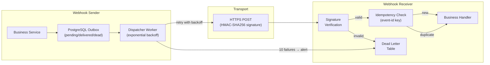

# Webhook Delivery Reliability

Status: Draft | Last Reviewed: 2026-05-28 | Owner: @tech-lead-backend
Catalog ID: INT-014 | Radii
Tier Applicability: T0, T1

## Problem Statement

A payment gateway posts a webhook to a merchant's callback URL when a transaction completes. The merchant's server is overloaded and returns HTTP 500. The gateway logs "delivery failed" and moves on. The merchant never reconciles the transaction; the customer disputes the charge two days later. There was no retry, no dead-letter queue, no audit trail — just a single fire-and-forget HTTP POST that silently vanished.

Webhooks are the de-facto mechanism for pushing events to external partners and internal services that cannot maintain a persistent connection. Banking systems use them extensively: card networks push settlement confirmations, payment gateways notify merchants, fraud systems alert downstream risk engines. Because webhooks cross process and often organisational boundaries, their delivery cannot be assumed reliable. Network partitions, partner downtime, TLS renegotiations, and overloaded servers all cause transient failures. Without a structured retry policy, exponential backoff, signature verification, and a dead-letter queue, webhook delivery becomes the weakest link in the event-driven integration chain — failing silently when it matters most.

## Context

The pattern applies to any service that acts as a webhook sender (the gateway) or a webhook receiver (the consumer) within the banking platform. Sender services include the payment gateway, card transaction processor, and NAPAS settlement adapter. Receiver services include merchant-facing notification endpoints and internal risk/fraud engines that subscribe to card-network callbacks. The platform uses Kafka as the internal event bus (INT-001); webhooks are the bridge to systems that cannot consume Kafka directly. The CloudEvents envelope standard (INT-011) is used to wrap webhook payloads for interoperability.

Webhook delivery reliability sits at the boundary between the bank's event-driven platform (which has Kafka guarantees) and the external HTTP world (which does not). The challenge is preserving at-least-once delivery semantics across that boundary while protecting receivers from replay attacks and protecting the bank from liability when delivery fails.

## Solution

A dedicated webhook dispatcher service persists each outbound webhook to a PostgreSQL `outbox` table before attempting delivery. A background worker reads from the outbox, attempts HTTP POST with HMAC-SHA256 payload signature, and records the outcome. On failure, it applies exponential backoff with jitter (initial delay 1s, max 512s, multiplier 2×, jitter ±20%). After 10 failed attempts over approximately 3 hours, the event is moved to a dead-letter table and an alert fires. Receiver services must validate the HMAC signature and respond idempotently using the `X-Webhook-Event-ID` header as the deduplication key.



## Implementation Guidelines

**1. Outbox table and dispatcher service**

```sql
-- migrations/V014__webhook_outbox.sql
CREATE TABLE webhook_outbox (
    id            UUID PRIMARY KEY DEFAULT gen_random_uuid(),
    event_id      UUID NOT NULL UNIQUE,
    target_url    TEXT NOT NULL,
    payload       JSONB NOT NULL,
    signature_key TEXT NOT NULL,
    status        TEXT NOT NULL DEFAULT 'pending'
                  CHECK (status IN ('pending','delivering','delivered','dead')),
    attempt_count INT  NOT NULL DEFAULT 0,
    next_attempt_at TIMESTAMPTZ NOT NULL DEFAULT now(),
    last_error    TEXT,
    created_at    TIMESTAMPTZ NOT NULL DEFAULT now(),
    updated_at    TIMESTAMPTZ NOT NULL DEFAULT now()
);

CREATE INDEX idx_webhook_outbox_pending
    ON webhook_outbox (next_attempt_at)
    WHERE status IN ('pending', 'delivering');
```

```java
// src/main/java/com/banking/webhook/WebhookDispatcher.java
@Scheduled(fixedDelay = 1000)
public void dispatch() {
    List<WebhookOutbox> due = outboxRepo.findDue(Instant.now(), 50);
    for (WebhookOutbox event : due) {
        try {
            outboxRepo.markDelivering(event.getId());
            String signature = hmacSha256(event.getSignatureKey(), event.getPayload());
            ResponseEntity<Void> response = restTemplate.execute(
                event.getTargetUrl(), HttpMethod.POST,
                req -> {
                    req.getHeaders().set("X-Webhook-Event-ID", event.getEventId().toString());
                    req.getHeaders().set("X-Webhook-Signature-256", "sha256=" + signature);
                    req.getHeaders().set("Content-Type", "application/json");
                    req.getBody().write(event.getPayload().getBytes(StandardCharsets.UTF_8));
                },
                resp -> null
            );
            outboxRepo.markDelivered(event.getId());
        } catch (Exception ex) {
            int attempts = event.getAttemptCount() + 1;
            if (attempts >= 10) {
                outboxRepo.markDead(event.getId(), ex.getMessage());
            } else {
                long delaySeconds = (long) (Math.pow(2, attempts) + (Math.random() * Math.pow(2, attempts) * 0.2));
                outboxRepo.scheduleRetry(event.getId(), attempts, delaySeconds, ex.getMessage());
            }
        }
    }
}

private String hmacSha256(String key, String payload) throws Exception {
    Mac mac = Mac.getInstance("HmacSHA256");
    mac.init(new SecretKeySpec(key.getBytes(StandardCharsets.UTF_8), "HmacSHA256"));
    return Hex.encodeHexString(mac.doFinal(payload.getBytes(StandardCharsets.UTF_8)));
}
```

**2. Receiver — signature verification and idempotency**

```java
// src/main/java/com/banking/merchant/WebhookController.java
@PostMapping("/webhooks/payment")
public ResponseEntity<Void> receivePayment(
        @RequestHeader("X-Webhook-Event-ID") String eventId,
        @RequestHeader("X-Webhook-Signature-256") String signature,
        @RequestBody String rawBody) {

    // 1. Verify signature
    String expectedSig = "sha256=" + hmacSha256(webhookSigningSecret, rawBody);
    if (!MessageDigest.isEqual(expectedSig.getBytes(), signature.getBytes())) {
        log.warn("webhook.signature.invalid eventId={}", eventId);
        return ResponseEntity.status(HttpStatus.UNAUTHORIZED).build();
    }

    // 2. Idempotency guard
    if (webhookIdempotencyRepo.exists(eventId)) {
        log.info("webhook.duplicate eventId={}", eventId);
        return ResponseEntity.ok().build();
    }

    // 3. Process
    PaymentWebhookEvent event = objectMapper.readValue(rawBody, PaymentWebhookEvent.class);
    merchantReconciliationService.process(event);
    webhookIdempotencyRepo.record(eventId);
    return ResponseEntity.ok().build();
}
```

**3. Prometheus metrics + alert**

```yaml
# prometheus/rules/webhook.yml
groups:
  - name: webhook_delivery
    rules:
      - alert: WebhookDeliveryDeadLetterQueued
        expr: increase(webhook_outbox_dead_total[5m]) > 0
        for: 1m
        labels:
          severity: critical
        annotations:
          summary: "Webhook moved to dead-letter queue — merchant will not receive event"

      - alert: WebhookDeliveryAttemptLag
        expr: webhook_outbox_pending_oldest_age_seconds > 1800
        for: 5m
        labels:
          severity: warning
        annotations:
          summary: "Webhook pending for >30 min — dispatcher may be stuck"
```

## When to Use

- Notifying external merchant systems or card-network callbacks where Kafka is not available
- Any cross-boundary event delivery where the receiver cannot maintain a persistent connection
- Regulatory scenarios requiring a durable audit trail of every notification attempt (SBV Circular 09/2020 §IV.3)
- When the receiver SLA for notification is ≤3 hours (10 retries with max backoff ~3h)

## When Not to Use

- Internal service-to-service events where both services can consume Kafka — use Kafka directly (INT-001)
- High-throughput internal telemetry (>10,000 events/second) — webhook per-event HTTP round-trips are too expensive
- When the receiver does not expose an HTTPS endpoint with a valid certificate — do not disable TLS verification

## Variants

| Variant | When to prefer | Trade-off |
|---------|----------------|-----------|
| PostgreSQL outbox (this pattern) | Services already use PostgreSQL; transactional outbox guarantees atomicity | Adds polling overhead; requires outbox table maintenance |
| Kafka-backed dispatcher | Very high volume (>1,000 webhooks/sec); dispatcher already uses Kafka | More complex; DLQ management in Kafka not SQL |
| AWS EventBridge + SQS DLQ | Teams on AWS; native managed retry + DLQ | AWS lock-in; harder to inspect dead letters |
| Redis streams dispatcher | Sub-second retry latency required; team comfortable with Redis | Redis is not a durable write-ahead log; risk of data loss on crash |

## NFR Acceptance Criteria

```yaml
nfr_acceptance_criteria:
  catalog_id: INT-014
  pattern: Webhook Delivery Reliability
  performance:
    - id: INT-014-HP-01
      description: Webhook dispatcher must attempt first delivery within 5 seconds of event insertion into the outbox.
      threshold: first_attempt_latency < 5s
    - id: INT-014-HP-02
      description: Signature verification at the receiver must complete within 10ms at p99.
      threshold: signature_verification_p99 < 10ms
  reliability:
    - id: INT-014-REL-01
      description: At-least-once delivery guarantee — every outbox event must be delivered or moved to dead-letter within 3 hours.
      threshold: delivery_or_dead_within_3h = 100%
    - id: INT-014-REL-02
      description: Receiver must process duplicate events idempotently — no duplicate business effect on retry.
      threshold: duplicate_processing_errors = 0
  compliance:
    - id: INT-014-COMP-01
      description: Every webhook delivery attempt (success or failure) must be recorded in the outbox table with timestamp, attempt count, and HTTP response code.
      threshold: 0 unlogged delivery attempts
```

## Compliance Mapping

| Ring | Regulation | Provision | How this pattern satisfies |
|------|-----------|-----------|---------------------------|
| Ring 0 | OWASP API Security Top 10 | API8:2023 — Security Misconfiguration: webhook endpoints must validate signatures to prevent spoofed callbacks | HMAC-SHA256 signature on every delivery + receiver-side constant-time comparison prevents signature bypass; TLS required for all webhook endpoints |
| Ring 1 | PCI DSS v4.0 | Requirement 6.4.3 — all payment-related integrations must use authenticated communication channels with integrity verification | HMAC-SHA256 signature on payment webhook payloads provides message integrity; `X-Webhook-Event-ID` provides non-repudiation trail for card dispute resolution |
| Ring 2 | SBV Circular 09/2020 | §IV.3 — electronic transaction notifications to customers and partners must be reliably delivered with audit evidence | Outbox table with attempt_count, last_error, status, and timestamps provides the durable delivery audit trail required by §IV.3; dead-letter alerting ensures no notification silently fails ⚠️ (working summary — pending Legal review) |

## Cost / FinOps Notes

- PostgreSQL outbox table: at 10,000 webhooks/day × 10 retry rows average = 100,000 rows/day; at 1 KB/row = 100 MB/day — rotate delivered rows after 30 days → ~3 GB steady-state storage
- Dispatcher CPU: 1 replica at 0.25 CPU / 256 MB RAM for up to 500 webhooks/second; scale to 3 replicas for burst
- Dead-letter retention: 90 days for PCI audit trail; beyond that, archive to cold storage at ~USD 0.004/GB/month
- No additional infrastructure cost if PostgreSQL is already provisioned — outbox is a table, not a new service

## Threat Model

**Forged Webhook Delivery — attacker sends a fabricated webhook to a receiver endpoint (Spoofing)**: an attacker who discovers the receiver's webhook URL sends a crafted HTTP POST impersonating the payment gateway. If the receiver processes it without signature verification, a fraudulent transaction confirmation is posted to the merchant's system. Mitigation: the receiver computes HMAC-SHA256 using the shared signing secret and performs a constant-time comparison with `MessageDigest.isEqual` to prevent timing oracle attacks; any request with an invalid or missing signature is rejected with HTTP 401 and logged to the SIEM.

**Webhook Replay Attack — re-delivery of a captured valid webhook (Repudiation)**: an attacker who captures a legitimate signed webhook re-submits it hours later after the receiver has already processed the original. Without idempotency, the receiver would process the payment confirmation twice, crediting the merchant twice. Mitigation: the `X-Webhook-Event-ID` is stored in the `webhook_idempotency` table on first processing; subsequent deliveries with the same event ID return HTTP 200 without re-executing business logic; the idempotency table is retained for 7 days (beyond the maximum 3-hour retry window).

## Operational Runbook (stub)

1. Alert: WebhookDeliveryDeadLetterQueued — fires when any webhook moves to the dead-letter table. p50 resolution: 30 min; p99: 2 hours. Query dead letters: `SELECT id, target_url, last_error, attempt_count, updated_at FROM webhook_outbox WHERE status = 'dead' ORDER BY updated_at DESC LIMIT 20;`. Common causes: receiver HTTPS certificate expired (verify with `curl -I <target_url>`), receiver returning persistent 4xx (check `last_error` for body), DNS failure for target domain. For transient failures, reset the status to 'pending' and `next_attempt_at = now()` to force immediate retry. For permanent failures, notify the partner via the SRE escalation path and record an incident.

2. Alert: WebhookDeliveryAttemptLag — fires when the oldest pending webhook is more than 30 minutes old. p50 resolution: 10 min; p99: 30 min. Check dispatcher pod health: `kubectl get pods -n integration -l app=webhook-dispatcher`. Common cause: dispatcher pod crash-looped (OOM or database connection pool exhaustion). Restart the pod and confirm outbox entries resume delivery. If the database connection pool is exhausted, check `pg_stat_activity` for long-running transactions holding connections.

## Test Strategy

**Unit**: `WebhookDispatcherTest` — mock the outbox repository; insert a pending event; call `dispatch()`; assert the HTTP POST was made with the correct `X-Webhook-Signature-256` header; assert the outbox row is marked `delivered`; insert an event; make the HTTP client throw `ConnectException`; assert the row is rescheduled with `attempt_count = 1` and `next_attempt_at` approximately 2 seconds in the future; call `dispatch()` 10 more times with the same failure; assert the row is marked `dead`.

**Integration**: Use Testcontainers (PostgreSQL + WireMock); insert 5 pending webhooks; start the dispatcher; assert all 5 are delivered within 10 seconds; configure WireMock to return 500 for 3 then 200; assert the event is eventually delivered on attempt 4 with correct retry timestamps; configure WireMock to return 500 permanently; assert the event is marked `dead` after 10 attempts.

**Contract**: `WebhookReceiverContractTest` — post a valid signed payload with a unique `X-Webhook-Event-ID`; assert HTTP 200 and that the business handler was invoked; post the same payload again with the same event ID; assert HTTP 200 but the handler was NOT invoked a second time (idempotency); post with an invalid signature; assert HTTP 401 and handler not invoked.

**Compliance**: `WebhookAuditTest` — insert a webhook event; simulate 3 failed deliveries then 1 success; assert the outbox table records all 4 attempts with timestamps and HTTP response codes; assert no attempt record is missing (complete audit trail for PCI DSS evidence).

## Related Patterns

- [INT-001 Saga Orchestration](saga-orchestration.md) — saga events crossing the Kafka boundary to external partners are dispatched via this webhook pattern
- [INT-011 CloudEvents Envelope](cloudevents-envelope.md) — webhook payloads use CloudEvents structure for interoperability and receiver-side schema validation
- [INT-013 Schema Registry Governance](schema-registry-governance.md) — webhook payload schemas are registered in the schema registry to ensure producer/consumer compatibility
- [SEC-007 Vault Secret Management](../security/vault-secret-management.md) — HMAC signing keys are stored in Vault and injected at runtime; never in environment variables or application config
- [OBS-008 Log Aggregation Pipeline](../observability/log-aggregation-pipeline.md) — webhook delivery attempts (success, retry, dead-letter) are shipped to OpenSearch as structured audit logs

## References

- RFC 2104 — HMAC: Keyed-Hashing for Message Authentication
- CloudEvents Specification v1.0.2 — event envelope for webhook payloads
- PCI DSS v4.0 Requirement 6.4.3 — authenticated communication for payment integrations
- SBV Circular 09/2020 §IV.3 — electronic notification reliability requirements
- The Outbox Pattern — Reliable messaging between microservices (microservices.io)

---
**Key Takeaway**: Persist every outbound webhook to a PostgreSQL outbox before delivery, retry with exponential backoff up to 10 attempts, sign every payload with HMAC-SHA256, and validate the signature plus deduplicate by event ID on the receiver — so webhook delivery is at-least-once, tamper-evident, and fully auditable for PCI and SBV compliance.
