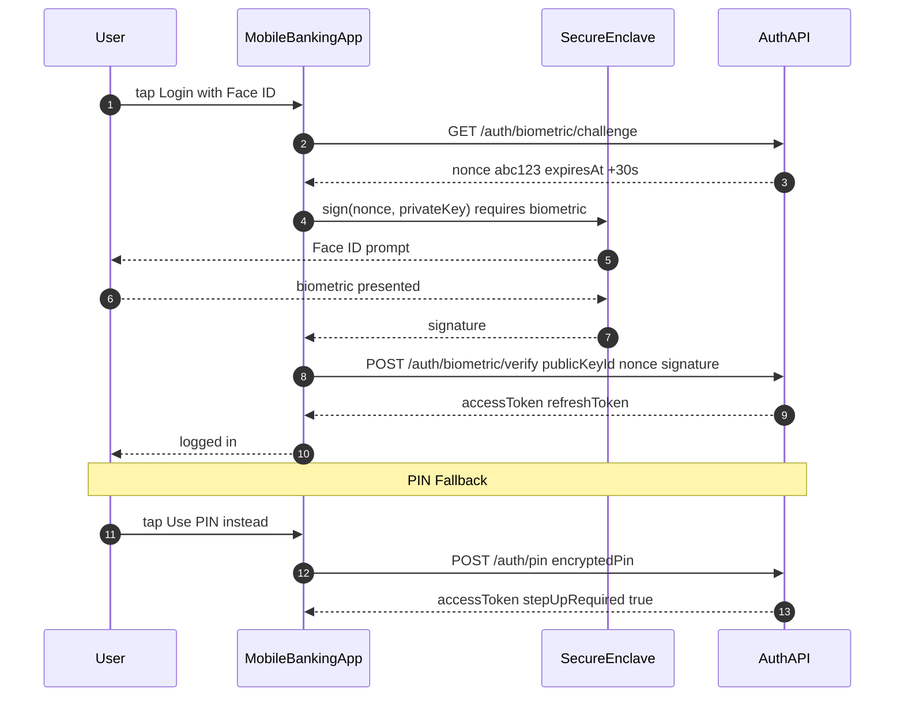

# Mobile Biometric Authentication

Status: Draft | Catalog ID: MOB-003 | Owner: @tech-lead-mobile
Tier Applicability: T0, T1

## Problem Statement

- Password-only authentication for mobile banking creates friction at login and encourages weak passwords; Vietnamese banks face regulatory pressure from SBV Circular 09/2020 §III.2 to implement multi-factor authentication for internet banking.
- A biometric-only implementation without PIN fallback leaves users locked out if biometrics become unavailable (wet fingers, face mask, hardware failure), creating a T0 availability problem.
- Biometric authentication that unlocks the session token directly (without a hardware-bound cryptographic key) is trivially defeated by an attacker who extracts the token file — biometrics become theatre without a Secure Enclave / StrongBox binding.
- The `LAContext.evaluatePolicy(.deviceOwnerAuthentication)` flag on iOS allows PIN as a fallback to biometrics at the OS level; an attacker who knows the PIN can bypass biometrics entirely — for high-value operations, PIN should require step-up MFA via the backend.

## Context

Biometric authentication applies to T0/T1 mobile banking sessions: app unlock, transaction confirmation for amounts above a threshold, and sensitive settings changes. The pattern binds the session private key (or decryption key for the stored token) to the biometric set in the Secure Enclave / StrongBox — the key is unusable without a successful biometric challenge. The backend Spring Boot PIN fallback endpoint issues a short-lived token valid for one step-up operation.

## Solution

A hardware-backed asymmetric key pair is generated in the Secure Enclave (iOS) / StrongBox (Android) with user authentication required. On biometric success, the OS releases the private key for a single sign operation; the app signs a challenge nonce from the server. The server verifies the signature against the registered public key and issues a session token. For PIN fallback, the app calls a separate `/auth/pin` endpoint that performs server-side PIN verification with rate limiting (Resilience4j) and issues a downgraded token flagged for step-up requirements.



## Implementation Guidelines

### 1. iOS — Biometric Key Generation and Sign

```swift
import CryptoKit
import LocalAuthentication
import Security

enum KeychainError: Error {
    case itemNotFound
    case unexpectedStatus(OSStatus)
}

final class BiometricAuthManager {

    static let keyAlias = "tcb.biometric.auth.key"

    static func generateKeyPair() throws -> SecKey {
        var error: Unmanaged<CFError>?
        guard let accessControl = SecAccessControlCreateWithFlags(
            nil,
            kSecAttrAccessibleWhenUnlockedThisDeviceOnly,
            [.biometryCurrentSet, .privateKeyUsage],
            &error
        ) else {
            throw error!.takeRetainedValue() as Error
        }

        let attributes: [CFString: Any] = [
            kSecAttrKeyType: kSecAttrKeyTypeECSECPrimeRandom,
            kSecAttrKeySizeInBits: 256,
            kSecAttrTokenID: kSecAttrTokenIDSecureEnclave,
            kSecPrivateKeyAttrs: [
                kSecAttrIsPermanent: true,
                kSecAttrApplicationTag: keyAlias.data(using: .utf8)!,
                kSecAttrAccessControl: accessControl
            ]
        ]

        guard let privateKey = SecKeyCreateRandomKey(attributes as CFDictionary, &error) else {
            throw error!.takeRetainedValue() as Error
        }
        return privateKey
    }

    static func sign(nonce: Data) throws -> Data {
        let query: [CFString: Any] = [
            kSecClass: kSecClassKey,
            kSecAttrApplicationTag: keyAlias.data(using: .utf8)!,
            kSecAttrKeyType: kSecAttrKeyTypeECSECPrimeRandom,
            kSecReturnRef: true
        ]
        var keyRef: AnyObject?
        guard SecItemCopyMatching(query as CFDictionary, &keyRef) == errSecSuccess,
              let privateKey = keyRef as! SecKey? else {
            throw KeychainError.itemNotFound
        }

        var signError: Unmanaged<CFError>?
        guard let signature = SecKeyCreateSignature(
            privateKey,
            .ecdsaSignatureMessageX962SHA256,
            nonce as CFData,
            &signError
        ) else {
            throw signError!.takeRetainedValue() as Error
        }
        return signature as Data
    }
}
```

### 2. Android — BiometricPrompt with CryptoObject

```kotlin
import android.security.keystore.KeyGenParameterSpec
import android.security.keystore.KeyProperties
import androidx.biometric.BiometricPrompt
import androidx.core.content.ContextCompat
import java.security.KeyPairGenerator
import java.security.Signature

object BiometricAuthManager {

    private const val KEY_ALIAS = "tcb_biometric_auth_key"

    fun generateKeyPair() {
        val keyPairGenerator = KeyPairGenerator.getInstance(
            KeyProperties.KEY_ALGORITHM_EC, "AndroidKeyStore")
        keyPairGenerator.initialize(
            KeyGenParameterSpec.Builder(KEY_ALIAS,
                KeyProperties.PURPOSE_SIGN)
                .setDigests(KeyProperties.DIGEST_SHA256)
                .setUserAuthenticationRequired(true)
                .setIsStrongBoxBacked(true)
                .setInvalidatedByBiometricEnrollment(true)
                .build()
        )
        keyPairGenerator.generateKeyPair()
    }

    fun showBiometricPrompt(
        activity: androidx.fragment.app.FragmentActivity,
        nonce: ByteArray,
        onSuccess: (signature: ByteArray) -> Unit,
        onError: (errorCode: Int, message: String) -> Unit
    ) {
        val keyStore = java.security.KeyStore.getInstance("AndroidKeyStore")
        keyStore.load(null)
        val privateKey = keyStore.getKey(KEY_ALIAS, null)

        val signature = Signature.getInstance("SHA256withECDSA").also {
            it.initSign(privateKey as java.security.PrivateKey)
            it.update(nonce)
        }

        val biometricPrompt = BiometricPrompt(activity,
            ContextCompat.getMainExecutor(activity),
            object : BiometricPrompt.AuthenticationCallback() {
                override fun onAuthenticationSucceeded(result: BiometricPrompt.AuthenticationResult) {
                    val sig = result.cryptoObject?.signature?.sign() ?: return
                    onSuccess(sig)
                }
                override fun onAuthenticationError(errorCode: Int, errString: CharSequence) {
                    onError(errorCode, errString.toString())
                }
            })

        val promptInfo = BiometricPrompt.PromptInfo.Builder()
            .setTitle("Xác thực sinh trắc học")
            .setSubtitle("Đăng nhập vào TCB Mobile")
            .setNegativeButtonText("Dùng mã PIN")
            .setAllowedAuthenticators(BiometricPrompt.Authenticators.BIOMETRIC_STRONG)
            .build()

        biometricPrompt.authenticate(promptInfo, BiometricPrompt.CryptoObject(signature))
    }
}
```

### 3. Spring Boot — Challenge + Verify Endpoints

```java
@RestController
@RequestMapping("/auth/biometric")
@RequiredArgsConstructor
public class BiometricAuthController {

    private final ChallengeStore challengeStore; // Redis-backed, TTL 30s
    private final PublicKeyRegistry keyRegistry;
    private final TokenIssuer tokenIssuer;

    @GetMapping("/challenge")
    public ChallengeResponse getChallenge(Authentication auth) {
        String nonce = Base64.getEncoder().encodeToString(
            java.security.SecureRandom.getInstanceStrong().generateSeed(32));
        challengeStore.store(auth.getName(), nonce, Duration.ofSeconds(30));
        return new ChallengeResponse(nonce, Instant.now().plusSeconds(30));
    }

    @PostMapping("/verify")
    public TokenResponse verify(@RequestBody BiometricVerifyRequest req) {
        String storedNonce = challengeStore.consume(req.publicKeyId())
            .orElseThrow(() -> new ResponseStatusException(
                HttpStatus.UNAUTHORIZED, "Nonce expired or not found"));

        ECPublicKey publicKey = keyRegistry.findByPublicKeyId(req.publicKeyId())
            .orElseThrow(() -> new ResponseStatusException(
                HttpStatus.UNAUTHORIZED, "Public key not registered"));

        boolean valid = verifyEcdsaSignature(
            publicKey, Base64.getDecoder().decode(storedNonce),
            Base64.getDecoder().decode(req.signature()));
        if (!valid) throw new ResponseStatusException(HttpStatus.UNAUTHORIZED, "Invalid signature");

        return tokenIssuer.issue(req.publicKeyId());
    }

    private boolean verifyEcdsaSignature(ECPublicKey key, byte[] data, byte[] signature) {
        try {
            Signature sig = Signature.getInstance("SHA256withECDSA");
            sig.initVerify(key);
            sig.update(data);
            return sig.verify(signature);
        } catch (Exception e) {
            return false;
        }
    }
}
```

## When to Use

- T0/T1 mobile banking session authentication where password friction must be reduced while maintaining NIST SP 800-63B AAL2.
- Transaction confirmation for transfers above a configurable threshold (e.g., VND 10M) where a second-factor biometric challenge provides regulatory evidence of user consent.
- Environments where the device supports Secure Enclave / StrongBox — always request hardware-backed key generation and degrade gracefully to software keystore for older devices.

## When Not to Use

- Background session refresh — biometrics are user-interactive; use a silent refresh token (stored in Keychain/Keystore per MOB-002) for background token renewal without user interaction.
- Devices without a passcode set — iOS `LAContext` and Android BiometricManager report biometrics unavailable if no device passcode/PIN is configured; always prompt the user to set a device lock before enabling biometric auth.
- Step-up for purely informational views (account balance read-only) — biometric prompt frequency irritates users; reserve for mutations (transfer, payment) and sensitive data reveal (full card number).

## Variants

| Variant | When to prefer | Trade-off |
|---------|---------------|-----------|
| Hardware-bound challenge-response (this pattern) | T0/T1 production; regulatory AAL2; NIST SP 800-63B compliance | Requires challenge API endpoint; key invalidated on biometric set change |
| Biometric-unlock of stored token (simpler) | T2/T3 apps; lower security requirement | Token can be extracted if keychain protection is bypassed; biometric is UI gate only |
| FIDO2 / WebAuthn (platform authenticator) | Web + mobile federated auth; open banking PSD2 | Higher implementation complexity; browser/WebView support required |

## NFR Acceptance Criteria

| Metric | Threshold | Measurement |
|--------|-----------|-------------|
| Biometric prompt to token p99 | ≤ 2 s (Face ID: ≤ 500 ms; network: ≤ 1.5 s) | E2E instrumented test: tap biometric → token received; assert p99 ≤ 2 s |
| Challenge nonce TTL | 30 s (Redis TTL) | Test: fetch nonce; wait 31 s; verify → assert 401 Nonce expired |
| Key invalidation on biometric change | 100% invalidation | Enroll new fingerprint (Android); assert KeyPermanentlyInvalidatedException on next sign attempt |
| Availability | T0/T1 — 99.95% (backend challenge endpoint) | Prometheus uptime on /auth/biometric/*; assert 99.95% over 30 days |
| RTO | ≤ 2 min (challenge service pod restart) | Chaos test: kill challenge pod; measure time to first successful challenge response |

## Compliance Mapping

| Ring | Regulation | Provision | How this pattern satisfies |
|------|-----------|-----------|---------------------------|
| Ring 0 | NIST SP 800-63B | AAL2 — two authentication factors required | Biometric (something you are) + device possession (something you have — Secure Enclave / StrongBox hardware key); satisfies AAL2 without OTP SMS. |
| Ring 1 | PCI-DSS v4.0 | §8.4 — multi-factor authentication for all non-console administrative access and all access to the CDE | Hardware-bound biometric authentication satisfies the "something you are" factor; combined with device possession (hardware key) this satisfies PCI-DSS MFA requirements for mobile CDE access. |
| Ring 2 | SBV Circular 09/2020 | §III.2 — two-factor authentication requirements for internet banking ⚠️ (working summary — pending Legal review) | Challenge-response with hardware-bound biometric key satisfies the two-factor requirement (biometric + device possession); Legal review required to confirm that this mechanism satisfies SBV §III.2 in full, particularly regarding OTP SMS as an alternative factor. |

## Cost / FinOps

- Challenge endpoint: 1 Redis write + 1 Redis read per authentication; at 100,000 daily logins = 200,000 Redis ops/day — negligible on a shared cluster.
- Secure Enclave key generation: one-time per enrollment; ≤ 500 ms per user; cost is negligible.
- Backend verify endpoint: 1 ECDSA verification (< 1 ms CPU) + 1 Redis consume + 1 token issue; 3 operations per login — negligible at 100,000 logins/day.
- Cost of NOT implementing biometric auth: SBV MFA requirement non-compliance risk; customer churn from password friction; typical mAU improvement from biometric auth is 15–25% (industry benchmark).

## Threat Model

- **Biometric bypass via deviceOwnerAuthentication flag (Elevation of Privilege)**: If `LAContext.evaluatePolicy(.deviceOwnerAuthentication)` is used (iOS), a user who knows the device PIN can bypass biometric authentication entirely. Mitigation: always use `.deviceOwnerAuthenticationWithBiometrics` for banking operations; PIN fallback routes through a separate backend endpoint with additional rate limiting and step-up requirements, not through the biometric key.
- **Key invalidation on biometric enrollment change (Denial of Service)**: An attacker who can enroll their biometric on the victim device invalidates the biometric key, locking the legitimate user out. Mitigation: `setInvalidatedByBiometricEnrollment(true)` (Android) is the correct behavior — key invalidation is detected on next use; app shows "biometric data changed, please re-enroll via PIN" flow; this is preferable to allowing the attacker's biometric to unlock the victim's account.

## Runbook Stub

**Alert: `biometric_challenge_error_rate > 5%`** (Grafana / Prometheus on `/auth/biometric/verify`)
- p50 baseline: ≤ 0.1% error rate | p99 SLO: ≤ 1%
- Remediation: (1) Check if Redis (challenge store) is healthy — `redis-cli ping`. (2) If Redis is down, challenge verification fails for all users — P1 incident. (3) Check app version distribution — a recent app update may have changed the signing algorithm; compare error rate by app version. (4) If `InvalidSignatureException` dominates, check if server-side public key registry is current.

## Test Strategy Stub

- **Unit (iOS XCTest)**: Mock `SecKeyCreateRandomKey` success → assert key stored in Keychain. Mock `SecKeyCreateSignature` success → assert signature bytes returned. Mock `errSecItemNotFound` → assert `itemNotFound` thrown.
- **Unit (Spring Boot)**: Mock valid signature → assert 200 + token. Mock expired nonce → assert 401. Mock invalid signature → assert 401.
- **Integration (iOS Device)**: `generateKeyPair()` → `sign(testNonce)` → assert signature length > 0. Spring Boot integration: register public key; call challenge endpoint; sign nonce; call verify endpoint; assert token issued.
- **Integration (Android)**: `generateKeyPair()` on StrongBox device → assert `isInsideSecureHardware = true`.
- **Chaos**: Enroll new fingerprint (Android test) → assert `KeyPermanentlyInvalidatedException` thrown on subsequent sign attempt; assert app shows re-enrollment flow. Kill challenge Redis mid-flow → assert 503 returned with Retry-After header; assert circuit breaker opens after 5 consecutive failures.

## Related Patterns

- [MOB-002 Mobile Secure Storage](mobile-secure-storage.md) — hardware-backed key storage used by this pattern
- [SEC-011 Session Revocation](../../patterns/security/session-revocation.md) — session management post biometric login

## References

- [Apple LocalAuthentication Framework](https://developer.apple.com/documentation/localauthentication)
- [Android BiometricPrompt API](https://developer.android.com/reference/androidx/biometric/BiometricPrompt)
- [NIST SP 800-63B — Digital Identity Guidelines](https://pages.nist.gov/800-63-3/sp800-63b.html)
- [PCI-DSS v4.0 §8 — Identify Users and Authenticate Access](https://www.pcisecuritystandards.org/document_library/)
- Catalog reference: `governance/standards/enterprise-architecture-catalog.md`
