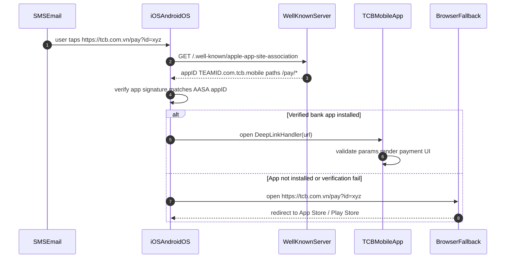

# Mobile Deep Link Attestation

Status: Draft | Catalog ID: MOB-005 | Owner: @tech-lead-mobile
Tier Applicability: T0, T1

## Problem Statement

- Custom URL scheme deep links (`tcb://payment?id=abc`) can be registered by any installed app, allowing a malicious app to intercept payment deep links and redirect the user to a phishing UI.
- A payment link shared via SMS or email that opens in the browser instead of the bank app can be used for phishing — the user may not distinguish a spoofed web page from the legitimate app.
- Attackers can craft SMS messages with fake payment confirmation deep links that, if intercepted by a malicious app, silently collect payment parameters (amount, recipient) before forwarding to the legitimate app.
- Without server-hosted attestation files (`apple-app-site-association.json`, `assetlinks.json`), iOS Universal Links and Android App Links fall back to browser, degrading to URL-scheme deep links that are vulnerable to interception.

## Context

Deep link attestation applies to T0/T1 payment flows and OTP redirects where the link must open exclusively in the bank's verified app. Universal Links (iOS) and App Links (Android) use server-hosted attestation files to verify that only the signed bank app can claim the URL domain — a rogue app cannot intercept these links.

## Solution

The bank's domain hosts `/.well-known/apple-app-site-association` (iOS) and `/.well-known/assetlinks.json` (Android), served with the correct Content-Type and no redirect. iOS verifies the `appID` in the AASA file against the signed app's bundle ID and Team ID at install time — only the verified app handles the URL. Android verifies the SHA-256 certificate fingerprint in `assetlinks.json` against the APK signing certificate. A Spring Boot controller serves both files with strict caching headers. Deep links that fail attestation fall back to the bank's HTTPS web page (no custom scheme fallback).



## Implementation Guidelines

### 1. Spring Boot — Serve Attestation Files

```java
@Controller
@RequestMapping("/.well-known")
public class AttestationController {

    @GetMapping(value = "/apple-app-site-association",
                produces = "application/json")
    @ResponseBody
    public String appleAppSiteAssociation() {
        return """
            {
              "applinks": {
                "details": [
                  {
                    "appIDs": ["ABCDE12345.com.tcb.mobile"],
                    "components": [
                      { "/": "/pay/*", "comment": "Payment deep links" },
                      { "/": "/otp/*", "comment": "OTP redirect links" }
                    ]
                  }
                ]
              }
            }
            """;
    }

    @GetMapping(value = "/assetlinks.json",
                produces = "application/json")
    @ResponseBody
    public String assetLinks() {
        return """
            [{
              "relation": ["delegate_permission/common.handle_all_urls"],
              "target": {
                "namespace": "android_app",
                "package_name": "com.tcb.mobile",
                "sha256_cert_fingerprints": [
                  "AA:BB:CC:DD:EE:FF:00:11:22:33:44:55:66:77:88:99:AA:BB:CC:DD:EE:FF:00:11:22:33:44:55:66:77:88:99"
                ]
              }
            }]
            """;
    }
}
```

The SHA-256 fingerprint must be the production signing certificate fingerprint, not the debug keystore. Update in CI/CD as part of the release process.

### 2. iOS — Universal Link Handler

```swift
// AppDelegate.swift / SceneDelegate.swift
func application(_ application: UIApplication,
                 continue userActivity: NSUserActivity,
                 restorationHandler: @escaping ([UIUserActivityRestoring]?) -> Void) -> Bool {
    guard userActivity.activityType == NSUserActivityTypeBrowsingWeb,
          let url = userActivity.webpageURL else { return false }
    return DeepLinkRouter.shared.handle(url: url)
}

// DeepLinkRouter.swift
final class DeepLinkRouter {
    static let shared = DeepLinkRouter()

    func handle(url: URL) -> Bool {
        guard url.host == "tcb.com.vn" else { return false }
        switch url.path {
        case let path where path.hasPrefix("/pay/"):
            let paymentId = String(path.dropFirst("/pay/".count))
            guard isValidUUID(paymentId) else { return false }
            navigateToPayment(id: paymentId)
            return true
        case let path where path.hasPrefix("/otp/"):
            let otpToken = String(path.dropFirst("/otp/".count))
            navigateToOTPConfirmation(token: otpToken)
            return true
        default:
            return false
        }
    }

    private func isValidUUID(_ value: String) -> Bool {
        UUID(uuidString: value) != nil
    }
}
```

### 3. Android — App Links Intent Filter

```xml
<!-- AndroidManifest.xml -->
<activity android:name=".DeepLinkActivity"
          android:exported="true">
    <intent-filter android:autoVerify="true">
        <action android:name="android.intent.action.VIEW" />
        <category android:name="android.intent.category.DEFAULT" />
        <category android:name="android.intent.category.BROWSABLE" />
        <data android:scheme="https"
              android:host="tcb.com.vn"
              android:pathPrefix="/pay/" />
        <data android:scheme="https"
              android:host="tcb.com.vn"
              android:pathPrefix="/otp/" />
    </intent-filter>
</activity>
```

```kotlin
// DeepLinkActivity.kt
class DeepLinkActivity : AppCompatActivity() {
    override fun onCreate(savedInstanceState: Bundle?) {
        super.onCreate(savedInstanceState)
        val uri = intent?.data ?: run { finish(); return }
        when {
            uri.path?.startsWith("/pay/") == true -> {
                val paymentId = uri.lastPathSegment
                    ?.let { if (it.matches(UUID_REGEX)) it else null }
                    ?: run { finish(); return }
                startActivity(PaymentConfirmationActivity.intent(this, paymentId))
            }
            uri.path?.startsWith("/otp/") == true -> {
                startActivity(OtpConfirmationActivity.intent(this, uri.getQueryParameter("token")))
            }
        }
        finish()
    }
    companion object {
        private val UUID_REGEX = Regex(
            "[0-9a-f]{8}-[0-9a-f]{4}-[0-9a-f]{4}-[0-9a-f]{4}-[0-9a-f]{12}")
    }
}
```

## When to Use

- Payment confirmation links, OTP redirect links, or any URL shared via SMS/email/QR that must open in the verified bank app.
- Features where custom URL scheme interception by rogue apps creates a phishing or data exfiltration risk.
- Any T0/T1 flow where the integrity of the link-to-app handoff must be cryptographically verified by the OS.

## When Not to Use

- Internal app navigation (tab switching, in-app routing) — use `NavigationController.pushViewController` / `NavController.navigate()` directly; deep links add indirection with no security benefit for in-app flows.
- Test environments without a valid HTTPS domain — Universal Links and App Links require HTTPS; use custom schemes (`tcb-dev://`) for debug builds only, never in production.
- Flows with no URL parameter payload — a simple "open the app" push notification or QR code that carries no sensitive parameters doesn't require deep link validation.

## Variants

| Variant | When to prefer | Trade-off |
|---------|---------------|-----------|
| Universal Links / App Links (this pattern) | Production; payment and OTP links; anti-hijacking | Requires HTTPS domain; AASA/assetlinks.json must be served correctly; falls back to browser if app not installed |
| Custom URL scheme (tcb://) | Debug builds only | Any app can register the same scheme; interception trivial; never use in production for sensitive flows |
| QR code with signed URL | Physical branch / ATM payment initiation | QR is a presentation layer; the underlying URL should still use Universal Link / App Link for app handoff |

## NFR Acceptance Criteria

| Metric | Threshold | Measurement |
|--------|-----------|-------------|
| AASA/assetlinks.json response time p99 | ≤ 200 ms (CDN-cached) | CDN cache hit rate ≥ 99%; measure origin response time ≤ 200 ms |
| App Link verification success rate | ≥ 99.5% (verified installs) | Firebase App Distribution: monitor DEEP_LINK_VERIFICATION_FAILED events |
| URL parameter injection rejection | 100% | Unit test: non-UUID paymentId rejected in DeepLinkRouter.handle() |
| Availability | AASA/assetlinks.json must be available — unavailability disables Universal Links | Prometheus uptime on /.well-known/*; alert on any 5xx |
| RTO | ≤ 5 min (restore AASA serving after CDN purge) | CDN cache repopulation test |

## Compliance Mapping

| Ring | Regulation | Provision | How this pattern satisfies |
|------|-----------|-----------|---------------------------|
| Ring 0 | OWASP Mobile Top 10 | M8 — Code Tampering (deep link interception) | Universal Links / App Links use OS-level verification of the AASA/assetlinks.json signature against the app's signing certificate; a rogue app cannot claim the tcb.com.vn domain. |
| Ring 1 | OWASP ASVS | V6.3 — URL parameters validated; Universal Links contain only valid non-sensitive data | DeepLinkRouter validates that paymentId matches UUID regex before processing; no raw user-controlled data passed to payment flows. |
| Ring 2 | SBV Circular 09/2020 | §III — internet banking security requirements for customer authentication ⚠️ (working summary — pending Legal review) | Verified app-only deep link handling prevents phishing via rogue-app interception; payment links that open only in the verified signed app enforce that only the genuine TCB app initiates payment operations; Legal review required to confirm this satisfies SBV §III authentication controls. |

## Cost / FinOps

- AASA and assetlinks.json serving: static JSON files served from Spring Boot behind CDN (CloudFront/AWS); CDN cache TTL of 1 hour; file size < 1 KB; negligible bandwidth cost.
- CDN cache hit rate target ≥ 99%; origin requests ≤ 1% of total; at 100K app installs triggering AASA fetch, origin cost is ≤ 1,000 requests/hour — trivial.
- Development cost: one-time setup (AASA + assetlinks.json + Spring Boot controller + intent-filter); maintenance only on app signing certificate rotation.

## Threat Model

- **AASA/assetlinks.json serving failure (Denial of Service / Elevation of Privilege)**: If `/.well-known/apple-app-site-association` returns a non-200 or Content-Type error, iOS Universal Links stop working — all links fall back to browser (Safari), which may be the intended behavior for non-TCB-app users but creates a phishing opportunity if Safari doesn't enforce the same session auth. Mitigation: CDN with 99.95% uptime SLA; Prometheus alert on 5xx from `/.well-known/*`; browser fallback renders a page with deep link to App Store / Play Store, not a payment form.
- **Expired signing certificate invalidating assetlinks.json (Denial of Service)**: The SHA-256 fingerprint in `assetlinks.json` references the production signing certificate; a certificate rotation without updating the file breaks all Android App Links. Mitigation: `assetlinks.json` update is part of the release checklist; alert fires if App Links verification failure rate exceeds 1%.

## Runbook Stub

**Alert: `deeplink_verification_failure_rate > 1%`** (Firebase Analytics event)
- p50 baseline: ≤ 0.1% | p99 SLO: ≤ 0.5%
- Remediation: (1) Verify AASA file is reachable: `curl -I https://tcb.com.vn/.well-known/apple-app-site-association`. Must return `200 OK` with `Content-Type: application/json`. (2) Verify `appIDs` in AASA matches the production Team ID + bundle ID. (3) Android: verify SHA-256 fingerprint matches: `keytool -list -v -keystore production.jks | grep SHA256`. (4) If a recent app update changed the bundle ID or signing cert, update the attestation file and publish immediately.

## Test Strategy Stub

- **Unit (iOS)**: `DeepLinkRouterTest` — valid UUID paymentId → navigates to PaymentVC. Non-UUID paymentId → returns false. Wrong host → returns false.
- **Unit (Android)**: `DeepLinkActivityTest` — valid UUID lastPathSegment → starts PaymentConfirmationActivity. Non-UUID → `finish()` called immediately.
- **Integration**: AASA endpoint: `GET /.well-known/apple-app-site-association` → assert 200, `Content-Type: application/json`, body contains `ABCDE12345.com.tcb.mobile`. No redirect on HTTP.
- **Integration (Android)**: `adb shell am start -W -a android.intent.action.VIEW -d "https://tcb.com.vn/pay/uuid-123"` → assert `DeepLinkActivity` handles it (not browser).
- **Compliance**: OWASP URL injection — enumerate 20 payloads as `paymentId`; assert all rejected with no navigation triggered.

## Related Patterns

- [MOB-004 Mobile Push Notification (Secure)](mobile-push-notification-secure.md) — push notifications that generate deep links
- [MOB-003 Mobile Biometric Auth](mobile-biometric-auth.md) — payment confirmation via biometric on arrival at payment screen

## References

- [Apple Universal Links — Supporting Associated Domains](https://developer.apple.com/documentation/xcode/supporting-associated-domains)
- [Android App Links — Verify Android App Links](https://developer.android.com/training/app-links/verify-site-associations)
- [OWASP Mobile Top 10 — M8 Code Tampering](https://owasp.org/www-project-mobile-top-10/)
- Catalog reference: `governance/standards/enterprise-architecture-catalog.md`
