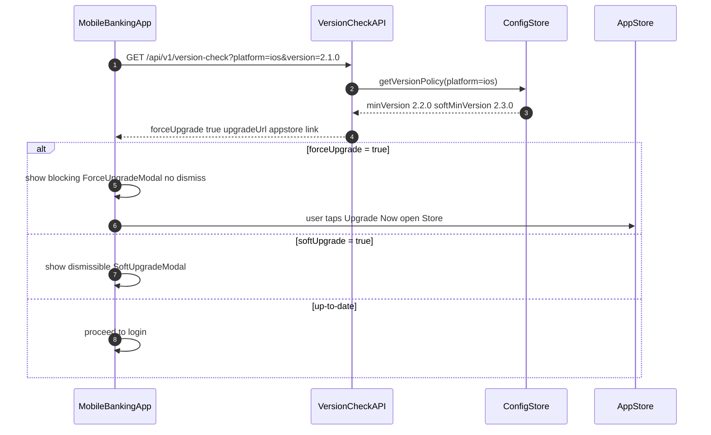

# Mobile Force-Upgrade

Status: Draft | Catalog ID: MOB-006 | Owner: @tech-lead-mobile
Tier Applicability: T0, T1, T2

## Problem Statement

- A critical security vulnerability (CVE) in an older app version cannot be patched retroactively; without a server-side minimum version gate, users on vulnerable builds continue to operate normally while attackers exploit the known vulnerability.
- API breaking changes (deprecated endpoint removal, schema changes) cause older clients to fail in unpredictable ways; without a force-upgrade gate, older clients present cryptic errors instead of a clear upgrade call-to-action.
- Vietnamese regulatory requirements (SBV Circular 09/2020) may mandate patching of security vulnerabilities within defined SLAs; without a mechanism to enforce upgrade, the bank cannot meet patch-response SLAs for mobile endpoints.
- Optional upgrade prompts have low conversion rates (< 30% within 7 days per industry data); force-upgrade provides a hard gate for security-critical updates while soft upgrade handles feature updates.

## Context

Force-upgrade applies to T0/T1/T2 mobile banking apps where the bank must be able to immediately block clients below a minimum secure version. The version check is performed at app launch (before any authenticated operation) via an unauthenticated API endpoint — the check must not require a valid session to ensure even logged-out users are gated. The `minVersion`, `softMinVersion`, and `upgradeUrl` are managed in a configuration store (Spring Boot config / Feature Flag service) to allow rapid response without a backend deployment.

## Solution

At app launch, the client calls `GET /api/v1/version-check?platform=ios&version=2.1.0`. The backend compares the client version against `minVersion` (force-upgrade) and `softMinVersion` (soft-upgrade). If `forceUpgrade: true`, the app displays a blocking modal with no dismiss option; the only action is "Upgrade Now" (deep links to App Store / Play Store). If `softUpgrade: true`, the modal is dismissible and shown once per session. Version comparison uses semantic versioning (SemVer major.minor.patch).



## Implementation Guidelines

### 1. Spring Boot — Version Check Controller

```java
@RestController
@RequestMapping("/api/v1/version-check")
@RequiredArgsConstructor
public class VersionCheckController {

    private final VersionPolicyRepository policyRepo;

    @GetMapping
    public VersionCheckResponse check(
            @RequestParam String platform,
            @RequestParam String version) {
        VersionPolicy policy = policyRepo.findByPlatform(platform.toLowerCase())
            .orElseThrow(() -> new ResponseStatusException(
                HttpStatus.BAD_REQUEST, "Unknown platform: " + platform));

        int cmpMin = compareSemVer(version, policy.minVersion());
        int cmpSoft = compareSemVer(version, policy.softMinVersion());

        return new VersionCheckResponse(
            cmpMin < 0,                       // forceUpgrade
            cmpSoft < 0 && cmpMin >= 0,       // softUpgrade
            policy.upgradeUrl(platform),
            policy.releaseNotes()
        );
    }

    private int compareSemVer(String a, String b) {
        int[] aParts = Arrays.stream(a.split("\\.")).mapToInt(Integer::parseInt).toArray();
        int[] bParts = Arrays.stream(b.split("\\.")).mapToInt(Integer::parseInt).toArray();
        for (int i = 0; i < 3; i++) {
            int diff = Integer.compare(
                i < aParts.length ? aParts[i] : 0,
                i < bParts.length ? bParts[i] : 0);
            if (diff != 0) return diff;
        }
        return 0;
    }
}

public record VersionCheckResponse(
    boolean forceUpgrade,
    boolean softUpgrade,
    String upgradeUrl,
    String releaseNotes
) {}
```

### 2. Android — Version Check at Launch

```kotlin
class MainActivity : AppCompatActivity() {

    override fun onCreate(savedInstanceState: Bundle?) {
        super.onCreate(savedInstanceState)
        setContentView(binding.root)

        val clientVersion = BuildConfig.VERSION_NAME
        lifecycleScope.launch {
            val result = versionCheckRepository.check(
                platform = "android",
                version = clientVersion
            )
            when {
                result.forceUpgrade -> showForceUpgradeDialog(result.upgradeUrl)
                result.softUpgrade -> showSoftUpgradeDialog(result.upgradeUrl)
                else -> proceedToLogin()
            }
        }
    }

    private fun showForceUpgradeDialog(upgradeUrl: String) {
        AlertDialog.Builder(this)
            .setTitle("Cập nhật bắt buộc")
            .setMessage("Phiên bản này không còn được hỗ trợ. Vui lòng cập nhật để tiếp tục.")
            .setPositiveButton("Cập nhật ngay") { _, _ ->
                startActivity(Intent(Intent.ACTION_VIEW, Uri.parse(upgradeUrl)))
            }
            .setCancelable(false)
            .show()
    }

    private fun showSoftUpgradeDialog(upgradeUrl: String) {
        AlertDialog.Builder(this)
            .setTitle("Có phiên bản mới")
            .setMessage("Hãy cập nhật để có trải nghiệm tốt hơn.")
            .setPositiveButton("Cập nhật") { _, _ ->
                startActivity(Intent(Intent.ACTION_VIEW, Uri.parse(upgradeUrl)))
            }
            .setNegativeButton("Bỏ qua") { dialog, _ -> dialog.dismiss(); proceedToLogin() }
            .show()
    }
}
```

### 3. iOS — Version Check at Launch

```swift
// AppCoordinator.swift
final class AppCoordinator {

    func start() {
        Task {
            let info = Bundle.main.infoDictionary
            let version = info?["CFBundleShortVersionString"] as? String ?? "0.0.0"
            let result = try? await VersionCheckService.check(
                platform: "ios", version: version)

            await MainActor.run {
                if result?.forceUpgrade == true {
                    showForceUpgradeScreen(url: result?.upgradeUrl)
                } else if result?.softUpgrade == true {
                    showSoftUpgradeAlert(url: result?.upgradeUrl) {
                        self.proceedToLogin()
                    }
                } else {
                    proceedToLogin()
                }
            }
        }
    }

    @MainActor
    private func showForceUpgradeScreen(url: String?) {
        let vc = ForceUpgradeViewController(upgradeURL: url)
        window?.rootViewController = vc
    }
}
```

## When to Use

- T0/T1/T2 app versions containing a patched security vulnerability that must be blocked immediately upon patch release.
- API deprecations where continued use of the old client causes server errors or data integrity issues.
- Regulatory compliance deadlines requiring all active clients to use a version meeting specific security requirements within a defined window.

## When Not to Use

- Cosmetic UI releases or non-critical feature additions — force-upgrade irritates users; use soft-upgrade (dismissible) for non-security updates.
- Environments where the App Store review process may delay the target version being available — do not set `minVersion` to a version that has not yet passed App Store / Play Store review.
- A/B test version gating — use Feature Flags instead; force-upgrade is a binary block, not a progressive rollout mechanism.

## Variants

| Variant | When to prefer | Trade-off |
|---------|---------------|-----------|
| Server-side version gate (this pattern) | Security vulnerabilities; regulatory SLA; immediate enforcement | User must upgrade before using any feature; business risk if upgrade URL is wrong |
| In-app update (Android Play Core) | Android-only; seamless upgrade without leaving the app; Play Store handles download | iOS has no equivalent; requires Play Store distribution |
| Feature flag gating (no version block) | Disable specific features in older clients without blocking the entire app | Cannot patch security vulnerabilities — attacker can bypass feature flags |

## NFR Acceptance Criteria

| Metric | Threshold | Measurement |
|--------|-----------|-------------|
| Version check API p99 latency | ≤ 500 ms (unauthenticated, cached in CDN) | Load test at 1,000 rps; assert p99 ≤ 500 ms |
| Force-upgrade propagation | ≤ 5 min from config update to all clients | Update minVersion in DB; measure time for next app launch to receive forceUpgrade: true |
| Version check availability | 99.99% (T0 — blocks all app usage if unavailable) | Prometheus uptime on /api/v1/version-check; CDN as failsafe |
| Rollback time | ≤ 2 min (revert minVersion in DB if incorrect force-upgrade deployed) | Measure time from DB revert to clients receiving forceUpgrade: false |
| Upgrade URL validity | 100% — upgradeUrl must always point to a valid App Store / Play Store listing | Synthetic monitor polling upgradeUrl every 5 min; alert on non-200 |

## Compliance Mapping

| Ring | Regulation | Provision | How this pattern satisfies |
|------|-----------|-----------|---------------------------|
| Ring 0 | OWASP Mobile Top 10 | M9 — Reverse Engineering (outdated binaries with known vulnerabilities) | Force-upgrade gate immediately blocks clients containing known CVEs after patch release; the bank can enforce patch-response SLAs at the network boundary rather than relying on user behavior. |
| Ring 1 | PCI-DSS v4.0 | §6.3.3 — all system components are protected from known vulnerabilities by installing applicable security patches | Force-upgrade enforces that mobile clients are patched to address PCI-DSS vulnerabilities within the required timeframe; patch deployment is tracked via minVersion configuration with an audit log. |
| Ring 2 | SBV Circular 09/2020 | §II.3 — information security incident response and vulnerability patching requirements ⚠️ (working summary — pending Legal review) | Version gate enables the bank to enforce a vulnerability patch across the entire mobile user base within hours of patch release; Legal review required to confirm that this mechanism satisfies SBV §II.3 patch-response SLAs for internet banking mobile applications. |

## Cost / FinOps

- Version check endpoint: unauthenticated, CDN-cacheable with TTL 5 minutes; origin requests ≤ 0.3% of total at steady state; origin compute cost is negligible.
- Config store: one row per platform (iOS, Android) in a standard RDBMS or config service; no special infrastructure required.
- Business cost of NOT implementing: a single security incident from a known-vulnerability client version can cost tens of millions of VND in fraud, customer notification, and regulatory response — vastly exceeding the development cost.
- Soft-upgrade UX: at 10% daily active user (DAU) trigger rate, 5% immediate upgrade → 50,000 fewer vulnerable-version users per day on a 1M DAU app.

## Threat Model

- **Version check bypass via modified client (Elevation of Privilege)**: A jailbroken/rooted device runs a modified APK or IPA that hard-codes a high version number in the version-check call, bypassing the force-upgrade gate. Mitigation: root/jailbreak detection at app startup (SafetyNet Attestation on Android, DeviceCheck on iOS) — apps running on compromised devices can be blocked at the backend regardless of the reported version; version check is one layer, not the only control.
- **Incorrect minVersion causing mass user lockout (Denial of Service)**: A misconfigured `minVersion` set higher than the currently available App Store version locks out all users. Mitigation: the config update requires a two-person approval (4-eyes); a synthetic monitor polls the App Store API to confirm the `upgradeUrl` version is available before `minVersion` is raised; rollback is a single DB update taking < 2 minutes.

## Runbook Stub

**Alert: `version_check_force_upgrade_rate > 20%`** (Grafana metric on version check API)
- p50 baseline: ≤ 1% (just-released) → 0% (all users updated) | p99 SLO: drops to 0% within 30 days of patch release
- Remediation: (1) If this fires unexpectedly (no planned minVersion bump), check DB for unauthorized `minVersion` change. (2) If intentional, verify `upgradeUrl` resolves to the correct App Store / Play Store page. (3) Monitor crash-free rate on the new version — if crashes spike, revert `minVersion` immediately via DB update. (4) Track force-upgrade conversion rate: % users who upgraded within 1 h / 24 h / 7 days.

## Test Strategy Stub

- **Unit**: `VersionCheckControllerTest` — version "2.1.0" against minVersion "2.2.0" → `forceUpgrade: true`. Version "2.2.0" against softMinVersion "2.3.0" → `softUpgrade: true`. Version "2.3.1" → both false. Non-SemVer input → `400 Bad Request`. `compareSemVer("1.10.0", "1.9.0")` → assert positive (correct major-minor ordering).
- **Integration**: Spring Boot Test — `GET /api/v1/version-check?platform=ios&version=1.0.0` → assert `forceUpgrade: true`. Update `minVersion` to "1.0.0" in DB → assert `forceUpgrade: false` on next call.
- **Integration (Android)**: Mock API returning `{forceUpgrade: true}`; launch `MainActivity`; assert `ForceUpgradeDialog` visible; assert `proceedToLogin()` NOT called.
- **Chaos**: Version check API unavailable — mock endpoint returning 503; assert app shows safe fallback ("Unable to connect — please try again") rather than crashing or silently proceeding; assert no payment operations possible while version check is unavailable.

## Related Patterns

- [MOB-003 Mobile Biometric Auth](mobile-biometric-auth.md) — biometric session used after successful version gate
- [SEC-006 JWT Best Practices](../../patterns/security/jwt-best-practices.md) — token validation enforced on clients that pass the version gate

## References

- [Android In-App Updates API](https://developer.android.com/guide/playcore/in-app-updates)
- [Apple App Store Version Requirements](https://developer.apple.com/app-store/review/guidelines/)
- [PCI-DSS v4.0 §6.3.3 — Security Patches](https://www.pcisecuritystandards.org/document_library/)
- [Semantic Versioning 2.0.0](https://semver.org/)
- Catalog reference: `governance/standards/enterprise-architecture-catalog.md`
