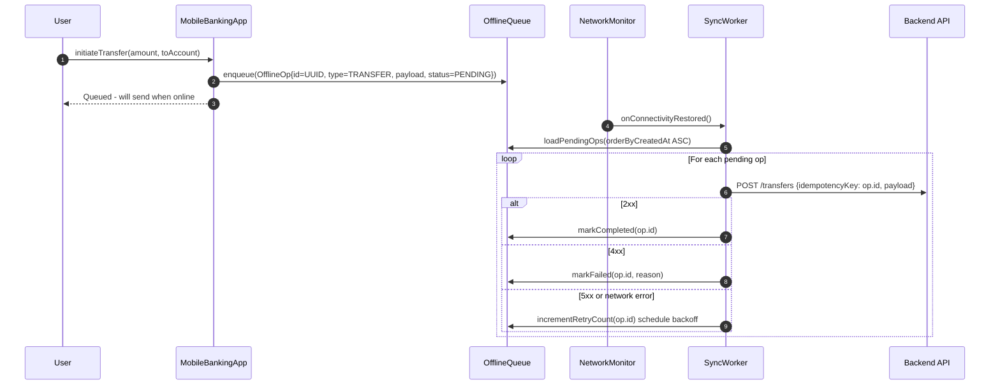

# Mobile Offline Queue

Status: Draft | Catalog ID: MOB-001 | Owner: @tech-lead-mobile
Tier Applicability: T1, T2

## Problem Statement

- Banking apps deployed in Vietnam operate in environments with unreliable 4G coverage (rural areas, underground branches); operations initiated offline (bill payment, fund transfer initiation) are silently lost if the app has no local queue.
- Without a structured queue, users experience silent data loss: they submit a form, lose connectivity, and the operation never reaches the server — no user feedback, no retry, no durability guarantee.
- Naive retry (repeat HTTP call on reconnect) is insufficient: without idempotency keys, a reconnection retry creates duplicate transactions; with a payment instrument, this means double debits.
- Ordering matters for sequential banking operations (e.g., top-up then pay bill): a simple "flush on reconnect" that ignores order of insertion can violate business invariants.
- Device-local operation storage contains financial intent data (amounts, account numbers) that constitutes personal data under Decree 13/2023 and must be encrypted at rest.

## Context

This pattern applies to T1/T2 mobile banking features that initiate non-real-time operations: scheduled transfers, bill payment, beneficiary management. It is not appropriate for T0 real-time payment authorization — those require a live connection. The pattern is implemented at the mobile client layer; the backend requires only idempotency key support (BSP-002).

## Solution

Pending operations are serialized to a local encrypted Room database (Android) or CoreData store with file protection (iOS). A `NetworkMonitor` observes connectivity state via `ConnectivityManager` (Android) or `NWPathMonitor` (iOS). When connectivity is restored, a `SyncWorker` (Android WorkManager) or background `URLSessionUploadTask` (iOS) drains the queue in FIFO order, attaching a stable idempotency key per operation. The backend deduplicates using the key (per BSP-002). On 4xx response the operation is removed from the queue (unrecoverable client error); on 5xx the operation remains for retry with exponential backoff.



## Implementation Guidelines

### 1. Android — Room Entity and DAO

```kotlin
@Entity(tableName = "offline_ops")
data class OfflineOpEntity(
    @PrimaryKey val id: String = UUID.randomUUID().toString(),
    val opType: String,
    val payloadJson: String,
    val status: String = "PENDING",
    val retryCount: Int = 0,
    val createdAt: Long = System.currentTimeMillis()
)

@Dao
interface OfflineOpDao {
    @Query("SELECT * FROM offline_ops WHERE status = 'PENDING' ORDER BY createdAt ASC")
    suspend fun loadPending(): List<OfflineOpEntity>

    @Insert(onConflict = OnConflictStrategy.IGNORE)
    suspend fun enqueue(op: OfflineOpEntity)

    @Query("UPDATE offline_ops SET status = :status WHERE id = :id")
    suspend fun updateStatus(id: String, status: String)

    @Query("UPDATE offline_ops SET retryCount = retryCount + 1 WHERE id = :id")
    suspend fun incrementRetry(id: String)
}
```

### 2. Android — WorkManager SyncWorker

```kotlin
class OfflineSyncWorker(
    context: Context,
    params: WorkerParameters,
    private val dao: OfflineOpDao,
    private val apiClient: BankingApiClient,
    private val crypto: MobileKeyStore
) : CoroutineWorker(context, params) {

    override suspend fun doWork(): Result {
        val pending = dao.loadPending()
        for (op in pending) {
            val decrypted = crypto.decrypt(op.payloadJson)
            val response = apiClient.submitOp(
                opType = op.opType,
                idempotencyKey = op.id,
                payload = decrypted
            )
            when {
                response.isSuccessful -> dao.updateStatus(op.id, "COMPLETED")
                response.code() in 400..499 -> dao.updateStatus(op.id, "FAILED_PERMANENT")
                else -> {
                    dao.incrementRetry(op.id)
                    if (op.retryCount >= 5) dao.updateStatus(op.id, "FAILED_MAX_RETRY")
                }
            }
        }
        return Result.success()
    }
}

val syncRequest = OneTimeWorkRequestBuilder<OfflineSyncWorker>()
    .setConstraints(Constraints.Builder()
        .setRequiredNetworkType(NetworkType.CONNECTED)
        .build())
    .setBackoffCriteria(BackoffPolicy.EXPONENTIAL, 30, TimeUnit.SECONDS)
    .build()
WorkManager.getInstance(context).enqueueUniqueWork(
    "offline-sync", ExistingWorkPolicy.KEEP, syncRequest)
```

### 3. iOS — CoreData + NWPathMonitor

```swift
import Foundation
import Network
import CoreData

final class OfflineQueueManager {
    static let shared = OfflineQueueManager()
    private let monitor = NWPathMonitor()
    private let queue = DispatchQueue(label: "offline.monitor")

    func startMonitoring() {
        monitor.pathUpdateHandler = { [weak self] path in
            if path.status == .satisfied {
                Task { await self?.drainQueue() }
            }
        }
        monitor.start(queue: queue)
    }

    func enqueue(_ op: OfflineOperation) async throws {
        let context = PersistenceController.shared.newBackgroundContext()
        try await context.perform {
            let entity = OfflineOpEntity(context: context)
            entity.id = op.id.uuidString
            entity.opType = op.type.rawValue
            entity.payloadData = try op.encryptedPayload()
            entity.status = "PENDING"
            entity.createdAt = Date()
            try context.save()
        }
    }

    private func drainQueue() async {
        let ops = await fetchPendingOps()
        for op in ops {
            do {
                let response = try await BankingAPIClient.shared.submit(op)
                await markCompleted(op.id)
                _ = response
            } catch let error as APIError where error.isClientError {
                await markFailed(op.id)
            } catch {
                await incrementRetry(op.id)
            }
        }
    }
}
```

## When to Use

- Mobile banking features that initiate non-real-time operations (scheduled transfers, bill payment, beneficiary save) in areas with unreliable connectivity.
- Any operation where the user expects optimistic UI ("queued") and the backend supports idempotency keys per BSP-002.
- T1/T2 services where data loss on connectivity drop is unacceptable and the user should not need to re-enter data.

## When Not to Use

- T0 real-time payment authorization (NAPAS, card present) — these require a live connection and cannot be queued; fail fast and show an error instead.
- Operations that depend on real-time balance checks — queued transfers against a stale balance view can overdraw; do a pre-flight balance check when connectivity is restored before submitting.
- Operations with a short validity window (OTP submission, 2FA challenge response) — these expire in seconds and are useless in a queue.

## Variants

| Variant | When to prefer | Trade-off |
|---------|---------------|-----------|
| Local Room / CoreData queue (this pattern) | Standard queued ops with idempotency key backend support | Requires backend idempotency; ops are lost on app uninstall |
| SQLCipher-encrypted queue | Regulated environments where the device OS encryption is insufficient or the app must run on non-full-disk-encrypted devices | Higher dependency weight; key management complexity |
| Service Worker + IndexedDB (PWA/web) | Web-based banking app with offline support | Limited to browser context; no background sync on iOS Safari |

## NFR Acceptance Criteria

| Metric | Threshold | Measurement |
|--------|-----------|-------------|
| Enqueue latency p99 | ≤ 50 ms (Room/CoreData insert + encrypt) | Instrumented test: 100 enqueue calls; assert p99 ≤ 50 ms |
| Sync drain start time | ≤ 3 s after connectivity restored | Test: drop wifi; enqueue 10 ops; restore wifi; measure drain start |
| Duplicate prevention | 0 duplicates on retry | Backend integration test: submit same op 3× with same idempotencyKey; assert 1 DB row |
| Availability | N/A (client-side — degrades gracefully offline) | App must function in airplane mode; queue visible in UI |
| RTO | ≤ 5 s from connectivity restore to first successful API call | Chaos test: toggle airplane mode; measure first successful sync |

## Compliance Mapping

| Ring | Regulation | Provision | How this pattern satisfies |
|------|-----------|-----------|---------------------------|
| Ring 0 | OWASP Mobile Top 10 | M2 — Insecure Data Storage | Queue payloads encrypted with AES-256-GCM using a Keychain/KeyStore managed key before writing to Room/CoreData; no plaintext financial data at rest on device. |
| Ring 1 | PCI-DSS v4.0 | §3.5 — protect stored account data | If payment card data appears in a queued operation payload, it must be tokenized (SEC-013) before queuing — raw PANs must never be written to the local queue. |
| Ring 2 | Decree 13/2023/ND-CP | §9 — personal data stored on device requires lawful basis and proportionality ⚠️ (working summary — pending Legal review) | Queue payloads contain financial intent data (account numbers, amounts) constituting personal data; retention in the queue should not exceed 72 hours; Legal review required to confirm consent basis and maximum retention period. |

## Cost / FinOps

- Room/CoreData storage: each queued operation is typically 200–500 bytes (serialized + encrypted); 1 000 queued ops = ≤ 500 KB — negligible on device storage.
- WorkManager execution: a background job draining 10–50 ops uses CPU for ≤ 500 ms; battery impact is negligible relative to foreground UI rendering.
- Backend idempotency check: one Redis lookup per sync attempt (per BSP-002); at 10 000 syncs/day the Redis cost is ≤ 0.01 USD/day.
- Cost of NOT using this pattern: customer support tickets for lost transactions in low-connectivity areas; each ticket averages 30 min support time; at 10 tickets/week the operational cost exceeds the development cost of this pattern within one sprint.

## Threat Model

- **Replay attack on sync (Elevation of Privilege / Tampering)**: A network-level attacker intercepts the sync HTTP call and replays it, creating duplicate financial operations. Mitigation: every queued operation carries a UUID idempotency key (BSP-002); the backend rejects duplicate keys with 200 OK (already processed); TLS 1.3 prevents replay at the transport layer.
- **Queue poisoning via malformed payload (Tampering)**: A compromised app writes a crafted operation to the queue that exploits a deserialization vulnerability in the sync worker. Mitigation: the queue schema is strictly typed (op type enum + JSON schema validation on drain); unknown op types are rejected and logged before API submission; the API performs server-side validation regardless.

## Runbook Stub

**Alert: `offline_sync_max_retry_exceeded`** (mobile app metric reported via analytics)
- p50 baseline: 0 ops in max-retry state | p99 SLO: ≤ 5 ops/user/day
- Remediation: (1) Check if the API endpoint `/transfers` is returning 5xx — backend incident may be causing mass retry exhaustion. (2) If API is healthy, inspect the failed op payloads via analytics console for schema changes. (3) Release a hotfix that clears ops in `FAILED_MAX_RETRY` state older than 24 hours. (4) Notify affected users via push notification to re-enter the failed operations.

## Test Strategy Stub

### Unit Tests
- `OfflineOpDaoTest`: enqueue 5 ops; loadPending → assert 5 returned in insertion order; markCompleted(id) → assert op removed from pending; incrementRetry → assert retryCount = 1.
- `OfflineSyncWorkerTest`: mock API returning 200 → assert all ops marked COMPLETED; mock 4xx → assert FAILED_PERMANENT; mock 5xx → assert retryCount incremented.

### Integration Tests
- Android Instrumented Test with in-memory Room: enqueue 3 ops; simulate connectivity restore; run SyncWorker; mock API with WireMock; assert all 3 ops completed and no duplicate API calls.
- iOS XCTest: enqueue 3 ops; call `drainQueue()` with mocked URLSession; assert all 3 API calls made with distinct idempotency keys.

### Chaos Tests
- Toggle airplane mode mid-sync (op 2 of 5 in progress): assert ops 1 is COMPLETED, ops 2–5 remain PENDING after reconnect; assert op 2 retried successfully on next sync with same idempotency key.

## Related Patterns

- [BSP-002 Idempotent Payment Key](../banking-solutions/idempotent-payment-key.md) — backend deduplication for queued ops
- [MOB-002 Mobile Secure Storage](mobile-secure-storage.md) — Keychain/KeyStore key used to encrypt queue payloads

## References

- [Android WorkManager — background processing](https://developer.android.com/topic/libraries/architecture/workmanager)
- [Apple Network Framework — NWPathMonitor](https://developer.apple.com/documentation/network/nwpathmonitor)
- [Room Persistence Library](https://developer.android.com/training/data-storage/room)
- [Decree 13/2023/ND-CP — Personal Data Protection](https://vanban.chinhphu.vn/default.aspx?pageid=27160&docid=207126)
- Catalog reference: `governance/standards/enterprise-architecture-catalog.md`
