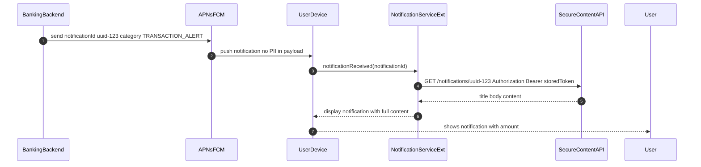

# Mobile Push Notification (Secure)

Status: Draft | Catalog ID: MOB-004 | Owner: @tech-lead-mobile
Tier Applicability: T1, T2

## Problem Statement

- Banking push notifications that include account balance, transaction amounts, or account numbers in the payload expose sensitive financial data to any app with notification access, iOS lock screen, or Android notification shade — no user authentication required to view the data.
- APNs / FCM notification payloads are transmitted through Apple and Google infrastructure; including PII in the payload means personal data is processed on third-party servers, creating a Decree 13/2023 cross-border data transfer issue.
- Unrestricted push notification registration (no sender ID verification) allows a rogue backend to send spoofed notifications to real device tokens, undermining user trust and potentially being exploited for phishing.
- Silent push notifications that trigger background data fetches can be abused to exfiltrate data or drain battery if not rate-limited at the server side.

## Context

Secure push notifications apply to T1/T2 banking alerts: transaction notifications, OTP delivery reminders, promotional messages. The pattern separates the notification trigger (low-sensitivity: notification ID only) from the notification content (sensitive: fetched securely in-app after user authentication). This is the "pull-on-notify" pattern.

## Solution

The backend sends a push notification containing only a `notificationId` (opaque UUID) and a category/type. No PII, amount, or account data is included in the APNs/FCM payload. On receipt, the iOS `UNNotificationServiceExtension` or Android `FirebaseMessagingService` makes an authenticated API call to `GET /notifications/{notificationId}` using the stored session token (MOB-002) to fetch the full content. The notification is populated locally with the fetched content and displayed. Content is cached in memory for the notification display lifetime only.



## Implementation Guidelines

### 1. iOS — Notification Service Extension

```swift
// NotificationService.swift (UNNotificationServiceExtension target)
import UserNotifications

class NotificationService: UNNotificationServiceExtension {

    var contentHandler: ((UNNotificationContent) -> Void)?
    var bestAttemptContent: UNMutableNotificationContent?

    override func didReceive(
        _ request: UNNotificationRequest,
        withContentHandler contentHandler: @escaping (UNNotificationContent) -> Void
    ) {
        self.contentHandler = contentHandler
        bestAttemptContent = (request.content.mutableCopy() as? UNMutableNotificationContent)

        guard let notificationId = request.content.userInfo["notificationId"] as? String,
              let content = bestAttemptContent else {
            contentHandler(request.content)
            return
        }

        Task {
            do {
                let secureContent = try await NotificationContentFetcher.fetch(id: notificationId)
                content.title = secureContent.title
                content.body = secureContent.body
                content.badge = secureContent.badge as NSNumber?
            } catch {
                content.title = "Thông báo mới"
                content.body = "Mở ứng dụng để xem chi tiết"
            }
            contentHandler(content)
        }
    }

    override func serviceExtensionTimeWillExpire() {
        if let contentHandler, let bestAttemptContent {
            bestAttemptContent.body = "Mở ứng dụng để xem chi tiết"
            contentHandler(bestAttemptContent)
        }
    }
}

struct SecureNotificationContent: Decodable {
    let title: String
    let body: String
    let badge: Int?
}

enum NotificationContentFetcher {
    static func fetch(id: String) async throws -> SecureNotificationContent {
        guard let token = try? KeychainManager.load(key: "session_token"),
              let tokenStr = String(data: token, encoding: .utf8) else {
            throw URLError(.userAuthenticationRequired)
        }
        var request = URLRequest(url: URL(string: "https://api.tcb.com.vn/notifications/\(id)")!)
        request.setValue("Bearer \(tokenStr)", forHTTPHeaderField: "Authorization")
        let (data, _) = try await URLSession.shared.data(for: request)
        return try JSONDecoder().decode(SecureNotificationContent.self, from: data)
    }
}
```

### 2. Android — FirebaseMessagingService

```kotlin
class TcbFirebaseMessagingService : FirebaseMessagingService() {

    override fun onMessageReceived(remoteMessage: RemoteMessage) {
        val notificationId = remoteMessage.data["notificationId"] ?: return
        val category = remoteMessage.data["category"] ?: "GENERAL"

        CoroutineScope(Dispatchers.IO).launch {
            val content = fetchSecureContent(notificationId) ?: run {
                showPlaceholderNotification()
                return@launch
            }
            showNotification(content, category)
        }
    }

    private suspend fun fetchSecureContent(notificationId: String): NotificationContent? {
        val token = SecureStorageManager.loadToken(this, "session_token") ?: return null
        return try {
            BankingApiClient.create(token).getNotification(notificationId)
        } catch (e: Exception) {
            null
        }
    }

    private fun showNotification(content: NotificationContent, category: String) {
        val channelId = "tcb_banking_alerts"
        val notification = NotificationCompat.Builder(this, channelId)
            .setSmallIcon(R.drawable.ic_notification)
            .setContentTitle(content.title)
            .setContentText(content.body)
            .setPriority(NotificationCompat.PRIORITY_HIGH)
            .setAutoCancel(true)
            .build()
        NotificationManagerCompat.from(this)
            .notify(notificationId.hashCode(), notification)
    }

    private fun showPlaceholderNotification() {
        // Show "Open app to view" if content fetch fails
    }
}
```

### 3. Spring Boot — Notification Push Service

```java
@Service
@RequiredArgsConstructor
public class PushNotificationService {

    private final FirebaseMessaging firebaseMessaging;
    private final NotificationRepository notificationRepo;

    public void sendTransactionAlert(String deviceToken, TransactionEvent event) {
        String notificationId = UUID.randomUUID().toString();
        notificationRepo.save(NotificationRecord.builder()
            .id(notificationId)
            .userId(event.userId())
            .title("Giao dịch mới")
            .body(formatBody(event))
            .expiresAt(Instant.now().plusHours(24))
            .build());

        Message message = Message.builder()
            .setToken(deviceToken)
            .putData("notificationId", notificationId)
            .putData("category", "TRANSACTION_ALERT")
            .setApnsConfig(ApnsConfig.builder()
                .putHeader("apns-priority", "10")
                .setAps(Aps.builder()
                    .setMutableContent(true)
                    .setSound("default")
                    .build())
                .build())
            .build();

        firebaseMessaging.sendAsync(message);
    }
}

@RestController
@RequestMapping("/notifications")
@RequiredArgsConstructor
public class NotificationContentController {

    private final NotificationRepository notificationRepo;

    @GetMapping("/{id}")
    public NotificationContentResponse getContent(
            @PathVariable String id,
            Authentication auth) {
        return notificationRepo.findByIdAndUserId(id, auth.getName())
            .filter(n -> n.getExpiresAt().isAfter(Instant.now()))
            .map(n -> new NotificationContentResponse(n.getTitle(), n.getBody()))
            .orElseThrow(() -> new ResponseStatusException(HttpStatus.NOT_FOUND));
    }
}
```

## When to Use

- Banking transaction alerts, OTP delivery prompts, and account activity notifications where the content includes account numbers, amounts, or other PII.
- Any notification where content is displayed on the lock screen before user authentication, creating a data exposure risk.
- Regulated environments (Decree 13/2023) where PII transmission through third-party push infrastructure (Apple/Google) must be minimized.

## When Not to Use

- Non-sensitive promotional notifications (app update available, feature announcement) — no PII, no risk; include content directly in the FCM/APNs payload for simplicity.
- Silent push notifications for background data prefetch — use with extreme care; APNs rate-limits silent pushes and iOS may not deliver them reliably; use `BGAppRefreshTask` instead.
- Environments without session token persistence (first-run, logged-out state) — the notification service extension cannot fetch secure content without a valid token; fall back to generic "Open app" message.

## Variants

| Variant | When to prefer | Trade-off |
|---------|---------------|-----------|
| Pull-on-notify via service extension (this pattern) | PII in notification content; regulatory data minimization; lock-screen privacy | Requires background network call in extension (30s iOS limit); needs valid session token |
| Encrypted payload with client-side decryption | PII must not leave device unencrypted even in transit to Apple/Google | Key management complexity; encryption in APNs payload not natively supported |
| Direct payload (no PII) | Promotional messages, non-sensitive alerts | Simplest; not appropriate for financial data |

## NFR Acceptance Criteria

| Metric | Threshold | Measurement |
|--------|-----------|-------------|
| Notification display latency p99 | ≤ 3 s (push received to notification shown) | E2E test: trigger push; measure notification display time; assert p99 ≤ 3 s |
| Content fetch p99 | ≤ 1.5 s (authenticated API call) | Load test /notifications/{id}; assert p99 ≤ 1.5 s |
| PII in APNs/FCM payload | 0 instances | CI test: scan all Message.builder() calls for PAN, account number, or amount fields in payload |
| Availability | T1/T2 — content endpoint 99.9% | Prometheus uptime on /notifications/* |
| Notification expiry | 24 h (server-side TTL) | Test: fetch notification after 24 h; assert 404 |

## Compliance Mapping

| Ring | Regulation | Provision | How this pattern satisfies |
|------|-----------|-----------|---------------------------|
| Ring 0 | OWASP Mobile Top 10 | M7 — Insufficient Binary Protections (notification interception) | No PII in APNs/FCM payload; an intercepted push contains only an opaque UUID; the full content requires an authenticated API call that validates the user's session token. |
| Ring 1 | PCI-DSS v4.0 | §6.4 — protect public-facing web applications | The content endpoint validates the JWT and matches userId; IDOR is prevented by filtering on userId = auth.getName(); no cardholder data transmitted through third-party push infrastructure. |
| Ring 2 | Decree 13/2023/ND-CP | §17 — cross-border personal data transfer requires consent and legal basis ⚠️ (working summary — pending Legal review) | Notification payload transmitted through Apple/Google infrastructure contains no personal data (only opaque UUID); personal data fetched directly from TCB API over TLS; Legal review required to confirm this architecture satisfies cross-border transfer minimization requirements under Decree 13/2023. |

## Cost / FinOps

- FCM/APNs: push delivery is free for both platforms at any volume. The notification content fetch API call (authenticated) is the primary cost driver — each notification delivery = 1 API call.
- Content store: notifications stored in PostgreSQL for 24 h; at 1M notifications/day × 200 bytes = 200 MB/day uncompressed; partition and drop after 24 h — steady-state storage ≤ 200 MB.
- Background network call in notification extension: consumes 1–5 KB per notification for the JSON response; at 1M daily notifications = ≤ 5 GB/day backend egress — within standard CDN budget.

## Threat Model

- **Notification ID enumeration (Information Disclosure)**: An attacker brute-forces notification IDs (UUID format) to retrieve other users' notification content. Mitigation: the content endpoint validates that `notification.userId == authenticated_user_id`; UUID v4 has 2^122 combinations making sequential enumeration infeasible; notification TTL of 24 h limits the window.
- **Push notification spoofing via forged FCM sender ID (Tampering)**: A rogue server sends fake notifications to real device tokens using the same FCM project. Mitigation: Android FCM v1 API requires OAuth2 credentials tied to a specific Firebase project; apps should verify the sender ID matches the expected value on message receipt.

## Runbook Stub

**Alert: `notification_content_fetch_error_rate > 5%`** (Prometheus on `/notifications/*`)
- p50 baseline: ≤ 0.5% error rate | p99 SLO: ≤ 2%
- Remediation: (1) Check if the notification content endpoint is healthy: `kubectl get pods -l app=notification-svc`. (2) If pods are crashing, check for DB connection pool exhaustion — notification content store may be under high read load during a transaction processing spike. (3) If errors are 401 (token expired), the session token in the notification extension is stale — expected for users inactive > 15 min; no action required. (4) If errors are 404, notifications may have expired (> 24 h) — check if a batch job is running too aggressively.

## Test Strategy Stub

- **Unit**: `NotificationService.sendTransactionAlert` — assert `Message` has no `amount`, `accountNumber`, or PAN in `putData()` calls; assert `notificationId` is UUID format.
- **Unit**: `NotificationContentController.getContent` — mock repo returning notification for userId A; call with auth userId B → assert 404; call with auth userId A and expired notification → assert 404.
- **Integration**: Spring Boot Test: send transaction event → assert notification record created in DB with title and body containing amount; assert FCM message payload contains only `notificationId` and `category`.
- **Integration (iOS)**: Simulate push with `notificationId`; mock `NotificationContentFetcher`; assert `UNMutableNotificationContent.body` matches fetched content.
- **Compliance**: PII scan — intercept all FCM `Message` objects in integration tests; assert no field contains a regex matching VND amounts, account numbers, or NRIC patterns.

## Related Patterns

- [MOB-005 Mobile Deep Link Attestation](mobile-deep-link-attestation.md) — notification deep links validated via this pattern
- [SEC-006 JWT Best Practices](../../patterns/security/jwt-best-practices.md) — session token used for content fetch
- [MOB-002 Mobile Secure Storage](mobile-secure-storage.md) — session token storage for the extension

## References

- [UNNotificationServiceExtension — Apple Developer](https://developer.apple.com/documentation/usernotifications/unnotificationserviceextension)
- [Firebase Cloud Messaging — Android](https://firebase.google.com/docs/cloud-messaging/android/receive)
- [FCM v1 API — Sending Messages](https://firebase.google.com/docs/cloud-messaging/send-message)
- [Decree 13/2023/ND-CP — Personal Data Protection](https://vanban.chinhphu.vn/default.aspx?pageid=27160&docid=207126)
- Catalog reference: `governance/standards/enterprise-architecture-catalog.md`
