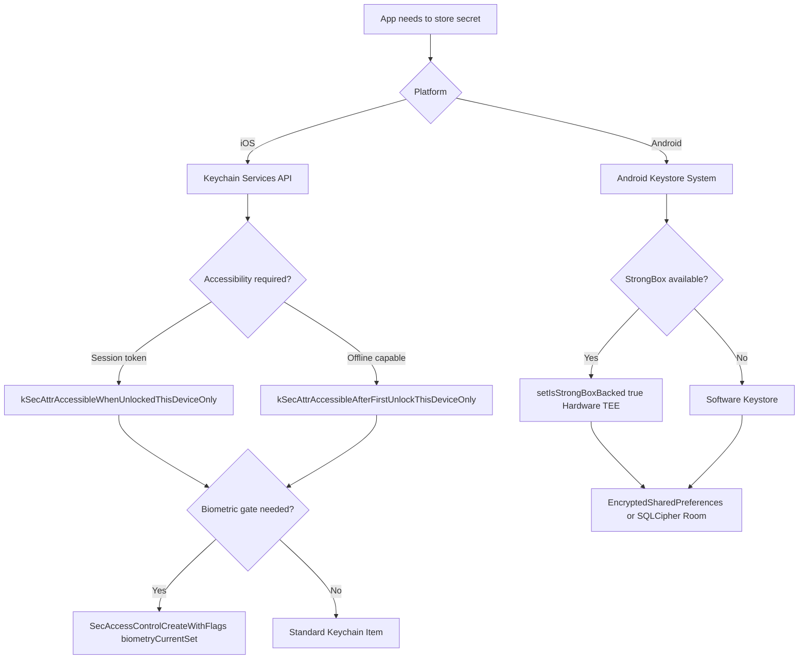

# Mobile Secure Storage

Status: Draft | Catalog ID: MOB-002 | Owner: @tech-lead-mobile
Tier Applicability: T0, T1

## Problem Statement

- Banking apps store sensitive credentials (OAuth tokens, session keys, PAN fragments) and failure to protect these at rest means a stolen or rooted device exposes customer financial access.
- iOS Keychain items marked `kSecAttrAccessibleAlways` remain accessible even on a locked device; applications using the wrong accessibility attribute expose credentials to forensic extraction tools on non-jailbroken devices.
- Android apps storing tokens in `SharedPreferences` (unencrypted) expose all secrets to any app with `READ_EXTERNAL_STORAGE` permission on Android 9 and below, and to physical extraction tools on non-full-disk-encrypted devices.
- Hardware-backed keystores (Apple Secure Enclave, Android StrongBox) prevent key extraction even with root access, but many developers use software keystores (which can be extracted) because the API difference is subtle.
- PCI-DSS §3.5 requires cryptographic key management controls for keys protecting stored account data; without a documented keystore strategy, PCI auditors flag mobile apps as out-of-scope or require additional compensating controls.

## Context

Secure storage applies to every T0/T1 mobile banking feature that persists credentials between sessions: OAuth access/refresh tokens, biometric-gated keys (MOB-003), PAN fragments for display masking, and offline queue encryption keys (MOB-001). The Secure Enclave (iOS A7+) and Android StrongBox (Pixel 3+, Samsung S10+) provide hardware-backed key storage; apps should request hardware-backed storage and gracefully degrade to software keystore on older devices.

## Solution

iOS: use the Keychain Services API with `kSecAttrAccessibleWhenUnlockedThisDeviceOnly` for session tokens (cleared on device lock) or `kSecAttrAccessibleAfterFirstUnlockThisDeviceOnly` for offline-capable apps. Set `kSecAttrSynchronizable = false` to prevent iCloud backup inclusion. For biometric-gated keys, use `SecAccessControlCreateWithFlags` with `.biometryCurrentSet`. Android: use the Android Keystore System with `KeyPairGenerator`/`KeyGenerator` inside the `AndroidKeyStore` provider; request `setIsStrongBoxBacked(true)` (degrades gracefully if unavailable). Use `EncryptedSharedPreferences` for small key-value secrets; Room with SQLCipher for structured encrypted data.



## Implementation Guidelines

### 1. iOS — Keychain Read/Write

```swift
// KeychainManager.swift
import Security
import Foundation

enum KeychainError: Error {
    case itemNotFound
    case unexpectedStatus(OSStatus)
    case encodingError
}

final class KeychainManager {

    static func save(key: String, data: Data, requiresBiometry: Bool = false) throws {
        var accessControl: SecAccessControl?
        if requiresBiometry {
            var error: Unmanaged<CFError>?
            accessControl = SecAccessControlCreateWithFlags(
                nil,
                kSecAttrAccessibleWhenUnlockedThisDeviceOnly,
                .biometryCurrentSet,
                &error
            )
            if let err = error?.takeRetainedValue() {
                throw err as Error
            }
        }

        var query: [CFString: Any] = [
            kSecClass: kSecClassGenericPassword,
            kSecAttrAccount: key,
            kSecAttrAccessible: kSecAttrAccessibleWhenUnlockedThisDeviceOnly,
            kSecValueData: data,
            kSecAttrSynchronizable: false
        ]
        if let ac = accessControl {
            query[kSecAttrAccessControl] = ac
        }

        SecItemDelete(query as CFDictionary)
        let status = SecItemAdd(query as CFDictionary, nil)
        guard status == errSecSuccess else {
            throw KeychainError.unexpectedStatus(status)
        }
    }

    static func load(key: String) throws -> Data {
        let query: [CFString: Any] = [
            kSecClass: kSecClassGenericPassword,
            kSecAttrAccount: key,
            kSecReturnData: true,
            kSecMatchLimit: kSecMatchLimitOne
        ]
        var result: AnyObject?
        let status = SecItemCopyMatching(query as CFDictionary, &result)
        guard status == errSecSuccess, let data = result as? Data else {
            throw KeychainError.itemNotFound
        }
        return data
    }

    static func delete(key: String) {
        let query: [CFString: Any] = [
            kSecClass: kSecClassGenericPassword,
            kSecAttrAccount: key
        ]
        SecItemDelete(query as CFDictionary)
    }
}
```

### 2. Android — Keystore Key Generation and EncryptedSharedPreferences

```kotlin
import android.security.keystore.KeyGenParameterSpec
import android.security.keystore.KeyProperties
import androidx.security.crypto.EncryptedSharedPreferences
import androidx.security.crypto.MasterKey
import java.security.KeyStore

object SecureStorageManager {

    private const val KEYSTORE_ALIAS = "tcb_mobile_master_key"

    fun getMasterKey(context: android.content.Context): MasterKey {
        return MasterKey.Builder(context, KEYSTORE_ALIAS)
            .setKeyScheme(MasterKey.KeyScheme.AES256_GCM)
            .setRequestStrongBoxBacked(true)
            .setUserAuthenticationRequired(false)
            .build()
    }

    fun getEncryptedPrefs(context: android.content.Context): android.content.SharedPreferences {
        val masterKey = getMasterKey(context)
        return EncryptedSharedPreferences.create(
            context,
            "tcb_secure_prefs",
            masterKey,
            EncryptedSharedPreferences.PrefKeyEncryptionScheme.AES256_SIV,
            EncryptedSharedPreferences.PrefValueEncryptionScheme.AES256_GCM
        )
    }

    fun saveToken(context: android.content.Context, key: String, value: String) {
        getEncryptedPrefs(context).edit().putString(key, value).apply()
    }

    fun loadToken(context: android.content.Context, key: String): String? {
        return getEncryptedPrefs(context).getString(key, null)
    }

    fun clearToken(context: android.content.Context, key: String) {
        getEncryptedPrefs(context).edit().remove(key).apply()
    }

    fun generateBiometricKey(alias: String) {
        val keyGenerator = javax.crypto.KeyGenerator.getInstance(
            KeyProperties.KEY_ALGORITHM_AES, "AndroidKeyStore")
        keyGenerator.init(
            KeyGenParameterSpec.Builder(alias,
                KeyProperties.PURPOSE_ENCRYPT or KeyProperties.PURPOSE_DECRYPT)
                .setBlockModes(KeyProperties.BLOCK_MODE_GCM)
                .setEncryptionPaddings(KeyProperties.ENCRYPTION_PADDING_NONE)
                .setUserAuthenticationRequired(true)
                .setIsStrongBoxBacked(true)
                .build()
        )
        keyGenerator.generateKey()
    }
}
```

## When to Use

- Any T0/T1 mobile feature that persists session tokens, cryptographic keys, or financial identifiers between app sessions.
- Biometric-gated operations (MOB-003) where the cryptographic key must be bound to the biometric set and hardware-backed.
- Offline queue encryption keys (MOB-001) that must survive app restarts but not device transfers.

## When Not to Use

- Non-sensitive user preferences (UI theme, language settings) — standard `SharedPreferences` / `UserDefaults` is appropriate and simpler.
- One-time temporary tokens with TTL < 5 minutes — store in memory only; writing to keychain for transient data adds unnecessary I/O and keychain pollution.
- Multi-app shared credentials — iOS Keychain sharing via `kSecAttrAccessGroup` and Android Account Manager add complexity; evaluate whether a shared credential store is architecturally justified before using.

## Variants

| Variant | When to prefer | Trade-off |
|---------|---------------|-----------|
| Platform Keychain / Keystore (this pattern) | Standard credential storage; hardware-backed on modern devices | API verbosity; hardware-backed not guaranteed on all devices |
| SQLCipher-encrypted Room (Android) | Structured encrypted data (offline queue, local cache) | Heavier dependency; key management via Keystore still required |
| In-memory only (no persistence) | Ultra-short-lived tokens (< 5 min) | Credentials lost on app backgrounding; use only for ephemeral flows |

## NFR Acceptance Criteria

| Metric | Threshold | Measurement |
|--------|-----------|-------------|
| Keychain write p99 | ≤ 20 ms | Instrumented test: 100 write calls; assert p99 ≤ 20 ms |
| Keychain read p99 | ≤ 10 ms | Instrumented test: 100 read calls; assert p99 ≤ 10 ms |
| StrongBox-backed key generation | ≤ 500 ms | Measure KeyGenerator.generateKey() on StrongBox-capable device |
| Credential persistence across restart | 100% | Test: save token; force-kill app; relaunch; assert token readable |
| iCloud backup exclusion | 0 Keychain items in backup | Verify kSecAttrSynchronizable = false via Keychain inspection tool |

## Compliance Mapping

| Ring | Regulation | Provision | How this pattern satisfies |
|------|-----------|-----------|---------------------------|
| Ring 0 | OWASP Mobile Top 10 | M2 — Insecure Data Storage | Tokens written to Keychain/Keystore with hardware-backed keys; kSecAttrSynchronizable = false prevents iCloud backup; EncryptedSharedPreferences uses AES-256-GCM; no plaintext credentials in UserDefaults/SharedPreferences. |
| Ring 1 | PCI-DSS v4.0 | §3.5 — protect stored cryptographic keys | Cryptographic keys used to encrypt cardholder data stored exclusively in Secure Enclave (iOS) or Android StrongBox; key never leaves hardware boundary; key lifecycle managed by platform Keystore, not application code. |
| Ring 2 | SBV Circular 09/2020 | §III — client device security for internet banking ⚠️ (working summary — pending Legal review) | Hardware-backed storage ensures credentials cannot be extracted even on rooted/jailbroken devices via forensic tools; Legal review required to confirm that Keychain/Keystore hardware attestation satisfies SBV §III requirements for client-side credential protection. |

## Cost / FinOps

- Secure Enclave / StrongBox operations: key generation is ~100–500 ms on first call (hardware operation); subsequent encrypt/decrypt operations are ~1–5 ms. Cost is negligible at app-session frequency.
- EncryptedSharedPreferences: the AES-256-GCM overhead adds ~1–2 ms per operation vs standard SharedPreferences; at 10 reads/session this is imperceptible.
- Cost of NOT using hardware-backed storage: a single credential extraction incident affecting 10,000 accounts carries direct fraud exposure (VND 50B+), regulatory notification obligations, and reputation damage that vastly exceeds the development cost of this pattern.

## Threat Model

- **Root/jailbreak credential extraction (Information Disclosure)**: An attacker with physical access and a jailbroken device uses forensic tools (Elcomsoft, Frida) to dump Keychain/SharedPreferences contents. Mitigation: hardware-backed keys (Secure Enclave / StrongBox) cannot be extracted by software — the key material never leaves the hardware boundary; even with root access, the attacker can only call the cryptographic API which requires user authentication for biometric-gated keys.
- **iCloud/Google backup inclusion (Information Disclosure)**: A developer accidentally marks Keychain items as `kSecAttrSynchronizable = true`, causing session tokens to be synced to iCloud. Mitigation: CI lint rule asserting `kSecAttrSynchronizable: false` in all Keychain write calls; Android EncryptedSharedPreferences excludes items from Android Auto Backup by default via `res/xml/backup_rules.xml`.

## Runbook Stub

**Alert: `keystore_key_generation_failure`** (Crashlytics / Sentry event)
- p50 baseline: 0 failures | p99 SLO: ≤ 0.01% of key generation attempts
- Remediation: (1) Check if failure is on StrongBox-unsupported device — inspect `isStrongBoxBacked` flag in the error; if StrongBox unavailable, fall back to software keystore via `setIsStrongBoxBacked(false)`. (2) If failure is `KeyPermanentlyInvalidatedException` (Android), the biometric set has changed (new fingerprint enrolled); clear the old key and re-generate with user consent. (3) For iOS `errSecNotAvailable`, check if device has Secure Enclave (A7+ chip); fall back to software keychain on older devices.

## Test Strategy Stub

- **Unit**: `KeychainManagerTest` (iOS): save key → load → assert byte equality. Delete key → load → assert `itemNotFound`. Verify `kSecAttrSynchronizable = false` in all write calls.
- **Unit**: `SecureStorageManagerTest` (Android): save token → load → assert equality. Clear token → load → assert null. Mock `setIsStrongBoxBacked(true)` throwing `StrongBoxUnavailableException`; assert retry with `false`.
- **Integration (iOS)**: Write 3 tokens; restart app; load all 3 → assert present. Backup exclusion test via `xcrun simctl` — assert 0 keychain items in backup.
- **Integration (Android)**: Write via EncryptedSharedPreferences; read from fresh instance; assert decryption succeeds. Verify `backup_rules.xml` excludes `tcb_secure_prefs`.
- **Chaos**: OS upgrade test: write tokens on iOS 17; upgrade to iOS 18; assert all tokens accessible. Simulate biometric set change: delete existing biometric-gated key; assert graceful regeneration prompt shown.

## Related Patterns

- [SEC-006 JWT Best Practices](../../patterns/security/jwt-best-practices.md) — tokens stored in Keychain/Keystore per this pattern
- [MOB-003 Mobile Biometric Auth](mobile-biometric-auth.md) — uses hardware-backed biometric-gated keys from this pattern
- [MOB-001 Mobile Offline Queue](mobile-offline-queue.md) — queue payload encryption key managed via this pattern

## References

- [Apple Keychain Services API](https://developer.apple.com/documentation/security/keychain_services)
- [Android Keystore System](https://developer.android.com/privacy-and-security/keystore)
- [EncryptedSharedPreferences — Jetpack Security](https://developer.android.com/reference/androidx/security/crypto/EncryptedSharedPreferences)
- [PCI-DSS v4.0 §3.5 — Cryptographic Key Management](https://www.pcisecuritystandards.org/document_library/)
- [OWASP Mobile Top 10 — M2 Insecure Data Storage](https://owasp.org/www-project-mobile-top-10/)
- Catalog reference: `governance/standards/enterprise-architecture-catalog.md`
