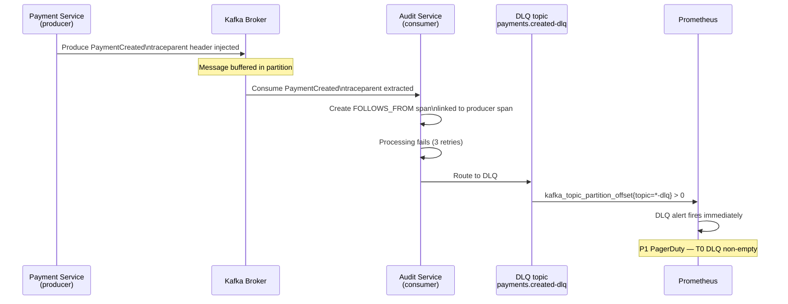

# Async Middleware Observability

Status: Draft | Last Reviewed: 2026-05-10 | Owner: @sre-lead
Catalog ID: OBS-005 | Radii
Tier Applicability: T0, T1

## Problem Statement

Message brokers are opaque to standard HTTP observability tools:
- Kafka consumer lag grows silently — business processes stall before engineers notice
- SQS queue age is invisible to Prometheus — no alert until a downstream service times out
- DLQ depth > 0 on a T0 payment topic is a P1 incident, yet most teams treat DLQs as background metrics
- ActiveMQ queue depth not correlated with consumer thread-pool saturation
- Async spans are disconnected from their producer trace — root-cause requires manual log correlation
- SNS has no native lag metric — failures surface only when subscriber SQS age alerts fire

## Solution

Apply `FOLLOWS_FROM` trace semantics across all async middleware. Expose broker metrics (consumer lag, queue age, DLQ depth) to Prometheus. Alert on DLQ depth as a first-class P1 signal for T0 topics.



## Implementation Guidelines

### 1. Trace Propagation Semantics for Async Consumers

Consumer spans use `FOLLOWS_FROM` (not `CHILD_OF`) — the consumer executes independently, potentially minutes after the producer. This preserves the audit trail without attributing consumer latency to the producer span duration.

Implementation is handled by the OTEL Kafka/SQS/JMS instrumentation libraries configured in [OBS-002](distributed-trace-propagation.md). Verify `FOLLOWS_FROM` links appear in Grafana Tempo by inspecting the trace JSON:

```bash
# Verify FOLLOWS_FROM links in Tempo trace
curl -s "http://tempo.monitoring:3200/api/traces/{traceId}" | \
  python3 -c "import sys,json; spans=[s for s in json.load(sys.stdin)['data'][0]['spans'] if s.get('references')]; print(json.dumps(spans, indent=2))"
# Expected: references[].refType == "FOLLOWS_FROM" for consumer spans
```

### 2. Kafka Observability

**JMX Exporter configuration** for Kafka consumer lag:

```yaml
# jmx_exporter/kafka-consumer-jmx.yaml
startDelaySeconds: 0
lowercaseOutputName: true
rules:
  # Consumer lag per topic-partition
  - pattern: 'kafka\.consumer<type=consumer-fetch-manager-metrics, client-id=(.+), topic=(.+), partition=(.+)><>records-lag'
    name: kafka_consumer_records_lag
    type: GAUGE
    labels:
      client_id: "$1"
      topic: "$2"
      partition: "$3"

  # Consumer group lag (aggregated)
  - pattern: 'kafka\.consumer<type=consumer-fetch-manager-metrics, client-id=(.+)><>records-lag-max'
    name: kafka_consumer_records_lag_max
    type: GAUGE
    labels:
      client_id: "$1"

  # DLQ topic offset (use to detect non-empty DLQ)
  - pattern: 'kafka\.log<type=Log, name=LogEndOffset, topic=(.+-dlq), partition=(\d+)><>Value'
    name: kafka_topic_dlq_log_end_offset
    type: GAUGE
    labels:
      topic: "$1"
      partition: "$2"
```

**Prometheus alert rules — Kafka:**

```yaml
# prometheus/rules/async-middleware-alerts.yaml
groups:
  - name: kafka_observability
    rules:
      # ── Consumer lag — T0 topics ───────────────────────────────────────
      - alert: KafkaConsumerLagHighT0
        expr: kafka_consumer_records_lag{topic=~"techcombank\\.payments\\..*|techcombank\\.accounts\\..*"} > 1000
        for: 5m
        labels:
          severity: high
          tier: T0
        annotations:
          summary: "Kafka consumer lag > 1,000 on T0 topic {{ $labels.topic }}"
          description: "Consumer {{ $labels.client_id }} is falling behind on {{ $labels.topic }}. Possible consumer failure or upstream spike."
          runbook_url: "https://runbooks.techcombank.com/OBS-005-kafka-lag"

      # ── Consumer lag — T1 topics ───────────────────────────────────────
      - alert: KafkaConsumerLagHighT1
        expr: kafka_consumer_records_lag{topic=~"techcombank\\.kyc\\..*|techcombank\\.notifications\\..*"} > 5000
        for: 10m
        labels:
          severity: high
          tier: T1
        annotations:
          summary: "Kafka consumer lag > 5,000 on T1 topic {{ $labels.topic }}"
          runbook_url: "https://runbooks.techcombank.com/OBS-005-kafka-lag"

      # ── DLQ — any T0 DLQ non-empty is immediate P1 ────────────────────
      - alert: KafkaDlqNonEmptyT0
        expr: kafka_topic_dlq_log_end_offset{topic=~"techcombank\\.payments\\..*-dlq|techcombank\\.accounts\\..*-dlq"} > 0
        for: 0m
        labels:
          severity: critical
          tier: T0
        annotations:
          summary: "T0 DLQ {{ $labels.topic }} has messages — IMMEDIATE review required"
          description: "Messages in a T0 DLQ indicate payment/account processing failures. Every message represents a potentially failed financial transaction."
          runbook_url: "https://runbooks.techcombank.com/OBS-005-dlq-t0"

      # ── DLQ — T1 sustained ────────────────────────────────────────────
      - alert: KafkaDlqNonEmptyT1
        expr: kafka_topic_dlq_log_end_offset{topic=~"techcombank\\.kyc\\..*-dlq|techcombank\\.notifications\\..*-dlq"} > 0
        for: 5m
        labels:
          severity: high
          tier: T1
        annotations:
          summary: "T1 DLQ {{ $labels.topic }} has messages"
          runbook_url: "https://runbooks.techcombank.com/OBS-005-dlq-t1"
```

### 3. SQS Observability

SQS metrics from CloudWatch — export to Prometheus via `cloudwatch-exporter`:

```yaml
# cloudwatch_exporter/config.yaml
region: ap-southeast-1
metrics:
  - aws_namespace: AWS/SQS
    aws_metric_name: ApproximateAgeOfOldestMessage
    aws_dimensions: [QueueName]
    aws_statistics: [Maximum]

  - aws_namespace: AWS/SQS
    aws_metric_name: ApproximateNumberOfMessagesVisible
    aws_dimensions: [QueueName]
    aws_statistics: [Maximum]

  - aws_namespace: AWS/SQS
    aws_metric_name: NumberOfMessagesSent
    aws_dimensions: [QueueName]
    aws_statistics: [Sum]
```

**SQS alert rules:**

```yaml
  - name: sqs_observability
    rules:
      - alert: SqsMessageAgeHighT0
        expr: aws_sqs_approximate_age_of_oldest_message_maximum{queue_name=~"techcombank-payments-.*|techcombank-accounts-.*"} > 30
        for: 2m
        labels:
          severity: high
          tier: T0
        annotations:
          summary: "SQS T0 queue {{ $labels.queue_name }}: oldest message age > 30s"
          runbook_url: "https://runbooks.techcombank.com/OBS-005-sqs-age"

      - alert: SqsDlqNonEmpty
        expr: aws_sqs_approximate_number_of_messages_visible_maximum{queue_name=~".*-dlq"} > 0
        for: 0m
        labels:
          severity: critical
        annotations:
          summary: "SQS DLQ {{ $labels.queue_name }} has {{ $value }} messages"
          runbook_url: "https://runbooks.techcombank.com/OBS-005-sqs-dlq"
```

### 4. ActiveMQ Observability

ActiveMQ exposes queue depth via JMX. Use JMX exporter sidecar:

```yaml
# jmx_exporter/activemq-jmx.yaml
rules:
  - pattern: 'org\.apache\.activemq<type=Broker, brokerName=.+, destinationType=Queue, destinationName=(.+)><>QueueSize'
    name: activemq_queue_size
    type: GAUGE
    labels:
      queue: "$1"

  - pattern: 'org\.apache\.activemq<type=Broker, brokerName=.+, destinationType=Queue, destinationName=(.+)><>ConsumerCount'
    name: activemq_consumer_count
    type: GAUGE
    labels:
      queue: "$1"
```

**ActiveMQ alert rules:**

```yaml
  - name: activemq_observability
    rules:
      - alert: ActiveMqQueueDepthHighT0
        expr: activemq_queue_size{queue=~"techcombank\\.t0\\..*"} > 500
        for: 2m
        labels:
          severity: high
          tier: T0
        annotations:
          summary: "ActiveMQ T0 queue {{ $labels.queue }}: depth > 500"

      - alert: ActiveMqNoConsumers
        expr: activemq_consumer_count{queue=~"techcombank\\.t0\\..*"} == 0
        for: 1m
        labels:
          severity: critical
          tier: T0
        annotations:
          summary: "ActiveMQ T0 queue {{ $labels.queue }}: no consumers — messages accumulating"
```

### 5. SNS Observability Strategy

SNS has no native lag metric. Observe SNS health indirectly:
- Monitor the **downstream SQS subscriber queue** (§3 above) — SNS delivery failures manifest as age increase in the subscriber queue
- Enable **SNS delivery status logging** to CloudWatch → export to OpenSearch for compliance audit:

```bash
# Enable delivery status logging for T0 SNS topics (Terraform)
resource "aws_sns_topic" "payments_t0" {
  name                        = "techcombank-payments-transaction-created"
  sqs_success_feedback_role_arn    = aws_iam_role.sns_feedback.arn
  sqs_failure_feedback_role_arn    = aws_iam_role.sns_feedback.arn
  sqs_success_feedback_sample_rate = 5   # 5% success sampling
}
```

### 6. OpenSearch Audit Indexing

Kafka audit events (payments, account changes) must be indexed in OpenSearch for compliance replay:

```yaml
# data-prepper/pipelines.yaml
kafka-audit-pipeline:
  source:
    kafka:
      bootstrap_servers: [kafka.techcombank.internal:9092]
      topics:
        - name: techcombank.payments.transaction.created.v1
        - name: techcombank.accounts.balance.updated.v1
      group_id: data-prepper-audit-consumer

  processor:
    - add_entries:
        entries:
          - key: audit.indexed_at
            value_expression: '"now()"'
          - key: audit.pipeline
            value_expression: '"kafka-audit-pipeline"'

  sink:
    - opensearch:
        hosts: [https://opensearch.monitoring.svc.cluster.local:9200]
        index: techcombank-audit-kafka-%{yyyy.MM.dd}
        template_type: index-template
```

## Per-Middleware Alert Reference

| Middleware | Metric | T0 alert threshold | T1 alert threshold | Alert type |
|---|---|---|---|---|
| Kafka | `kafka_consumer_records_lag` | > 1,000 msgs / 5 min | > 5,000 msgs / 10 min | P2 PagerDuty |
| Kafka DLQ | `kafka_topic_dlq_log_end_offset` | > 0 (immediate) | > 0 / 5 min | P1 (T0) / P2 (T1) |
| SQS | `ApproximateAgeOfOldestMessage` | > 30s / 2 min | > 120s / 5 min | P2 PagerDuty |
| SQS DLQ | `ApproximateNumberOfMessagesVisible` | > 0 (immediate) | > 5 / 5 min | P1 (T0) / P2 (T1) |
| SNS | No native lag metric | Monitor via subscriber SQS age | Monitor via subscriber SQS age | Same as SQS |
| ActiveMQ | `activemq_queue_size` | > 500 / 2 min | > 2,000 / 5 min | P2 PagerDuty |
| ActiveMQ | `activemq_consumer_count` | == 0 / 1 min | == 0 / 2 min | P1 (T0) / P2 (T1) |

## NFR Acceptance Criteria

- **DLQ alert latency**: DLQ alert fires within 60s of first message arriving in a T0 DLQ topic. Verified by integration test.
- **Consumer lag alert latency**: Lag alert fires within 10 min of threshold breach for T0 topics. Verified by Prometheus rule evaluation frequency (30s) + `for: 5m`.
- **FOLLOWS_FROM links**: Verified in Grafana Tempo — every Kafka consumer span for T0 topics carries a `FOLLOWS_FROM` link to the corresponding producer span.
- **JMX scrape availability**: JMX exporter sidecar liveness probe; alert if scrape fails > 2 consecutive times.

## Compliance Mapping

| Layer | Reference | Section/Control | How this satisfies |
|---|---|---|---|
| Ring 0 (generic) | OpenTelemetry Specification — Async messaging | Semantic conventions for messaging systems | FOLLOWS_FROM semantics and message header propagation |
| Ring 0 (generic) | Prometheus JMX Exporter | Kafka/ActiveMQ metric scraping | Canonical approach for JVM-based broker metrics |
| Ring 1 (intl banking) | BCBS 239 §6 Accuracy | End-to-end traceability including async flows | FOLLOWS_FROM links preserve audit trail through async boundaries |
| Ring 2 (Vietnam) | SBV Circular 09/2020 §IV.2 ⚠️ (working summary — pending Legal review) | IT system monitoring — queues and async processing | Consumer lag and DLQ alerts ensure async processing meets SLA |

## Cost / FinOps Notes

| Item | Driver | Order of magnitude |
|---|---|---|
| JMX Exporter sidecar | 32 MB RAM per broker pod | Negligible |
| CloudWatch → Prometheus exporter | CloudWatch GetMetricData API calls | ~$0.01 per 1,000 metrics × scrape interval |
| OpenSearch audit index (Kafka) | ~2 GB/day × 365 × 5yr | ~3.6 TB; ILM manages lifecycle |
| DLQ alert response | SRE engineer-hours per DLQ investigation | Each averted missed payment notification = significant reputational/regulatory cost |

## Threat Model Summary

STRIDE focus: **Denial of Service** (queue exhaustion) and **Tampering** (DLQ message injection).

- **Top 3 threats addressed**:
  1. *Consumer lag → stalled payment processing* — lag alerts fire before business SLA breach; DLQ alert fires immediately on failure.
  2. *DLQ as attack surface — attacker poisons T0 DLQ to trigger false P1 pages* — DLQ access controlled by Kafka ACL (only circuit breaker / retry consumer can write); audit log of all DLQ producers.
  3. *Orphaned consumer leaves topic with zero consumers* — `activemq_consumer_count == 0` alert fires within 1 min; Kafka consumer group rebalance detected via JMX.
- **Top 3 residual threats**:
  1. *JMX scrape port exposed without authentication* — mitigation: JMX exporter listens on localhost only; Prometheus scrapes via PodIP; K8s NetworkPolicy restricts access.
  2. *SNS delivery failure silent for > 5 min (before subscriber SQS age alert fires)* — mitigation: SNS delivery status logging to CloudWatch for T0 topics; alarm on delivery failure rate.
  3. *DLQ replay reprocesses messages out of order* — mitigation: idempotent consumers required (PRIN-006); replay tools require dual-approval before trigger.

## Operational Runbook (stub)

**Alerts:**
- `KafkaDlqNonEmptyT0`: DLQ has messages → P1 PagerDuty.
  1. `kafka-consumer-groups.sh --describe --group {group} --bootstrap-server kafka:9092` — identify consumer.
  2. Inspect DLQ messages: `kafka-console-consumer.sh --topic {dlq-topic} --from-beginning --max-messages 10`.
  3. Identify root cause (schema error, downstream timeout, poison pill).
  4. If schema error: fix producer or consumer; replay via idempotent replay tool after fix.
  5. If downstream error: resolve downstream; replay DLQ after resolution.
  6. Document in Jira under `OBS-005-DLQ-{date}`.

- `KafkaConsumerLagHighT0`:
  1. Check consumer application health: `kubectl get pods -l app={consumer} -n banking`.
  2. If pod restarting: check OOMKilled or startup failure.
  3. If pod healthy: check downstream dependency latency (DB, external API).
  4. Scale consumer replicas if lag is due to throughput spike.

## Test Strategy (stub)

- **Unit**: JMX exporter config lint — `java -jar jmx_prometheus_javaagent.jar validate kafka-consumer-jmx.yaml`.
- **Integration — DLQ alert**: publish a malformed message to a T0 topic; assert consumer routes to DLQ; assert `KafkaDlqNonEmptyT0` fires within 60s in Prometheus `promtool test`.
- **Integration — lag alert**: stop consumer pod; produce 1,100 messages to T0 topic; assert `KafkaConsumerLagHighT0` fires within 10 min.
- **FOLLOWS_FROM**: Testcontainers Kafka; producer publishes event; consumer consumes; assert Tempo trace has `FOLLOWS_FROM` link from consumer span to producer span via `InMemorySpanExporter`.

## Related Patterns

- [EIP-025 Dead Letter Channel](../eip/dead-letter-channel.md) — DLQ pattern; OBS-005 adds the alerting dimension
- [OBS-001 OpenTelemetry Instrumentation](otel-instrumentation.md) — OTEL agent instruments Kafka producers/consumers
- [OBS-002 Distributed Trace Propagation](distributed-trace-propagation.md) — FOLLOWS_FROM semantics for async consumers
- [OBS-004 SLO Alerting](slo-alerting.md) — consumer lag as SLI for async T0 services
- [PRIN-002 Event-Driven Architecture](../../principles/event-driven-architecture.md) — EDA patterns this observability layer monitors
- [PRIN-006 Idempotency-by-Default](../../principles/idempotency-by-default.md) — idempotency required for safe DLQ replay

## References

- [Prometheus JMX Exporter](https://github.com/prometheus/jmx_exporter)
- [Kafka Consumer Group Lag Monitoring](https://kafka.apache.org/documentation/#monitoring)
- [AWS CloudWatch Exporter for Prometheus](https://github.com/prometheus/cloudwatch_exporter)
- [OpenTelemetry Messaging Semantic Conventions](https://opentelemetry.io/docs/specs/semconv/messaging/)
- [OpenSearch Data Prepper Kafka Source](https://opensearch.org/docs/latest/data-prepper/pipelines/configuration/sources/kafka/)

---

**Key Takeaway**: Treat DLQ depth as a first-class P1 signal for T0 topics — zero tolerance. Alert on Kafka consumer lag (T0: > 1,000 / 5min), SQS age (T0: > 30s / 2min), and ActiveMQ queue depth (T0: > 500 / 2min). Use FOLLOWS_FROM trace semantics for all async consumers. Index Kafka audit events in OpenSearch for compliance replay.
