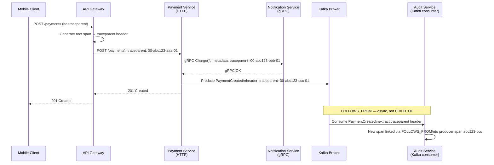

# Distributed Trace Propagation

Status: Draft | Last Reviewed: 2026-05-10 | Owner: @sre-lead
Catalog ID: OBS-002 | Radii
Tier Applicability: T0, T1, T2

## Problem Statement

Traces break at protocol boundaries without an explicit propagation standard:
- Kafka consumer starts a fresh trace with no link to the producer span — root-cause analysis requires manual log correlation
- gRPC calls lose `traceparent` because gRPC metadata is not automatically populated from HTTP headers
- WebSocket upgrades drop the HTTP handshake headers after the connection is established
- QUIC / HTTP/3 requires explicit header injection in the HEADERS frame
- ActiveMQ and SQS have no native trace header — teams invent incompatible message properties
- B3 and W3C headers used inconsistently across teams — Tempo and Dynatrace receive broken traces

## Solution

Standardise on **W3C TraceContext** (`traceparent` / `tracestate`) as the single propagation format across every protocol and middleware. Disable B3 to reduce header surface. Apply `FOLLOWS_FROM` semantics for async consumer spans.



## Implementation Guidelines

### 1. Global Propagation Configuration

Disable B3; enable W3C TraceContext + Baggage only:

```
# In JAVA_TOOL_OPTIONS (all services):
-Dotel.propagators=tracecontext,baggage
```

This single setting ensures every OTEL-instrumented service uses W3C headers and rejects B3.

### 2. HTTP / HTTPS

Handled automatically by Spring Boot 3 + Micrometer Tracing + OTEL bridge when `otel-javaagent.jar` is attached. No additional code required.

Verify propagation is active:
```yaml
# application.yml
management:
  tracing:
    propagation:
      type: W3C
```

### 3. gRPC

```java
@Configuration
public class GrpcTracingConfig {

  @Bean
  public GrpcTelemetry grpcTelemetry(OpenTelemetry openTelemetry) {
    return GrpcTelemetry.create(openTelemetry);
  }

  @Bean
  public ClientInterceptor grpcClientInterceptor(GrpcTelemetry grpcTelemetry) {
    return grpcTelemetry.newClientInterceptor();
  }

  @Bean
  public ServerInterceptor grpcServerInterceptor(GrpcTelemetry grpcTelemetry) {
    return grpcTelemetry.newServerInterceptor();
  }
}
```

Gradle dependency:
```groovy
implementation 'io.opentelemetry.instrumentation:opentelemetry-grpc-1.6:2.x.x'
```

### 4. WebSocket (STOMP)

The `traceparent` must be captured during the HTTP upgrade handshake and stored in the WebSocket session, then restored for each STOMP message handler.

```java
@Component
public class TraceContextHandshakeInterceptor implements HandshakeInterceptor {

  private final TextMapPropagator propagator =
      GlobalOpenTelemetry.getPropagators().getTextMapPropagator();

  @Override
  public boolean beforeHandshake(ServerHttpRequest request,
                                  ServerHttpResponse response,
                                  WebSocketHandler wsHandler,
                                  Map<String, Object> attributes) {
    Context ctx = propagator.extract(Context.current(),
        request.getHeaders(), HttpHeadersGetter.INSTANCE);
    attributes.put("otel.parent.context", ctx);
    return true;
  }

  @Override
  public void afterHandshake(ServerHttpRequest request, ServerHttpResponse response,
                              WebSocketHandler wsHandler, Exception exception) {}
}

// Restore in STOMP message handler:
@MessageMapping("/payments/status")
public void handleStatus(SimpMessageHeaderAccessor accessor, PaymentStatusMessage msg) {
  Context parentCtx = (Context) accessor.getSessionAttributes()
      .getOrDefault("otel.parent.context", Context.current());
  try (Scope scope = parentCtx.makeCurrent()) {
    Span span = GlobalOpenTelemetry.getTracer("payment-gateway")
        .spanBuilder("ws.payment.status")
        .setSpanKind(SpanKind.SERVER)
        .startSpan();
    try (Scope s2 = span.makeCurrent()) {
      processStatus(msg);
    } finally {
      span.end();
    }
  }
}
```

### 5. QUIC / HTTP/3

QUIC uses HEADERS frames (identical structure to HTTP/3 headers). The OTEL HTTP instrumentation library handles injection automatically when using Netty QUIC transport:

```groovy
implementation 'io.opentelemetry.instrumentation:opentelemetry-netty-4.1:2.x.x'
```

Note: QUIC/HTTP/3 support in OTEL Java is still maturing. Verify with `opentelemetry-javaagent` >= 2.3.0. Deep-dive implementation guide deferred — see Section 10 (Out of Scope) in the Wave 2a spec.

### 6. Kafka

```java
@Configuration
public class KafkaTracingConfig {

  @Bean
  public KafkaTelemetry kafkaTelemetry(OpenTelemetry openTelemetry) {
    return KafkaTelemetry.builder(openTelemetry)
        .setCapturedHeaders(List.of("traceparent", "tracestate"))
        .build();
  }

  @Bean
  public ProducerFactory<String, Object> tracedProducerFactory(
      KafkaTelemetry kafkaTelemetry,
      ProducerFactory<String, Object> factory) {
    return kafkaTelemetry.wrap(factory);
  }

  @Bean
  public ConsumerFactory<String, Object> tracedConsumerFactory(
      KafkaTelemetry kafkaTelemetry,
      ConsumerFactory<String, Object> factory) {
    return kafkaTelemetry.wrap(factory);
    // Consumer spans are created with FOLLOWS_FROM link to producer span automatically
  }
}
```

Gradle dependency:
```groovy
implementation 'io.opentelemetry.instrumentation:opentelemetry-kafka-clients-2.6:2.x.x'
```

### 7. SQS (AWS SDK v2)

The `opentelemetry-aws-sdk-2.2` instrumentation library auto-instruments SQS send/receive. The `traceparent` is injected as a `MessageAttribute` of type `String`.

```groovy
implementation 'io.opentelemetry.instrumentation:opentelemetry-aws-sdk-2.2:2.x.x'
```

No additional code needed — the `AwsSdkTelemetry` autoconfigure extension is picked up by the OTEL agent.

### 8. SNS → SQS

SNS passes `MessageAttribute` entries through to subscribed SQS queues automatically when `MessageAttributeName` includes `traceparent` in the subscription filter policy or when `All` is used. No special publisher handling required; the `traceparent` attribute flows end-to-end.

### 9. ActiveMQ / JMS

```groovy
implementation 'io.opentelemetry.instrumentation:opentelemetry-jms-1.1:2.x.x'
```

The agent auto-instruments JMS `MessageProducer.send()` and `MessageConsumer.receive()`. The `traceparent` is stored as a JMS `StringProperty` named `traceparent`.

Manual verification:
```java
// Producer — agent injects automatically; you can verify:
TextMessage msg = session.createTextMessage(payload);
// Agent sets: msg.setStringProperty("traceparent", currentTraceparent);
producer.send(msg);

// Consumer — agent extracts automatically:
// Span parent set from msg.getStringProperty("traceparent")
```

## Protocol Reference Table

| Protocol | Carrier | Header / Property | Span relationship | Library / Config |
|---|---|---|---|---|
| HTTP/HTTPS | Request header | `traceparent`, `tracestate` | CHILD_OF | Spring Boot auto (OTEL bridge) |
| gRPC | gRPC Metadata | `traceparent` | CHILD_OF | `opentelemetry-grpc-1.6` |
| WebSocket/STOMP | HTTP upgrade header → session attribute | `traceparent` | CHILD_OF | Manual interceptor (§4) |
| QUIC / HTTP/3 | HEADERS frame | `traceparent` | CHILD_OF | Netty QUIC + OTEL HTTP instrumentation |
| Kafka | Message header | `traceparent` | FOLLOWS_FROM | `opentelemetry-kafka-clients-2.6` |
| SQS | MessageAttribute (String) | `traceparent` | FOLLOWS_FROM | `opentelemetry-aws-sdk-2.2` |
| SNS → SQS | SNS MessageAttribute passthrough | `traceparent` | FOLLOWS_FROM | No special handling required |
| ActiveMQ / JMS | JMS StringProperty | `traceparent` | FOLLOWS_FROM | `opentelemetry-jms-1.1` |

## CHILD_OF vs FOLLOWS_FROM Semantics

- **CHILD_OF**: The child span's execution is part of the parent's — the parent waits for the child. Used for synchronous RPC (HTTP, gRPC, WebSocket request/response).
- **FOLLOWS_FROM**: The consumer executes independently and may run minutes or hours after the producer. The link is for root-cause analysis, not timing attribution. Used for all async message consumers (Kafka, SQS, ActiveMQ).

A Kafka consumer span linked via `FOLLOWS_FROM` appears in the same trace in Grafana Tempo and Dynatrace, connected to the producer span, but is not counted as part of the producer's duration.

## W3C Baggage Propagation

Carry business context across service boundaries for downstream filtering and sampling:

```java
// Set at API Gateway entry point
Baggage.current().toBuilder()
    .put("customer.tier", customerTier)
    .put("payment.reference", paymentReference)
    .build()
    .makeCurrent();
```

Baggage is automatically propagated via `baggage` header by the OTEL agent. Downstream services can read it:

```java
String tier = Baggage.current().getEntryValue("customer.tier");
// Use tier for conditional sampling or logging enrichment
```

## NFR Acceptance Criteria

- **Zero broken traces**: Any T0 payment flow spanning HTTP → gRPC → Kafka must produce a single connected trace in Grafana Tempo. Verified by integration test asserting a single `traceId` across all spans.
- **FOLLOWS_FROM links present**: Kafka consumer spans must carry a `FOLLOWS_FROM` link to the producer span — verified by inspecting Tempo trace JSON in integration tests.
- **W3C only**: No `X-B3-TraceId` or `X-B3-SpanId` headers present on any service-to-service call. CI contract test fails if B3 headers detected.
- **Baggage not leaking PII**: `baggage` header contents audited in quarterly security review; `customer.tier` and `payment.reference` only — no `pan`, `cccd`, `otp`.

## Compliance Mapping

| Layer | Reference | Section/Control | How this satisfies |
|---|---|---|---|
| Ring 0 (generic) | W3C TraceContext Recommendation (WHATWG) | `traceparent` / `tracestate` format | Standard defines the propagation format used across all protocols |
| Ring 0 (generic) | OpenTelemetry Specification — Context Propagation | Propagators API | Canonical implementation of W3C TraceContext |
| Ring 1 (intl banking) | BCBS 239 §6 Accuracy | End-to-end traceability of data lineage | `FOLLOWS_FROM` links provide audit trail across async boundaries |
| Ring 1 (intl banking) | BCBS 230 Principle 6 ⚠️ (working summary — pending PDF fetch) | Incident management — root-cause identification | Connected traces across all protocols enable rapid root-cause analysis |
| Ring 2 (Vietnam) | SBV Circular 09/2020 §IV.3 ⚠️ (working summary — pending Legal review) | IT audit trail requirements | Single `traceId` through payment flow satisfies end-to-end audit trail |

## Cost / FinOps Notes

| Item | Driver | Order of magnitude |
|---|---|---|
| W3C `traceparent` header | 55 bytes per request | Negligible network overhead |
| OTEL instrumentation libraries | Open-source, included in agent | $0 |
| Baggage propagation overhead | ~100 bytes per request | Negligible |
| Broken-trace debugging cost | Per P1 incident without propagation | 4–8 engineer-hours saved per incident |

## Threat Model Summary

STRIDE focus: **Spoofing** and **Information Disclosure** via trace headers.

- **Top 3 threats addressed**:
  1. *Trace injection — attacker inserts crafted `traceparent` to pollute trace data* — API Gateway validates `traceparent` format via W3C regex; malformed headers rejected (new root span created instead).
  2. *PII in W3C Baggage* — baggage contents allowlisted (`customer.tier`, `payment.reference`); CI test fails if PII field names appear in baggage.
  3. *Cross-tenant trace correlation via shared `traceId`* — traceId is generated per request; no shared IDs across tenants; Tempo access controlled by tenant namespace.
- **Top 3 residual threats**:
  1. *B3 header accepted by an uninstrumented legacy service* — mitigation: periodic header audit; network policy blocks direct service-to-service calls bypassing the mesh.
  2. *Baggage size blow-up* — mitigation: OTEL Collector processor limits baggage entries; `memory_limiter` caps Collector memory.
  3. *Consumer `FOLLOWS_FROM` link missing for new middleware* — mitigation: integration test verifies link count in trace; any new middleware requires OBS-002 update before T0 deployment.

## Operational Runbook (stub)

**Alerts:**
- `TracePropagationGap`: Spans with no parent that are not from a known entry-point service (API Gateway, scheduler) → P2 ticket. Indicates broken propagation at a new service boundary. Investigate the service and add appropriate instrumentation library.
- `B3HeaderDetected`: Any `X-B3-TraceId` header on inter-service calls → P2. Investigate legacy service; migrate to W3C propagation.

**Dashboards:** Grafana — `trace-coverage` (percentage of T0 requests with complete end-to-end trace; percentage of Kafka consumer spans with `FOLLOWS_FROM` link).

**On-call playbook:**
1. Open Grafana Tempo; filter by `service.name=payment-gateway`; select a recent T0 trace.
2. Verify the trace spans all services in the payment flow.
3. If a span is missing: identify the boundary (which upstream → downstream pair); check if the downstream service has the correct OTEL instrumentation library version.
4. For Kafka gaps: verify `KafkaTelemetry` bean is in the consumer service; check `kafkaTelemetry.wrap(consumerFactory)` is applied.

## Test Strategy (stub)

- **Unit**: W3C `traceparent` format validation — assert regex `^00-[0-9a-f]{32}-[0-9a-f]{16}-[0-9a-f]{2}$` accepted; assert malformed header creates new root span.
- **Integration**: End-to-end test via all 8 protocols (HTTP → gRPC → Kafka → SQS); assert single `traceId` across all spans; assert Kafka consumer span has `FOLLOWS_FROM` link.
- **Contract**: CI check — no `X-B3-TraceId` in captured HTTP exchanges (using MockMvc or WireMock request inspection).
- **Chaos**: Kill the OTEL Collector during a T0 payment flow; assert the payment completes successfully; assert a new trace appears after Collector recovery.

## Threat Model

**Trace Forgery — injected traceparent header (Tampering)**: an external client sends a request with a crafted `traceparent` header containing a pre-chosen `traceId`, causing the bank's internal traces to be linked to attacker-controlled trace context — enabling correlation attacks where the attacker probes which trace IDs appear in the backend. Mitigation: the API gateway regenerates a fresh `traceId` for all inbound requests from untrusted external sources (sampled=`01` dropped; a new root span started); internal service-to-service `traceparent` is trusted only over mTLS-authenticated channels (PLT-001).

**Trace Context Stripping — middleware misconfiguration (Denial of Service)**: an intermediate proxy or load balancer is upgraded and drops all custom headers including `traceparent`, breaking trace continuity across a critical service boundary and making it impossible to correlate payment flow spans for incident investigation. Mitigation: trace propagation integration tests run in CI as contract tests (assert single `traceId` across the full HTTP/Kafka/gRPC flow); any build that drops trace continuity fails CI; Collector alerts on orphaned root spans from known internal services.

## Operational Runbook (stub)

1. Alert: TraceGapDetected — fires when span ingestion shows a service boundary with no parent-child link for more than 5% of T0 traces in a 10-minute window. p50 resolution: 15 min; p99: 1 hour. Identify the broken boundary: query Grafana Tempo for traces with orphaned child spans. Check if the intermediate service was recently updated (ArgoCD audit log). Re-run the trace propagation integration test against the deployed version to confirm the regression.

2. Alert: BaggagePropagationFailure — fires when `sre-team-tier` Baggage entry is absent from > 1% of downstream span attributes. p50 resolution: 10 min; p99: 30 min. Check `otel.propagators` JVM flag on the service pod — must include `baggage`. Restart the pod with the correct propagator configuration.

## Related Patterns

- [OBS-001 OpenTelemetry Instrumentation](otel-instrumentation.md) — agent setup and OTEL Collector configuration
- [OBS-003 Structured Logging Standard](structured-logging-standard.md) — `traceId` from OTEL context injected into log MDC
- [OBS-005 Async Middleware Observability](async-middleware-observability.md) — Kafka lag alerting builds on FOLLOWS_FROM semantics
- [INT-010 AsyncAPI Specification](../integration/asyncapi-specification.md) — AsyncAPI `traceparent` header in message schema
- [INT-011 CloudEvents Envelope Standard](../integration/cloudevents-envelope.md) — `techcombank-traceparent` extension attribute
- [PLT-001 Service Mesh Traffic Management](../platform/service-mesh-traffic.md) — Istio generates mesh spans; same `traceparent` propagated

## References

- [W3C TraceContext Recommendation](https://www.w3.org/TR/trace-context/)
- [OpenTelemetry Context Propagation](https://opentelemetry.io/docs/concepts/context-propagation/)
- [OpenTelemetry Java Instrumentation Libraries](https://github.com/open-telemetry/opentelemetry-java-instrumentation)
- [W3C Baggage](https://www.w3.org/TR/baggage/)

---

**Key Takeaway**: Set `-Dotel.propagators=tracecontext,baggage` globally. Use `CHILD_OF` for sync calls (HTTP, gRPC, WebSocket); use `FOLLOWS_FROM` for async consumers (Kafka, SQS, ActiveMQ, JMS). Add the appropriate OTEL instrumentation library for each protocol. Verify with an integration test that asserts a single `traceId` across the full payment flow.
