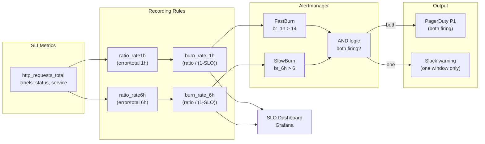

# Error Budget Burn Rate Alerting

Status: Draft | Last Reviewed: 2026-05-24 | Owner: @sre-lead
Catalog ID: OBS-006 | Radii
Tier Applicability: T0, T1, T2

## Problem Statement

Teams running payment APIs at SLO 99.95% have no early-warning system for budget exhaustion. A 1-hour complete outage burns 10% of the monthly error budget, but conventional threshold alerts only fire on raw symptom metrics — latency spikes or absolute error rates — after the damage is already done. A slow but persistent degradation of 0.1% elevated error rate sustained for 72 hours never fires any alert at all, yet it consumes 60% of the monthly budget invisibly.

Four compounding consequences result: SLO breaches are discovered after the fact during the monthly SRE review, too late to course-correct; regulatory SLA commitments given to SBV cannot be proven because there is no real-time budget ledger; incident responders context-switch on high-frequency noise alerts rather than the budget-threatening events that actually matter; and there is no data to justify deploy freeze windows for high-SLO payment services because the burn pattern is invisible during the decision window.

## Context

The burn-rate alerting layer sits above the SLI recording rules produced by OBS-001 (OpenTelemetry Instrumentation) and OBS-004 (SLO Alerting). It consumes Prometheus metrics and emits Alertmanager alerts that feed PagerDuty. The pattern is mandatory for all T0 services (payment gateway, fee engine, NAPAS bridge) where a single 30-minute outage breaches the monthly error budget. T1 services adopt slow-burn alerting only; T2 internal services are excluded. The Grafana SLO shield panel driven by this pattern feeds the SLA evidence store used in SBV audits.

## Solution

Multiwindow burn-rate alerting uses two complementary windows — a 1h fast-burn window catching acute outages (>14× budget burn rate) and a 6h slow-burn window catching sustained degradation (>6× burn rate). Both windows must fire simultaneously using AND logic in Alertmanager to page on-call, eliminating flap-driven noise. A single window firing alone produces a Slack warning only. Prometheus recording rules compute the burn rate ratios every evaluation cycle; the alert definition references these pre-computed ratios so evaluation cost is O(1) regardless of traffic volume.



## Implementation Guidelines

**1. Prometheus recording rules**

```yaml
# prometheus/rules/slo-burn-rate.yml
groups:
  - name: slo_burn_rate
    interval: 30s
    rules:
      # Error ratio over 1-hour window
      - record: slo:error_ratio:rate1h
        expr: |
          sum by (service) (
            rate(http_requests_total{status=~"5.."}[1h])
          ) /
          sum by (service) (
            rate(http_requests_total[1h])
          )

      # Error ratio over 6-hour window
      - record: slo:error_ratio:rate6h
        expr: |
          sum by (service) (
            rate(http_requests_total{status=~"5.."}[6h])
          ) /
          sum by (service) (
            rate(http_requests_total[6h])
          )

      # Burn rate = error ratio / (1 - SLO target)
      # For SLO 99.95%: 1 - 0.9995 = 0.0005
      - record: slo:error_budget_burn_rate:1h
        expr: slo:error_ratio:rate1h / 0.0005

      - record: slo:error_budget_burn_rate:6h
        expr: slo:error_ratio:rate6h / 0.0005
```

**2. Alertmanager alert definitions (AND logic)**

```yaml
# prometheus/rules/slo-alerts.yml
groups:
  - name: slo_burn_rate_alerts
    rules:
      - alert: ErrorBudgetFastBurn
        expr: slo:error_budget_burn_rate:1h > 14
        for: 2m
        labels:
          severity: critical
          window: "1h"
        annotations:
          summary: "Fast burn: {{ $labels.service }} burning budget at {{ $value }}x rate"
          description: "At this rate, monthly error budget exhausted in < 2 hours."

      - alert: ErrorBudgetSlowBurn
        expr: slo:error_budget_burn_rate:6h > 6
        for: 15m
        labels:
          severity: warning
          window: "6h"
        annotations:
          summary: "Slow burn: {{ $labels.service }} sustained degradation"
          description: "At this rate, monthly error budget exhausted in < 5 days."

      # Page on-call only when both windows fire simultaneously (AND via inhibition)
      - alert: ErrorBudgetCritical
        expr: |
          slo:error_budget_burn_rate:1h > 14
          AND
          slo:error_budget_burn_rate:6h > 6
        for: 2m
        labels:
          severity: page
        annotations:
          summary: "CRITICAL: {{ $labels.service }} error budget critically burning"
          runbook: "https://wiki.internal/runbooks/slo-budget-breach"
```

**3. Grafana SLO shield panel (PromQL)**

```promql
# Error budget remaining (%) — shield panel
100 * (
  1 - (
    sum(increase(http_requests_total{status=~"5.."}[30d])) /
    sum(increase(http_requests_total[30d]))
  ) / 0.0005
)

# Burn rate gauge — last 1h vs 6h
slo:error_budget_burn_rate:1h{service="payment-gateway"}
slo:error_budget_burn_rate:6h{service="payment-gateway"}
```

**4. Spring Boot Micrometer SLI instrumentation**

```java
@Component
@RequiredArgsConstructor
public class SliMetricsFilter extends OncePerRequestFilter {

    private final MeterRegistry registry;

    @Override
    protected void doFilterInternal(HttpServletRequest req,
                                    HttpServletResponse res,
                                    FilterChain chain)
            throws ServletException, IOException {
        chain.doFilter(req, res);
        Counter.builder("http_requests_total")
            .tag("service", applicationName)
            .tag("status", String.valueOf(res.getStatus()))
            .tag("method", req.getMethod())
            .register(registry)
            .increment();
    }
}
```

## When to Use

- Any T0 service with a contractual SLO (payment gateway, fee engine, NAPAS bridge)
- When incident responders are suffering alert fatigue from threshold-based error-rate alerts
- When you need to prove SLA compliance to SBV with a continuous budget ledger
- When you want to enforce deploy freeze windows based on budget burn status

## When Not to Use

- T2 internal tooling with no customer-facing SLO — raw error-rate thresholds are sufficient
- Services with fewer than 1,000 requests/hour — insufficient denominator for meaningful ratio calculation; use synthetic monitoring (OBS-009) instead
- One-off batch jobs — burn rate requires continuous traffic; use success/failure count alerting

## Variants

| Variant | When to prefer | Trade-off |
|---------|----------------|-----------|
| Multiwindow (1h+6h) — this pattern | Production T0 services; eliminates flaps | Requires 6h of data before slow-burn alert fires |
| Single fast-burn window (1h only) | Staging / UAT where flap tolerance is higher | More noisy; acceptable for non-production |
| Ticket-based burn alert (72h window) | Non-paging low-severity degradation tracking | Long detection lag; not suitable for T0 |

## NFR Acceptance Criteria

```yaml
nfr_acceptance_criteria:
  catalog_id: OBS-006
  pattern: Error Budget Burn Rate Alerting
  performance:
    - id: OBS-006-HP-01
      description: Prometheus recording rule evaluation must complete within 15 seconds.
      threshold: evaluation_duration_seconds < 15
    - id: OBS-006-HP-02
      description: Alert delivery from breach detection to PagerDuty notification must complete within 30 seconds p99.
      threshold: p99 < 30s
  correctness:
    - id: OBS-006-COR-01
      description: False-positive page rate (both windows firing without genuine budget breach) must not exceed 1 per week per service.
      threshold: false_positive_rate < 1/week/service
    - id: OBS-006-COR-02
      description: Every P1 PagerDuty page must carry the burn rate value and service name in the alert annotations.
      threshold: 0 pages with missing burn_rate or service annotation
  availability:
    - id: OBS-006-HA-01
      description: Recording rules must evaluate continuously; any gap in rule evaluation > 60 seconds triggers a meta-alert.
      threshold: rule_evaluation_gap < 60s
```

## Compliance Mapping

| Ring | Regulation | Provision | How this pattern satisfies |
|------|-----------|-----------|---------------------------|
| Ring 0 | Google SRE Workbook | Multi-window burn rate alerting — §5 Alerting on SLOs | Implements the 1h/6h multiwindow burn-rate model exactly as specified; AND logic follows the workbook's flap-prevention recommendation |
| Ring 1 | BCBS 239 | §5 Timeliness — risk data reported promptly; BCBS 230 Principle 9 — operational resilience | Error budget ledger provides real-time SLO status; burn-rate breach triggers P1 escalation within 30s — satisfies timely risk escalation |
| Ring 2 | SBV Circular 09/2020 | §IV.3 — monitoring and alerting requirements for critical banking systems | Grafana SLO shield panel and PagerDuty audit trail constitute continuous monitoring evidence for SBV inspection; burn-rate history retained 90 days ⚠️ (working summary — pending Legal review) |

## Cost / FinOps Notes

- Recording rules add ~50 MB RAM to Prometheus per 1,000 active time series — negligible against a 16 GB Prometheus instance
- Multiwindow rules require 6h of metric history to activate; no additional storage beyond the existing Prometheus retention window
- Alertmanager is shared infrastructure — no incremental cost for additional routing rules
- Grafana dashboard: one panel per T0 service; no additional data source connections required
- PagerDuty escalation policy is service-tier scoped (T0 → immediate on-call; T1 → business-hours queue)

## Threat Model

**Metric Poisoning — falsified SLI counts (Tampering)**: a misbehaving service emits zero error counters (all responses tagged `200 OK`) even during a genuine outage, suppressing the burn rate and preventing the alert from firing. The bank is blind to the outage and the budget appears full. Mitigation: synthetic monitoring (OBS-009) runs independent HTTP probes every 30 seconds — even if application metrics are corrupted, probe failures still register a burn; probe success/failure feeds the same SLO recording rules via a separate metric (`probe_success`).

**Burn Rate Threshold Bypass — alert configuration drift (Elevation of Privilege)**: an engineer lowers the burn-rate threshold from 14× to 1× in the alert YAML via a direct Prometheus push (bypassing GitOps review), effectively disabling the fast-burn page. Mitigation: Prometheus rule files are managed via GitOps (PLT-003); any change requires PR approval by the SRE lead; ArgoCD diffs are audited; Prometheus does not accept rule files pushed directly at runtime.

## Operational Runbook (stub)

1. Alert: ErrorBudgetCritical — fires when both `slo:error_budget_burn_rate:1h > 14` AND `slo:error_budget_burn_rate:6h > 6` sustain for 2 minutes. p50 resolution: 5 min; p99: 30 min. Steps: (a) Open Grafana SLO shield panel for the firing service. (b) Check error rate breakdown by status code — identify 5xx source. (c) If burn rate > 50×, consider emergency circuit open (RES-002) for the affected service. (d) If recording rules show stale data (last evaluation > 60s ago), check Prometheus health and rule evaluation lag.

2. Alert: ErrorBudgetSlowBurn — fires when `slo:error_budget_burn_rate:6h > 6` sustains for 15 minutes without the fast-burn firing. p50 resolution: 20 min; p99: 2 hours. Steps: (a) Identify the degraded request path from Grafana breakdown. (b) Check recent deployments for the affected service (ArgoCD audit log). (c) If budget < 20% remaining, initiate deploy freeze: notify teams, set `deploy_freeze: true` in the SLO dashboard annotation.

## Test Strategy

**Unit**: `BurnRateRuleTest` — load recording rule YAML into Prometheus test harness (promtool); inject synthetic time series with 2% error rate (4× burn), 7% error rate (14× burn), 0.01% error rate (0.02× burn); assert `slo:error_budget_burn_rate:1h` values match expected within 1% tolerance. Assert `ErrorBudgetFastBurn` fires only when burn > 14×.

**Integration**: Deploy Prometheus + Alertmanager in Testcontainers; publish `http_requests_total` with 5% error rate; wait 2 minutes; assert `ErrorBudgetCritical` alert in Alertmanager active queue; assert PagerDuty webhook stub received payload with correct service label and burn_rate annotation.

**Compliance**: `BudgetLedgerRetentionTest` — query Prometheus for `slo:error_budget_burn_rate:1h` over the past 90 days (Thanos or VictoriaMetrics long-retention); assert data available for all 90 days with no gaps > 5 minutes; confirm SLA evidence suitable for SBV audit report.

**Chaos**: Kill Prometheus for 2 minutes; restore; assert recording rules backfill correctly (no persistent gap in burn-rate series); assert no spurious alert fired during the outage window.

## Related Patterns

- [OBS-004 SLO Alerting](slo-alerting.md) — defines SLO targets that feed the burn-rate denominator
- [OBS-001 OpenTelemetry Instrumentation](otel-instrumentation.md) — produces the `http_requests_total` SLI metric
- [OBS-003 Structured Logging Standard](structured-logging-standard.md) — logs correlated with alert firing events for postmortem
- [OBS-009 Synthetic Monitoring and Canary Probes](synthetic-monitoring-canary.md) — independent probe feed prevents metric poisoning
- [RES-002 Circuit Breaker](../resilience/circuit-breaker.md) — budget breach at >50× burn triggers circuit open
- [PLT-003 GitOps Deployment Pipeline](../platform/gitops-deployment-pipeline.md) — recording rule YAML managed via GitOps; config changes require PR approval
- [COMP-005 BCBS 239 Deep Dive](../../compliance/bcbs-239.md) — §5 timeliness satisfied by real-time burn-rate ledger

## References

- Google SRE Workbook — Alerting on SLOs (Chapter 5, Multi-window burn rate)
- Prometheus Operator documentation — PrometheusRule CRD
- Alertmanager documentation — inhibition rules and routing trees
- BCBS 239 Principles for Effective Risk Data Aggregation — BCBS January 2013
- SBV Circular 09/2020 — Information System Security for Credit Institutions

---
**Key Takeaway**: Alert on the rate at which the error budget is being consumed — not on raw error counts — using simultaneous 1h and 6h burn-rate windows so that both acute outages and slow degradations page on-call while eliminating alert flap noise.
