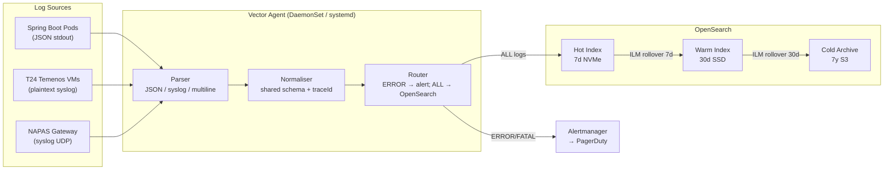

# Log Aggregation Pipeline

Status: Draft | Last Reviewed: 2026-05-24 | Owner: @sre-lead
Catalog ID: OBS-008 | Radii
Tier Applicability: T0, T1, T2

## Problem Statement

A 200-microservice banking platform generates logs in at least three formats — JSON from Spring Boot services, unstructured plaintext from legacy T24 Temenos VMs, and multiline Java stack traces from payment gateways — across Kubernetes pods, bare-metal appliances, and NAPAS gateway network devices. Without a unified pipeline, four critical operational failures occur.

Log correlation across system boundaries is impossible: a failed payment generates an error in the payment gateway, a timeout in the ledger service, and a retry in NAPAS, but no shared field links these events. A compliance officer investigating a suspicious transaction spends 3–4 hours manually correlating logs from three separate systems. SBV audit requests for "all logs related to account X between date A and date B" cannot be answered in less than one business day.

Log retention is ad-hoc and non-compliant: some Kubernetes pods retain 7 days of logs before log rotation discards them, legacy VMs retain 1 day, but the regulatory minimum for T0 transaction logs is 7 years under Vietnam's Decree 13/2023. Critical ERROR logs do not trigger PagerDuty — engineers discover incidents by accident or from customer complaints.

## Context

The log aggregation pipeline sits between application log emitters and the OpenSearch storage and query layer. Vector agents run as DaemonSets on every Kubernetes node and as systemd services on legacy VMs. The pipeline is mandatory for T0 transaction audit trails and is the primary log source for the security operations centre. It integrates with OBS-002 (Distributed Trace Propagation) by extracting the `traceId` from MDC (Mapped Diagnostic Context) to enable log-trace correlation, and with SEC-012 (Tamper-Evident Audit Logging) for the T0 audit log tier.

## Solution

Vector agents on every node normalise all log formats to a shared JSON schema — including `traceId`, `spanId`, `serviceId`, `accountId` (where present), `severity`, and `timestamp` in ISO-8601 UTC — then ship to an OpenSearch ingest pipeline. A severity router sends `ERROR` and `FATAL` events to an Alertmanager webhook for PagerDuty delivery within 60 seconds. Three retention tiers are enforced via OpenSearch Index Lifecycle Management: hot (7 days, NVMe), warm (30 days, SSD), and cold archive (7 years, S3-compatible object storage). The cold archive satisfies the Decree 13/2023 and SBV 7-year retention requirement for T0 transaction logs.



## Implementation Guidelines

**1. Vector source and transform configuration**

```yaml
# vector/vector.yml
sources:
  kubernetes_logs:
    type: kubernetes_logs
    auto_partial_merge: true    # merge multiline Java stack traces

  syslog_udp:
    type: syslog
    address: 0.0.0.0:514
    mode: udp
    max_length: 65536

transforms:
  parse_and_normalise:
    type: remap
    inputs: [kubernetes_logs, syslog_udp]
    source: |
      # Attempt JSON parse; fall back to plaintext
      parsed, err = parse_json(.message)
      if err == null {
        . = merge(., parsed)
      } else {
        .message = .message
        .parsed_format = "plaintext"
      }

      # Normalise severity
      .severity = upcase(string!(.level ?? .severity ?? .log_level ?? "INFO"))

      # Extract traceId from Spring MDC JSON field or X-B3-TraceId
      .traceId = string(.mdc.traceId ?? .trace_id ?? "")
      .spanId  = string(.mdc.spanId  ?? .span_id  ?? "")

      # Enforce ISO-8601 UTC timestamp
      .timestamp = format_timestamp!(
        to_timestamp!(.timestamp ?? now()), format: "%+")

      # Enrich from Kubernetes pod labels
      .serviceId = string(.kubernetes.pod_labels."app.kubernetes.io/name" ?? "unknown")

      # Drop internal Vector metadata fields
      del(.kubernetes.pod_annotations)
      del(.source_type)

sinks:
  opensearch:
    type: elasticsearch
    inputs: [parse_and_normalise]
    endpoint: "http://opensearch:9200"
    index: "logs-%Y.%m.%d"
    bulk:
      action: index

  alertmanager_errors:
    type: http
    inputs: [parse_and_normalise]
    uri: "http://alertmanager:9093/api/v2/alerts"
    method: post
    encoding:
      codec: json
    conditions:
      - type: vrl
        source: ".severity == \"ERROR\" || .severity == \"FATAL\""
```

**2. OpenSearch Index Lifecycle Management (ILM) policy**

```json
{
  "policy": {
    "phases": {
      "hot": {
        "min_age": "0ms",
        "actions": {
          "rollover": { "max_age": "7d", "max_size": "50gb" },
          "set_priority": { "priority": 100 }
        }
      },
      "warm": {
        "min_age": "7d",
        "actions": {
          "shrink": { "number_of_shards": 1 },
          "forcemerge": { "max_num_segments": 1 },
          "set_priority": { "priority": 50 }
        }
      },
      "cold": {
        "min_age": "30d",
        "actions": {
          "searchable_snapshot": {
            "snapshot_repository": "s3-archive"
          },
          "set_priority": { "priority": 0 }
        }
      },
      "delete": {
        "min_age": "2557d",
        "actions": { "delete": {} }
      }
    }
  }
}
```

**3. Spring Boot Logback MDC integration (traceId injection)**

```xml
<!-- logback-spring.xml -->
<configuration>
  <appender name="JSON_STDOUT" class="ch.qos.logback.core.ConsoleAppender">
    <encoder class="net.logstash.logback.encoder.LogstashEncoder">
      <includeMdc>true</includeMdc>
      <customFields>{"serviceId":"${spring.application.name}"}</customFields>
    </encoder>
  </appender>
  <root level="INFO">
    <appender-ref ref="JSON_STDOUT"/>
  </root>
</configuration>
```

```java
// OTEL Java agent automatically populates MDC fields traceId and spanId
// when spring.application.name and otel.service.name are configured.
// Manual MDC enrichment for business fields:
@Component
@RequiredArgsConstructor
public class AccountMdcFilter extends OncePerRequestFilter {
    @Override
    protected void doFilterInternal(HttpServletRequest req,
                                    HttpServletResponse res,
                                    FilterChain chain) throws ServletException, IOException {
        try {
            String accountId = req.getHeader("X-Account-Id");
            if (accountId != null) {
                MDC.put("accountId", accountId);
            }
            chain.doFilter(req, res);
        } finally {
            MDC.remove("accountId");
        }
    }
}
```

**4. Log correlation query (OpenSearch DSL)**

```json
{
  "query": {
    "bool": {
      "must": [
        { "term": { "traceId": "4bf92f3577b34da6a3ce929d0e0e4736" } },
        { "range": { "timestamp": {
          "gte": "2026-05-24T10:00:00Z",
          "lte": "2026-05-24T11:00:00Z"
        }}}
      ]
    }
  },
  "sort": [{ "timestamp": { "order": "asc" } }],
  "_source": ["timestamp", "serviceId", "severity", "message", "accountId", "traceId"]
}
```

## When to Use

- Any multi-service banking system where log correlation across service boundaries is required for compliance or incident response
- When T0 transaction log retention must meet the 7-year regulatory minimum (Decree 13/2023)
- When ERROR severity events must trigger real-time PagerDuty alerts (< 60s delivery)
- When legacy on-premise systems (T24 VMs, NAPAS appliances) must be unified into the same query interface as cloud-native services

## When Not to Use

- Single-service applications with no cross-service correlation requirement — direct stdout shipping to CloudWatch or Datadog is simpler
- Services with very low log volume (< 100 events/minute) — Vector DaemonSet overhead is not justified; use sidecar log shipper instead
- Real-time streaming log processing with sub-second latency requirements — use Kafka + Flink pipeline instead of Vector + OpenSearch batch ingest

## Variants

| Variant | When to prefer | Trade-off |
|---------|----------------|-----------|
| Vector + OpenSearch (this pattern) | On-premise or hybrid; full control over retention | Operational overhead of managing OpenSearch cluster |
| Fluent Bit + Loki | Pure Kubernetes; Grafana-native stack | Less mature ILM; index-free makes long-retention archives harder |
| Kafka + Flink + OpenSearch | Sub-second streaming analytics on logs | Much higher complexity; justified only for real-time fraud detection pipelines |

## NFR Acceptance Criteria

```yaml
nfr_acceptance_criteria:
  catalog_id: OBS-008
  pattern: Log Aggregation Pipeline
  performance:
    - id: OBS-008-HP-01
      description: Log ingestion lag from emission to OpenSearch indexing must not exceed 5 seconds p99.
      threshold: p99 < 5s
    - id: OBS-008-HP-02
      description: OpenSearch query for 1 million log events by traceId must complete within 10 seconds.
      threshold: query_duration < 10s for 1M events
    - id: OBS-008-HP-03
      description: ERROR log event to PagerDuty delivery must complete within 60 seconds.
      threshold: delivery_latency < 60s
  availability:
    - id: OBS-008-HA-01
      description: Vector agent disk buffer must survive agent restart without log loss.
      threshold: 0 log events lost on Vector restart
  compliance:
    - id: OBS-008-COMP-01
      description: T0 transaction logs must be retained in cold archive for 7 years (2557 days).
      threshold: cold_retention = 2557 days with 0 events deleted early
```

## Compliance Mapping

| Ring | Regulation | Provision | How this pattern satisfies |
|------|-----------|-----------|---------------------------|
| Ring 0 | OpenTelemetry Logs Specification | OTEL log data model — traceId, spanId, severity fields | Vector normaliser maps all log sources to the OTEL log schema; traceId extracted from MDC enables log-trace correlation in Grafana |
| Ring 1 | BCBS 239 | §6 Adaptability — risk data must survive system changes; ISO/IEC 27001 A.12.4 — logging and monitoring | ILM policy ensures logs survive across hot/warm/cold tiers for the full retention window; Vector disk buffer prevents loss on agent restart; OpenSearch cluster replication factor ≥ 2 |
| Ring 2 | SBV Circular 09/2020 | §IV.2 — data logging for payment systems; Decree 13/2023 Art. 9 — personal data minimisation | T0 transaction logs retained 7 years in cold S3 archive; accountId is the only PII field in the normalised schema — no name, NID, or card number in log events; PII fields in message body must be masked before Vector ships (see SEC-008) ⚠️ (working summary — pending Legal review) |

## Cost / FinOps Notes

- Vector DaemonSet: 0.5 CPU + 512 MB RAM per node; 20 nodes = 10 CPU + 10 GB RAM — minimal overhead
- OpenSearch hot tier: 3 nodes × 4 TB NVMe SSD = 12 TB hot storage; at 50 GB/day ingest = 7 days comfortable
- Warm tier: 3 nodes × 8 TB SSD = 24 TB; cost ~60% of hot tier per GB
- Cold archive: S3-compatible at $0.023/GB/month; 7-year T0 archive for 50 GB/day = ~127 TB = ~$2,900/month
- PagerDuty routing: shared with OBS-006 alert routing; no incremental cost per additional severity filter

## Threat Model

**Log Injection — structured log poisoning (Tampering)**: an attacker sends an HTTP request with a `message` body containing JSON escape sequences designed to override the `severity` or `serviceId` fields in the normalised log schema, causing their malicious request to appear as an internal INFO log from a trusted service. Mitigation: Vector's `remap` transform parses the outer log record first, then merges parsed inner JSON only for known safe fields (`level`, `message`, `timestamp`) — `serviceId` is always sourced from Kubernetes pod labels, not from log content; the Kubernetes pod label is controlled by GitOps (PLT-003) and cannot be overridden by application code.

**Log Exfiltration — cold archive access (Information Disclosure)**: an insider with S3 access reads 7 years of T0 transaction logs from the cold archive, extracting account activity patterns for multiple customers. Mitigation: S3 cold archive bucket has server-side encryption (AES-256 with Vault-managed KMS key); bucket access requires IAM role with MFA; access logs on the S3 bucket are shipped back into the same OpenSearch pipeline; SEC-008 data masking strips PII before logs leave the Vector pipeline.

## Operational Runbook (stub)

1. Alert: LogIngestionLag — fires when Vector's `component_received_events_total` counter for the OpenSearch sink stops incrementing for more than 60 seconds (lag probe: Vector internal metrics). p50 resolution: 5 min; p99: 30 min. Check Vector disk buffer fill level (`vector top` command on the DaemonSet pod). If OpenSearch is backpressuring, check cluster health: `GET /_cluster/health`. Scale OpenSearch data nodes if disk usage > 80%.

2. Alert: ErrorLogDeliveryFailure — fires when the `alertmanager_errors` HTTP sink in Vector returns non-2xx responses for > 10 events in 5 minutes. p50 resolution: 5 min; p99: 15 min. Check Alertmanager health at `http://alertmanager:9093/-/healthy`. If Alertmanager is unavailable, ERROR alerts are queued in Vector disk buffer for up to 1 hour before dropping.

3. Alert: ILMPolicyFailure — fires when OpenSearch ILM policy execution fails for any index (check `GET /logs-*/_ilm/explain` for `step.name=ERROR`). p50 resolution: 10 min; p99: 1 hour. Most common cause: disk space exhaustion preventing rollover. Run `DELETE /logs-<oldest-date>` for the oldest hot index if disk > 90% full.

## Test Strategy

**Unit**: `VectorTransformTest` — use Vector's built-in `unit_test` framework; inject (a) valid JSON log line, (b) plaintext syslog line, (c) multiline Java stack trace; assert normalised output schema has `traceId`, `spanId`, `serviceId`, `severity`, `timestamp` in ISO-8601; assert `severity=ERROR` events route to the Alertmanager sink; assert no PII fields (`nid`, `card_number`) present in output.

**Integration**: Deploy Vector + OpenSearch + Alertmanager in Docker Compose; emit 100 log events via HTTP source including 10 ERROR events; wait 10 seconds; query OpenSearch by `traceId` — assert 100 events indexed; assert Alertmanager received exactly 10 webhook calls with correct service label; verify ILM policy applied and index in hot phase.

**Compliance**: `RetentionComplianceTest` — write synthetic T0 transaction log events; advance OpenSearch ILM clock by 2560 days (via ILM debug API); assert events still present in cold S3 snapshot tier; assert events deleted only after 2557 days.

**Chaos**: Stop OpenSearch for 5 minutes during log emit; assert Vector switches to disk buffer (no events dropped); restore OpenSearch; assert all buffered events flushed within 60 seconds; assert no duplicate events in OpenSearch.

## Related Patterns

- [OBS-001 OpenTelemetry Instrumentation](otel-instrumentation.md) — OTEL Java agent auto-populates MDC traceId/spanId for log correlation
- [OBS-002 Distributed Trace Propagation](distributed-trace-propagation.md) — W3C traceparent header populates the traceId field in logs
- [OBS-007 Distributed Tracing Sampling Strategy](tracing-sampling-strategy.md) — traceId in logs links to sampled traces in Grafana Tempo
- [SEC-012 Tamper-Evident Audit Logging](../security/audit-logging-tamper-evident.md) — T0 audit log tier uses same pipeline with HMAC signing at the sink
- [SEC-008 Data Masking](../security/data-masking.md) — PII masking applied in Vector transform before shipping to OpenSearch
- [COMP-002 SBV Circular 09/2020](../../compliance/sbv-circular-09-2020.md) — §IV.2 log retention requirements satisfied by 7-year cold archive

## References

- Vector by Datadog — documentation and VRL remap language reference
- OpenSearch documentation — Index Lifecycle Management and searchable snapshots
- OpenTelemetry Logs Specification — data model and semantic conventions
- BCBS 239 Principles for Effective Risk Data Aggregation — BCBS January 2013
- Decree 13/2023 — Personal Data Protection (Vietnam)
- SBV Circular 09/2020 — Information System Security for Credit Institutions

---
**Key Takeaway**: Normalise every log source — Kubernetes pods, legacy VMs, and network appliances — to a shared JSON schema with traceId via a Vector agent pipeline so that any payment audit investigation resolves in minutes rather than days, and T0 transaction logs remain queryable for the 7-year regulatory minimum.
