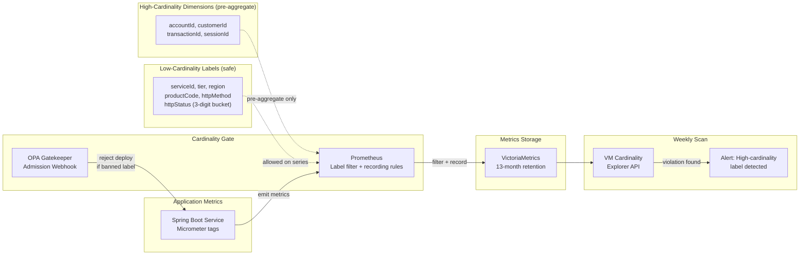

# Metrics Cardinality Management

Status: Draft | Last Reviewed: 2026-05-24 | Owner: @sre-lead
Catalog ID: OBS-010 | Radii
Tier Applicability: T0, T1, T2

## Problem Statement

Banking microservices routinely instrument high-cardinality business dimensions as Prometheus labels. A payment service that uses `accountId` as a label across 5 million accounts, combined with 3 metric names and 5 label dimensions, generates 75 million unique active time series. At 1.5 KB per series in memory, that is 112 GB of Prometheus RAM — well beyond the 16 GB instance limit — causing an out-of-memory kill within hours of a new deployment. When the metrics server crashes, the entire observability stack goes dark: no SLO alerts, no burn rate alerting, no PagerDuty — exactly during the incident where observability is most needed.

The problem compounds because there is no taxonomy defining which labels are safe. A new engineer adds `transactionId` as a label during a performance debug session and pushes it to production without review; it is only discovered during the next Prometheus OOM event two days later. High-cardinality metrics also degrade query performance: a PromQL query that touches 10 million series takes 90 seconds rather than milliseconds, making dashboards unusable during incidents. Four teams have independently solved this problem differently — creating four incompatible metrics schemas that cannot be federated.

## Context

Cardinality management sits at the intersection of the instrumentation layer (OBS-001), the metrics storage layer (Prometheus + VictoriaMetrics), and the deployment pipeline (PLT-003). The approved label taxonomy is the central governance artefact — all teams reference it; no service may introduce new label dimensions without taxonomy review. The OPA Gatekeeper admission webhook enforces the taxonomy at deployment time so violations are caught before they reach production. VictoriaMetrics is the long-term metrics store (13 months retention); Prometheus acts as the short-term aggregation and alerting layer (15 days). The cardinality budget is a FinOps concern tracked in the quarterly architecture review.

## Solution

A three-layer cardinality control: (1) an approved label taxonomy (low-cardinality labels allowed; high-cardinality dimensions pre-aggregated via recording rules); (2) a VictoriaMetrics cardinality explorer API integrated into a weekly automated scan that detects new violating labels introduced by deployments; (3) an OPA/Gatekeeper admission webhook that rejects Kubernetes deployments introducing banned label patterns in pod annotations or environment variables. Prometheus recording rules collapse high-cardinality dimensions (e.g., fee events per accountId) into low-cardinality aggregates (fee events per productCode) before storage. Pre-aggregated metrics are what dashboards and alerts query — raw high-cardinality series are never stored.



## Implementation Guidelines

**1. Approved label taxonomy and Micrometer tag filter**

```java
// Common tag policy — applied at MeterRegistry level
@Configuration
public class MetricsConfig {

    @Bean
    public MeterRegistryCustomizer<MeterRegistry> cardinalityFilter() {
        // Allow list: only these tag keys may appear on raw metrics
        Set<String> allowedTagKeys = Set.of(
            "service.id", "service.tier", "region",
            "product.code", "http.method", "http.status_code",
            "exception", "outcome"
        );
        return registry -> registry.config()
            .meterFilter(MeterFilter.denyUnless(id ->
                id.getTags().stream()
                    .allMatch(t -> allowedTagKeys.contains(t.getKey()))));
    }
}
```

| Label | Status | Max cardinality | Notes |
|-------|--------|-----------------|-------|
| `service.id` | Allowed | ~200 | One per microservice |
| `service.tier` | Allowed | 4 | T0/T1/T2/T3 |
| `region` | Allowed | 3 | HCM/HAN/DR |
| `product.code` | Allowed | ~500 | Product catalogue; reviewed quarterly |
| `http.method` | Allowed | 7 | GET/POST/PUT/PATCH/DELETE/HEAD/OPTIONS |
| `http.status_code` | Allowed | ~60 | 3-digit HTTP status |
| `account.id` | **BANNED** | 5M+ | Pre-aggregate by product code |
| `customer.id` | **BANNED** | 5M+ | Never on metrics |
| `transaction.id` | **BANNED** | unbounded | Use traces (OBS-007) for per-transaction data |

**2. Prometheus recording rule for high-cardinality pre-aggregation**

```yaml
# prometheus/rules/cardinality-aggregation.yml
groups:
  - name: pre_aggregate_high_cardinality
    rules:
      # Fee events: aggregate by productCode (NOT by accountId)
      - record: fee:events_total:by_product
        expr: |
          sum by (product_code, service_id, region) (
            fee_posted_events_total
          )

      # Payment volume: aggregate by status + product (NOT by account)
      - record: payment:volume_vnd:by_product_status
        expr: |
          sum by (product_code, status, region) (
            payment_amount_vnd_total
          )

      # Loan balance: aggregate by product tier (NOT by customer)
      - record: loan:balance_vnd:by_tier
        expr: |
          sum by (product_tier, region) (
            loan_outstanding_balance_vnd
          )
```

**3. VictoriaMetrics cardinality explorer API query (weekly scan)**

```bash
#!/bin/bash
# scripts/cardinality-weekly-scan.sh
# Run as a CronJob in Kubernetes every Monday at 06:00 UTC

VMURL="http://victoriametrics:8428"
THRESHOLD=100000   # alert if any label value count exceeds this

# Get top 20 label-value pairs by cardinality
RESULT=$(curl -s "${VMURL}/api/v1/status/tsdb?topN=20&date=2026-05-24" \
  | jq -r '.data.labelValueCountByLabelName[] | select(.value > '"${THRESHOLD}"') | "\(.name) \(.value)"')

if [ -n "$RESULT" ]; then
  echo "HIGH CARDINALITY LABELS DETECTED:"
  echo "$RESULT"
  # Post to Alertmanager webhook
  curl -s -X POST http://alertmanager:9093/api/v2/alerts \
    -H 'Content-Type: application/json' \
    -d "[{\"labels\":{\"alertname\":\"HighCardinalityLabel\",\"severity\":\"warning\"},
           \"annotations\":{\"summary\":\"High cardinality labels: ${RESULT}\"}}]"
  exit 1
fi
echo "Cardinality check PASSED — all labels within budget"
```

**4. OPA Gatekeeper constraint for banned metric label patterns**

```rego
# opa/policies/metric-label-cardinality.rego
package k8s.admissioncontrol.metrics

# Banned label keys that must not appear in Prometheus metric definitions
banned_label_keys := {"account_id", "accountId", "customer_id", "customerId",
                      "transaction_id", "transactionId", "session_id", "sessionId"}

violation[{"msg": msg}] {
    container := input.review.object.spec.template.spec.containers[_]
    env := container.env[_]
    env.name == "MANAGEMENT_METRICS_TAGS_EXTRA"
    banned_key := banned_label_keys[_]
    contains(lower(env.value), lower(banned_key))
    msg := sprintf("Banned metric label key '%v' found in container env var. Use pre-aggregation recording rules instead.", [banned_key])
}
```

## When to Use

- Any service that instruments Prometheus metrics with more than 5 label dimensions
- When a Prometheus or VictoriaMetrics OOM event has occurred or is approaching (active series > 1M per cluster)
- When onboarding new product lines that introduce new business dimensions as metric labels
- When preparing for the quarterly architecture review that includes a FinOps cardinality budget review

## When Not to Use

- Tracing data where per-request identifiers are appropriate — use OBS-007 (Distributed Tracing) for per-transaction data; metrics are for aggregates
- Development and staging environments — relax cardinality limits in non-production to allow exploratory instrumentation; enforce only in production
- Grafana Tempo or OpenSearch — cardinality management applies to Prometheus metric labels only; document storage systems have different capacity models

## Variants

| Variant | When to prefer | Trade-off |
|---------|----------------|-----------|
| Taxonomy + OPA gate (this pattern) | Multi-team production with enforced governance | Requires OPA Gatekeeper setup; adds admission latency |
| VictoriaMetrics native cardinality limits | Single-team or smaller deployment | Reactive (limits at ingest) rather than proactive (gate at deploy) |
| Metric federation + sharding | >5M active series unavoidable (e.g., FX tick data) | Significantly higher complexity; rarely needed in banking |

## NFR Acceptance Criteria

```yaml
nfr_acceptance_criteria:
  catalog_id: OBS-010
  pattern: Metrics Cardinality Management
  performance:
    - id: OBS-010-HP-01
      description: Active time series count must remain below 2 million per Prometheus/VictoriaMetrics cluster.
      threshold: active_series < 2M
    - id: OBS-010-HP-02
      description: Prometheus RSS memory must remain below 16 GB under normal operating conditions.
      threshold: prometheus_memory_rss_bytes < 16GB
    - id: OBS-010-HP-03
      description: Weekly cardinality scan must complete within 5 minutes.
      threshold: scan_duration < 5 min
  governance:
    - id: OBS-010-GOV-01
      description: OPA admission webhook false-positive rate must not exceed 2 per week.
      threshold: false_positive_rate < 2/week
    - id: OBS-010-GOV-02
      description: Any new label exceeding 10,000 unique values must be flagged within 7 days of deployment.
      threshold: detection_lag < 7 days
```

## Compliance Mapping

| Ring | Regulation | Provision | How this pattern satisfies |
|------|-----------|-----------|---------------------------|
| Ring 0 | Prometheus Best Practices | Label Cardinality — official Prometheus documentation warns against high-cardinality labels | Approved taxonomy and OPA gate implement the Prometheus best-practice guidance at an organisational governance level, preventing the cardinality explosion that has crashed Prometheus clusters at peer institutions |
| Ring 1 | BCBS 239 | §4 Data Granularity — risk data must be granular enough for aggregation; §5 Timeliness — data must be available when needed | Pre-aggregated recording rules preserve granularity at the product-code level for BCBS 239 risk data while preventing OOM conditions that would make data unavailable (violating §5 timeliness) |
| Ring 2 | SBV Circular 09/2020 | §IV.2 — data logging and monitoring systems must be available and reliable | By preventing Prometheus OOM crashes, cardinality management ensures continuous availability of the monitoring system that SBV §IV.2 requires; VictoriaMetrics 13-month retention satisfies data availability for regulatory review periods ⚠️ (working summary — pending Legal review) |

## Cost / FinOps Notes

- VictoriaMetrics at 2M active series: ~8 GB RAM per instance (vs 112 GB if cardinality is uncontrolled) — ~$120/month vs ~$1,680/month for comparable memory
- Recording rules reduce storage: pre-aggregated series store 1 series per productCode (500) vs 1 series per accountId (5M) — 10,000× storage reduction for high-cardinality metrics
- OPA Gatekeeper: shared with security policies (PLT-008, SEC-010); no incremental infrastructure cost for adding cardinality constraint
- Weekly cardinality scan: CronJob runs 1 pod for ~3 minutes/week — negligible compute
- Quarterly FinOps review includes a cardinality budget report generated from VictoriaMetrics API — 30 minutes analyst time per quarter

## Threat Model

**Label Injection — environment variable override at runtime (Elevation of Privilege)**: a developer bypasses the OPA admission webhook by injecting banned label keys via a `kubectl exec` patch to a running pod's environment (bypassing the admission controller), causing high-cardinality metrics to reach Prometheus. Mitigation: VictoriaMetrics' native ingestion-time label cardinality limit (`maxUniqueSeriesPerLabel=50000`) acts as a second defensive layer; any series exceeding this limit is rejected at ingest regardless of the admission path; the weekly cardinality scan detects the violation within 7 days.

**Cardinality Exhaustion — coordinated deployment flood (Denial of Service)**: a misconfigured CI/CD pipeline simultaneously deploys 50 services, each introducing a new high-cardinality label (e.g., `build.id`), exhausting the Prometheus cardinality budget and causing an OOM kill before the weekly scan detects it. Mitigation: OPA webhook runs synchronously at admission time and rejects the deployment before pods start; the webhook failure-closed mode means that if OPA itself is unavailable, deployments are blocked (not allowed); VictoriaMetrics row limit `maxSamplesPerQuery` prevents a single abusive label query from blocking other queries.

## Operational Runbook (stub)

1. Alert: HighCardinalityLabel — fires when weekly cardinality scan detects any label with > 100,000 unique values (metric: `vm_new_series_created_total` rate spike). p50 resolution: 20 min; p99: 2 hours. Identify the offending label using VictoriaMetrics cardinality explorer: `curl "http://victoriametrics:8428/api/v1/status/tsdb?topN=5"`. Find the service that introduced it via recent deployment log in ArgoCD. Roll back the deployment: `argocd app sync <app-name> --revision <previous-sha>`. Update the OPA constraint to include the new banned key.

2. Alert: PrometheusMemoryHigh — fires when `process_resident_memory_bytes{job="prometheus"}` exceeds 14 GB (80% of limit). p50 resolution: 15 min; p99: 1 hour. Run `topk(20, count by (__name__)({__name__=~".+"}))` in Prometheus to identify the top-20 metric families by series count. Apply the recording rule pre-aggregation pattern immediately for the offending metric. Increase Prometheus memory limit temporarily while the fix is deployed.

## Test Strategy

**Unit**: `TaxonomyEnforcementTest` — instantiate `MeterRegistryCustomizer` bean; attempt to register a counter with tag `account.id=12345`; assert tag is stripped from the registered metric; assert a counter with `product.code=LOAN_PERSONAL` is registered successfully.

**Integration**: `OpaWebhookTest` — deploy OPA Gatekeeper with the cardinality constraint in a `kind` cluster; apply a `Deployment` manifest with `env.name=MANAGEMENT_METRICS_TAGS_EXTRA` and value `accountId=true`; assert webhook rejects with HTTP 403 and message containing "Banned metric label key"; apply a compliant deployment; assert admitted.

**Compliance**: `CardinalityBudgetTest` — seed VictoriaMetrics with 1.9M series; trigger weekly scan; assert scan completes in < 5 minutes; seed with 2.1M series (over budget); assert `HighCardinalityLabel` alert fires within 8 days.

**Chaos**: Fill Prometheus to 1.8M series; force-kill Prometheus pod; restart with same data; assert Prometheus recovers within 5 minutes; assert active series count resumes within 5% of pre-crash level (recording rules re-hydrate from VictoriaMetrics federation).

## Related Patterns

- [OBS-001 OpenTelemetry Instrumentation](otel-instrumentation.md) — where metric labels originate; OTEL semantic conventions define low-cardinality label standards
- [OBS-004 SLO Alerting](slo-alerting.md) — depends on clean, low-cardinality `http_requests_total` metric for SLI calculation
- [OBS-006 Error Budget Burn Rate Alerting](error-budget-burn-rate.md) — recording rules in this pattern are the same mechanism used for burn rate pre-aggregation
- [PLT-008 Multi-Tenancy Isolation](../platform/multi-tenancy-isolation.md) — per-namespace metric isolation prevents cross-tenant cardinality bleeding
- [PLT-003 GitOps Deployment Pipeline](../platform/gitops-deployment-pipeline.md) — OPA Gatekeeper constraint deployed and version-controlled via GitOps
- [PLT-006 FinOps Cost Allocation](../platform/finops-cost-allocation.md) — cardinality budget is a FinOps metric reviewed quarterly alongside compute cost

## References

- Prometheus documentation — Best Practices: Metric and Label Naming (cardinality section)
- VictoriaMetrics documentation — cardinality explorer API and `maxUniqueSeriesPerLabel`
- OPA Gatekeeper documentation — admission webhook and ConstraintTemplate
- BCBS 239 Principles for Effective Risk Data Aggregation — BCBS January 2013
- SBV Circular 09/2020 — Information System Security for Credit Institutions

---
**Key Takeaway**: Enforce a label taxonomy that bans high-cardinality identifiers from raw metrics and pre-aggregates them via recording rules, backed by an OPA admission gate at deploy time and a weekly VictoriaMetrics cardinality scan — so Prometheus never OOMs and the observability stack remains available precisely when it is needed most.
