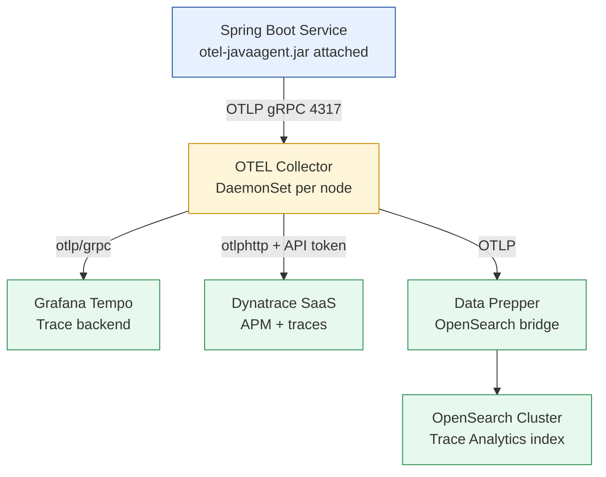

# OpenTelemetry Instrumentation

Status: Draft | Last Reviewed: 2026-05-10 | Owner: @sre-lead
Catalog ID: OBS-001 | Radii
Tier Applicability: T0, T1, T2, T3

## Problem Statement

Without consistent telemetry instrumentation:
- Engineers instrument ad hoc — traces don't correlate across services
- Vendor lock-in: switching APM tools requires code changes across every service
- T24 OFS calls, NAPAS payment flows, and KYC checks are invisible in distributed traces
- Business events (payment authorised, KYC approved) not surfaced as named spans
- Multi-backend requirements (Grafana Tempo + Dynatrace + OpenSearch) require duplicated exporter code

## Solution

Standardise on the OpenTelemetry Java SDK + Agent. The OTEL Collector acts as a vendor-neutral routing layer that fans out telemetry to all three backends without any service code changes.



## Implementation Guidelines

### 1. Agent Attachment

Add to every service's JVM startup via Kubernetes `JAVA_TOOL_OPTIONS` environment variable:

```yaml
# kubernetes/base/deployment.yaml
spec:
  containers:
    - name: payment-gateway
      image: techcombank/payment-gateway:2.3.1
      env:
        - name: JAVA_TOOL_OPTIONS
          value: >-
            -javaagent:/opt/otel/opentelemetry-javaagent.jar
            -Dotel.service.name=payment-gateway
            -Dotel.resource.attributes=service.version=2.3.1,deployment.environment=production,service.tier=T0
            -Dotel.exporter.otlp.endpoint=http://otel-collector.monitoring:4317
            -Dotel.exporter.otlp.protocol=grpc
            -Dotel.logs.exporter=none
            -Dotel.metrics.exporter=prometheus
      volumeMounts:
        - name: otel-agent
          mountPath: /opt/otel
  volumes:
    - name: otel-agent
      configMap:
        name: otel-agent-jar
```

Spring Boot `application.yml` complement:

```yaml
management:
  tracing:
    sampling:
      probability: 0.5   # default; overridden per-tier via env var
  otlp:
    tracing:
      endpoint: http://otel-collector.monitoring:4317
```

### 2. OTEL Collector Configuration

`otel-collector/config.yaml` — single Collector config governs fan-out to all three backends:

```yaml
receivers:
  otlp:
    protocols:
      grpc:
        endpoint: 0.0.0.0:4317
      http:
        endpoint: 0.0.0.0:4318

processors:
  batch:
    timeout: 5s
    send_batch_size: 1024
  resource:
    attributes:
      - action: upsert
        key: bank.environment
        value: production
  memory_limiter:
    check_interval: 5s
    limit_mib: 512
    spike_limit_mib: 128

exporters:
  otlp/tempo:
    endpoint: http://tempo.monitoring:4317
    tls:
      insecure: true

  otlphttp/dynatrace:
    endpoint: https://${env:DT_TENANT}.live.dynatrace.com/api/v2/otlp
    headers:
      Authorization: "Api-Token ${env:DT_API_TOKEN}"

  otlp/dataprepper:
    endpoint: http://data-prepper.monitoring:21890
    tls:
      insecure: true

service:
  pipelines:
    traces:
      receivers: [otlp]
      processors: [memory_limiter, batch, resource]
      exporters: [otlp/tempo, otlphttp/dynatrace, otlp/dataprepper]
    metrics:
      receivers: [otlp]
      processors: [memory_limiter, batch]
      exporters: [otlphttp/dynatrace]
```

### 3. Manual Instrumentation — Business-Critical Banking Spans

Use `@WithSpan` for service-layer methods. Add banking-specific attributes via `Span.current()`:

```java
import io.opentelemetry.api.trace.Span;
import io.opentelemetry.api.trace.StatusCode;
import io.opentelemetry.instrumentation.annotations.SpanAttribute;
import io.opentelemetry.instrumentation.annotations.WithSpan;

@Service
public class PaymentGatewayService {

  @WithSpan("payment.authorise")
  public AuthorisationResult authorisePayment(
      @SpanAttribute("payment.reference") String reference,
      @SpanAttribute("payment.amount")    BigDecimal amount,
      @SpanAttribute("payment.currency")  String currency) {

    Span span = Span.current();
    span.setAttribute("napas.channel", resolveChannel(reference));
    span.setAttribute("customer.tier", customerTierService.getTier());
    span.setAttribute("t24.ofs.function", "FUNDS.TRANSFER");

    try {
      AuthorisationResult result = t24OfsClient.authorise(reference, amount, currency);
      span.setAttribute("payment.approved", result.isApproved());
      return result;
    } catch (OfsException e) {
      span.recordException(e);
      span.setStatus(StatusCode.ERROR, "T24 OFS call failed");
      throw e;
    }
  }
}
```

**Attribute allowlist** — only these banking attributes are permitted on spans (others rejected in CI via ArchUnit):
- `payment.reference`, `payment.amount`, `payment.currency`, `payment.approved`
- `napas.channel`, `t24.ofs.function`, `customer.tier`
- Never: `customer.pan`, `customer.cccd`, `customer.password`, `customer.otp`

### 4. Sampling Strategy

Configure via OTEL Collector tail-based sampler:

| Tier | Strategy | Rate | Rationale |
|---|---|---|---|
| T0 | Always-on (head-based) | 100% | Payment flows require complete audit |
| T1 | Head-based probabilistic | 50% | Balance coverage vs storage |
| T2 | Head-based probabilistic | 10% | Cost-efficient for lower-criticality |
| T3 | Head-based probabilistic | 10% | Internal tooling |
| Error traces (any tier) | Tail-based | 100% | Never drop error traces |

```yaml
# otel-collector/config.yaml — tail sampler addition
processors:
  tail_sampling:
    decision_wait: 10s
    num_traces: 50000
    policies:
      - name: error-policy
        type: status_code
        status_code: {status_codes: [ERROR]}
      - name: t0-always
        type: string_attribute
        string_attribute: {key: service.tier, values: [T0]}
      - name: probabilistic-t1
        type: and
        and:
          and_sub_policy:
            - name: t1-tier
              type: string_attribute
              string_attribute: {key: service.tier, values: [T1]}
            - name: t1-rate
              type: probabilistic
              probabilistic: {sampling_percentage: 50}
      - name: probabilistic-t2t3
        type: probabilistic
        probabilistic: {sampling_percentage: 10}
```

### 5. Kubernetes Resource Detection

Enable K8s metadata auto-detection so all spans carry pod/node context without manual configuration:

```
# In JAVA_TOOL_OPTIONS:
-Dotel.resource.providers.k8s.enabled=true
-Dotel.resource.providers.aws.enabled=false
-Dotel.resource.providers.gcp.enabled=false
```

Ensure `MANIFEST.MF` contains `Implementation-Version` for service version attribution:

```xml
<!-- pom.xml -->
<plugin>
  <artifactId>maven-jar-plugin</artifactId>
  <configuration>
    <archive>
      <manifest>
        <addDefaultImplementationEntries>true</addDefaultImplementationEntries>
      </manifest>
    </archive>
  </configuration>
</plugin>
```

## NFR Acceptance Criteria

- **T0 trace completeness**: 100% of T0 payment flows sampled; zero T0 error traces dropped.
- **Export latency**: P99 span export latency < 100ms from span end to Tempo ingestion (measured via Collector `otelcol_exporter_send_latency_bucket`).
- **Agent CPU overhead**: < 2% additional CPU in steady state vs uninstrumented service (load test gate in CI).
- **Collector availability**: DaemonSet; pod disruption budget max 1 unavailable per node. Collector crash causes graceful degradation (spans buffered then dropped); service continues.
- **Attribute PII gate**: CI ArchUnit rule rejects any `span.setAttribute` call with a field name matching the PII denylist. Build fails on violation.

## Compliance Mapping

| Layer | Reference | Section/Control | How this satisfies |
|---|---|---|---|
| Ring 0 (generic) | NIST SP 800-92 (Guide to Log Management) | §4.3 Trace and audit trail requirements | OTEL traces provide immutable per-request audit records for all T0 operations |
| Ring 0 (generic) | OpenTelemetry Specification (CNCF graduated) | Trace data model; SDK API contract | Canonical vendor-neutral implementation; prevents vendor lock-in |
| Ring 1 (intl banking) | BCBS 239 §6 Accuracy | "Data aggregation processes shall be accurate" | Distributed traces correlate every hop of a payment — accurate incident reconstruction |
| Ring 1 (intl banking) | SWIFT CSP 2024 §6.5A | Detect anomalous activity — logging and monitoring | Trace-level visibility into SWIFT connector calls supports anomaly detection |
| Ring 2 (Vietnam) | SBV Circular 09/2020 §IV.3 ⚠️ (working summary — pending Legal review) | IT audit trail requirements | Traces + structured logs satisfy audit trail requirements for core banking operations |

## Cost / FinOps Notes

| Item | Driver | Order of magnitude |
|---|---|---|
| OTEL Java Agent | Open-source, CNCF graduated | $0 |
| OTEL Collector (DaemonSet) | ~64 MB RAM per node × node count | Negligible vs node cost |
| Grafana Tempo (traces storage) | ~1 GB/day T0+T1 @ blended sampling | Storage cost only; no per-span charge |
| Dynatrace | Davis AI + OTLP trace/metric ingest | Licensed separately — negotiate DPU cap |
| OpenSearch Data Prepper | Managed OpenSearch storage | ~$0.10/GB/month; ILM keeps hot tier small |

**Cost of NOT instrumenting**: a P1 incident requiring 4-hour manual log correlation across 8 services costs ~32 engineer-hours. One such incident per quarter exceeds a full year of Tempo + OpenSearch storage costs.

## Threat Model Summary

STRIDE focus: **Information Disclosure** and **Elevation of Privilege** via telemetry data.

- **Top 3 threats addressed**:
  1. *PII in span attributes* — `@SpanAttribute` annotations reviewed at code review gate; CI ArchUnit rejects PAN/CCCD field names in span attributes.
  2. *Trace injection via spoofed `traceparent`* — API Gateway validates `traceparent` format (W3C regex) and rejects malformed headers before propagation.
  3. *OTEL Collector as SPOF* — DaemonSet topology; Collector crash causes graceful degradation (spans lost, service continues); `otelcol_exporter_enqueue_failed_spans > 0` triggers P2 alert.
- **Top 3 residual threats**:
  1. *Developers add PII to span attributes over time* — mitigation: quarterly span attribute audit; CI PII gate.
  2. *Dynatrace API token leaked* — mitigation: token in HashiCorp Vault; rotated quarterly; scoped to `Ingest metrics,traces` only.
  3. *Sampling gaps at T2/T3 masking intermittent errors* — mitigation: tail-based error policy always samples errors regardless of tier.

## Operational Runbook (stub)

**Alerts:**
- `OtelCollectorExportFailed`: `otelcol_exporter_send_failed_spans > 0` sustained 2 min → PagerDuty P2. Check Collector pod logs; verify backend network connectivity.
- `TraceIngestLag`: Tempo ingest lag > 30s → P2. Check Collector queue depth; scale Collector replicas via HPA.
- `DtOtlpAuthFailure`: Dynatrace exporter HTTP 401/403 errors → P2. Rotate `DT_API_TOKEN` in Vault; rolling restart Collector pods.
- `CollectorOomKilled`: Collector pod OOMKilled → P1. Increase `memory_limiter.limit_mib` in ConfigMap; apply rolling restart.

**Dashboards:** Grafana — `otel-collector-health` (span throughput, export errors by backend, queue depth, memory usage).

**On-call playbook:**
1. Check `otel-collector-health` dashboard for which backend is failing.
2. `kubectl logs -n monitoring -l app=otel-collector --tail=200` for error details.
3. If Collector OOMKilled: increase `limit_mib` → 768; rolling restart.
4. If Dynatrace 401: `vault kv get secret/dynatrace/api-token`; rotate; update K8s secret; rolling restart Collector.
5. If Tempo unreachable: traces buffer for up to 5 min in Collector queue then drop; escalate to platform team; OpenSearch continues to receive traces.

## Test Strategy (stub)

- **Unit**: `@WithSpan`-annotated methods produce a span with correct attributes — use `InMemorySpanExporter` from `opentelemetry-sdk-testing`; assert `payment.reference`, `napas.channel`, `customer.tier` present; assert PAN field absent.
- **Integration**: Testcontainers starts OTEL Collector + Jaeger (as test backend); payment flow produces parent→child span chain with correct `payment.reference` attribute; assert `traceId` same across all spans.
- **Config validation**: `otelcol validate --config otel-collector/config.yaml` runs in CI on every config change.
- **Sampling**: Gatling load test at T1 rate; assert actual sampled percentage within ±5% of 50% target.
- **Overhead**: JMH benchmark of instrumented vs uninstrumented `authorisePayment`; CI fails if instrumented overhead > 3%.

## Related Patterns

- [OBS-002 Distributed Trace Propagation](distributed-trace-propagation.md) — how `traceparent` crosses service/protocol boundaries
- [OBS-003 Structured Logging Standard](structured-logging-standard.md) — logs correlated via `traceId` from OTEL context
- [OBS-004 SLO Alerting](slo-alerting.md) — SLI measurements derived from OTEL metrics
- [OBS-005 Async Middleware Observability](async-middleware-observability.md) — OTEL propagation through Kafka, SQS, ActiveMQ
- [PLT-001 Service Mesh Traffic Management](../platform/service-mesh-traffic.md) — Istio telemetry feeds OTEL Collector
- [PLT-002 CNCF Stack Selection](../platform/cncf-stack-selection.md) — Grafana Tempo and OpenSearch governed selection
- [BP-007 Golden Signals (SRE)](../../best-practices/golden-signals-sre.md) — traces → latency signal source
- [PRIN-001 API-First Design](../../principles/api-first-design.md) — OTEL applied to REST and async APIs

## References

- [OpenTelemetry Java Agent](https://opentelemetry.io/docs/zero-code/java/agent/)
- [OTEL Collector Documentation](https://opentelemetry.io/docs/collector/)
- [Grafana Tempo OTEL Integration](https://grafana.com/docs/tempo/latest/)
- [Dynatrace OTLP Ingest](https://docs.dynatrace.com/docs/extend-dynatrace/opentelemetry/)
- [OpenSearch Data Prepper OTEL](https://opensearch.org/docs/latest/data-prepper/)
- [NIST SP 800-92](https://csrc.nist.gov/publications/detail/sp/800-92/final)

---

**Key Takeaway**: Attach the OTEL Java Agent to every service. Route spans through a shared OTEL Collector that fans out to Grafana Tempo, Dynatrace, and OpenSearch without code changes. Use `@WithSpan` for business-critical banking events. Never place PAN, CCCD, or credentials in span attributes.
