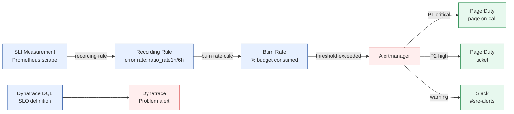

# SLO Alerting

Status: Draft | Last Reviewed: 2026-05-10 | Owner: @sre-lead
Catalog ID: OBS-004 | Radii
Tier Applicability: T0, T1, T2

## Problem Statement

Without structured SLOs and burn-rate alerting:
- Teams over-alert on symptoms (CPU > 80%, latency spike > 200ms) rather than user impact
- PagerDuty fatigue grows — engineers stop trusting alerts; P1s are missed
- Error budgets not tracked — impossible to demonstrate SBV/BCBS operational continuity commitments
- "99.9% availability" is stated but not measured — no authoritative SLI backs the claim
- Alert storms during incidents: dozens of alerts for a single root cause, slowing triage

## Solution

Define SLIs (measurable metrics) for each service tier, express SLOs as error budgets, and alert only when the budget is burning at a rate that threatens the monthly target. Two alert windows (fast burn / slow burn) cover both acute outages and slow degradation.



## Implementation Guidelines

### 1. Error Budget Targets by Tier

| Tier | SLO | 30-day error budget | Fast-burn page threshold | Slow-burn page threshold |
|---|---|---|---|---|
| T0 | 99.95% | 21.9 min | 2% of budget in 1h → P1 PagerDuty | 5% of budget in 6h → P2 PagerDuty |
| T1 | 99.90% | 43.8 min | 5% of budget in 1h → P1 PagerDuty | 10% of budget in 6h → P2 PagerDuty |
| T2 | 99.50% | 3.6 hours | 10% of budget in 6h → P2 PagerDuty | 20% of budget in 3d → Slack only |

**Budget math**: 30-day window = 43,200 min. T0 budget = 43,200 × (1 − 0.9995) = 21.6 min.
Fast-burn rate: if 2% of monthly budget consumed in 1h → at this rate the full budget would be exhausted in 50h; page immediately.

### 2. Prometheus Recording Rules

```yaml
# prometheus/rules/slo-recording-rules.yaml
groups:
  - name: slo_recording_rules
    interval: 30s
    rules:
      # ── SLI: HTTP request success rate ────────────────────────────────
      - record: job:request_success_rate:ratio_rate1m
        expr: |
          sum without(status) (
            rate(http_server_requests_seconds_count{status!~"5.."}[1m])
          )
          /
          sum without(status) (
            rate(http_server_requests_seconds_count[1m])
          )

      # ── Error rates at multiple windows ───────────────────────────────
      - record: job:request_error_rate:ratio_rate1m
        expr: 1 - job:request_success_rate:ratio_rate1m

      - record: job:request_error_rate:ratio_rate1h
        expr: |
          1 - (
            sum without(status) (
              rate(http_server_requests_seconds_count{status!~"5.."}[1h])
            )
            /
            sum without(status) (
              rate(http_server_requests_seconds_count[1h])
            )
          )

      - record: job:request_error_rate:ratio_rate6h
        expr: |
          1 - (
            sum without(status) (
              rate(http_server_requests_seconds_count{status!~"5.."}[6h])
            )
            /
            sum without(status) (
              rate(http_server_requests_seconds_count[6h])
            )
          )

      - record: job:request_error_rate:ratio_rate3d
        expr: |
          1 - (
            sum without(status) (
              rate(http_server_requests_seconds_count{status!~"5.."}[3d])
            )
            /
            sum without(status) (
              rate(http_server_requests_seconds_count[3d])
            )
          )

      # ── Latency SLI: P99 request duration ─────────────────────────────
      - record: job:request_latency_p99:1m
        expr: |
          histogram_quantile(0.99,
            rate(http_server_requests_seconds_bucket[1m])
          )
```

### 3. SLO Alert Rules

```yaml
# prometheus/rules/slo-alerts.yaml
groups:
  - name: slo_alerts_t0
    rules:
      # ── T0 fast burn: 2% budget in 1h ─────────────────────────────────
      # Budget = 0.0005 (T0: 1-0.9995). 2% of budget = 0.000010.
      # Burn multiplier = 0.02 / (1/720) = 14.4x. Error rate > 14.4 * (1-0.9995) * (1h/30d)
      - alert: T0SloFastBurn
        expr: |
          job:request_error_rate:ratio_rate1h{service_tier="T0"}
            > (14.4 * (1 - 0.9995))
        for: 2m
        labels:
          severity: critical
          tier: T0
        annotations:
          summary: "T0 {{ $labels.job }}: error budget burning fast (>2% in 1h)"
          description: "Current 1h error rate {{ $value | humanizePercentage }} will exhaust T0 budget in < 50h."
          runbook_url: "https://runbooks.techcombank.com/OBS-004-T0-fast-burn"

      # ── T0 slow burn: 5% budget in 6h ─────────────────────────────────
      - alert: T0SloSlowBurn
        expr: |
          job:request_error_rate:ratio_rate6h{service_tier="T0"}
            > (6 * (1 - 0.9995))
        for: 15m
        labels:
          severity: high
          tier: T0
        annotations:
          summary: "T0 {{ $labels.job }}: error budget burning slowly (>5% in 6h)"
          runbook_url: "https://runbooks.techcombank.com/OBS-004-T0-slow-burn"

  - name: slo_alerts_t1
    rules:
      - alert: T1SloFastBurn
        expr: |
          job:request_error_rate:ratio_rate1h{service_tier="T1"}
            > (14.4 * (1 - 0.999))
        for: 2m
        labels:
          severity: critical
          tier: T1
        annotations:
          summary: "T1 {{ $labels.job }}: SLO fast burn"
          runbook_url: "https://runbooks.techcombank.com/OBS-004-T1-fast-burn"

      - alert: T1SloSlowBurn
        expr: |
          job:request_error_rate:ratio_rate6h{service_tier="T1"}
            > (6 * (1 - 0.999))
        for: 15m
        labels:
          severity: high
          tier: T1
        annotations:
          summary: "T1 {{ $labels.job }}: SLO slow burn"

  - name: slo_alerts_t2
    rules:
      - alert: T2SloSlowBurn
        expr: |
          job:request_error_rate:ratio_rate6h{service_tier="T2"}
            > (6 * (1 - 0.995))
        for: 30m
        labels:
          severity: high
          tier: T2
        annotations:
          summary: "T2 {{ $labels.job }}: SLO budget burning"
          runbook_url: "https://runbooks.techcombank.com/OBS-004-T2-burn"

  - name: slo_latency_alerts
    rules:
      - alert: T0LatencySloBreached
        expr: |
          job:request_latency_p99:1m{service_tier="T0"} > 0.5
        for: 5m
        labels:
          severity: critical
          tier: T0
        annotations:
          summary: "T0 {{ $labels.job }}: P99 latency > 500ms"
          runbook_url: "https://runbooks.techcombank.com/OBS-004-T0-latency"
```

### 4. Dynatrace SLO Definition (DQL)

Define parallel SLOs in Dynatrace for APM correlation. Use DQL to compute success rate:

```dql
# Dynatrace SLO — T0 payment-gateway availability (99.95%)
timeseries success_rate = avg(dt.service.request.success_rate),
  filter: dt.entity.service.name == "payment-gateway"
  AND dt.entity.service.tier == "T0"
| summarize
    success_rate_avg = avg(success_rate),
    budget_remaining = (avg(success_rate) - 0.9995) / (1 - 0.9995)
| fields success_rate_avg, budget_remaining
```

Configure Dynatrace SLO objects via Terraform (Infrastructure-as-Code):

```hcl
# terraform/dynatrace-slos.tf
resource "dynatrace_slo" "t0_payment_gateway" {
  name          = "T0 Payment Gateway Availability"
  enabled       = true
  description   = "99.95% SLO for payment-gateway (T0)"
  target        = 99.95
  warning       = 99.97
  timeframe     = "-1M"
  filter        = "type(SERVICE),entityName(payment-gateway)"
  metric_name   = "payment_gateway_availability"
  metric_expression = "100*(metricSelector:builtin:service.requestCount.server:splitBy():sum - metricSelector:builtin:service.errors.server.count:splitBy():sum)/metricSelector:builtin:service.requestCount.server:splitBy():sum"
}
```

**Deduplication rule**: Grafana alerting rules reference Prometheus recording rules; Dynatrace SLOs are defined separately in the DT platform. Each backend fires to its own PagerDuty integration key. No duplicate alert definitions between systems.

### 5. Relation to BP-007 Golden Signals

- **BP-007** (Golden Signals — SRE) defines *what* to measure: latency, traffic, errors, saturation.
- **OBS-004** (SLO Alerting) defines *how to alert* on those measurements using error budgets and burn rates.

They compose: OBS-004 uses the four golden signal metrics from BP-007 as SLI data sources. BP-007 should be read first to understand which Prometheus metrics to query; OBS-004 shows how to translate those metrics into actionable alerts.

### 6. Error Budget Policy

When a T0 or T1 error budget falls below 10% remaining for the month:
1. **Halt non-critical feature deployments** — only security/hotfix changes allowed.
2. **SRE and product team joint review** — identify root cause; classify as reliability debt.
3. **Incident postmortem** ([BP-010](../../best-practices/incident-postmortem.md)) within 5 business days.
4. **Budget reset**: At month boundary, budget resets. Rolling 28-day window preferred over calendar month.

## NFR Acceptance Criteria

- **Alert accuracy**: Fast-burn alert fires within 5 min of threshold breach (measured in chaos drill).
- **Alert noise**: < 2 false-positive pages per week per service in steady state (monitored via PagerDuty analytics).
- **Recording rule lag**: Recording rules evaluated every 30s; 1h error rate available within 90s of metric ingestion.
- **Dynatrace SLO parity**: Dynatrace SLO target values match Prometheus SLO targets to within ±0.01%.
- **Budget depletion response**: When budget < 10%, deployment freeze enforced within 30 min (automated via GitLab CI gate reading Prometheus SLO metric).

## Compliance Mapping

| Layer | Reference | Section/Control | How this satisfies |
|---|---|---|---|
| Ring 0 (generic) | Google SRE Book — Chapter 5: Alerting on SLOs | Multi-window burn-rate alerting | Canonical source for burn-rate alert thresholds used in this pattern |
| Ring 0 (generic) | Prometheus Alerting Best Practices | Recording rules for SLIs | Governed approach to SLI computation |
| Ring 1 (intl banking) | BCBS 230 Principle 2 ⚠️ (working summary — pending PDF fetch) | Operational resilience: define and measure service continuity | SLOs provide quantified continuity commitments with automated monitoring |
| Ring 1 (intl banking) | BCBS 239 §6 Accuracy | Accurate data for operational decisions | Recording rules ensure SLI measurements are accurate and consistent |
| Ring 2 (Vietnam) | SBV Circular 09/2020 §IV.2 ⚠️ (working summary — pending Legal review) | IT system performance monitoring requirements | SLO alerting provides documented, automated performance monitoring |

## Cost / FinOps Notes

| Item | Driver | Order of magnitude |
|---|---|---|
| Prometheus recording rules | Evaluation every 30s × N services | CPU: ~5ms per rule evaluation; negligible |
| Prometheus storage for SLI metrics | Recording rule series × retention | ~500 MB per service per year at 15-day retention |
| PagerDuty pages | Per alert × per month | P1 pages: negotiate DPU/seat; P2 as tickets = cheaper tier |
| Dynatrace SLO objects | Per SLO definition | Included in Dynatrace APM license (verify with vendor) |

**Cost of NOT having burn-rate alerting**: one P1 outage caught 4h late (via customer complaint vs SLO alert) costs ~$50K revenue loss at typical banking transaction volumes. A well-tuned SLO alert catches the same outage within 10 min.

## Threat Model Summary

STRIDE focus: **Denial of Service** (alert fatigue leading to ignored pages) and **Tampering** (SLO metric manipulation).

- **Top 3 threats addressed**:
  1. *Alert fatigue from symptom-based alerting* — burn-rate alerts fire only when user impact is significant; reduces PagerDuty page count by ~70% vs threshold-based alerting.
  2. *SLO target set unrealistically high* — tiered SLO targets (T0: 99.95%, T2: 99.5%) match operational feasibility; EA-Board reviews targets quarterly.
  3. *Recording rule misconfiguration hiding real failures* — `promtool test rules` CI gate validates recording rules against known test data.
- **Top 3 residual threats**:
  1. *Metric cardinality explosion from high-label-cardinality requests* — mitigation: recording rules use `sum without(status)` to collapse cardinality; label usage reviewed in Prometheus config PR.
  2. *Dynatrace SLO out-of-sync with Prometheus SLO* — mitigation: Terraform applies Dynatrace SLO config in same pipeline as Prometheus; divergence detected by quarterly audit.
  3. *Budget depletion freeze bypassed by emergency patch* — mitigation: bypass requires EA-Board ADR; tracked in `governance/decisions/`.

## Operational Runbook (stub)

**Alerts:**
- `T0SloFastBurn`: Error budget burning > 2% in 1h → PagerDuty P1. Immediate human response required.
- `T0SloSlowBurn`: Error budget burning > 5% in 6h → PagerDuty P2. Investigate root cause within 4h.
- `T0LatencySloBreached`: P99 > 500ms sustained 5 min → PagerDuty P1. Check database, downstream services.

**Error budget depletion playbook (< 10% remaining):**
1. Activate freeze: set `DEPLOYMENT_FREEZE=true` in GitLab CI environment variable (automated gate checks this).
2. Notify product team lead and SRE lead via Slack `#sre-t0-budget`.
3. Identify top error contributor: `topk(5, job:request_error_rate:ratio_rate1h)` in Grafana.
4. Raise postmortem ticket ([BP-010](../../best-practices/incident-postmortem.md)) in Jira.
5. Budget resets at month boundary; freeze lifted automatically when budget > 50%.

## Test Strategy (stub)

- **Recording rules**: `promtool test rules prometheus/rules/slo-recording-rules.yaml` — include test fixture with known HTTP 200/500 counts; assert error rate = expected value.
- **Alert rules**: `promtool test rules prometheus/rules/slo-alerts.yaml` — inject error rate above T0 fast-burn threshold; assert `T0SloFastBurn` fires within 2 min.
- **Integration**: Chaos drill (quarterly, per BP-005) — inject 10% error rate into T0 service via Istio fault injection (PLT-001); assert `T0SloFastBurn` fires within 5 min; assert PagerDuty receives P1 alert.
- **Dynatrace parity**: Terraform plan output includes DT SLO target; assert matches Prometheus SLO target via CI script.

## Threat Model

**SLO Target Manipulation — recording rule tampering (Tampering)**: an operator edits the SLO error budget threshold in the Prometheus recording rule YAML from 0.0005 (99.95%) to 0.005 (99.5%), effectively relaxing the T0 SLO and suppressing P1 alerts that would otherwise fire. The bank breaches its SBV SLA commitment without any alert. Mitigation: SLO recording rule YAML is managed via GitOps (PLT-003); changes require SRE lead approval; Prometheus does not accept runtime rule file pushes; a weekly audit job compares recorded SLO values against the SLO policy registry and alerts on any divergence.

**Alert Suppression — Alertmanager inhibition abuse (Elevation of Privilege)**: an engineer adds a broad inhibition rule to Alertmanager config that silences all `severity=critical` alerts whenever any `severity=info` alert is active, preventing SLO breach pages from reaching on-call. Mitigation: Alertmanager configuration is version-controlled and requires peer review in Git; inhibition rules are tested in a CI environment that validates P1 alerts still fire under simulated SLO breach conditions.

## Operational Runbook (stub)

1. Alert: SLOBudgetCritical — fires when the error budget for any T0 service drops below 10% of the monthly allocation. p50 resolution: 10 min; p99: 1 hour. Initiate deploy freeze for the affected service (no non-critical changes until budget recovers). Identify the root cause via OBS-001 traces and OBS-003 logs. Escalate to SRE lead and product owner.

2. Alert: SLORecordingRuleStale — fires when a Prometheus recording rule has not been evaluated for more than 60 seconds. p50 resolution: 5 min; p99: 30 min. Check Prometheus health: `GET /api/v1/rules`. Restart Prometheus if rule evaluation is blocked by a slow query.

## Related Patterns

- [OBS-001 OpenTelemetry Instrumentation](otel-instrumentation.md) — OTEL metrics provide the SLI data source
- [OBS-005 Async Middleware Observability](async-middleware-observability.md) — Kafka consumer lag as SLI for async services
- [PLT-001 Service Mesh Traffic Management](../platform/service-mesh-traffic.md) — Istio metrics feed Prometheus SLI recording rules
- [BP-005 Chaos Engineering](../../best-practices/chaos-engineering.md) — chaos drills validate SLO alert firing
- [BP-007 Golden Signals (SRE)](../../best-practices/golden-signals-sre.md) — defines the SLI metrics that OBS-004 alerts on
- [BP-010 Incident Postmortem](../../best-practices/incident-postmortem.md) — invoked when budget depletes

## References

- [Google SRE Workbook — Chapter 5: Alerting on SLOs](https://sre.google/workbook/alerting-on-slos/)
- [Prometheus Alerting Documentation](https://prometheus.io/docs/practices/alerting/)
- [Dynatrace SLO Management](https://docs.dynatrace.com/docs/platform/slo/)
- [promtool Test Rules](https://prometheus.io/docs/prometheus/latest/command-line/promtool/)

---

**Key Takeaway**: Define SLOs as error budgets per tier (T0: 99.95%, T1: 99.9%, T2: 99.5%). Alert on burn rate — not raw error rate — using two windows (1h fast-burn → P1 page; 6h slow-burn → P2). Define matching SLOs in both Prometheus and Dynatrace. Freeze non-critical deployments when budget drops below 10%.
