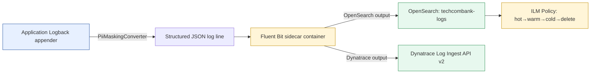

# Structured Logging Standard

Status: Draft | Last Reviewed: 2026-05-10 | Owner: @sre-lead
Catalog ID: OBS-003 | Radii
Tier Applicability: T0, T1, T2, T3

## Problem Statement

Ad-hoc logging across services causes production blind spots and compliance failures:
- Inconsistent field names (`customerId` vs `customer_id` vs `userId`) prevent cross-service log correlation
- PII (account numbers, CCCD IDs, PAN) appears in plain text in log lines — violates Decree 13/2023
- No `traceId` in logs — cannot correlate log lines with distributed traces
- No index lifecycle policy — OpenSearch hot tier grows unboundedly, causing storage alerts
- Multiple log formats (plain text, semi-structured, JSON) make automated parsing unreliable

## Solution

Mandate a single JSON log schema with mandatory fields, apply PII masking at emission via Logback, and enforce an OpenSearch ILM policy per tier.



## Implementation Guidelines

### 1. Mandatory JSON Log Schema

Every log line emitted by every Techcombank service must include these fields:

```json
{
  "timestamp": "2026-05-10T10:30:15.123Z",
  "level": "INFO",
  "logger": "com.techcombank.payment.PaymentGatewayService",
  "service.name": "payment-gateway",
  "service.version": "2.3.1",
  "environment": "production",
  "tier": "T0",
  "traceId": "4bf92f3577b34da6a3ce929d0e0e4736",
  "spanId": "00f067aa0ba902b7",
  "message": "Payment authorisation approved",
  "payment.reference": "TCB-2026-001234",
  "napas.channel": "IBFT",
  "duration_ms": 187
}
```

**Field rules:**
- `timestamp`: ISO 8601 UTC (Z suffix); millisecond precision
- `traceId` / `spanId`: injected automatically by OTEL MDC bridge — no manual MDC.put() required
- `tier`: set via `service.tier` resource attribute in OBS-001; propagated to log via Logback
- Domain-specific fields (`payment.reference`, `napas.channel`, etc.): optional; must not contain PII

### 2. PII Masking — Logback MaskingConverter

Masking happens at the appender level before the log line leaves the JVM. Never rely on downstream scrubbing.

```java
package com.techcombank.logging;

import ch.qos.logback.classic.pattern.ClassicConverter;
import ch.qos.logback.classic.spi.ILoggingEvent;
import java.util.Set;
import java.util.regex.Pattern;

public class PiiMaskingConverter extends ClassicConverter {

  private static final Set<String> MASKED_KEYS = Set.of(
      "pan", "cvv", "cvv2", "accountNumber", "iban",
      "cccdNumber", "biometricHash", "password", "pin",
      "otp", "secretQuestion", "customerId"
  );

  private static final Pattern KEY_VALUE_PATTERN = Pattern.compile(
      "\"(" + String.join("|", MASKED_KEYS) + ")\"\\s*:\\s*\"([^\"]+)\"",
      Pattern.CASE_INSENSITIVE
  );

  @Override
  public String convert(ILoggingEvent event) {
    String msg = event.getFormattedMessage();
    return KEY_VALUE_PATTERN.matcher(msg).replaceAll(m ->
        "\"" + m.group(1) + "\":\"***" + maskTail(m.group(2)) + "\""
    );
  }

  private String maskTail(String value) {
    if (value == null || value.length() <= 4) return "****";
    return value.substring(value.length() - 4);
  }
}
```

### 3. Logback Configuration

```xml
<!-- src/main/resources/logback-spring.xml -->
<configuration>
  <conversionRule conversionWord="pii"
      converterClass="com.techcombank.logging.PiiMaskingConverter"/>

  <springProperty scope="context" name="SERVICE_NAME"
      source="spring.application.name" defaultValue="unknown-service"/>
  <springProperty scope="context" name="SERVICE_VERSION"
      source="spring.application.version" defaultValue="0.0.0"/>
  <springProperty scope="context" name="TIER"
      source="service.tier" defaultValue="T3"/>

  <appender name="STDOUT" class="ch.qos.logback.core.ConsoleAppender">
    <encoder class="net.logstash.logback.encoder.LogstashEncoder">
      <customFields>{"service.name":"${SERVICE_NAME}","service.version":"${SERVICE_VERSION}","tier":"${TIER}","environment":"${SPRING_PROFILES_ACTIVE:-local}"}</customFields>
      <fieldNames>
        <timestamp>timestamp</timestamp>
        <message>message</message>
        <logger>logger</logger>
        <thread>thread</thread>
      </fieldNames>
      <!-- OTEL MDC bridge injects traceId and spanId automatically -->
      <provider class="net.logstash.logback.composite.loggingevent.MdcJsonProvider"/>
    </encoder>
  </appender>

  <!-- Apply PII masking via converter -->
  <appender name="MASKED_STDOUT" class="ch.qos.logback.core.ConsoleAppender">
    <encoder class="ch.qos.logback.classic.encoder.PatternLayoutEncoder">
      <pattern>%pii{STDOUT}</pattern>
    </encoder>
  </appender>

  <root level="INFO">
    <appender-ref ref="STDOUT"/>
  </root>

  <logger name="com.techcombank" level="INFO"/>
  <logger name="org.springframework" level="WARN"/>
  <logger name="org.hibernate" level="WARN"/>
</configuration>
```

### 4. Log Level Policy

| Level | When to use | Examples |
|---|---|---|
| ERROR | Requires immediate attention; SLA breach risk | Payment OFS timeout, DB connection lost, circuit breaker opened |
| WARN | Suspicious but not immediately failing | Retry attempt 2/3, slow query > 500ms, cache miss rate > 30%, DLQ message received |
| INFO | Important business events | Order created, payment authorised, KYC approved, user logged in, session expired |
| DEBUG | Detailed troubleshooting — **disabled in production** | Method entry/exit, SQL parameter values, HTTP request/response headers |

**Rule**: never log at ERROR for a client error (4xx). Client errors are INFO (business event) or WARN (repeated bad requests from same IP). ERROR is reserved for server-side failures.

### 5. OpenSearch Index Strategy and ILM

**Index naming pattern**: `techcombank-logs-{service.name}-{yyyy.MM.dd}`

**T0 / T1 ILM policy** (5-year retention for SBV audit):
```json
{
  "policy": {
    "phases": {
      "hot": {
        "min_age": "0ms",
        "actions": {
          "rollover": { "max_size": "50gb", "max_age": "7d" },
          "set_priority": { "priority": 100 }
        }
      },
      "warm": {
        "min_age": "7d",
        "actions": {
          "shrink": { "number_of_shards": 1 },
          "forcemerge": { "max_num_segments": 1 },
          "set_priority": { "priority": 50 }
        }
      },
      "cold": {
        "min_age": "30d",
        "actions": {
          "freeze": {},
          "set_priority": { "priority": 0 }
        }
      },
      "delete": {
        "min_age": "5y",
        "actions": { "delete": {} }
      }
    }
  }
}
```

**T2 / T3 ILM policy** (90-day retention):
```json
{
  "policy": {
    "phases": {
      "hot": { "min_age": "0ms", "actions": { "rollover": { "max_age": "3d" } } },
      "warm": { "min_age": "3d", "actions": { "shrink": { "number_of_shards": 1 } } },
      "delete": { "min_age": "90d", "actions": { "delete": {} } }
    }
  }
}
```

### 6. Fluent Bit Sidecar Configuration

```ini
# fluent-bit/fluent-bit.conf
[INPUT]
    Name              tail
    Path              /var/log/containers/*.log
    Parser            json
    Tag               kube.*

[FILTER]
    Name              record_modifier
    Match             kube.*
    Record            cluster techcombank-prod

[OUTPUT]
    Name              opensearch
    Match             kube.*
    Host              opensearch.monitoring.svc.cluster.local
    Port              9200
    Index             techcombank-logs-${service.name}
    Type              _doc
    tls               On
    tls.verify        On

[OUTPUT]
    Name              dynatrace
    Match             kube.*
    Host              ${DT_TENANT}.live.dynatrace.com
    apitoken          ${DT_LOG_INGEST_TOKEN}
    logIngestUrl      /api/v2/logs/ingest
    tlsSkipVerify     false
```

## NFR Acceptance Criteria

- **Zero PII in production logs**: CI pipeline runs `grep -E '"(pan|cvv|accountNumber|cccdNumber|password|pin|otp)"\s*:\s*"[^*]'` against integration test log output; fails build on match.
- **100% JSON**: Log lines failing JSON parse rejected at Fluent Bit; `fluentbit_filter_drop_records_total > 0` triggers P2 alert.
- **`traceId` present**: All INFO/ERROR logs during a traced request must include `traceId`; verified by integration test asserting MDC propagation.
- **ILM policy applied**: OpenSearch index template includes ILM policy reference; verified by CI OpenSearch health check.
- **T0 log retention**: Logs retained for 5 years — verified annually by EA audit.

## Compliance Mapping

| Layer | Reference | Section/Control | How this satisfies |
|---|---|---|---|
| Ring 0 (generic) | NIST SP 800-92 (Guide to Computer Security Log Management) | §2.1 Log record content | Mandatory JSON schema ensures complete, consistent log records |
| Ring 0 (generic) | PCI-DSS v4.0 §10.3 | Protect audit logs from destruction and unauthorised access | OpenSearch index access controlled by RBAC; immutable log trail |
| Ring 1 (intl banking) | BCBS 239 §6 Accuracy | "Data aggregation processes must be accurate and reliable" | Structured logs enable accurate automated aggregation and alerting |
| Ring 2 (Vietnam) | Decree 13/2023 Art. 9 ⚠️ (working summary — pending Legal review) | Personal data must be protected during processing and storage | PiiMaskingConverter masks PII at emission — before cross-system log transit |
| Ring 2 (Vietnam) | SBV Circular 09/2020 §IV.3 ⚠️ (working summary — pending Legal review) | IT system logs retained for minimum 5 years | T0/T1 ILM policy enforces 5-year retention |

## Cost / FinOps Notes

| Item | Driver | Order of magnitude |
|---|---|---|
| OpenSearch storage — T0/T1 (5yr) | ~10 GB/day × 365 × 5 | ~18 TB; ~$1,800/year at $0.10/GB/month |
| OpenSearch storage — T2/T3 (90d) | ~5 GB/day × 90 | ~450 GB; ~$45/year |
| Dynatrace log ingest | DPU-based; negotiate cap | Vendor-specific |
| Fluent Bit sidecar | ~30 MB RAM per pod | Negligible vs pod cost |
| logstash-logback-encoder | Open-source (Apache 2.0) | $0 |

**Cost optimisation**: Cold-tier OpenSearch uses 1 shard + freeze — read latency increases (acceptable for 5-year-old compliance logs) but storage cost drops ~60% vs hot tier.

## Threat Model Summary

STRIDE focus: **Information Disclosure** (PII in logs) and **Tampering** (log injection).

- **Top 3 threats addressed**:
  1. *PII in log lines* — PiiMaskingConverter applied at appender level; CI PII grep gate; quarterly log audit.
  2. *Log injection via crafted user input* — Logstash JSON encoder escapes special characters; never use `log.info("User input: " + rawInput)` — use structured key-value logging.
  3. *Log tampering (deleting evidence)* — OpenSearch RBAC: write-only for services; read-only for SRE; delete requires EA-Board approval. Immutable cold-tier after 30 days.
- **Top 3 residual threats**:
  1. *DEBUG logs enabled in production by misconfiguration* — mitigation: Spring profile `production` enforces `root: INFO`; any DEBUG line in production triggers WARN alert.
  2. *Fluent Bit sidecar crash causing log loss* — mitigation: Fluent Bit configured with `Retry_Limit False` and OpenSearch backpressure; pod restart recovers from crash; buffer on disk survives restart.
  3. *Dynatrace log ingest token leaked* — mitigation: token in HashiCorp Vault; scoped to `Ingest logs` only; rotated quarterly.

## Operational Runbook (stub)

**Alerts:**
- `LogDropRateHigh`: `fluentbit_filter_drop_records_total` increasing > 100/min → P2. Check Fluent Bit logs; likely malformed JSON from a service — identify service and fix encoder.
- `OpenSearchDiskFull`: OpenSearch hot tier > 80% disk → P2. Trigger manual ILM rollover; increase hot-tier storage if needed.
- `PiiDetectedInLogs`: CI PII grep gate fails → block deployment. Fix the offending log.info() call; ensure PiiMaskingConverter is applied.

**Dashboards:** OpenSearch Dashboards / Grafana — `log-volume-by-service` (log rate per service, error rate per service, PII scan results).

**On-call playbook:**
1. For log drop alerts: `kubectl logs -n {namespace} {pod} -c fluent-bit --tail=200`.
2. Look for `[error]` from OpenSearch output plugin — likely auth failure or disk full.
3. If auth failure: rotate Fluent Bit OpenSearch credentials in Vault.
4. For PII alert: `grep -r 'accountNumber.*[0-9]' /var/log/containers/` on affected node to identify offending service.

## Test Strategy (stub)

- **Unit**: `PiiMaskingConverter` — assert `"accountNumber":"12345678"` is masked to `"accountNumber":"***5678"`; assert `"amount":"50000"` is NOT masked (not in denylist).
- **Integration**: Spring Boot integration test — trigger a payment flow; capture log output; assert `traceId` present in all log lines; assert no raw account number appears.
- **CI gate**: `grep -E '"(pan|cvv|accountNumber|cccdNumber|password|pin|otp)"\s*:\s*"[^*]'` on integration test log files — fail build if match found.
- **ILM**: OpenSearch integration test — create test index with T0 ILM policy; assert rollover after 7 days (simulate with `max_age: 1ms` in test policy).

## Related Patterns

- [OBS-001 OpenTelemetry Instrumentation](otel-instrumentation.md) — OTEL MDC bridge injects `traceId` / `spanId` automatically
- [OBS-002 Distributed Trace Propagation](distributed-trace-propagation.md) — `traceId` correlates logs with traces
- [OBS-004 SLO Alerting](slo-alerting.md) — error rate SLI derived from structured log ERROR counts
- [OBS-005 Async Middleware Observability](async-middleware-observability.md) — Kafka audit events indexed in OpenSearch
- [PLT-002 CNCF Stack Selection](../platform/cncf-stack-selection.md) — OpenSearch governed selection vs ELK
- [PRIN-003 Zero-Trust Security](../../principles/zero-trust-security.md) — log access controlled by RBAC; audit trail for auth decisions

## References

- [Logstash Logback Encoder](https://github.com/logfabric/logstash-logback-encoder)
- [Fluent Bit Documentation](https://docs.fluentbit.io/)
- [OpenSearch ILM](https://opensearch.org/docs/latest/im-plugin/ism/index/)
- [Dynatrace Log Ingest API v2](https://docs.dynatrace.com/docs/dynatrace-api/environment-api/log-monitoring-v2/)
- [NIST SP 800-92 Guide to Computer Security Log Management](https://csrc.nist.gov/publications/detail/sp/800-92/final)

---

**Key Takeaway**: Emit structured JSON logs via Logstash Logback Encoder. Apply PiiMaskingConverter at the appender to mask account numbers, PAN, CCCD, and OTP before any log leaves the JVM. Enforce ILM policy — T0/T1 retain 5 years (SBV); T2/T3 retain 90 days. Correlate logs with traces via `traceId` from OTEL MDC bridge.
