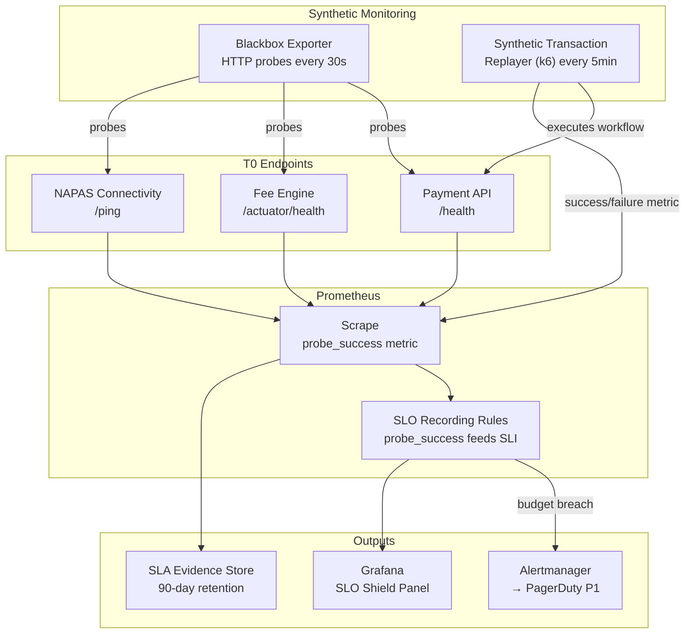

# Synthetic Monitoring and Canary Probes

Status: Draft | Last Reviewed: 2026-05-24 | Owner: @sre-lead
Catalog ID: OBS-009 | Radii
Tier Applicability: T0, T1, T2

## Problem Statement

Passive monitoring — waiting for real user errors to surface in Prometheus metrics — detects payment API failures only after customers are already impacted. On a 10,000 TPS payment gateway, the first real-user error event typically appears in the metrics pipeline 3–5 minutes after failure onset due to metric scrape intervals and aggregation windows. For T0 payment flows, a 3-minute blind window is unacceptable: SBV requires near-real-time evidence of service availability, and a 3-minute outage at 10,000 TPS represents 1.8 million failed transactions.

Low-traffic windows create additional blind spots: between 2 AM and 5 AM, real user traffic drops below 50 TPS. Standard SLO alerting has insufficient signal to distinguish genuine failures from statistical noise during these windows. A payment system could fail completely for 30 minutes during this window and no alert would fire — leaving the bank exposed when the morning transaction surge arrives. Finally, SBV and external auditors require SLA availability evidence in a format that cannot be produced from reactive monitoring alone because passive metrics only record what happened, not proof that the service was proactively verified to be available.

## Context

Synthetic monitoring runs in the same Kubernetes cluster as production services, probing their external-facing endpoints via the Service mesh (PLT-001). Probes use real network paths — including load balancers and ingress controllers — so they detect infrastructure failures that internal health checks miss. The Prometheus Blackbox Exporter scrapes probe results, which feed directly into the same SLO recording rules as real traffic (OBS-006). A dedicated synthetic transaction replayer uses isolated synthetic customer accounts (zero balance, flagged as non-reporting for regulatory purposes) to execute full business workflows. All probe results are retained for 90 days as SLA evidence.

## Solution

Prometheus Blackbox Exporter runs HTTP probes against critical endpoints every 30 seconds, including payment API health, fee engine readiness, and the NAPAS connectivity check endpoint. A synthetic transaction replayer — implemented as a scheduled k6 load test — executes a scripted end-to-end payment flow (authentication → balance inquiry → fund transfer → confirmation receipt) every 5 minutes using dedicated synthetic customer accounts. Both probe results and synthetic transaction outcomes feed the same SLO recording rules as real traffic, contributing to the error budget via `probe_success` metrics. Probe results are stored in Prometheus with 90-day retention (via Thanos or VictoriaMetrics long-retention) as timestamped SLA evidence.



## Implementation Guidelines

**1. Blackbox Exporter probe configuration**

```yaml
# blackbox-exporter/config.yml
modules:
  http_2xx_payment:
    prober: http
    timeout: 5s
    http:
      valid_http_versions: ["HTTP/1.1", "HTTP/2.0"]
      valid_status_codes: [200]
      method: GET
      headers:
        X-Probe-Source: blackbox-exporter
        X-Service-Tier: T0
      fail_if_not_ssl: true
      tls_config:
        insecure_skip_verify: false

  http_napas_ping:
    prober: http
    timeout: 3s
    http:
      valid_status_codes: [200, 204]
      method: GET

  tcp_napas_connect:
    prober: tcp
    timeout: 5s
    tcp:
      query_response: []
```

**2. Prometheus scrape configuration for Blackbox targets**

```yaml
# prometheus/scrape-configs/blackbox-targets.yml
scrape_configs:
  - job_name: blackbox_http_t0
    metrics_path: /probe
    params:
      module: [http_2xx_payment]
    static_configs:
      - targets:
          - https://payment-gateway.internal/health
          - https://fee-engine.internal/actuator/health
          - https://napas-bridge.internal/health
    relabel_configs:
      - source_labels: [__address__]
        target_label: __param_target
      - source_labels: [__param_target]
        target_label: instance
      - target_label: __address__
        replacement: blackbox-exporter:9115
      - target_label: tier
        replacement: T0
```

**3. k6 synthetic transaction replayer**

```javascript
// k6/scripts/payment-smoke.js
import http from 'k6/http';
import { check, sleep } from 'k6';

export const options = {
  scenarios: {
    smoke_every_5_min: {
      executor: 'constant-arrival-rate',
      rate: 1,
      timeUnit: '5m',
      duration: '24h',
      preAllocatedVUs: 2,
    },
  },
  thresholds: {
    http_req_failed: ['rate<0.01'],        // < 1% error rate
    http_req_duration: ['p(99)<5000'],     // < 5s end-to-end
  },
};

const BASE_URL = __ENV.PAYMENT_API_URL || 'https://payment-gateway.internal';
const SYNTH_TOKEN = __ENV.SYNTHETIC_BEARER_TOKEN;   // injected from Vault

export default function () {
  // Step 1: Balance inquiry
  const balanceRes = http.get(`${BASE_URL}/v1/accounts/SYNTH-001/balance`, {
    headers: { Authorization: `Bearer ${SYNTH_TOKEN}` },
  });
  check(balanceRes, { 'balance inquiry 200': (r) => r.status === 200 });

  // Step 2: Fund transfer (synthetic account to synthetic account — zero-amount)
  const transferRes = http.post(
    `${BASE_URL}/v1/transfers`,
    JSON.stringify({
      sourceAccountId: 'SYNTH-001',
      destinationAccountId: 'SYNTH-002',
      amount: '0.01',
      currency: 'VND',
      idempotencyKey: `smoke-${Date.now()}`,
    }),
    {
      headers: {
        'Content-Type': 'application/json',
        Authorization: `Bearer ${SYNTH_TOKEN}`,
      },
    }
  );
  check(transferRes, {
    'transfer 200 or 201': (r) => [200, 201].includes(r.status),
  });

  sleep(1);
}
```

**4. SLA evidence PromQL query (90-day availability report)**

```promql
# Service availability over last 30 days (for monthly SBV report)
avg_over_time(probe_success{job="blackbox_http_t0", instance="https://payment-gateway.internal/health"}[30d])

# Count of failed probes by hour (for incident timeline reconstruction)
sum by (instance, le) (
  increase(probe_duration_seconds_bucket{job="blackbox_http_t0"}[1h])
)
```

## When to Use

- T0 payment services where passive monitoring has a 3+ minute detection lag that is unacceptable
- Low-traffic windows (overnight, weekends) where real-user traffic is insufficient to trigger SLO alerts
- When SLA evidence must be produced proactively for SBV audit rather than reconstructed from incident logs
- When NAPAS or external payment network connectivity must be monitored independently of application health

## When Not to Use

- T2 internal tooling with no external SLA — passive monitoring is sufficient and cheaper
- Services already monitored by a managed APM solution (Datadog Synthetics, New Relic) — avoid duplicating synthetic test infrastructure
- Endpoints that require complex authentication flows not reproducible by Blackbox Exporter — use k6 synthetic replayer only, not Blackbox

## Variants

| Variant | When to prefer | Trade-off |
|---------|----------------|-----------|
| Blackbox Exporter only (HTTP probes) | Simple endpoint liveness; low-latency detection | No business logic validation; cannot catch application-layer failures |
| k6 synthetic replayer only | End-to-end workflow validation; must verify business outcome | Slower (5-minute interval); more complex to maintain |
| Both (this pattern) | T0 production services; 30s detection + 5-min business validation | Two systems to maintain; synthetic accounts need lifecycle management |

## NFR Acceptance Criteria

```yaml
nfr_acceptance_criteria:
  catalog_id: OBS-009
  pattern: Synthetic Monitoring and Canary Probes
  performance:
    - id: OBS-009-HP-01
      description: Blackbox Exporter probe interval must not exceed 30 seconds for T0 targets.
      threshold: probe_interval <= 30s
    - id: OBS-009-HP-02
      description: Synthetic transaction end-to-end execution must complete within 10 seconds.
      threshold: k6_http_req_duration_p99 < 10s
  correctness:
    - id: OBS-009-COR-01
      description: False-positive probe failure rate (probe fails but service is genuinely healthy) must not exceed 1 per week per target.
      threshold: false_positive_rate < 1/week/target
    - id: OBS-009-COR-02
      description: Probe results must be retained for 90 days with no gaps exceeding 5 minutes.
      threshold: retention = 90 days; gap < 5 min
  availability:
    - id: OBS-009-HA-01
      description: Blackbox Exporter must run as 2 replicas; single pod failure must not interrupt probe continuity.
      threshold: replicas >= 2; probe continuity during pod restart
```

## Compliance Mapping

| Ring | Regulation | Provision | How this pattern satisfies |
|------|-----------|-----------|---------------------------|
| Ring 0 | Prometheus Blackbox Exporter | CNCF observability stack — external endpoint probing | Blackbox Exporter is a CNCF-ecosystem tool; probe results use standard Prometheus exposition format and feed into the same SLO pipeline as real traffic |
| Ring 1 | BCBS 230 | Principle 9 — operational resilience testing; availability evidence | 30-second HTTP probes constitute continuous operational resilience testing; 90-day probe retention provides the historical availability evidence required by BCBS 230 operational impact tolerance framework |
| Ring 2 | SBV Circular 09/2020 | §IV.3 — monitoring requirements; SLA evidence for T0 payment systems | Probe result time series retained 90 days constitutes the SLA availability evidence for SBV inspection; synthetic accounts flagged as non-reporting to avoid contaminating regulatory transaction data ⚠️ (working summary — pending Legal review) |

## Cost / FinOps Notes

- Blackbox Exporter: 2 replicas × 0.1 CPU + 64 MB RAM each — negligible; add as part of the observability DaemonSet
- k6 Cloud or self-hosted k6: 2 VUs running 24/7 at ~10 executions/hour = minimal compute; self-hosted on 1 × t3.small instance (~$8/month)
- Probe result retention (90 days): 3 metric series per target × 10 targets × 90 days × 2 samples/min = ~78 MB in Prometheus; marginal cost
- Synthetic accounts: 2 dedicated Kubernetes service accounts with zero-balance synthetic customer records; no real AUM impact; flag as excluded from regulatory reporting

## Threat Model

**Probe Suppression — DNS manipulation (Tampering)**: an attacker or misconfiguration redirects the internal DNS entry for `payment-gateway.internal` to a stub that always returns `200 OK`, causing probes to show the service as healthy even during a real outage. The error budget appears intact while customers are failing. Mitigation: Blackbox Exporter probes are configured with both HTTP and TCP probes at the IP level (bypassing DNS for the TCP probe); any divergence between HTTP-probe-success and TCP-connect-success fires a `ProbeDivergence` alert; external probes from a separate monitoring region (cross-region probe) provide a second independent signal.

**Synthetic Account Misuse — production data leakage (Information Disclosure)**: the synthetic k6 test accounts (`SYNTH-001`, `SYNTH-002`) are misconfigured with real customer data or are not flagged as excluded from regulatory reporting, causing synthetic transaction volume to appear in SBV regulatory reports. Mitigation: synthetic accounts are provisioned via a dedicated script that explicitly sets `is_synthetic=true` and `excluded_from_reporting=true` flags in the account master; a nightly reconciliation job asserts these flags remain set; any synthetic account appearing in the regulatory report export triggers an automated alert to the compliance team.

## Operational Runbook (stub)

1. Alert: ProbeDown — fires when `probe_success{job="blackbox_http_t0"}` is 0 for any T0 target for more than 60 seconds. p50 resolution: 5 min; p99: 15 min. Check if the target service itself is down (check Kubernetes pod status, fee-engine circuit breaker state). Check if the Blackbox Exporter pod is running: `kubectl get pods -n monitoring -l app=blackbox-exporter`. Verify network path from Blackbox Exporter to the target — check Service mesh mTLS certificate expiry.

2. Alert: SyntheticTransactionFailed — fires when k6 synthetic payment flow returns any status code outside `[200, 201]` for 3 consecutive executions (15-minute window). p50 resolution: 10 min; p99: 30 min. Run the k6 script manually in debug mode to reproduce the failure: `k6 run --verbose k6/scripts/payment-smoke.js`. Check payment gateway application logs via OBS-008 log query filtered by `serviceId=payment-gateway AND severity=ERROR`.

## Test Strategy

**Unit**: `BlackboxProbeConfigTest` — load `blackbox-exporter/config.yml` via `go test` and validate that each module has valid `valid_status_codes`, timeout, and TLS configuration; assert that `http_2xx_payment` module requires SSL.

**Integration**: Deploy Blackbox Exporter + mock payment API (WireMock) in Docker Compose; configure mock to return 200 for `/health`; assert `probe_success=1` in Prometheus after 1 scrape cycle; configure WireMock to return 503; assert `probe_success=0` within 35 seconds; assert PagerDuty webhook stub triggered within 60 seconds.

**Compliance**: `SlaEvidenceRetentionTest` — write probe results to VictoriaMetrics (90-day retention config); advance clock 89 days; assert `probe_success` series still present for all T0 targets; generate monthly SLA report using PromQL `avg_over_time` query; assert report coverage 100% (no gaps > 5 minutes).

**Chaos**: Kill Blackbox Exporter pod during probe cycle; assert second replica continues probing without gap; restore pod; assert total probe gap < 30 seconds (single missed scrape); assert no spurious PagerDuty alert during pod restart.

## Related Patterns

- [OBS-004 SLO Alerting](slo-alerting.md) — probe_success feeds into SLI calculation alongside real traffic
- [OBS-006 Error Budget Burn Rate Alerting](error-budget-burn-rate.md) — probe failures contribute to error budget burn rate
- [OBS-001 OpenTelemetry Instrumentation](otel-instrumentation.md) — k6 synthetic requests propagate OTEL trace headers for end-to-end trace correlation
- [RES-002 Circuit Breaker](../resilience/circuit-breaker.md) — probe failures trigger circuit breaker inspection in operational runbook
- [PLT-001 Service Mesh Traffic Management](../platform/service-mesh-traffic.md) — probes traverse the same mTLS paths as real traffic
- [COMP-006 BCBS 230 Operational Resilience](../../compliance/bcbs-230.md) — §Principle 9 operational resilience testing satisfied by continuous synthetic probing

## References

- Prometheus Blackbox Exporter — GitHub prometheus/blackbox_exporter
- k6 documentation — scenarios and thresholds
- Google SRE Workbook — Alerting on SLOs (Chapter 5: synthetic monitoring)
- BCBS 230 Principles for Sound Stress Testing Practices and Supervision
- SBV Circular 09/2020 — Information System Security for Credit Institutions

---
**Key Takeaway**: Run independent Prometheus HTTP probes every 30 seconds and a scripted end-to-end payment flow every 5 minutes so that T0 service failures are detected in under 60 seconds regardless of real traffic volume, and 90 days of probe results constitute the timestamped SLA evidence required for SBV audit.
