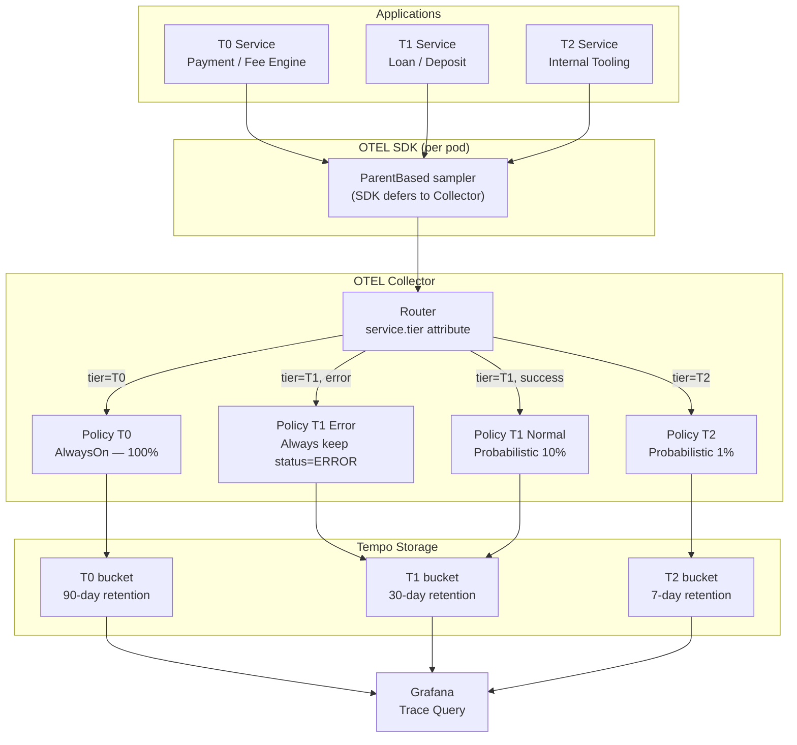

# Distributed Tracing Sampling Strategy

Status: Draft | Last Reviewed: 2026-05-24 | Owner: @sre-lead
Catalog ID: OBS-007 | Radii
Tier Applicability: T0, T1, T2

## Problem Statement

Without a deliberate sampling strategy, banking platforms face a binary choice between two unacceptable options. Tracing 100% of requests at a payment gateway processing 10,000 TPS generates 864 million spans per day — a storage cost that reaches $50,000/month on managed tracing backends and overwhelms the Grafana Tempo ingest pipeline within days. The opposing default of uniform 1% head-based sampling drops 99% of traces, including the rare-but-critical T0 payment failure traces that regulatory auditors and fraud investigators need.

Four specific consequences occur: engineers cannot reproduce latency anomalies because the specific slow traces were sampled away; SBV compliance requires every failed T0 payment to have a complete trace available for 90 days, but 1% sampling guarantees 99% of failures are invisible; tail-based sampling is perceived as too complex to configure and teams default to no strategy; long-tail payment failures (timeouts, downstream errors) have the highest business impact but the lowest natural sampling rate under any head-based scheme.

## Context

The tracing sampling layer lives inside the OpenTelemetry Collector pipeline between application SDKs (OBS-001) and the Grafana Tempo backend. Every Spring Boot service emits spans via the OTEL Java agent with `ParentBased` sampler; the Collector makes the final sampling decision before storage. The pattern is mandatory for T0 payment services where audit trail completeness is non-negotiable. T1 services adopt tail-based error-forced sampling to capture all failures at 10% cost; T2 internal services use 1% head-based to reduce noise in developer traces. Sampling tier is propagated via the `service.tier` resource attribute set at service boot time.

## Solution

A tiered sampling strategy implemented in the OpenTelemetry Collector's `tail_sampling` processor: T0 payment and fee-engine spans use `ParentBased(AlwaysOn)` — 100% capture, no exceptions; T1 services use tail-based sampling with two policies: always keep error spans (status=ERROR), probabilistically keep 10% of success spans; T2 internal services use 1% head-based sampling via the `probabilistic` sampler. The OTEL Collector routes each trace to the correct policy based on the `service.tier` resource attribute, eliminating per-service SDK configuration.



## Implementation Guidelines

**1. OTEL Collector tail_sampling processor configuration**

```yaml
# otel-collector/config.yaml
receivers:
  otlp:
    protocols:
      grpc:
        endpoint: 0.0.0.0:4317

processors:
  tail_sampling:
    decision_wait: 10s          # wait up to 10s for all spans in a trace
    num_traces: 100000          # max in-memory traces
    expected_new_traces_per_sec: 1000
    policies:
      - name: t0-always-sample
        type: and
        and:
          and_sub_policy:
            - name: t0-tier
              type: string_attribute
              string_attribute:
                key: service.tier
                values: [T0]
            - name: t0-always
              type: always_sample

      - name: t1-errors-always
        type: and
        and:
          and_sub_policy:
            - name: t1-tier
              type: string_attribute
              string_attribute:
                key: service.tier
                values: [T1]
            - name: t1-status-error
              type: status_code
              status_code:
                status_codes: [ERROR]

      - name: t1-probabilistic-10pct
        type: and
        and:
          and_sub_policy:
            - name: t1-tier-prob
              type: string_attribute
              string_attribute:
                key: service.tier
                values: [T1]
            - name: t1-prob
              type: probabilistic
              probabilistic:
                sampling_percentage: 10

      - name: t2-probabilistic-1pct
        type: and
        and:
          and_sub_policy:
            - name: t2-tier
              type: string_attribute
              string_attribute:
                key: service.tier
                values: [T2]
            - name: t2-prob
              type: probabilistic
              probabilistic:
                sampling_percentage: 1

exporters:
  otlp/tempo:
    endpoint: tempo:4317

service:
  pipelines:
    traces:
      receivers: [otlp]
      processors: [tail_sampling]
      exporters: [otlp/tempo]
```

**2. Service tier propagation via OTEL Java SDK resource attribute**

```java
// application.properties (per service)
otel.resource.attributes=service.name=payment-gateway,service.tier=T0,service.version=${APP_VERSION}
otel.traces.sampler=parentbased_always_on   # SDK defers final decision to Collector
otel.exporter.otlp.endpoint=http://otel-collector:4317
```

For T1 and T2 services, replace `service.tier=T0` with the appropriate tier value. The Collector's `tail_sampling` processor reads `service.tier` from the resource attributes of every span in the trace.

**3. Grafana Tempo retention configuration by tier**

```yaml
# tempo/tempo.yaml
storage:
  trace:
    backend: s3
    s3:
      bucket: banking-traces
      endpoint: s3.amazonaws.com

compactor:
  compaction:
    block_retention: 720h    # 30 days default

# Per-tenant (tier-based) retention via Tempo multi-tenancy
# Tenant T0: 2160h (90 days); T1: 720h (30 days); T2: 168h (7 days)
overrides:
  per_tenant_override_config: /etc/tempo/overrides.yaml

# overrides.yaml
T0:
  block_retention: 2160h
T1:
  block_retention: 720h
T2:
  block_retention: 168h
```

**4. Sampling rate verification query in TraceQL**

```bash
# Verify T0 capture rate is 100% (no T0 traces dropped)
# Run against Tempo metrics endpoint
curl -s http://tempo:3200/metrics | grep otelcol_processor_tail_sampling

# Expected output (sampling_decision=sampled for T0 policy):
# otelcol_processor_tail_sampling_sampling_decision_timer_bucket{policy="t0-always-sample",sampling_decision="sampled",...}

# TraceQL: spot-check T0 failed payment traces for past 24h
{ resource.service.tier="T0" && status=error } | select(rootName, duration, status)
```

## When to Use

- Any T0 service where every failed request must have a complete trace for 90-day regulatory audit
- When storage costs for 100% tracing are prohibitive for T1/T2 services
- When engineers are losing critical failure traces because head-based sampling dropped them
- When different service tiers need different retention windows without per-service SDK changes

## When Not to Use

- Services with fewer than 100 TPS — the tail sampler's 10-second decision window introduces per-trace memory overhead that outweighs the benefit; use 100% head-based sampling instead
- One-off diagnostic sessions (load tests, chaos experiments) — configure a temporary `always_sample` override rather than adjusting the permanent policy
- Services that do not yet emit OTEL spans — sampling has no effect until OBS-001 instrumentation is in place

## Variants

| Variant | When to prefer | Trade-off |
|---------|----------------|-----------|
| Tiered tail-sampling (this pattern) | Production with mixed T0/T1/T2 services | 10s decision window adds latency; requires OTEL Collector |
| Head-based 100% for all | Low-TPS services or development environments | Unsustainable storage cost above ~1,000 TPS |
| Exemplar-based sampling | Prometheus + Grafana ecosystem; want traces linked to metrics | Requires Prometheus exemplars; less flexible than full tail sampling |

## NFR Acceptance Criteria

```yaml
nfr_acceptance_criteria:
  catalog_id: OBS-007
  pattern: Distributed Tracing Sampling Strategy
  performance:
    - id: OBS-007-HP-01
      description: Tail sampler decision latency must not exceed 5 seconds from last span received for a trace.
      threshold: decision_latency_seconds < 5
    - id: OBS-007-HP-02
      description: OTEL Collector memory usage must not exceed 4 GB per pod under peak load of 10,000 TPS ingest.
      threshold: memory_rss_bytes < 4GB at 10K TPS
  correctness:
    - id: OBS-007-COR-01
      description: T0 trace capture rate must be 100% — no T0 spans must be dropped by the tail sampler.
      threshold: t0_capture_rate = 100%
    - id: OBS-007-COR-02
      description: All T1 error traces (status=ERROR) must be captured regardless of probabilistic sampling.
      threshold: t1_error_capture_rate = 100%
  storage:
    - id: OBS-007-STO-01
      description: T0 traces must be retained and queryable for 90 days without data loss.
      threshold: t0_retention = 90 days with 0 gaps
```

## Compliance Mapping

| Ring | Regulation | Provision | How this pattern satisfies |
|------|-----------|-----------|---------------------------|
| Ring 0 | OpenTelemetry Specification | Sampling — W3C TraceContext propagation; tail sampling API | Collector tail_sampling processor implements the OTEL sampling API; W3C `traceparent` header propagated across all services ensuring end-to-end trace completeness |
| Ring 1 | BCBS 239 | §4 Data Granularity — risk data must be available at the transaction level | T0 100% capture guarantees every payment transaction has a complete end-to-end trace; T1 error-forced sampling captures all risk-relevant failures at the transaction level |
| Ring 2 | SBV Circular 09/2020 | §IV.2 — data logging requirements for payment systems; 90-day trace retention | T0 traces retained 90 days in Tempo; failed payment traces always captured regardless of sampling policy; trace query available for SBV audit requests within minutes ⚠️ (working summary — pending Legal review) |

## Cost / FinOps Notes

- T0 100% tracing at 10K TPS: ~2 TB/month raw spans; compressed to ~400 GB in Tempo S3 at $0.023/GB = ~$9/month for T0
- T1 10% sampling at 50K TPS: ~500 GB/month raw; ~$2.50/month; error-forced capture adds ~5% overhead
- T2 1% sampling: negligible storage cost; dominated by Collector pod memory (2–4 GB per Collector pod)
- OTEL Collector: 2 pods (2 CPU, 4 GB RAM each) steady-state; scale to 4 pods at >8K TPS ingest (HPA on CPU)
- Tempo compactor runs nightly to remove expired T2 blocks; no manual retention management required

## Threat Model

**Tier Spoofing — T2 service claims T0 tier (Spoofing)**: a misconfigured or malicious T2 service sets `service.tier=T0` in its resource attributes, causing its traces to be captured at 100% and stored for 90 days — inflating storage costs and potentially polluting the T0 audit trail with non-payment data. Mitigation: service tier attribute is injected by the Kubernetes Downward API from a pod label controlled by the GitOps pipeline (PLT-003); application code cannot override it; Collector validates that `service.tier` is present in the approved values list (`T0`, `T1`, `T2`) — unknown values default to T2 sampling.

**Trace Data Exfiltration — sensitive fields in span attributes (Information Disclosure)**: span attributes inadvertently include account numbers, customer NID, or card PAN because engineers add debugging tags without review, and traces are stored for 90 days across multiple Tempo tenants. Mitigation: OTEL Collector `redaction` processor strips any span attribute matching a PII pattern list (`card_number`, `nid`, `account_number_full`); Tempo access is restricted to SRE and auditor roles via OIDC; the redaction rule list is reviewed quarterly by the CISO delegate.

## Operational Runbook (stub)

1. Alert: TracingCollectorLag — fires when OTEL Collector tail_sampling queue depth exceeds 50,000 traces for more than 2 minutes (metric: `otelcol_processor_tail_sampling_sampling_trace_dropped_count` rate > 0). p50 resolution: 5 min; p99: 20 min. Scale OTEL Collector: `kubectl scale deployment otel-collector --replicas=4`. Check Tempo ingest throughput — if Tempo is backpressuring, scale Tempo distributor pods.

2. Alert: T0TraceDrop — fires when `t0_capture_rate < 100%` (any T0 span appears in the `sampling_decision=not_sampled` bucket for the t0 policy). p50 resolution: 10 min; p99: 1 hour. Immediately inspect the tail sampler policy config in ArgoCD — this should never fire; a configuration regression is the most likely cause. Escalate to SRE lead. Notify compliance team if drop window exceeds 5 minutes.

## Test Strategy

**Unit**: `TailSamplerPolicyTest` — use `otelcol/testbed` framework; inject synthetic traces with `service.tier=T0`, `service.tier=T1` (error status), `service.tier=T1` (success), `service.tier=T2`; assert sampling decisions match policy: T0 always sampled, T1-error always sampled, T1-success 10% rate, T2 1% rate.

**Integration**: Deploy OTEL Collector + Tempo in Docker Compose; configure full pipeline; send 1,000 T0 traces with mixed success/error status; assert 1,000 traces present in Tempo after 15s; send 10,000 T1-success traces; assert ~1,000 ±200 sampled in Tempo; assert all T1-error traces present.

**Compliance**: `T0RetentionTest` — after writing T0 traces, advance Tempo clock by 89 days (mock); assert traces still present; advance to 91 days; assert traces evicted per retention policy.

**Chaos**: Kill OTEL Collector for 30 seconds during T0 payment load; restore; assert buffered spans flushed to Tempo (Collector uses file-backed queue — no loss); assert no gap in T0 trace coverage during the outage window.

## Related Patterns

- [OBS-001 OpenTelemetry Instrumentation](otel-instrumentation.md) — SDK configuration that propagates service.tier resource attribute
- [OBS-002 Distributed Trace Propagation](distributed-trace-propagation.md) — W3C traceparent header ensures cross-service trace continuity
- [OBS-008 Log Aggregation Pipeline](log-aggregation-pipeline.md) — traceId in logs correlates with stored traces for full observability chain
- [OBS-006 Error Budget Burn Rate Alerting](error-budget-burn-rate.md) — T0 traces are the ground truth for SLI calculation
- [SEC-012 Tamper-Evident Audit Logging](../security/audit-logging-tamper-evident.md) — T0 payment audit chain complements trace audit chain
- [PLT-003 GitOps Deployment Pipeline](../platform/gitops-deployment-pipeline.md) — Collector config managed via GitOps; tier label injected by Kubernetes pod spec
- [COMP-005 BCBS 239 Deep Dive](../../compliance/bcbs-239.md) — §4 data granularity at transaction level

## References

- OpenTelemetry Specification — Sampling API and tail sampling processor
- OpenTelemetry Collector contrib — tail_sampling processor documentation
- Grafana Tempo documentation — multi-tenant retention and block compaction
- W3C TraceContext Recommendation — traceparent and tracestate headers
- BCBS 239 Principles for Effective Risk Data Aggregation — BCBS January 2013
- SBV Circular 09/2020 — Information System Security for Credit Institutions

---
**Key Takeaway**: Capture 100% of T0 payment traces at the OTEL Collector using tier-based tail sampling, force-capture all error traces from T1 services, and route each tier to appropriate retention buckets — so regulatory audit requests for any failed payment trace are always satisfiable without paying for 100% capture across the entire platform.
