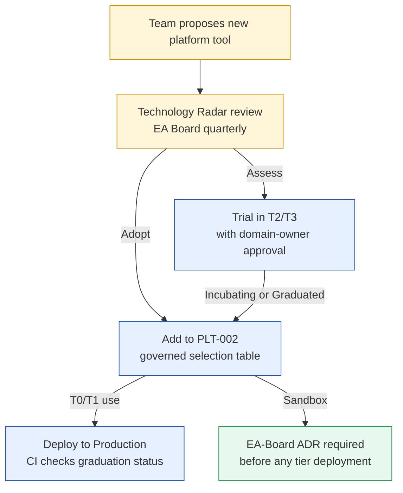

# CNCF Stack Selection

Status: Draft | Last Reviewed: 2026-05-10 | Owner: @ea-board
Catalog ID: PLT-002 | Radii
Tier Applicability: T0, T1, T2, T3

## Problem Statement

Without a governed platform tool selection process:
- Teams adopt CNCF Sandbox projects in T0 (security/stability risk — sandbox projects may be abandoned)
- License risk compounds: ELK stack moved to BSL (non-OSS) in 2021 — teams still using it unknowingly
- Tool overlap: some teams use Jaeger, others Tempo, Zipkin — traces don't correlate in a shared backend
- No change-control process: a team can replace a governed tool with an equivalent, breaking shared dashboards
- Supply-chain risk: undocumented dependencies on unmaintained or sandbox-status projects

## Solution

The EA Board maintains an authoritative governed selection table. CNCF **Graduated** status is the minimum bar for T0/T1 tools. All additions require a Technology Radar entry. Sandbox projects require EA-Board ADR regardless of tier.



## Governed Selection Table

This table is the authoritative record of Techcombank's approved platform tooling. Changes require EA-Board review (PR to this file + Confluence Technology Radar update).

| Layer | Selected | CNCF Status | Rejected alternative(s) | Rejection reason |
|---|---|---|---|---|
| **GitOps / CD** | Argo CD | Graduated | Flux | Less UI maturity; Argo Rollouts integration tighter for canary (PLT-001) |
| **CI Pipeline** | GitLab CI | Techcombank-hosted | Tekton | Too low-level; requires pipeline authoring expertise that delivery teams lack |
| **Traces — primary** | Grafana Tempo | Graduated | Jaeger | Tempo supersedes Jaeger (lower storage cost, scalable object storage backend); Jaeger in maintenance mode |
| **Traces — APM** | Dynatrace | Commercial SaaS | New Relic, Datadog | Enterprise APM with Davis AI; existing contract; OTEL OTLP ingest compatible |
| **Log storage** | OpenSearch | Community (AWS fork of Elastic) | Elasticsearch / Kibana (ELK) | Elastic BSL license since 2021 — non-OSS; OpenSearch is Apache 2.0 |
| **Log aggregation** | Grafana Loki | Graduated | Splunk | Cost; Loki label-based approach matches Prometheus label conventions |
| **Metrics** | Prometheus | Graduated | InfluxDB, Victoria Metrics | OSS longevity; Grafana native integration; standard for K8s ecosystem |
| **Dashboards** | Grafana | Graduated | Kibana (Elastic) | Pairs with Prometheus + Loki + Tempo; BSL risk on Kibana |
| **Policy enforcement** | OPA / Gatekeeper | Both Graduated | Kyverno | More expressive Rego policies for complex banking admission rules |
| **Certificate management** | cert-manager | Graduated | Manual rotation | 90-day certificate rotation cannot be done manually at scale (SEC-001) |
| **Runtime security** | Falco | Graduated | Sysdig, Aqua | Falco is open-source CNCF; Sysdig/Aqua require commercial license |
| **Service mesh** | Istio | Graduated | Linkerd, Consul Connect | Richest traffic management (PLT-001); largest community; Kiali UI |
| **Container runtime** | containerd | Graduated | Docker (moby), CRI-O | K8s default; lowest overhead |
| **Package management** | Helm | Graduated | Kustomize-only | Helm for application charts; Kustomize for environment overlays (both used) |

## Adoption Gate

| CNCF Project Status | T0 / T1 | T2 / T3 |
|---|---|---|
| **Graduated** | Allowed after PLT-002 table update | Allowed |
| **Incubating** | Requires EA-Board ADR | Domain-owner approval |
| **Sandbox** | Requires EA-Board ADR | Requires EA-Board ADR |
| **Not in CNCF** | Technology Radar review required; ADR mandatory | Technology Radar review required |

**Rationale for Graduated requirement at T0/T1**: CNCF graduation requires security audit, documented governance, and production adoption by multiple organisations. Sandbox projects may be abandoned without notice — unacceptable for payment-processing infrastructure.

## Technology Radar Process

The Techcombank Technology Radar (Thoughtworks-inspired quadrant model) governs tool adoption:

```
ADOPT   ← Proven; recommended for new projects
TRIAL   ← Use for new projects cautiously; monitor
ASSESS  ← Worth exploring; R&D/proof-of-concept only
HOLD    ← Do not use for new projects; migrate away
```

**Cadence**: Published quarterly by EA Board. Any team can submit a proposal via PR to `governance/technology-radar/`.

**Promotion path**: `ASSESS → TRIAL (T2/T3 pilot) → ADOPT (PLT-002 table update + T0/T1 allowed)`

**Demotion path**: License change, abandonment, or security advisory → `HOLD` immediately → migration plan within 1 quarter.

## Implementation Guidelines

### 1. CI Graduation Status Check

GitLab CI pipeline validates that all `platform` category catalog entries reference a CNCF Graduated tool:

```python
# scripts/check-cncf-graduation.py
import yaml, sys, urllib.request, json

CNCF_LANDSCAPE = "https://landscape.cncf.io/data/landscape.yml"

def check_graduation(tool_name: str, landscape_data: dict) -> str:
    for item in landscape_data.get("landscape", []):
        for category in item.get("subcategories", []):
            for project in category.get("items", []):
                if tool_name.lower() in project.get("name", "").lower():
                    return project.get("project", "unknown")
    return "not-found"

with open("governance/standards/_catalog-inventory.yml") as f:
    inventory = yaml.safe_load(f)

# Load CNCF landscape
with urllib.request.urlopen(CNCF_LANDSCAPE) as resp:
    landscape = yaml.safe_load(resp.read().decode())

governed_tools = {
    "Argo CD": "graduated", "Grafana Tempo": "graduated",
    "OpenSearch": "community", "Prometheus": "graduated",
    "OPA": "graduated", "cert-manager": "graduated",
    "Falco": "graduated", "Istio": "graduated",
    "containerd": "graduated", "Helm": "graduated",
    "Grafana Loki": "graduated",
}

failures = []
for tool, expected_status in governed_tools.items():
    # Run quarterly; alert on status regression
    pass  # Full implementation in scripts/check-cncf-graduation.py

print("CNCF graduation check: PASS" if not failures else f"FAIL: {failures}")
sys.exit(1 if failures else 0)
```

### 2. Sandbox Adoption ADR Template

When EA Board approves a Sandbox tool, create an ADR in `governance/decisions/`:

```markdown
# ADR-{N}: Adopt {ToolName} (CNCF Sandbox) for {Use Case}

**Date**: YYYY-MM-DD
**Status**: Approved
**Decision Maker**: EA Board
**Tier Applicability**: T2 / T3 only (Sandbox restrictions apply)

## Context
{Why we need this tool; what gap it fills}

## Decision
Adopt {ToolName} v{version} for {use case} in T2/T3 environments only.
Promotion to T0/T1 requires graduation to CNCF Incubating status + separate ADR.

## Risks and Mitigations
- Sandbox abandonment: contingency = {alternative tool}
- Security audit not complete: mitigation = {compensating control}

## Review Date
Quarterly — auto-revoked if project moves to "archived" status.
```

### 3. License Compliance Scan

Run license compliance check quarterly via `license-checker` in CI:

```yaml
# .gitlab-ci.yml
license-compliance:
  stage: compliance
  image: fsfe/reuse:latest
  script:
    - reuse lint
    - |
      # Check governed tools for BSL / SSPL license introduction
      for tool in "elasticsearch" "kibana"; do
        if helm repo list | grep -q "$tool"; then
          echo "WARN: $tool helm repo found — verify license"; exit 1
        fi
      done
  rules:
    - if: '$CI_PIPELINE_SOURCE == "schedule"'
      when: always
```

## NFR Acceptance Criteria

- **Graduation gate enforced**: CI pipeline rejects any Kubernetes manifest or Helm chart referencing a non-graduated CNCF tool for T0/T1 namespaces without an ADR in `governance/decisions/`.
- **Technology Radar currency**: EA Board publishes updated radar within 30 days of a governed tool's CNCF status change (graduation, archival, security advisory).
- **SBOM generated**: Software Bill of Materials for all governed tools generated quarterly via `syft` + stored in `governance/sbom/`.
- **License check**: No BSL, SSPL, or non-OSS license detected in governed tooling stack.

## Compliance Mapping

| Layer | Reference | Section/Control | How this satisfies |
|---|---|---|---|
| Ring 0 (generic) | NIST SP 800-53 SA-4 (Acquisition Process) | Software supply chain controls | CNCF graduation requirement + SBOM addresses supply chain integrity |
| Ring 0 (generic) | CNCF Graduation Criteria | Security audit, governance, production adoption | Graduation is a pre-validated security and stability bar |
| Ring 1 (intl banking) | BCBS 230 Principle 7 ⚠️ (working summary — pending PDF fetch) | ICT and Cyber Security — third-party technology risk | Governed tool selection with quarterly license and graduation review |
| Ring 2 (Vietnam) | SBV Circular 09/2020 §III ⚠️ (working summary — pending Legal review) | Technology risk management — vendor and tool governance | Technology Radar + EA-Board ADR process satisfies SBV technology risk documentation requirements |

## Cost / FinOps Notes

| Tool | License | Annual cost estimate |
|---|---|---|
| Argo CD | Apache 2.0 | $0 |
| Grafana Tempo | AGPLv3 (self-hosted) | Storage only (~$200/month) |
| Dynatrace | Commercial SaaS | Negotiated DPU contract — verify with Procurement |
| OpenSearch | Apache 2.0 | Storage only |
| Prometheus + Grafana OSS | Apache 2.0 | $0 |
| OPA / Gatekeeper | Apache 2.0 | $0 |
| cert-manager | Apache 2.0 | $0 |
| Falco | Apache 2.0 | $0 |
| Istio | Apache 2.0 | $0 |

**Total OSS cost**: $0 license fees for 11 of 14 governed tools. Key spend: Dynatrace (APM/tracing), cloud storage (Tempo/OpenSearch), GitLab CI compute.

## Threat Model Summary

STRIDE focus: **Tampering** (unauthorised tool adoption) and **Elevation of Privilege** (supply chain compromise via sandbox tool).

- **Top 3 threats addressed**:
  1. *Sandbox project abandoned mid-use* — CNCF graduation requirement; quarterly review; each tool has a documented alternative.
  2. *License change mid-use (e.g., Elastic BSL)* — quarterly license scan CI gate; immediate HOLD and migration plan on license regression.
  3. *Unapproved tool introduced via Helm dependency* — SBOM scan on every release; `helm dependency list` reviewed in CI.
- **Top 3 residual threats**:
  1. *CNCF graduation requirements change* — mitigation: EA Board monitors CNCF TOC announcements; Technology Radar updated within 30 days of any change.
  2. *Commercial tool (Dynatrace) contract terms change* — mitigation: contract reviewed annually by Procurement + Legal; fallback plan documented (Grafana Tempo covers traces without Dynatrace).
  3. *Shadow IT platform tooling bypassing PLT-002* — mitigation: K8s admission controller (OPA/Gatekeeper) blocks image registries not in approved list.

## Operational Runbook (stub)

**Adding a new governed tool:**
1. Submit PR to `governance/technology-radar/` with tool in `ASSESS` quadrant.
2. EA Board reviews at next quarterly meeting; moves to `TRIAL` for T2/T3 pilot.
3. After successful T2/T3 pilot (minimum 1 quarter), EA Board votes to `ADOPT`.
4. PR to PLT-002 (this file) adding tool to governed selection table.
5. CI graduation check script updated with new tool entry.

**Removing a deprecated tool (e.g., Jaeger → Tempo migration):**
1. Add tool to `HOLD` in Technology Radar.
2. Create migration guide in `governance/migrations/{tool}-to-{replacement}.md`.
3. Set migration deadline (maximum 2 quarters for T0/T1).
4. Remove tool from PLT-002 table after migration verified.

## Test Strategy (stub)

- **CI graduation check**: `python3 scripts/check-cncf-graduation.py` runs in scheduled GitLab pipeline weekly; fails if any governed tool's CNCF status regresses.
- **License scan**: `reuse lint` + BSL/SSPL grep on Helm chart dependencies in CI.
- **SBOM generation**: `syft packages dir:kubernetes/` → `governance/sbom/sbom-{date}.json`; diff against previous to detect new components.
- **ADR coverage**: CI script verifies every Sandbox tool in the cluster has a corresponding ADR in `governance/decisions/`.

## Related Patterns

- [PLT-001 Service Mesh Traffic Management](service-mesh-traffic.md) — Istio, Argo CD, Argo Rollouts are governed here
- [OBS-001 OpenTelemetry Instrumentation](../observability/otel-instrumentation.md) — Grafana Tempo, OpenSearch governed here
- [OBS-003 Structured Logging Standard](../observability/structured-logging-standard.md) — OpenSearch, Loki governed here
- [SEC-001 Zero-Trust Security](../../principles/zero-trust-security.md) — cert-manager, Falco governed here
- [BP-005 Chaos Engineering](../../best-practices/chaos-engineering.md) — chaos tools require PLT-002 graduation check

## References

- [CNCF Landscape](https://landscape.cncf.io/)
- [CNCF Graduation Criteria](https://github.com/cncf/toc/blob/main/process/graduation_criteria.md)
- [Technology Radar — Thoughtworks](https://www.thoughtworks.com/radar)
- [Sigstore / SLSA Supply Chain Security](https://slsa.dev/)

---

**Key Takeaway**: CNCF Graduated status is mandatory for T0/T1 platform tools. All new tools go through Technology Radar (Assess → Trial → Adopt). Sandbox tools require EA-Board ADR at any tier. Run quarterly license and graduation status checks in CI. Maintain SBOM for all governed tools.
