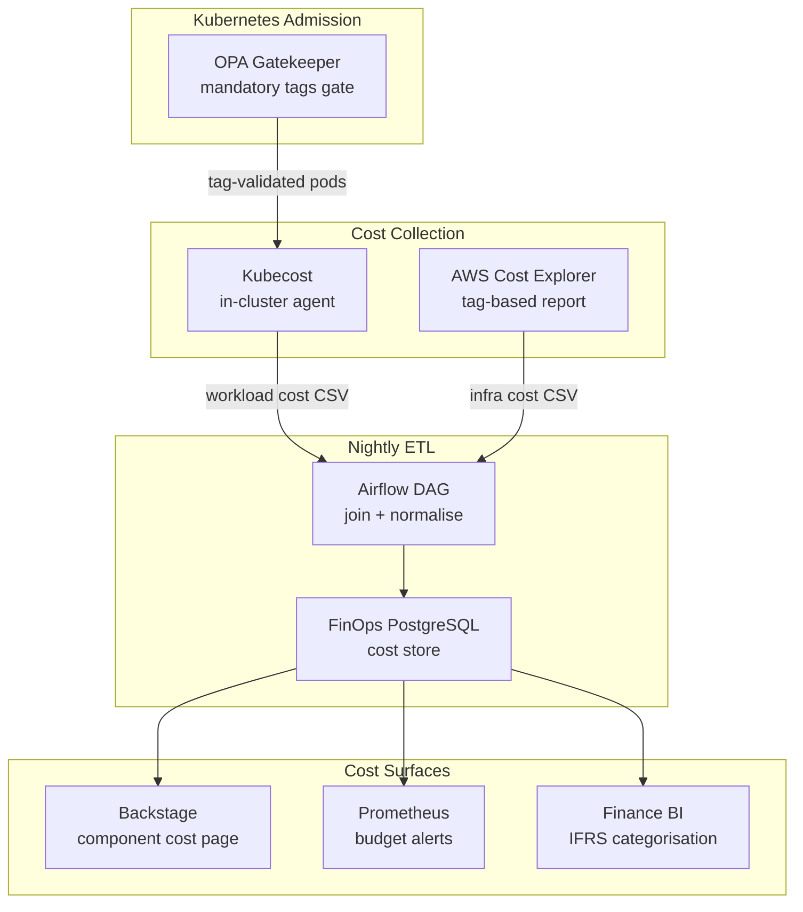

# FinOps Cost Allocation

Status: Draft | Last Reviewed: 2026-05-26 | Owner: @ea-board
Catalog ID: PLT-006 | Radii
Tier Applicability: T0, T1, T2

## Problem Statement

The bank's cloud infrastructure bill arrives as a single line item for the platform engineering team. Product heads — the payment gateway owner, the retail banking CTO, the card issuing director — have no visibility into what their services cost to run. When the cloud bill increases 40% quarter-over-quarter, no one can identify whether the growth is driven by payment volume growth (expected), test environment waste (avoidable), or a storage leak from unbounded log retention (a bug). Without chargeback or showback, engineering teams have no incentive to right-size resources or terminate idle environments; the cost is invisible to them.

Compliance teams face a secondary problem: BCBS 230 Principle 7 requires that operational risk management includes cost controls for critical systems. Demonstrating to SBV inspectors that the bank has system-level cost visibility into T0 workloads — and that cost anomalies trigger alerts — requires more than a cloud provider billing dashboard. The bank needs a tagged, attributable, alertable cost allocation system that is auditable.

## Context

The FinOps Cost Allocation pattern implements three layers: resource tagging enforced at the Kubernetes admission level (OPA Gatekeeper), cloud cost aggregation via AWS Cost Explorer or GCP Billing API with tag-based breakdown, and showback/chargeback reporting surfaced in Backstage (PLT-004) alongside each service's component page. The pattern integrates with the GitOps pipeline (PLT-003) — tags are part of the Helm values file and are therefore versioned in git. The Kubecost agent runs in-cluster and provides Kubernetes namespace/workload-level cost attribution, decomposing the EC2 node pool cost into per-pod cost estimates.

The cost allocation system supports three operating modes: showback (cost visibility with no financial transfer), chargeback (internal billing transfers between cost centres), and budget alerting (Prometheus-based alerts when namespace monthly spend rate exceeds threshold). Vietnamese banking regulations require that cloud costs attributable to customer-facing services be categorised as operational expenses in the statutory accounts — cost allocation tags feed directly into the finance team's IFRS categorisation workflow.

## Solution

OPA Gatekeeper enforces mandatory resource tags (`team`, `service`, `tier`, `cost-centre`, `environment`) on all Pods and PersistentVolumeClaims at admission time. Kubecost aggregates in-cluster resource consumption (CPU requests, memory requests, GPU, PVC) into per-namespace and per-workload cost estimates. AWS Cost Explorer tag reports break out cloud infrastructure costs (EC2, RDS, S3, data transfer) by the same tag dimensions. A nightly Airflow DAG joins the Kubecost and Cost Explorer exports, writes the result to an internal FinOps PostgreSQL database, and publishes it to the Backstage cost API so cost is visible on each component's catalog page. Budget alerts fire in Prometheus when a namespace's 30-day rolling cost rate exceeds its configured budget.



## Implementation Guidelines

**1. OPA Gatekeeper ConstraintTemplate — mandatory tags**

```yaml
# platform/gatekeeper/templates/require-resource-tags.yaml
apiVersion: templates.gatekeeper.sh/v1
kind: ConstraintTemplate
metadata:
  name: requireresourcetags
spec:
  crd:
    spec:
      names:
        kind: RequireResourceTags
      validation:
        openAPIV3Schema:
          type: object
          properties:
            requiredTags:
              type: array
              items:
                type: string
  targets:
    - target: admission.k8s.gatekeeper.sh
      rego: |
        package requireresourcetags

        violation[{"msg": msg}] {
          tag := input.parameters.requiredTags[_]
          not input.review.object.metadata.labels[tag]
          msg := sprintf("Missing required label: %v", [tag])
        }
---
apiVersion: constraints.gatekeeper.sh/v1beta1
kind: RequireResourceTags
metadata:
  name: require-banking-tags
spec:
  match:
    kinds:
      - apiGroups: [""]
        kinds: ["Pod"]
      - apiGroups: [""]
        kinds: ["PersistentVolumeClaim"]
    namespaces: [banking-dev, banking-uat, banking-prod]
  parameters:
    requiredTags:
      - team
      - service
      - tier
      - cost-centre
      - environment
```

**2. Kubecost cost allocation API query (nightly ETL)**

```python
# dags/finops/kubecost_extract.py
import requests, json
from datetime import date, timedelta

KUBECOST_URL = "http://kubecost.platform.svc:9090"

def extract_workload_costs(execution_date: date) -> list[dict]:
    """Extract per-workload costs from Kubecost allocation API."""
    window_start = (execution_date - timedelta(days=1)).isoformat()
    window_end = execution_date.isoformat()

    resp = requests.get(
        f"{KUBECOST_URL}/model/allocation",
        params={
            "window": f"{window_start}T00:00:00Z,{window_end}T00:00:00Z",
            "aggregate": "namespace,label:service,label:team,label:cost-centre",
            "accumulate": "false",
            "includeIdle": "true",
            "shareIdle": "true",
        },
        timeout=120,
    )
    resp.raise_for_status()

    costs = []
    for allocation_name, allocation in resp.json()["data"][0].items():
        costs.append({
            "date": window_start,
            "namespace": allocation.get("properties", {}).get("namespace"),
            "service": allocation.get("properties", {}).get("labels", {}).get("service"),
            "team": allocation.get("properties", {}).get("labels", {}).get("team"),
            "cost_centre": allocation.get("properties", {}).get("labels", {}).get("cost-centre"),
            "cpu_cost_usd": allocation.get("cpuCost", 0.0),
            "memory_cost_usd": allocation.get("ramCost", 0.0),
            "pvc_cost_usd": allocation.get("pvCost", 0.0),
            "total_cost_usd": allocation.get("totalCost", 0.0),
        })
    return costs
```

**3. Budget alert — Prometheus recording rule and alert**

```yaml
# platform/prometheus/rules/finops-budget.yaml
groups:
  - name: finops.budget
    interval: 1h
    rules:
      # 30-day rolling cost rate per namespace (USD/day × 30)
      - record: finops:namespace_monthly_cost_rate:usd
        expr: |
          sum by (namespace) (
            increase(kubecost_namespace_total_cost_usd[30d])
          )

      # Alert when namespace spend rate exceeds configured budget
      - alert: NamespaceBudgetExceeded
        expr: |
          finops:namespace_monthly_cost_rate:usd
            > on(namespace) group_left()
          finops_namespace_budget_usd
        for: 1h
        labels:
          severity: warning
          team: "{{ $labels.namespace }}"
        annotations:
          summary: "Namespace {{ $labels.namespace }} exceeds monthly budget"
          description: >
            Namespace {{ $labels.namespace }} 30-day rolling cost is
            ${{ $value | humanize }} vs budget ${{ $labels.budget_usd }}.
            Review idle resources, right-size requests, or update the budget.
          runbook_url: "https://backstage.internal/docs/finops/budget-exceeded"
```

**4. Helm values mandatory tags example**

```yaml
# services/payment-gateway/helm/values-prod.yaml
# Tags applied to all Pod metadata.labels via Helm helpers
commonLabels:
  team: payments-engineering
  service: payment-gateway
  tier: T0
  cost-centre: "CC-1042"       # Finance system cost centre code
  environment: prod
```

## When to Use

- When cloud infrastructure costs are growing and the source of growth cannot be attributed to a specific service or team
- When product teams need showback reports to make informed trade-off decisions (e.g., whether to right-size a T2 workload or accept the cost)
- When BCBS 230 compliance requires demonstrating cost control for T0 critical systems
- When the finance team needs cloud cost categorisation for IFRS statutory accounts

## When Not to Use

- In a startup or single-team organisation where all cloud resources belong to one cost centre — the tagging overhead exceeds the benefit
- When using a fully managed SaaS platform (no Kubernetes) — apply the cloud provider's native cost allocation tags directly without Gatekeeper
- For on-premise bare-metal deployments — cost allocation models for on-prem infrastructure use different tooling (asset inventory + depreciation schedules, not Kubecost)

## Variants

| Variant | When to prefer | Trade-off |
|---------|----------------|-----------|
| Kubecost + OPA (this pattern) | In-cluster cost visibility with policy enforcement | Kubecost license cost (Community is free; Enterprise required for SSO and long-term retention) |
| AWS Cost Explorer only | AWS-native teams that do not need per-pod granularity | No namespace or workload-level breakdown; only EC2 instance-level |
| OpenCost (CNCF project) | Teams preferring a fully open-source alternative to Kubecost | Less mature UI and BI integrations; same API spec as Kubecost |
| Apptio Cloudability | Large enterprises with multi-cloud FinOps requiring ITFM integration | Vendor product cost; better for Finance-driven FinOps than engineering-driven |

## NFR Acceptance Criteria

```yaml
nfr_acceptance_criteria:
  catalog_id: PLT-006
  pattern: FinOps Cost Allocation
  performance:
    - id: PLT-006-HP-01
      description: Kubecost allocation API response for the previous day's namespace breakdown must complete in under 30 seconds for 500 namespaces.
      threshold: kubecost_api_response < 30s at 500 namespaces
    - id: PLT-006-HP-02
      description: Nightly ETL DAG (Kubecost + Cost Explorer join) must complete within 60 minutes to ensure cost data is available in Backstage before 08:00 AEST.
      threshold: etl_dag_duration < 60 min
  compliance:
    - id: PLT-006-COMP-01
      description: OPA Gatekeeper must reject 100% of Pod admission requests missing any of the 5 required tags in the banking-prod namespace.
      threshold: 0 untagged pods admitted to banking-prod
    - id: PLT-006-COMP-02
      description: Cost allocation reports must be retained for 7 years to support BCBS 230 operational risk cost control evidence.
      threshold: cost_report_retention = 7 years
```

## Compliance Mapping

| Ring | Regulation | Provision | How this pattern satisfies |
|------|-----------|-----------|---------------------------|
| Ring 0 | FinOps Foundation Cost Allocation Framework | Pillar: Inform — "Every resource must be tagged and attributable to a cost centre" | OPA Gatekeeper enforces mandatory tags at admission; Kubecost provides workload-level cost attribution; Backstage surfaces showback on every component page |
| Ring 1 | BCBS 230 | Principle 7 — operational risk management: cost controls for critical systems | Budget alerting fires when T0 namespace spend exceeds threshold; cost anomaly evidence is retained in FinOps PostgreSQL for 7 years; cost control process is documented and auditable |
| Ring 2 | SBV Circular 09/2020 | §III.4 — IT budget management and cost transparency for licensed credit institutions | Tag-based cost centre breakdown produces the IT cost transparency required by §III.4; nightly BI export feeds the statutory IFRS cost categorisation used in the bank's regulatory financial statements ⚠️ (working summary — pending Legal review) |

## Cost / FinOps Notes

- Kubecost Community: free; Kubecost Enterprise: ~USD 500/month for SSO + 1-year retention — evaluate at scale
- ETL pipeline: Airflow on shared platform workers, ~30 minutes/night = negligible compute cost
- FinOps PostgreSQL: RDS db.t4g.small (2 vCPU / 2 GB) for cost store = ~USD 40/month
- ROI: identification of a single idle UAT environment running 24/7 at USD 800/month covers 20 months of FinOps tooling cost; typical environment waste identification pays back within the first week of showback deployment
- OPA Gatekeeper: runs as 3 pods on shared platform nodes; ~0.5 CPU + 512 MB RAM total = marginal cost

## Threat Model

**Tag Spoofing — false cost-centre labels (Repudiation)**: an engineering team assigns a rival team's `cost-centre` label to their pod workloads, causing cloud costs to be attributed to the wrong cost centre. The victim team's chargeback bill inflates; the attacker team's bill deflates. This is a repudiation attack — "it wasn't us." Mitigation: OPA Gatekeeper validates that the `cost-centre` value is in the approved allowlist (sourced from the finance system's cost centre registry); any `cost-centre` value not in the allowlist is rejected at admission; the allowed cost-centre list is managed via a ConfigMap updated only by the finance-ops CODEOWNERS group; all pod admission events with labels are shipped to the SIEM.

**Budget Alert Suppression — Prometheus recording rule deletion (Tampering)**: an attacker with ArgoCD or Kubernetes RBAC access deletes the `finops:namespace_monthly_cost_rate:usd` recording rule, causing budget alerts to stop firing silently. The team's namespace exceeds its budget without any alert. Mitigation: Prometheus rules are deployed via GitOps (ArgoCD) and self-heal — any deleted PrometheusRule object is re-created within 60 seconds; an OPA policy `require-prometheusrule-finops` rejects any deletion of the finops-budget PrometheusRule from non-platform-lead principals; a monthly FinOps audit job checks that all expected recording rules are present and asserts alert health.

## Operational Runbook (stub)

1. Alert: NamespaceBudgetExceeded — fires when a namespace's 30-day rolling cost rate exceeds the configured budget. p50 resolution: 1 day; p99: 1 week (budget overruns require engineering action). Check the Backstage cost page for the namespace to identify the top cost drivers. Common causes: test/UAT environment left running after load test (shut down or scale to zero); HPA not configured (pods running at maximum replicas permanently); PVC storage not released after pod deletion. Escalation: if the overrun exceeds 150% of budget, notify the cost-centre owner via PagerDuty and require a signed remediation plan within 5 business days.

2. Alert: FinOpsETLStaleness — fires when the Backstage cost API last-updated timestamp is more than 26 hours old (ETL missed a nightly run). p50 resolution: 30 min; p99: 2 hours. Check Airflow DAG `finops_cost_allocation_daily` for the failed run: `airflow dags list-runs -d finops_cost_allocation_daily --limit 5`. Common causes: Kubecost API timeout (check Kubecost pod health); AWS Cost Explorer API throttling (check CloudWatch logs for `ThrottlingException`); FinOps PostgreSQL connection refused (check RDS maintenance window). Retry the failed DAG run manually: `airflow dags trigger finops_cost_allocation_daily`.

## Test Strategy

**Unit**: `TagEnforcementTest` — submit a Pod manifest without the `cost-centre` label to the OPA Gatekeeper webhook via the dry-run admission API (`kubectl apply --dry-run=server`); assert the request is rejected with `missing required label: cost-centre`; submit a Pod with all 5 required labels; assert admission is approved.

**Integration**: Deploy Kubecost and OPA Gatekeeper in a `kind` cluster; create a Deployment with all required tags in the banking-test namespace; wait 5 minutes; query the Kubecost allocation API; assert the Deployment appears in the cost breakdown with a non-zero `totalCost`; run the ETL DAG against the test FinOps PostgreSQL; assert the cost record is inserted with the correct `team` and `cost-centre` values.

**Compliance**: `BudgetAlertTest` — create a `finops_namespace_budget_usd` metric with a value of USD 1 for the test namespace; inject a Kubecost cost metric of USD 2; assert the `NamespaceBudgetExceeded` alert fires within 2 minutes; assert the alert annotation contains the correct `namespace` and `runbook_url`.

**Chaos**: Delete the `finops-budget` PrometheusRule in the monitoring namespace; assert ArgoCD self-heal re-creates it within 60 seconds; assert the recording rules are present in the Prometheus targets page; assert no budget alerts are missed during the 60-second gap (prometheus retains metrics across rule reload).

## Related Patterns

- [PLT-003 GitOps Deployment Pipeline](gitops-deployment-pipeline.md) — mandatory tags are versioned in Helm values files in git; ArgoCD enforces them at deploy time
- [PLT-004 Internal Developer Platform](internal-developer-platform.md) — Backstage component page surfaces the showback cost widget; golden path template includes mandatory tag fields
- [PLT-008 Multi-Tenancy Isolation](multi-tenancy-isolation.md) — namespace isolation boundaries align with cost allocation boundaries; one namespace = one cost centre
- [OBS-010 Metrics Cardinality Management](../observability/metrics-cardinality-management.md) — OPA Gatekeeper used for both tag enforcement and cardinality label control
- [COMP-006 BCBS 230 Operational Resilience](../../compliance/bcbs-230.md) — cost control evidence from FinOps PostgreSQL satisfies BCBS 230 Principle 7 operational risk management requirement

## References

- FinOps Foundation Cost Allocation Framework — finops.org
- Kubecost documentation — allocation API and integration patterns
- OpenCost CNCF project — opencost.io
- AWS Cost Explorer API documentation
- BCBS 230 Sound Practices for the Management and Supervision of Operational Risk
- SBV Circular 09/2020 — Information System Security for Credit Institutions

---
**Key Takeaway**: Enforce mandatory resource tags at Kubernetes admission via OPA Gatekeeper, aggregate in-cluster workload costs with Kubecost, and surface per-service showback in Backstage — so every product team can see what their service costs, every budget overrun fires an alert, and every T0 cost control is auditable evidence for BCBS 230 compliance.
