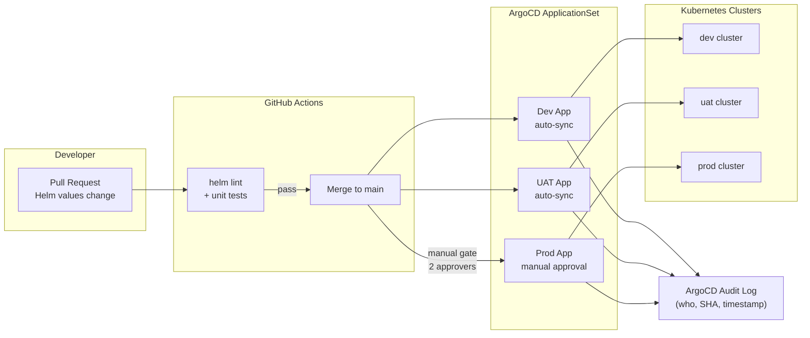

# GitOps Deployment Pipeline

Status: Draft | Last Reviewed: 2026-05-24 | Owner: @ea-board
Catalog ID: PLT-003 | Radii
Tier Applicability: T0, T1, T2

## Problem Statement

Manual Kubernetes deployments via `kubectl apply` or direct Helm upgrades leave no audit trail, making it impossible to answer "who deployed what to production at what time" — a hard BCBS 230 change management requirement for regulated institutions. Environment drift between dev, UAT, and production is endemic: a hotfix applied directly to a production pod via `kubectl exec` or `kubectl set image` is not reflected in the git repository, so the next automated deployment reverts the fix and reintroduces the bug. Rollback requires hunting for the previous Docker image tag and re-applying manifests manually — a 30-minute procedure under incident pressure.

SBV inspectors requesting the change log for a production deployment window during a regulatory examination cannot be satisfied from any existing system: the change management tool has the ticket, the registry has the image, but no system has the canonical record of "this git commit SHA was deployed to production at this timestamp by this engineer with this approval." The four-environment promotion path (dev → QA → UAT → prod) requires manual copy-paste of image tags between environments, introducing human error on every release.

## Context

The GitOps pipeline is the single enforcement point for all Kubernetes workload changes across the four environments. ArgoCD runs in-cluster and continuously compares the live cluster state against the git repository; any drift triggers an automatic reconciliation for dev/UAT and raises a sync warning for prod. The Helm chart values file is the authoritative source of truth for environment-specific configuration — no environment variables are managed outside git. The pipeline integrates with the Vault agent injector (SEC-007) for secrets delivery and with the OPA Gatekeeper admission webhook (PLT-008, OBS-010) for policy enforcement at deploy time.

## Solution

ArgoCD ApplicationSet pattern with one Application per environment (dev, uat, prod), driven by a matrix generator. All changes flow through pull requests to the Helm chart values files in git. GitHub Actions runs lint and test gates before merge. ArgoCD syncs automatically to dev and UAT on merge to main; production sync requires manual approval by two engineers (four-eyes gate enforced by ArgoCD RBAC). Every ArgoCD sync event records the git commit SHA, approving engineer, and timestamp in the audit log. Rollback is a `git revert` commit followed by an ArgoCD sync — the same approval flow as forward deployment.



## Implementation Guidelines

**1. ArgoCD ApplicationSet definition (matrix generator for all environments)**

```yaml
# argocd/appsets/banking-services.yaml
apiVersion: argoproj.io/v1alpha1
kind: ApplicationSet
metadata:
  name: banking-services
  namespace: argocd
spec:
  generators:
    - matrix:
        generators:
          - git:
              repoURL: https://github.com/org/banking-platform
              revision: HEAD
              directories:
                - path: services/*
          - list:
              elements:
                - env: dev
                  cluster: https://dev-cluster.internal:6443
                  namespace: banking-dev
                  syncPolicy: automated
                - env: uat
                  cluster: https://uat-cluster.internal:6443
                  namespace: banking-uat
                  syncPolicy: automated
                - env: prod
                  cluster: https://prod-cluster.internal:6443
                  namespace: banking-prod
                  syncPolicy: manual
  template:
    metadata:
      name: "{{path.basename}}-{{env}}"
      annotations:
        argocd.argoproj.io/sync-wave: "1"
    spec:
      project: banking
      source:
        repoURL: https://github.com/org/banking-platform
        targetRevision: HEAD
        path: "services/{{path.basename}}/helm"
        helm:
          valueFiles:
            - values-base.yaml
            - "values-{{env}}.yaml"
      destination:
        server: "{{cluster}}"
        namespace: "{{namespace}}"
      syncPolicy:
        automated:
          prune: "{{eq env 'dev' 'uat'}}"
          selfHeal: true
        syncOptions:
          - CreateNamespace=true
          - RespectIgnoreDifferences=true
```

**2. Helm values file structure per environment**

```yaml
# services/payment-gateway/helm/values-prod.yaml
replicaCount: 3
image:
  repository: registry.internal/payment-gateway
  tag: "v2.1.4"         # promoted by the image-promotion workflow
  pullPolicy: IfNotPresent

resources:
  limits:
    cpu: "2"
    memory: "2Gi"
  requests:
    cpu: "500m"
    memory: "512Mi"

# Vault agent injector — secrets never stored in git
vault:
  enabled: true
  role: payment-gateway-prod
  secretPath: secret/data/banking/prod/payment-gateway

ingress:
  enabled: true
  host: payment-gateway.prod.internal

hpa:
  enabled: true
  minReplicas: 3
  maxReplicas: 12
  targetCPUUtilizationPercentage: 70
```

**3. GitHub Actions image-tag promotion workflow**

```yaml
# .github/workflows/promote-image.yml
name: Promote image to environment
on:
  workflow_dispatch:
    inputs:
      service:
        description: 'Service name (e.g. payment-gateway)'
        required: true
      image_tag:
        description: 'Image tag to promote (e.g. v2.1.4)'
        required: true
      target_env:
        description: 'Target environment (uat or prod)'
        required: true

jobs:
  promote:
    runs-on: ubuntu-latest
    steps:
      - uses: actions/checkout@v4
        with:
          token: ${{ secrets.GH_PAT }}

      - name: Update image tag in values file
        run: |
          VALUES_FILE="services/${{ inputs.service }}/helm/values-${{ inputs.target_env }}.yaml"
          yq e -i '.image.tag = "${{ inputs.image_tag }}"' "$VALUES_FILE"

      - name: Create PR for promotion
        uses: peter-evans/create-pull-request@v6
        with:
          commit-message: "chore(deploy): promote ${{ inputs.service }} ${{ inputs.image_tag }} to ${{ inputs.target_env }}"
          title: "Promote ${{ inputs.service }} ${{ inputs.image_tag }} → ${{ inputs.target_env }}"
          branch: "promote/${{ inputs.service }}-${{ inputs.image_tag }}-${{ inputs.target_env }}"
          reviewers: "sre-lead,tech-lead-backend"
```

**4. Vault agent injector integration in Helm deployment template**

```yaml
# services/payment-gateway/helm/templates/deployment.yaml (excerpt)
spec:
  template:
    metadata:
      annotations:
        vault.hashicorp.com/agent-inject: "true"
        vault.hashicorp.com/role: "{{ .Values.vault.role }}"
        vault.hashicorp.com/agent-inject-secret-db: "{{ .Values.vault.secretPath }}/db"
        vault.hashicorp.com/agent-inject-template-db: |
          {{`{{- with secret "`}}{{ .Values.vault.secretPath }}/db{{`" -}}`}}
          DB_PASSWORD={{ `{{- .Data.data.password }}` }}
          {{`{{- end }}`}}
    spec:
      containers:
        - name: payment-gateway
          envFrom:
            - secretRef:
                name: payment-gateway-static  # only non-sensitive config
          # Vault-injected secrets appear at /vault/secrets/db
```

## When to Use

- Any Kubernetes-based service where production changes must have a git-traceable audit trail
- When environment drift between dev, UAT, and production is causing production incidents
- When BCBS 230 or SBV change management requirements must be satisfied with system-level evidence
- When rollback must be achievable in under 5 minutes with full audit trail

## When Not to Use

- Stateful database schema changes — GitOps manages the application deployment but schema migrations require a separate pipeline (Flyway/Liquibase with manual DBA review, not auto-sync)
- Emergency hotfixes requiring immediate production deployment without PR review — document the exception, apply via ArgoCD emergency sync, and create the PR within 24 hours (retroactive change management)
- On-premise bare-metal deployments without Kubernetes — use Ansible playbooks with an equivalent PR-approval workflow

## Variants

| Variant | When to prefer | Trade-off |
|---------|----------------|-----------|
| ArgoCD ApplicationSet (this pattern) | Multi-service, multi-environment at scale | More complex initial setup; ArgoCD operational overhead |
| Flux v2 | Teams preferring pull-based model with Kustomize | Less mature UI; no web-based approval flow |
| Argo Rollouts + ApplicationSet | Progressive delivery (canary/blue-green) | Additional CRD overhead; required for zero-downtime T0 deployments |

## NFR Acceptance Criteria

```yaml
nfr_acceptance_criteria:
  catalog_id: PLT-003
  pattern: GitOps Deployment Pipeline
  performance:
    - id: PLT-003-HP-01
      description: Production deployment end-to-end (PR merge to pods healthy) must complete within 10 minutes.
      threshold: deployment_duration < 10 min
    - id: PLT-003-HP-02
      description: Rollback via git revert + ArgoCD sync must complete within 5 minutes.
      threshold: rollback_duration < 5 min
    - id: PLT-003-HP-03
      description: ArgoCD sync health check and drift detection must run within 30 seconds of any cluster state change.
      threshold: drift_detection_latency < 30s
  compliance:
    - id: PLT-003-COMP-01
      description: Every production sync event must record git commit SHA, approving engineer identity, and timestamp in the ArgoCD audit log.
      threshold: 0 production sync events without audit record
  retention:
    - id: PLT-003-RET-01
      description: ArgoCD audit log must be retained for 7 years (BCBS 230 change management evidence).
      threshold: audit_log_retention = 7 years
```

## Compliance Mapping

| Ring | Regulation | Provision | How this pattern satisfies |
|------|-----------|-----------|---------------------------|
| Ring 0 | OpenGitOps Principles v1.0 | Principle 1: declarative; Principle 2: versioned and immutable; Principle 3: pulled automatically | ArgoCD ApplicationSet implements all four OpenGitOps principles — desired state is declarative Helm, versioned in git, pulled by the ArgoCD agent, continuously reconciled |
| Ring 1 | BCBS 230 | Principle 7 — change management: changes must be planned, approved, and documented | Every production sync requires a merged PR (planned and documented), two-engineer approval (four-eyes), and is recorded in the ArgoCD audit log with SHA and approver identity |
| Ring 2 | SBV Circular 09/2020 | §III.2 — change management procedures for information systems in credit institutions | Git commit history + ArgoCD audit log constitute the system-level evidence of change management procedures; production changes require dual approval matching §III.2 segregation-of-duties requirement ⚠️ (working summary — pending Legal review) |

## Cost / FinOps Notes

- ArgoCD: runs as 3 pods (controller, server, repo-server) on shared platform nodes; ~2 CPU + 4 GB RAM total — marginal cost
- GitHub Actions: image promotion workflow uses 0.5 minutes of runner time per promotion; at 50 promotions/month = 25 minutes = negligible at shared runner pricing
- No additional storage for ArgoCD audit log — events exported to OpenSearch via OBS-008 log pipeline; retention covered by existing ILM policy
- Helm chart repository: hosted in the same Git monorepo; no additional artifactory storage needed for chart packages
- Vault agent injector: sidecar adds ~50 MB RAM per pod; acceptable overhead for secrets delivery without git storage

## Threat Model

**Malicious Merge — unauthorized PR approval (Elevation of Privilege)**: an attacker who has compromised a single engineer account approves and merges a PR that modifies the production values file to inject a malicious image tag or additional environment variable, deploying malicious code to production. Mitigation: branch protection rules require two distinct reviewers from the `sre-lead` and `tech-lead-backend` reviewer groups; neither reviewer may be the PR author; ArgoCD RBAC further restricts who can trigger a production sync even after a PR is merged; all GitHub action events are shipped to the SIEM via OBS-008.

**GitOps Bypass — direct kubectl apply (Tampering)**: a developer with cluster access applies a Kubernetes manifest directly via `kubectl apply -f` to the production namespace, creating a workload that is not tracked in git. ArgoCD self-heal detects the drift and reverts it, but the malicious workload ran for up to 30 seconds. Mitigation: production namespace has a Kubernetes RBAC policy that denies `kubectl apply` for all principals except the ArgoCD service account; audit events for any `kubectl` command on the production namespace are shipped to the SIEM; an alert fires on any manual resource creation in the production namespace.

## Operational Runbook (stub)

1. Alert: ArgoCDSyncFailed — fires when any ArgoCD Application's sync status remains `OutOfSync` for more than 5 minutes. p50 resolution: 5 min; p99: 30 min. Check ArgoCD UI for the failing application. Common causes: Helm template rendering failure (check values file for malformed YAML); Kubernetes API server unreachable; OPA webhook rejection (check OPA policy logs). To manually trigger a sync: `argocd app sync <app-name> --force`.

2. Alert: ArgoCDDriftDetected — fires when cluster state differs from git state for any production Application for more than 2 minutes (ArgoCD `selfHeal` disabled in prod). p50 resolution: 10 min; p99: 1 hour. Investigate the drift: `argocd app diff <app-name>`. If the drift is caused by a manual emergency change, raise a retroactive PR within 24 hours and merge it. Do not enable `selfHeal` in production without SRE lead approval.

## Test Strategy

**Unit**: `HelmLintTest` — run `helm lint` and `helm template` against all values files for all environments; assert no rendering errors; assert Vault annotations present in prod deployment template; assert `imagePullPolicy: Always` only in dev, not prod.

**Integration**: Deploy ArgoCD in a `kind` cluster with two environments (dev, prod); create an ApplicationSet; push a values change to a branch; merge to main; assert dev Application auto-syncs within 60 seconds; assert prod Application shows `OutOfSync` but does not auto-sync; manually trigger prod sync; assert prod deployment updated.

**Compliance**: `AuditTrailTest` — trigger a prod sync; query ArgoCD audit log API (`GET /api/v1/applications/<app>/events`); assert event contains `user`, `resource`, `message` with commit SHA; export to OpenSearch; assert event retained after 90 days.

**Chaos**: Delete a production ArgoCD Application object directly; assert ApplicationSet controller re-creates it within 60 seconds; assert the re-created Application immediately syncs to the correct git revision without manual intervention.

## Related Patterns

- [PLT-001 Service Mesh Traffic Management](service-mesh-traffic.md) — ArgoCD deploys Istio VirtualService and DestinationRule manifests
- [PLT-005 Kubernetes Operator Pattern](kubernetes-operator-pattern.md) — Operators are deployed and managed via ArgoCD Applications
- [PLT-008 Multi-Tenancy Isolation](multi-tenancy-isolation.md) — ApplicationSet scopes each team's applications to their own namespace
- [SEC-007 Secrets Rotation](../security/secrets-rotation.md) — Vault agent injector delivers rotated secrets without pod restart
- [OBS-010 Metrics Cardinality Management](../observability/metrics-cardinality-management.md) — OPA Gatekeeper constraint deployed via GitOps
- [COMP-006 BCBS 230 Operational Resilience](../../compliance/bcbs-230.md) — §Principle 7 change management evidence provided by ArgoCD audit log

## References

- ArgoCD documentation — ApplicationSet controller and RBAC
- OpenGitOps Principles v1.0 — gitops.tech
- Helm documentation — chart structure and values files
- BCBS 230 Sound Practices for the Management and Supervision of Operational Risk
- SBV Circular 09/2020 — Information System Security for Credit Institutions

---
**Key Takeaway**: Manage all Kubernetes deployments through pull requests to Helm values files in git — ArgoCD syncs dev/UAT automatically and gates production on two-engineer approval — so every production change is traceable to a git commit SHA, an approver identity, and a timestamp, satisfying BCBS 230 change management without manual change tickets.
