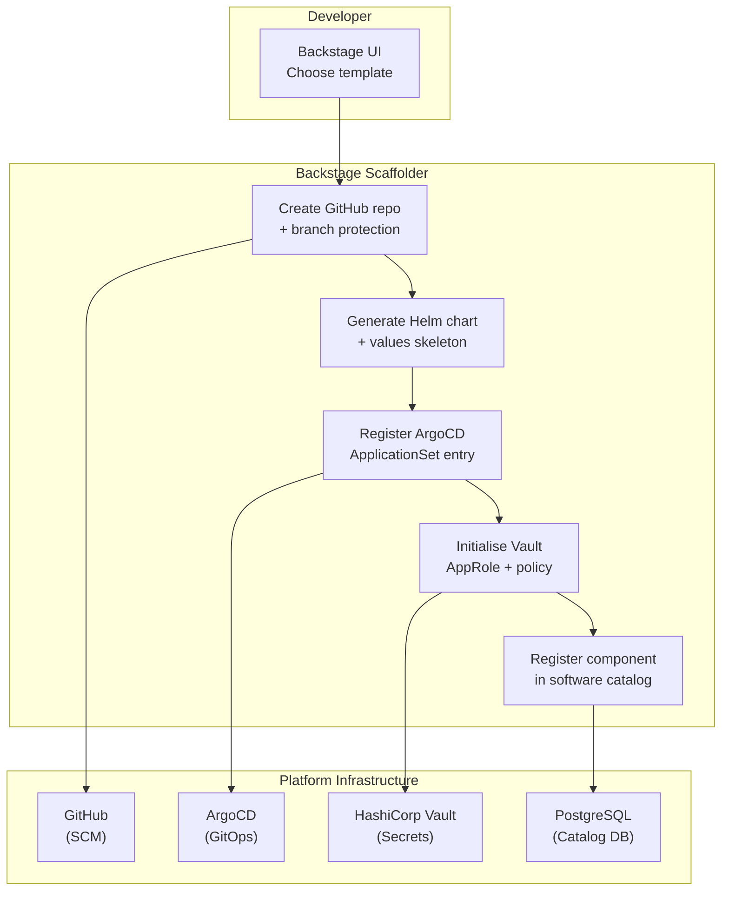

# Internal Developer Platform

Status: Draft | Last Reviewed: 2026-05-26 | Owner: @ea-board
Catalog ID: PLT-004 | Radii
Tier Applicability: T0, T1, T2

## Problem Statement

Engineering teams at the bank spend an average of 3–5 days provisioning a new service from scratch: creating the git repository, configuring CI/CD pipelines, wiring up secrets, registering the service in the observability stack, and obtaining the necessary Kubernetes namespace. Each team solves the same provisioning problem differently, producing a configuration sprawl of incompatible Helm charts, divergent GitHub Actions workflows, and ad hoc secret management patterns. A new engineer joining the payment gateway team must read three private wikis, two Confluence spaces, and a Slack message history to understand how to deploy a hotfix — the procedure is tribal knowledge, not a system.

Regulated financial institutions face a compounding problem: every manually provisioned environment risks diverging from the compliance baseline. A Kubernetes namespace created without the mandatory OPA Gatekeeper policies, or a service deployed without Vault agent injection, becomes a compliance finding during the next SBV examination. The platform team cannot audit 200 manually created services for baseline adherence; the examination finding always surfaces after the fact.

## Context

The Internal Developer Platform (IDP) is the self-service layer that sits above the Kubernetes and CI/CD infrastructure. It exposes a curated catalogue of software templates (golden paths) through Backstage, producing consistent, compliant service skeletons on demand. Each golden path template encodes the approved patterns from the architecture catalog: the GitOps pipeline (PLT-003), the Vault secret injection (SEC-007), the OTEL instrumentation bootstrap (OBS-001), and the mandatory SLO recording rules (OBS-003). The IDP integrates with GitHub (SCM), ArgoCD (GitOps), Vault (secrets), and OpenSearch (log onboarding) via Backstage scaffolder actions.

The platform runs as a managed internal service on the shared platform Kubernetes cluster. Backstage's software catalog provides the service registry — every registered component has an owner, a lifecycle stage, a tier tag, and links to its runbook, SLO dashboard, and on-call rotation.

## Solution

Backstage deployed as a Kubernetes Deployment with a PostgreSQL backend, fronted by an internal OAuth2 proxy for SSO. The TechDocs plugin renders architecture documents from git alongside the service catalog entry. The scaffolder plugin exposes golden path templates that: create the GitHub repository with branch protection, generate the Helm chart skeleton with tier-appropriate resource limits, register the ArgoCD ApplicationSet entry, initialise the Vault AppRole credentials, and register the service in the Backstage software catalog — all in a single self-service flow requiring no platform team intervention.



## Implementation Guidelines

**1. Backstage Helm values (core configuration)**

```yaml
# platform/backstage/helm/values-prod.yaml
backstage:
  image:
    repository: registry.internal/backstage
    tag: "1.26.0"
  replicaCount: 2

  appConfig:
    app:
      baseUrl: https://backstage.internal
    backend:
      baseUrl: https://backstage.internal
      database:
        client: pg
        connection:
          host: ${POSTGRES_HOST}
          port: 5432
          user: ${POSTGRES_USER}
          password: ${POSTGRES_PASSWORD}   # Vault-injected

    auth:
      providers:
        oidc:
          production:
            metadataUrl: https://sso.internal/.well-known/openid-configuration
            clientId: ${OIDC_CLIENT_ID}
            clientSecret: ${OIDC_CLIENT_SECRET}

    catalog:
      locations:
        - type: github-discovery
          target: https://github.com/org/*/catalog-info.yaml
      rules:
        - allow: [Component, API, Resource, System, Domain]

    techdocs:
      builder: external
      generator:
        runIn: local
      publisher:
        type: awsS3
        awsS3:
          bucketName: backstage-techdocs-prod
          region: ap-southeast-1
```

**2. Golden path template — Spring Boot microservice (template.yaml)**

```yaml
# backstage/templates/spring-boot-service/template.yaml
apiVersion: scaffolder.backstage.io/v1beta3
kind: Template
metadata:
  name: spring-boot-banking-service
  title: Spring Boot Banking Microservice
  description: Compliant Spring Boot service with OTEL, Vault, GitOps, and SLO wiring
  tags: [java, spring-boot, recommended]
spec:
  owner: platform-team
  type: service

  parameters:
    - title: Service Identification
      required: [name, owner, tier]
      properties:
        name:
          title: Service name
          type: string
          pattern: '^[a-z][a-z0-9-]{2,48}$'
        owner:
          title: Owner team
          type: string
          ui:field: OwnerPicker
          ui:options:
            allowedKinds: [Group]
        tier:
          title: Criticality tier
          type: string
          enum: [T0, T1, T2]
          default: T1

  steps:
    - id: fetch-template
      name: Fetch skeleton
      action: fetch:template
      input:
        url: ./skeleton
        values:
          name: ${{ parameters.name }}
          owner: ${{ parameters.owner }}
          tier: ${{ parameters.tier }}

    - id: create-repo
      name: Create GitHub repository
      action: github:repo:create
      input:
        repoUrl: github.com?owner=org&repo=${{ parameters.name }}
        defaultBranch: main
        repoVisibility: internal
        topics: [${{ parameters.tier | lower }}, banking, microservice]

    - id: push-skeleton
      name: Push skeleton to repository
      action: github:repo:push
      input:
        repoUrl: github.com?owner=org&repo=${{ parameters.name }}
        defaultBranch: main
        requireCodeOwnerReviews: true
        requiredApprovingReviewCount: 2

    - id: register-argocd
      name: Register ArgoCD ApplicationSet entry
      action: http:backstage:request
      input:
        method: POST
        path: /api/proxy/argocd/api/v1/applications
        body:
          metadata:
            name: ${{ parameters.name }}-dev
            namespace: argocd
          spec:
            project: banking
            source:
              repoURL: https://github.com/org/${{ parameters.name }}
              path: helm
              helm:
                valueFiles: [values-base.yaml, values-dev.yaml]
            destination:
              server: https://dev-cluster.internal:6443
              namespace: banking-dev

    - id: init-vault
      name: Initialise Vault AppRole
      action: http:backstage:request
      input:
        method: POST
        path: /api/proxy/vault/v1/auth/approle/role/${{ parameters.name }}-dev
        body:
          policies: [${{ parameters.name }}-dev-read]
          secret_id_ttl: 0
          token_ttl: 1h

    - id: register-catalog
      name: Register in software catalog
      action: catalog:register
      input:
        repoContentsUrl: https://github.com/org/${{ parameters.name }}/blob/main
        catalogInfoPath: /catalog-info.yaml

  output:
    links:
      - title: Repository
        url: ${{ steps.create-repo.output.remoteUrl }}
      - title: Open in Backstage catalog
        icon: catalog
        entityRef: ${{ steps.register-catalog.output.entityRef }}
```

**3. Skeleton catalog-info.yaml (embedded in the template)**

```yaml
# backstage/templates/spring-boot-service/skeleton/catalog-info.yaml
apiVersion: backstage.io/v1alpha1
kind: Component
metadata:
  name: ${{ values.name }}
  title: ${{ values.name | title }}
  description: Banking microservice (tier ${{ values.tier }})
  annotations:
    github.com/project-slug: org/${{ values.name }}
    backstage.io/techdocs-ref: dir:.
    argocd/app-name: ${{ values.name }}-dev
    prometheus.io/scrape: "true"
  tags:
    - ${{ values.tier | lower }}
    - banking
spec:
  type: service
  owner: ${{ values.owner }}
  lifecycle: experimental
  system: banking-platform
  providesApis: []
  consumesApis: []
```

**4. Backstage GitHub Actions workflow for TechDocs build**

```yaml
# .github/workflows/techdocs.yml
name: Publish TechDocs
on:
  push:
    branches: [main]
    paths: [docs/**, mkdocs.yml]

jobs:
  publish-techdocs:
    runs-on: ubuntu-latest
    steps:
      - uses: actions/checkout@v4
      - uses: actions/setup-python@v5
        with:
          python-version: "3.11"
      - run: pip install mkdocs-techdocs-core==1.*
      - uses: aws-actions/configure-aws-credentials@v4
        with:
          role-to-assume: arn:aws:iam::ACCOUNT:role/techdocs-publisher
          aws-region: ap-southeast-1
      - name: Generate and publish TechDocs
        run: |
          npx @techdocs/cli generate --no-docker --source-dir . --output-dir ./site
          npx @techdocs/cli publish --publisher-type awsS3 \
            --storage-name backstage-techdocs-prod \
            --entity ${{ env.ENTITY_NAMESPACE }}/${{ env.ENTITY_KIND }}/${{ env.ENTITY_NAME }}
        env:
          ENTITY_NAMESPACE: default
          ENTITY_KIND: Component
          ENTITY_NAME: ${{ github.event.repository.name }}
```

## When to Use

- When engineering teams spend >1 day provisioning a new service from scratch
- When compliance baseline (OPA policies, Vault injection, OTEL wiring) cannot be consistently enforced across manually created services
- When the platform team needs a single service registry that reflects actual deployed services and their owners
- When onboarding a new team: the Backstage golden path is the documented, consistent entry point

## When Not to Use

- Legacy services with bespoke deployment procedures that cannot be migrated to the golden path without a multi-quarter refactor — catalog them in Backstage for discoverability but exclude from the scaffolder
- One-off batch jobs or scheduled tasks that do not warrant full service lifecycle management — use a lighter Job/CronJob template outside the IDP
- External vendor products deployed as Helm charts — register them in the catalog as Resources, not Components; they do not go through scaffolder

## Variants

| Variant | When to prefer | Trade-off |
|---------|----------------|-----------|
| Backstage (this pattern) | Teams needing a full software catalog + scaffolder + TechDocs in one product | Higher operational overhead (PostgreSQL, plugin ecosystem management) |
| Port.io | Teams wanting a SaaS IDP with faster time-to-value | Vendor dependency; data leaves the internal network |
| Humanitec | Platform engineering teams who want a pure API-driven orchestrator without the Backstage catalog UI | No built-in service catalog or TechDocs |

## NFR Acceptance Criteria

```yaml
nfr_acceptance_criteria:
  catalog_id: PLT-004
  pattern: Internal Developer Platform
  performance:
    - id: PLT-004-HP-01
      description: Backstage catalog page load (software catalog list) must complete in under 2 seconds at p95 with 200 concurrent users.
      threshold: p95_page_load < 2s
    - id: PLT-004-HP-02
      description: Scaffolder workflow (all 5 steps) must complete end-to-end in under 3 minutes for a standard Spring Boot service template.
      threshold: scaffolder_workflow_duration < 3 min
    - id: PLT-004-HP-03
      description: Backstage availability must meet 99.5% monthly uptime (internal productivity tool, not customer-facing).
      threshold: availability >= 99.5%
  compliance:
    - id: PLT-004-COMP-01
      description: Every scaffolded service must have a catalog-info.yaml registered in Backstage within 10 minutes of repository creation.
      threshold: 0 services without catalog entry after 10 min
    - id: PLT-004-COMP-02
      description: Golden path templates must enforce mandatory compliance annotations (vault injection, OTEL, tier tag) — scaffolder must reject parameter sets that omit required fields.
      threshold: 0 scaffolded services missing mandatory annotations
```

## Compliance Mapping

| Ring | Regulation | Provision | How this pattern satisfies |
|------|-----------|-----------|---------------------------|
| Ring 0 | CNCF Platform Engineering Maturity Model | Level 3 — Scalable: self-service provisioning with guardrails, service catalog, and golden paths | Backstage scaffolder + golden path templates implement Level 3 self-service; software catalog implements the required component registry |
| Ring 1 | BCBS 230 | Principle 7 — change management: changes must be planned, approved, and documented | Scaffolder produces a GitHub repository with branch protection (two-reviewer requirement) and ArgoCD GitOps wiring from day one; every service provisioned has a documented, auditable creation record |
| Ring 2 | SBV Circular 09/2020 | §III.1 — IT asset inventory for credit institutions | Backstage software catalog constitutes the IT asset inventory required by §III.1; every component has an owner, lifecycle, and tier tag meeting the asset classification requirements ⚠️ (working summary — pending Legal review) |

## Cost / FinOps Notes

- Backstage: 2 pods (1 CPU / 2 GB RAM each) on shared platform nodes; PostgreSQL RDS db.t4g.small (2 vCPU / 2 GB) = ~USD 40/month
- TechDocs S3 storage: ~5 GB across all services at USD 0.023/GB = ~USD 0.12/month; negligible
- GitHub Actions scaffolder workflows: ~2 minutes per new service; at 20 new services/month = 40 minutes runner time = negligible at shared runner pricing
- ROI: each scaffolded service saves 3–5 days of manual provisioning engineering time; at 20 services/month, the IDP saves 60–100 engineer-days/month

## Threat Model

**Template Injection — malicious golden path template (Tampering)**: a contributor with write access to the backstage/templates directory merges a template that includes a scaffolder step posting secrets to an external endpoint. Every developer who creates a service using the compromised template inadvertently exfiltrates Vault AppRole credentials. Mitigation: template changes require PR review from the `platform-lead` CODEOWNERS group; template repository is separate from application code with restricted merge permissions; all scaffolder outbound HTTP calls are routed through an egress proxy that only permits requests to approved internal endpoints (GitHub, ArgoCD, Vault, catalog API).

**Catalog Poisoning — false component registration (Spoofing)**: an attacker registers a fake component in the Backstage catalog that mimics a real service, causing engineers to believe a rogue deployment is the canonical service. This creates confusion during incidents and may redirect traffic to an attacker-controlled endpoint. Mitigation: Backstage catalog ingestion is restricted to the `github-discovery` provider scanning only the approved GitHub organization; manual catalog registrations from the UI are disabled in production; catalog-info.yaml files require the same branch protection approvals as application code.

## Operational Runbook (stub)

1. Alert: BackstageUnavailable — fires when Backstage health endpoint (`/healthcheck`) returns non-200 for 3 consecutive minutes. p50 resolution: 5 min; p99: 20 min. Check pod status: `kubectl get pods -n backstage`. Common causes: PostgreSQL connection failure (check RDS status), OOM kill (check `kubectl describe pod`), OIDC provider unreachable (check SSO availability). Restart: `kubectl rollout restart deployment/backstage -n backstage`.

2. Alert: BackstageCatalogStaleness — fires when the Backstage catalog has not refreshed any entity in 30 minutes (tracked via catalog metrics). p50 resolution: 10 min; p99: 45 min. Check the GitHub integration token expiry: `curl -H "Authorization: token $GH_TOKEN" https://api.github.com/rate_limit`. If the token has expired, rotate it in Vault at `secret/data/platform/backstage/github-token` and trigger a pod restart to pick up the new value.

## Test Strategy

**Unit**: `ScaffolderTemplateTest` — use Backstage scaffolder dry-run API (`POST /api/scaffolder/v2/tasks?dryRun=true`) with the Spring Boot template parameters; assert all 5 steps appear in the dry-run output with no schema validation errors; assert required fields (name pattern, owner, tier) fail validation when absent.

**Integration**: Deploy Backstage in a `kind` cluster with a mock GitHub API and a Vault dev server; trigger the Spring Boot template scaffolder via API; assert the GitHub repository is created with the correct branch protection rules; assert the ArgoCD Application object is created in the `argocd` namespace; assert the Vault AppRole exists; assert the catalog-info.yaml is registered and appears in the software catalog within 5 minutes.

**Compliance**: `CatalogInventoryTest` — query the Backstage catalog API for all Components; assert every component has `metadata.annotations["argocd/app-name"]`, `metadata.tags` (containing tier), and `spec.owner`; assert 0 components have `lifecycle: deprecated` without a decommission date in metadata; assert 100% of T0/T1 components have an on-call annotation pointing to a valid PagerDuty schedule.

**Load**: Deploy Backstage with a seed catalog of 500 components; run k6 with 200 virtual users hitting `/catalog-info?kind=component` for 5 minutes; assert p95 response time < 2 seconds; assert 0 errors.

## Related Patterns

- [PLT-003 GitOps Deployment Pipeline](gitops-deployment-pipeline.md) — scaffolder registers the ArgoCD ApplicationSet entry; all service deployments flow through PLT-003
- [PLT-005 Kubernetes Operator Pattern](kubernetes-operator-pattern.md) — custom operators for self-service Kubernetes resource provisioning can be exposed as scaffolder actions
- [PLT-008 Multi-Tenancy Isolation](multi-tenancy-isolation.md) — scaffolder enforces namespace isolation policies at service creation time
- [SEC-007 Secrets Rotation](../security/secrets-rotation.md) — scaffolder initialises Vault AppRole credentials; SEC-007 governs the rotation lifecycle
- [OBS-001 OTEL Instrumentation](../observability/otel-instrumentation.md) — golden path template includes OTEL Java agent bootstrap and collector endpoint configuration
- [OBS-003 SLO Alerting](../observability/slo-alerting.md) — service skeleton includes mandatory SLO recording rules and Prometheus ServiceMonitor

## References

- Backstage documentation — software catalog, scaffolder, TechDocs plugins
- CNCF Platform Engineering Maturity Model v1.0
- Thoughtworks Technology Radar — Internal Developer Platform
- BCBS 230 Sound Practices for the Management and Supervision of Operational Risk
- SBV Circular 09/2020 — Information System Security for Credit Institutions

---
**Key Takeaway**: Backstage golden path templates eliminate the 3–5 day manual service provisioning overhead by encoding all approved patterns (GitOps, Vault, OTEL, SLO) into a self-service scaffolder that creates a compliant, catalog-registered service in under 3 minutes — with zero platform team intervention.
