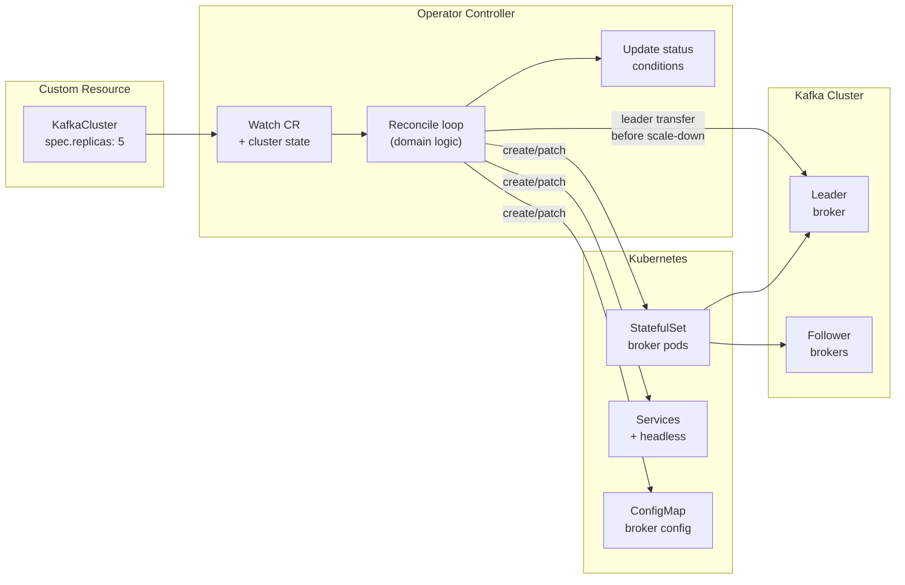

# Kubernetes Operator Pattern

Status: Draft | Last Reviewed: 2026-05-26 | Owner: @ea-board
Catalog ID: PLT-005 | Radii
Tier Applicability: T0, T1, T2

## Problem Statement

Banking platform teams manage dozens of stateful workloads — Kafka clusters, Redis Sentinel sets, Vault HA clusters, and PostgreSQL primaries with replicas — each requiring multi-step, order-dependent operational procedures: scale-up requires a leader election step before adding followers; a Kafka broker replacement requires reassigning partition leadership before decommissioning the old broker; a Vault key rotation requires unsealing quorum before the new key can be stored. These procedures are documented in runbooks but executed manually by SRE engineers, introducing human error at exactly the moments of highest operational stress.

Kubernetes Deployments and StatefulSets cannot model this domain knowledge. A StatefulSet knows how to restart pods but does not know that a Kafka broker must gracefully transfer leadership before its pod is deleted. Every Kafka rolling upgrade done without an operator causes a 30-second consumer-group rebalance storm. A DBA executing a PostgreSQL failover manually under a 3-minute RTO pressure has a measurable error rate. The gap between what Kubernetes primitives can express and what stateful banking workloads actually require is the operator gap.

## Context

The Kubernetes Operator pattern extends the Kubernetes API with Custom Resource Definitions (CRDs) that model domain-specific objects (e.g., `KafkaCluster`, `VaultCluster`, `RedisReplication`) and controllers that reconcile the actual cluster state toward the desired state encoded in those objects. The operator runs inside the cluster as a controller-manager Deployment, watching its CRDs and reacting to state changes with domain-aware operational logic. The operator replaces manual runbook execution with declarative intent: the SRE sets `spec.kafka.replicas: 5`, and the operator orchestrates the safe broker addition — including leader rebalance — automatically.

In the banking context, operators are deployed via ArgoCD (PLT-003) and managed through the same GitOps pipeline as application workloads. The IDP (PLT-004) exposes operator-managed resources as scaffolder actions, so teams can provision a Kafka topic or a Redis replica set through Backstage without understanding the operator internals.

## Solution

Operator SDK (Go) used to build banking-specific operators for stateful workloads. The reconcile loop follows the Kubernetes controller pattern: read current state via the API server, compare with desired state from the CRD spec, and drive the cluster toward the desired state. Finalizers handle pre-deletion logic (leader election transfer, partition reassignment). Status conditions expose operational state (`Ready`, `Scaling`, `Rebalancing`, `Degraded`) to kubectl and Backstage.



## Implementation Guidelines

**1. Custom Resource Definition — KafkaTopic**

```yaml
# operators/kafka-operator/config/crd/bases/kafka.banking.internal_kafkatopics.yaml
apiVersion: apiextensions.k8s.io/v1
kind: CustomResourceDefinition
metadata:
  name: kafkatopics.kafka.banking.internal
spec:
  group: kafka.banking.internal
  names:
    kind: KafkaTopic
    listKind: KafkaTopicList
    plural: kafkatopics
    singular: kafkatopic
    shortNames: [kt]
  scope: Namespaced
  versions:
    - name: v1alpha1
      served: true
      storage: true
      schema:
        openAPIV3Schema:
          type: object
          properties:
            spec:
              type: object
              required: [clusterRef, partitions, replicationFactor, retentionMs]
              properties:
                clusterRef:
                  type: string
                partitions:
                  type: integer
                  minimum: 1
                  maximum: 200
                replicationFactor:
                  type: integer
                  minimum: 1
                  maximum: 5
                retentionMs:
                  type: integer
                  description: Retention in milliseconds; -1 for infinite
                compacted:
                  type: boolean
                  default: false
            status:
              type: object
              properties:
                conditions:
                  type: array
                  items:
                    type: object
                    properties:
                      type: {type: string}
                      status: {type: string}
                      reason: {type: string}
                      message: {type: string}
                      lastTransitionTime: {type: string}
                observedPartitions:
                  type: integer
                topicId:
                  type: string
      subresources:
        status: {}
      additionalPrinterColumns:
        - name: Partitions
          type: integer
          jsonPath: .spec.partitions
        - name: Replicas
          type: integer
          jsonPath: .spec.replicationFactor
        - name: Ready
          type: string
          jsonPath: .status.conditions[?(@.type=="Ready")].status
        - name: Age
          type: date
          jsonPath: .metadata.creationTimestamp
```

**2. Go reconciler — KafkaTopic controller (core loop)**

```go
// operators/kafka-operator/internal/controller/kafkatopic_controller.go
func (r *KafkaTopicReconciler) Reconcile(ctx context.Context, req ctrl.Request) (ctrl.Result, error) {
    log := log.FromContext(ctx)

    topic := &kafkav1alpha1.KafkaTopic{}
    if err := r.Get(ctx, req.NamespacedName, topic); err != nil {
        return ctrl.Result{}, client.IgnoreNotFound(err)
    }

    // Resolve cluster admin client from clusterRef
    adminClient, err := r.kafkaClientFor(ctx, topic.Spec.ClusterRef, topic.Namespace)
    if err != nil {
        return r.setDegraded(ctx, topic, "ClusterRefNotFound", err.Error())
    }
    defer adminClient.Close()

    // Deletion: unregister topic before CR removal
    if !topic.DeletionTimestamp.IsZero() {
        if controllerutil.ContainsFinalizer(topic, "kafka.banking.internal/topic-cleanup") {
            if err := adminClient.DeleteTopic(topic.Name); err != nil {
                return r.setDegraded(ctx, topic, "DeleteFailed", err.Error())
            }
            controllerutil.RemoveFinalizer(topic, "kafka.banking.internal/topic-cleanup")
            return ctrl.Result{}, r.Update(ctx, topic)
        }
        return ctrl.Result{}, nil
    }

    // Ensure finalizer present
    if !controllerutil.ContainsFinalizer(topic, "kafka.banking.internal/topic-cleanup") {
        controllerutil.AddFinalizer(topic, "kafka.banking.internal/topic-cleanup")
        if err := r.Update(ctx, topic); err != nil {
            return ctrl.Result{}, err
        }
    }

    // Check if topic exists in Kafka
    existingConfig, err := adminClient.DescribeTopic(topic.Name)
    if err != nil && !errors.Is(err, kafka.ErrTopicNotFound) {
        return r.setDegraded(ctx, topic, "DescribeFailed", err.Error())
    }

    if errors.Is(err, kafka.ErrTopicNotFound) {
        // Create topic
        if err := adminClient.CreateTopic(topic.Name, kafka.TopicConfig{
            Partitions:        topic.Spec.Partitions,
            ReplicationFactor: topic.Spec.ReplicationFactor,
            RetentionMs:       topic.Spec.RetentionMs,
            Compacted:         topic.Spec.Compacted,
        }); err != nil {
            return r.setDegraded(ctx, topic, "CreateFailed", err.Error())
        }
        log.Info("Created Kafka topic", "topic", topic.Name)
    } else {
        // Reconcile partition count (can only grow)
        if topic.Spec.Partitions > existingConfig.Partitions {
            if err := adminClient.AddPartitions(topic.Name, topic.Spec.Partitions); err != nil {
                return r.setDegraded(ctx, topic, "AddPartitionsFailed", err.Error())
            }
        }
        // Reconcile retention
        if topic.Spec.RetentionMs != existingConfig.RetentionMs {
            if err := adminClient.AlterConfig(topic.Name, map[string]string{
                "retention.ms": strconv.Itoa(topic.Spec.RetentionMs),
            }); err != nil {
                return r.setDegraded(ctx, topic, "AlterConfigFailed", err.Error())
            }
        }
    }

    return r.setReady(ctx, topic)
}
```

**3. Operator RBAC — minimal ClusterRole**

```yaml
# operators/kafka-operator/config/rbac/role.yaml
apiVersion: rbac.authorization.k8s.io/v1
kind: ClusterRole
metadata:
  name: kafka-operator-manager
rules:
  - apiGroups: [kafka.banking.internal]
    resources: [kafkatopics, kafkatopics/status, kafkatopics/finalizers]
    verbs: [get, list, watch, create, update, patch, delete]
  - apiGroups: [""]
    resources: [secrets]
    verbs: [get, list, watch]        # for Kafka bootstrap credential secret
  - apiGroups: [""]
    resources: [events]
    verbs: [create, patch]
  - apiGroups: [coordination.k8s.io]
    resources: [leases]
    verbs: [get, list, watch, create, update, patch, delete]   # leader election
```

**4. KafkaTopic CR usage example**

```yaml
# Example: payment-events topic
apiVersion: kafka.banking.internal/v1alpha1
kind: KafkaTopic
metadata:
  name: payment-events
  namespace: banking-prod
spec:
  clusterRef: kafka-prod
  partitions: 24
  replicationFactor: 3
  retentionMs: 604800000    # 7 days
  compacted: false
```

## When to Use

- Stateful workloads requiring domain-aware operational logic that exceeds what Deployments/StatefulSets can express (Kafka, Redis Sentinel, Vault HA, PostgreSQL HA)
- When the same multi-step operational procedure is executed repeatedly by SREs from a runbook — the runbook is an operator specification waiting to be implemented
- When self-service provisioning of cluster resources (topics, queues, database schemas) must be exposed to application teams without direct Kubernetes access
- When operational errors during stateful scaling or failover are causing production incidents

## When Not to Use

- Stateless microservices — Deployments and GitOps are sufficient; an operator adds unnecessary complexity
- Simple configuration management (ConfigMaps, Secrets) — use ArgoCD and Vault instead
- One-time database migrations or schema changes — use Flyway/Liquibase Jobs rather than a long-lived controller
- Small teams without Go expertise — operator development requires familiarity with controller-runtime; evaluate managed Kafka (Confluent Cloud) or managed Redis (ElastiCache) before building an operator

## Variants

| Variant | When to prefer | Trade-off |
|---------|----------------|-----------|
| Operator SDK (Go, this pattern) | Maximum control over reconcile logic; best performance | Highest development effort; requires Go expertise |
| Kubebuilder | Teams already using controller-runtime and preferring scaffold-first | Very similar to Operator SDK; less opinionated on OLM packaging |
| KEDA ScaledObject | Event-driven autoscaling only (Kafka consumer lag → pod scale) | Not a general operator; only handles scaling triggers |
| Community operators (Strimzi for Kafka, Zalando for PostgreSQL) | Standard open-source databases without custom business logic | Less flexible for banking-specific requirements; dependency on upstream release cadence |

## NFR Acceptance Criteria

```yaml
nfr_acceptance_criteria:
  catalog_id: PLT-005
  pattern: Kubernetes Operator Pattern
  performance:
    - id: PLT-005-HP-01
      description: Operator reconcile loop must complete within 5 seconds for KafkaTopic create/update operations under normal cluster load.
      threshold: reconcile_duration_p99 < 5s
    - id: PLT-005-HP-02
      description: Operator must handle 500 KafkaTopic CRs with a single controller-manager pod consuming less than 256 MB RAM.
      threshold: operator_memory_usage < 256 MB at 500 CRs
    - id: PLT-005-HP-03
      description: Leader election failover (operator pod restart) must complete within 15 seconds — new leader assumes control before the next reconcile cycle.
      threshold: leader_election_failover < 15s
  compliance:
    - id: PLT-005-COMP-01
      description: Every KafkaTopic deletion must trigger the finalizer cleanup (Kafka broker topic deletion) before the CR is removed — 0 orphaned topics allowed in the banking-prod namespace.
      threshold: 0 orphaned topics post-CR-deletion
    - id: PLT-005-COMP-02
      description: Operator RBAC must follow least-privilege — the ClusterRole must grant only the verbs listed in Implementation Guideline 3; any additional verbs require EA board review.
      threshold: 0 excess RBAC verbs without EA approval
```

## Compliance Mapping

| Ring | Regulation | Provision | How this pattern satisfies |
|------|-----------|-----------|---------------------------|
| Ring 0 | Kubernetes Operator Pattern (operatorhub.io Level 5) | Level 5 — Auto Pilot: operator handles all Day-2 operations automatically including upgrades, backup, failure recovery | KafkaTopic controller implements Day-2 partition scaling and retention config reconciliation; finalizer pattern ensures clean deletion — achieving Level 4+; full Level 5 requires backup/restore integration |
| Ring 1 | BCBS 230 | Principle 6 — operational risk management: processes must reduce human error in critical operations | Operators replace error-prone manual SRE procedures for stateful workloads; every reconcile action is a Kubernetes Event with actor (`operator`), action, and resource, constituting machine-generated change evidence |
| Ring 2 | SBV Circular 09/2020 | §III.3 — configuration management for critical information systems | CRD spec in git constitutes the desired-state configuration record for banking-critical messaging infrastructure; reconcile loop enforces configuration convergence, preventing drift ⚠️ (working summary — pending Legal review) |

## Cost / FinOps Notes

- Operator pod: 1 controller-manager Deployment, 2 replicas (leader election), 250m CPU / 256 MB RAM each = ~0.5 CPU + 512 MB RAM on shared platform nodes; marginal cost
- CRD storage: Kubernetes etcd stores CRs; at 500 KafkaTopic objects × ~2 KB each = 1 MB — negligible etcd overhead
- Build: Operator SDK Go builds produce ~20 MB Docker image; stored in internal registry; no per-image cost beyond registry storage
- Operational savings: replacing 2 hours of SRE manual Kafka partition rebalance per upgrade × 4 upgrades/month = 8 SRE-hours/month; at blended SRE rate, the operator pays back its build cost within 3 months

## Threat Model

**Privileged Reconciler Abuse — operator service account escalation (Elevation of Privilege)**: the Kafka operator's ClusterRole grants `secrets: get` to read Kafka bootstrap credentials. An attacker who compromises the operator pod can use the mounted service account token to read any Secret in any namespace (if the ClusterRole is inadvertently namespace-wide). Mitigation: the ClusterRole's `secrets: get` is scoped to a ResourceName list limited to the specific bootstrap credential Secrets; the operator runs with `automountServiceAccountToken: false` and uses projected volume token with audience restriction; OPA Gatekeeper policy `require-operator-rolebinding` enforces that operator RoleBindings must always include a namespace selector.

**CRD Injection — malicious KafkaTopic spec (Tampering)**: an engineer with access to the banking-dev namespace creates a KafkaTopic with `retentionMs: -1` (infinite retention) on a topic named identically to a prod topic. The operator creates the infinite-retention topic in dev, and a misconfigured producer writes production PII to the dev topic — which is never purged. Mitigation: the CRD openAPIV3Schema validation rejects `retentionMs: -1` unless `spec.compacted: true` (compacted topics intentionally have no time-based retention); separate operator instances per environment (dev-operator / prod-operator) with namespace-scoped RBAC ensure the dev operator cannot touch the prod namespace.

## Operational Runbook (stub)

1. Alert: OperatorReconcileBacklog — fires when the operator's work queue depth exceeds 100 items for more than 2 minutes. p50 resolution: 5 min; p99: 30 min. Check operator logs: `kubectl logs -n operator-system -l app=kafka-operator --tail=100`. Common causes: Kafka admin API timeout (check broker availability), leader election split-brain (check lease object), API server throttling (check `kubectl get --raw /metrics | grep apiserver_client_ratelimiter`). Scale the operator: `kubectl scale -n operator-system deployment/kafka-operator --replicas=2` (only one will be leader; scaling adds a hot standby).

2. Alert: OperatorCRDDegraded — fires when any KafkaTopic CR has `.status.conditions[type=Ready].status == "False"` for more than 5 minutes. p50 resolution: 10 min; p99: 45 min. Inspect the status condition: `kubectl get kafkatopics -n banking-prod -o wide`. The `reason` and `message` fields of the status condition contain the specific Kafka admin API error. Common causes: cluster reference points to a decommissioned Kafka cluster; partition count decrease attempted (Kafka does not support partition reduction — the spec must be corrected to match or exceed the existing partition count).

## Test Strategy

**Unit**: `ReconcilerTest` — use controller-runtime's `envtest` package with a fake Kafka admin client; create a KafkaTopic CR with `partitions: 12`; run one reconcile cycle; assert the fake admin client received `CreateTopic` with `partitions=12`; assert CR status condition `Ready=True`; simulate Kafka admin error; assert CR status `Ready=False` with `reason=CreateFailed`.

**Integration**: Deploy the operator in a `kind` cluster with a single-broker Kafka container; create a KafkaTopic CR; assert the Kafka topic exists within 30 seconds (`kafka-topics.sh --list`); update `spec.partitions` from 6 to 12; assert Kafka topic partition count increases to 12 within 60 seconds; delete the CR; assert the finalizer runs and the Kafka topic is deleted.

**Compliance**: `FinalzerCleanupTest` — create 10 KafkaTopic CRs in banking-prod namespace; verify all 10 topics exist in Kafka; delete all 10 CRs; wait 60 seconds; assert 0 Kafka topics remain that match the deleted CR names; assert 0 CRs remain in the namespace (finalizers completed).

**Chaos**: Kill the operator pod mid-reconcile (during a partition expansion); assert the new leader pod picks up the reconcile from the beginning (idempotent); assert the KafkaTopic reaches `Ready=True` within 2 minutes without manual intervention; assert no duplicate partition expansion events.

## Related Patterns

- [PLT-003 GitOps Deployment Pipeline](gitops-deployment-pipeline.md) — operators are deployed and upgraded via ArgoCD Applications; CRD upgrades follow the same GitOps approval flow
- [PLT-004 Internal Developer Platform](internal-developer-platform.md) — IDP scaffolder exposes KafkaTopic creation as a self-service Backstage action backed by the operator
- [PLT-008 Multi-Tenancy Isolation](multi-tenancy-isolation.md) — operator RBAC is scoped per-namespace to enforce multi-tenant boundaries
- [OBS-008 Log Aggregation Pipeline](../observability/log-aggregation-pipeline.md) — operator reconcile events are structured logs shipped to OpenSearch for auditability
- [SEC-007 Secrets Rotation](../security/secrets-rotation.md) — operator reads Kafka bootstrap credentials from Vault; credential rotation does not require operator restart (projected volume refresh)

## References

- Operator SDK documentation — controller-runtime and reconcile pattern
- Kubernetes API Conventions — status conditions and finalizers
- Strimzi Kafka Operator — reference implementation for Kafka CRDs
- CNCF Operator Capability Levels — operatorhub.io maturity model
- BCBS 230 Sound Practices for the Management and Supervision of Operational Risk
- SBV Circular 09/2020 — Information System Security for Credit Institutions

---
**Key Takeaway**: Encode multi-step stateful workload operations (Kafka partition rebalance, Vault key rotation, PostgreSQL failover) as Kubernetes operators that reconcile CRD desired-state to cluster actual-state — replacing error-prone SRE runbook execution with domain-aware automation that produces machine-generated audit events for every operation.
