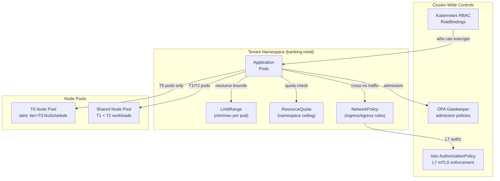

# Multi-Tenancy Isolation

Status: Draft | Last Reviewed: 2026-05-26 | Owner: @ea-board
Catalog ID: PLT-008 | Radii
Tier Applicability: T0, T1, T2

## Problem Statement

The bank runs workloads for multiple business units — retail banking, card issuing, treasury, and trade finance — on a shared Kubernetes platform. Without deliberate isolation boundaries, a misbehaving retail banking pod can exhaust CPU on the node, starving the card issuing transaction processor and causing a T0 outage in an unrelated business unit. A developer with kubectl access in the retail banking namespace can exec into a pod and query the Kubernetes API server for Secrets in the card issuing namespace if RBAC is misconfigured. An OOM event in a trade finance batch job kills nodes and evicts T0 payment gateway pods.

Regulatory isolation is a separate concern: SBV Circular 09/2020 §III.2 requires that critical banking systems have logical separation from non-critical systems. A BCBS 230 examination asks "how is your T0 payment processing system isolated from development workloads?" The answer "they share the same Kubernetes cluster without isolation controls" is a regulatory finding.

## Context

Multi-tenancy isolation in Kubernetes is achieved through a layered control stack: namespace-level RBAC (who can do what), NetworkPolicy (which pods can communicate), LimitRange and ResourceQuota (resource ceiling and floor per namespace), OPA Gatekeeper admission policies (what configurations are permitted), and node isolation via dedicated node pools with taints and tolerations for T0 workloads. The Istio service mesh (PLT-001) adds mTLS between namespaces, ensuring that cross-namespace traffic is always authenticated and encrypted even for east-west paths that bypass the ingress layer.

The isolation model maps business units to namespaces: `banking-retail`, `banking-cards`, `banking-treasury`, `banking-trade`. Each namespace is a trust boundary. The T0 node pool is dedicated (tainted `tier=T0:NoSchedule`) so T0 pods never share nodes with T1/T2 workloads. Cross-namespace API calls must traverse the Istio AuthorizationPolicy — no pod-to-pod direct IP access across namespace boundaries is permitted.

## Solution

Hierarchical namespace controller (HNC) for namespace provisioning, OPA Gatekeeper for admission policy enforcement, NetworkPolicy for Layer 3/4 isolation, Istio AuthorizationPolicy for Layer 7 isolation, ResourceQuota and LimitRange per namespace, and dedicated T0 node pools with taints. The GitOps pipeline (PLT-003) provisions all namespace resources from git; the IDP scaffolder (PLT-004) creates namespaces with the full isolation stack pre-applied from a namespace template.



## Implementation Guidelines

**1. Namespace template with full isolation stack**

```yaml
# platform/namespaces/banking-retail/namespace.yaml
apiVersion: v1
kind: Namespace
metadata:
  name: banking-retail
  labels:
    team: retail-engineering
    tier: T1
    cost-centre: "CC-2010"
    istio-injection: enabled
---
apiVersion: v1
kind: ResourceQuota
metadata:
  name: banking-retail-quota
  namespace: banking-retail
spec:
  hard:
    requests.cpu: "40"
    requests.memory: "80Gi"
    limits.cpu: "80"
    limits.memory: "160Gi"
    persistentvolumeclaims: "20"
    services.loadbalancers: "0"   # no direct LB; all traffic via ingress
    count/pods: "200"
---
apiVersion: v1
kind: LimitRange
metadata:
  name: banking-retail-limits
  namespace: banking-retail
spec:
  limits:
    - type: Container
      default:
        cpu: "500m"
        memory: "512Mi"
      defaultRequest:
        cpu: "100m"
        memory: "128Mi"
      max:
        cpu: "4"
        memory: "8Gi"
      min:
        cpu: "50m"
        memory: "64Mi"
```

**2. NetworkPolicy — default deny + allow ingress from Istio gateway**

```yaml
# platform/namespaces/banking-retail/network-policy.yaml
# Default deny all ingress and egress
apiVersion: networking.k8s.io/v1
kind: NetworkPolicy
metadata:
  name: default-deny-all
  namespace: banking-retail
spec:
  podSelector: {}
  policyTypes: [Ingress, Egress]
---
# Allow ingress from Istio ingress gateway only
apiVersion: networking.k8s.io/v1
kind: NetworkPolicy
metadata:
  name: allow-ingress-gateway
  namespace: banking-retail
spec:
  podSelector: {}
  policyTypes: [Ingress]
  ingress:
    - from:
        - namespaceSelector:
            matchLabels:
              kubernetes.io/metadata.name: istio-system
---
# Allow egress to DNS and to approved internal services
apiVersion: networking.k8s.io/v1
kind: NetworkPolicy
metadata:
  name: allow-egress-dns-internal
  namespace: banking-retail
spec:
  podSelector: {}
  policyTypes: [Egress]
  egress:
    - ports:
        - port: 53
          protocol: UDP
    - to:
        - namespaceSelector:
            matchLabels:
              purpose: platform   # Kafka, Vault, observability namespaces
```

**3. Istio AuthorizationPolicy — namespace-level mTLS enforcement**

```yaml
# platform/namespaces/banking-retail/authz-policy.yaml
# Deny all cross-namespace traffic by default
apiVersion: security.istio.io/v1beta1
kind: AuthorizationPolicy
metadata:
  name: deny-cross-namespace
  namespace: banking-retail
spec:
  action: DENY
  rules:
    - from:
        - source:
            notNamespaces: [banking-retail, istio-system, platform]
---
# Allow the payment gateway to call the retail account service
apiVersion: security.istio.io/v1beta1
kind: AuthorizationPolicy
metadata:
  name: allow-payment-gateway-to-account-service
  namespace: banking-retail
spec:
  selector:
    matchLabels:
      app: account-service
  action: ALLOW
  rules:
    - from:
        - source:
            principals:
              - "cluster.local/ns/banking-payments/sa/payment-gateway"
      to:
        - operation:
            methods: [POST]
            paths: ["/api/v2/accounts/*/debit", "/api/v2/accounts/*/credit"]
```

**4. T0 node pool taint + toleration (Helm values)**

```yaml
# services/payment-gateway/helm/values-prod.yaml
nodeSelector:
  node-pool: t0-dedicated

tolerations:
  - key: tier
    operator: Equal
    value: T0
    effect: NoSchedule

affinity:
  podAntiAffinity:
    requiredDuringSchedulingIgnoredDuringExecution:
      - labelSelector:
          matchLabels:
            app: payment-gateway
        topologyKey: kubernetes.io/hostname   # spread across nodes
```

**5. OPA Gatekeeper — require T0 pods to target T0 node pool**

```yaml
# platform/gatekeeper/templates/require-t0-nodeselector.yaml
apiVersion: templates.gatekeeper.sh/v1
kind: ConstraintTemplate
metadata:
  name: requiret0nodeselector
spec:
  crd:
    spec:
      names:
        kind: RequireT0NodeSelector
  targets:
    - target: admission.k8s.gatekeeper.sh
      rego: |
        package requiret0nodeselector

        violation[{"msg": msg}] {
          pod := input.review.object
          pod.metadata.labels.tier == "T0"
          not pod.spec.nodeSelector["node-pool"] == "t0-dedicated"
          msg := "T0 pods must target node-pool=t0-dedicated"
        }
---
apiVersion: constraints.gatekeeper.sh/v1beta1
kind: RequireT0NodeSelector
metadata:
  name: require-t0-node-pool
spec:
  match:
    kinds:
      - apiGroups: [""]
        kinds: ["Pod"]
    namespaces: [banking-payments, banking-prod]
```

## When to Use

- Any shared Kubernetes cluster running workloads from more than one business unit, team, or criticality tier
- When a noisy-neighbour resource consumption event has caused or could cause a T0 service outage
- When SBV or BCBS 230 examinations require evidence of logical isolation between critical and non-critical systems
- When developer access permissions must be scoped strictly to the team's own namespace

## When Not to Use

- Single-team, single-business-unit clusters — the isolation overhead exceeds the benefit; use LimitRange only
- Hard multi-tenancy with untrusted tenant code (e.g., running customer-submitted workloads) — shared Kubernetes is insufficient; use separate clusters or Kata Containers for VM-level isolation
- Serverless workloads (AWS Lambda, Cloud Run) — the provider handles isolation at the execution environment level

## Variants

| Variant | When to prefer | Trade-off |
|---------|----------------|-----------|
| Namespace isolation + NetworkPolicy + Istio (this pattern) | Trusted internal tenants, shared cluster economics | Network policy and Istio add configuration complexity; misconfiguration can allow unintended cross-namespace traffic |
| Separate clusters per tier | Hard T0 isolation requirement; untrusted tenants | Higher cost (separate control planes); more operational overhead; recommended for extreme regulatory requirements |
| vCluster (virtual clusters) | Dev/test tenants that need full Kubernetes API access | Lower isolation guarantee than separate clusters; useful for developer sandboxes, not production workloads |
| Kata Containers | Mixed-trust workloads requiring VM-level isolation on shared nodes | Higher per-pod CPU/RAM overhead (~200 MB per sandbox); slower pod start time |

## NFR Acceptance Criteria

```yaml
nfr_acceptance_criteria:
  catalog_id: PLT-008
  pattern: Multi-Tenancy Isolation
  performance:
    - id: PLT-008-HP-01
      description: T0 pod scheduling on the T0 dedicated node pool must not be affected by resource pressure in T1/T2 namespaces — T0 pod eviction due to shared-node pressure must be 0.
      threshold: T0_pod_evictions_due_to_shared_pressure = 0
    - id: PLT-008-HP-02
      description: NetworkPolicy enforcement must not add more than 1 ms latency to east-west pod-to-pod calls within the same namespace.
      threshold: network_policy_overhead < 1ms p99
  compliance:
    - id: PLT-008-COMP-01
      description: Every namespace in banking-prod, banking-uat must have a default-deny-all NetworkPolicy and a ResourceQuota — validated by the nightly compliance job.
      threshold: 0 namespaces without default-deny NetworkPolicy and ResourceQuota
    - id: PLT-008-COMP-02
      description: No T0 pod may be scheduled on a shared (non-T0-dedicated) node — OPA Gatekeeper must reject the admission request.
      threshold: 0 T0 pods on non-T0-dedicated nodes
```

## Compliance Mapping

| Ring | Regulation | Provision | How this pattern satisfies |
|------|-----------|-----------|---------------------------|
| Ring 0 | Kubernetes Multi-Tenancy Working Group — Tenancy Models | Soft multi-tenancy: namespace isolation with RBAC, NetworkPolicy, and admission control recommended for trusted internal tenants | This pattern implements the MTWG soft multi-tenancy model for banking business units; T0 dedicated node pool exceeds the soft model with node-level isolation |
| Ring 1 | BCBS 230 | Principle 6 — operational resilience: critical systems must be isolated from non-critical systems to prevent cascading failures | T0 dedicated node pool prevents noisy-neighbour eviction of critical workloads; Istio AuthorizationPolicy prevents lateral movement from T1/T2 namespaces to T0 services; ResourceQuota prevents resource exhaustion propagation |
| Ring 2 | SBV Circular 09/2020 | §III.2 — logical separation of critical information systems from non-critical systems | Namespace RBAC + NetworkPolicy + Istio mTLS constitute the logical separation required by §III.2 for critical banking information systems; T0 node pool constitutes physical-layer separation for the highest-criticality workloads ⚠️ (working summary — pending Legal review) |

## Cost / FinOps Notes

- T0 dedicated node pool: 3× m6i.4xlarge (16 vCPU / 64 GB) = ~USD 1,200/month reserved pricing; required overhead for T0 isolation guarantee
- OPA Gatekeeper: 3 pods on shared platform nodes; ~0.5 CPU + 512 MB RAM = marginal cost
- Istio sidecar overhead per pod: ~50 MB RAM + 10m CPU; at 200 T1/T2 pods = 10 GB RAM + 2 CPU additional per cluster; evaluate against the security and observability value
- HNC (Hierarchical Namespace Controller): single Deployment, negligible cost
- Network egress: Istio mTLS adds ~2% overhead to inter-pod traffic byte volume; at banking-prod volumes = ~USD 20/month additional data transfer = negligible

## Threat Model

**Namespace Escape — Kubernetes API privilege escalation (Elevation of Privilege)**: a compromised retail banking pod uses a mounted service account token to call the Kubernetes API server and list Secrets in the `banking-payments` namespace (the token has cluster-wide `get` on Secrets due to a misconfigured ClusterRoleBinding). Mitigation: all service account tokens use projected volumes with audience restriction (`--service-account-issuer` and OIDC bound SA tokens); ClusterRoleBindings are prohibited for all non-platform service accounts (OPA constraint `deny-cluster-role-binding-for-app-sa`); a weekly RBAC audit job reports any service account with cross-namespace Secret access.

**Cross-Namespace Traffic Bypass — NetworkPolicy gap (Tampering)**: a developer creates a Pod in `banking-retail` with `hostNetwork: true`, bypassing the NetworkPolicy and Istio sidecar injection, allowing direct IP-level access to the `banking-payments` pod CIDR range. Mitigation: OPA Gatekeeper policy `deny-host-network` rejects any Pod spec with `hostNetwork: true` in all banking namespaces; `hostPID: true` and `hostIPC: true` are similarly blocked; only the Istio CNI DaemonSet is permitted to run with host network access via a named exception in the constraint.

## Operational Runbook (stub)

1. Alert: NamespaceQuotaExceeded — fires when a namespace's `requests.cpu` or `requests.memory` usage exceeds 90% of its ResourceQuota for 5 minutes. p50 resolution: 30 min; p99: 2 hours. Check quota usage: `kubectl describe quota -n <namespace>`. Common causes: HPA max replicas reached quota ceiling (increase quota via GitOps PR or reduce HPA max); a batch job running in the wrong namespace (move to the batch namespace); a memory leak causing pod OOM restart loops increasing replica count. Escalation: if a T0 namespace hits 95% quota and cannot be resolved within 30 minutes, page the platform-lead on-call.

2. Alert: T0PodOnSharedNode — fires when a Pod with `tier=T0` label is scheduled on a node without the `node-pool=t0-dedicated` label. p50 resolution: 5 min; p99: 15 min. This should never fire if OPA Gatekeeper is working correctly. Investigate: `kubectl get pod <pod-name> -o jsonpath='{.spec.nodeName}'` and `kubectl get node <node-name> --show-labels`. If the Gatekeeper webhook was temporarily offline (allowing the pod through), cordon the shared node and drain the T0 pod: `kubectl cordon <node>; kubectl delete pod <pod>` — the pod will reschedule to the T0 pool. File a post-mortem on the Gatekeeper webhook availability gap.

## Test Strategy

**Unit**: `IsolationPolicyTest` — use `kubectl auth can-i` dry-run to assert a service account in `banking-retail` cannot `get secrets` in `banking-payments`; assert a Pod manifest with `hostNetwork: true` is rejected by the OPA webhook (dry-run admission); assert a T0-labelled Pod without `nodeSelector: {node-pool: t0-dedicated}` is rejected.

**Integration**: Deploy two namespaces (`tenant-a`, `tenant-b`) in a `kind` cluster with the full isolation stack (default-deny NetworkPolicy, Istio mTLS, ResourceQuota); create a Pod in `tenant-a`; attempt a direct HTTP call from `tenant-a` to a Pod in `tenant-b`; assert the call is blocked (Istio returns 403 or NetworkPolicy drops the packet); assert a call from `tenant-a` via the approved Istio AuthorizationPolicy path succeeds.

**Compliance**: `QuotaEnforcementTest` — fill a test namespace to 100% CPU quota; attempt to create a new Pod; assert the Pod creation fails with `exceeded quota`; assert the Prometheus alert `NamespaceQuotaExceeded` fires when quota usage exceeds 90%.

**Chaos**: Delete the `default-deny-all` NetworkPolicy in a test namespace; assert OPA or GitOps self-heal recreates it within 60 seconds; assert no unauthorized cross-namespace traffic is possible during the 60-second gap (Istio AuthorizationPolicy provides defence-in-depth while the NetworkPolicy is absent).

## Related Patterns

- [PLT-001 Service Mesh Traffic Management](service-mesh-traffic.md) — Istio provides the mTLS layer and AuthorizationPolicy for cross-namespace L7 isolation
- [PLT-003 GitOps Deployment Pipeline](gitops-deployment-pipeline.md) — namespace isolation resources (NetworkPolicy, ResourceQuota, LimitRange) are managed in git and deployed via ArgoCD
- [PLT-004 Internal Developer Platform](internal-developer-platform.md) — IDP scaffolder applies the full namespace isolation stack when creating a new namespace
- [PLT-006 FinOps Cost Allocation](finops-cost-allocation.md) — namespace boundaries align with cost-centre boundaries; ResourceQuota limits enforce cost caps
- [OBS-010 Metrics Cardinality Management](../observability/metrics-cardinality-management.md) — OPA Gatekeeper used for both isolation policy enforcement and label cardinality control
- [SEC-010 Attribute-Based Access Control](../security/attribute-based-access-control.md) — namespace tier labels (T0/T1/T2) feed the ABAC policy engine for data-access decisions

## References

- Kubernetes Multi-Tenancy Working Group — tenancy models documentation
- Istio security documentation — AuthorizationPolicy and mTLS
- OPA Gatekeeper documentation — ConstraintTemplate and admission control
- Hierarchical Namespace Controller (HNC) — sig-multitenancy
- BCBS 230 Sound Practices for the Management and Supervision of Operational Risk
- SBV Circular 09/2020 — Information System Security for Credit Institutions

---
**Key Takeaway**: Enforce multi-tenancy isolation through a layered stack — namespace RBAC, default-deny NetworkPolicy, Istio mTLS AuthorizationPolicy, ResourceQuota, OPA admission policies, and T0 dedicated node pools — so T0 critical workloads are protected from noisy-neighbour failures, lateral movement is blocked at the API level, and logical separation satisfies SBV §III.2 compliance requirements.
