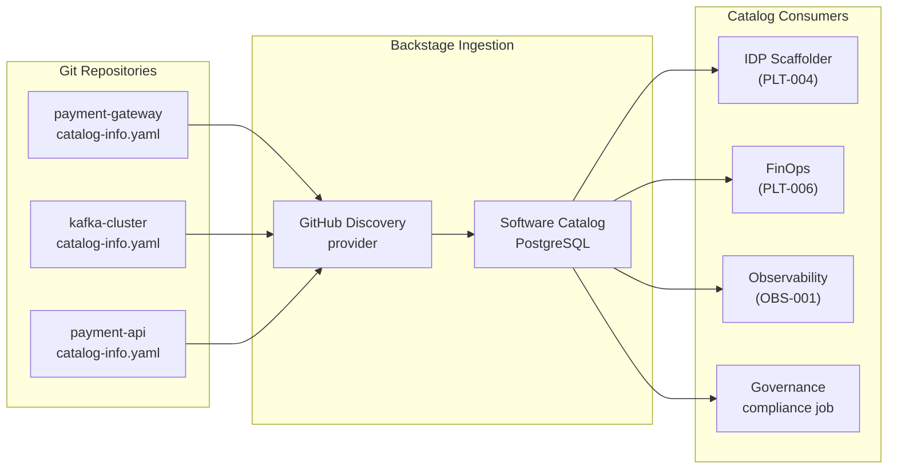

# Platform Service Catalog

Status: Draft | Last Reviewed: 2026-05-26 | Owner: @ea-board
Catalog ID: PLT-007 | Radii
Tier Applicability: T0, T1, T2

## Problem Statement

Engineering teams at the bank duplicate infrastructure provisioning work because there is no authoritative registry of what platform capabilities already exist. Team A builds a rate-limiter middleware; Team B builds an identical one six months later because they did not know Team A's existed. The payments team integrates directly with NAPAS using a bespoke adapter; the cards team builds a different adapter for the same NAPAS endpoint. The result is three partial implementations of the same capability, each with slightly different error handling, none of them compliant with the approved integration pattern (INT-005).

Incident management suffers equally: when the payment gateway degrades, the on-call engineer must search Confluence, ask in Slack, and check three different monitoring dashboards to answer "which downstream services does payment-gateway depend on?" There is no machine-readable dependency graph. The SBV change management examination asks "list all components of the payment processing system and their owners" — the answer requires a manual audit of git repositories, Jira projects, and Confluence pages, taking 3 days.

## Context

The Platform Service Catalog is the authoritative, machine-readable registry of all software components, APIs, infrastructure resources, and their relationships. It is implemented as the Backstage software catalog (PLT-004) with a structured `catalog-info.yaml` schema that every component, API, and resource in the estate must have. The catalog is the source of truth for: component ownership, tier classification, lifecycle stage, on-call rotation, SLO targets, dependency graph (consumesApis, dependsOn), API contract location, and runbook URL.

The catalog feeds: the IDP scaffolder (PLT-004) for self-service provisioning, the FinOps cost allocation (PLT-006) for cost attribution, the observability stack (OBS-001) for service-to-service trace context, and the GitOps pipeline (PLT-003) for deployment metadata. It is the single pane of glass for platform governance.

## Solution

Every deployable component, API, and infrastructure resource must have a `catalog-info.yaml` committed to its git repository root. The Backstage github-discovery provider continuously ingests these files and populates the software catalog. Ownership is defined by `spec.owner` pointing to a Group entity (team); on-call rotation is linked via the PagerDuty annotation. The dependency graph is declared in `spec.consumesApis` and `spec.dependsOn`. A nightly compliance job asserts that 100% of T0/T1 components have all mandatory catalog fields populated and that no component has been in `lifecycle: experimental` for more than 90 days without a promotion or deprecation decision.



## Implementation Guidelines

**1. Component catalog-info.yaml — T0 service (payment-gateway)**

```yaml
# payment-gateway/catalog-info.yaml
apiVersion: backstage.io/v1alpha1
kind: Component
metadata:
  name: payment-gateway
  title: Payment Gateway
  description: |
    Core payment switching service. Routes domestic and international payment
    instructions to NAPAS, SWIFT, and card network adapters.
  annotations:
    github.com/project-slug: org/payment-gateway
    backstage.io/techdocs-ref: dir:.
    backstage.io/kubernetes-id: payment-gateway
    argocd/app-name: payment-gateway-prod
    prometheus.io/scrape: "true"
    pagerduty.com/integration-key: ${PAGERDUTY_PAYMENT_GATEWAY_KEY}
    sonarqube.org/project-key: payment-gateway
    # FinOps tags mirrored from Helm values for catalog cost attribution
    cost-centre: "CC-1042"
    slo/availability-target: "99.99"
    slo/latency-target-p99-ms: "300"
  tags: [t0, payments, critical, napas, swift]
  links:
    - url: https://grafana.internal/d/payment-gateway/slo
      title: SLO Dashboard
      icon: dashboard
    - url: https://backstage.internal/docs/payment-gateway
      title: Runbook
      icon: docs
spec:
  type: service
  owner: group:payments-engineering
  lifecycle: production
  system: payment-processing-system
  dependsOn:
    - resource:kafka-prod
    - component:vault-prod
    - component:napas-adapter
  consumesApis:
    - napas-domestic-api
    - swift-mx-api
  providesApis:
    - payment-gateway-v2-api
```

**2. API catalog-info.yaml — payment-gateway-v2-api**

```yaml
# payment-gateway/api/catalog-info.yaml
apiVersion: backstage.io/v1alpha1
kind: API
metadata:
  name: payment-gateway-v2-api
  title: Payment Gateway API v2
  description: REST API for initiating and querying payment instructions
  annotations:
    backstage.io/techdocs-ref: dir:.
  tags: [rest, openapi, payments, t0]
spec:
  type: openapi
  owner: group:payments-engineering
  lifecycle: production
  system: payment-processing-system
  definition:
    $text: https://github.com/org/payment-gateway/blob/main/api/openapi.yaml
```

**3. Resource catalog-info.yaml — Kafka cluster**

```yaml
# infrastructure/kafka/catalog-info.yaml
apiVersion: backstage.io/v1alpha1
kind: Resource
metadata:
  name: kafka-prod
  title: Kafka Production Cluster
  description: 9-broker Kafka cluster for event streaming in the banking-prod namespace
  annotations:
    cost-centre: "CC-PLATFORM"
  tags: [kafka, messaging, t0, platform]
spec:
  type: messaging
  owner: group:platform-engineering
  lifecycle: production
  system: banking-platform
  dependsOn:
    - resource:eks-prod-cluster
```

**4. Nightly catalog compliance job**

```python
# scripts/catalog-compliance-check.py
"""Assert all T0/T1 components have mandatory catalog fields populated."""
import requests, sys

BACKSTAGE_URL = "http://backstage.internal"
MANDATORY_ANNOTATIONS = [
    "pagerduty.com/integration-key",
    "slo/availability-target",
    "cost-centre",
    "argocd/app-name",
]
CRITICAL_TIERS = {"t0", "t1"}

resp = requests.get(
    f"{BACKSTAGE_URL}/api/catalog/entities",
    params={"filter": "kind=Component,spec.lifecycle=production"},
    headers={"Authorization": f"Bearer {BACKSTAGE_TOKEN}"},
)
resp.raise_for_status()
entities = resp.json()

violations = []
for entity in entities:
    tags = set(entity.get("metadata", {}).get("tags", []))
    if not tags.intersection(CRITICAL_TIERS):
        continue  # skip T2 components

    name = entity["metadata"]["name"]
    annotations = entity.get("metadata", {}).get("annotations", {})
    missing = [a for a in MANDATORY_ANNOTATIONS if a not in annotations]
    if missing:
        violations.append(f"{name}: missing {missing}")

    # Check experimental lifecycle age
    if entity.get("spec", {}).get("lifecycle") == "experimental":
        violations.append(f"{name}: T0/T1 component still in experimental lifecycle")

if violations:
    print("CATALOG COMPLIANCE FAILURES:")
    for v in violations:
        print(f"  - {v}")
    sys.exit(1)

print(f"OK: {len(entities)} T0/T1 production components — all compliant")
```

## When to Use

- Any organisation with more than 20 deployable services where ownership, dependencies, and runbooks are scattered across Confluence, Slack, and tribal knowledge
- When incident triage requires more than 5 minutes to answer "who owns this service and what does it depend on?"
- When SBV or BCBS 230 examinations require a machine-readable inventory of all critical system components and their owners
- When the platform team needs a governance enforcement point for T0/T1 component metadata standards

## When Not to Use

- Teams smaller than 5 engineers with fewer than 10 services — a shared README and a Slack channel suffice; catalog overhead exceeds benefit
- Vendor-managed SaaS products that cannot have a `catalog-info.yaml` committed — register them as `Resource` entities manually via the Backstage UI, but do not attempt to automate their lifecycle management through the catalog
- Transient infrastructure (ephemeral review environments) — register the template, not each ephemeral instance

## Variants

| Variant | When to prefer | Trade-off |
|---------|----------------|-----------|
| Backstage software catalog (this pattern) | Teams already using Backstage for IDP scaffolder and TechDocs | Single platform for catalog + IDP + docs; operational overhead is shared |
| ServiceNow CMDB | Enterprises with existing ITSM investment requiring ServiceNow integration | Better ITSM workflow integration; significantly higher licensing cost; less developer-friendly |
| OpsLevel | Teams wanting a turnkey service catalog without Backstage complexity | SaaS vendor dependency; limited customisation; monthly per-seat cost |
| Custom YAML registry in git | Very small teams wanting a simple, no-infrastructure solution | Does not scale; no UI; no machine-readable API for consumers |

## NFR Acceptance Criteria

```yaml
nfr_acceptance_criteria:
  catalog_id: PLT-007
  pattern: Platform Service Catalog
  performance:
    - id: PLT-007-HP-01
      description: Backstage catalog entity list API must return all 500+ components in under 3 seconds at p95.
      threshold: catalog_list_api_p95 < 3s
    - id: PLT-007-HP-02
      description: GitHub Discovery provider must ingest a new catalog-info.yaml within 5 minutes of it being merged to the default branch.
      threshold: catalog_ingestion_latency < 5 min
  compliance:
    - id: PLT-007-COMP-01
      description: 100% of T0/T1 production components must have all 4 mandatory annotations (PagerDuty key, SLO target, cost-centre, ArgoCD app name) populated — validated nightly.
      threshold: 0 T0/T1 components with missing mandatory annotations
    - id: PLT-007-COMP-02
      description: No T0/T1 component may remain in lifecycle=experimental for more than 90 days without a documented promotion or deprecation decision.
      threshold: 0 T0/T1 components in experimental lifecycle > 90 days
```

## Compliance Mapping

| Ring | Regulation | Provision | How this pattern satisfies |
|------|-----------|-----------|---------------------------|
| Ring 0 | CNCF Platform Engineering Maturity Model | Level 3 — Scalable: authoritative service registry with ownership, lifecycle, and dependency tracking | Backstage software catalog implements the Level 3 service registry requirement; dependency graph (`consumesApis`, `dependsOn`) is machine-readable and continuously reconciled from git |
| Ring 1 | BCBS 230 | Principle 6 — data and IT infrastructure inventory: all components of critical systems must be inventoried with owners | Software catalog constitutes the IT asset inventory for BCBS 230; nightly compliance job asserts T0/T1 completeness; catalog records are retained in PostgreSQL with event history |
| Ring 2 | SBV Circular 09/2020 | §III.1 — IT asset inventory and classification for licensed credit institutions | Every catalog entity has a `tier` tag (T0/T1/T2) constituting the asset classification required by §III.1; the catalog API provides the machine-readable inventory export required for SBV examination evidence ⚠️ (working summary — pending Legal review) |

## Cost / FinOps Notes

- Backstage: shared with PLT-004 (IDP); no additional infrastructure cost beyond the existing 2-pod Deployment + PostgreSQL RDS
- GitHub Discovery scanning: GitHub API calls at ~1 request per repository per 5 minutes; at 500 repos = 100 requests/min; well within GitHub Enterprise rate limits (5,000 requests/hour per installation)
- Nightly compliance job: ~2 minutes Python execution on shared Airflow workers = negligible compute cost
- Operational savings: incident triage time reduction from 30 minutes to 5 minutes (finding owner + runbook) × 5 incidents/month × 5 team members = 12.5 engineer-hours/month saved

## Threat Model

**Ownership Spoofing — false team assignment in catalog-info.yaml (Repudiation)**: a developer changes `spec.owner` in their service's `catalog-info.yaml` to point to a different team's Group entity. Incident alerts for that service now go to the wrong on-call rotation. Mitigation: CODEOWNERS enforces that changes to `catalog-info.yaml` for any T0/T1 component require approval from the current `spec.owner` team lead; the nightly compliance job alerts if a T0/T1 component's `spec.owner` does not match the PagerDuty schedule owner; PagerDuty integration is validated against the HR system roster via a weekly reconciliation job.

**Stale Catalog Entry — decommissioned service still showing as active (Information Disclosure)**: a decommissioned payment adapter remains in the catalog with `lifecycle: production` because the decommission PR forgot to update `catalog-info.yaml`. Engineers assume the service is available and attempt to integrate with it; the NAPAS adapter endpoints are actually responding from a dev cluster that was never decommissioned. Mitigation: the GitOps decommission workflow (ArgoCD Application deletion) includes a mandatory step to update `catalog-info.yaml` to `lifecycle: deprecated` with a `decommissionDate` annotation; the ArgoCD pre-delete hook fails if the catalog entry has not been updated; decommission checklist is enforced in the PR template.

## Operational Runbook (stub)

1. Alert: CatalogIngestionStaleness — fires when the Backstage catalog has not processed a new entity refresh in 30 minutes. p50 resolution: 10 min; p99: 45 min. Check the Backstage catalog logs: `kubectl logs -n backstage -l app=backstage --tail=200 | grep -i "github-discovery"`. Common causes: GitHub API token expired (rotate in Vault at `secret/data/platform/backstage/github-token`); Backstage pod OOM (check pod events); GitHub Enterprise rate limit hit (check `X-RateLimit-Remaining` header). Trigger a manual catalog refresh via the Backstage UI: Admin → Catalog → Refresh all.

2. Alert: CatalogComplianceFailure — fires when the nightly compliance job reports any T0/T1 component with missing mandatory annotations. p50 resolution: 1 day (requires team action); p99: 5 days. The compliance job output lists affected components and missing fields. Notify the component owner via Slack using the catalog `spec.owner` field: `curl -X POST https://slack.com/api/chat.postMessage -d "channel=@{owner_team}&text=Your T0 component {name} is missing catalog annotations: {missing}"`. If the owner does not resolve within 3 business days, escalate to the EA board for governance enforcement.

## Test Strategy

**Unit**: `CatalogSchemaTest` — validate a set of sample `catalog-info.yaml` files against the Backstage entity schema (using `@backstage/catalog-model` validator); assert a Component without `spec.owner` fails validation; assert a T0 Component without the mandatory annotations fails the compliance script; assert a well-formed T0 Component passes both.

**Integration**: Deploy Backstage in a `kind` cluster with GitHub Discovery pointing to a test repository; commit a `catalog-info.yaml` to the test repo; assert the entity appears in the Backstage catalog API within 5 minutes; update the `catalog-info.yaml` to change `spec.lifecycle` from `experimental` to `production`; assert the catalog entity reflects the update within 5 minutes.

**Compliance**: `OwnershipGraphTest` — query the catalog API for all T0 Components; for each, resolve `spec.owner` to a Group entity; assert the Group entity has at least one member; assert the Group entity has a `pagerduty.com/service-id` annotation; assert no T0 Component has `spec.owner: group:unknown`.

**Chaos**: Delete the Backstage PostgreSQL database and restore from the previous day's RDS snapshot; assert the catalog repopulates from GitHub Discovery within 15 minutes without manual intervention; assert all T0 component entries are restored with their correct annotations.

## Related Patterns

- [PLT-004 Internal Developer Platform](internal-developer-platform.md) — Backstage catalog is the shared infrastructure for both IDP scaffolder and platform service catalog
- [PLT-006 FinOps Cost Allocation](finops-cost-allocation.md) — catalog `cost-centre` annotation feeds the FinOps cost attribution pipeline
- [PLT-003 GitOps Deployment Pipeline](gitops-deployment-pipeline.md) — catalog `argocd/app-name` annotation links each component to its ArgoCD Application
- [OBS-003 SLO Alerting](../observability/slo-alerting.md) — catalog `slo/availability-target` annotation is the authoritative SLO target consumed by the SLO alerting pipeline
- [SEC-010 Attribute-Based Access Control](../security/attribute-based-access-control.md) — catalog tier tags (T0/T1/T2) feed the ABAC policy engine for access control decisions

## References

- Backstage documentation — software catalog schema and GitHub Discovery provider
- CNCF Platform Engineering Maturity Model v1.0
- BCBS 230 Sound Practices for the Management and Supervision of Operational Risk
- SBV Circular 09/2020 — Information System Security for Credit Institutions
- FinOps Foundation — Service Catalog as a FinOps enabler

---
**Key Takeaway**: Every component, API, and resource in the banking estate must have a `catalog-info.yaml` committed to git and ingested by Backstage — so ownership, dependencies, SLO targets, and on-call rotations are machine-readable, searchable, and compliance-auditable from a single authoritative registry.
